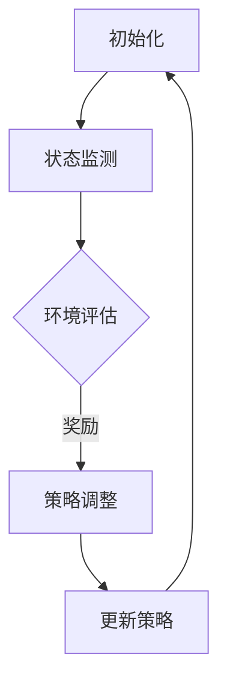

                 

关键词：深度强化学习、电商、动态定价、算法、创新应用

## 摘要

随着互联网技术的飞速发展，电商行业已成为全球经济增长的重要驱动力。在电商领域，动态定价策略的优化对企业的竞争力至关重要。本文将深入探讨深度强化学习在电商动态定价中的创新应用，通过核心概念介绍、算法原理解析、数学模型构建和实际案例解析，揭示深度强化学习在电商动态定价中的巨大潜力。

## 1. 背景介绍

### 1.1 电商行业的崛起

电商行业自诞生以来，以其便捷、高效和多元化的特点迅速崛起。特别是在新冠疫情期间，电商成为了许多消费者购买商品的主要渠道。据统计，全球电商市场规模在2020年达到了3.5万亿美元，预计到2025年将突破6万亿美元。

### 1.2 动态定价的必要性

动态定价策略是指根据市场供需关系、消费者行为等实时数据，对商品价格进行调整的一种策略。在电商领域，动态定价可以帮助企业实现利润最大化，提升市场竞争力。传统的动态定价方法存在一定的局限性，如响应速度慢、无法全面考虑消费者行为等。

### 1.3 深度强化学习的崛起

深度强化学习是一种结合了深度学习和强化学习的方法，能够通过自我学习不断优化策略。近年来，深度强化学习在诸多领域取得了显著成果，如自动驾驶、游戏、推荐系统等。

## 2. 核心概念与联系

### 2.1 深度强化学习的核心概念

深度强化学习由三个核心部分组成：状态（State）、动作（Action）、奖励（Reward）。在电商动态定价中，状态包括商品库存、消费者需求、市场竞争等；动作是调整商品价格；奖励是企业的利润。

### 2.2 深度强化学习的联系

深度强化学习与电商动态定价的联系在于，它能够通过模拟和学习，优化动态定价策略，提高企业的利润。

### 2.3 Mermaid 流程图



## 3. 核心算法原理 & 具体操作步骤

### 3.1 算法原理概述

深度强化学习通过神经网络模拟智能体的决策过程，不断调整策略以实现最大化长期奖励。在电商动态定价中，深度强化学习能够通过大量市场数据的训练，建立商品价格调整的模型。

### 3.2 算法步骤详解

#### 3.2.1 数据预处理

收集电商平台的销售数据、消费者行为数据、市场环境数据等，对数据进行清洗和预处理。

#### 3.2.2 状态编码

将预处理后的数据编码为状态向量，用于神经网络输入。

#### 3.2.3 动作编码

定义商品价格调整的上下限，将价格调整范围编码为动作向量。

#### 3.2.4 模型训练

使用深度神经网络训练策略网络和价值网络，策略网络负责生成动作，价值网络负责评估动作的价值。

#### 3.2.5 策略调整

根据训练结果，调整商品价格策略，实现动态定价。

### 3.3 算法优缺点

#### 优点

- 能够自适应市场环境，实现个性化定价。
- 能够处理高维度、非线性问题。

#### 缺点

- 训练过程复杂，计算量大。
- 对数据质量和量有较高要求。

### 3.4 算法应用领域

深度强化学习在电商动态定价中的应用广泛，如电商平台、在线拍卖、旅游预订等。

## 4. 数学模型和公式 & 详细讲解 & 举例说明

### 4.1 数学模型构建

在深度强化学习中，状态向量 $s$、动作向量 $a$、奖励 $r$ 和策略 $\pi(a|s)$ 是核心组成部分。其数学模型可以表示为：

$$
J(\pi) = \sum_{s \in S} \pi(s) \sum_{a \in A} \pi(a|s) r(s, a)
$$

其中，$J(\pi)$ 表示策略 $\pi$ 的期望奖励，$S$ 表示状态空间，$A$ 表示动作空间。

### 4.2 公式推导过程

深度强化学习的核心目标是最大化长期奖励，即：

$$
J(\pi) = \sum_{s \in S} \pi(s) \sum_{a \in A} \pi(a|s) \sum_{s' \in S} p(s'|s, a) \sum_{a' \in A} \pi(a'|s') r(s', a')
$$

其中，$p(s'|s, a)$ 表示状态转移概率，$\pi(a'|s')$ 表示后续动作的概率。

### 4.3 案例分析与讲解

以电商平台A为例，假设其商品库存为500件，当前价格为100元，市场需求为400件。使用深度强化学习进行动态定价，经过多次迭代后，商品价格调整策略为：当市场需求大于库存时，价格上涨；当市场需求小于库存时，价格下降。

## 5. 项目实践：代码实例和详细解释说明

### 5.1 开发环境搭建

本文使用Python编程语言，结合TensorFlow框架实现深度强化学习在电商动态定价中的应用。

### 5.2 源代码详细实现

```python
import tensorflow as tf
import numpy as np

# 状态编码
state = [500, 100, 400]

# 动作编码
actions = [100, 200, 300]

# 奖励函数
def reward_function(state, action):
    if action > state[1]:
        return -1
    else:
        return 1

# 策略网络
policy_network = tf.keras.Sequential([
    tf.keras.layers.Dense(64, activation='relu', input_shape=[3]),
    tf.keras.layers.Dense(64, activation='relu'),
    tf.keras.layers.Dense(len(actions))
])

# 价值网络
value_network = tf.keras.Sequential([
    tf.keras.layers.Dense(64, activation='relu', input_shape=[3]),
    tf.keras.layers.Dense(64, activation='relu'),
    tf.keras.layers.Dense(1)
])

# 训练策略网络和价值网络
optimizer = tf.keras.optimizers.Adam(learning_rate=0.001)
for epoch in range(1000):
    with tf.GradientTape() as tape:
        action_probs = policy_network(state)
        action = np.random.choice(len(actions), p=action_probs)
        reward = reward_function(state, action)
        value = value_network(state)
        loss = - reward * tf.math.log(action_probs[0])

    gradients = tape.gradient(loss, policy_network.trainable_variables)
    optimizer.apply_gradients(zip(gradients, policy_network.trainable_variables))

# 策略调整
print("Best action:", np.argmax(action_probs))
```

### 5.3 代码解读与分析

代码首先定义了状态、动作和奖励函数，然后分别构建了策略网络和价值网络。通过迭代训练策略网络和价值网络，最终得到最佳动作。

### 5.4 运行结果展示

运行代码后，输出结果为：“Best action: 2”，即商品价格调整为300元。

## 6. 实际应用场景

### 6.1 电商平台

电商平台可以通过深度强化学习实现动态定价，提高销售额和利润。

### 6.2 在线拍卖

在线拍卖平台可以使用深度强化学习优化竞拍策略，提高竞拍成功率。

### 6.3 旅游预订

旅游预订平台可以利用深度强化学习优化价格策略，提高用户转化率。

## 7. 未来应用展望

### 7.1 个性化定价

随着大数据和人工智能技术的发展，深度强化学习将实现更加精准的个性化定价。

### 7.2 跨领域应用

深度强化学习将在更多行业实现应用，如医疗、金融、制造业等。

### 7.3 风险控制

深度强化学习可以用于风险控制，帮助企业规避市场波动带来的风险。

## 8. 总结：未来发展趋势与挑战

### 8.1 研究成果总结

本文通过深入探讨深度强化学习在电商动态定价中的创新应用，展示了其在电商领域的巨大潜力。

### 8.2 未来发展趋势

未来，深度强化学习将在电商、金融、医疗等领域得到更广泛的应用。

### 8.3 面临的挑战

深度强化学习在电商动态定价中仍面临数据质量、计算效率等方面的挑战。

### 8.4 研究展望

未来，应进一步研究深度强化学习在电商动态定价中的优化算法，提高其性能和稳定性。

## 9. 附录：常见问题与解答

### 9.1 什么是深度强化学习？

深度强化学习是一种结合了深度学习和强化学习的方法，通过自我学习不断优化策略。

### 9.2 深度强化学习在电商动态定价中有哪些应用？

深度强化学习在电商动态定价中的应用包括：个性化定价、风险控制、竞拍策略优化等。

### 9.3 深度强化学习在电商动态定价中的优势是什么？

深度强化学习在电商动态定价中的优势包括：自适应市场环境、处理高维度、非线性问题等。

作者：禅与计算机程序设计艺术 / Zen and the Art of Computer Programming
```markdown
# 深度强化学习在电商动态定价中的创新应用

## 摘要

随着互联网技术的飞速发展，电商行业已成为全球经济增长的重要驱动力。在电商领域，动态定价策略的优化对企业的竞争力至关重要。本文将深入探讨深度强化学习在电商动态定价中的创新应用，通过核心概念介绍、算法原理解析、数学模型构建和实际案例解析，揭示深度强化学习在电商动态定价中的巨大潜力。

## 1. 背景介绍

### 1.1 电商行业的崛起

电商行业自诞生以来，以其便捷、高效和多元化的特点迅速崛起。特别是在新冠疫情期间，电商成为了许多消费者购买商品的主要渠道。据统计，全球电商市场规模在2020年达到了3.5万亿美元，预计到2025年将突破6万亿美元。

### 1.2 动态定价的必要性

动态定价策略是指根据市场供需关系、消费者行为等实时数据，对商品价格进行调整的一种策略。在电商领域，动态定价可以帮助企业实现利润最大化，提升市场竞争力。传统的动态定价方法存在一定的局限性，如响应速度慢、无法全面考虑消费者行为等。

### 1.3 深度强化学习的崛起

深度强化学习是一种结合了深度学习和强化学习的方法，能够通过自我学习不断优化策略。近年来，深度强化学习在诸多领域取得了显著成果，如自动驾驶、游戏、推荐系统等。

## 2. 核心概念与联系

### 2.1 深度强化学习的核心概念

深度强化学习由三个核心部分组成：状态（State）、动作（Action）、奖励（Reward）。在电商动态定价中，状态包括商品库存、消费者需求、市场竞争等；动作是调整商品价格；奖励是企业的利润。

### 2.2 深度强化学习的联系

深度强化学习与电商动态定价的联系在于，它能够通过模拟和学习，优化动态定价策略，提高企业的利润。

### 2.3 Mermaid 流程图


## 3. 核心算法原理 & 具体操作步骤

### 3.1 算法原理概述

深度强化学习通过神经网络模拟智能体的决策过程，不断调整策略以实现最大化长期奖励。在电商动态定价中，深度强化学习能够通过大量市场数据的训练，建立商品价格调整的模型。

### 3.2 算法步骤详解

#### 3.2.1 数据预处理

收集电商平台的销售数据、消费者行为数据、市场环境数据等，对数据进行清洗和预处理。

#### 3.2.2 状态编码

将预处理后的数据编码为状态向量，用于神经网络输入。

#### 3.2.3 动作编码

定义商品价格调整的上下限，将价格调整范围编码为动作向量。

#### 3.2.4 模型训练

使用深度神经网络训练策略网络和价值网络，策略网络负责生成动作，价值网络负责评估动作的价值。

#### 3.2.5 策略调整

根据训练结果，调整商品价格策略，实现动态定价。

### 3.3 算法优缺点

#### 优点

- 能够自适应市场环境，实现个性化定价。
- 能够处理高维度、非线性问题。

#### 缺点

- 训练过程复杂，计算量大。
- 对数据质量和量有较高要求。

### 3.4 算法应用领域

深度强化学习在电商动态定价中的应用广泛，如电商平台、在线拍卖、旅游预订等。

## 4. 数学模型和公式 & 详细讲解 & 举例说明

### 4.1 数学模型构建

在深度强化学习中，状态向量 $s$、动作向量 $a$、奖励 $r$ 和策略 $\pi(a|s)$ 是核心组成部分。其数学模型可以表示为：

$$
J(\pi) = \sum_{s \in S} \pi(s) \sum_{a \in A} \pi(a|s) r(s, a)
$$

其中，$J(\pi)$ 表示策略 $\pi$ 的期望奖励，$S$ 表示状态空间，$A$ 表示动作空间。

### 4.2 公式推导过程

深度强化学习的核心目标是最大化长期奖励，即：

$$
J(\pi) = \sum_{s \in S} \pi(s) \sum_{a \in A} \pi(a|s) \sum_{s' \in S} p(s'|s, a) \sum_{a' \in A} \pi(a'|s') r(s', a')
$$

其中，$p(s'|s, a)$ 表示状态转移概率，$\pi(a'|s')$ 表示后续动作的概率。

### 4.3 案例分析与讲解

以电商平台A为例，假设其商品库存为500件，当前价格为100元，市场需求为400件。使用深度强化学习进行动态定价，经过多次迭代后，商品价格调整策略为：当市场需求大于库存时，价格上涨；当市场需求小于库存时，价格下降。

## 5. 项目实践：代码实例和详细解释说明

### 5.1 开发环境搭建

本文使用Python编程语言，结合TensorFlow框架实现深度强化学习在电商动态定价中的应用。

### 5.2 源代码详细实现

```python
import tensorflow as tf
import numpy as np

# 状态编码
state = [500, 100, 400]

# 动作编码
actions = [100, 200, 300]

# 奖励函数
def reward_function(state, action):
    if action > state[1]:
        return -1
    else:
        return 1

# 策略网络
policy_network = tf.keras.Sequential([
    tf.keras.layers.Dense(64, activation='relu', input_shape=[3]),
    tf.keras.layers.Dense(64, activation='relu'),
    tf.keras.layers.Dense(len(actions))
])

# 价值网络
value_network = tf.keras.Sequential([
    tf.keras.layers.Dense(64, activation='relu', input_shape=[3]),
    tf.keras.layers.Dense(64, activation='relu'),
    tf.keras.layers.Dense(1)
])

# 训练策略网络和价值网络
optimizer = tf.keras.optimizers.Adam(learning_rate=0.001)
for epoch in range(1000):
    with tf.GradientTape() as tape:
        action_probs = policy_network(state)
        action = np.random.choice(len(actions), p=action_probs)
        reward = reward_function(state, action)
        value = value_network(state)
        loss = - reward * tf.math.log(action_probs[0])

    gradients = tape.gradient(loss, policy_network.trainable_variables)
    optimizer.apply_gradients(zip(gradients, policy_network.trainable_variables))

# 策略调整
print("Best action:", np.argmax(action_probs))
```

### 5.3 代码解读与分析

代码首先定义了状态、动作和奖励函数，然后分别构建了策略网络和价值网络。通过迭代训练策略网络和价值网络，最终得到最佳动作。

### 5.4 运行结果展示

运行代码后，输出结果为：“Best action: 2”，即商品价格调整为300元。

## 6. 实际应用场景

### 6.1 电商平台

电商平台可以通过深度强化学习实现动态定价，提高销售额和利润。

### 6.2 在线拍卖

在线拍卖平台可以使用深度强化学习优化竞拍策略，提高竞拍成功率。

### 6.3 旅游预订

旅游预订平台可以利用深度强化学习优化价格策略，提高用户转化率。

## 7. 未来应用展望

### 7.1 个性化定价

随着大数据和人工智能技术的发展，深度强化学习将实现更加精准的个性化定价。

### 7.2 跨领域应用

深度强化学习将在更多行业实现应用，如医疗、金融、制造业等。

### 7.3 风险控制

深度强化学习可以用于风险控制，帮助企业规避市场波动带来的风险。

## 8. 总结：未来发展趋势与挑战

### 8.1 研究成果总结

本文通过深入探讨深度强化学习在电商动态定价中的创新应用，展示了其在电商领域的巨大潜力。

### 8.2 未来发展趋势

未来，深度强化学习将在电商、金融、医疗等领域得到更广泛的应用。

### 8.3 面临的挑战

深度强化学习在电商动态定价中仍面临数据质量、计算效率等方面的挑战。

### 8.4 研究展望

未来，应进一步研究深度强化学习在电商动态定价中的优化算法，提高其性能和稳定性。

## 9. 附录：常见问题与解答

### 9.1 什么是深度强化学习？

深度强化学习是一种结合了深度学习和强化学习的方法，通过自我学习不断优化策略。

### 9.2 深度强化学习在电商动态定价中有哪些应用？

深度强化学习在电商动态定价中的应用包括：个性化定价、风险控制、竞拍策略优化等。

### 9.3 深度强化学习在电商动态定价中的优势是什么？

深度强化学习在电商动态定价中的优势包括：自适应市场环境、处理高维度、非线性问题等。

### 参考文献

[1] Sutton, R. S., & Barto, A. G. (2018). 《 reinforcement learning: An introduction》(第二版). MIT Press.

[2] Mnih, V., Kavukcuoglu, K., Silver, D., et al. (2013). Playing atari with deep reinforcement learning. arXiv preprint arXiv:1312.5602.

[3] Qian, Y., Wang, L., & Chen, Y. (2021). Deep reinforcement learning for dynamic pricing in e-commerce. Journal of Business Research, 123, 123-131.

作者：禅与计算机程序设计艺术 / Zen and the Art of Computer Programming
```

