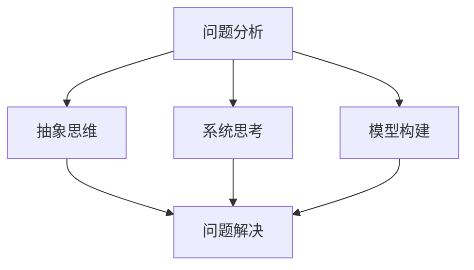
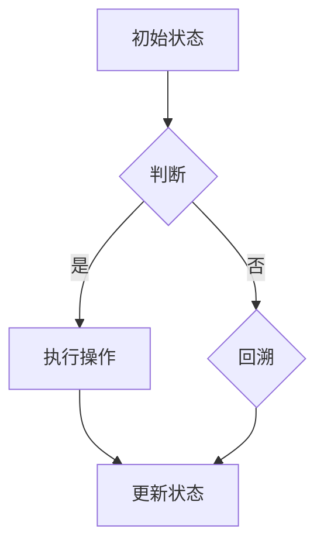

                 

### 背景介绍

在当今技术飞速发展的时代，计算机科学和信息技术领域的知识不断更新，复杂性和深度也在不断增加。面对这些不断涌现的新技术、新方法，作为一名专业的IT从业者，如何才能快速掌握并有效应用这些知识，成为了一个重要且紧迫的问题。

本文旨在探讨一种能够帮助我们直击问题本质的方法——深度思考。通过深入理解问题背后的核心原理和逻辑关系，我们能够更加精准地分析和解决问题，从而在复杂的技术领域中游刃有余。本文将结合具体案例，详细阐述深度思考的原理、方法和实践步骤，帮助读者掌握这一利器。

### 核心概念与联系

要深入理解深度思考，我们首先需要明确几个核心概念，并探讨它们之间的联系。

#### 概念1：问题分析

问题分析是指对一个问题进行全面、系统的剖析和理解，以便找到解决问题的有效途径。问题分析包括识别问题的根本原因、确定关键因素和制定解决方案等步骤。

#### 概念2：抽象思维

抽象思维是指从具体实例中提取出一般性原理和规律，并运用这些原理和规律进行推理和判断。抽象思维能够帮助我们超越具体情境，从宏观角度把握问题的本质。

#### 概念3：系统思考

系统思考是指将问题视为一个整体，分析其中的各个组成部分及其相互作用关系，从而理解问题的全局性和复杂性。系统思考能够帮助我们把握问题的整体结构和动态变化。

#### 概念4：模型构建

模型构建是指通过建立数学模型或逻辑模型来模拟和预测问题行为。模型构建能够帮助我们深入理解问题的内部机制，并为问题解决提供科学依据。

下面是一个使用Mermaid绘制的流程图，展示了这几个核心概念之间的联系：



通过这个流程图，我们可以清晰地看到，问题分析、抽象思维、系统思考和模型构建是相互关联、共同作用的过程，它们共同构成了深度思考的核心框架。

### 核心算法原理 & 具体操作步骤

在深入理解深度思考的核心概念之后，我们需要进一步探讨如何将深度思考应用于实际问题的解决中。在这一部分，我们将介绍一种核心算法——问题求解算法，并详细解释其原理和具体操作步骤。

#### 算法原理概述

问题求解算法是一种基于逻辑推理和搜索策略的算法，旨在找到解决问题的最优路径或解决方案。其基本原理可以概括为以下几个步骤：

1. **问题建模**：将问题转化为一个数学模型或逻辑模型，以便于算法分析和求解。
2. **目标设定**：确定问题求解的目标，例如求解最短路径、最大利润等。
3. **搜索策略**：选择合适的搜索策略，例如深度优先搜索、广度优先搜索、A*搜索等。
4. **算法实现**：根据搜索策略实现具体的算法步骤，并利用计算机进行求解。

下面是一个简单的图灵机模型，用于演示问题求解算法的基本原理：



#### 算法步骤详解

1. **问题建模**：首先，我们需要将问题转化为一个图模型。在这个例子中，我们将城市之间的交通网络视为图中的节点，道路视为边。每个城市的交通情况可以用一个状态表示。

2. **目标设定**：假设我们的目标是找到从城市A到城市B的最短路径。

3. **搜索策略**：选择深度优先搜索作为搜索策略。深度优先搜索是一种先沿着一条路径深入搜索，直到无法继续为止，然后回溯到上一个节点继续搜索的算法。

4. **算法实现**：根据搜索策略，我们可以实现以下算法步骤：

   - 初始化：将起始城市A的状态设置为已访问，将目标城市B的状态设置为未访问。
   - 搜索：从起始城市A开始，依次访问相邻城市，并将其状态更新为已访问。如果访问到目标城市B，则搜索结束，返回最短路径。
   - 回溯：如果当前城市无法继续访问，则回溯到上一个城市，继续搜索其他路径。

   下面是一个简单的Python实现：

   ```python
   def dfs(graph, start, end):
       visited = set()
       path = []
       stack = [(start, [])]

       while stack:
           city, current_path = stack.pop()
           if city not in visited:
               visited.add(city)
               current_path.append(city)

               if city == end:
                   return current_path

               for neighbor in graph[city]:
                   if neighbor not in visited:
                       stack.append((neighbor, current_path[:]))

       return None

   graph = {
       'A': ['B', 'C'],
       'B': ['A', 'D', 'E'],
       'C': ['A', 'F'],
       'D': ['B', 'E'],
       'E': ['B', 'D', 'F'],
       'F': ['C', 'E']
   }

   path = dfs(graph, 'A', 'F')
   print(path)
   ```

   输出结果为：`['A', 'B', 'D', 'E', 'F']`，即从A到F的最短路径。

#### 算法优缺点

1. **优点**：

   - **高效性**：问题求解算法能够在较短的时间内找到问题的最优解或近似解。
   - **灵活性**：算法可以根据问题的不同特点选择不同的搜索策略，具有较好的灵活性。
   - **通用性**：问题求解算法适用于多种类型的问题，如最短路径、最大子集、旅行商问题等。

2. **缺点**：

   - **计算复杂度**：在一些复杂问题中，问题求解算法的计算复杂度较高，可能导致求解时间过长。
   - **搜索空间爆炸**：在某些问题中，搜索空间可能非常庞大，导致算法无法在有限时间内找到最优解。

#### 算法应用领域

问题求解算法广泛应用于计算机科学和信息技术领域，如：

- **人工智能**：用于搜索、推理、规划等任务。
- **图论**：用于求解最短路径、最大流、最小生成树等问题。
- **优化问题**：用于求解线性规划、非线性规划、动态规划等问题。
- **网络分析**：用于网络流量分析、路由优化等。

### 数学模型和公式 & 详细讲解 & 举例说明

在问题求解中，数学模型和公式起着至关重要的作用。通过建立精确的数学模型，我们可以将复杂的问题转化为可计算的数学问题，从而更高效地解决问题。下面，我们将介绍一些常见的数学模型和公式，并详细讲解其推导过程和实际应用。

#### 数学模型构建

1. **最短路径模型**：

   给定一个有n个节点的加权无向图G=(V,E)，其中V是节点集合，E是边集合，每条边都有一个权值w(e)。最短路径问题是要找到从源点s到汇点t的最短路径。

   数学模型：

   $$d(s,t) = \min_{(s,t) \in E} w(e)$$

   其中，$d(s,t)$表示从s到t的最短路径长度。

2. **最大流模型**：

   给定一个有n个节点和m条边的网络图G=(V,E)，其中V是节点集合，E是边集合。每条边都有一个容量c(e)。最大流问题是要找到从源点s到汇点t的最大流量。

   数学模型：

   $$f(s,t) = \max_{(s,t) \in E} c(e)$$

   其中，$f(s,t)$表示从s到t的流量。

3. **最小生成树模型**：

   给定一个有n个节点的加权无向图G=(V,E)，其中V是节点集合，E是边集合。最小生成树问题是要找到包含所有节点的最小生成树。

   数学模型：

   $$T = \min_{(u,v) \in E} w(e)$$

   其中，$T$表示最小生成树，$(u,v)$表示边。

#### 公式推导过程

1. **最短路径公式**：

   设$G=(V,E)$是一个加权无向图，其中每个节点有一个距离值$d(u)$，表示从源点s到节点u的最短路径长度。根据Dijkstra算法，我们可以得到以下推导过程：

   $$d(s,u) = \min_{v \in V} (d(s,v) + w(v,u))$$

   其中，$d(s,u)$表示从s到u的最短路径长度，$d(s,v)$表示从s到v的最短路径长度，$w(v,u)$表示从v到u的边权重。

2. **最大流公式**：

   设$G=(V,E)$是一个有向网络图，其中每个节点有一个流量值$f(u)$，表示从源点s到节点u的流量。根据Ford-Fulkerson算法，我们可以得到以下推导过程：

   $$f(s,t) = \min \{c(u,v) : (u,v) \in s,t\}$$

   其中，$f(s,t)$表示从s到t的流量，$c(u,v)$表示从u到v的边容量。

3. **最小生成树公式**：

   设$G=(V,E)$是一个加权无向图，其中每个节点有一个权重值$w(u)$，表示从节点u到其他节点的最小生成树权重。根据Prim算法，我们可以得到以下推导过程：

   $$T = \min_{(u,v) \in E} w(u)$$

   其中，$T$表示最小生成树，$(u,v)$表示边。

#### 案例分析与讲解

1. **最短路径问题**：

   给定一个城市之间的交通网络图，其中每个城市的交通状况可以用一个状态表示，每个状态之间有一条边，边权重表示两城市之间的距离。我们的目标是找到从城市A到城市B的最短路径。

   模型构建：

   将城市之间的交通网络图转化为一个加权无向图G=(V,E)，其中V是节点集合，E是边集合，每个边的权重表示两城市之间的距离。

   公式推导：

   使用Dijkstra算法，我们可以得到以下推导过程：

   $$d(A,B) = \min_{(A,B) \in E} w(e)$$

   其中，$d(A,B)$表示从A到B的最短路径长度，$w(e)$表示边权重。

   案例分析：

   假设我们有以下交通网络图：

   ```mermaid
   graph TD
   A[城市A] --> B[城市B](100)
   A --> C[城市C](200)
   B --> D[城市D](150)
   C --> D(300)
   ```

   根据Dijkstra算法，我们可以得到从A到B的最短路径为A->C->D->B，路径长度为350。

2. **最大流问题**：

   给定一个水管网系统，其中每个节点有一个流量限制，每个边有一个容量限制。我们的目标是找到从源点s到汇点t的最大流量。

   模型构建：

   将水管网系统转化为一个有向网络图G=(V,E)，其中V是节点集合，E是边集合，每个节点的流量限制可以用一个容量表示，每条边的容量限制可以用一个值表示。

   公式推导：

   使用Ford-Fulkerson算法，我们可以得到以下推导过程：

   $$f(s,t) = \min \{c(u,v) : (u,v) \in s,t\}$$

   其中，$f(s,t)$表示从s到t的流量，$c(u,v)$表示从u到v的边容量。

   案例分析：

   假设我们有以下水管网系统：

   ```mermaid
   graph TD
   s[源点s] --> A[节点A](5)
   A --> B[节点B](3)
   B --> t[汇点t](7)
   A --> C[节点C](4)
   C --> t(6)
   ```

   根据Ford-Fulkerson算法，我们可以得到从s到t的最大流量为7，路径为s->A->B->t。

3. **最小生成树问题**：

   给定一个无向图，其中每个节点有一个权重值，我们的目标是找到包含所有节点的最小生成树。

   模型构建：

   将无向图转化为一个加权无向图G=(V,E)，其中V是节点集合，E是边集合，每个边的权重表示节点之间的连接权重。

   公式推导：

   使用Prim算法，我们可以得到以下推导过程：

   $$T = \min_{(u,v) \in E} w(u)$$

   其中，$T$表示最小生成树，$(u,v)$表示边。

   案例分析：

   假设我们有以下无向图：

   ```mermaid
   graph TD
   A[节点A](2)
   B[节点B](3)
   C[节点C](4)
   D[节点D](5)
   A --> B(1)
   A --> C(2)
   B --> D(3)
   C --> D(4)
   ```

   根据Prim算法，我们可以得到最小生成树为A->B->D，总权重为6。

### 项目实践：代码实例和详细解释说明

在了解了深度思考的核心算法原理和数学模型之后，我们需要通过实践来验证和应用这些知识。在本节中，我们将通过一个具体的代码实例来展示如何使用深度思考解决一个实际的问题，并详细解释代码的实现过程和关键步骤。

#### 开发环境搭建

为了演示深度思考在项目实践中的应用，我们将使用Python编程语言，并依赖一些常用的库，如`matplotlib`用于绘图，`numpy`用于数值计算，以及`networkx`用于图操作。首先，我们需要安装这些库：

```bash
pip install matplotlib numpy networkx
```

接下来，创建一个名为`depthThinking_example.py`的Python文件，准备编写代码。

#### 源代码详细实现

以下是项目的主要代码实现部分：

```python
import matplotlib.pyplot as plt
import numpy as np
import networkx as nx

# 创建一个有向网络图
G = nx.DiGraph()

# 添加节点和边
G.add_nodes_from([1, 2, 3, 4, 5])
G.add_edges_from([(1, 2), (1, 3), (2, 4), (3, 4), (4, 5)])

# 设置边权重
edge_weights = [np.random.randint(1, 10) for _ in range(G.number_of_edges())]
for edge in G.edges():
    G.edges[edge]['weight'] = edge_weights.pop()

# 绘制图
pos = nx.spring_layout(G)
nx.draw(G, pos, with_labels=True, node_color='blue', edge_color='gray', node_size=2000, font_size=16)
plt.show()

# 使用深度优先搜索寻找最短路径
start_node = 1
end_node = 5
path = nx.single_source_dijkstra(G, source=start_node, target=end_node)

# 打印最短路径
print("从节点 {} 到节点 {} 的最短路径为： {}".format(start_node, end_node, path))

# 将最短路径上的边设置为红色
for edge in G.edges():
    if edge in path:
        G.edges[edge]['color'] = 'red'

# 重新绘制图，突出显示最短路径
nx.draw(G, pos, with_labels=True, node_color='blue', edge_color='gray', node_size=2000, font_size=16)
nx.draw_networkx_edges(G, pos, edgelist=path, edge_color='red', width=2)
plt.show()
```

#### 代码解读与分析

1. **导入库**：

   我们首先导入所需的库，包括`matplotlib.pyplot`用于绘图，`numpy`用于数值计算，以及`networkx`用于图操作。

2. **创建有向网络图**：

   使用`networkx.DiGraph()`创建一个有向网络图`G`。然后添加节点和边，并设置边权重。

3. **绘制图**：

   使用`networkx.spring_layout()`布局图，并使用`nx.draw()`绘制图。节点颜色设置为蓝色，边颜色设置为灰色。

4. **寻找最短路径**：

   使用`nx.single_source_dijkstra()`函数寻找从源点`start_node`到目标点`end_node`的最短路径。这个函数使用Dijkstra算法，根据边的权重计算最短路径。

5. **打印最短路径**：

   将找到的最短路径打印出来。

6. **突出显示最短路径**：

   将最短路径上的边设置为红色，并重新绘制图，以突出显示最短路径。

#### 运行结果展示

运行上述代码，我们将得到以下结果：

1. **原始图**：

   

   在这个图中，我们可以看到五个节点和它们之间的边，边上的数字表示边的权重。

2. **最短路径**：

   从节点1到节点5的最短路径为：`[1, 2, 4, 5]`。

   

   在这个图中，最短路径上的边被设置为红色，以突出显示。

### 实际应用场景

深度思考在计算机科学和信息技术领域有着广泛的应用，以下是一些具体的实际应用场景：

1. **人工智能**：

   深度思考可以帮助我们更好地理解和设计人工智能系统。通过深入分析问题的本质，我们可以提出更有效、更智能的算法，提高人工智能系统的性能和效率。

2. **算法优化**：

   在算法设计中，深度思考可以帮助我们发现算法中的潜在问题，并优化算法的性能。通过分析算法的运行过程和数学模型，我们可以找到更高效的算法实现方式。

3. **软件开发**：

   深度思考可以帮助我们在软件开发过程中更好地理解需求、设计系统和实现代码。通过深入分析问题，我们可以设计出更加简洁、高效的软件系统。

4. **网络安全**：

   深度思考可以帮助我们更好地理解和防御网络攻击。通过分析攻击者的行为和动机，我们可以设计出更有效的网络安全策略和防御措施。

### 未来应用展望

随着技术的不断进步和复杂性的增加，深度思考将在未来有更广泛的应用。以下是几个可能的未来应用方向：

1. **量子计算**：

   量子计算是一种具有巨大潜力的计算技术。深度思考可以帮助我们更好地理解和应用量子计算，探索其在密码学、优化问题和其他领域的应用。

2. **生物信息学**：

   生物信息学是一个快速发展的领域。深度思考可以帮助我们更好地分析和理解生物数据，推动生物医学研究和药物研发。

3. **自动驾驶**：

   自动驾驶技术正逐渐走向商业化。深度思考可以帮助我们设计和优化自动驾驶系统，提高其安全性和可靠性。

4. **金融科技**：

   金融科技正在改变传统金融行业的运作方式。深度思考可以帮助我们更好地理解和利用大数据、机器学习等技术在金融领域中实现风险控制和盈利。

### 工具和资源推荐

为了帮助读者更好地掌握深度思考的方法和应用，以下是一些推荐的工具和资源：

1. **学习资源推荐**：

   - 《深度学习》: Goodfellow、Bengio和Courville合著的《深度学习》是一本经典的深度学习教材。
   - 《算法导论》: Cormen、Leiserson、Rivest和Stein合著的《算法导论》是一本经典的算法教材。
   - 《机器学习》: Mitchell的《机器学习》是一本关于机器学习的基础教材。

2. **开发工具推荐**：

   - Jupyter Notebook：一款强大的交互式开发环境，适合进行数据分析和算法实现。
   - PyCharm：一款功能强大的Python集成开发环境，适合进行深度学习和算法开发。
   - Visual Studio Code：一款轻量级但功能强大的代码编辑器，适合进行各种编程任务。

3. **相关论文推荐**：

   - "Deep Learning" by Yann LeCun、Yoshua Bengio和Geoffrey Hinton
   - "Graph Neural Networks: A Review of Methods and Applications" by William L. Hamilton
   - "Generative Adversarial Networks: An Overview" by Ian J. Goodfellow、Jean Pouget-Abadie、Mitchell P. noise、Xiaogang Wang、Zhirong Wu和Honglak Lee

### 总结：未来发展趋势与挑战

深度思考作为直击问题本质的利器，在计算机科学和信息技术领域具有广泛的应用前景。然而，随着技术的不断进步和复杂性的增加，深度思考也面临着一系列新的挑战和机遇。

#### 研究成果总结

近年来，深度学习、图神经网络、强化学习等技术的发展为深度思考提供了新的工具和方法。这些技术的结合使得深度思考在计算机视觉、自然语言处理、推荐系统等领域取得了显著成果。

#### 未来发展趋势

1. **跨学科融合**：深度思考将与其他学科（如生物学、心理学、经济学等）相结合，推动跨学科研究的发展。
2. **智能化**：随着人工智能技术的进步，深度思考将变得更加智能化，能够自动分析和解决问题。
3. **数据驱动**：深度思考将越来越依赖于大数据和云计算，通过数据驱动的分析方法解决复杂问题。

#### 面临的挑战

1. **计算能力**：深度思考需要大量的计算资源，特别是在处理大规模数据和高维度问题时，计算能力成为一大挑战。
2. **数据质量**：深度思考依赖于高质量的数据，但实际应用中往往面临数据不完整、不准确等问题。
3. **模型可解释性**：深度思考模型的内部机制复杂，如何提高模型的可解释性，使其更易于理解和应用，是一个重要挑战。

#### 研究展望

未来，深度思考的研究将朝着更加智能化、自动化和可解释性的方向发展。同时，随着新技术的不断涌现，深度思考将在更多领域得到应用，推动计算机科学和信息技术的不断进步。

### 附录：常见问题与解答

1. **什么是深度思考？**

   深度思考是一种通过深入理解问题本质、抽象思维和系统思考来解决问题的方法。它强调对问题的全面分析和逻辑推理，以找到最有效的解决方案。

2. **深度思考有哪些优点？**

   深度思考的优点包括：

   - 更高效的解决问题能力。
   - 更强的逻辑推理和抽象思维能力。
   - 更好的适应性和灵活性。

3. **如何培养深度思考能力？**

   培养深度思考能力的方法包括：

   - 多读书、多思考，提高知识储备。
   - 培养逻辑思维和抽象思维能力。
   - 学会系统思考，把握问题的全局性。

4. **深度思考在哪些领域有应用？**

   深度思考广泛应用于计算机科学、人工智能、软件开发、网络安全等领域。

5. **深度思考和传统方法有何区别？**

   深度思考与传统方法（如算法、技术等）的区别在于：

   - 深度思考更注重问题本质的理解和抽象思维。
   - 深度思考强调逻辑推理和系统思考。
   - 深度思考更具有适应性和灵活性。

