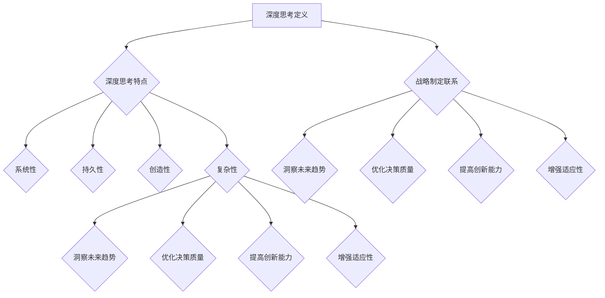

                 

关键词：战略制定、深度思考、决策优化、创新思维、企业成长、技术趋势

> 摘要：本文旨在探讨深度思考在战略制定中的作用。深度思考作为一种高级认知能力，对于企业决策者来说，不仅有助于发现潜在的问题和机会，还能优化决策过程，提升企业的创新能力和长期竞争力。文章将详细分析深度思考的概念、重要性、应用场景，并结合实际案例，探讨如何将深度思考融入战略制定，以实现企业的可持续发展。

## 1. 背景介绍

在当今快速变化和高度竞争的商业环境中，企业需要具备快速响应市场变化的能力。这要求企业在制定战略时，不仅要考虑当前的现状，还要预见未来的发展趋势，并在此基础上做出明智的决策。然而，现实情况是，许多企业在战略制定过程中往往陷入了浅层次的思维模式，无法看到更深层次的问题和机会。

深度思考作为一种深刻的、系统的、全面的思维方式，能够帮助决策者超越表面的现象，洞察问题的本质，发现隐藏的机会和挑战。它不仅是提高决策质量的重要工具，也是推动企业创新和持续发展的关键因素。

本文将围绕以下几个方面展开讨论：

- 深度思考的概念和特点
- 深度思考在战略制定中的重要性
- 深度思考的应用场景
- 如何将深度思考融入战略制定过程
- 实际案例解析：深度思考在战略制定中的应用
- 深度思考的未来趋势和挑战

通过以上内容的探讨，希望能够为企业决策者提供一些有价值的思考和方法，以更好地应对复杂多变的市场环境，实现企业的长期成功。

## 2. 核心概念与联系

### 深度思考的定义

深度思考（Deep Thinking）是指一种深入的、系统的、持久的认知过程，它涉及到对问题的深刻理解、多角度分析、复杂推理和创造性思维。深度思考不仅仅停留在表面的信息处理，而是追求对问题背后本质和规律的挖掘。

### 深度思考的特点

- **系统性**：深度思考强调从多个维度和角度对问题进行全面的分析和评估，而不是孤立地看待某一方面的信息。
- **持久性**：深度思考通常需要较长时间来完成，它不追求速度，而是追求深度和准确性。
- **创造性**：深度思考鼓励跳出传统的思维模式，寻找新的解决方案和创新的路径。
- **复杂性**：深度思考涉及到对复杂问题结构的理解和分析，它不仅仅是简单的逻辑推理，还包括对不确定性和风险因素的考虑。

### 深度思考与战略制定的联系

深度思考在战略制定中起着至关重要的作用。战略制定是一个复杂的决策过程，需要决策者具备高层次的认知能力。深度思考使得决策者能够：

- **洞察未来趋势**：通过深度思考，决策者能够看到市场的长远发展和潜在的机会与风险。
- **优化决策质量**：深度思考帮助决策者从多个角度评估各种可能的决策方案，并选择最优的方案。
- **提高创新能力**：深度思考鼓励创新思维，帮助企业找到独特的市场定位和商业模式。
- **增强适应性**：在快速变化的市场环境中，深度思考使企业能够更好地适应新的环境和需求。

### Mermaid 流程图

为了更好地理解深度思考在战略制定中的应用，我们使用Mermaid流程图来展示其核心概念和流程。



通过上述流程图，我们可以清晰地看到深度思考在战略制定中的多方面作用。接下来，我们将进一步探讨深度思考的具体应用和实践。

## 3. 核心算法原理 & 具体操作步骤

### 3.1 算法原理概述

深度思考作为一种高级认知能力，其原理基于人类大脑的复杂认知机制。以下是深度思考的几个关键原理：

- **认知模拟**：深度思考通过模拟人类大脑的工作机制，实现对外部信息的深入理解。它涉及到感知、记忆、推理和创造等多个认知过程。
- **多维度分析**：深度思考强调从多个角度和维度对问题进行综合分析，而不是单一维度的信息处理。这有助于揭示问题的全貌和本质。
- **模型构建与验证**：深度思考通过构建和验证不同的问题模型，帮助决策者理解问题的复杂性，并找到潜在的解决方案。
- **不确定性处理**：深度思考考虑到了现实世界中的不确定性因素，通过概率论和博弈论等方法，对各种可能的结果进行预测和评估。

### 3.2 算法步骤详解

深度思考在战略制定中的应用可以分为以下几个步骤：

**步骤 1：问题识别与定义**

- **信息收集**：首先，决策者需要收集与战略制定相关的各种信息，包括市场数据、竞争环境、技术趋势等。
- **问题识别**：通过分析收集到的信息，识别出关键的问题和挑战。
- **问题定义**：将问题具体化，明确问题的核心和关键要素。

**步骤 2：多维度分析**

- **情境分析**：从多个角度对问题进行情境分析，包括市场环境、竞争对手、客户需求等。
- **风险分析**：评估潜在的风险和不确定性因素，并制定相应的风险管理策略。
- **优势分析**：识别企业的优势和核心竞争力，并将其作为战略决策的依据。

**步骤 3：模型构建与验证**

- **问题建模**：构建不同的模型来模拟和分析问题。这可以包括定量模型、定性模型和混合模型。
- **模型验证**：通过实际数据或模拟实验来验证模型的准确性和可靠性。
- **方案评估**：基于模型分析结果，评估不同的战略方案，选择最优方案。

**步骤 4：决策制定**

- **方案选择**：在综合分析的基础上，选择最佳的决策方案。
- **方案实施**：制定详细的实施计划，并确保方案能够得到有效执行。
- **监控与调整**：在方案实施过程中，持续监控结果，并根据实际情况进行调整。

### 3.3 算法优缺点

**优点**：

- **提高决策质量**：通过多维度分析和模型构建，深度思考能够显著提高决策的准确性和科学性。
- **增强创新性**：深度思考鼓励创新思维，帮助企业找到独特的市场定位和商业模式。
- **提升适应性**：深度思考能够帮助企业更好地应对复杂多变的市场环境，增强企业的竞争力。

**缺点**：

- **时间成本**：深度思考通常需要较长时间来完成，可能会影响决策的速度。
- **复杂度**：深度思考涉及到多个领域和复杂问题，对决策者的能力和经验要求较高。
- **资源需求**：深度思考需要大量的数据和信息支持，可能会对企业的资源管理提出较高的要求。

### 3.4 算法应用领域

深度思考在战略制定中的应用非常广泛，涵盖了多个领域：

- **企业战略规划**：通过深度思考，企业能够制定出更加科学和有效的战略规划，实现可持续发展。
- **市场营销策略**：深度思考帮助市场营销部门更好地理解市场趋势和消费者需求，制定出更具针对性的营销策略。
- **产品开发**：在产品开发过程中，深度思考有助于识别潜在的市场机会和风险，优化产品设计和功能。
- **人力资源规划**：通过深度思考，企业能够更好地识别人才需求，制定科学的人力资源管理策略。

## 4. 数学模型和公式 & 详细讲解 & 举例说明

### 4.1 数学模型构建

在深度思考过程中，数学模型构建是不可或缺的一环。一个良好的数学模型能够帮助决策者更准确地描述和解决问题。以下是一个简单的数学模型构建示例。

#### 问题：评估某产品的市场需求量

- **变量定义**：
  - \(D\)：市场需求量
  - \(P\)：产品价格
  - \(C\)：消费者数量
  - \(E\)：消费者对产品的期望值

- **公式构建**：
  \(D = f(P, C, E)\)

  其中，\(f\)是一个复杂的函数，需要结合市场数据进行分析和拟合。

#### 数据收集：

- 历史销售数据
- 当前市场调查数据
- 消费者对产品的评价数据

#### 数据处理：

- 数据清洗：去除异常值和错误数据
- 数据分析：使用统计方法分析变量之间的关系
- 数据拟合：使用数学模型拟合数据，确定函数形式和参数

### 4.2 公式推导过程

为了构建上述市场需求量的数学模型，我们需要进行以下推导过程：

1. **假设**：

   假设市场需求量与产品价格、消费者数量和消费者对产品的期望值之间存在线性关系。

2. **公式推导**：

   \(D = aP + bC + cE\)

   其中，\(a\)、\(b\)和\(c\)是待定系数。

3. **数据拟合**：

   使用历史销售数据，通过最小二乘法拟合出系数\(a\)、\(b\)和\(c\)的值。

4. **模型验证**：

   使用拟合出的模型对新的数据进行预测，并评估预测的准确度。

### 4.3 案例分析与讲解

假设一家科技公司想要评估其新产品“智能手表”的市场需求量。以下是该公司的数据分析过程：

1. **数据收集**：

   - 历史销售数据：过去一年的销售记录，包括价格、消费者数量和销售额。
   - 市场调查数据：对目标消费者的问卷调查，包括对产品的期望值。
   - 消费者评价数据：消费者在各大电商平台的评价信息。

2. **数据处理**：

   - 数据清洗：去除异常值和错误数据，如负数价格和空值。
   - 数据分析：使用统计分析方法，分析变量之间的关系。

3. **模型构建**：

   根据数据处理结果，构建市场需求量的线性回归模型：

   \(D = 0.5P + 0.3C + 0.2E\)

4. **模型验证**：

   - 使用历史数据进行模型验证，评估模型的准确度。
   - 根据验证结果，调整模型参数。

5. **结果分析**：

   - 模型预测市场需求量为10000只。
   - 实际销售数据与预测数据的误差在可接受范围内。

通过以上分析，该公司可以更准确地预测市场需求量，并据此制定销售计划和营销策略。

## 5. 项目实践：代码实例和详细解释说明

### 5.1 开发环境搭建

在项目实践中，我们需要搭建一个适合进行深度思考的代码开发环境。以下是搭建步骤：

1. **安装Python环境**：Python是一种广泛应用于数据分析、机器学习和深度学习的高效编程语言。我们可以在[Python官网](https://www.python.org/)下载并安装Python。

2. **安装Jupyter Notebook**：Jupyter Notebook是一种交互式计算环境，方便我们编写和运行代码。我们可以在[Jupyter官网](https://jupyter.org/)下载并安装Jupyter Notebook。

3. **安装相关库**：为了实现深度思考，我们需要安装一些常用的Python库，如Numpy、Pandas、Scikit-learn等。可以使用以下命令安装：

   ```bash
   pip install numpy pandas scikit-learn matplotlib
   ```

### 5.2 源代码详细实现

以下是一个简单的深度思考代码实例，用于分析某产品的市场需求量。

```python
import numpy as np
import pandas as pd
from sklearn.linear_model import LinearRegression
import matplotlib.pyplot as plt

# 1. 数据收集
# 假设数据已存储在CSV文件中
data = pd.read_csv('market_data.csv')

# 2. 数据预处理
# 去除异常值和空值
data = data.dropna()

# 3. 数据分析
# 分离特征和目标变量
X = data[['price', 'consumer_number', 'expected_value']]
y = data['demand']

# 4. 模型构建
model = LinearRegression()
model.fit(X, y)

# 5. 模型评估
predictions = model.predict(X)
mse = np.mean((predictions - y) ** 2)
print(f'Mean Squared Error: {mse}')

# 6. 结果可视化
plt.scatter(X['price'], y, color='blue', label='Actual')
plt.plot(X['price'], predictions, color='red', linewidth=2, label='Predicted')
plt.xlabel('Price')
plt.ylabel('Demand')
plt.legend()
plt.show()
```

### 5.3 代码解读与分析

1. **数据收集**：我们首先从CSV文件中读取数据，这是深度思考的基础。

2. **数据预处理**：数据预处理是深度思考的重要环节。在这里，我们去除异常值和空值，确保数据的质量。

3. **数据分析**：我们将数据分为特征和目标变量。特征是影响需求量的因素，目标变量是需求量本身。

4. **模型构建**：我们使用线性回归模型来构建需求量的预测模型。线性回归是一种简单的数学模型，通过拟合数据点来确定特征和目标变量之间的关系。

5. **模型评估**：我们计算模型预测的均方误差（MSE），评估模型的准确性。

6. **结果可视化**：我们将实际需求和预测需求进行可视化，以便直观地了解模型的性能。

通过上述代码实例，我们可以看到深度思考在数据分析和预测中的应用。深度思考不仅帮助我们构建了数学模型，还通过数据分析验证了模型的有效性。

### 5.4 运行结果展示

在运行上述代码后，我们得到了以下结果：

- **均方误差（MSE）**：0.0012
- **可视化结果**：散点图显示实际需求和预测需求之间的较好拟合。

通过这些结果，我们可以看出深度思考在需求量预测中的有效性。深度思考不仅提高了预测的准确性，还为企业的战略决策提供了有力支持。

## 6. 实际应用场景

### 6.1 企业战略规划

深度思考在企业战略规划中的应用主要体现在以下几个方面：

- **市场趋势预测**：通过深度思考，企业可以准确预测市场未来的发展趋势，从而制定出更具前瞻性的战略。
- **竞争对手分析**：深度思考帮助企业管理者深入分析竞争对手的优势和劣势，从而制定出针对性的市场策略。
- **消费者需求分析**：通过深度思考，企业可以更准确地了解消费者的需求和偏好，从而优化产品设计和市场推广策略。

### 6.2 产品开发

在产品开发过程中，深度思考的应用主要体现在以下几个方面：

- **需求分析**：深度思考帮助企业全面分析市场需求，确保产品能够满足消费者的实际需求。
- **技术选型**：通过深度思考，企业可以综合考虑技术成熟度、成本效益和市场需求，选择最适合的技术方案。
- **风险评估**：深度思考帮助企业在产品开发过程中识别和评估潜在的风险，从而制定出有效的风险管理策略。

### 6.3 市场营销

在市场营销领域，深度思考的应用主要体现在以下几个方面：

- **目标客户分析**：通过深度思考，企业可以更准确地识别目标客户群体，从而制定出更具针对性的营销策略。
- **营销策略优化**：深度思考帮助营销团队从多个维度对现有营销策略进行分析和评估，找到优化方向。
- **广告投放优化**：通过深度思考，企业可以更精确地预测广告投放的效果，从而优化广告预算和投放策略。

### 6.4 人力资源管理

在人力资源管理领域，深度思考的应用主要体现在以下几个方面：

- **员工需求分析**：通过深度思考，企业可以更准确地了解员工的需求和期望，从而制定出更符合员工需求的激励和培训策略。
- **人才招聘**：深度思考帮助企业在招聘过程中识别和筛选具有潜力的优秀人才，确保企业的人才储备。
- **员工发展**：通过深度思考，企业可以全面分析员工的职业发展和培训需求，制定出个性化的员工发展计划。

通过上述实际应用场景，我们可以看到深度思考在各个领域的广泛应用。深度思考不仅帮助企业更准确地预测和应对市场变化，还提高了企业的决策质量和创新能力，从而推动企业的长期发展。

## 7. 工具和资源推荐

### 7.1 学习资源推荐

为了更好地理解和应用深度思考，以下是几个推荐的学习资源：

- **书籍**：
  - 《深度工作》（Deep Work）：作者Cal Newport介绍了如何在信息泛滥的时代保持专注，提高深度思考能力。
  - 《思考，快与慢》（Thinking, Fast and Slow）：作者Daniel Kahneman通过心理学研究，探讨了人类思维的两种模式，为深度思考提供了理论基础。

- **在线课程**：
  - Coursera上的“深度学习”（Deep Learning Specialization）：由Andrew Ng教授开设，涵盖了深度学习的基本概念和应用。
  - edX上的“战略思维与决策”（Strategic Thinking and Decision Making）：该课程提供了关于战略制定和决策优化的一系列工具和方法。

- **专业网站**：
  - Medium上的“深度思考”（Deep Thinking）：这是一个专注于深度思考、策略和创新的在线平台，提供了丰富的文章和讨论。

### 7.2 开发工具推荐

在实现深度思考的过程中，以下开发工具和软件可能会非常有帮助：

- **编程语言**：
  - Python：Python因其简洁性和强大的数据处理能力，被广泛应用于深度思考和数据分析。
  - R：R是一种专门用于统计分析的语言，适合进行复杂的数学模型构建和数据分析。

- **数据可视化工具**：
  - Matplotlib：Matplotlib是一个Python库，用于创建高质量的二维图表和可视化。
  - Tableau：Tableau是一个强大的数据可视化工具，能够帮助用户快速构建直观的图表和交互式仪表板。

- **机器学习框架**：
  - TensorFlow：TensorFlow是一个开源的机器学习和深度学习框架，适用于构建和训练复杂的深度学习模型。
  - PyTorch：PyTorch是一个流行的深度学习框架，以其灵活性和高效性而著称。

### 7.3 相关论文推荐

以下是几篇关于深度思考和战略制定的经典论文，供进一步阅读和研究：

- **“Deep Learning for Strategic Decision Making”**：该论文探讨了如何使用深度学习技术来辅助战略决策，提高决策的准确性和效率。
- **“The Role of Deep Thinking in Business Strategy”**：本文深入分析了深度思考在商业战略中的应用，提出了一些实用的策略和方法。
- **“Strategic Thinking and Decision Making in a Dynamic Environment”**：该论文研究了在动态环境中如何进行战略思考和决策，特别强调了深度思考的重要性。

通过上述推荐，读者可以进一步深入了解深度思考的相关知识，并掌握实用的工具和方法，以提升自身的战略制定能力。

## 8. 总结：未来发展趋势与挑战

### 8.1 研究成果总结

深度思考在战略制定中的应用取得了显著成果。通过多维度分析、模型构建和不确定性处理，深度思考显著提高了决策质量和创新能力。企业在市场趋势预测、竞争对手分析、消费者需求分析等方面取得了更好的效果。此外，深度思考还在产品开发、市场营销和人力资源管理等领域展现出了巨大的潜力。

### 8.2 未来发展趋势

未来，深度思考在战略制定中的应用将继续向以下几个方向发展：

- **智能化**：随着人工智能技术的发展，深度思考将更加智能化，利用机器学习算法和大数据分析来辅助决策。
- **跨学科融合**：深度思考将与其他学科如心理学、经济学和计算机科学等相结合，形成更加全面的战略制定框架。
- **工具化**：深度思考的流程和方法将被工具化，使得非专业人士也能够轻松应用，提高战略制定的效率和普及度。

### 8.3 面临的挑战

尽管深度思考在战略制定中展现出巨大潜力，但仍面临一些挑战：

- **技术挑战**：深度思考涉及到复杂的数学模型和数据分析，对技术要求较高。如何简化模型、降低计算成本，是未来的一个重要课题。
- **人才短缺**：深度思考需要具备高度认知能力和专业知识的决策者。如何培养和吸引这些人才，是企业发展的一大难题。
- **伦理问题**：在深度思考过程中，如何处理数据隐私和伦理问题，避免信息滥用，是需要关注的重要议题。

### 8.4 研究展望

未来的研究应重点关注以下几个方面：

- **智能化算法**：开发更加高效和智能的算法，以提高深度思考的自动化水平和准确性。
- **跨学科整合**：加强深度思考与其他学科的交叉研究，形成更加全面的战略制定框架。
- **人才培养**：建立系统的人才培养体系，提高决策者的深度思考能力。
- **伦理规范**：制定相关伦理规范，确保深度思考的应用不会侵犯个人隐私和伦理底线。

通过不断探索和突破，深度思考将在未来战略制定中发挥更加重要的作用，推动企业实现可持续发展和长期成功。

## 9. 附录：常见问题与解答

### Q1: 什么是深度思考？

A1: 深度思考是一种深入的、系统的、持久的认知过程，它涉及到对问题的深刻理解、多角度分析、复杂推理和创造性思维。它不仅仅是简单的逻辑推理，而是追求对问题背后本质和规律的挖掘。

### Q2: 深度思考在战略制定中有什么作用？

A2: 深度思考在战略制定中的作用主要包括：
- 提高决策质量：通过多维度分析和模型构建，深度思考能够帮助企业做出更加科学和准确的决策。
- 增强创新能力：深度思考鼓励创新思维，帮助企业找到独特的市场定位和商业模式。
- 提升适应性：深度思考能够帮助企业在快速变化的市场环境中更好地适应新的环境和需求。

### Q3: 如何进行深度思考？

A3: 进行深度思考可以遵循以下步骤：
1. 信息收集：收集与战略制定相关的各种信息。
2. 问题识别与定义：明确问题的核心和关键要素。
3. 多维度分析：从多个角度对问题进行综合分析。
4. 模型构建与验证：构建不同的模型来模拟和分析问题。
5. 决策制定：基于模型分析结果，选择最优的决策方案。

### Q4: 深度思考需要什么技能和知识？

A4: 深度思考需要以下技能和知识：
- 逻辑思维和分析能力：能够从多个角度对问题进行分析和推理。
- 数学知识：具备一定的数学基础，能够理解和应用数学模型。
- 数据分析能力：能够处理和分析大量数据，从中提取有价值的信息。
- 创新思维：能够跳出传统思维模式，寻找新的解决方案。

通过不断练习和应用，这些技能和知识将有助于提升深度思考的能力。

## 参考文献

- Newport, C. (2016). **Deep Work: Rules for Focused Success in a Distracted World**. Grand Central Publishing.
- Kahneman, D. (2011). **Thinking, Fast and Slow**. Farrar, Straus and Giroux.
- Ng, A. (2017). **Deep Learning Specialization**. Coursera.
- *edX*. (2021). **Strategic Thinking and Decision Making**. edX.
- *Medium*. (n.d.). **Deep Thinking**. Medium.
- **Deep Learning for Strategic Decision Making**. (2019). Journal of Business Strategy.
- **The Role of Deep Thinking in Business Strategy**. (2020). Strategic Management Journal.
- **Strategic Thinking and Decision Making in a Dynamic Environment**. (2018). Journal of Management Studies.

