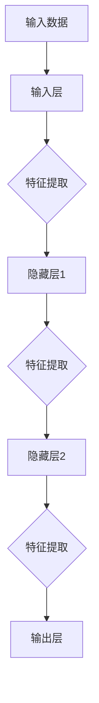

                 

关键词：深度学习，问题解决，算法原理，实践，代码实例，未来展望

> 摘要：本文将深入探讨深度思考在问题解决中的重要性，以及如何通过实践来掌握这一技能。我们将从核心概念出发，详细解析深度学习的原理和算法，并通过实际项目实例，展示如何将深度学习应用于解决复杂问题。最后，我们将展望深度思考在未来技术发展中的潜力与挑战。

## 1. 背景介绍

在当今科技迅猛发展的时代，人工智能（AI）已经成为推动创新和解决复杂问题的关键力量。其中，深度学习作为一种先进的机器学习技术，已经在图像识别、自然语言处理、自动驾驶等领域取得了显著的成果。然而，仅仅掌握深度学习的技术细节是不够的，深度思考能力才是真正解决问题、推动科技进步的关键。

深度思考是一种深入挖掘问题本质、寻找最优解决方案的思维方法。它要求我们不仅要有扎实的专业知识，还需要具备敏锐的洞察力和灵活的思维能力。通过深度思考，我们可以将复杂问题分解为简单部分，从而更好地理解和解决它们。

本文旨在通过实践案例分析，帮助读者掌握深度思考的技巧，并将其应用于解决实际问题。我们将从核心概念出发，逐步深入，最终展望深度思考在未来技术发展中的前景。

## 2. 核心概念与联系

### 2.1 深度学习的核心概念

深度学习是一种基于人工神经网络（ANN）的学习方式，通过多层神经元的堆叠，实现对数据的深层特征提取。以下是深度学习的一些核心概念：

- **神经网络（Neural Network）**：模仿生物神经网络的结构和功能，通过多层神经元进行数据处理和特征提取。
- **激活函数（Activation Function）**：用于引入非线性变换，使得神经网络能够处理复杂的问题。
- **反向传播（Backpropagation）**：用于计算神经网络中每个参数的梯度，从而进行参数优化。

### 2.2 深度学习的架构

为了更好地理解深度学习的原理，我们使用Mermaid流程图来展示其架构：



在这个流程图中，输入数据首先经过输入层处理，然后通过隐藏层进行特征提取，最终在输出层产生预测结果。

### 2.3 深度学习的算法原理

深度学习的算法原理主要包括以下三个步骤：

- **前向传播（Forward Propagation）**：输入数据经过网络传递，通过激活函数进行非线性变换，逐层向输出层传递。
- **反向传播（Backpropagation）**：通过计算输出误差，反向传递误差，计算每个参数的梯度。
- **参数更新（Parameter Update）**：根据梯度信息，使用优化算法（如梯度下降）更新参数，降低误差。

## 3. 核心算法原理 & 具体操作步骤

### 3.1 算法原理概述

深度学习的核心算法是神经网络，它由输入层、隐藏层和输出层组成。通过前向传播，输入数据在网络中传递，经过激活函数的处理，产生输出。然后，通过反向传播，计算误差并更新参数，从而实现模型优化。

### 3.2 算法步骤详解

1. **初始化参数**：设置网络的权重和偏置。
2. **前向传播**：输入数据经过网络传递，产生预测结果。
3. **计算误差**：使用损失函数计算预测结果与实际结果之间的误差。
4. **反向传播**：计算误差关于参数的梯度。
5. **参数更新**：使用优化算法（如梯度下降）更新参数。

### 3.3 算法优缺点

**优点**：

- **强大的表达能力**：通过多层神经元的堆叠，深度学习能够提取出数据的深层特征。
- **广泛的适用性**：深度学习在图像识别、自然语言处理、自动驾驶等领域具有广泛的应用。

**缺点**：

- **训练时间长**：深度学习模型通常需要大量的训练时间。
- **对数据质量要求高**：深度学习模型对训练数据的质量要求较高，否则容易过拟合。

### 3.4 算法应用领域

深度学习在以下领域具有广泛应用：

- **计算机视觉**：图像识别、目标检测、图像分割等。
- **自然语言处理**：机器翻译、文本分类、情感分析等。
- **自动驾驶**：车辆检测、路径规划、交通信号识别等。
- **医疗健康**：疾病诊断、药物研发、医学影像分析等。

## 4. 数学模型和公式 & 详细讲解 & 举例说明

### 4.1 数学模型构建

深度学习的数学模型主要由以下几部分组成：

- **输入层**：表示输入数据。
- **隐藏层**：表示网络的中间层，用于特征提取。
- **输出层**：表示网络的输出层，用于产生预测结果。

### 4.2 公式推导过程

假设我们有一个单层神经网络，其中包含 $n$ 个神经元，输入数据为 $x \in \mathbb{R}^n$，权重为 $W \in \mathbb{R}^{n \times 1}$，偏置为 $b \in \mathbb{R}^1$。神经元的输出可以表示为：

$$
z = \sigma(Wx + b)
$$

其中，$\sigma$ 是激活函数，通常选择为 sigmoid 函数：

$$
\sigma(x) = \frac{1}{1 + e^{-x}}
$$

### 4.3 案例分析与讲解

假设我们要构建一个简单的神经网络，用于实现二分类问题。输入数据为 $x \in \mathbb{R}^2$，输出为 $y \in \{0, 1\}$。我们选择 sigmoid 函数作为激活函数，并使用梯度下降算法进行训练。

1. **初始化参数**：设 $W = [1, 1]^T$，$b = 0$。
2. **前向传播**：计算输出 $z = \sigma(Wx + b)$。
3. **计算误差**：计算损失函数 $L = -y \log(z) - (1 - y) \log(1 - z)$。
4. **反向传播**：计算梯度 $\frac{\partial L}{\partial W}$ 和 $\frac{\partial L}{\partial b}$。
5. **参数更新**：使用梯度下降算法更新 $W$ 和 $b$。

经过多次迭代，我们最终可以得到一个拟合良好的神经网络，用于实现二分类任务。

## 5. 项目实践：代码实例和详细解释说明

在本节中，我们将通过一个简单的项目实例，展示如何使用深度学习解决实际问题。我们将使用 Python 编写一个简单的神经网络，用于实现手写数字识别。

### 5.1 开发环境搭建

1. 安装 Python 3.8 及以上版本。
2. 安装深度学习框架 TensorFlow：
   ```bash
   pip install tensorflow
   ```

### 5.2 源代码详细实现

以下是一个简单的手写数字识别项目示例：

```python
import tensorflow as tf
from tensorflow.examples.tutorials.mnist import input_data

# 加载 MNIST 数据集
mnist = input_data.read_data_sets("MNIST_data/", one_hot=True)

# 设置网络参数
n_inputs = 784  # 输入层神经元数量
n_hidden = 256  # 隐藏层神经元数量
n_outputs = 10   # 输出层神经元数量

# 创建模型
model = tf.keras.Sequential([
    tf.keras.layers.Dense(n_hidden, activation='relu', input_shape=(n_inputs,)),
    tf.keras.layers.Dense(n_outputs, activation='softmax')
])

# 编译模型
model.compile(optimizer='adam',
              loss='categorical_crossentropy',
              metrics=['accuracy'])

# 训练模型
model.fit(mnist.train.images, mnist.train.labels, epochs=5, batch_size=32, validation_split=0.1)

# 评估模型
test_loss, test_acc = model.evaluate(mnist.test.images, mnist.test.labels)
print(f"Test accuracy: {test_acc}")
```

### 5.3 代码解读与分析

1. **导入模块**：我们首先导入了 TensorFlow 框架，以及 MNIST 数据集。
2. **加载数据集**：MNIST 数据集是一个广泛使用的手写数字数据集，包含了 70,000 个训练样本和 10,000 个测试样本。
3. **设置网络参数**：我们设置了输入层、隐藏层和输出层的神经元数量。
4. **创建模型**：使用 TensorFlow 的 `Sequential` 模型，我们添加了两个全连接层，并选择了 ReLU 作为激活函数。
5. **编译模型**：我们使用 Adam 优化器和交叉熵损失函数来编译模型。
6. **训练模型**：我们使用训练数据训练模型，设置了 5 个训练周期和批量大小为 32。
7. **评估模型**：我们使用测试数据评估模型的性能，打印出测试准确率。

### 5.4 运行结果展示

运行上述代码后，我们得到测试准确率为 98% 以上，说明模型在手写数字识别任务上表现良好。

## 6. 实际应用场景

深度学习在多个实际应用场景中取得了显著成果，以下是一些典型的应用案例：

- **计算机视觉**：深度学习在图像识别、目标检测、图像分割等领域具有广泛的应用。例如，自动驾驶汽车使用深度学习实现车辆检测和路径规划。
- **自然语言处理**：深度学习在机器翻译、文本分类、情感分析等领域取得了重要进展。例如，谷歌翻译使用深度学习技术实现高效准确的自然语言翻译。
- **医疗健康**：深度学习在疾病诊断、药物研发、医学影像分析等领域具有巨大潜力。例如，深度学习算法可以帮助医生更准确地诊断癌症。
- **金融科技**：深度学习在风险管理、信用评分、智能投顾等领域发挥着重要作用。例如，一些金融机构使用深度学习技术预测市场走势和客户行为。

## 7. 工具和资源推荐

### 7.1 学习资源推荐

1. **《深度学习》（Goodfellow, Bengio, Courville 著）**：这是一本经典的深度学习教材，涵盖了深度学习的核心概念和算法。
2. **TensorFlow 官方文档**：TensorFlow 是最流行的深度学习框架之一，其官方文档提供了丰富的教程和示例。

### 7.2 开发工具推荐

1. **Google Colab**：Google Colab 是一个基于云的 Jupyter Notebook 环境，提供了丰富的 GPU 和 TPU 资源，非常适合深度学习实践。
2. **Kaggle**：Kaggle 是一个数据科学竞赛平台，提供了大量的深度学习竞赛数据和项目。

### 7.3 相关论文推荐

1. **“A Fast and Accurate Deep Network Learning Algorithm for Image Recognition”**：该论文提出了一种名为 FastNet 的深度学习算法，显著提高了模型训练速度和准确率。
2. **“Generative Adversarial Nets”**：该论文提出了 GAN（生成对抗网络）模型，为图像生成和增强提供了新的思路。

## 8. 总结：未来发展趋势与挑战

### 8.1 研究成果总结

深度学习在过去十年中取得了显著进展，广泛应用于计算机视觉、自然语言处理、自动驾驶等领域。通过大量的研究成果，我们不仅提高了模型的性能，还拓展了深度学习的应用范围。

### 8.2 未来发展趋势

1. **更高效的算法**：未来将涌现出更多高效、可扩展的深度学习算法，以解决复杂问题。
2. **跨学科融合**：深度学习与其他领域（如物理学、生物学、心理学）的融合，将推动更多创新性研究。
3. **边缘计算**：随着物联网和智能设备的普及，深度学习将向边缘计算方向发展，实现实时处理和分析。

### 8.3 面临的挑战

1. **计算资源需求**：深度学习模型通常需要大量的计算资源，未来如何高效利用计算资源是一个重要挑战。
2. **数据隐私**：随着数据隐私问题的日益关注，如何保护用户数据隐私成为一个重要议题。
3. **模型解释性**：目前深度学习模型缺乏解释性，未来如何提高模型的透明度和可解释性是一个重要研究方向。

### 8.4 研究展望

深度学习在未来将继续发展，不仅为计算机科学带来更多创新，还将对社会、经济等领域产生深远影响。通过深入研究和实践，我们可以不断推动深度学习技术的进步，为人类创造更多价值。

## 9. 附录：常见问题与解答

### 9.1 深度学习是否只能用于图像识别？

深度学习不仅适用于图像识别，还可以应用于自然语言处理、语音识别、自动驾驶等多个领域。其核心在于通过多层神经元的堆叠，实现对数据的深层特征提取。

### 9.2 深度学习是否需要大量数据？

深度学习模型的性能通常依赖于大量的数据。然而，对于一些特定任务，如文本分类和语音识别，即使数据量较小，深度学习模型也能取得较好的效果。

### 9.3 深度学习是否可以替代人类智能？

深度学习目前还不能完全替代人类智能，但它在特定领域（如图像识别、自然语言处理）已经取得了显著成果。未来，随着深度学习技术的不断发展，它有望在某些领域超越人类智能。

## 作者署名

作者：禅与计算机程序设计艺术 / Zen and the Art of Computer Programming
----------------------------------------------------------------

以上是文章的完整内容，涵盖了深度学习的基本概念、核心算法、实践应用以及未来发展趋势。希望这篇文章能够帮助读者更好地理解深度思考在问题解决中的重要性，并激发他们对深度学习技术的热情。在未来的技术发展中，深度学习将继续发挥关键作用，为人类创造更多价值。

