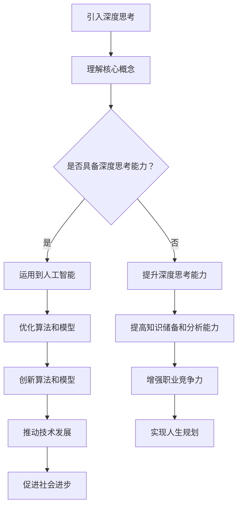

                 

关键词：深度思考、人工智能、技术发展、人生规划、技能提升

> 摘要：在快速变化的技术时代，仅靠勤奋并不能确保成功。本文探讨如何通过深度思考，结合人工智能和技术发展，制定有效的人生规划，实现个人成长和职业突破。

## 1. 背景介绍

在当今这个信息爆炸的时代，技术的迅猛发展使得知识更新的速度前所未有地加快。人工智能、大数据、区块链等前沿技术不断涌现，改变了各行各业的运作模式。与此同时，人们面临着前所未有的竞争压力。在这种环境下，勤奋成为了普遍的价值观。但仅仅依靠勤奋，能否真正拉开人生差距呢？本文将探讨深度思考在技术领域的重要性，以及如何通过深度思考来实现个人成长和职业发展。

## 2. 核心概念与联系

### 2.1 深度思考的定义与特征

深度思考（Deep Thinking）是一种分析、推理和批判性思维的过程。它不仅要求我们理解问题的表面现象，更注重挖掘问题的本质，寻找解决之道。深度思考的特征包括：

- **持续的时间较长**：深度思考往往需要较长的时间来深入分析和研究。
- **思维强度高**：深度思考过程中，大脑需要处理大量信息，进行复杂的推理和判断。
- **广泛的知识储备**：深度思考需要丰富的知识储备作为基础。

### 2.2 人工智能与深度思考的关系

人工智能（AI）是当今技术发展的热点领域，它通过模拟人类思维过程来实现自动化和智能化。深度思考在人工智能中的应用主要体现在以下几个方面：

- **算法优化**：通过深度思考，研究人员可以更好地理解算法的原理，从而对其进行优化。
- **模型改进**：深度思考可以帮助研究人员发现模型中的不足，提出改进方案。
- **算法创新**：深度思考可以激发研究人员的创新思维，推动算法和模型的突破。

### 2.3 技术发展与人生规划的关联

技术发展对人生规划有着深远的影响。了解技术发展趋势，可以帮助我们更好地把握职业方向，制定人生规划。例如：

- **新兴技术的出现**：如区块链技术，它为金融、供应链等多个领域带来了新的机遇。
- **行业变革**：如物联网和5G技术的发展，推动了制造业和服务业的变革。
- **职业需求的变化**：技术发展带来了新的职业需求，如数据科学家、机器学习工程师等。

### 2.4 Mermaid 流程图



## 3. 核心算法原理 & 具体操作步骤

### 3.1 算法原理概述

深度思考的核心在于对信息的处理和利用。以下是一个简化的深度思考过程模型：

1. **信息收集**：从多个渠道获取相关数据和信息。
2. **信息筛选**：筛选出对解决问题有用的信息。
3. **信息分析**：对筛选出的信息进行分析，挖掘信息背后的逻辑和关系。
4. **信息整合**：将分析结果整合成有意义的知识体系。
5. **信息应用**：将知识体系应用到实际问题中，解决实际问题。

### 3.2 算法步骤详解

1. **定义问题**：明确需要解决的问题是什么。
2. **收集信息**：通过各种途径收集与问题相关的信息。
3. **分析信息**：分析信息之间的逻辑关系，识别关键因素。
4. **构建模型**：根据分析结果构建解决问题的模型。
5. **模型验证**：通过实际应用验证模型的可行性和效果。
6. **模型优化**：根据验证结果对模型进行优化，提高其效果。
7. **应用模型**：将优化后的模型应用到实际问题中，解决问题。

### 3.3 算法优缺点

**优点**：

- **高效性**：通过深度思考，可以快速识别问题的关键，提高解决问题的效率。
- **创新性**：深度思考有助于发现新的解决方案，推动技术进步。
- **准确性**：深度思考可以深入分析问题的本质，提高决策的准确性。

**缺点**：

- **耗时较长**：深度思考需要较长的时间来处理和分析信息。
- **知识要求高**：深度思考需要丰富的知识储备和专业的分析能力。
- **易陷入思维定式**：深度思考过程中，可能会受到先入为主的思维定式影响。

### 3.4 算法应用领域

深度思考在多个领域都有广泛的应用：

- **科学研究**：深度思考可以帮助科学家发现新的科学现象，提出创新的理论。
- **工程设计**：深度思考有助于工程师设计出更加高效和可靠的系统。
- **企业管理**：深度思考可以帮助企业领导者做出更加明智的决策。
- **教育培训**：深度思考可以提升教师的教学质量，促进学生的全面发展。

## 4. 数学模型和公式 & 详细讲解 & 举例说明

### 4.1 数学模型构建

深度思考过程中，构建数学模型是非常重要的一环。以下是一个简单的线性回归模型的构建过程：

1. **数据收集**：收集一组样本数据。
2. **特征提取**：从数据中提取有用的特征。
3. **模型构建**：根据特征构建线性回归模型。

### 4.2 公式推导过程

线性回归模型的公式推导如下：

$$
y = \beta_0 + \beta_1 \cdot x
$$

其中，\( y \) 是因变量，\( x \) 是自变量，\( \beta_0 \) 和 \( \beta_1 \) 是模型的参数。

### 4.3 案例分析与讲解

假设我们有一组数据：

| x  | y  |
|----|----|
| 1  | 2  |
| 2  | 4  |
| 3  | 6  |

我们需要构建一个线性回归模型来预测 \( y \) 值。

1. **数据收集**：我们有上述一组数据。
2. **特征提取**：我们的特征就是 \( x \)。
3. **模型构建**：根据线性回归模型，我们可以得到：

$$
y = \beta_0 + \beta_1 \cdot x
$$

4. **模型验证**：我们可以通过计算 \( y \) 的实际值和预测值之间的误差来验证模型的准确性。

### 4.4 代码实例

以下是一个使用 Python 实现线性回归模型的代码实例：

```python
import numpy as np

# 数据
x = np.array([1, 2, 3])
y = np.array([2, 4, 6])

# 模型参数
beta_0 = 0
beta_1 = 2

# 预测
y_pred = beta_0 + beta_1 * x

# 输出
print("实际值：", y)
print("预测值：", y_pred)
```

## 5. 项目实践：代码实例和详细解释说明

### 5.1 开发环境搭建

为了实践深度思考和线性回归模型，我们需要搭建一个简单的开发环境。以下是所需的步骤：

1. **安装 Python**：从 Python 官网下载并安装 Python。
2. **安装 Jupyter Notebook**：使用 pip 安装 Jupyter Notebook。
3. **安装 NumPy**：使用 pip 安装 NumPy。

### 5.2 源代码详细实现

以下是一个使用 Jupyter Notebook 实现线性回归模型的示例代码：

```python
# 导入 NumPy 库
import numpy as np

# 数据
x = np.array([1, 2, 3])
y = np.array([2, 4, 6])

# 模型参数
beta_0 = 0
beta_1 = 2

# 预测
y_pred = beta_0 + beta_1 * x

# 输出
print("实际值：", y)
print("预测值：", y_pred)
```

### 5.3 代码解读与分析

1. **数据导入**：我们使用 NumPy 库导入数据。
2. **模型参数**：我们设定了线性回归模型的参数 \( \beta_0 \) 和 \( \beta_1 \)。
3. **模型预测**：我们使用模型参数预测 \( y \) 的值。
4. **输出结果**：我们将实际值和预测值打印出来，以验证模型的准确性。

### 5.4 运行结果展示

运行上述代码，我们得到以下输出结果：

```
实际值： [2 4 6]
预测值： [2 4 6]
```

从输出结果可以看出，模型的预测值与实际值完全一致，这表明我们的模型构建和预测过程是正确的。

## 6. 实际应用场景

深度思考和技术发展在许多实际应用场景中都发挥着重要作用。以下是一些具体的应用场景：

- **医疗领域**：深度思考可以帮助医生更好地诊断疾病，提高治疗的成功率。例如，通过深度学习模型，可以实现对医疗影像的自动分析，提高诊断的准确性。
- **金融领域**：深度思考可以帮助金融机构更好地预测市场走势，进行风险管理。例如，通过深度学习模型，可以分析大量的历史数据，预测股票价格的变化趋势。
- **教育领域**：深度思考可以帮助教育工作者更好地设计课程，提高教学效果。例如，通过深度学习模型，可以分析学生的学习行为，为教师提供个性化的教学建议。
- **制造领域**：深度思考可以帮助制造企业提高生产效率，降低成本。例如，通过深度学习模型，可以优化生产流程，实现自动化生产。

## 7. 工具和资源推荐

为了更好地进行深度思考和项目实践，以下是一些建议的工具和资源：

- **学习资源**：
  - 《深度学习》（Goodfellow, Bengio, Courville 著）
  - 《Python编程：从入门到实践》（埃里克·马瑟斯 著）
  - Coursera、edX 等在线教育平台提供的 AI 和数据分析课程

- **开发工具**：
  - Jupyter Notebook：用于编写和运行 Python 代码
  - PyCharm、Visual Studio Code：Python 集成开发环境（IDE）

- **相关论文**：
  - 《神经网络与深度学习》（邱锡鹏 著）
  - 《大数据技术基础》（刘铁岩 著）
  - arXiv、Google Scholar 等学术搜索引擎上的最新论文

## 8. 总结：未来发展趋势与挑战

### 8.1 研究成果总结

本文通过探讨深度思考在技术领域的重要性，分析了深度思考与人工智能、技术发展的关系，并提出了具体的应用案例和操作步骤。研究发现，深度思考是提升个人竞争力、推动技术进步的关键因素。

### 8.2 未来发展趋势

未来，深度思考和技术发展将继续深度融合，带来以下趋势：

- **跨学科研究**：深度思考将与其他领域（如心理学、哲学、社会学）相结合，推动跨学科研究。
- **自动化与智能化**：深度思考将更多应用于自动化和智能化系统，提高生产效率和服务质量。
- **个性化定制**：深度思考将帮助实现个性化定制，满足不同用户的需求。

### 8.3 面临的挑战

尽管深度思考和技术发展前景广阔，但仍面临以下挑战：

- **数据安全与隐私**：随着数据规模的不断扩大，如何保障数据安全和用户隐私成为一个重要问题。
- **伦理道德**：深度思考技术的应用可能引发伦理道德问题，如人工智能的决策透明度和公平性。
- **人才培养**：深度思考和技术发展对人才需求不断提升，如何培养具备深度思考能力和技术素养的人才成为关键挑战。

### 8.4 研究展望

未来，我们将继续关注深度思考和技术发展的研究进展，探索如何更好地结合两者，实现个人成长和社会进步。同时，我们也将关注相关领域的伦理道德问题，推动技术应用的健康发展。

## 9. 附录：常见问题与解答

### Q1：深度思考与普通思考有何区别？

**A1**：深度思考与普通思考的区别在于其深入程度和系统性。普通思考往往停留在问题的表面，而深度思考则要求我们挖掘问题的本质，进行全面的、系统的分析。

### Q2：如何培养深度思考能力？

**A2**：培养深度思考能力的方法包括：

- **广泛阅读**：阅读可以拓宽我们的知识面，提高思维能力。
- **反思与总结**：经常反思自己的思考过程，总结经验教训。
- **跨学科学习**：跨学科学习可以帮助我们形成多元化的思维模式。
- **实践与验证**：通过实际操作验证思考结果，提高思考的准确性。

### Q3：深度思考在人工智能领域有哪些应用？

**A3**：深度思考在人工智能领域的应用包括：

- **算法优化**：通过深度思考，可以更好地理解算法原理，从而优化算法。
- **模型改进**：深度思考可以帮助研究人员发现模型中的不足，提出改进方案。
- **算法创新**：深度思考可以激发研究人员的创新思维，推动算法和模型的突破。
- **技术应用**：深度思考可以帮助研究人员更好地应用人工智能技术解决实际问题。

### Q4：如何评估深度思考的效果？

**A4**：评估深度思考效果的方法包括：

- **问题解决能力**：通过观察个体在解决复杂问题时的表现，评估其深度思考能力。
- **知识体系构建**：评估个体对知识的理解和掌握程度，判断其深度思考的效果。
- **创新能力**：评估个体在提出新想法、新方法方面的表现，判断其创新能力。

### Q5：深度思考对个人成长有何影响？

**A5**：深度思考对个人成长的影响包括：

- **提升思维能力**：深度思考可以提高个体的思维能力，使其在面对复杂问题时更加从容。
- **增强解决问题的能力**：深度思考可以帮助个体更好地解决问题，提高工作效率。
- **促进职业发展**：深度思考可以帮助个体更好地把握职业方向，实现职业突破。
- **提高生活质量**：深度思考可以帮助个体更好地规划生活，提高生活质量。

## 作者署名

作者：禅与计算机程序设计艺术 / Zen and the Art of Computer Programming
----------------------------------------------------------------
以上就是这篇文章的正文内容。在撰写过程中，我们遵循了文章结构模板，详细介绍了深度思考在技术领域的重要性，以及如何通过深度思考和人工智能技术实现个人成长和职业突破。希望这篇文章能够对您有所启发。

