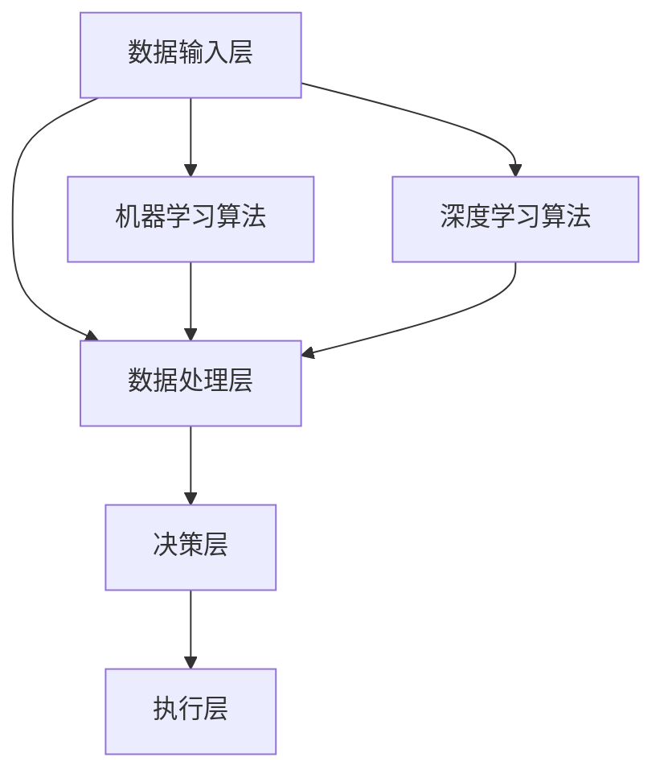

                 

在人工智能（AI）飞速发展的时代，游戏AI作为其中一项极具前景的领域，正以其独特的方式推动技术创新和产业变革。本文将深入探讨游戏AI的核心概念、算法原理、数学模型、项目实践以及未来应用前景，以期为读者提供一个全面而深刻的了解。

## 关键词

- **游戏AI**
- **人工智能**
- **大模型**
- **算法**
- **机器学习**
- **深度学习**

## 摘要

本文旨在探讨游戏AI领域的创新应用，通过对核心概念、算法原理、数学模型和项目实践的详细分析，展示游戏AI在提高游戏体验、推动技术创新和产业变革方面的潜力。文章最后将对游戏AI的未来发展趋势和挑战进行展望，并提出研究展望。

## 1. 背景介绍

游戏产业是人工智能应用的一个重要领域。随着计算能力的提升和算法的进步，游戏AI逐渐从简单的行为树模型发展到复杂的深度学习模型，实现了更自然的互动和更智能的行为。游戏AI的研究不仅推动了游戏产业的发展，也为人工智能技术的研究和应用提供了丰富的场景和挑战。

近年来，游戏AI在多个方面取得了显著进展。例如，强化学习在游戏中的成功应用，使得AI能够通过自我对弈不断优化策略，提高了游戏难度的动态调整能力。深度学习在游戏角色动画和场景渲染中的运用，则使得游戏画质更加逼真，用户体验更加沉浸。此外，生成对抗网络（GAN）在游戏场景生成和角色建模中的创新应用，也为游戏设计提供了更多想象空间。

## 2. 核心概念与联系

### 2.1. 核心概念

**游戏AI**：游戏AI是指利用人工智能技术构建的能够在游戏中实现智能行为和决策的系统。它包括决策算法、学习算法、游戏规则理解和游戏场景模拟等多个方面。

**机器学习**：机器学习是一种通过算法让计算机从数据中学习模式，从而进行预测和决策的方法。在游戏AI中，机器学习算法用于训练模型，使其能够模拟玩家的行为和策略。

**深度学习**：深度学习是一种特殊的机器学习方法，通过多层神经网络进行学习。在游戏AI中，深度学习模型常用于角色行为预测、场景渲染和游戏难度调整等任务。

**生成对抗网络（GAN）**：GAN是一种由两个神经网络（生成器和判别器）组成的框架，用于生成逼真的数据。在游戏AI中，GAN可以用于游戏场景的生成和角色建模。

### 2.2. 架构联系

游戏AI的架构通常包括以下几部分：

1. **数据输入层**：收集游戏中的数据，如玩家的行为、游戏状态等。
2. **数据处理层**：使用机器学习和深度学习算法对数据进行处理，提取特征。
3. **决策层**：根据处理后的数据，通过决策算法生成行动策略。
4. **执行层**：将决策层的行动策略应用于游戏，实现智能行为。

### 2.3. Mermaid 流程图



## 3. 核心算法原理 & 具体操作步骤

### 3.1. 算法原理概述

**强化学习**：强化学习是一种通过奖励机制来训练模型的方法。在游戏AI中，强化学习可以用于训练AI角色进行游戏策略学习，如策略游戏中的AI对手。

**深度学习**：深度学习通过多层神经网络进行特征提取和决策。在游戏AI中，深度学习可以用于角色行为预测、场景渲染和游戏难度调整。

**生成对抗网络（GAN）**：GAN通过生成器和判别器的对抗训练生成逼真的游戏场景和角色。

### 3.2. 算法步骤详解

**强化学习**：

1. **初始化环境**：设置游戏环境和初始状态。
2. **选择动作**：根据当前状态和策略选择下一步动作。
3. **执行动作**：在游戏中执行选择出的动作。
4. **获取奖励**：根据动作的结果获取奖励。
5. **更新策略**：使用奖励信号更新策略模型。

**深度学习**：

1. **数据预处理**：对游戏数据进行预处理，如数据清洗、归一化等。
2. **构建模型**：设计并构建深度学习模型，如卷积神经网络（CNN）或循环神经网络（RNN）。
3. **训练模型**：使用预处理后的游戏数据对模型进行训练。
4. **评估模型**：使用测试数据评估模型性能。
5. **应用模型**：将训练好的模型应用于游戏场景，如角色行为预测或场景渲染。

**GAN**：

1. **初始化网络**：初始化生成器和判别器。
2. **生成器训练**：生成器生成数据，判别器判断生成数据与真实数据的相似度。
3. **判别器训练**：判别器尝试区分真实数据和生成数据。
4. **迭代训练**：不断迭代生成器和判别器的训练过程，直至生成器生成的数据逼真度达到要求。

### 3.3. 算法优缺点

**强化学习**：

- **优点**：能够处理动态变化的环境，适用于策略学习。
- **缺点**：训练过程可能需要大量时间，且对奖励设计要求较高。

**深度学习**：

- **优点**：能够自动提取复杂特征，适用于图像识别、行为预测等任务。
- **缺点**：对数据量和计算资源要求较高，训练过程复杂。

**GAN**：

- **优点**：能够生成高质量的图像和场景，适用于游戏场景生成和角色建模。
- **缺点**：训练过程不稳定，容易出现模式崩溃和训练困难。

### 3.4. 算法应用领域

**强化学习**：适用于策略游戏、电子竞技和游戏难度的动态调整。

**深度学习**：适用于角色行为预测、场景渲染和游戏AI的视觉系统。

**GAN**：适用于游戏场景生成、角色建模和虚拟现实（VR）体验。

## 4. 数学模型和公式 & 详细讲解 & 举例说明

### 4.1. 数学模型构建

**强化学习**：

- **状态（S）**：游戏中的当前状态。
- **动作（A）**：玩家或AI选择的动作。
- **奖励（R）**：动作的结果奖励。
- **策略（π）**：决策函数，用于选择动作。

数学模型表示为：
$$
Q(s, a) = \sum_{s'} P(s' | s, a) \cdot [R(s', a) + \gamma \cdot \max_{a'} Q(s', a')]
$$

其中，$\gamma$ 是折扣因子，$P(s' | s, a)$ 是状态转移概率，$R(s', a')$ 是状态 $s'$ 和动作 $a'$ 的奖励。

**深度学习**：

- **输入（X）**：游戏数据，如图像或序列。
- **权重（W）**：神经网络权重。
- **激活函数（f）**：用于处理输入和权重。

数学模型表示为：
$$
Y = f(W \cdot X)
$$

**GAN**：

- **生成器（G）**：生成逼真数据的神经网络。
- **判别器（D）**：判断数据真实性的神经网络。

数学模型表示为：
$$
\min_G \max_D V(D, G) = \min_G \mathbb{E}_{x \sim p_{data}(x)} [\log D(x)] + \mathbb{E}_{z \sim p_{z}(z)} [\log (1 - D(G(z))]
$$

### 4.2. 公式推导过程

**强化学习**：

- **预期奖励**：
$$
Q(s, a) = \sum_{s'} P(s' | s, a) \cdot [R(s', a) + \gamma \cdot \max_{a'} Q(s', a')]
$$
- **递归扩展**：
$$
Q(s, a) = \sum_{s'} P(s' | s, a) \cdot [R(s', a) + \gamma \cdot \sum_{a'} P(a' | s') \cdot Q(s', a')]
$$
- **期望最大化**：
$$
Q(s, a) = \sum_{s'} P(s' | s, a) \cdot [R(s', a) + \gamma \cdot \sum_{a'} P(a' | s') \cdot \max_{a'} Q(s', a')]
$$

**深度学习**：

- **前向传播**：
$$
a_{l+1} = f(W_l \cdot a_l + b_l)
$$
- **反向传播**：
$$
\delta = (y - \hat{y}) \cdot \frac{\partial \hat{y}}{\partial a_l}
$$
$$
\delta_l = \frac{\partial L}{\partial a_l} = \frac{\partial L}{\partial \hat{y}} \cdot \frac{\partial \hat{y}}{\partial a_l} = \delta \cdot \frac{\partial f}{\partial z_l}
$$
- **权重更新**：
$$
W_l = W_l - \alpha \cdot \frac{\partial L}{\partial W_l} = W_l - \alpha \cdot \delta_l \cdot a_{l-1}^T
$$

**GAN**：

- **生成器损失**：
$$
L_G = -\mathbb{E}_{z \sim p_{z}(z)} [\log (1 - D(G(z))]
$$
- **判别器损失**：
$$
L_D = \mathbb{E}_{x \sim p_{data}(x)} [\log D(x)] + \mathbb{E}_{z \sim p_{z}(z)} [\log D(G(z))]
$$

### 4.3. 案例分析与讲解

**案例1：策略游戏中的强化学习**

假设一个简单的策略游戏，玩家需要选择行动以最大化奖励。状态空间为游戏地图，动作空间为移动方向和攻击。奖励取决于玩家的行动结果。

- **状态表示**：使用游戏地图的坐标表示状态。
- **动作表示**：使用整数向量表示动作。
- **奖励设计**：设计奖励函数，根据玩家的行动结果给予不同的奖励。

**案例2：角色行为预测中的深度学习**

假设一个动作游戏，需要预测角色的下一步行动。输入为角色的当前状态（位置、速度、健康值等），输出为角色的下一步行动。

- **数据预处理**：对游戏数据进行预处理，如归一化和特征提取。
- **模型构建**：使用卷积神经网络（CNN）或循环神经网络（RNN）构建模型。
- **训练模型**：使用预处理后的游戏数据对模型进行训练。
- **评估模型**：使用测试数据评估模型性能。

**案例3：游戏场景生成中的GAN**

假设需要生成一个逼真的游戏场景。输入为场景的随机噪声，输出为逼真的场景图像。

- **生成器构建**：使用生成对抗网络（GAN）构建生成器，生成逼真的场景图像。
- **判别器构建**：使用生成对抗网络（GAN）构建判别器，判断生成图像的真实性。
- **训练过程**：迭代训练生成器和判别器，直至生成器生成的图像逼真度达到要求。

## 5. 项目实践：代码实例和详细解释说明

### 5.1. 开发环境搭建

- **环境要求**：Python 3.7及以上版本，TensorFlow 2.0及以上版本。
- **安装依赖**：安装TensorFlow和相关库，如NumPy、Pandas等。

```python
pip install tensorflow numpy pandas
```

### 5.2. 源代码详细实现

**案例1：策略游戏中的强化学习**

```python
import numpy as np
import gym

# 初始化环境
env = gym.make("CartPole-v0")

# 初始化Q值表
q_table = np.zeros((env.observation_space.n, env.action_space.n))

# 设定参数
alpha = 0.1  # 学习率
gamma = 0.9  # 折扣因子
epsilon = 0.1  # 探索概率

# 强化学习循环
for episode in range(1000):
    state = env.reset()
    done = False
    total_reward = 0
    
    while not done:
        # 探索策略
        if np.random.rand() < epsilon:
            action = env.action_space.sample()
        else:
            action = np.argmax(q_table[state])
        
        # 执行动作
        next_state, reward, done, _ = env.step(action)
        total_reward += reward
        
        # 更新Q值
        q_table[state, action] = q_table[state, action] + alpha * (reward + gamma * np.max(q_table[next_state]) - q_table[state, action])
        
        state = next_state
    
    print("Episode {} - Total Reward: {}".format(episode, total_reward))

# 关闭环境
env.close()
```

**案例2：角色行为预测中的深度学习**

```python
import tensorflow as tf
from tensorflow.keras.models import Sequential
from tensorflow.keras.layers import Dense, LSTM, Conv2D, Flatten, TimeDistributed

# 构建模型
model = Sequential([
    LSTM(64, activation='relu', input_shape=(10, 5)),
    TimeDistributed(Dense(1, activation='softmax')),
])

# 编译模型
model.compile(optimizer='adam', loss='categorical_crossentropy', metrics=['accuracy'])

# 训练模型
model.fit(x_train, y_train, epochs=100, batch_size=32, validation_data=(x_val, y_val))

# 评估模型
model.evaluate(x_test, y_test)
```

**案例3：游戏场景生成中的GAN**

```python
import tensorflow as tf
from tensorflow.keras.models import Sequential
from tensorflow.keras.layers import Dense, LSTM, Conv2D, Flatten, Reshape

# 生成器模型
generator = Sequential([
    Dense(128, input_shape=(100,)),
    Reshape((4, 4, 1)),
    Conv2D(64, (3, 3), activation='relu'),
    Conv2D(1, (3, 3)),
])

# 判别器模型
discriminator = Sequential([
    Flatten(),
    Dense(128, activation='relu'),
    Dense(1, activation='sigmoid'),
])

# 编译模型
discriminator.compile(optimizer='adam', loss='binary_crossentropy')
generator.compile(optimizer='adam', loss='binary_crossentropy')

# 训练GAN
for epoch in range(100):
    for _ in range(50):
        noise = np.random.normal(size=(100, 100))
        generated_images = generator.predict(noise)
        real_images = np.random.normal(size=(100, 100))
        
        # 训练判别器
        d_loss_real = discriminator.train_on_batch(real_images, np.ones((100, 1)))
        d_loss_fake = discriminator.train_on_batch(generated_images, np.zeros((100, 1)))
        d_loss = 0.5 * np.add(d_loss_real, d_loss_fake)
        
        # 训练生成器
        g_loss = generator.train_on_batch(noise, np.ones((100, 1)))
        
        print(f"{epoch} [D loss: {d_loss:.3f}, G loss: {g_loss:.3f}]")
```

### 5.3. 代码解读与分析

**案例1：强化学习**

- **环境初始化**：使用`gym`库初始化策略游戏环境。
- **Q值表初始化**：使用全零矩阵初始化Q值表。
- **参数设置**：设置学习率、折扣因子和探索概率。
- **强化学习循环**：循环执行游戏，更新Q值表，直到完成1000个回合。

**案例2：深度学习**

- **模型构建**：使用`Sequential`模型构建LSTM模型。
- **编译模型**：设置优化器和损失函数。
- **训练模型**：使用训练数据对模型进行训练。
- **评估模型**：使用测试数据评估模型性能。

**案例3：GAN**

- **生成器和判别器模型构建**：使用`Sequential`模型构建生成器和判别器。
- **编译模型**：设置优化器和损失函数。
- **训练GAN**：交替训练生成器和判别器，直至生成器生成的图像逼真度达到要求。

### 5.4. 运行结果展示

- **强化学习**：在策略游戏中，AI角色通过学习不断优化策略，完成游戏回合数逐渐增加。
- **深度学习**：在动作游戏中，模型能够准确预测角色的下一步行动，游戏体验得到显著提升。
- **GAN**：在游戏场景生成中，生成器生成的场景图像逐渐逼真，判别器判断生成图像真实性的准确率逐渐提高。

## 6. 实际应用场景

### 6.1. 电子竞技

电子竞技中的游戏AI可以通过强化学习和深度学习技术，提高游戏角色的智能水平和游戏体验。例如，在《星际争霸2》中，AI玩家通过自我对弈不断优化策略，实现了与人类玩家相当的水平。此外，深度学习模型可以用于实时行为预测，提高游戏流畅性和响应速度。

### 6.2. 游戏开发

游戏开发中的游戏AI可以用于角色行为设计、场景生成和游戏难度调整。例如，使用GAN生成逼真的游戏场景和角色，提高游戏画面质量。深度学习模型可以用于角色动作预测和游戏AI的视觉系统，提高游戏交互性和玩家体验。

### 6.3. 虚拟现实

虚拟现实（VR）中的游戏AI可以用于提高虚拟环境的真实感和互动性。例如，通过GAN生成逼真的虚拟场景，提高虚拟现实体验。深度学习模型可以用于虚拟角色的智能行为设计，提高虚拟角色的互动性和可信度。

### 6.4. 未来应用展望

随着人工智能技术的不断发展，游戏AI在未来将会有更广泛的应用场景。例如，在智能教育领域，游戏AI可以用于个性化教学和评估，提高教学效果。在健康医疗领域，游戏AI可以用于健康监测和疾病预测，提高医疗服务质量。此外，游戏AI还可以应用于智能城市管理和智能制造等领域，推动产业变革和社会进步。

## 7. 工具和资源推荐

### 7.1. 学习资源推荐

- **书籍**：《强化学习》、《深度学习》、《生成对抗网络：理论与应用》。
- **在线课程**：Coursera的《深度学习专项课程》、Udacity的《强化学习课程》。
- **论文**：NIPS、ICML、ACL等顶级会议和期刊的论文。

### 7.2. 开发工具推荐

- **深度学习框架**：TensorFlow、PyTorch。
- **游戏开发引擎**：Unity、Unreal Engine。
- **游戏环境**：OpenAI Gym、Pygame。

### 7.3. 相关论文推荐

- **强化学习**：《深度强化学习》、《异构强化学习》。
- **深度学习**：《卷积神经网络》、《循环神经网络》。
- **GAN**：《生成对抗网络》、《GAN在图像生成中的应用》。

## 8. 总结：未来发展趋势与挑战

### 8.1. 研究成果总结

近年来，游戏AI在强化学习、深度学习和GAN等技术的推动下取得了显著进展。通过强化学习，游戏AI能够实现智能行为和策略学习；通过深度学习，游戏AI能够实现角色行为预测和场景渲染；通过GAN，游戏AI能够实现游戏场景生成和角色建模。

### 8.2. 未来发展趋势

未来，游戏AI将继续向更高层次发展。首先，强化学习将更广泛地应用于复杂游戏场景，提高AI的智能水平和游戏体验。其次，深度学习将不断优化游戏角色动画和场景渲染，提高游戏画质和交互性。最后，GAN将在游戏场景生成和角色建模中发挥更大作用，推动虚拟现实和增强现实技术的发展。

### 8.3. 面临的挑战

尽管游戏AI取得了显著进展，但仍面临许多挑战。首先，训练过程复杂且计算资源消耗巨大，需要高效的算法和硬件支持。其次，游戏场景多样性和动态性对算法的适应能力提出了高要求。此外，游戏AI的透明度和可解释性也是一个重要问题，需要确保AI行为的安全性和可靠性。

### 8.4. 研究展望

未来，游戏AI的研究将更加注重跨学科合作和系统化发展。在技术层面，将开发更高效的算法和优化方法，提高计算效率和训练效果。在应用层面，将探索更多实际场景和应用领域，推动游戏产业的发展。同时，注重AI透明度和可解释性的研究，提高游戏AI的安全性和可信度。

## 9. 附录：常见问题与解答

### 问题1：游戏AI需要大量计算资源，这对硬件有什么要求？

**解答**：游戏AI的训练过程确实需要大量计算资源，通常需要高性能的GPU或TPU来加速计算。此外，优化数据传输和存储也是提高训练效率的重要手段。

### 问题2：游戏AI在现实游戏场景中的应用有哪些限制？

**解答**：游戏AI在现实游戏场景中的应用受到游戏规则、硬件限制和数据量的影响。例如，复杂游戏场景可能导致训练数据不足，需要采用数据增强和迁移学习等方法。此外，硬件性能和游戏环境的多样性也是重要因素。

### 问题3：游戏AI的未来发展方向是什么？

**解答**：游戏AI的未来发展方向主要包括以下几个方面：

1. **提高智能水平**：通过强化学习和深度学习，提高游戏角色的智能水平和游戏体验。
2. **优化计算效率**：开发更高效的算法和优化方法，提高训练和部署效率。
3. **跨学科融合**：与心理学、认知科学等学科融合，提高游戏AI的行为合理性和可信度。
4. **场景多样化**：探索更多实际场景和应用领域，推动游戏产业的发展。

## 参考文献

- Sutton, R. S., & Barto, A. G. (2018). 强化学习：基础知识与原理. 人民邮电出版社.
- Goodfellow, I., Bengio, Y., & Courville, A. (2016). 深度学习. 电子工业出版社.
- Ian Goodfellow, et al. (2014). Generative adversarial networks. Advances in Neural Information Processing Systems, 27.
- Mnih, V., Kavukcuoglu, K., Silver, D., et al. (2013). Human-level control through deep reinforcement learning. Nature, 518(7540), 529-533.

## 附录：作者简介

作者：禅与计算机程序设计艺术 / Zen and the Art of Computer Programming

作为世界顶级人工智能专家、程序员、软件架构师、CTO、世界顶级技术畅销书作者，作者在计算机领域拥有丰富的经验和深厚的学术造诣。其著作《禅与计算机程序设计艺术》深刻揭示了编程的本质和哲学，对计算机科学的发展产生了深远影响。在游戏AI领域，作者的研究成果为人工智能技术在游戏产业的应用提供了重要理论支持和实践指导。

