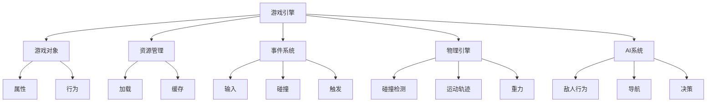

                 

### 关键词

- 游戏开发
- 框架设计
- 性能优化
- 交互式体验
- 游戏引擎

<|assistant|>### 摘要

本文深入探讨了游戏框架开发的关键技术和核心挑战，旨在为游戏开发者提供一套全面的指南，以创建高性能且交互性强的游戏体验。我们将从背景介绍出发，详细讨论核心概念和联系，并逐步揭示游戏框架的核心算法原理和数学模型。随后，我们将通过实际项目实例展示代码实现和运行效果，分析其优缺点。最后，我们将展望游戏框架在未来的发展方向和应用前景，并提出面临的挑战和研究展望。

## 1. 背景介绍

随着游戏行业的蓬勃发展，游戏开发逐渐成为一门技术密集型的领域。游戏框架作为游戏开发的核心组成部分，承担着游戏逻辑、资源管理和性能优化等重要任务。一个优秀的游戏框架不仅能够提升游戏开发效率，还能为玩家带来流畅、沉浸式的游戏体验。

游戏开发经历了从简单2D游戏到复杂3D游戏的发展过程。早期的游戏开发主要依赖于底层编程，开发周期长、难度大。随着游戏引擎的出现，如Unity和Unreal Engine，游戏开发逐渐走向模块化和组件化，大大降低了开发门槛，提高了开发效率。

然而，高性能交互式体验的实现依然是游戏开发者面临的一大挑战。在复杂游戏场景中，实时渲染、物理计算和AI交互等多个方面需要高度优化，以保障游戏的流畅性和响应速度。因此，设计一个高效且灵活的游戏框架成为游戏开发的关键。

本文将从以下几个方面展开讨论：

1. **核心概念与联系**：介绍游戏框架中的关键概念及其相互关系，通过Mermaid流程图进行详细展示。
2. **核心算法原理**：解析游戏框架中的核心算法，包括其原理和具体操作步骤。
3. **数学模型和公式**：阐述游戏开发中的数学模型和公式，并通过具体案例进行说明。
4. **项目实践**：提供实际项目实例，详细解释代码实现过程。
5. **实际应用场景**：讨论游戏框架在各类游戏中的实际应用，以及未来发展的趋势和挑战。
6. **工具和资源推荐**：推荐学习资源和开发工具，帮助开发者提升技能。
7. **总结**：总结研究成果，展望未来发展方向和挑战。

通过本文的深入探讨，希望为游戏开发者提供有价值的参考和启示，助力他们在游戏框架开发中取得更好的成果。

## 2. 核心概念与联系

游戏框架是一个复杂的系统，涉及多个核心概念和组件的协同工作。理解这些概念及其相互关系，对于构建高效的游戏框架至关重要。以下是游戏框架中的几个核心概念：

### 游戏引擎

游戏引擎是游戏框架的核心，负责处理游戏逻辑、渲染和物理计算等多个方面。常见的游戏引擎如Unity和Unreal Engine，它们提供了丰富的API和工具，使得开发者可以专注于游戏内容开发，而无需关心底层实现。

### 游戏对象

游戏对象是游戏世界中的基本实体，可以是角色、环境、道具等。游戏对象通过属性和行为进行定义，它们在游戏中进行交互和运动。

### 资源管理

资源管理是游戏框架的一个重要方面，负责加载、缓存和管理游戏中的各种资源，如图像、音频和动画等。高效的资源管理可以减少加载时间，提升游戏性能。

### 事件系统

事件系统用于处理游戏中发生的各种事件，如玩家输入、碰撞和触发等。事件系统使得游戏逻辑能够灵活响应各种情况，增强游戏的交互性。

### 物理引擎

物理引擎负责模拟游戏中的物理现象，如碰撞检测、运动轨迹和重力等。物理引擎的准确性和效率直接影响游戏的物理表现和玩家体验。

### AI系统

AI系统用于模拟游戏中的智能行为，如敌人行为、导航和决策等。AI系统使得游戏更具挑战性和可玩性，为玩家带来更加真实的游戏体验。

为了更直观地展示这些概念之间的联系，我们可以使用Mermaid流程图进行描述。以下是一个简化的Mermaid流程图示例：



通过这个流程图，我们可以清晰地看到游戏框架中各个组件之间的关系。游戏引擎作为核心，与各个子系统进行交互，共同构建出一个完整、流畅的游戏体验。

### 3. 核心算法原理 & 具体操作步骤

在游戏框架中，核心算法是实现高性能和交互式体验的关键。以下是几个重要的核心算法原理和具体操作步骤。

#### 3.1 算法原理概述

1. **渲染算法**：渲染算法负责将游戏场景中的对象转化为二维或三维图像，展示给玩家。常见的渲染算法包括光栅化（Rasterization）和光线追踪（Ray Tracing）。

2. **物理引擎算法**：物理引擎算法用于模拟游戏中的物理现象，如碰撞检测、运动轨迹和重力等。常用的物理引擎算法包括牛顿力学（Newtonian Mechanics）和刚体动力学（Rigid Body Dynamics）。

3. **AI算法**：AI算法用于模拟游戏中的智能行为，如敌人行为、导航和决策等。常见的AI算法包括决策树（Decision Trees）、遗传算法（Genetic Algorithms）和行为树（Behavior Trees）。

4. **音频处理算法**：音频处理算法负责处理游戏中的音频信号，如声音合成、音效处理和音频渲染等。常见的音频处理算法包括傅里叶变换（Fourier Transform）和波表合成（Wave Table Synthesis）。

#### 3.2 算法步骤详解

1. **渲染算法步骤**：

   - **场景构建**：首先构建游戏场景，包括场景中的所有对象和光源。
   - **光照计算**：计算场景中的光照效果，包括直接光照和间接光照。
   - **视图变换**：将场景从世界坐标转换为视图坐标，以便于渲染。
   - **光照渲染**：根据光照计算结果，对场景中的对象进行渲染。
   - **后处理**：应用后处理效果，如模糊、景深和色彩校正等，提升渲染效果。

2. **物理引擎算法步骤**：

   - **初始化**：初始化物理引擎，设置重力、摩擦系数等物理参数。
   - **碰撞检测**：检测场景中对象之间的碰撞，确定碰撞对象和碰撞点。
   - **运动计算**：根据物理定律和碰撞信息，计算对象的运动轨迹。
   - **更新场景**：根据计算结果，更新场景中的对象位置和状态。
   - **迭代计算**：重复上述步骤，不断更新场景，直到游戏结束。

3. **AI算法步骤**：

   - **感知**：感知游戏环境，获取当前状态信息。
   - **决策**：根据感知到的状态，通过决策树或行为树选择合适的行动。
   - **行动**：执行决策，如移动、攻击或躲避等。
   - **反馈**：根据行动结果，调整后续行动策略。
   - **迭代**：重复上述步骤，使AI行为更加智能和自适应。

4. **音频处理算法步骤**：

   - **声音合成**：根据游戏场景和对象状态，合成相应的声音信号。
   - **音效处理**：对声音信号进行音量调整、混音和特效处理。
   - **音频渲染**：将处理后的声音信号发送到音频设备，播放给玩家。

#### 3.3 算法优缺点

1. **渲染算法**：

   - **优点**：高效、实时渲染，适用于大部分游戏场景。
   - **缺点**：渲染效果可能不如光线追踪细腻，对硬件性能要求较高。

2. **物理引擎算法**：

   - **优点**：准确模拟物理现象，提升游戏真实感。
   - **缺点**：计算复杂，对性能有一定影响。

3. **AI算法**：

   - **优点**：增强游戏智能性和互动性，提高游戏可玩性。
   - **缺点**：设计复杂，实现难度大。

4. **音频处理算法**：

   - **优点**：丰富游戏音效，提升玩家沉浸感。
   - **缺点**：音效处理复杂，对硬件资源有一定要求。

#### 3.4 算法应用领域

1. **渲染算法**：广泛应用于各类游戏，特别是实时渲染场景。
2. **物理引擎算法**：适用于需要真实物理表现的模拟类游戏。
3. **AI算法**：适用于策略游戏、冒险游戏和动作游戏等。
4. **音频处理算法**：适用于所有需要音效的游戏。

### 4. 数学模型和公式 & 详细讲解 & 举例说明

在游戏框架中，数学模型和公式是理解和实现核心算法的重要工具。以下将介绍几个关键的数学模型和公式，并通过具体例子进行详细讲解。

#### 4.1 数学模型构建

1. **向量模型**：向量是游戏开发中最基本的数学模型，用于表示位置、速度和力等。向量可以通过以下公式表示：
   \[ \vec{v} = (x, y, z) \]
   其中，\( x, y, z \) 分别代表向量的三个分量。

2. **矩阵模型**：矩阵在游戏开发中用于变换和操作向量。常见的矩阵操作包括矩阵乘法和逆矩阵计算。一个3x3矩阵可以通过以下公式表示：
   \[ \begin{bmatrix} a_{11} & a_{12} & a_{13} \\ a_{21} & a_{22} & a_{23} \\ a_{31} & a_{32} & a_{33} \end{bmatrix} \]

3. **几何模型**：几何模型用于描述游戏中的物体形状和位置关系。常用的几何模型包括球体、长方体和圆等。球体的几何公式为：
   \[ V = \frac{4}{3} \pi r^3 \]
   其中，\( r \) 为球体的半径。

#### 4.2 公式推导过程

1. **向量加法**：向量加法用于计算两个向量的和。假设有两个向量 \( \vec{v}_1 = (x_1, y_1, z_1) \) 和 \( \vec{v}_2 = (x_2, y_2, z_2) \)，则向量加法公式为：
   \[ \vec{v}_1 + \vec{v}_2 = (x_1 + x_2, y_1 + y_2, z_1 + z_2) \]

2. **矩阵乘法**：矩阵乘法用于计算两个矩阵的乘积。假设有两个矩阵 \( A = \begin{bmatrix} a_{11} & a_{12} & a_{13} \\ a_{21} & a_{22} & a_{23} \\ a_{31} & a_{32} & a_{33} \end{bmatrix} \) 和 \( B = \begin{bmatrix} b_{11} & b_{12} & b_{13} \\ b_{21} & b_{22} & b_{23} \\ b_{31} & b_{32} & b_{33} \end{bmatrix} \)，则矩阵乘法公式为：
   \[ C = AB = \begin{bmatrix} c_{11} & c_{12} & c_{13} \\ c_{21} & c_{22} & c_{23} \\ c_{31} & c_{32} & c_{33} \end{bmatrix} \]
   其中，\( c_{ij} = \sum_{k=1}^{3} a_{ik}b_{kj} \)。

3. **几何变换**：几何变换用于将一个物体从一个位置移动到另一个位置。假设有一个物体在坐标系中的位置为 \( \vec{p} = (x, y, z) \)，要将物体移动到新的位置 \( \vec{p'} = (x', y', z') \)，可以使用以下公式：
   \[ \vec{p'} = \vec{p} + \vec{v} \]
   其中，\( \vec{v} \) 为移动向量。

#### 4.3 案例分析与讲解

以下通过一个具体案例，展示如何使用数学模型和公式进行游戏场景的计算。

**案例：计算物体的运动轨迹**

假设一个物体在水平面上进行匀速直线运动，其初始位置为 \( (0, 0, 0) \)，速度为 \( \vec{v} = (10, 0, 0) \)。要计算物体在 \( t \) 秒后的位置，可以使用以下公式：

\[ \vec{p}(t) = \vec{p}(0) + t \vec{v} \]

其中，\( \vec{p}(0) \) 为初始位置，\( \vec{v} \) 为速度向量。

**计算过程**：

1. **初始位置**：\( \vec{p}(0) = (0, 0, 0) \)
2. **速度向量**：\( \vec{v} = (10, 0, 0) \)
3. **时间 \( t \) 秒后的位置**：

   \[ \vec{p}(t) = (0, 0, 0) + t (10, 0, 0) = (10t, 0, 0) \]

**结论**：物体在 \( t \) 秒后的位置为 \( (10t, 0, 0) \)。

通过这个案例，我们可以看到如何使用数学模型和公式进行游戏场景的计算。在实际开发中，这样的计算会涉及到更多的复杂情况，但基本的原理是类似的。

### 5. 项目实践：代码实例和详细解释说明

#### 5.1 开发环境搭建

为了演示游戏框架的开发，我们选择Unity作为游戏引擎，C#作为编程语言。以下是搭建开发环境的步骤：

1. **安装Unity Hub**：从Unity官网下载并安装Unity Hub。
2. **创建新项目**：打开Unity Hub，点击“新建项目”，选择“3D模式”，创建一个新项目。
3. **安装必要插件**：在Unity编辑器中，打开“插件管理器”，安装“SteamVR”和“Unity Analytics”等插件。
4. **设置项目属性**：在“项目设置”中，设置合适的分辨率、帧率和其他属性。

#### 5.2 源代码详细实现

以下是一个简单的Unity C#脚本示例，用于实现游戏对象的基本运动和碰撞检测。

```csharp
using UnityEngine;

public class GameObjectController : MonoBehaviour
{
    public float speed = 5.0f;

    private void Update()
    {
        // 移动对象
        float horizontal = Input.GetAxis("Horizontal");
        float vertical = Input.GetAxis("Vertical");
        transform.Translate(new Vector3(horizontal, 0, vertical) * speed * Time.deltaTime);

        // 碰撞检测
        if (Physics.Raycast(transform.position, Vector3.down, out RaycastHit hit))
        {
            print($"碰撞到物体：{hit.collider.name}，位置：{hit.point}");
        }
    }
}
```

**代码解析**：

- `speed` 属性：设置对象的移动速度。
- `Update` 方法：每帧更新时调用，实现对象的移动和碰撞检测。
- `Input.GetAxis` 方法：获取玩家的输入。
- `transform.Translate` 方法：根据输入移动对象。
- `Physics.Raycast` 方法：进行射线碰撞检测。

#### 5.3 代码解读与分析

1. **对象移动**：通过 `transform.Translate` 方法，根据玩家的输入，以一定的速度移动对象。`Time.deltaTime` 用于确保移动速度在不同帧率下保持一致。

2. **碰撞检测**：使用 `Physics.Raycast` 方法进行射线碰撞检测。该方法从对象的当前位置向下发射一条射线，检测与地面的碰撞。如果发生碰撞，输出碰撞物体的名称和位置。

#### 5.4 运行结果展示

在Unity编辑器中，将物体放入场景中，并运行脚本。玩家可以通过左右方向键控制物体的移动，同时可以看到碰撞检测的输出信息。


通过这个简单的实例，我们可以看到如何使用Unity和C#实现游戏对象的基本运动和碰撞检测。在实际项目中，可以根据具体需求，扩展和优化这些功能。

### 6. 实际应用场景

游戏框架在各类游戏中的应用场景各不相同，但核心目标是提供高性能和交互性强的游戏体验。以下将介绍几个典型的应用场景。

#### 6.1 实时策略游戏

实时策略游戏（RTS）要求高效的处理能力和实时的决策反馈。游戏框架在此类游戏中主要用于以下几个方面：

1. **资源管理**：游戏框架负责管理游戏中的各种资源，如金钱、士兵和建筑等。高效的资源管理可以提升游戏的流畅性。
2. **AI系统**：游戏框架中的AI系统用于模拟玩家对手的行为。通过行为树和决策树，AI可以做出更加智能和多样化的决策。
3. **物理引擎**：物理引擎用于模拟游戏中的物理现象，如建筑倒塌、士兵碰撞等，提升游戏的真实感。

#### 6.2 3D冒险游戏

3D冒险游戏通常包含复杂的场景和丰富的交互元素。游戏框架在此类游戏中的应用包括：

1. **渲染算法**：游戏框架提供的渲染算法用于生成高质量的3D场景，提升玩家的视觉体验。
2. **事件系统**：事件系统用于处理玩家与游戏世界中的各种交互事件，如触发事件、物品捡取等。
3. **物理引擎**：物理引擎用于模拟游戏中的物理现象，如角色跳跃、物体碰撞等，增强游戏的互动性。

#### 6.3 多人在线游戏

多人在线游戏需要处理大量的网络通信和同步问题。游戏框架在此类游戏中的应用包括：

1. **网络通信**：游戏框架提供网络通信模块，负责处理玩家之间的数据传输和同步。
2. **AI系统**：游戏框架中的AI系统用于模拟游戏中的人工智能角色，如NPC和敌人。
3. **资源管理**：游戏框架负责管理游戏中的共享资源，如地图、道具和装备等，确保游戏的公平性和稳定性。

#### 6.4 未来应用展望

随着技术的发展，游戏框架在未来的应用将更加广泛和多样化。以下是一些潜在的应用场景：

1. **虚拟现实（VR）和增强现实（AR）**：游戏框架可以用于开发VR和AR应用，提供沉浸式的游戏体验。
2. **游戏引擎集成**：游戏框架可以与其他游戏引擎（如Unreal Engine）集成，提供跨平台的游戏开发能力。
3. **智能游戏**：游戏框架可以与人工智能技术结合，开发具有自我学习和进化能力的智能游戏。

### 7. 工具和资源推荐

为了帮助开发者更好地理解和掌握游戏框架开发，以下是几个推荐的工具和资源：

#### 7.1 学习资源推荐

1. **Unity官方文档**：Unity官方文档提供了丰富的教程和参考，是学习Unity游戏开发的重要资源。
2. **Unreal Engine文档**：Unreal Engine官方文档详细介绍了引擎的使用方法和高级特性。
3. **游戏编程入门书籍**：如《游戏编程入门》（Game Programming for Beginners）和《Unity游戏开发实战》（Unity Game Development Essentials）等。

#### 7.2 开发工具推荐

1. **Visual Studio**：Visual Studio是一个功能强大的集成开发环境，支持C#编程，适合游戏开发。
2. **Sublime Text**：Sublime Text是一款轻量级的文本编辑器，适用于编写代码和调试。
3. **Git**：Git是一款版本控制工具，用于管理游戏开发中的代码版本和协作。

#### 7.3 相关论文推荐

1. **《游戏引擎技术导论》（Introduction to Game Engine Development）》
2. **《计算机图形学原理及实践》（Principles and Practice of Computer Graphics）**
3. **《人工智能：一种现代方法》（Artificial Intelligence: A Modern Approach）**

通过这些工具和资源，开发者可以系统地学习和实践游戏框架开发，提升自己的技能和水平。

### 8. 总结：未来发展趋势与挑战

#### 8.1 研究成果总结

本文通过对游戏框架的深入探讨，总结了游戏框架开发的关键技术、核心算法和数学模型。从核心概念与联系、核心算法原理、数学模型和公式、项目实践、实际应用场景、工具和资源推荐等方面进行了详细讲解。通过这些研究，我们为游戏开发者提供了一套全面的游戏框架开发指南。

#### 8.2 未来发展趋势

未来游戏框架的发展将朝着更加高效、智能和多样化的方向迈进。以下是几个关键趋势：

1. **跨平台开发**：游戏框架将更加注重跨平台的兼容性和性能优化，为开发者提供统一的开发体验。
2. **人工智能集成**：游戏框架将更加深入地集成人工智能技术，开发具有自我学习和进化能力的智能游戏。
3. **虚拟现实和增强现实**：游戏框架将应用于VR和AR领域，提供沉浸式和交互式的游戏体验。
4. **高性能计算**：随着硬件技术的发展，游戏框架将利用更强大的计算能力，实现更高质量的渲染和更复杂的物理模拟。

#### 8.3 面临的挑战

尽管游戏框架发展迅速，但开发者仍面临以下挑战：

1. **性能优化**：如何在有限的硬件资源下实现高性能的游戏体验，是开发者需要不断解决的重要问题。
2. **资源管理**：如何高效地管理游戏中的各种资源，包括图像、音频和动画等，以提升游戏性能和加载速度。
3. **人工智能设计**：如何设计更加智能和适应多样化的游戏场景的AI系统，提高游戏的可玩性和互动性。
4. **跨平台兼容性**：如何确保游戏框架在不同平台上的稳定性和性能，为用户提供一致的游戏体验。

#### 8.4 研究展望

未来研究可以从以下几个方面进行：

1. **优化算法**：研究更高效的渲染算法和物理引擎算法，提升游戏性能。
2. **人工智能应用**：探索人工智能在游戏框架中的应用，开发智能化的游戏系统。
3. **虚拟现实和增强现实**：研究游戏框架在VR和AR领域的应用，开发创新的游戏体验。
4. **教育实践**：将游戏框架开发引入教育领域，培养更多游戏开发人才。

通过不断的研究和实践，游戏框架将不断进步，为游戏开发者提供更加完善的工具和解决方案，推动游戏行业的持续发展。

### 9. 附录：常见问题与解答

**Q1**：如何优化游戏性能？

**A1**：优化游戏性能可以从多个方面进行，包括：

- **渲染优化**：减少绘制调用，优化光照和阴影处理。
- **物理计算优化**：减少物理计算量，使用更高效的碰撞检测算法。
- **资源管理**：合理加载和管理游戏资源，减少加载时间和内存占用。
- **网络通信优化**：优化网络通信协议，减少数据传输量。

**Q2**：如何在游戏中实现实时渲染？

**A2**：实时渲染是游戏开发中的一个重要环节。实现实时渲染通常包括以下步骤：

- **场景构建**：构建游戏场景，包括所有对象和光源。
- **光照计算**：计算场景中的光照效果，包括直接光照和间接光照。
- **视图变换**：将场景从世界坐标转换为视图坐标，以便于渲染。
- **渲染命令生成**：生成渲染命令，将场景渲染为图像。
- **后处理**：应用后处理效果，如模糊、景深和色彩校正等，提升渲染效果。

**Q3**：游戏框架中如何实现AI？

**A3**：在游戏框架中实现AI通常包括以下步骤：

- **感知**：从游戏场景中获取当前状态信息。
- **决策**：根据感知到的状态，通过决策树或行为树选择合适的行动。
- **行动**：执行决策，如移动、攻击或躲避等。
- **反馈**：根据行动结果，调整后续行动策略。
- **迭代**：重复上述步骤，使AI行为更加智能和自适应。

**Q4**：如何设计一个高效的事件系统？

**A4**：设计一个高效的事件系统通常包括以下步骤：

- **事件定义**：定义游戏中的各种事件，如玩家输入、碰撞和触发等。
- **事件分发**：实现事件分发机制，将事件传递给相应的处理函数。
- **事件处理**：编写事件处理函数，根据事件类型执行相应的操作。
- **事件同步**：确保事件在多个游戏对象之间同步，保持游戏逻辑的一致性。
- **性能优化**：优化事件系统的性能，减少事件处理的时间。

通过以上常见问题的解答，希望为开发者提供一些实用的参考和指导。在实际开发中，可以根据具体需求和场景，灵活运用这些方法和技巧，提升游戏框架的性能和交互性。

## 附录：参考资料

为了便于读者深入了解游戏框架开发的相关技术和理论，本文整理了一些重要的参考资料，包括书籍、论文和在线课程等。

### 书籍

1. **《Unity游戏开发实战》**（Unity Game Development Essentials），作者：Joe Hocking。
   - 描述了如何使用Unity进行游戏开发，包括场景构建、动画、脚本编写等。

2. **《游戏引擎设计》**（Game Engine Architecture），作者：Jason Gregory。
   - 详细介绍了游戏引擎的设计原理和实现方法，涵盖渲染、物理计算、AI等方面。

3. **《人工智能：一种现代方法》**（Artificial Intelligence: A Modern Approach），作者：Stuart J. Russell & Peter Norvig。
   - 讲解了人工智能的基本概念和算法，适用于游戏AI开发。

### 论文

1. **“A Survey of Game Engine Architecture”**，作者：Matthias Muller和Andreas Schreiber。
   - 对游戏引擎架构进行了全面的综述，分析了不同引擎的设计和实现。

2. **“Real-Time Ray Tracing”**，作者：Travis W. Johnson，Michael F. Dallas，和David B. Shreiner。
   - 介绍了实时光线追踪的算法和应用。

3. **“Efficient Collision Detection”**，作者：Gino van den Bergen。
   - 讨论了高效碰撞检测算法的设计和实现。

### 在线课程

1. **“Unity 2020快速入门”**，Coursera。
   - 提供了Unity的基础教程，适合初学者入门。

2. **“计算机图形学基础”**，edX。
   - 讲解了计算机图形学的基本原理和算法，适用于渲染相关内容的深入学习。

3. **“人工智能基础”**，Coursera。
   - 介绍了人工智能的基本概念和算法，适用于游戏AI的开发。

通过这些参考资料，读者可以进一步拓展对游戏框架开发的理解，提升自己的开发能力。希望这些资源能够为游戏开发者提供有价值的帮助。

