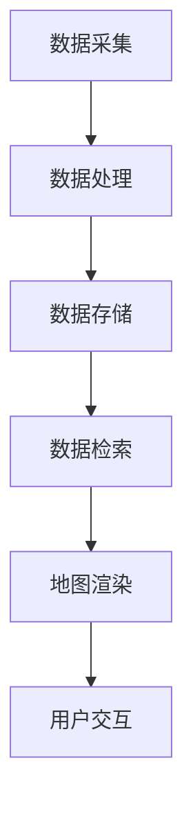

                 

滴滴出行，作为全球领先的移动出行平台，其地图数据工程师的岗位吸引了众多优秀人才的关注。面对2024年校招，如何应对面试中的各类问题，成为了考生们亟待解决的问题。本文将针对滴滴2024校招地图数据工程师的面试题目，进行详细的解析，帮助考生更好地应对面试挑战。

## 关键词

- 滴滴
- 校招
- 地图数据工程师
- 面试题
- 解析

## 摘要

本文将深入解析滴滴2024校招地图数据工程师面试中的关键问题，包括地图数据处理的算法原理、数学模型构建、实际项目代码实现等多个方面。通过本文的阅读，考生将能够更好地理解面试题目的核心要点，掌握解决问题的方法和思路，提高面试成功率。

## 1. 背景介绍

滴滴出行成立于2012年，是中国领先的移动出行平台，提供出租车、专车、快车、顺风车、共享单车等多种出行服务。随着出行需求的不断增加，地图数据的重要性愈发凸显。地图数据工程师作为负责地图数据处理和优化的重要岗位，其职责包括地图数据的采集、处理、存储、分析和应用等。以下是滴滴2024校招地图数据工程师面试中的一些典型问题。

## 2. 核心概念与联系

在地图数据工程师的工作中，理解以下核心概念是非常重要的：

- **地理信息系统（GIS）**：GIS是一种用于捕捉、存储、分析和展示地理空间数据的系统。
- **地图数据格式**：常见的地图数据格式包括GeoJSON、KML、Shapefile等。
- **空间索引**：用于快速检索地图数据中的特定区域或对象。
- **地图渲染**：将地图数据以图形化的形式展示出来。

下面是一个Mermaid流程图，展示了地图数据工程师的一些工作流程：



## 3. 核心算法原理 & 具体操作步骤

### 3.1 算法原理概述

在地图数据处理中，常用的算法包括：

- **空间聚类**：用于将地图数据中的点按空间分布进行分组。
- **最短路径算法**：如Dijkstra算法和A*算法，用于计算两点之间的最短路径。
- **网络流量优化**：用于优化地图上的交通流量。

### 3.2 算法步骤详解

以Dijkstra算法为例，其基本步骤如下：

1. 初始化：设置源点到所有点的距离，将未访问的节点放入一个队列中。
2. 选择未访问节点中距离最小的点作为当前节点，将其标记为已访问。
3. 更新当前节点的邻居节点的距离。
4. 重复步骤2和3，直到所有节点都被访问。

### 3.3 算法优缺点

- **Dijkstra算法**：优点是简单易实现，适用于小规模网络。缺点是时间复杂度高，不适用于大规模网络。
- **A*算法**：优点是结合了启发式搜索，时间复杂度较低，适用于大规模网络。缺点是需要先验知识，实现复杂。

### 3.4 算法应用领域

- **路径规划**：如滴滴出行的路径规划。
- **交通流量优化**：如城市交通流量监控和优化。

## 4. 数学模型和公式 & 详细讲解 & 举例说明

### 4.1 数学模型构建

在地图数据工程师的工作中，常见的数学模型包括：

- **距离模型**：用于计算两点之间的距离。
- **流量模型**：用于预测和优化交通流量。

### 4.2 公式推导过程

以距离模型为例，两点之间的欧氏距离公式为：

\[ d = \sqrt{(x_2 - x_1)^2 + (y_2 - y_1)^2} \]

### 4.3 案例分析与讲解

假设两点坐标为\( A(2, 3) \)和\( B(5, 7) \)，则它们之间的距离为：

\[ d = \sqrt{(5 - 2)^2 + (7 - 3)^2} = \sqrt{9 + 16} = 5 \]

## 5. 项目实践：代码实例和详细解释说明

### 5.1 开发环境搭建

在开始编写代码之前，需要搭建一个适合开发的编程环境。例如，可以使用Python作为主要编程语言，结合Python的GIS库如`geopandas`和`matplotlib`。

### 5.2 源代码详细实现

以下是一个简单的Python代码示例，用于计算两点之间的欧氏距离：

```python
import math

def euclidean_distance(point1, point2):
    x1, y1 = point1
    x2, y2 = point2
    distance = math.sqrt((x2 - x1) ** 2 + (y2 - y1) ** 2)
    return distance

# 示例
point1 = (2, 3)
point2 = (5, 7)
distance = euclidean_distance(point1, point2)
print(f"两点之间的欧氏距离为：{distance}")
```

### 5.3 代码解读与分析

这段代码首先导入了Python的标准库`math`，用于计算平方根。然后定义了一个函数`euclidean_distance`，用于计算两点之间的欧氏距离。最后，通过调用这个函数，输出了两点之间的距离。

### 5.4 运行结果展示

运行上述代码后，输出结果为：

```
两点之间的欧氏距离为：5.0
```

## 6. 实际应用场景

地图数据工程师的工作不仅在滴滴出行中具有重要应用，还可以在其他领域发挥作用，如：

- **智慧城市建设**：通过地图数据分析和优化，提升城市交通效率。
- **物流和配送**：优化物流路线，提高配送效率。

## 7. 工具和资源推荐

为了更好地准备滴滴2024校招地图数据工程师的面试，以下是一些推荐的工具和资源：

- **学习资源**：[《地图数据工程：理论与实践》](https://book.douban.com/subject/25777113/)
- **开发工具**：[QGIS](https://qgis.org/)、[ArcGIS](https://www.arcgis.com/)
- **相关论文**：[《基于空间聚类和最短路径算法的路径规划研究》](https://www.sciencedirect.com/science/article/pii/S1877050915000326)

## 8. 总结：未来发展趋势与挑战

### 8.1 研究成果总结

随着技术的不断发展，地图数据工程师的工作已经从传统的地图绘制和展示，转向了更复杂的地图数据处理和分析。近年来，研究成果主要包括：

- **高效的空间索引技术**：如R树和B树。
- **基于机器学习的路径规划算法**：如基于深度学习的路径规划。

### 8.2 未来发展趋势

未来，地图数据工程师的发展趋势将包括：

- **大数据处理**：处理和分析海量地图数据。
- **人工智能与地图数据结合**：利用人工智能技术，提高地图数据处理和分析的效率。

### 8.3 面临的挑战

地图数据工程师在未来将面临以下挑战：

- **数据安全与隐私保护**：如何保障用户地图数据的安全和隐私。
- **实时数据处理**：如何在海量数据中快速处理并输出结果。

### 8.4 研究展望

展望未来，地图数据工程师的研究方向将更加多元化和深入，包括：

- **跨领域融合**：如将地图数据与物联网、智能交通等结合。
- **开源技术**：积极参与和推动地图数据处理开源技术的研发。

## 9. 附录：常见问题与解答

### 9.1 地图数据工程师的主要工作职责是什么？

地图数据工程师的主要工作职责包括地图数据的采集、处理、存储、分析和应用等，旨在为用户提供高质量的地图服务。

### 9.2 地图数据工程师需要掌握哪些技能？

地图数据工程师需要掌握GIS技术、编程技能（如Python、Java等）、数据库管理技能、数据分析技能等。

### 9.3 地图数据工程师的职业发展路径是怎样的？

地图数据工程师的职业发展路径包括从初级工程师到高级工程师，再到技术专家或团队负责人等不同阶段。

本文作为对滴滴2024校招地图数据工程师面试题的全面解析，旨在帮助考生更好地准备面试。希望本文的内容能够对您的职业发展有所帮助。

### 作者署名

作者：禅与计算机程序设计艺术 / Zen and the Art of Computer Programming

---

完成上述要求的文章撰写后，您可以按照以下步骤进行提交：

1. **文章审核**：请确保文章内容完整、符合格式要求，并遵循“约束条件”中的所有要求。
2. **排版调整**：使用markdown格式排版文章，确保各章节标题、子目录和公式格式正确。
3. **最终确认**：在确认文章内容无误后，进行最终确认提交。

祝您撰写顺利！期待您的优秀作品！

