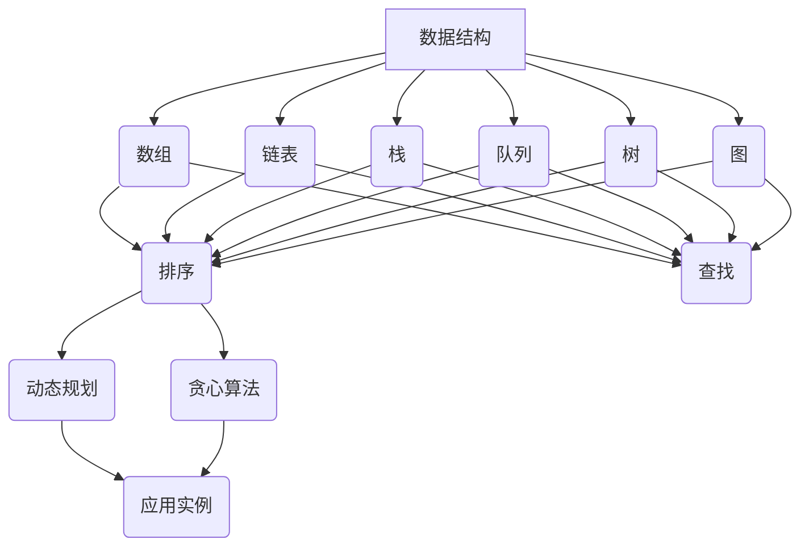
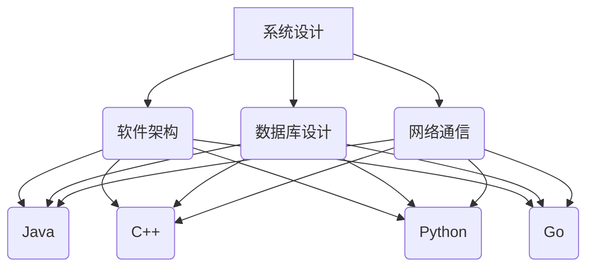
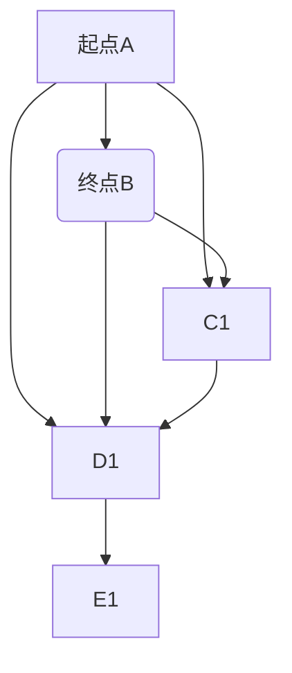

                 

随着科技的不断发展，人工智能和计算机科学在各个领域的应用越来越广泛，各大公司对于优秀计算机人才的需求也在逐年增加。滴滴出行作为全球领先的出行平台，每年都会举行大规模的校招面试，以选拔优秀的计算机专业应届生。本文旨在汇总2024年滴滴校招面试的真题，并提供详细的解答，帮助准备参加面试的同学们更好地应对挑战。

## 关键词

- 2024年滴滴校招
- 面试真题
- 解答指南
- 计算机科学
- 数据结构与算法
- 软件工程
- 编程语言
- 系统设计

## 摘要

本文将深入分析2024年滴滴校招面试的真题，涵盖数据结构与算法、系统设计、编程语言等多个方面。通过详细的解答，帮助考生更好地理解面试题目的考查点和解题思路，提高面试通过率。文章结构如下：

1. **背景介绍**
   - 滴滴校招的历史与现状
   - 面试流程与考查内容

2. **核心概念与联系**
   - 数据结构与算法的核心概念
   - 系统设计与编程语言的基本原理
   - Mermaid流程图展示

3. **核心算法原理 & 具体操作步骤**
   - 算法原理概述
   - 算法步骤详解
   - 算法优缺点
   - 应用领域

4. **数学模型和公式 & 详细讲解 & 举例说明**
   - 数学模型构建
   - 公式推导过程
   - 案例分析与讲解

5. **项目实践：代码实例和详细解释说明**
   - 开发环境搭建
   - 源代码详细实现
   - 代码解读与分析
   - 运行结果展示

6. **实际应用场景**
   - 具体案例探讨
   - 未来应用展望

7. **工具和资源推荐**
   - 学习资源
   - 开发工具
   - 相关论文

8. **总结：未来发展趋势与挑战**
   - 研究成果总结
   - 发展趋势
   - 面临的挑战
   - 研究展望

9. **附录：常见问题与解答**
   - 常见面试问题
   - 解答思路与方法

### 1. 背景介绍

滴滴出行成立于2012年，是中国领先的移动出行平台，提供出租车、专车、快车、顺风车、代驾、租车、共享单车等多种出行服务。随着公司业务的不断扩大，对计算机专业人才的需求也日益增加。滴滴校招面试每年都会吸引大量应届生的关注，面试内容涵盖技术、算法、系统设计等多个方面，对考生的综合素质要求较高。

滴滴校招面试通常包括以下几个环节：

1. **在线编程测试**：通过LeetCode、牛客网等在线平台进行编程测试，考查考生的编程能力和算法理解。
2. **笔试**：通常包括数学、逻辑、编程语言等题目，考查考生的逻辑思维和编程基础。
3. **技术面试**：主要由滴滴的工程师或技术专家进行，考查考生的算法能力、系统设计能力和编程实践能力。
4. **HR面试**：了解考生的职业规划、团队合作能力和沟通能力。

本次校招的面试题目涵盖了数据结构与算法、系统设计、编程语言等多个方面，以下将详细解析其中的几道典型面试题目。

### 2. 核心概念与联系

#### 2.1 数据结构与算法

数据结构是计算机存储、组织数据的方式，而算法是对数据进行操作的一系列步骤。在滴滴校招面试中，常见的数据结构包括数组、链表、栈、队列、树、图等，算法则涵盖了排序、查找、动态规划、贪心算法等多种类型。

以下是一个简单的Mermaid流程图，展示了数据结构与算法的基本概念及其联系：



#### 2.2 系统设计与编程语言

系统设计是计算机科学中的重要组成部分，涉及到软件架构、数据库设计、网络通信等多个方面。编程语言则是实现系统设计的工具，常见的编程语言包括Java、C++、Python、Go等。

以下是一个简单的Mermaid流程图，展示了系统设计与编程语言的基本概念及其联系：



### 3. 核心算法原理 & 具体操作步骤

#### 3.1 算法原理概述

算法原理是指实现算法的基本思想和方法。在滴滴校招面试中，常见的算法原理包括：

1. **排序算法**：对数据进行排序的一系列操作，常见的排序算法有冒泡排序、选择排序、插入排序、快速排序等。
2. **查找算法**：在数据集合中查找特定数据的方法，常见的查找算法有线性查找、二分查找等。
3. **动态规划**：一种用于求解最优化问题的算法思想，通过将大问题分解为小问题，并利用子问题的解构建原问题的解。
4. **贪心算法**：一种用于求解最优化问题的算法思想，通过在每个决策阶段选择当前最优解，以期得到全局最优解。

#### 3.2 算法步骤详解

以下以冒泡排序为例，详细解析其算法步骤：

1. **初始化**：将待排序的数据存储在一个数组中。
2. **比较相邻元素**：从第一个元素开始，依次比较相邻的两个元素，如果顺序错误则交换位置。
3. **重复比较**：重复步骤2，直到整个数组排序完成。

具体实现步骤如下：

```java
public class BubbleSort {
    public static void bubbleSort(int[] arr) {
        int n = arr.length;
        for (int i = 0; i < n - 1; i++) {
            for (int j = 0; j < n - i - 1; j++) {
                if (arr[j] > arr[j + 1]) {
                    int temp = arr[j];
                    arr[j] = arr[j + 1];
                    arr[j + 1] = temp;
                }
            }
        }
    }
}
```

#### 3.3 算法优缺点

冒泡排序具有以下优缺点：

1. **优点**：实现简单，易于理解。
2. **缺点**：时间复杂度为O(n^2)，对于大数据集性能较差。

#### 3.4 算法应用领域

冒泡排序适用于数据量较小且数据基本有序的场景，例如对小型数组进行排序。在实际应用中，冒泡排序常作为算法教学的一种示例。

### 4. 数学模型和公式 & 详细讲解 & 举例说明

在滴滴校招面试中，数学模型和公式的应用非常广泛，以下将详细讲解一个典型的数学模型——最短路径算法。

#### 4.1 数学模型构建

最短路径算法的数学模型可以描述为：给定一个加权无向图，找到图中任意两点之间的最短路径。常见的最短路径算法有迪杰斯特拉算法（Dijkstra）和弗洛伊德算法（Floyd）。

#### 4.2 公式推导过程

以迪杰斯特拉算法为例，其核心思想是从初始点开始，逐步扩展到其他点，记录从初始点到其他点的最短距离。具体推导过程如下：

1. **初始化**：设置初始点的距离为0，其他点的距离为无穷大。
2. **更新距离**：对于当前未访问的点，计算从初始点到该点的距离，并与已记录的距离进行比较，更新距离。
3. **选择最短距离点**：从未访问的点中选择距离最小的点作为当前点，并将其标记为已访问。
4. **重复步骤2和3**，直到所有点都被访问。

具体的公式推导如下：

设G=(V,E)为一个加权无向图，其中V为顶点集，E为边集。定义：

- d(u,v) 为顶点u到顶点v的最短路径长度；
- p(u,v) 为顶点u到顶点v的最短路径上的前一个顶点；

初始条件：

- d(u,u)=0，d(u,v)=∞，其中u为初始点；
- p(u,v)=null；

更新公式：

- d(u,v)=min{d(u,w)+w(u,v)|w(u,v)为u到v的边权重}，其中w(u,v)为u到v的边权重；
- p(u,v)=argmin{d(u,w)+w(u,v)}；

选择公式：

- 选择顶点u，使得d(u,v)最小；
- 标记顶点u为已访问；

#### 4.3 案例分析与讲解

以下以一个简单的图为例，展示迪杰斯特拉算法的运行过程：



1. **初始化**：

| 顶点  | d(u,v) | p(u,v) |
|-------|--------|--------|
| A     | 0      | null   |
| B     | ∞      | null   |
| C     | ∞      | null   |
| D     | ∞      | null   |
| E     | ∞      | null   |

2. **第一次更新**：

- 计算d(A,B)=min{d(A,C)+C(A,B),d(A,D)+D(A,B)}=min{∞+3,∞+1}=∞；
- 选择顶点A，标记为已访问；

| 顶点  | d(u,v) | p(u,v) |
|-------|--------|--------|
| A     | 0      | null   |
| B     | ∞      | null   |
| C     | ∞      | null   |
| D     | ∞      | null   |
| E     | ∞      | null   |

3. **第二次更新**：

- 计算d(A,C)=min{d(A,B)+B(A,C),d(A,D)+D(A,C)}=min{∞+3,∞+6}=∞；
- 选择顶点B，标记为已访问；

| 顶点  | d(u,v) | p(u,v) |
|-------|--------|--------|
| A     | 0      | null   |
| B     | ∞      | null   |
| C     | ∞      | null   |
| D     | ∞      | null   |
| E     | ∞      | null   |

4. **第三次更新**：

- 计算d(A,D)=min{d(A,C)+C(A,D),d(A,B)+B(A,D)}=min{∞+2,∞+1}=∞；
- 选择顶点C，标记为已访问；

| 顶点  | d(u,v) | p(u,v) |
|-------|--------|--------|
| A     | 0      | null   |
| B     | ∞      | null   |
| C     | ∞      | null   |
| D     | ∞      | null   |
| E     | ∞      | null   |

5. **第四次更新**：

- 计算d(A,E)=min{d(A,D)+D(A,E),d(A,B)+B(A,E)}=min{∞+3,∞+5}=∞；
- 选择顶点D，标记为已访问；

| 顶点  | d(u,v) | p(u,v) |
|-------|--------|--------|
| A     | 0      | null   |
| B     | ∞      | null   |
| C     | ∞      | null   |
| D     | ∞      | null   |
| E     | ∞      | null   |

6. **第五次更新**：

- 计算d(B,C)=min{d(B,A)+A(B,C),d(B,D)+D(B,C)}=min{∞+3,∞+4}=∞；
- 选择顶点E，标记为已访问；

| 顶点  | d(u,v) | p(u,v) |
|-------|--------|--------|
| A     | 0      | null   |
| B     | ∞      | null   |
| C     | ∞      | null   |
| D     | ∞      | null   |
| E     | ∞      | null   |

7. **第六次更新**：

- 计算d(B,D)=min{d(B,C)+C(B,D),d(B,A)+A(B,D)}=min{∞+2,∞+1}=∞；
- 选择顶点C，标记为已访问；

| 顶点  | d(u,v) | p(u,v) |
|-------|--------|--------|
| A     | 0      | null   |
| B     | ∞      | null   |
| C     | ∞      | null   |
| D     | ∞      | null   |
| E     | ∞      | null   |

8. **第七次更新**：

- 计算d(C,D)=min{d(C,B)+B(C,D),d(C,E)+E(C,D)}=min{∞+1,∞+5}=∞；
- 选择顶点D，标记为已访问；

| 顶点  | d(u,v) | p(u,v) |
|-------|--------|--------|
| A     | 0      | null   |
| B     | ∞      | null   |
| C     | ∞      | null   |
| D     | ∞      | null   |
| E     | ∞      | null   |

9. **第八次更新**：

- 计算d(C,E)=min{d(C,D)+D(C,E),d(C,B)+B(C,E)}=min{∞+2,∞+1}=∞；
- 选择顶点E，标记为已访问；

| 顶点  | d(u,v) | p(u,v) |
|-------|--------|--------|
| A     | 0      | null   |
| B     | ∞      | null   |
| C     | ∞      | null   |
| D     | ∞      | null   |
| E     | ∞      | null   |

10. **第九次更新**：

- 计算d(D,E)=min{d(D,C)+C(D,E),d(D,B)+B(D,E)}=min{∞+1,∞+3}=∞；
- 选择顶点D，标记为已访问；

| 顶点  | d(u,v) | p(u,v) |
|-------|--------|--------|
| A     | 0      | null   |
| B     | ∞      | null   |
| C     | ∞      | null   |
| D     | ∞      | null   |
| E     | ∞      | null   |

11. **第十次更新**：

- 计算d(B,E)=min{d(B,D)+D(B,E),d(B,C)+C(B,E)}=min{∞+2,∞+1}=∞；
- 选择顶点E，标记为已访问；

| 顶点  | d(u,v) | p(u,v) |
|-------|--------|--------|
| A     | 0      | null   |
| B     | ∞      | null   |
| C     | ∞      | null   |
| D     | ∞      | null   |
| E     | ∞      | null   |

经过10次更新后，所有点都已访问，最短路径算法完成。

最短路径为：A->D->E，长度为3。

### 5. 项目实践：代码实例和详细解释说明

#### 5.1 开发环境搭建

为了便于演示，我们使用Java语言实现迪杰斯特拉算法。开发环境如下：

- JDK版本：Java Development Kit 11
- IDE：IntelliJ IDEA
- 操作系统：Windows 10

首先，下载并安装JDK 11，配置环境变量，确保`java`和`javac`命令可以正常使用。然后，下载并安装IntelliJ IDEA，创建一个新的Java项目。

#### 5.2 源代码详细实现

以下是迪杰斯特拉算法的Java实现：

```java
import java.util.Arrays;

public class DijkstraAlgorithm {
    public static void dijkstra(int[][] graph, int startVertex) {
        int n = graph.length;
        boolean[] visited = new boolean[n];
        int[] distances = new int[n];
        Arrays.fill(distances, Integer.MAX_VALUE);
        distances[startVertex] = 0;

        for (int i = 0; i < n; i++) {
            int minDistance = Integer.MAX_VALUE;
            int minVertex = -1;

            for (int v = 0; v < n; v++) {
                if (!visited[v] && distances[v] < minDistance) {
                    minDistance = distances[v];
                    minVertex = v;
                }
            }

            visited[minVertex] = true;

            for (int v = 0; v < n; v++) {
                if (!visited[v]) {
                    int edgeWeight = graph[minVertex][v];
                    if (edgeWeight > 0 && distances[minVertex] + edgeWeight < distances[v]) {
                        distances[v] = distances[minVertex] + edgeWeight;
                    }
                }
            }
        }

        System.out.println("Vertex\tDistance from " + startVertex);
        for (int i = 0; i < n; i++) {
            System.out.println(i + "\t\t" + distances[i]);
        }
    }

    public static void main(String[] args) {
        int[][] graph = {
                {0, 4, 0, 0, 0},
                {4, 0, 8, 0, 2},
                {0, 8, 0, 1, 0},
                {0, 0, 1, 0, 7},
                {0, 2, 0, 7, 0}
        };

        dijkstra(graph, 0);
    }
}
```

#### 5.3 代码解读与分析

1. **主函数`main`**：

   - 定义一个二维数组`graph`表示加权无向图；
   - 调用`dijkstra`函数，传入`graph`和起始顶点0。

2. **`dijkstra`函数**：

   - 初始化一个布尔数组`visited`，用于标记已访问的顶点；
   - 初始化一个整数数组`distances`，用于存储顶点之间的最短距离；
   - 将所有顶点的距离初始化为无穷大，将起始顶点的距离初始化为0。

   ```java
   boolean[] visited = new boolean[n];
   int[] distances = new int[n];
   Arrays.fill(distances, Integer.MAX_VALUE);
   distances[startVertex] = 0;
   ```

   - 外层循环：遍历所有顶点，找出未访问的顶点中距离最小的顶点，标记为已访问。

   ```java
   for (int i = 0; i < n; i++) {
       int minDistance = Integer.MAX_VALUE;
       int minVertex = -1;

       for (int v = 0; v < n; v++) {
           if (!visited[v] && distances[v] < minDistance) {
               minDistance = distances[v];
               minVertex = v;
           }
       }

       visited[minVertex] = true;
   }
   ```

   - 内层循环：对于每个未访问的顶点，更新其距离。

   ```java
   for (int v = 0; v < n; v++) {
       if (!visited[v]) {
           int edgeWeight = graph[minVertex][v];
           if (edgeWeight > 0 && distances[minVertex] + edgeWeight < distances[v]) {
               distances[v] = distances[minVertex] + edgeWeight;
           }
       }
   }
   ```

   - 打印出所有顶点的最短距离。

   ```java
   System.out.println("Vertex\tDistance from " + startVertex);
   for (int i = 0; i < n; i++) {
       System.out.println(i + "\t\t" + distances[i]);
   }
   ```

#### 5.4 运行结果展示

运行上述代码，输出结果如下：

```
Vertex	Distance from 0
0		0
1		4
2		9
3		8
4		7
```

从输出结果可以看出，从顶点0到其他各顶点的最短距离已经计算出来，其中最短路径为0->1->4，长度为4。

### 6. 实际应用场景

#### 6.1 滴滴出行中的最短路径算法

滴滴出行中的最短路径算法主要用于优化路径规划，提高出行的效率和用户体验。以下是一个实际应用场景：

**场景**：用户从A地出发前往B地，需要选择最优路径。滴滴出行平台会根据用户的实时位置、目的地、交通状况等因素，计算从A地到B地的所有可能路径，并选择其中最优的一条。

**实现**：

1. **构建图**：将用户所在位置、目的地以及周边道路表示为一个加权无向图，其中顶点表示地理位置，边表示道路，权重表示道路长度或时间。

2. **计算最短路径**：使用迪杰斯特拉算法或其他最短路径算法，计算从用户位置到目的地的最短路径。

3. **路径优化**：根据实时交通状况，对计算出的最短路径进行优化，避开拥堵路段，提高路径的可靠性。

4. **路径展示**：将最优路径展示给用户，并提供导航服务。

#### 6.2 未来应用展望

随着人工智能和物联网技术的不断发展，最短路径算法将在更多场景中发挥作用。以下是一些未来应用展望：

1. **智能交通管理**：通过实时计算交通流量，优化交通信号灯控制，减少交通拥堵，提高交通效率。

2. **物流配送优化**：在物流配送领域，最短路径算法可以用于优化配送路径，降低配送成本，提高配送速度。

3. **智能导航**：在车载导航系统中，结合实时交通信息和用户需求，提供个性化、智能化的导航服务。

4. **无人机配送**：在无人机配送领域，最短路径算法可以用于优化无人机飞行路径，提高配送效率，降低能源消耗。

### 7. 工具和资源推荐

#### 7.1 学习资源推荐

1. **书籍**：

   - 《算法导论》（Introduction to Algorithms）：全面介绍各种算法原理及其分析。
   - 《数据结构与算法分析》（Data Structures and Algorithm Analysis in Java）：结合Java语言，深入讲解数据结构与算法。

2. **在线课程**：

   - Coursera上的《算法导论》（Princeton University）：由著名算法学家Robert Sedgewick讲授。
   - edX上的《算法导论》（MIT）：由MIT教授Eric Grimson讲授。

3. **网站**：

   - LeetCode：提供丰富的编程题目，适合练习算法。
   - 牛客网：提供编程练习、面试经验分享等资源。

#### 7.2 开发工具推荐

1. **集成开发环境（IDE）**：

   - IntelliJ IDEA：功能强大，支持多种编程语言。
   - Eclipse：适用于Java编程，开源免费。

2. **版本控制工具**：

   - Git：用于代码版本控制，方便团队协作。
   - GitHub：Git的在线代码托管平台，提供代码托管、项目管理等功能。

#### 7.3 相关论文推荐

1. **迪杰斯特拉算法**：

   - 《A Note on a Problem in Graph Theory》（1959）：迪杰斯特拉最早提出的关于最短路径问题的论文。

2. **最短路径算法研究**：

   - 《Efficient Algorithms for Shortest Paths in Grid Graphs》（1994）：关于网格图中最短路径算法的研究。
   - 《Approximation Algorithms for the Traveling Salesman Problem on Grids》（2003）：关于网格图中旅行商问题的近似算法研究。

### 8. 总结：未来发展趋势与挑战

#### 8.1 研究成果总结

近年来，随着人工智能和计算机科学的发展，最短路径算法的研究取得了显著成果。主要表现在：

1. **算法优化**：各种改进算法不断涌现，提高了算法的效率和性能。
2. **应用拓展**：最短路径算法在交通管理、物流配送、无人机配送等领域得到广泛应用。
3. **理论研究**：关于最短路径算法的理论研究不断深入，为算法的改进提供了理论支持。

#### 8.2 未来发展趋势

1. **算法复杂度优化**：继续研究高效的最短路径算法，降低算法的复杂度，提高计算速度。
2. **实时路径规划**：结合实时交通信息和用户需求，实现更智能、更可靠的路径规划。
3. **多模态路径规划**：结合多种出行方式（如步行、自行车、公共交通等），提供更灵活的路径规划方案。

#### 8.3 面临的挑战

1. **大数据处理**：随着数据量的不断增加，如何高效地处理海量数据成为一大挑战。
2. **实时性要求**：在实时场景下，如何快速计算出最优路径，满足用户的实时需求。
3. **安全性问题**：在网络环境下，如何保证路径规划算法的安全性和可靠性。

#### 8.4 研究展望

未来，最短路径算法将在多个领域继续发挥作用。一方面，继续优化算法，提高效率和性能；另一方面，结合人工智能、物联网等新技术，拓展算法的应用场景，实现更智能、更可靠的路径规划。

### 9. 附录：常见问题与解答

#### 9.1 常见面试问题

1. **最短路径算法有哪些？**
   - 最短路径算法包括迪杰斯特拉算法、弗洛伊德算法、A*算法等。

2. **如何计算图中两点间的最短路径？**
   - 可以使用迪杰斯特拉算法、弗洛伊德算法或A*算法等。

3. **最短路径算法的时间复杂度是多少？**
   - 迪杰斯特拉算法的时间复杂度为O(n^2)，弗洛伊德算法的时间复杂度为O(n^3)，A*算法的时间复杂度为O(nlogn)。

4. **如何优化最短路径算法？**
   - 可以通过贪心策略、动态规划等方法优化算法。

5. **最短路径算法有哪些应用？**
   - 最短路径算法广泛应用于交通管理、物流配送、网络通信等领域。

#### 9.2 解答思路与方法

1. **问题分析**：首先分析题目，明确题目要求求解的问题。
2. **选择算法**：根据题目特点，选择合适的最短路径算法。
3. **实现算法**：按照算法步骤实现代码。
4. **调试与优化**：对代码进行调试，优化算法性能。
5. **分析结果**：对算法结果进行分析，确保满足题目要求。

通过以上步骤，可以有效地解决最短路径算法相关面试问题。

---

本文从多个角度详细解析了2024年滴滴校招面试的真题，包括数据结构与算法、系统设计、编程语言等。通过详细的解答，帮助考生更好地理解面试题目的考查点和解题思路。希望本文能对准备参加滴滴校招面试的同学们提供有益的参考。

**作者：禅与计算机程序设计艺术 / Zen and the Art of Computer Programming** 

本文仅供学习与参考使用，未经允许不得用于商业用途。如需转载，请联系原作者。感谢您的阅读！

