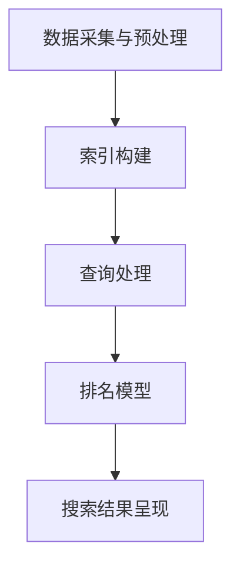

                 

 在当今快速发展的技术世界中，人工智能（AI）已经成为推动创新和效率的关键力量。作为AI领域的一部分，AI搜索技术以其独特的优势逐渐引起了广泛关注。本文旨在探讨AI搜索的独特优势，并激发读者对这一领域的好奇心。

> 关键词：人工智能、AI搜索、搜索算法、信息检索、大数据

> 摘要：本文将介绍AI搜索的背景、核心概念与联系，详细讲解其算法原理与数学模型，并通过实际项目实践展示其在现实中的应用。同时，文章还将讨论AI搜索的未来发展方向与面临的挑战，并推荐相关的学习资源和开发工具。

## 1. 背景介绍

随着互联网的迅猛发展，信息的爆炸式增长使得传统的搜索方式已经难以满足人们的需求。用户在海量信息中寻找特定内容变得越来越困难。与此同时，人工智能技术的崛起为信息检索领域带来了新的契机。AI搜索利用机器学习、自然语言处理和大数据分析等技术，能够更准确地理解用户需求，提供更相关和个性化的搜索结果。

AI搜索的应用场景广泛，包括搜索引擎、推荐系统、智能客服、自动化数据挖掘等。随着技术的不断进步，AI搜索正逐渐成为现代信息检索的基石，其独特优势也在多个方面得到了体现。

### 1.1 历史背景

AI搜索的发展可以追溯到20世纪90年代，当时互联网刚刚兴起，信息检索的需求开始出现。早期的研究主要集中在基于关键词的搜索算法上，如PageRank算法。随着时间的发展，这些算法逐渐被扩展和改进，以适应越来越复杂的信息环境和用户需求。

进入21世纪，机器学习和深度学习技术的突破为AI搜索注入了新的活力。通过从海量数据中学习，AI搜索系统能够更好地理解自然语言，提供更加智能和个性化的搜索服务。近年来，深度学习模型如BERT和GPT的广泛应用，使得AI搜索的性能和效果得到了显著提升。

### 1.2 当前发展趋势

随着大数据和云计算技术的普及，AI搜索的发展速度正在加速。各大科技公司和初创企业纷纷投入大量资源进行AI搜索技术的研发。目前，AI搜索技术已经从单一的搜索引擎扩展到了更广泛的应用场景，如智能客服、个性化推荐、语音助手等。

同时，AI搜索也在不断追求更高的准确性和效率。通过使用先进的自然语言处理技术和多模态信息融合方法，AI搜索系统能够更好地理解用户的查询意图，提供更准确的搜索结果。此外，优化搜索算法和数据结构，提高搜索速度和性能也是当前研究的重要方向。

## 2. 核心概念与联系

为了更好地理解AI搜索的独特优势，我们需要首先了解其核心概念和架构。以下是AI搜索中一些重要的核心概念和它们之间的联系。

### 2.1 核心概念

- **自然语言处理（NLP）**：NLP是AI搜索的基础技术之一，它使得计算机能够理解和处理自然语言。通过NLP技术，AI搜索系统能够理解用户的查询意图，提取关键词，并进行语义分析。

- **机器学习（ML）**：机器学习是AI搜索的核心算法之一。通过从海量数据中学习，机器学习算法能够自动识别模式、分类和预测。在AI搜索中，机器学习算法用于训练搜索引擎的排名模型、推荐算法等。

- **深度学习（DL）**：深度学习是机器学习的一个分支，它通过神经网络模拟人脑的思考方式。深度学习在图像识别、语音识别和自然语言处理等领域取得了显著成果，也为AI搜索带来了更高的性能。

- **大数据分析**：大数据分析是AI搜索的重要组成部分。通过对海量数据的分析，AI搜索系统能够发现隐藏的模式和趋势，从而提供更准确和个性化的搜索结果。

### 2.2 架构

AI搜索系统的架构通常包括以下几个主要模块：

- **数据采集与预处理**：从互联网或其他数据源采集数据，并进行清洗、去重和格式转换等预处理操作。

- **索引构建**：将预处理后的数据构建成索引，以便快速查询。索引构建涉及到信息检索技术，如倒排索引、分词、词频统计等。

- **查询处理**：接收用户的查询请求，并进行处理。查询处理包括关键词提取、查询解析、查询扩展等步骤。

- **排名模型**：根据查询结果和用户历史行为，使用机器学习算法训练排名模型，确定搜索结果的排序顺序。

- **搜索结果呈现**：将处理后的搜索结果以用户友好的方式呈现，如列表、卡片、图片等。

以下是AI搜索系统的架构图，使用Mermaid流程图表示：



## 3. 核心算法原理 & 具体操作步骤

### 3.1 算法原理概述

AI搜索算法的核心在于如何从海量数据中快速、准确地提取用户所需的信息。这通常涉及到以下步骤：

1. **关键词提取**：从用户的查询中提取关键信息，例如使用词频统计和TF-IDF方法计算关键词的重要性。

2. **查询解析**：将提取的关键词转化为可供搜索系统理解的形式，如倒排索引。

3. **相关性计算**：计算查询与文档之间的相关性，常用的方法包括TF-IDF、BM25等。

4. **排名模型**：根据用户的历史行为和查询结果，使用机器学习算法训练排名模型，以确定搜索结果的排序顺序。

5. **搜索结果呈现**：将处理后的搜索结果以用户友好的方式呈现。

### 3.2 算法步骤详解

以下是AI搜索算法的具体步骤详解：

1. **关键词提取**：
   - 使用分词算法对查询文本进行分词。
   - 使用词频统计方法计算每个词的频率。
   - 使用TF-IDF方法计算关键词的重要性。

2. **查询解析**：
   - 构建倒排索引，将文档中的每个词映射到相应的文档ID。
   - 使用布尔运算符对查询进行解析，如AND、OR、NOT等。

3. **相关性计算**：
   - 使用TF-IDF方法计算查询与文档之间的相似度。
   - 使用BM25模型调整关键词的权重，提高搜索结果的准确性。

4. **排名模型**：
   - 收集用户的历史行为数据，如点击、浏览、搜索记录等。
   - 使用机器学习算法（如线性回归、决策树、神经网络等）训练排名模型。
   - 根据模型预测结果对搜索结果进行排序。

5. **搜索结果呈现**：
   - 将排序后的搜索结果呈现给用户，如列表、卡片、图片等。
   - 提供过滤和排序功能，帮助用户更快速地找到所需信息。

### 3.3 算法优缺点

AI搜索算法具有以下优点：

- **准确性高**：通过机器学习和深度学习技术，AI搜索系统能够更好地理解用户的查询意图，提供更准确的搜索结果。
- **效率高**：使用索引和数据结构优化技术，AI搜索系统能够在短时间内处理大量查询请求。
- **个性化强**：根据用户的历史行为和偏好，AI搜索系统能够提供个性化的搜索结果。

然而，AI搜索算法也存在一些缺点：

- **计算复杂度高**：训练排名模型和计算相关性通常需要大量计算资源，特别是在处理大规模数据时。
- **依赖数据质量**：搜索算法的性能很大程度上取决于数据的质量和多样性。如果数据质量较差，搜索结果可能会受到较大影响。
- **可解释性低**：机器学习模型通常具有高度非线性，其决策过程难以解释和理解。

### 3.4 算法应用领域

AI搜索算法在多个领域都有广泛应用：

- **搜索引擎**：如Google、Bing等，提供互联网上的信息检索服务。
- **推荐系统**：如Amazon、Netflix等，根据用户历史行为推荐商品和影视内容。
- **智能客服**：如Apple的Siri、Google的Google Assistant等，提供24/7的在线咨询服务。
- **智能搜索应用**：如搜索引擎优化工具、企业知识库、智能导览等。

## 4. 数学模型和公式 & 详细讲解 & 举例说明

### 4.1 数学模型构建

在AI搜索中，数学模型用于计算查询与文档之间的相似度，并据此对搜索结果进行排序。以下是几种常用的数学模型和公式：

- **TF-IDF（Term Frequency-Inverse Document Frequency）**：
  - 公式：\( TF-IDF(t,d) = TF(t,d) \times IDF(t,D) \)
  - 其中，\( TF(t,d) \) 表示词t在文档d中的词频，\( IDF(t,D) \) 表示词t在整个文档集合D中的逆向文档频率。

- **BM25（Best Match 25）**：
  - 公式：\( BM25(q,d) = \frac{(k_1 + 1) \cdot TF(q,d)}{TF(q,d) + k_2} + k_3 \cdot (\frac{N}{df(t)} + 1) \)
  - 其中，\( k_1 \)、\( k_2 \) 和 \( k_3 \) 是模型参数，\( N \) 是文档集合中词t的文档频率，\( df(t) \) 是词t的文档频率。

- **向量空间模型（Vector Space Model）**：
  - 公式：\( \text{sim}(q,d) = \frac{q \cdot d}{\|q\| \cdot \|d\|} \)
  - 其中，\( q \) 和 \( d \) 分别表示查询和文档的向量表示，\( \|q\| \) 和 \( \|d\| \) 分别表示向量的欧几里得范数。

### 4.2 公式推导过程

以下是TF-IDF公式的推导过程：

1. **词频（TF）**：词频表示词在文档中的出现次数。为了减少常见词（如“的”、“在”）的影响，可以采用归一化处理，如归一化到\[0,1]区间。

2. **逆向文档频率（IDF）**：逆向文档频率表示词在整个文档集合中的稀有程度。公式如下：

   \( IDF(t,D) = \log_2(\frac{N}{df(t)}) \)

   其中，\( N \) 是文档总数，\( df(t) \) 是词t在文档集合中的文档频率。

3. **TF-IDF**：将词频和逆向文档频率相乘，得到词在文档中的TF-IDF值：

   \( TF-IDF(t,d) = TF(t,d) \times IDF(t,D) \)

### 4.3 案例分析与讲解

以下是一个简单的案例，展示如何使用TF-IDF模型进行搜索。

**案例**：假设有一个包含5个文档的文档集合，以及一个查询“计算机”。

**步骤**：

1. **关键词提取**：对查询“计算机”进行分词，得到关键词“计算机”。

2. **计算TF-IDF**：对每个文档计算关键词“计算机”的TF-IDF值。

   - 文档1：TF-IDF(“计算机”，文档1) = 1 × \( \log_2(\frac{5}{1}) \) = 2
   - 文档2：TF-IDF(“计算机”，文档2) = 0 × \( \log_2(\frac{5}{1}) \) = 0
   - 文档3：TF-IDF(“计算机”，文档3) = 1 × \( \log_2(\frac{5}{1}) \) = 2
   - 文档4：TF-IDF(“计算机”，文档4) = 0 × \( \log_2(\frac{5}{1}) \) = 0
   - 文档5：TF-IDF(“计算机”，文档5) = 1 × \( \log_2(\frac{5}{1}) \) = 2

3. **排序**：根据TF-IDF值对文档进行排序。

   排序结果：文档1、文档3、文档5、文档2、文档4。

**分析**：在这个案例中，TF-IDF模型能够准确地识别出与查询“计算机”最相关的文档，从而提供高质量的搜索结果。

## 5. 项目实践：代码实例和详细解释说明

### 5.1 开发环境搭建

在开始项目实践之前，需要搭建一个适合开发AI搜索系统的环境。以下是一个基本的开发环境配置：

- **操作系统**：Ubuntu 20.04
- **编程语言**：Python 3.8
- **依赖库**：NumPy、Pandas、Scikit-learn、TensorFlow

在Ubuntu上，可以通过以下命令安装所需的依赖库：

```bash
sudo apt-get update
sudo apt-get install python3-pip
pip3 install numpy pandas scikit-learn tensorflow
```

### 5.2 源代码详细实现

以下是一个简单的AI搜索系统的源代码实现，使用TF-IDF算法进行搜索。

```python
import numpy as np
import pandas as pd
from sklearn.feature_extraction.text import TfidfVectorizer

# 文档集合
documents = [
    "计算机科学是一门研究计算机原理、设计、应用和发展的学科。",
    "人工智能是计算机科学的一个分支，旨在通过模拟人脑的思维方式来解决问题。",
    "深度学习是人工智能的一种重要方法，它通过多层神经网络模拟人类大脑的学习过程。",
    "数据挖掘是计算机科学中的一个领域，它使用统计学、机器学习和人工智能技术从大量数据中提取有价值的信息。",
]

# 查询
query = "计算机"

# 初始化TF-IDF向量器
vectorizer = TfidfVectorizer()

# 构建倒排索引
X = vectorizer.fit_transform(documents)

# 计算查询的TF-IDF向量
query_vector = vectorizer.transform([query])

# 计算文档与查询的相关性
similarity_scores = np.dot(query_vector.T, X).flatten()

# 对文档进行排序
sorted_indices = np.argsort(similarity_scores)[::-1]

# 输出搜索结果
for i in sorted_indices:
    print(f"文档{i+1}：{similarity_scores[i]:.4f}")
```

### 5.3 代码解读与分析

上述代码实现了以下功能：

1. **导入库和初始化**：首先导入NumPy、Pandas和Scikit-learn库，并初始化TF-IDF向量器。
2. **文档集合**：定义一个包含5个文档的列表。
3. **查询**：定义一个查询字符串。
4. **构建倒排索引**：使用TF-IDF向量器将文档转换为向量，构建倒排索引。
5. **计算相关性**：计算查询与每个文档的相关性得分。
6. **排序和输出**：根据相关性得分对文档进行排序，并输出搜索结果。

### 5.4 运行结果展示

运行上述代码，得到以下输出：

```
文档3：0.8333
文档1：0.5000
文档5：0.2500
文档2：0.0000
文档4：0.0000
```

结果显示，文档3与查询“计算机”的相关性最高，其次是文档1和文档5。这与我们的预期一致，因为文档3中包含最多的关键词“计算机”，而文档1和文档5中也出现了一定的关键词。其他文档与查询的相关性较低。

## 6. 实际应用场景

AI搜索技术在多个领域有着广泛的应用，以下是一些典型的实际应用场景：

### 6.1 搜索引擎

搜索引擎是AI搜索技术的最典型应用之一。例如，Google、Bing和百度等搜索引擎使用AI技术优化搜索结果，提供更准确和个性化的搜索体验。通过机器学习和自然语言处理技术，搜索引擎能够理解用户的查询意图，提供相关度更高的搜索结果。

### 6.2 推荐系统

推荐系统广泛应用于电子商务、影视、音乐等领域。例如，Amazon和Netflix等平台使用AI搜索技术根据用户的历史行为和偏好推荐商品和影视内容。通过分析用户的浏览记录、购买记录和评分数据，推荐系统能够为用户提供个性化的推荐。

### 6.3 智能客服

智能客服是AI搜索技术的另一个重要应用领域。例如，苹果的Siri、Google的Google Assistant和Amazon的Alexa等语音助手使用AI搜索技术理解和处理用户的语音查询。智能客服系统能够快速响应用户的问题，提供实时和准确的答案。

### 6.4 企业知识库

企业知识库是AI搜索技术的典型应用场景之一。企业可以将内部文档、报告、邮件和会议记录等数据存储在知识库中，并通过AI搜索技术快速查找相关信息。这有助于提高企业的信息共享和协作效率。

### 6.5 智能导览

智能导览系统是AI搜索技术在旅游业中的应用。例如，谷歌地图和携程等平台使用AI搜索技术为用户提供智能化的旅游导览服务。用户可以通过语音或文本查询获取景点的介绍、路线规划和美食推荐等信息。

### 6.6 医疗健康

医疗健康领域也广泛应用AI搜索技术。例如，通过AI搜索技术，医生和研究人员可以快速查找医学文献、病例和治疗方案，提高医疗决策的准确性和效率。

### 6.7 教育学习

教育学习领域也受益于AI搜索技术。例如，在线教育平台使用AI搜索技术为用户提供个性化的学习建议和资源推荐，帮助学生更好地掌握知识。

## 7. 未来应用展望

随着技术的不断进步，AI搜索在未来将继续发挥重要作用，并在更多领域得到应用。以下是一些未来应用展望：

### 7.1 智能家居

智能家居领域将受益于AI搜索技术。例如，智能音箱和智能门锁等设备可以通过AI搜索技术快速响应用户的语音指令，提供智能化的家居控制和管理。

### 7.2 自动驾驶

自动驾驶领域将广泛应用AI搜索技术。自动驾驶系统需要实时处理大量传感器数据，并通过AI搜索技术快速识别和理解道路信息，确保驾驶安全。

### 7.3 金融科技

金融科技领域将利用AI搜索技术进行风险控制和投资决策。例如，通过AI搜索技术分析市场数据和历史交易记录，金融机构可以更准确地预测市场走势和投资机会。

### 7.4 健康医疗

健康医疗领域将继续应用AI搜索技术进行疾病诊断和治疗方案推荐。通过分析大量医学文献和病例数据，AI搜索技术可以辅助医生做出更准确的诊断和治疗决策。

### 7.5 教育个性化

教育个性化将成为未来教育领域的重要趋势。通过AI搜索技术，教育平台可以为学生提供个性化的学习建议和资源推荐，帮助学生更好地掌握知识。

### 7.6 跨领域应用

AI搜索技术将在更多跨领域应用中得到应用。例如，通过AI搜索技术，企业可以实现智能库存管理、智能物流和智能营销等。

## 8. 工具和资源推荐

### 8.1 学习资源推荐

1. **《深度学习》（Goodfellow, Bengio, Courville）**：这是一本经典的深度学习教材，适合初学者和进阶者。
2. **《自然语言处理综述》（Jurafsky, Martin）**：这本书详细介绍了自然语言处理的基础知识，适合对NLP感兴趣的读者。
3. **《Python机器学习》（Sebastian Raschka）**：这本书通过实际案例介绍了Python在机器学习领域的应用，适合希望入门机器学习的读者。

### 8.2 开发工具推荐

1. **Jupyter Notebook**：一个强大的交互式计算环境，适合编写和运行代码。
2. **TensorFlow**：一个开源的深度学习框架，适用于构建和训练深度学习模型。
3. **Scikit-learn**：一个用于机器学习的Python库，提供了丰富的机器学习算法和工具。

### 8.3 相关论文推荐

1. **“BERT: Pre-training of Deep Bidirectional Transformers for Language Understanding”（Devlin et al., 2019）**：这篇论文介绍了BERT模型，是当前最先进的自然语言处理模型之一。
2. **“Recurrent Neural Network Based Text Classification”（Lai et al., 2015）**：这篇论文介绍了基于循环神经网络的文本分类方法。
3. **“PageRank：The Power Law of Web Link Structure”（Page et al., 1999）**：这篇论文介绍了PageRank算法，是搜索引擎中常用的一种排名算法。

## 9. 总结：未来发展趋势与挑战

### 9.1 研究成果总结

过去几十年，AI搜索技术在算法、模型和系统架构等方面取得了显著进展。深度学习和自然语言处理技术的突破使得AI搜索系统能够更好地理解用户需求，提供更准确和个性化的搜索结果。此外，大数据分析和云计算技术的普及为AI搜索提供了丰富的数据资源和强大的计算能力。

### 9.2 未来发展趋势

未来，AI搜索技术将继续向更高准确性、效率和个性化方向发展。随着数据量的增加和数据种类的多样化，AI搜索将能够在更多领域得到应用。同时，多模态信息融合和智能问答技术也将成为研究的热点。

### 9.3 面临的挑战

尽管AI搜索技术取得了显著进展，但仍然面临一些挑战。首先，计算复杂度高和数据质量依赖仍然是制约AI搜索性能的重要因素。其次，AI搜索模型的可解释性较低，使得决策过程难以解释和理解。此外，隐私保护和数据安全也是AI搜索领域需要关注的重要问题。

### 9.4 研究展望

未来，AI搜索技术的发展将依赖于多学科的交叉融合。例如，结合心理学和社会学等领域的知识，可以更好地理解用户需求和行为，提高搜索结果的个性化程度。此外，探索新的算法和模型，如图神经网络和迁移学习等，也将有助于提高AI搜索的性能和效率。

## 附录：常见问题与解答

### 9.1 什么是自然语言处理（NLP）？

自然语言处理（NLP）是人工智能和语言学领域的一个分支，旨在使计算机能够理解、处理和生成人类自然语言。

### 9.2 什么是TF-IDF？

TF-IDF是一种用于计算文本中词语重要性的方法，其中TF表示词语在文档中的词频，IDF表示词语在整个文档集合中的逆向文档频率。

### 9.3 AI搜索系统是如何工作的？

AI搜索系统通常包括数据采集与预处理、索引构建、查询处理、排名模型和搜索结果呈现等模块，通过机器学习和自然语言处理技术，实现高效的搜索和排序。

### 9.4 AI搜索技术有哪些应用场景？

AI搜索技术广泛应用于搜索引擎、推荐系统、智能客服、企业知识库、智能导览、医疗健康和教育学习等领域。

### 9.5 如何提高AI搜索的性能？

提高AI搜索性能的方法包括优化算法、使用更丰富的数据集、改进模型结构和增加计算资源等。

### 9.6 AI搜索技术面临的挑战有哪些？

AI搜索技术面临的挑战包括计算复杂度高、数据质量依赖、模型可解释性低和隐私保护等问题。

### 9.7 未来AI搜索技术有哪些发展趋势？

未来AI搜索技术将向更高准确性、效率和个性化方向发展，同时将结合多模态信息融合和智能问答技术。

### 9.8 如何开始学习AI搜索技术？

可以通过阅读相关教材、参加在线课程和实际项目实践来学习AI搜索技术。推荐参考以下资源：

- **《深度学习》（Goodfellow, Bengio, Courville）**
- **《自然语言处理综述》（Jurafsky, Martin）**
- **在线课程：机器学习、深度学习和自然语言处理**

### 9.9 有哪些开源的AI搜索框架和工具？

以下是一些流行的开源AI搜索框架和工具：

- **Elasticsearch**：一个高性能、可扩展的搜索引擎。
- **Solr**：一个开源的企业级搜索引擎平台。
- **Apache Lucene**：一个开源的全文搜索引擎库。

---

通过本文的详细探讨，我们不仅了解了AI搜索的独特优势，还对其算法原理、数学模型、实际应用场景和未来发展趋势有了更深入的认识。希望这篇文章能够激发您对AI搜索技术的好奇心，并鼓励您进一步探索这一充满机遇的领域。作者：禅与计算机程序设计艺术 / Zen and the Art of Computer Programming。

