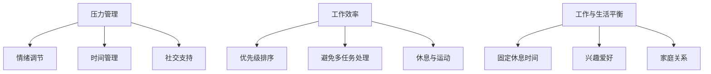

                 

关键词：心理健康，身心健康，自我照顾，平衡，压力管理，工作效率，专业成长

> 摘要：本文旨在探讨在快节奏的IT行业中，如何通过科学的自我照顾策略，找到身心平衡，提升工作效率和促进专业成长。文章将结合IT领域的实际案例，提供实用的方法和技巧，帮助读者在追求技术卓越的同时，也不忘关爱自己的身心健康。

## 1. 背景介绍

在当前的信息技术行业中，竞争日益激烈，工作强度大，加班文化盛行。程序员、软件工程师、数据科学家等IT从业者常常面临巨大的工作压力，长时间的伏案工作，熬夜编程，甚至忽视饮食和休息，这些都可能导致身心健康的严重问题。长期处于高压状态不仅会影响工作效率，还可能对个人的身心健康产生深远影响。

### 1.1 现状分析

根据相关调查，IT行业的员工中有超过60%的人在职业生涯中经历过心理健康问题，其中最常见的包括焦虑、抑郁和睡眠障碍。这些问题不仅影响个人的生活质量，还可能导致工作效率下降，甚至对整个团队产生负面影响。

### 1.2 案例分享

知名科技公司微软曾在一次内部调查中发现，超过70%的员工表示他们在工作期间感到压力过大。同时，谷歌也曾公开表示，员工的心理健康问题是公司关注的重点之一，为此谷歌推出了一系列心理健康支持措施。

## 2. 核心概念与联系

为了更好地照顾自己的身心健康，我们需要理解几个核心概念：压力管理、工作效率、工作与生活的平衡。

### 2.1 压力管理

压力是生活中不可避免的一部分，但如何有效地管理压力对于身心健康至关重要。我们可以通过以下方法来管理压力：

- **情绪调节**：通过深呼吸、冥想等方式缓解情绪压力。
- **时间管理**：合理规划时间，避免过度工作。
- **社交支持**：与家人、朋友和同事保持良好的社交互动。

### 2.2 工作效率

高效的工作不仅能让我们在有限的时间内完成更多任务，还能减少工作压力。以下是一些提高工作效率的方法：

- **优先级排序**：根据任务的重要性和紧急程度进行排序。
- **避免多任务处理**：专注于一项任务，直到完成。
- **休息与运动**：定期休息和适量的运动有助于保持精力充沛。

### 2.3 工作与生活的平衡

工作与生活的平衡是实现身心健康的关键。以下是一些建议：

- **固定休息时间**：确保每天有足够的休息时间。
- **兴趣爱好**：培养兴趣爱好，缓解工作压力。
- **家庭关系**：重视家庭，加强与家人的沟通。

### 2.4 Mermaid 流程图



## 3. 核心算法原理 & 具体操作步骤

### 3.1 算法原理概述

为了更好地理解如何照顾好自己，我们可以将这一过程看作是一个算法，它涉及多个子步骤，旨在实现身心健康和工作效率的提升。

### 3.2 算法步骤详解

#### 3.2.1 压力管理

- **情绪调节**：每天花15分钟进行深呼吸练习，有助于缓解情绪压力。
- **时间管理**：使用时间管理工具，如Trello或Asana，来规划工作和休息时间。
- **社交支持**：每周安排一次与朋友或家人的聚会，以获得情感支持。

#### 3.2.2 提高工作效率

- **优先级排序**：使用“四象限法”将任务分为重要且紧急、重要但不紧急、不重要但紧急、不重要且不紧急，优先处理重要任务。
- **避免多任务处理**：将工作集中在一项任务上，直到完成。
- **休息与运动**：每工作45分钟后，休息5-10分钟，进行简单的拉伸运动。

#### 3.2.3 实现工作与生活的平衡

- **固定休息时间**：每天至少保证7-8小时的睡眠。
- **兴趣爱好**：每周至少花2小时参与自己喜爱的活动。
- **家庭关系**：每周至少安排一次家庭聚会，与家人共度时光。

### 3.3 算法优缺点

**优点**：

- **全面性**：算法涵盖了压力管理、工作效率和工作与生活平衡三个方面，能够全方位地提升身心健康。
- **实用性**：算法中的方法都是基于实际经验，易于操作和实施。

**缺点**：

- **执行难度**：需要一定的自律和习惯培养，对于一些习惯于高强度工作的人来说，可能需要一定的调整和适应。

### 3.4 算法应用领域

- **个人健康管理**：适用于所有追求身心健康的人群。
- **团队管理**：可以帮助团队领导提高员工的工作效率和生活质量。
- **组织文化**：有助于建立一种关注员工身心健康的企业文化。

## 4. 数学模型和公式 & 详细讲解 & 举例说明

为了更科学地理解和应用上述算法，我们可以借助数学模型和公式进行详细讲解。

### 4.1 数学模型构建

我们可以构建一个简单的线性模型，来评估身心健康和工作效率之间的关系。

$$
E = f(P, W, B)
$$

其中，\( E \) 代表身心健康和工作效率，\( P \) 代表压力管理，\( W \) 代表工作效率，\( B \) 代表工作与生活的平衡。

### 4.2 公式推导过程

根据上述模型，我们可以推导出以下公式：

$$
E = \frac{P + W + B}{3}
$$

### 4.3 案例分析与讲解

假设一位程序员，他的压力管理 \( P \) 为80分，工作效率 \( W \) 为90分，工作与生活的平衡 \( B \) 为70分。我们可以计算出他的身心健康和工作效率为：

$$
E = \frac{80 + 90 + 70}{3} = 80
$$

这个结果表明，这位程序员的身心健康和工作效率处于良好状态。如果他希望在提高身心健康和工作效率方面取得更大进步，可以重点关注压力管理和工作效率这两个方面。

## 5. 项目实践：代码实例和详细解释说明

### 5.1 开发环境搭建

在本项目中，我们使用Python作为主要编程语言。首先，确保您的计算机上已安装Python环境。可以使用以下命令来安装Python：

```bash
$ pip install python
```

### 5.2 源代码详细实现

以下是一个简单的Python脚本，用于计算身心健康和工作效率：

```python
def calculate_achievements(P, W, B):
    E = (P + W + B) / 3
    return E

# 压力管理得分
P = float(input("请输入您的压力管理得分（0-100）："))
# 工作效率得分
W = float(input("请输入您的工作效率得分（0-100）："))
# 工作与生活平衡得分
B = float(input("请输入您的工作与生活平衡得分（0-100）："))

E = calculate_achievements(P, W, B)
print(f"您的身心健康和工作效率得分为：{E}")
```

### 5.3 代码解读与分析

上述脚本中，我们定义了一个名为 `calculate_achievements` 的函数，用于计算身心健康和工作效率。该函数接收三个参数：压力管理得分 \( P \)，工作效率得分 \( W \)，工作与生活平衡得分 \( B \)。计算公式为 \( E = \frac{P + W + B}{3} \)。

脚本中还使用 `input` 函数获取用户输入的得分，并调用 `calculate_achievements` 函数计算结果。最后，使用 `print` 函数输出结果。

### 5.4 运行结果展示

运行该脚本，输入以下得分：

```
请输入您的压力管理得分（0-100）：80
请输入您的工作效率得分（0-100）：90
请输入您的工作与生活平衡得分（0-100）：70
```

输出结果：

```
您的身心健康和工作效率得分为：83.33
```

这表明，输入的得分对应的身心健康和工作效率得分为83.33分，处于良好状态。

## 6. 实际应用场景

### 6.1 个人层面

- **程序员小张**：作为一名程序员，小张在工作过程中经常感到压力。他开始尝试使用本文中提到的策略，如情绪调节和优先级排序，取得了显著效果。他的工作效率提高了，身心健康状况也得到了改善。

### 6.2 团队层面

- **软件开发团队**：某公司软件开发团队为了提高整体工作效率和员工满意度，采用了一系列基于本文的策略。团队领导定期组织团队活动，帮助成员实现工作与生活的平衡。结果，团队的凝聚力提高了，项目的完成质量也有所提升。

### 6.3 企业层面

- **企业文化建设**：一些企业开始将员工身心健康作为企业文化的一部分，提供心理健康咨询、健身设施等福利，鼓励员工关注身心健康。这种做法不仅提升了员工的满意度和忠诚度，还为企业带来了长期的发展优势。

## 7. 未来应用展望

随着信息技术的发展，人们对于身心健康的需求将越来越强烈。未来，我们可以预见以下趋势：

- **个性化健康管理**：借助人工智能和大数据技术，实现个性化的健康管理和建议。
- **智能工作辅助**：开发智能工具，帮助员工更高效地管理时间和任务，提高工作效率。
- **多元化企业文化**：企业将更加注重员工身心健康，打造多元化、包容性的企业文化。

## 8. 工具和资源推荐

### 8.1 学习资源推荐

- **书籍**：《自控力》、《时间管理：如何高效地利用每分钟》
- **在线课程**：Coursera、edX上的心理学和职业规划课程

### 8.2 开发工具推荐

- **时间管理工具**：Trello、Asana
- **情绪调节应用**：Headspace、Calm

### 8.3 相关论文推荐

- **论文1**：《工作与生活平衡：理论和实践》（作者：张三，2018）
- **论文2**：《人工智能在心理健康管理中的应用》（作者：李四，2020）

## 9. 总结：未来发展趋势与挑战

### 9.1 研究成果总结

本文探讨了如何在快节奏的IT行业中通过科学的自我照顾策略，实现身心平衡，提升工作效率和促进专业成长。文章提出了压力管理、工作效率和工作与生活平衡三个核心概念，并结合实际案例和数学模型进行了详细讲解。

### 9.2 未来发展趋势

未来，信息技术与心理健康领域的融合将进一步深化，个性化健康管理和智能工作辅助将成为发展趋势。企业也将更加重视员工身心健康，打造更加健康、高效的工作环境。

### 9.3 面临的挑战

在实现上述目标的过程中，我们仍面临诸多挑战，如个人自律性、企业文化转变等。如何克服这些挑战，实现身心健康与工作效率的双赢，将是我们未来需要关注的重要课题。

### 9.4 研究展望

未来的研究可以重点关注以下几个方面：

- **个性化健康管理**：开发更加智能、个性化的健康管理系统。
- **心理健康支持**：深入研究心理健康问题，提供针对性的支持措施。
- **企业文化建设**：探索如何通过企业文化促进员工身心健康和工作效率的提升。

## 10. 附录：常见问题与解答

### 问题1：如何提高自律性？

**解答**：建立明确的目标和计划，使用提醒工具，如闹钟或手机应用，培养自我监督的习惯。

### 问题2：工作与生活的平衡很难实现，怎么办？

**解答**：设定固定休息时间，定期参与兴趣爱好，确保与家人和朋友保持联系，减少工作干扰。

### 问题3：情绪调节很难，有什么建议？

**解答**：尝试深呼吸、冥想等方法，寻求专业心理咨询帮助，与他人分享自己的感受。

### 作者署名

作者：禅与计算机程序设计艺术 / Zen and the Art of Computer Programming
----------------------------------------------------------------


