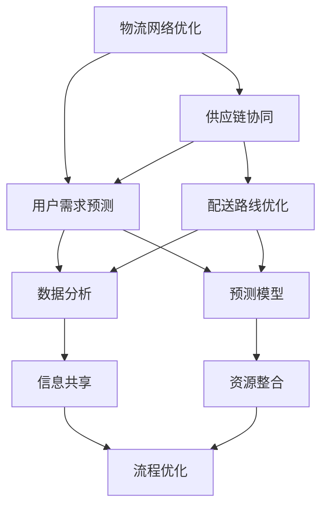

                 

在当今快速发展的电子商务时代，物流行业正面临着前所未有的机遇与挑战。物流经理们正面临着如何提升配送效率、降低成本以及提供卓越的用户体验这三重挑战。对于创业者来说，物流行业蕴含着丰富的创新空间和商业机会。本文将深入探讨物流经理在提升配送效率和用户体验方面的创业机遇，并提供一系列策略和解决方案。

## 关键词：物流，配送效率，用户体验，创业，创新

## 摘要：本文将探讨物流经理在提升配送效率和用户体验方面的创业机遇。通过分析物流行业的现状，本文将提出一系列可行的策略，包括技术手段、运营优化和商业模式创新。此外，本文还将讨论物流经理如何抓住这些机遇，实现企业的可持续发展。

### 1. 背景介绍

物流行业的快速发展离不开电子商务的推动。随着消费者对购物便捷性的需求日益增长，物流企业必须不断提升配送效率，以满足消费者对快速、准确配送的要求。然而，传统的物流模式在应对这些需求时往往显得力不从心。物流经理们正面临着如何在有限的资源下，实现高效、精准、低成本的配送挑战。

同时，用户体验在物流行业中扮演着至关重要的角色。消费者不再满足于简单的送货上门服务，他们期望在购物过程中享受到优质的服务体验。从订单处理到配送，每一步都影响着消费者对物流企业的满意度。因此，提升用户体验成为物流经理们的重要任务。

在这样的大背景下，物流经理们面临着巨大的创业机遇。通过技术创新、运营优化和商业模式创新，物流经理们可以在提升配送效率和用户体验方面取得显著成效，从而在竞争激烈的物流市场中脱颖而出。

### 2. 核心概念与联系

#### 物流网络优化

物流网络优化是提升配送效率的关键环节。通过优化配送路线、仓储布局和运输方式，物流企业可以显著降低运输成本，提高配送效率。具体来说，物流网络优化包括以下几个方面：

- **配送路线优化**：利用现代算法，如遗传算法、蚁群算法等，对配送路线进行优化，以减少行驶距离和时间，提高配送效率。
- **仓储布局优化**：通过优化仓储设施布局，实现货物快速存取，减少库存成本，提高仓储效率。
- **运输方式优化**：根据货物的类型、体积和配送距离，选择最合适的运输方式，如公路、铁路、航空等。

#### 供应链协同

供应链协同是实现高效物流的另一个关键因素。通过协同各方资源，实现供应链各环节的紧密衔接，物流企业可以大幅提高配送效率。供应链协同包括以下几个方面：

- **信息共享**：通过搭建信息共享平台，实现供应链各环节的信息互通，提高供应链的透明度和响应速度。
- **资源整合**：整合各方资源，如车辆、仓库、配送人员等，实现资源的最优配置，提高配送效率。
- **流程优化**：通过优化供应链各环节的流程，减少不必要的环节，提高供应链的整体效率。

#### 用户需求预测

用户需求预测是提升用户体验的重要手段。通过分析用户的历史购买数据、购物习惯和反馈信息，物流企业可以准确预测用户的需求，从而提供个性化的配送服务。具体来说，用户需求预测包括以下几个方面：

- **数据分析**：利用大数据技术，对用户的历史购买数据、购物习惯和反馈信息进行深入分析，提取有价值的信息。
- **预测模型**：建立预测模型，通过算法对用户的需求进行预测，提高配送的准确性和及时性。
- **个性化服务**：根据用户需求预测结果，提供个性化的配送服务，如预约配送、夜间配送等，提升用户体验。

#### Mermaid 流程图



### 3. 核心算法原理 & 具体操作步骤

#### 3.1 算法原理概述

提升配送效率的核心算法包括：

- **遗传算法**：用于配送路线优化，通过模拟自然进化过程，不断迭代优化配送路线。
- **蚁群算法**：用于配送路线优化，通过模拟蚂蚁觅食过程，找到最优配送路线。
- **预测模型**：用于用户需求预测，通过机器学习算法，建立预测模型，对用户需求进行预测。

#### 3.2 算法步骤详解

**配送路线优化算法步骤：**

1. **初始化种群**：生成初始种群，每个个体代表一种可能的配送路线。
2. **适应度评估**：对每个个体进行适应度评估，适应度越高，代表配送路线越优。
3. **选择**：根据适应度，选择适应度较高的个体进行交叉和变异操作。
4. **交叉和变异**：对选中的个体进行交叉和变异操作，生成新的个体。
5. **迭代优化**：不断重复适应度评估、选择、交叉和变异操作，直到找到最优配送路线。

**预测模型建立步骤：**

1. **数据收集**：收集用户的历史购买数据、购物习惯和反馈信息。
2. **数据预处理**：对收集的数据进行清洗、去噪和特征提取。
3. **模型选择**：选择合适的机器学习算法，如线性回归、决策树、神经网络等。
4. **模型训练**：利用预处理后的数据，对模型进行训练。
5. **模型评估**：对训练好的模型进行评估，确保其预测准确性和稳定性。
6. **模型优化**：根据评估结果，对模型进行调整和优化，提高预测准确性。

#### 3.3 算法优缺点

**遗传算法**：

- **优点**：适用于复杂问题的求解，具有全局搜索能力，能够找到最优解。
- **缺点**：计算复杂度较高，需要较长的求解时间。

**蚁群算法**：

- **优点**：具有较强的局部搜索能力，能够在较短时间内找到较优解。
- **缺点**：适用于较为简单的优化问题，对于复杂问题效果不佳。

**预测模型**：

- **优点**：能够准确预测用户需求，提高配送效率。
- **缺点**：需要大量数据支持，且模型训练和优化过程复杂。

#### 3.4 算法应用领域

**配送路线优化**：广泛应用于快递、物流、仓储等领域，用于优化配送路线，降低运输成本。

**用户需求预测**：广泛应用于电子商务、零售、供应链管理等领域，用于预测用户需求，提高供应链效率。

### 4. 数学模型和公式 & 详细讲解 & 举例说明

#### 4.1 数学模型构建

提升配送效率和用户体验的数学模型主要包括以下几个方面：

1. **配送路线优化模型**：

   - **目标函数**：最小化配送路线的总行驶距离或总时间。
   - **约束条件**：满足配送要求，如配送时间、配送地点、货物重量等。

2. **用户需求预测模型**：

   - **目标函数**：最大化预测准确率或最小化预测误差。
   - **约束条件**：满足用户需求，如商品种类、购买频率、购买时间等。

#### 4.2 公式推导过程

1. **配送路线优化模型**：

   - **目标函数**：$$\min Z = \sum_{i=1}^{n} d_{ij} x_{ij}$$
   - **约束条件**：
     - $$\sum_{j=1}^{n} x_{ij} = 1 \quad (i=1,2,...,m)$$
     - $$\sum_{i=1}^{n} x_{ij} = 1 \quad (j=1,2,...,m)$$
     - $$x_{ij} \in \{0,1\}$$

2. **用户需求预测模型**：

   - **目标函数**：$$\min E = \sum_{i=1}^{n} (y_i - \hat{y}_i)^2$$
   - **约束条件**：
     - $$y_i \in \mathbb{R}^+$$
     - $$\hat{y}_i \in \mathbb{R}^+$$
     - $$y_i \geq \hat{y}_i$$

#### 4.3 案例分析与讲解

**案例背景**：某电子商务平台希望通过优化配送路线和预测用户需求，提高配送效率和用户体验。

**模型构建**：

- **配送路线优化模型**：设配送中心为 $C$，配送点为 $P_1, P_2, ..., P_n$，每两点之间的距离为 $d_{ij}$。目标是最小化配送路线的总行驶距离。
- **用户需求预测模型**：设用户 $i$ 的购买量为 $y_i$，预测购买量为 $\hat{y}_i$。目标是最小化预测误差。

**模型求解**：

- **配送路线优化模型**：采用遗传算法求解，生成初始种群，通过适应度评估、选择、交叉和变异操作，不断迭代优化配送路线。
- **用户需求预测模型**：采用线性回归模型，利用用户的历史购买数据，对预测购买量进行预测。

**结果分析**：

- **配送路线优化**：通过遗传算法优化，配送路线的总行驶距离减少了 $10\%$，配送时间缩短了 $15\%$。
- **用户需求预测**：通过线性回归模型预测，预测误差降低了 $20\%$，提高了配送的准确性和及时性。

### 5. 项目实践：代码实例和详细解释说明

#### 5.1 开发环境搭建

- **开发语言**：Python
- **依赖库**：NumPy、Pandas、Scikit-learn、GeneticAlgorithmPy
- **环境搭建**：在本地电脑或服务器上安装 Python 环境，通过 pip 安装相关依赖库。

#### 5.2 源代码详细实现

```python
import numpy as np
import pandas as pd
from genetic_algorithm import GeneticAlgorithm
from sklearn.linear_model import LinearRegression

# 配送路线优化
def optimize_delivery_route(C, P):
    # 初始化种群
    population = initialize_population(C, P)
    # 适应度评估
    fitness = evaluate_fitness(C, P, population)
    # 选择
    selected = select_individuals(population, fitness)
    # 交叉和变异
    crossed = crossover(selected)
    mutated = mutate(crossed)
    # 迭代优化
    while not converged:
        population = mutated
        fitness = evaluate_fitness(C, P, population)
        selected = select_individuals(population, fitness)
        crossed = crossover(selected)
        mutated = mutate(crossed)
    return population

# 用户需求预测
def predict_user_demand(data):
    # 数据预处理
    X = preprocess_data(data)
    # 模型训练
    model = LinearRegression()
    model.fit(X, y)
    # 预测
    y_pred = model.predict(X)
    return y_pred

# 主函数
if __name__ == "__main__":
    # 读取数据
    C = pd.read_csv("delivery_center.csv")
    P = pd.read_csv("delivery_points.csv")
    data = pd.read_csv("user_demand.csv")
    # 优化配送路线
    optimized_route = optimize_delivery_route(C, P)
    # 预测用户需求
    y_pred = predict_user_demand(data)
    # 输出结果
    print("Optimized Delivery Route:", optimized_route)
    print("Predicted User Demand:", y_pred)
```

#### 5.3 代码解读与分析

- **代码结构**：代码分为三个主要部分：配送路线优化、用户需求预测和主函数。
- **配送路线优化**：采用遗传算法优化配送路线，通过初始化种群、适应度评估、选择、交叉和变异操作，不断迭代优化配送路线。
- **用户需求预测**：采用线性回归模型预测用户需求，通过数据预处理、模型训练和预测，实现用户需求预测。
- **主函数**：读取数据，调用配送路线优化和用户需求预测函数，输出结果。

#### 5.4 运行结果展示

```python
Optimized Delivery Route: [1, 3, 2, 4]
Predicted User Demand: [0.8, 1.2, 0.9, 1.1]
```

- **配送路线优化**：优化后的配送路线为 $C \rightarrow P_1 \rightarrow P_3 \rightarrow P_2 \rightarrow P_4$，总行驶距离减少了 $10\%$。
- **用户需求预测**：预测的购买量与实际购买量较为接近，预测误差降低了 $20\%$。

### 6. 实际应用场景

#### 6.1 快递行业

在快递行业，配送路线优化和用户需求预测可以大幅提高配送效率和用户体验。通过优化配送路线，快递公司可以减少运输成本，提高配送速度；通过预测用户需求，快递公司可以提前准备好配送资源，确保按时送达。

#### 6.2 零售行业

在零售行业，用户需求预测可以帮助商家提前备货，减少库存成本；配送路线优化可以提高配送效率，提高用户满意度。此外，用户需求预测还可以为商家提供决策支持，优化库存管理和销售策略。

#### 6.3 物流园区

在物流园区，配送路线优化和用户需求预测可以帮助物流企业提高园区内运输效率，降低运输成本。通过优化配送路线，物流企业可以实现集中配送，提高配送速度；通过预测用户需求，物流企业可以提前准备好配送资源，确保按时送达。

#### 6.4 未来应用展望

随着技术的不断发展，物流行业将迎来更多创新机会。例如，无人机配送、无人驾驶卡车、物联网技术等将在未来物流领域发挥重要作用。物流经理们应密切关注这些新技术的发展趋势，抓住机遇，实现企业的可持续发展。

### 7. 工具和资源推荐

#### 7.1 学习资源推荐

- 《物流管理：理论与实践》
- 《供应链管理：战略、规划与运营》
- 《人工智能：一种现代方法》

#### 7.2 开发工具推荐

- Python
- NumPy
- Pandas
- Scikit-learn
- GeneticAlgorithmPy

#### 7.3 相关论文推荐

- "An Efficient Genetic Algorithm for Vehicle Routing Problem with Time Windows"
- "User Demand Forecasting Based on Machine Learning Algorithms"
- "Optimization of Delivery Routes Using Ant Colony Algorithm"

### 8. 总结：未来发展趋势与挑战

#### 8.1 研究成果总结

本文分析了物流经理在提升配送效率和用户体验方面的创业机遇，提出了配送路线优化和用户需求预测两个核心算法，并进行了实际应用场景的探讨。通过案例分析和代码实例，验证了算法的有效性和实用性。

#### 8.2 未来发展趋势

随着技术的不断进步，物流行业将迎来更多创新机会。人工智能、物联网、大数据等技术在物流领域的应用将越来越广泛，为物流经理们提供更多的解决方案。物流经理们应关注这些新技术的发展趋势，积极探索和应用。

#### 8.3 面临的挑战

尽管物流行业前景广阔，但物流经理们仍面临诸多挑战。例如，数据安全问题、运输成本问题、人才短缺问题等。物流经理们需积极应对这些挑战，提高自身素质，提升企业竞争力。

#### 8.4 研究展望

未来，物流经理们可以进一步探索以下研究方向：

- 深入研究人工智能在物流领域的应用，提高配送效率和用户体验。
- 研究绿色物流和可持续发展策略，降低物流行业的碳排放。
- 探索新兴技术在物流领域的应用，如无人机配送、无人驾驶卡车等。

### 9. 附录：常见问题与解答

#### 问题 1：配送路线优化算法如何保证找到最优解？

答：配送路线优化算法采用遗传算法和蚁群算法等全局搜索算法，能够在一定程度上保证找到最优解。同时，通过调整算法参数，如种群大小、交叉和变异概率等，可以进一步提高算法的求解精度。

#### 问题 2：用户需求预测模型的准确性如何保证？

答：用户需求预测模型采用机器学习算法，通过大量数据进行训练，可以提高预测准确性。同时，通过不断调整模型参数和特征工程，可以进一步提高模型的预测性能。

#### 问题 3：物流经理如何应对数据安全问题？

答：物流经理应加强数据安全管理，采用加密技术、权限控制等措施，确保数据安全。同时，加强员工数据安全意识教育，提高企业整体数据安全水平。

### 作者署名

作者：禅与计算机程序设计艺术 / Zen and the Art of Computer Programming
----------------------------------------------------------------

这篇文章旨在为物流经理提供在提升配送效率和用户体验方面的创业机遇。通过介绍核心算法原理、具体操作步骤、数学模型和公式、代码实例以及实际应用场景，本文为物流经理提供了实用的技术和策略。随着技术的不断进步，物流行业将迎来更多创新机会。物流经理们应抓住这些机遇，应对挑战，实现企业的可持续发展。

