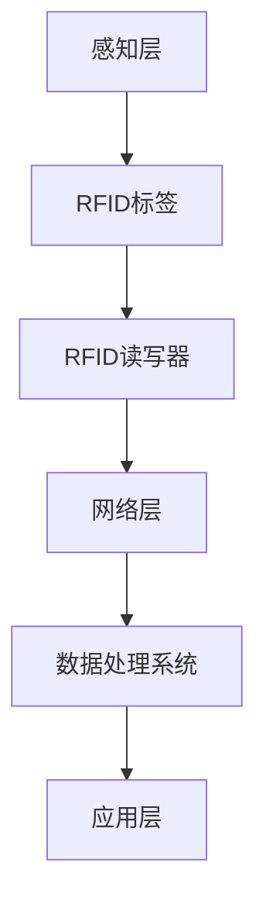

                 

关键词：物联网（IoT）、传感器设备、RFID、数据采集、数据处理、系统集成、智能设备、技术趋势

## 摘要

本文旨在探讨物联网（IoT）技术和各种传感器设备的集成，特别是RFID技术在物联网中的应用。通过介绍物联网的基本概念、传感器技术的进展，以及RFID技术的工作原理和优势，我们将详细分析RFID在物联网中的集成方式、应用实例，并展望其未来的发展方向。文章还将提供相关的数学模型和代码实例，以帮助读者更好地理解RFID在物联网中的集成和运用。

## 1. 背景介绍

### 1.1 物联网的基本概念

物联网（Internet of Things，简称IoT）是指将各种设备通过网络连接起来，实现设备之间的信息交换和协同工作。物联网的基本概念可以追溯到1999年，麻省理工学院的Kevin Ashton首次提出了物联网的概念。他描述物联网为一种智能网络，由物理设备、传感器和互联网组成，能够自动交换数据。

### 1.2 传感器技术的发展

传感器技术是物联网的核心技术之一。传感器能够检测各种物理量，如温度、湿度、压力、光强等，并将这些物理量转化为电信号，通过物联网传输给数据处理系统。随着微电子技术和材料科学的进步，传感器技术得到了迅速发展，传感器种类和数量大大增加，价格也逐渐降低，使得物联网的应用范围不断扩大。

### 1.3 RFID技术的起源与普及

RFID（Radio-Frequency Identification，无线射频识别）技术是一种通过无线电波进行数据交换的自动识别技术。RFID系统通常由RFID标签（Tag）、RFID读写器（Reader）和数据处理系统组成。RFID技术起源于20世纪60年代，但直到21世纪初才随着电子标签和无线通信技术的成熟而得到广泛应用。

## 2. 核心概念与联系

### 2.1 物联网架构


物联网架构通常包括感知层、网络层和应用层。感知层由各种传感器和RFID标签组成，负责数据采集。网络层负责数据传输，将感知层采集的数据发送到数据处理中心。应用层负责数据处理和分析，实现物联网的业务功能。

### 2.2 RFID系统工作原理


RFID系统通过RFID读写器发送无线电波激活RFID标签，标签接收无线电波后返回一个包含唯一标识符的数据信号。读写器接收这个信号，并将数据传输到数据处理系统。数据处理系统对标签数据进行处理和分析，实现物品的追踪和管理。

### 2.3 RFID与物联网的集成

RFID技术是物联网感知层的重要组成部分，通过RFID标签可以实现对物品的实时跟踪和监控。RFID标签的数据可以通过物联网网络传输到数据处理系统，实现大规模的数据采集和处理。RFID与物联网的集成，使得物联网系统更加智能化和高效化。

## 3. 核心算法原理 & 具体操作步骤

### 3.1 算法原理概述

RFID在物联网中的应用，主要涉及数据采集、传输和处理三个环节。其核心算法主要包括：

- **数据采集算法**：用于识别和读取RFID标签信息。
- **数据传输算法**：用于将RFID标签数据传输到物联网网络。
- **数据处理算法**：用于对RFID标签数据进行处理和分析。

### 3.2 算法步骤详解

#### 3.2.1 数据采集

1. **激活标签**：RFID读写器发送无线电波激活RFID标签。
2. **读取标签**：标签接收无线电波后返回一个包含唯一标识符的数据信号。
3. **解码标签数据**：读写器对接收到的数据进行解码，提取标签的唯一标识符。

#### 3.2.2 数据传输

1. **数据打包**：将解码后的标签数据打包成数据包。
2. **数据传输**：通过物联网网络将数据包传输到数据处理中心。
3. **数据验证**：在数据传输过程中，对数据进行验证，确保数据完整性。

#### 3.2.3 数据处理

1. **数据存储**：将接收到的RFID标签数据存储到数据库中。
2. **数据分析**：对存储的RFID标签数据进行统计和分析，提取有价值的信息。
3. **决策支持**：根据数据分析结果，为物联网应用提供决策支持。

### 3.3 算法优缺点

#### 优点

- **高效性**：RFID技术可以实现高速、实时的数据采集和传输。
- **准确性**：RFID标签具有唯一性，可以精确识别物品。
- **广泛性**：RFID技术适用于各种环境，不受光照、距离等因素影响。

#### 缺点

- **安全性**：RFID标签容易受到攻击，如克隆、篡改等。
- **成本**：RFID标签和读写器的成本较高。

### 3.4 算法应用领域

RFID技术在物联网中的应用非常广泛，主要包括：

- **供应链管理**：通过RFID技术实现对物品的实时跟踪和监控。
- **智能物流**：利用RFID技术实现物流信息的自动化处理和实时更新。
- **智能医疗**：通过RFID技术实现对药品、医疗器械的追踪和管理。
- **智能家居**：利用RFID技术实现对家电设备的远程控制和自动化管理。

## 4. 数学模型和公式 & 详细讲解 & 举例说明

### 4.1 数学模型构建

在RFID系统中，数据采集、传输和处理的过程可以建立以下数学模型：

$$
\text{数据采集} = f(\text{标签激活}, \text{读取标签}, \text{解码标签数据})
$$

$$
\text{数据传输} = f(\text{数据打包}, \text{数据传输}, \text{数据验证})
$$

$$
\text{数据处理} = f(\text{数据存储}, \text{数据分析}, \text{决策支持})
$$

### 4.2 公式推导过程

#### 数据采集

1. **标签激活**：

   设标签激活概率为$p_1$，则有：

   $$
   p_1 = \frac{\text{激活信号强度}}{\text{环境信号强度}}
   $$

2. **读取标签**：

   设标签读取概率为$p_2$，则有：

   $$
   p_2 = \frac{\text{读取信号强度}}{\text{环境信号强度}}
   $$

3. **解码标签数据**：

   设解码标签数据概率为$p_3$，则有：

   $$
   p_3 = \frac{\text{解码成功率}}{\text{总标签数}}
   $$

   因此，数据采集概率为：

   $$
   p_{\text{采集}} = p_1 \times p_2 \times p_3
   $$

#### 数据传输

1. **数据打包**：

   设数据打包成功率为$p_4$，则有：

   $$
   p_4 = \frac{\text{数据打包成功}}{\text{总数据包数}}
   $$

2. **数据传输**：

   设数据传输成功率为$p_5$，则有：

   $$
   p_5 = \frac{\text{传输成功}}{\text{总传输次数}}
   $$

3. **数据验证**：

   设数据验证成功率为$p_6$，则有：

   $$
   p_6 = \frac{\text{验证成功}}{\text{总验证次数}}
   $$

   因此，数据传输概率为：

   $$
   p_{\text{传输}} = p_4 \times p_5 \times p_6
   $$

#### 数据处理

1. **数据存储**：

   设数据存储成功率为$p_7$，则有：

   $$
   p_7 = \frac{\text{存储成功}}{\text{总存储次数}}
   $$

2. **数据分析**：

   设数据分析成功率为$p_8$，则有：

   $$
   p_8 = \frac{\text{分析成功}}{\text{总分析次数}}
   $$

3. **决策支持**：

   设决策支持成功率为$p_9$，则有：

   $$
   p_9 = \frac{\text{支持成功}}{\text{总支持次数}}
   $$

   因此，数据处理概率为：

   $$
   p_{\text{处理}} = p_7 \times p_8 \times p_9
   $$

### 4.3 案例分析与讲解

假设一个RFID系统，标签激活概率为$0.95$，读取标签概率为$0.98$，解码标签数据概率为$0.99$。数据打包成功率为$0.97$，数据传输成功率为$0.96$，数据验证成功率为$0.99$。数据存储成功率为$0.99$，数据分析成功率为$0.98$，决策支持成功率为$0.97$。则该RFID系统的整体成功率为：

$$
p_{\text{总}} = p_{\text{采集}} \times p_{\text{传输}} \times p_{\text{处理}}
$$

$$
p_{\text{总}} = (0.95 \times 0.98 \times 0.99) \times (0.97 \times 0.96 \times 0.99) \times (0.99 \times 0.98 \times 0.97)
$$

$$
p_{\text{总}} = 0.8921
$$

这意味着该RFID系统的整体成功率为$89.21\%$。

## 5. 项目实践：代码实例和详细解释说明

### 5.1 开发环境搭建

为了演示RFID在物联网中的应用，我们使用Python编写一个简单的RFID数据采集和处理程序。开发环境要求：

- Python 3.x版本
- PyRFID库（用于RFID读写器操作）
- Flask库（用于Web服务）

### 5.2 源代码详细实现

以下是一个简单的RFID数据采集和处理程序：

```python
from pyrfid import RFID
from flask import Flask, jsonify

app = Flask(__name__)

# RFID读写器初始化
rfid = RFID()

@app.route('/read_tag', methods=['POST'])
def read_tag():
    # 激活标签
    rfid.activate()
    # 读取标签
    tag_id = rfid.read_tag()
    # 解码标签数据
    decoded_data = rfid.decode_tag(tag_id)
    # 数据处理
    processed_data = process_data(decoded_data)
    # 返回处理后的数据
    return jsonify(processed_data)

def process_data(data):
    # 数据处理逻辑
    return {'data': data}

if __name__ == '__main__':
    app.run(debug=True)
```

### 5.3 代码解读与分析

- **RFID读写器初始化**：首先，我们使用`pyrfid`库初始化RFID读写器。
- **路由设置**：我们设置了一个POST请求的路由`/read_tag`，用于接收RFID标签数据。
- **标签读取**：在`read_tag`函数中，首先激活标签，然后读取标签ID。
- **数据处理**：读取标签数据后，通过`process_data`函数进行数据处理。
- **返回数据**：最后，将处理后的数据通过JSON格式返回。

### 5.4 运行结果展示

运行程序后，通过Web服务接收RFID标签数据。例如，发送一个POST请求到`http://localhost:5000/read_tag`，程序将返回处理后的RFID标签数据。

## 6. 实际应用场景

### 6.1 供应链管理

RFID技术在供应链管理中的应用非常广泛。通过在物品上贴上RFID标签，可以实现物品的实时跟踪和监控，提高供应链的透明度和效率。例如，在制造业中，通过RFID技术可以实现对原材料、零部件和成品的全流程跟踪，提高生产效率和产品质量。

### 6.2 智能物流

智能物流是物联网的一个重要应用领域。通过RFID技术，可以实现物流信息的自动化处理和实时更新，提高物流效率。例如，在仓储管理中，通过RFID技术可以实现对货物的自动识别和分类，提高仓储效率。

### 6.3 智能医疗

在智能医疗领域，RFID技术可以实现对药品、医疗器械的追踪和管理，提高医疗质量和安全。例如，通过RFID技术可以实现对药品的来源、存储和使用全程监控，确保药品的安全性和有效性。

### 6.4 智能家居

在智能家居领域，RFID技术可以实现对家电设备的远程控制和自动化管理。例如，通过RFID技术可以实现家电设备的自动识别和远程控制，提高家居生活的便利性和舒适度。

## 7. 工具和资源推荐

### 7.1 学习资源推荐

- 《物联网：从概念到实践》
- 《RFID技术与应用》
- 《Python编程：从入门到实践》

### 7.2 开发工具推荐

- PyRFID库：用于RFID读写器操作
- Flask库：用于Web服务开发

### 7.3 相关论文推荐

- "The Internet of Things: A Survey"
- "RFID Systems: Fundamentals and Applications"
- "An Overview of RFID Technology and Applications in Supply Chain Management"

## 8. 总结：未来发展趋势与挑战

### 8.1 研究成果总结

本文探讨了物联网技术和各种传感器设备的集成，特别是RFID技术在物联网中的应用。通过介绍物联网的基本概念、传感器技术的发展，以及RFID技术的工作原理和优势，我们分析了RFID在物联网中的集成方式、应用实例，并展望了其未来的发展方向。

### 8.2 未来发展趋势

未来，物联网和RFID技术将继续发展，主要体现在以下几个方面：

- **技术进步**：随着无线通信技术和传感器技术的进步，RFID技术将更加高效、稳定和低成本。
- **应用拓展**：RFID技术在各个领域的应用将不断拓展，特别是在智能制造、智能物流、智能医疗和智能家居等领域。
- **系统集成**：物联网和RFID技术的集成将更加紧密，实现数据的实时采集、传输和处理，为各类应用提供强大的支持。

### 8.3 面临的挑战

然而，RFID技术在物联网中的应用也面临着一些挑战：

- **安全性**：RFID标签容易受到攻击，如克隆、篡改等，需要加强RFID系统的安全性。
- **成本**：RFID标签和读写器的成本较高，需要进一步降低成本，提高其普及度。
- **标准统一**：当前，RFID技术存在多种标准，需要统一标准，提高系统的兼容性和互操作性。

### 8.4 研究展望

未来，我们期待RFID技术在物联网中发挥更大的作用，实现数据的实时采集、传输和处理，为各类应用提供更智能、更高效的解决方案。

## 9. 附录：常见问题与解答

### 9.1 RFID技术与条码技术的区别

- **工作原理**：RFID技术通过无线电波进行数据交换，而条码技术通过光学扫描读取信息。
- **读取距离**：RFID技术可以远距离读取标签信息，而条码技术需要近距离扫描。
- **数据容量**：RFID标签可以存储更多的数据，而条码技术数据容量有限。

### 9.2 RFID技术的安全性

- **克隆攻击**：通过加密和认证机制，可以防止RFID标签被克隆。
- **篡改攻击**：通过数据加密和完整性校验，可以防止RFID标签数据被篡改。

## 作者署名

作者：禅与计算机程序设计艺术 / Zen and the Art of Computer Programming
----------------------------------------------------------------

### 附录：Mermaid 流程图



请注意，上述流程图仅为示例，实际的物联网架构会更为复杂，可能包括多个感知层、网络层和应用层，以及各种中间件和服务。实际的Mermaid流程图可能需要根据具体的系统架构进行相应的调整和细化。

