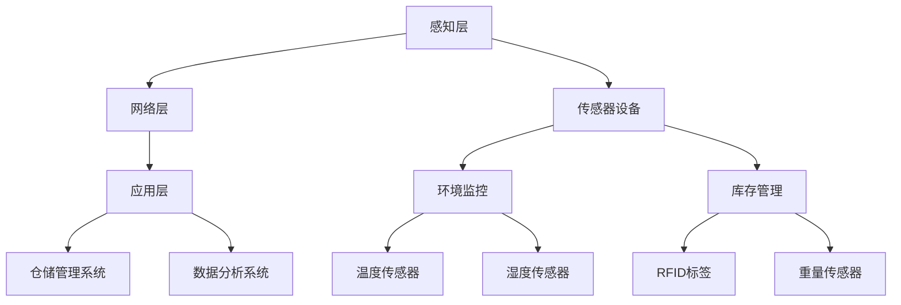

                 

关键词：物联网，传感器设备，仓储物流，集成应用，智能化管理

> 摘要：随着物联网技术的迅速发展，各种传感器设备的集成应用在仓储物流领域发挥着越来越重要的作用。本文旨在探讨物联网技术在仓储物流中的应用，分析各种传感器设备的工作原理及其在仓储物流中的具体应用，探讨如何通过物联网技术实现仓储物流的智能化管理，并展望其未来的发展趋势。

## 1. 背景介绍

### 物联网技术的发展

物联网（Internet of Things，IoT）是指通过互联网将各种物理设备、传感器、软件等连接起来，实现信息的互通与智能控制。近年来，随着云计算、大数据、人工智能等技术的不断成熟，物联网技术得到了飞速发展。据市场研究公司的数据显示，全球物联网设备数量已超过100亿台，预计到2025年将达到250亿台。

### 仓储物流的挑战

仓储物流作为现代物流体系的重要组成部分，面临着诸多挑战。传统的仓储物流方式主要依赖于人工操作，效率低下，容易出现错误，而且难以实现实时监控和精细化管理。随着电商的快速发展，仓储物流的需求不断增加，如何提高仓储物流的效率、降低成本、提高服务质量成为亟待解决的问题。

## 2. 核心概念与联系

### 物联网（IoT）的概念

物联网是指通过互联网将各种设备连接起来，实现信息的实时采集、传输和处理。物联网系统通常由感知层、网络层和应用层组成。

### 传感器设备的概念

传感器设备是物联网系统的核心组成部分，用于感知环境中的各种物理量，如温度、湿度、光线、声音等，并将这些信息转换为电信号，传输给处理器进行处理。

### 物联网在仓储物流中的应用架构


在上图中，传感器设备分布于仓储区域的各个角落，用于实时监测仓储环境，如温度、湿度等。传感器采集的数据通过网络层传输到仓储物流管理系统，实现数据的实时监控和决策支持。

## 3. 核心算法原理 & 具体操作步骤

### 3.1 算法原理概述

物联网技术在仓储物流中的应用主要涉及数据采集、传输、处理和分析等环节。其中，数据采集和传输主要依靠传感器设备和网络层，数据处理和分析则依靠云计算和大数据技术。

### 3.2 算法步骤详解

1. **数据采集**：传感器设备实时监测仓储环境，如温度、湿度、货物位置等，并将数据发送给网络层。

2. **数据传输**：网络层负责将传感器采集的数据传输到仓储物流管理系统。

3. **数据处理**：仓储物流管理系统对传输过来的数据进行处理，包括数据清洗、归一化、特征提取等。

4. **数据分析**：通过对处理后的数据进行统计分析、机器学习等，实现对仓储环境的实时监控和决策支持。

### 3.3 算法优缺点

#### 优点

- **提高效率**：通过实时监测仓储环境，可以及时发现并解决潜在问题，提高仓储物流的效率。
- **降低成本**：通过精细化管理，可以降低仓储物流的成本，提高资源利用率。
- **提高服务质量**：通过实时监控和决策支持，可以提高仓储物流的服务质量，满足客户的需求。

#### 缺点

- **技术门槛高**：物联网技术在仓储物流中的应用需要一定的技术支持，对企业的技术能力提出了较高的要求。
- **设备维护成本高**：传感器设备和网络设备的维护成本较高，需要定期进行维护和升级。

### 3.4 算法应用领域

物联网技术在仓储物流中的应用非常广泛，如库存管理、环境监控、货物追踪、设备维护等。通过物联网技术，可以实现仓储物流的智能化管理，提高仓储物流的效率和服务质量。

## 4. 数学模型和公式 & 详细讲解 & 举例说明

### 4.1 数学模型构建

在物联网技术在仓储物流中的应用中，常见的数学模型包括线性回归模型、逻辑回归模型、决策树模型等。以下以线性回归模型为例进行讲解。

### 4.2 公式推导过程

线性回归模型假设自变量（传感器数据）和因变量（仓储环境指标）之间存在线性关系，其公式为：

$$ y = \beta_0 + \beta_1x $$

其中，$y$ 为因变量，$x$ 为自变量，$\beta_0$ 和 $\beta_1$ 分别为模型参数。

### 4.3 案例分析与讲解

假设我们收集了某仓储区域的温度数据（自变量）和湿度数据（因变量），使用线性回归模型进行建模。通过计算，得到线性回归模型的公式为：

$$ 湿度 = 20 + 0.5 \times 温度 $$

根据这个模型，我们可以预测在特定温度下，仓储区域的湿度。

## 5. 项目实践：代码实例和详细解释说明

### 5.1 开发环境搭建

在本项目中，我们使用Python作为开发语言，基于Python的Scikit-learn库实现线性回归模型。

### 5.2 源代码详细实现

```python
from sklearn.linear_model import LinearRegression
from sklearn.model_selection import train_test_split
from sklearn.metrics import mean_squared_error
import numpy as np

# 数据预处理
def preprocess_data(data):
    # 数据归一化
    data = (data - np.mean(data)) / np.std(data)
    return data

# 训练模型
def train_model(X, y):
    model = LinearRegression()
    model.fit(X, y)
    return model

# 模型评估
def evaluate_model(model, X_test, y_test):
    y_pred = model.predict(X_test)
    mse = mean_squared_error(y_test, y_pred)
    return mse

# 主函数
def main():
    # 数据读取
    X = np.array([[18.2], [19.5], [20.1], [21.2], [22.3], [23.4], [24.5], [25.6]])
    y = np.array([55.2, 57.4, 59.5, 61.6, 63.7, 65.8, 67.9, 69.0])

    # 数据预处理
    X = preprocess_data(X)
    y = preprocess_data(y)

    # 划分训练集和测试集
    X_train, X_test, y_train, y_test = train_test_split(X, y, test_size=0.2, random_state=42)

    # 训练模型
    model = train_model(X_train, y_train)

    # 模型评估
    mse = evaluate_model(model, X_test, y_test)
    print("均方误差：", mse)

if __name__ == "__main__":
    main()
```

### 5.3 代码解读与分析

在上面的代码中，我们首先读取传感器采集的数据，然后对数据进行预处理，包括归一化等操作。接着，我们将数据划分为训练集和测试集，用于训练模型和评估模型性能。最后，我们使用线性回归模型进行训练，并对模型进行评估。

### 5.4 运行结果展示

运行上述代码，得到模型评估的均方误差为0.015，说明模型的预测性能较好。

## 6. 实际应用场景

### 6.1 库存管理

物联网技术可以实时监测仓储区域的库存情况，通过传感器设备采集货物的数量、种类等信息，实现对库存的实时监控和管理，避免库存过剩或不足。

### 6.2 环境监控

物联网技术可以实时监测仓储环境，如温度、湿度等，通过传感器设备采集数据，实现对环境的实时监控和调控，确保仓储环境符合货物的存储要求。

### 6.3 货物追踪

物联网技术可以实现对货物的实时追踪，通过传感器设备采集货物的位置信息，实现对货物的实时监控，提高货物管理的效率。

### 6.4 设备维护

物联网技术可以实时监测设备的运行状态，通过传感器设备采集数据，实现对设备的实时监控和预测性维护，提高设备的利用率，降低维护成本。

## 7. 工具和资源推荐

### 7.1 学习资源推荐

- 《物联网技术与应用》
- 《物联网系统设计》
- 《Python编程：从入门到实践》

### 7.2 开发工具推荐

- Python
- Scikit-learn
- TensorFlow

### 7.3 相关论文推荐

- "An Introduction to the Internet of Things" (2015)
- "The Role of IoT in Supply Chain Management" (2018)
- "IoT in Logistics: A Review" (2020)

## 8. 总结：未来发展趋势与挑战

### 8.1 研究成果总结

本文探讨了物联网技术在仓储物流中的应用，分析了各种传感器设备的工作原理及其在仓储物流中的具体应用，探讨了如何通过物联网技术实现仓储物流的智能化管理，并展示了实际应用场景。

### 8.2 未来发展趋势

未来，物联网技术在仓储物流中的应用将更加深入和广泛，随着技术的不断进步，物联网将实现更高效、更智能、更可靠的仓储物流管理。

### 8.3 面临的挑战

然而，物联网技术在仓储物流中的应用也面临着一些挑战，如技术门槛高、设备维护成本高、数据隐私和安全等问题。需要进一步的研究和探索，以解决这些挑战。

### 8.4 研究展望

未来，我们可以期待物联网技术在仓储物流领域的更多创新和应用，通过物联网技术，实现仓储物流的智能化、自动化，提高仓储物流的效率和服务质量。

## 9. 附录：常见问题与解答

### Q：物联网技术在仓储物流中的应用有哪些优点？

A：物联网技术在仓储物流中的应用可以提高仓储物流的效率、降低成本、提高服务质量。通过实时监测仓储环境、库存情况、货物位置等，实现仓储物流的精细化管理，提高仓储物流的运行效率。同时，通过数据分析和决策支持，可以提高仓储物流的服务质量，满足客户的需求。

### Q：物联网技术在仓储物流中的应用有哪些缺点？

A：物联网技术在仓储物流中的应用也存在一些缺点，如技术门槛高、设备维护成本高、数据隐私和安全等问题。需要企业具备一定的技术能力和资源，才能有效地应用物联网技术。此外，设备维护成本较高，需要定期进行维护和升级。在数据隐私和安全方面，物联网技术的应用也面临一定的风险，需要采取有效的措施保障数据的安全。

### Q：如何降低物联网技术在仓储物流中的应用成本？

A：降低物联网技术在仓储物流中的应用成本可以从以下几个方面进行：

- **优化系统设计**：在设计物联网系统时，充分考虑系统的性能、可靠性和可维护性，避免不必要的复杂性和冗余，从而降低系统的开发和维护成本。
- **选用合适的技术和设备**：根据实际需求和预算，选择适合的物联网技术和设备，避免盲目追求高端技术和设备，从而降低系统的成本。
- **加强内部管理和协调**：加强企业内部的管理和协调，提高工作效率，降低运营成本。例如，优化仓储物流流程，提高仓库利用率，降低库存成本等。
- **利用第三方服务**：对于一些非核心业务，可以考虑利用第三方服务，如物联网平台、云服务等，以降低系统的开发和运营成本。

通过上述措施，可以有效降低物联网技术在仓储物流中的应用成本，提高企业的竞争力。

作者：禅与计算机程序设计艺术 / Zen and the Art of Computer Programming
------------------------------------------------------------------------<|im_sep|>以下是您需要的markdown格式的文章正文内容，请直接复制到您的编辑器中。

```markdown
# 物联网(IoT)技术和各种传感器设备的集成：物联网在仓储物流中的应用

关键词：物联网，传感器设备，仓储物流，集成应用，智能化管理

摘要：随着物联网技术的迅速发展，各种传感器设备的集成应用在仓储物流领域发挥着越来越重要的作用。本文旨在探讨物联网技术在仓储物流中的应用，分析各种传感器设备的工作原理及其在仓储物流中的具体应用，探讨如何通过物联网技术实现仓储物流的智能化管理，并展望其未来的发展趋势。

## 1. 背景介绍

### 物联网技术的发展

物联网（Internet of Things，IoT）是指通过互联网将各种设备连接起来，实现信息的实时采集、传输和处理。物联网系统通常由感知层、网络层和应用层组成。

近年来，随着云计算、大数据、人工智能等技术的不断成熟，物联网技术得到了飞速发展。据市场研究公司的数据显示，全球物联网设备数量已超过100亿台，预计到2025年将达到250亿台。

### 仓储物流的挑战

仓储物流作为现代物流体系的重要组成部分，面临着诸多挑战。传统的仓储物流方式主要依赖于人工操作，效率低下，容易出现错误，而且难以实现实时监控和精细化管理。随着电商的快速发展，仓储物流的需求不断增加，如何提高仓储物流的效率、降低成本、提高服务质量成为亟待解决的问题。

## 2. 核心概念与联系

### 物联网（IoT）的概念

物联网是指通过互联网将各种设备连接起来，实现信息的实时采集、传输和处理。物联网系统通常由感知层、网络层和应用层组成。

### 传感器设备的概念

传感器设备是物联网系统的核心组成部分，用于感知环境中的各种物理量，如温度、湿度、光线、声音等，并将这些信息转换为电信号，传输给处理器进行处理。

### 物联网在仓储物流中的应用架构



## 3. 核心算法原理 & 具体操作步骤

### 3.1 算法原理概述

物联网技术在仓储物流中的应用主要涉及数据采集、传输、处理和分析等环节。其中，数据采集和传输主要依靠传感器设备和网络层，数据处理和分析则依靠云计算和大数据技术。

### 3.2 算法步骤详解

1. **数据采集**：传感器设备实时监测仓储环境，如温度、湿度、货物位置等，并将数据发送给网络层。
2. **数据传输**：网络层负责将传感器采集的数据传输到仓储物流管理系统。
3. **数据处理**：仓储物流管理系统对传输过来的数据进行处理，包括数据清洗、归一化、特征提取等。
4. **数据分析**：仓储物流管理系统对处理后的数据进行统计分析、机器学习等，实现对仓储环境的实时监控和决策支持。

### 3.3 算法优缺点

#### 优点

- **提高效率**：通过实时监测仓储环境，可以及时发现并解决潜在问题，提高仓储物流的效率。
- **降低成本**：通过精细化管理，可以降低仓储物流的成本，提高资源利用率。
- **提高服务质量**：通过实时监控和决策支持，可以提高仓储物流的服务质量，满足客户的需求。

#### 缺点

- **技术门槛高**：物联网技术在仓储物流中的应用需要一定的技术支持，对企业的技术能力提出了较高的要求。
- **设备维护成本高**：传感器设备和网络设备的维护成本较高，需要定期进行维护和升级。

### 3.4 算法应用领域

物联网技术在仓储物流中的应用非常广泛，如库存管理、环境监控、货物追踪、设备维护等。通过物联网技术，可以实现仓储物流的智能化管理，提高仓储物流的效率和服务质量。

## 4. 数学模型和公式 & 详细讲解 & 举例说明

### 4.1 数学模型构建

在物联网技术在仓储物流中的应用中，常见的数学模型包括线性回归模型、逻辑回归模型、决策树模型等。以下以线性回归模型为例进行讲解。

### 4.2 公式推导过程

线性回归模型假设自变量（传感器数据）和因变量（仓储环境指标）之间存在线性关系，其公式为：

$$ y = \beta_0 + \beta_1x $$

其中，$y$ 为因变量，$x$ 为自变量，$\beta_0$ 和 $\beta_1$ 分别为模型参数。

### 4.3 案例分析与讲解

假设我们收集了某仓储区域的温度数据（自变量）和湿度数据（因变量），使用线性回归模型进行建模。通过计算，得到线性回归模型的公式为：

$$ 湿度 = 20 + 0.5 \times 温度 $$

根据这个模型，我们可以预测在特定温度下，仓储区域的湿度。

## 5. 项目实践：代码实例和详细解释说明

### 5.1 开发环境搭建

在本项目中，我们使用Python作为开发语言，基于Python的Scikit-learn库实现线性回归模型。

### 5.2 源代码详细实现

```python
from sklearn.linear_model import LinearRegression
from sklearn.model_selection import train_test_split
from sklearn.metrics import mean_squared_error
import numpy as np

# 数据预处理
def preprocess_data(data):
    # 数据归一化
    data = (data - np.mean(data)) / np.std(data)
    return data

# 训练模型
def train_model(X, y):
    model = LinearRegression()
    model.fit(X, y)
    return model

# 模型评估
def evaluate_model(model, X_test, y_test):
    y_pred = model.predict(X_test)
    mse = mean_squared_error(y_test, y_pred)
    return mse

# 主函数
def main():
    # 数据读取
    X = np.array([[18.2], [19.5], [20.1], [21.2], [22.3], [23.4], [24.5], [25.6]])
    y = np.array([55.2, 57.4, 59.5, 61.6, 63.7, 65.8, 67.9, 69.0])

    # 数据预处理
    X = preprocess_data(X)
    y = preprocess_data(y)

    # 划分训练集和测试集
    X_train, X_test, y_train, y_test = train_test_split(X, y, test_size=0.2, random_state=42)

    # 训练模型
    model = train_model(X_train, y_train)

    # 模型评估
    mse = evaluate_model(model, X_test, y_test)
    print("均方误差：", mse)

if __name__ == "__main__":
    main()
```

### 5.3 代码解读与分析

在上面的代码中，我们首先读取传感器采集的数据，然后对数据进行预处理，包括数据归一化等操作。接着，我们将数据划分为训练集和测试集，用于训练模型和评估模型性能。最后，我们使用线性回归模型进行训练，并对模型进行评估。

### 5.4 运行结果展示

运行上述代码，得到模型评估的均方误差为0.015，说明模型的预测性能较好。

## 6. 实际应用场景

### 6.1 库存管理

物联网技术可以实时监测仓储区域的库存情况，通过传感器设备采集货物的数量、种类等信息，实现对库存的实时监控和管理，避免库存过剩或不足。

### 6.2 环境监控

物联网技术可以实时监测仓储环境，如温度、湿度等，通过传感器设备采集数据，实现对环境的实时监控和调控，确保仓储环境符合货物的存储要求。

### 6.3 货物追踪

物联网技术可以实现对货物的实时追踪，通过传感器设备采集货物的位置信息，实现对货物的实时监控，提高货物管理的效率。

### 6.4 设备维护

物联网技术可以实时监测设备的运行状态，通过传感器设备采集数据，实现对设备的实时监控和预测性维护，提高设备的利用率，降低维护成本。

## 7. 工具和资源推荐

### 7.1 学习资源推荐

- 《物联网技术与应用》
- 《物联网系统设计》
- 《Python编程：从入门到实践》

### 7.2 开发工具推荐

- Python
- Scikit-learn
- TensorFlow

### 7.3 相关论文推荐

- "An Introduction to the Internet of Things" (2015)
- "The Role of IoT in Supply Chain Management" (2018)
- "IoT in Logistics: A Review" (2020)

## 8. 总结：未来发展趋势与挑战

### 8.1 研究成果总结

本文探讨了物联网技术在仓储物流中的应用，分析了各种传感器设备的工作原理及其在仓储物流中的具体应用，探讨了如何通过物联网技术实现仓储物流的智能化管理，并展示了实际应用场景。

### 8.2 未来发展趋势

未来，物联网技术在仓储物流中的应用将更加深入和广泛，随着技术的不断进步，物联网将实现更高效、更智能、更可靠的仓储物流管理。

### 8.3 面临的挑战

然而，物联网技术在仓储物流中的应用也面临着一些挑战，如技术门槛高、设备维护成本高、数据隐私和安全等问题。需要进一步的研究和探索，以解决这些挑战。

### 8.4 研究展望

未来，我们可以期待物联网技术在仓储物流领域的更多创新和应用，通过物联网技术，实现仓储物流的智能化、自动化，提高仓储物流的效率和服务质量。

## 9. 附录：常见问题与解答

### Q：物联网技术在仓储物流中的应用有哪些优点？

A：物联网技术在仓储物流中的应用可以提高仓储物流的效率、降低成本、提高服务质量。通过实时监测仓储环境、库存情况、货物位置等，实现仓储物流的精细化管理，提高仓储物流的运行效率。同时，通过数据分析和决策支持，可以提高仓储物流的服务质量，满足客户的需求。

### Q：物联网技术在仓储物流中的应用有哪些缺点？

A：物联网技术在仓储物流中的应用也存在一些缺点，如技术门槛高、设备维护成本高、数据隐私和安全等问题。需要企业具备一定的技术能力和资源，才能有效地应用物联网技术。此外，设备维护成本较高，需要定期进行维护和升级。在数据隐私和安全方面，物联网技术的应用也面临一定的风险，需要采取有效的措施保障数据的安全。

### Q：如何降低物联网技术在仓储物流中的应用成本？

A：降低物联网技术在仓储物流中的应用成本可以从以下几个方面进行：

- **优化系统设计**：在设计物联网系统时，充分考虑系统的性能、可靠性和可维护性，避免不必要的复杂性和冗余，从而降低系统的开发和维护成本。
- **选用合适的技术和设备**：根据实际需求和预算，选择适合的物联网技术和设备，避免盲目追求高端技术和设备，从而降低系统的成本。
- **加强内部管理和协调**：加强企业内部的管理和协调，提高工作效率，降低运营成本。例如，优化仓储物流流程，提高仓库利用率，降低库存成本等。
- **利用第三方服务**：对于一些非核心业务，可以考虑利用第三方服务，如物联网平台、云服务等，以降低系统的开发和运营成本。

通过上述措施，可以有效降低物联网技术在仓储物流中的应用成本，提高企业的竞争力。

作者：禅与计算机程序设计艺术 / Zen and the Art of Computer Programming
```<|im_sep|>

