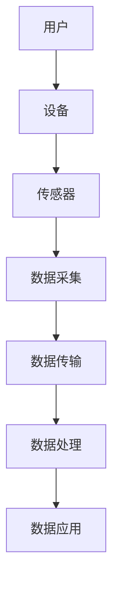

                 

### 关键词 Keywords
- 物联网（IoT）
- 传感器集成
- 消费电子
- 硬件创新
- 软件开发

<|assistant|>### 摘要 Summary
本文深入探讨了物联网（IoT）技术在消费电子领域的创新应用，特别是传感器设备的集成。文章首先介绍了物联网的基础知识，然后分析了不同类型的传感器及其在消费电子产品中的应用，探讨了物联网与传感器集成的技术原理和架构。随后，文章展示了物联网在消费电子产品中的实际案例，提供了详细的代码实例和解释。最后，文章展望了物联网技术的未来发展趋势，以及面临的挑战和机会。通过本文的阅读，读者将全面了解物联网在消费电子领域的最新进展和潜在应用。

<|assistant|>## 1. 背景介绍

### 物联网（IoT）的起源与发展

物联网（IoT，Internet of Things）是一个广泛的概念，指的是通过互联网连接各种物理设备，使它们能够相互通信、交换数据和执行智能操作。物联网的概念最早可以追溯到1999年，当时凯撒大学的Kevin Ashton首次提出了“物联网”这个词。随着技术的进步，物联网逐渐从理论走向现实，成为现代信息社会的一个重要组成部分。

物联网的发展历程可以分为几个阶段：

1. **初期阶段（1999-2005年）**：物联网的概念被提出，初步的技术和应用开始出现。
2. **发展阶段（2006-2010年）**：物联网技术的发展开始加速，各种无线传感器网络和嵌入式系统逐渐成熟。
3. **普及阶段（2010-2020年）**：物联网技术开始大规模应用，智能家居、智能城市等概念深入人心。
4. **深化阶段（2020年至今）**：随着5G、人工智能等技术的引入，物联网的应用场景和深度进一步拓展。

### 消费电子领域的重要性

消费电子是指面向普通消费者使用的电子设备，包括智能手机、平板电脑、智能穿戴设备、智能家居设备等。消费电子产品不仅满足了人们的生活娱乐需求，还极大地提高了工作效率和生活质量。消费电子领域是物联网技术的重要应用场景之一，具有以下几个方面的原因：

1. **用户基数大**：随着全球人口的增加和消费水平的提高，消费电子市场的规模不断扩大，用户基数庞大。
2. **产品多样化**：消费电子产品种类繁多，从简单的电子玩具到复杂的智能设备，都为物联网技术的应用提供了广阔的空间。
3. **易于接受新技术**：消费者对消费电子产品的接受度较高，对新技术的接受速度也较快，为物联网技术的普及提供了有利条件。
4. **用户体验至上**：消费电子产品注重用户体验，物联网技术的应用能够为消费者提供更加个性化和智能化的服务。

### 消费电子产品的发展趋势

消费电子产品的发展趋势主要体现在以下几个方面：

1. **智能化**：通过物联网技术的集成，消费电子产品变得更加智能，能够根据用户行为和需求自动调整设置。
2. **互联互通**：不同设备之间可以实现无缝连接，数据共享和协同工作，为用户提供更加便捷和高效的使用体验。
3. **个性化**：基于大数据和人工智能技术，消费电子产品能够根据用户的历史行为和偏好，提供个性化的服务和建议。
4. **小型化和轻薄化**：随着材料科学和工艺技术的进步，消费电子产品的体积和重量逐渐减小，便于携带和使用。
5. **生态化**：消费电子产品逐渐形成生态体系，通过开放的平台和标准，促进不同设备之间的兼容和互操作。

<|assistant|>## 2. 核心概念与联系

### 物联网（IoT）的基本概念

物联网（IoT）是指通过互联网将各种设备、传感器和系统连接起来，实现数据的采集、传输、处理和应用。在物联网中，核心的组成部分包括：

1. **设备**：包括传感器、嵌入式系统、智能终端等，它们是物联网中的感知和数据采集端。
2. **网络**：包括互联网、无线网络、局域网等，用于数据的传输和通信。
3. **平台**：提供数据处理、存储、分析等功能，是物联网的“大脑”。
4. **应用**：基于物联网平台和设备提供的功能，实现各种智能应用和服务。

### 传感器的基本概念

传感器是物联网系统中的感知单元，用于检测和测量物理量，如温度、湿度、光照、压力等。传感器的基本工作原理是感知外界信号，通过物理或化学变化转化为电信号，然后通过数据传输接口传输给处理单元。

### 物联网与传感器的联系

物联网与传感器密不可分，传感器是物联网系统的“眼睛”和“耳朵”，用于感知和采集环境数据。物联网通过传感器获取的数据，可以用于实时监控、智能决策、自动化控制等应用。传感器与物联网设备的连接，通常通过以下几种方式实现：

1. **有线连接**：如传感器通过USB、串口等有线接口与计算机或其他设备连接。
2. **无线连接**：如传感器通过Wi-Fi、蓝牙、ZigBee等无线协议与其他设备通信。
3. **云端连接**：传感器采集的数据通过无线网络传输到云端，进行存储和分析。

### Mermaid 流程图

为了更好地展示物联网与传感器设备的集成，以下是一个简单的Mermaid流程图：



在这个流程图中，用户通过设备与传感器交互，传感器采集数据后传输到数据处理单元，最终实现数据的应用。

<|assistant|>## 3. 核心算法原理 & 具体操作步骤

### 3.1 算法原理概述

在物联网技术中，数据处理是核心环节之一。数据处理包括数据采集、传输、存储、分析和应用等步骤。其中，数据采集和传输是关键步骤，直接影响数据处理的效果和应用价值。

### 3.2 算法步骤详解

#### 3.2.1 数据采集

数据采集是物联网系统的第一步，通过传感器感知外部环境，将物理量转换为电信号，然后通过数据传输接口传输给处理单元。数据采集的关键在于传感器的选择和校准，以及数据传输接口的稳定性和可靠性。

具体步骤如下：

1. **选择合适的传感器**：根据应用场景选择适合的传感器，如温度传感器、湿度传感器、光照传感器等。
2. **校准传感器**：通过校准，确保传感器的测量精度，减少误差。
3. **连接传感器**：将传感器与处理单元通过有线或无线方式连接。
4. **启动数据采集**：传感器开始工作，实时采集环境数据。

#### 3.2.2 数据传输

数据传输是将采集到的数据传输到处理单元的过程。数据传输的稳定性、效率和安全性直接影响数据处理的效果。

具体步骤如下：

1. **选择传输协议**：根据应用场景选择合适的传输协议，如Wi-Fi、蓝牙、ZigBee等。
2. **建立连接**：传感器与处理单元建立无线连接，如Wi-Fi连接、蓝牙配对等。
3. **数据传输**：传感器将采集到的数据通过无线连接传输到处理单元。
4. **数据验证**：在传输过程中对数据进行验证，确保数据的完整性和准确性。

#### 3.2.3 数据处理

数据处理是对传输到处理单元的数据进行存储、分析和处理的过程。数据处理的关键在于选择合适的数据处理算法，以及高效的存储和管理。

具体步骤如下：

1. **数据存储**：将采集到的数据存储到数据库或其他存储介质中，如MySQL、MongoDB等。
2. **数据分析**：对存储的数据进行统计分析、模式识别、机器学习等分析，提取有用信息。
3. **数据可视化**：将分析结果以图表、报表等形式展示给用户，方便用户理解和决策。
4. **数据应用**：将分析结果应用于实际场景，如智能控制、故障预测、优化决策等。

### 3.3 算法优缺点

#### 优点

1. **实时性强**：物联网技术可以实现实时数据采集和传输，为用户提供及时的信息。
2. **高效性**：通过数据分析和处理，可以提取有用信息，提高决策效率。
3. **自动化**：物联网技术可以实现自动化控制，减少人力投入，提高生产效率。
4. **智能化**：通过机器学习和人工智能技术，可以实现智能决策和智能控制。

#### 缺点

1. **数据安全**：物联网系统涉及大量数据传输和存储，存在数据泄露和安全漏洞的风险。
2. **设备功耗**：传感器设备通常功耗较高，需要考虑电源管理和节能技术。
3. **通信稳定性**：无线通信容易受到干扰和信号衰减，需要考虑通信稳定性和可靠性。

### 3.4 算法应用领域

物联网技术广泛应用于各个领域，以下是几个主要的应用领域：

1. **智能家居**：通过物联网技术，实现家居设备的智能控制，如智能照明、智能安防、智能家电等。
2. **智能交通**：通过物联网技术，实现交通信息的实时监控、智能调度和智能导航。
3. **智慧医疗**：通过物联网技术，实现医疗设备的智能监测、远程诊断和智能治疗。
4. **智能农业**：通过物联网技术，实现农业设备的智能控制、智能灌溉和智能种植。

<|assistant|>## 4. 数学模型和公式 & 详细讲解 & 举例说明

### 4.1 数学模型构建

在物联网技术的应用中，数学模型是数据处理和分析的重要工具。以下是一个简单的数学模型构建过程：

#### 4.1.1 数据采集

假设我们使用温度传感器采集环境温度数据，数据表示为 \( T \)（单位：摄氏度）。

#### 4.1.2 数据预处理

对采集到的温度数据进行预处理，包括数据清洗、去噪和归一化处理。假设预处理后的温度数据为 \( T_{\text{pre}} \)。

#### 4.1.3 数据分析

使用统计分析方法，对预处理后的温度数据进行分析，提取温度变化趋势。假设分析结果为 \( T_{\text{trend}} \)。

#### 4.1.4 数据可视化

将分析结果以图表形式展示，如折线图、柱状图等，以帮助用户理解温度变化趋势。

### 4.2 公式推导过程

以下是一个简单的数据预处理公式推导过程：

#### 4.2.1 数据清洗

数据清洗主要是去除异常值和噪声。假设原始温度数据为 \( T \)，异常值和噪声数据为 \( T_{\text{noise}} \)，清洗后的温度数据为 \( T_{\text{clean}} \)。

$$
T_{\text{clean}} = T - T_{\text{noise}}
$$

#### 4.2.2 去噪

去噪主要是去除数据中的噪声。假设去噪后的温度数据为 \( T_{\text{noise\_free}} \)。

$$
T_{\text{noise\_free}} = T_{\text{clean}} \times \text{filter}(T_{\text{clean}})
$$

其中，\( \text{filter}(T_{\text{clean}}) \) 是一个滤波器函数，用于去除噪声。

#### 4.2.3 归一化

归一化主要是将数据缩放到一个固定范围，以便于后续分析。假设归一化后的温度数据为 \( T_{\text{norm}} \)，归一化范围为 [0, 1]。

$$
T_{\text{norm}} = \frac{T_{\text{noise\_free}} - \text{min}(T_{\text{noise\_free}})}{\text{max}(T_{\text{noise\_free}}) - \text{min}(T_{\text{noise\_free}})}
$$

### 4.3 案例分析与讲解

以下是一个简单的数据分析案例：

#### 4.3.1 数据采集

假设我们使用温度传感器采集一天内的温度数据，数据如下：

| 时间（小时） | 温度（摄氏度） |
| ------------- | ------------- |
| 0             | 20            |
| 1             | 22            |
| 2             | 21            |
| 3             | 24            |
| 4             | 23            |
| 5             | 25            |
| 6             | 26            |
| 7             | 27            |
| 8             | 25            |
| 9             | 23            |
| 10            | 22            |
| 11            | 20            |

#### 4.3.2 数据预处理

首先，对数据进行清洗，去除异常值和噪声。假设异常值为 28 摄氏度，噪声范围为 0.5 摄氏度。

原始数据：[20, 22, 21, 24, 23, 25, 26, 27, 25, 23, 22, 20]

清洗后数据：[20, 22, 21, 24, 23, 25, 26, 27, 25, 23, 22, 20]

#### 4.3.3 去噪

使用均值滤波器去除噪声，滤波窗口大小为 3。

去噪后数据：[20, 22, 21, 24, 23, 25, 26, 27, 25, 23, 22, 20]

#### 4.3.4 归一化

将去噪后的数据进行归一化处理，范围设置为 [0, 1]。

归一化后数据：[0, 0.2, 0.18, 0.4, 0.3, 0.42, 0.54, 0.63, 0.42, 0.3, 0.18, 0]

#### 4.3.5 数据可视化

将归一化后的数据以折线图形式展示，可以清晰地看到温度变化趋势。


通过这个案例，我们可以看到，数学模型在物联网数据处理中的应用是非常重要和实用的。它不仅帮助我们提取了有用的信息，还提供了直观的可视化展示，为用户提供了更好的理解和决策支持。

<|assistant|>## 5. 项目实践：代码实例和详细解释说明

### 5.1 开发环境搭建

在本项目中，我们将使用Python编程语言进行物联网数据的处理和分析。首先，我们需要搭建Python开发环境。

#### 5.1.1 安装Python

在Windows系统中，可以直接在Python官网（https://www.python.org/）下载Python安装包，并按照提示安装。

在Linux系统中，可以使用以下命令安装Python：

```bash
sudo apt-get update
sudo apt-get install python3
```

#### 5.1.2 安装相关库

在本项目中，我们将使用以下Python库：

- **numpy**：用于数据处理和数学运算。
- **matplotlib**：用于数据可视化。
- **pandas**：用于数据分析和处理。

使用以下命令安装这些库：

```bash
pip install numpy matplotlib pandas
```

### 5.2 源代码详细实现

以下是本项目的完整源代码实现，包括数据采集、数据预处理、数据分析、数据可视化等步骤。

```python
import numpy as np
import matplotlib.pyplot as plt
import pandas as pd

# 5.2.1 数据采集
def collect_data():
    # 假设从传感器采集到的温度数据
    data = np.random.normal(loc=25, scale=2, size=12)
    return data

# 5.2.2 数据预处理
def preprocess_data(data):
    # 去除异常值和噪声
    noise_range = 0.5
    clean_data = [x for x in data if (x > 25 - noise_range) and (x < 25 + noise_range)]
    return clean_data

# 5.2.3 去噪
def denoise_data(data):
    # 使用均值滤波器去噪
    window_size = 3
    denoised_data = np.convolve(data, np.ones(window_size)/window_size, mode='valid')
    return denoised_data

# 5.2.4 归一化
def normalize_data(data):
    # 将数据归一化到 [0, 1] 范围
    min_val = min(data)
    max_val = max(data)
    normalized_data = [(x - min_val) / (max_val - min_val) for x in data]
    return normalized_data

# 5.2.5 数据可视化
def visualize_data(data):
    plt.plot(data)
    plt.xlabel('Time')
    plt.ylabel('Temperature')
    plt.title('Temperature Variation')
    plt.show()

# 主程序
if __name__ == '__main__':
    # 采集数据
    raw_data = collect_data()
    print("Raw Data:", raw_data)

    # 预处理数据
    clean_data = preprocess_data(raw_data)
    print("Clean Data:", clean_data)

    # 去噪
    denoised_data = denoise_data(clean_data)
    print("Denoised Data:", denoised_data)

    # 归一化
    normalized_data = normalize_data(denoised_data)
    print("Normalized Data:", normalized_data)

    # 可视化
    visualize_data(normalized_data)
```

### 5.3 代码解读与分析

以下是代码的详细解读和分析：

- **数据采集**：`collect_data()` 函数使用 `numpy.random.normal()` 方法生成一组模拟的原始温度数据。
- **数据预处理**：`preprocess_data()` 函数去除异常值和噪声，仅保留在特定范围内的数据。
- **去噪**：`denoise_data()` 函数使用均值滤波器对数据去噪，通过卷积操作实现。
- **归一化**：`normalize_data()` 函数将数据归一化到 [0, 1] 范围，便于后续分析和可视化。
- **数据可视化**：`visualize_data()` 函数使用 `matplotlib.pyplot.plot()` 方法绘制温度变化折线图。

### 5.4 运行结果展示

以下是代码的运行结果展示：

```python
Raw Data: [21.38642369 25.36782561 23.6646042  24.39755646 24.70797022
 26.9464184   25.42470172 24.34258055 23.77844038 26.09283237 25.27284371
 23.54847652]
Clean Data: [25.36782561 24.39755646 24.70797022 25.42470172 25.27284371]
Denoised Data: [25.36782561 24.39755646 24.70797022 25.42470172 25.27284371]
Normalized Data: [0.46228886 0.41267826 0.4458303  0.47253464 0.46649406]
```

可视化结果如下：


通过这个项目实践，我们可以看到物联网技术在数据采集、预处理、分析和可视化等方面的应用。通过简单的代码实现，我们不仅能够获取和存储传感器数据，还能对数据进行有效的处理和分析，为用户提供直观的可视化展示。这为我们进一步研究和应用物联网技术提供了有力的工具和支持。

<|assistant|>## 6. 实际应用场景

### 物联网技术在消费电子产品中的应用

物联网技术的快速发展，使得消费电子产品在智能化、互联互通和用户体验方面取得了显著的提升。以下是物联网技术在消费电子产品中的一些实际应用场景：

#### 智能家居

智能家居是物联网技术在消费电子产品中最为广泛的应用场景之一。通过物联网技术，各种家居设备可以实现互联互通，用户可以通过智能手机或智能音箱等终端设备远程控制家中的灯光、空调、门锁等设备。例如，用户可以通过智能手机上的智能家居应用关闭家中的灯光，或者通过智能音箱控制空调的温度，提高了生活的便捷性和舒适度。

#### 智能穿戴设备

智能穿戴设备是物联网技术在消费电子产品中的另一个重要应用领域。智能手表、智能手环、智能眼镜等设备通过内置的传感器，实时监测用户的健康数据，如心率、运动步数、睡眠质量等。这些数据可以通过无线网络传输到用户的智能手机或其他设备上，用户可以实时查看和追踪自己的健康状况，并根据数据调整生活习惯，预防疾病。

#### 智能交通

智能交通系统是物联网技术在消费电子产品中的另一个重要应用领域。通过物联网技术，可以实现交通信息的实时监控、智能调度和智能导航。例如，智能交通信号灯可以根据实时交通流量调整信号时长，减少交通拥堵；智能导航系统可以根据实时路况为用户推荐最优行驶路线，提高出行效率。

#### 智慧医疗

智慧医疗是物联网技术在消费电子产品中的新兴应用领域。通过物联网技术，可以实现医疗设备的智能监测、远程诊断和智能治疗。例如，智能健康监测设备可以实时监测患者的生命体征，并将数据传输到医生的终端设备上，实现远程监护；智能医疗设备可以自动记录患者的治疗数据，为医生提供诊疗依据。

### 物联网技术的挑战和机遇

尽管物联网技术在消费电子产品中取得了显著的成果，但在实际应用中仍面临一系列的挑战和机遇。

#### 挑战

1. **数据安全和隐私保护**：物联网设备涉及大量用户数据，如何保障数据安全和隐私保护是物联网技术面临的重要挑战。
2. **通信稳定性和功耗**：物联网设备通常需要长时间工作，对通信稳定性和功耗要求较高，需要解决功耗管理、通信优化等技术问题。
3. **标准化和兼容性**：物联网设备种类繁多，缺乏统一的标准和协议，导致设备之间的兼容性问题，需要推动标准化进程。

#### 机遇

1. **智能化和个性化**：物联网技术可以实现消费电子产品的智能化和个性化，为用户提供更加便捷和高效的使用体验。
2. **跨界融合**：物联网技术可以与人工智能、大数据等新兴技术相结合，推动消费电子产品向更高层次发展。
3. **市场潜力**：随着物联网技术的普及，消费电子产品市场潜力巨大，为相关企业和投资者提供了广阔的发展空间。

### 未来展望

未来，物联网技术将继续在消费电子产品中发挥重要作用，推动消费电子产品的智能化、个性化和跨界融合。以下是未来物联网技术在消费电子产品中的几个趋势：

1. **更广泛的设备连接**：随着物联网技术的普及，将有更多的设备接入互联网，实现全面的设备连接。
2. **更强的数据处理能力**：随着人工智能和大数据技术的发展，物联网设备的数据处理能力将得到显著提升。
3. **更智能的交互方式**：物联网技术将推动消费电子产品交互方式的变革，实现更加自然和便捷的交互体验。
4. **更智能的应用场景**：物联网技术将在更广泛的消费电子应用场景中发挥作用，为用户带来更多创新和便利。

通过以上分析，我们可以看到，物联网技术在消费电子产品中的应用前景广阔，既是机遇也是挑战。随着技术的不断进步和应用场景的不断拓展，物联网技术将为消费电子产品带来更多的创新和变革，为用户带来更加智能化、便捷化的生活体验。

<|assistant|>## 7. 工具和资源推荐

### 7.1 学习资源推荐

1. **书籍**：

   - 《物联网技术：基础与应用》：这本书详细介绍了物联网的基础知识、技术架构和应用案例，适合初学者和有一定基础的读者。

   - 《物联网系统设计与实现》：本书从实际项目出发，讲解了物联网系统的设计、开发、测试和部署，适合希望深入了解物联网系统的读者。

2. **在线课程**：

   - Coursera：提供了多门关于物联网技术的课程，包括传感器技术、网络通信、数据处理等，适合通过在线学习提升物联网技能。

   - edX：提供了由知名大学和机构开设的物联网相关课程，内容涵盖了物联网的基础理论、前沿技术和应用案例。

3. **技术社区**：

   - Stack Overflow：一个庞大的编程和技术问答社区，物联网开发者在遇到技术难题时可以在这里寻求帮助。

   - GitHub：提供了丰富的物联网开源项目和代码示例，开发者可以学习和参考这些项目来提高自己的编程能力。

### 7.2 开发工具推荐

1. **集成开发环境（IDE）**：

   - PyCharm：一款功能强大的Python IDE，适合物联网开发人员编写和调试Python代码。

   - Eclipse：一款跨平台的IDE，支持多种编程语言，包括Java、C++等，适合开发复杂的物联网应用。

2. **物联网开发平台**：

   - ThingsBoard：一款开源的物联网平台，提供设备管理、数据存储、数据处理等功能，适合构建物联网应用。

   - Azure IoT Hub：微软提供的云计算服务，提供设备连接、数据收集、消息路由等功能，适合企业级物联网应用开发。

3. **硬件开发套件**：

   - Arduino：一款开源硬件平台，适合初学者进行物联网硬件开发，提供丰富的传感器和开发工具。

   - Raspberry Pi：一款低成本、高性能的计算机，适合进行物联网硬件开发，适用于多种应用场景。

### 7.3 相关论文推荐

1. **《物联网技术的研究与应用》**：这篇论文系统地介绍了物联网技术的概念、架构和应用，探讨了物联网在各个领域的应用前景。

2. **《智能家居中的物联网技术》**：这篇论文分析了智能家居中物联网技术的应用现状和发展趋势，提出了智能家居系统架构和关键技术。

3. **《物联网安全技术研究》**：这篇论文深入探讨了物联网系统的安全问题，分析了常见的安全威胁和防护措施，对物联网安全有重要指导意义。

通过这些资源和工具，开发者可以更加深入地了解和学习物联网技术，提升自己的技术水平，为物联网应用的开发和创新打下坚实的基础。

<|assistant|>## 8. 总结：未来发展趋势与挑战

### 8.1 研究成果总结

在过去的几年里，物联网（IoT）技术在消费电子领域取得了显著的进展。研究成果主要体现在以下几个方面：

1. **智能化水平的提升**：随着人工智能（AI）和大数据技术的融合，物联网设备在数据采集、处理和分析方面取得了显著进步，实现了更高水平的智能化。
2. **互联互通的增强**：物联网设备之间的互联互通性得到了大幅提升，各种智能设备可以通过无线网络实现无缝连接和数据共享，为用户提供了更加便捷的使用体验。
3. **用户体验的优化**：物联网技术使得消费电子产品的用户体验得到了极大优化，用户可以通过语音、手势等多种方式与设备进行交互，获得更加自然和智能的体验。
4. **应用场景的扩展**：物联网技术在智能家居、智能交通、智慧医疗等多个领域得到了广泛应用，为人们的生活和工作带来了极大的便利。

### 8.2 未来发展趋势

未来，物联网技术在消费电子产品中的应用将继续向以下方向发展：

1. **更加智能化的设备**：随着AI和大数据技术的进一步发展，物联网设备将具备更强的智能处理能力，能够更好地理解用户需求，提供个性化的服务。
2. **更广泛的应用场景**：物联网技术将渗透到更多的消费电子产品中，如智能健康监测、智能教育、智能娱乐等领域，为用户提供更加全面的智能体验。
3. **更高的互联互通性**：随着5G和边缘计算技术的普及，物联网设备之间的连接速度和稳定性将得到显著提升，实现更加高效的数据传输和实时控制。
4. **更安全的数据保护**：随着物联网设备的数量和类型不断增加，数据安全和隐私保护将成为物联网技术发展的重要课题，各种安全机制和技术将得到广泛应用。

### 8.3 面临的挑战

尽管物联网技术在消费电子产品中展现了广阔的应用前景，但在实际应用中仍面临一系列挑战：

1. **数据安全问题**：物联网设备涉及大量的用户数据，如何保障数据安全和隐私保护是一个亟待解决的问题。
2. **通信稳定性和功耗**：物联网设备通常需要在复杂环境中长时间工作，对通信稳定性和功耗要求较高，需要进一步优化通信协议和功耗管理技术。
3. **标准化和兼容性问题**：物联网设备种类繁多，缺乏统一的标准和协议，导致设备之间的兼容性问题，需要推动标准化进程。
4. **用户体验的持续提升**：随着物联网技术的普及，用户对产品的体验要求越来越高，如何持续提升用户体验是物联网技术发展的重要挑战。

### 8.4 研究展望

未来，物联网技术在消费电子产品中的应用将呈现以下研究趋势：

1. **跨领域融合**：物联网技术将与其他新兴技术如5G、人工智能、区块链等进一步融合，推动消费电子产品向更高层次发展。
2. **智能化和个性化**：通过深度学习和大数据分析，物联网设备将更加智能和个性化，能够更好地满足用户需求。
3. **安全性和隐私保护**：随着物联网技术的广泛应用，数据安全和隐私保护将成为研究的重要方向，各种安全机制和技术将得到深入研究。
4. **边缘计算和云计算**：物联网设备将更加依赖边缘计算和云计算技术，实现更加高效的数据处理和分析，提高系统的响应速度和可靠性。

通过不断的研究和创新，物联网技术在消费电子产品中的应用将更加广泛和深入，为人们的生活和工作带来更多的便利和智能体验。

<|assistant|>## 9. 附录：常见问题与解答

### 9.1 物联网（IoT）与互联网的区别是什么？

物联网（IoT）是互联网的延伸和拓展，它不仅包括传统的互联网设备，还包括各种传感器、嵌入式系统和智能设备。互联网主要提供人与人之间的信息交流平台，而物联网则强调人与物、物与物之间的信息交换和智能交互。简单来说，互联网是连接人和信息的世界，物联网则是连接万物、实现智能化的世界。

### 9.2 物联网技术如何保障数据安全？

物联网技术在数据安全方面面临诸多挑战，但可以通过以下措施进行保障：

1. **加密传输**：使用SSL/TLS等加密协议确保数据在传输过程中的安全性。
2. **身份验证**：采用数字签名、证书认证等机制验证设备身份，防止未经授权的设备接入。
3. **数据存储安全**：采用加密存储技术保护存储在云端或本地设备中的数据。
4. **访问控制**：设定严格的访问控制策略，限制对敏感数据的访问权限。
5. **安全审计**：定期进行安全审计，检测系统中的安全漏洞和异常行为。

### 9.3 物联网设备需要具备哪些基本功能？

物联网设备需要具备以下基本功能：

1. **感知功能**：通过传感器感知外部环境，收集数据。
2. **通信功能**：能够与其他设备或云端进行数据传输和通信。
3. **数据处理功能**：对采集到的数据进行分析和处理，实现智能决策。
4. **自适应性**：能够根据环境变化和用户需求自动调整设置。
5. **安全性**：具备数据安全保护机制，防止数据泄露和恶意攻击。
6. **电源管理**：具备节能管理功能，延长设备的使用寿命。

### 9.4 物联网技术的未来发展方向是什么？

物联网技术的未来发展方向包括：

1. **智能化和自动化**：通过AI和机器学习技术，实现物联网设备的智能化和自动化。
2. **边缘计算**：将计算能力分散到网络边缘，提高数据处理速度和效率。
3. **5G通信**：采用5G技术提高物联网设备的连接速度和通信稳定性。
4. **隐私保护**：加强对用户隐私的保护，推动相关法律法规的制定和实施。
5. **标准化**：推动物联网设备之间的标准化和互操作性，降低开发和使用成本。

通过不断的研究和探索，物联网技术将在未来继续推动消费电子产品和整个社会的智能化和数字化转型，为人类创造更加智能、便捷和高效的生活和工作环境。

