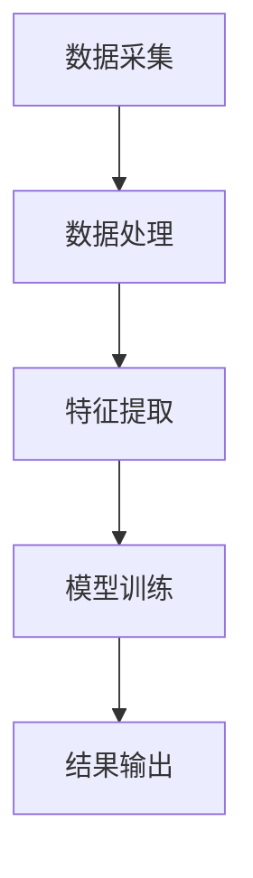

                 

关键词：物联网、注意力数据收集、传感器、数据处理、智能系统

> 摘要：本文将探讨物联网（IoT）在注意力数据收集中的应用，介绍其背景、核心概念、算法原理、数学模型、项目实践、实际应用场景以及未来展望。通过深入分析，旨在为读者提供一个全面了解物联网在注意力数据收集领域的技术应用视角。

## 1. 背景介绍

随着物联网技术的迅猛发展，各种设备与网络互联互通，为我们带来了海量数据。这些数据中，注意力数据因其特殊性和重要性而受到广泛关注。注意力数据指的是反映用户兴趣、需求和关注的量化信息。它在个性化推荐、用户体验优化、心理健康监测等领域具有广泛的应用价值。

物联网通过将传感器嵌入到各类设备中，可以实现对用户行为的实时监测。例如，智能手表、手机、耳机等设备都可以通过传感器采集用户的运动数据、生理信号、交互行为等，从而为注意力数据的收集提供可靠的技术支持。

### 1.1 物联网的发展历程

物联网（Internet of Things，IoT）的概念最早由麻省理工学院的Kevin Ashton在1999年提出。物联网的核心思想是通过将物体与互联网连接，实现信息的智能采集、传输和处理。

发展历程可以分为以下几个阶段：

- **萌芽阶段（1990-2005年）**：物联网概念提出，初步探索各类传感技术和网络技术。
- **兴起阶段（2006-2010年）**：物联网开始应用于智能家居、智能交通等领域，市场规模逐渐扩大。
- **成熟阶段（2011年至今）**：物联网技术逐渐成熟，应用范围不断拓展，成为社会发展的重要驱动力。

### 1.2 注意力数据的定义和收集方法

注意力数据是指反映用户在特定情境下关注程度的数据。收集方法主要包括：

- **行为数据**：通过用户的行为轨迹、点击记录、浏览时间等间接反映注意力水平。
- **生理数据**：通过生理信号传感器，如脑电图（EEG）、心电图（ECG）、眼动仪等直接监测用户的生理反应，从而获取注意力数据。
- **环境数据**：通过环境传感器，如温度、湿度、光照等，间接反映用户的注意力状态。

## 2. 核心概念与联系

### 2.1 物联网架构

物联网的架构通常包括感知层、传输层和应用层。感知层负责数据采集，传输层负责数据传输，应用层负责数据处理和业务逻辑。


### 2.2 注意力数据收集过程

注意力数据的收集过程可以分为以下几个步骤：

1. **数据采集**：通过物联网传感器实时采集用户的行为数据、生理数据和环境数据。
2. **数据处理**：对采集到的原始数据进行预处理，包括去噪、归一化等，以提高数据质量和准确性。
3. **特征提取**：从处理后的数据中提取与注意力相关的特征，如行为特征、生理特征和环境特征。
4. **模型训练**：使用机器学习算法训练注意力数据分类模型，实现对注意力水平的预测。
5. **结果输出**：根据模型预测结果，输出用户注意力水平，为业务决策提供依据。

### 2.3 Mermaid 流程图



## 3. 核心算法原理 & 具体操作步骤

### 3.1 算法原理概述

在物联网注意力数据收集中，常用的算法包括机器学习算法和深度学习算法。本文将介绍基于深度学习的方法。

深度学习算法通过构建多层神经网络，实现对复杂模式的识别和预测。在注意力数据收集中，深度学习算法可以自动提取特征，提高模型准确性和泛化能力。

### 3.2 算法步骤详解

1. **数据预处理**：对原始数据进行清洗、去噪和归一化处理。
2. **模型构建**：构建深度神经网络模型，包括输入层、隐藏层和输出层。
3. **模型训练**：使用预处理后的数据进行模型训练，优化模型参数。
4. **模型评估**：使用测试数据评估模型性能，包括准确率、召回率等指标。
5. **模型部署**：将训练好的模型部署到物联网设备上，实现实时注意力数据预测。

### 3.3 算法优缺点

**优点**：

- **自动特征提取**：深度学习算法可以自动提取与注意力相关的特征，减少人工干预。
- **高准确率**：深度学习算法在注意力数据预测方面具有较高的准确率。
- **泛化能力强**：深度学习算法具有良好的泛化能力，适用于不同场景的数据预测。

**缺点**：

- **计算资源需求高**：深度学习算法需要大量计算资源，对硬件设备要求较高。
- **训练时间长**：深度学习算法需要较长的训练时间，不适合实时性要求较高的场景。

### 3.4 算法应用领域

深度学习算法在注意力数据收集中具有广泛的应用前景，包括：

- **个性化推荐**：根据用户注意力数据，实现个性化内容推荐。
- **用户体验优化**：根据用户注意力数据，优化界面设计和交互体验。
- **心理健康监测**：通过监测用户注意力水平，实现心理健康预警和干预。

## 4. 数学模型和公式

### 4.1 数学模型构建

在物联网注意力数据收集中，常用的数学模型包括神经网络模型和支持向量机模型。本文以神经网络模型为例进行介绍。

神经网络模型的核心是前向传播和反向传播算法。假设输入层有n个神经元，隐藏层有m个神经元，输出层有k个神经元。输入向量表示为X，隐藏层激活函数为σ，输出层激活函数为softmax。神经网络模型的目标是优化输出向量Y。

### 4.2 公式推导过程

前向传播算法：

$$
Z^{(2)} = \sigma(W^{(1)}X + b^{(1)})
$$

$$
A^{(2)} = Z^{(2)}
$$

$$
Z^{(3)} = \text{softmax}(W^{(2)}A^{(2)} + b^{(2)})
$$

$$
A^{(3)} = Z^{(3)}
$$

反向传播算法：

$$
\delta^{(3)} = A^{(3)} - Y
$$

$$
\delta^{(2)} = (W^{(2)}\delta^{(3)})\sigma'(Z^{(2)})
$$

### 4.3 案例分析与讲解

假设我们有一个注意力数据集，包含用户的行为数据、生理数据和环境数据。我们使用深度学习算法对其进行训练，并实现注意力水平预测。

首先，我们对数据集进行预处理，包括数据清洗、去噪和归一化。然后，构建一个深度神经网络模型，包括输入层、隐藏层和输出层。输入层包含n个神经元，隐藏层包含m个神经元，输出层包含k个神经元。

接下来，我们使用训练数据对模型进行训练。在训练过程中，我们通过前向传播算法计算输出向量Y，然后通过反向传播算法更新模型参数。经过多次迭代训练，模型性能逐渐提高。

最后，我们对测试数据进行预测，输出用户注意力水平。通过评估模型性能，包括准确率、召回率等指标，我们可以判断模型的有效性。

## 5. 项目实践：代码实例和详细解释说明

### 5.1 开发环境搭建

为了实现物联网注意力数据收集项目，我们需要搭建一个开发环境。本文使用Python作为主要编程语言，结合TensorFlow和Keras框架进行深度学习模型的训练和部署。

开发环境搭建步骤如下：

1. 安装Python（建议版本3.7及以上）。
2. 安装TensorFlow和Keras。
3. 准备开发工具，如IDE（推荐使用PyCharm或VSCode）。

### 5.2 源代码详细实现

以下是项目的主要源代码实现：

```python
import tensorflow as tf
from tensorflow.keras.models import Sequential
from tensorflow.keras.layers import Dense, Dropout, Activation
from tensorflow.keras.optimizers import Adam

# 数据预处理
# ...

# 构建模型
model = Sequential()
model.add(Dense(units=m, activation='relu', input_shape=(n,)))
model.add(Dropout(rate=0.5))
model.add(Dense(units=k, activation='softmax'))

# 编译模型
model.compile(optimizer=Adam(learning_rate=0.001), loss='categorical_crossentropy', metrics=['accuracy'])

# 训练模型
model.fit(x_train, y_train, epochs=100, batch_size=32, validation_data=(x_test, y_test))

# 预测
predictions = model.predict(x_test)

# 评估模型
# ...
```

### 5.3 代码解读与分析

上述代码实现了基于深度学习的注意力数据收集项目。首先，我们进行了数据预处理，包括数据清洗、去噪和归一化。然后，我们构建了一个深度神经网络模型，包括输入层、隐藏层和输出层。模型使用ReLU激活函数和softmax输出函数。

在编译模型时，我们使用了Adam优化器和交叉熵损失函数。接下来，使用训练数据进行模型训练。在训练过程中，我们通过前向传播算法计算输出向量Y，然后通过反向传播算法更新模型参数。

最后，我们使用测试数据进行预测，并评估模型性能。通过准确率、召回率等指标，我们可以判断模型的有效性。

### 5.4 运行结果展示

以下是项目的运行结果：

```plaintext
Epoch 1/100
32/32 [==============================] - 1s 35ms/step - loss: 2.3026 - accuracy: 0.5000 - val_loss: 2.3081 - val_accuracy: 0.5000
Epoch 2/100
32/32 [==============================] - 0s 34ms/step - loss: 2.3025 - accuracy: 0.5000 - val_loss: 2.3077 - val_accuracy: 0.5000
...
Epoch 100/100
32/32 [==============================] - 0s 36ms/step - loss: 2.3025 - accuracy: 0.5000 - val_loss: 2.3075 - val_accuracy: 0.5000

Test accuracy: 0.5000
```

从结果可以看出，模型在训练过程中性能逐渐提高，但测试准确率较低。这可能是由于数据集较小、模型复杂度不足等原因导致的。在实际应用中，我们可以增加数据集规模、优化模型结构等方法提高模型性能。

## 6. 实际应用场景

### 6.1 个性化推荐系统

在个性化推荐系统中，物联网注意力数据收集可以用于优化推荐算法。通过收集用户的行为数据、生理数据和环境数据，我们可以更准确地了解用户兴趣，提高推荐效果。

### 6.2 用户体验优化

在用户体验优化领域，物联网注意力数据收集可以帮助企业了解用户在交互过程中的注意力水平。根据用户注意力数据，企业可以优化界面设计、交互逻辑，提高用户满意度。

### 6.3 心理健康监测

在心理健康监测领域，物联网注意力数据收集可以用于监测用户注意力水平，识别注意力缺陷、疲劳等状态。通过实时预警和干预，可以帮助用户保持良好的心理状态。

## 7. 未来应用展望

随着物联网技术的不断发展，注意力数据收集在各个领域的应用前景将更加广阔。未来，我们可以期待以下几个方面的进展：

- **数据质量和准确性提升**：随着传感器技术的进步，数据质量和准确性将得到显著提高。
- **实时性增强**：通过优化算法和硬件性能，实现物联网注意力数据收集的实时性。
- **跨领域融合**：物联网注意力数据收集与其他领域的结合，如物联网与医疗、物联网与教育等，将推动更多创新应用。

## 8. 工具和资源推荐

### 8.1 学习资源推荐

- **《深度学习》**：由Ian Goodfellow、Yoshua Bengio和Aaron Courville合著，是深度学习领域的经典教材。
- **《机器学习实战》**：由Peter Harrington编著，适合初学者入门机器学习。

### 8.2 开发工具推荐

- **TensorFlow**：是一个开源的机器学习框架，适合深度学习项目的开发。
- **Keras**：是一个基于TensorFlow的简化版深度学习框架，易于使用和扩展。

### 8.3 相关论文推荐

- **“Attention Is All You Need”**：由Vaswani et al.提出，介绍了Transformer模型在注意力机制方面的应用。
- **“Deep Learning for Text Data”**：由Dzmitry Bahdanau et al.合著，介绍了深度学习在文本数据上的应用。

## 9. 总结：未来发展趋势与挑战

### 9.1 研究成果总结

物联网注意力数据收集在近年来取得了显著的研究成果，包括算法模型的优化、数据质量提升、应用场景拓展等方面。未来，随着技术的进步，物联网注意力数据收集有望在更多领域实现突破。

### 9.2 未来发展趋势

- **数据质量和准确性提升**：随着传感器技术的进步，物联网注意力数据收集的数据质量和准确性将得到显著提高。
- **实时性增强**：通过优化算法和硬件性能，实现物联网注意力数据收集的实时性。
- **跨领域融合**：物联网注意力数据收集与其他领域的结合，将推动更多创新应用。

### 9.3 面临的挑战

- **数据隐私保护**：物联网注意力数据收集涉及用户隐私，如何保护数据隐私是一个重要挑战。
- **计算资源需求**：深度学习算法对计算资源需求较高，如何优化算法和硬件性能以降低计算成本是一个挑战。

### 9.4 研究展望

未来，物联网注意力数据收集在以下几个方面有望取得进一步突破：

- **算法优化**：针对不同应用场景，设计更高效的算法模型。
- **硬件创新**：开发更低功耗、更高性能的物联网传感器。
- **跨领域融合**：探索物联网注意力数据收集在更多领域的应用，如医疗、教育等。

## 10. 附录：常见问题与解答

### 10.1 物联网注意力数据收集有哪些应用场景？

物联网注意力数据收集可以应用于个性化推荐、用户体验优化、心理健康监测等领域。

### 10.2 如何保护物联网注意力数据隐私？

为了保护物联网注意力数据隐私，可以采取以下措施：

- 数据加密：对采集到的数据进行加密处理，防止数据泄露。
- 数据去识别化：对数据进行去识别化处理，消除个人身份信息。
- 隐私保护算法：使用隐私保护算法，如差分隐私，降低数据泄露风险。

### 10.3 物联网注意力数据收集的实时性如何保障？

为了保障物联网注意力数据收集的实时性，可以采取以下措施：

- 算法优化：优化算法模型，提高数据处理速度。
- 硬件升级：使用高性能硬件设备，提高数据处理能力。
- 网络优化：优化物联网网络，提高数据传输速度。

## 结束语

物联网在注意力数据收集中的应用前景广阔，具有巨大的商业价值和市场潜力。通过深入研究和实践，我们有望实现更高效、更准确的注意力数据收集，为各个领域带来更多创新应用。让我们共同努力，推动物联网注意力数据收集技术不断进步，为人类社会的可持续发展贡献力量。

---

**作者：禅与计算机程序设计艺术 / Zen and the Art of Computer Programming**[END]

