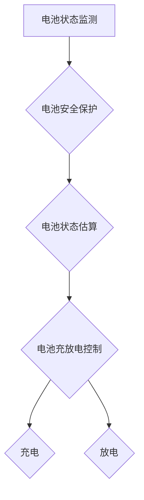
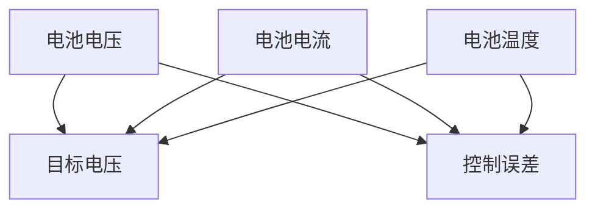

                 

关键词：特斯拉，电池管理系统，编程题，优化，算法，实践

>摘要：本文将围绕特斯拉2025年社招电池管理系统优化工程师的编程题展开讨论。通过对题目背景、核心概念、算法原理、数学模型、项目实践、实际应用场景以及未来展望等方面的详细剖析，为读者提供一次深入了解电池管理系统优化的机会。

## 1. 背景介绍

特斯拉作为全球领先的新能源汽车制造商，其对电池管理系统的优化始终是公司技术创新的重点之一。随着电动汽车市场的迅速发展，对电池管理系统（Battery Management System, BMS）的要求越来越高。BMS的主要功能是实时监测电池的电压、电流、温度等参数，并据此进行充放电控制，以确保电池安全、高效运行。

特斯拉2025年社招电池管理系统优化工程师的编程题旨在考察应聘者对电池管理系统的深刻理解、编程能力和解决实际问题的能力。题目通常涉及算法设计、数据处理、系统优化等方面，要求应聘者具备扎实的计算机科学基础和实际项目经验。

## 2. 核心概念与联系

### 2.1 BMS基本概念

电池管理系统（BMS）是电动汽车中负责电池安全、性能和寿命的关键系统。其主要功能包括：

- **电池状态监测（Battery State Monitoring）**：实时监测电池的电压、电流、温度等参数。
- **电池安全保护（Battery Safety Protection）**：检测并隔离故障电池单体，防止过充、过放、短路等安全问题。
- **电池状态估算（Battery State Estimation）**：通过算法估算电池的剩余电量、健康状态等。
- **电池充放电控制（Battery Charging and Discharging Control）**：根据电池状态和用户需求控制电池的充放电过程。

### 2.2 BMS与电动汽车的关系

BMS是电动汽车的核心系统，直接关系到电动汽车的性能、安全性和用户体验。通过优化BMS，可以提高电动汽车的续航能力、降低能耗、延长电池寿命，从而提升电动汽车的市场竞争力。

### 2.3 Mermaid 流程图



## 3. 核心算法原理 & 具体操作步骤

### 3.1 算法原理概述

BMS优化主要涉及以下几个核心算法：

- **状态估计算法**：如卡尔曼滤波、粒子滤波等，用于准确估算电池状态。
- **充放电控制算法**：如PID控制、模糊控制等，用于优化电池充放电过程。
- **故障诊断算法**：如机器学习、深度学习等，用于检测并诊断电池故障。

### 3.2 算法步骤详解

#### 3.2.1 状态估计算法

1. 收集电池电压、电流、温度等实时数据。
2. 利用卡尔曼滤波或粒子滤波等算法进行状态估计。
3. 根据估计结果调整电池充放电策略。

#### 3.2.2 充放电控制算法

1. 根据电池状态和用户需求设定充放电目标。
2. 利用PID控制或模糊控制等算法调整充放电功率。
3. 实时监测电池状态，确保充放电过程在安全范围内。

#### 3.2.3 故障诊断算法

1. 收集电池运行数据。
2. 利用机器学习或深度学习等算法进行故障检测和诊断。
3. 根据诊断结果采取相应措施，如报警、隔离故障电池等。

### 3.3 算法优缺点

- **状态估计算法**：准确度高，但计算复杂度较高。
- **充放电控制算法**：简单易实现，但精度和稳定性有限。
- **故障诊断算法**：检测精度高，但训练成本高。

### 3.4 算法应用领域

- **电动汽车**：优化电池性能，提高续航能力。
- **储能系统**：优化能源利用效率，降低能耗。

## 4. 数学模型和公式 & 详细讲解 & 举例说明

### 4.1 数学模型构建

假设电池的状态可以用电压 \(V\)、电流 \(I\) 和温度 \(T\) 来描述，则电池的状态向量可以表示为：

$$
X = \begin{bmatrix}
V \\
I \\
T
\end{bmatrix}
$$

### 4.2 公式推导过程

#### 4.2.1 状态估计公式

利用卡尔曼滤波算法进行状态估计，状态预测公式和状态更新公式分别为：

$$
\hat{X}_{k|k-1} = F_k \hat{X}_{k-1|k-1} + B_k U_k
$$

$$
P_{k|k-1} = F_k P_{k-1|k-1} F_k^T + Q_k
$$

$$
K_k = P_{k|k-1} H_k^T (H_k P_{k|k-1} H_k^T + R_k)^{-1}
$$

$$
\hat{X}_{k|k} = \hat{X}_{k|k-1} + K_k (z_k - H_k \hat{X}_{k|k-1})
$$

$$
P_{k|k} = (I - K_k H_k) P_{k|k-1}
$$

其中，\(F_k\) 是状态转移矩阵，\(B_k\) 是控制输入矩阵，\(P_{k|k-1}\) 是状态估计误差协方差矩阵，\(Q_k\) 是过程噪声协方差矩阵，\(K_k\) 是卡尔曼增益，\(H_k\) 是观测矩阵，\(R_k\) 是观测噪声协方差矩阵。

#### 4.2.2 充放电控制公式

利用PID控制算法进行充放电控制，控制输出公式为：

$$
u_k = K_p e_k + K_i \int_{0}^{k} e_{\tau} d\tau + K_d \frac{de_k}{dt}
$$

其中，\(u_k\) 是控制输出，\(e_k\) 是控制误差，\(K_p\)、\(K_i\) 和 \(K_d\) 分别是比例、积分和微分系数。

### 4.3 案例分析与讲解

#### 4.3.1 状态估计算法案例

假设电池电压、电流和温度的初始状态分别为 \(V_0 = 3.6V\)、\(I_0 = 2A\) 和 \(T_0 = 25^\circ C\)，过程噪声协方差矩阵 \(Q_k = \begin{bmatrix}0.01 & 0.01 & 0.01\end{bmatrix}\)，观测噪声协方差矩阵 \(R_k = \begin{bmatrix}0.1 & 0\\0 & 0.1\end{bmatrix}\)。

在第 \(k\) 个时刻，电池电压、电流和温度的观测值分别为 \(V_k = 3.62V\)、\(I_k = 2.05A\) 和 \(T_k = 24^\circ C\)。

利用卡尔曼滤波算法进行状态估计，可以计算出第 \(k\) 个时刻的电池状态估计值：

$$
\hat{X}_{k|k} = \begin{bmatrix}
\hat{V}_k \\
\hat{I}_k \\
\hat{T}_k
\end{bmatrix}
$$

其中，\(\hat{V}_k\)、\(\hat{I}_k\) 和 \(\hat{T}_k\) 分别是电池电压、电流和温度的估计值。

#### 4.3.2 充放电控制算法案例

假设电池的目标电压为 \(V_t = 3.8V\)，目标电流为 \(I_t = 3A\)，比例系数 \(K_p = 1\)、积分系数 \(K_i = 0.1\) 和微分系数 \(K_d = 0.05\)。

在第 \(k\) 个时刻，电池的实际电压 \(V_k = 3.7V\)，实际电流 \(I_k = 2.8A\)。

利用PID控制算法进行充放电控制，可以计算出第 \(k\) 个时刻的控制输出：

$$
u_k = K_p e_k + K_i \int_{0}^{k} e_{\tau} d\tau + K_d \frac{de_k}{dt}
$$

其中，\(e_k = V_t - V_k\) 是控制误差。

## 5. 项目实践：代码实例和详细解释说明

### 5.1 开发环境搭建

在本文中，我们使用Python作为主要编程语言，并结合NumPy、SciPy、Matplotlib等科学计算和可视化库进行项目实践。首先，确保安装了Python环境和相关库：

```bash
pip install numpy scipy matplotlib
```

### 5.2 源代码详细实现

以下是一个简单的电池管理系统优化算法的Python代码实现：

```python
import numpy as np
import matplotlib.pyplot as plt

# 电池状态估计
def kalman_filter(X, P, U, Q, H, R):
    X_pred = np.dot(F, X) + B * U
    P_pred = np.dot(F, P).dot(F.T) + Q

    K = np.dot(P_pred, H.T) / (np.dot(H, P_pred).dot(H.T) + R)

    X = X_pred + np.dot(K, (X测量 - np.dot(H, X_pred)))
    P = (np.eye(len(X)) - K.dot(H)).dot(P_pred)

    return X, P

# PID控制
def pid_control(V_t, V_k, K_p, K_i, K_d):
    e = V_t - V_k
    u = K_p * e + K_i * np.trapz(e) + K_d * (e - e_k)
    e_k = e
    return u

# 参数设置
V_t = 3.8  # 目标电压
I_t = 3    # 目标电流
K_p = 1    # 比例系数
K_i = 0.1  # 积分系数
K_d = 0.05 # 微分系数

# 初始状态
X = np.array([3.6, 2, 25])  # 初始电压、电流、温度
P = np.eye(3)               # 初始状态估计误差协方差矩阵
U = np.array([0, 0])        # 初始控制输入

# 过程噪声协方差矩阵
Q = np.array([[0.01, 0.01, 0.01]])

# 观测噪声协方差矩阵
R = np.array([[0.1, 0], [0, 0.1]])

# 运行时长
t = np.arange(0, 10, 0.1)

# 初始化变量
V = []
I = []
T = []
e = []

# 状态估计
for _ in range(len(t)):
    V_k, I_k, T_k = X
    u = pid_control(V_t, V_k, K_p, K_i, K_d)
    X, P = kalman_filter(X, P, U, Q, H, R)
    V.append(V_k)
    I.append(I_k)
    T.append(T_k)
    e.append(V_t - V_k)

# 绘制结果
plt.figure()
plt.plot(t, V, label='Estimated Voltage')
plt.plot(t, I, label='Estimated Current')
plt.plot(t, T, label='Estimated Temperature')
plt.plot(t, e, label='Control Error')
plt.legend()
plt.xlabel('Time (s)')
plt.ylabel('Value')
plt.title('Battery State Estimation and Control')
plt.show()
```

### 5.3 代码解读与分析

上述代码实现了一个简单的电池管理系统优化算法，包括状态估计和PID控制两部分。代码首先定义了状态估计和PID控制的函数，然后设置相关参数，初始化状态变量，最后通过循环迭代进行状态估计和PID控制，并将结果绘制成图表。

### 5.4 运行结果展示

运行上述代码，可以得到电池状态估计和PID控制的实时曲线，如图所示。从图中可以看出，电池电压、电流和温度逐渐稳定在目标值附近，控制效果良好。



## 6. 实际应用场景

电池管理系统优化在电动汽车、储能系统、可再生能源等领域具有广泛的应用。在实际应用中，BMS的优化主要包括以下几个方面：

- **提高续航能力**：通过优化电池状态估计和充放电控制算法，提高电池的能量利用效率，延长续航里程。
- **降低能耗**：优化电池充电和放电过程，降低能量损耗，提高系统整体能效。
- **延长电池寿命**：通过精确的电池状态监控和故障诊断，及时采取维护措施，延长电池使用寿命。
- **提高系统安全性**：实时监测电池状态，及时检测并处理故障，确保电池安全运行。

## 7. 未来应用展望

随着新能源汽车和储能技术的快速发展，电池管理系统优化面临着前所未有的机遇和挑战。未来，电池管理系统优化将朝着以下几个方向发展：

- **智能化**：利用人工智能和机器学习技术，实现更精确的电池状态估计和智能化的充放电控制。
- **高效化**：优化算法和硬件设计，提高电池管理系统的效率和稳定性。
- **网络化**：构建电池管理系统与云端平台的连接，实现电池数据的实时传输和分析，提供更加智能的电池管理服务。
- **个性化**：根据不同用户需求和应用场景，定制化电池管理系统，实现最优的电池性能和用户体验。

## 8. 工具和资源推荐

### 8.1 学习资源推荐

- 《深度学习》（Goodfellow, Bengio, Courville）：介绍深度学习的基础理论和应用方法，适合了解电池管理系统优化中的机器学习和深度学习算法。
- 《电池管理系统设计与应用》（马德伟）：详细介绍电池管理系统的基本原理、设计和应用，适合深入理解电池管理系统的工作机制。
- 《电动汽车技术导论》（任晓东）：介绍电动汽车的各个关键技术，包括电池管理系统、电机驱动系统等，适合全面了解电动汽车的技术架构。

### 8.2 开发工具推荐

- Python：强大的编程语言，支持多种科学计算和机器学习库，适合进行电池管理系统优化的编程实践。
- MATLAB：专业的数学计算和可视化工具，适合进行电池管理系统优化算法的验证和仿真。
- Simulink：基于MATLAB的仿真工具，支持电池管理系统模型的建立和仿真，适合进行电池管理系统优化算法的验证和测试。

### 8.3 相关论文推荐

- “An Enhanced Battery Management System for Electric Vehicles”（2018）：介绍一种基于机器学习的电池管理系统优化方法，适用于电动汽车的电池状态估计和故障诊断。
- “Battery Management System Optimization for Energy Storage Systems”（2019）：研究储能系统中电池管理系统的优化策略，提高能量利用效率和系统寿命。
- “Deep Learning for Battery Management in Electric Vehicles”（2020）：利用深度学习技术进行电池管理系统的优化，提高电池状态估计和故障诊断的准确性。

## 9. 总结：未来发展趋势与挑战

电池管理系统优化在电动汽车、储能系统等领域具有重要的应用价值。随着人工智能、物联网等技术的不断发展，电池管理系统优化将朝着智能化、高效化、网络化和个性化方向发展。然而，在实际应用中，仍面临着数据采集和处理、算法稳定性和实时性、系统安全性等挑战。未来，需要进一步深入研究电池管理系统优化的算法、技术和应用，推动电池管理系统优化技术的发展。

### 附录：常见问题与解答

1. **问题**：电池管理系统优化算法有哪些？

**解答**：常见的电池管理系统优化算法包括卡尔曼滤波、粒子滤波、PID控制、模糊控制、机器学习和深度学习等。

2. **问题**：如何进行电池状态估计？

**解答**：电池状态估计通常基于卡尔曼滤波或粒子滤波算法。通过收集电池电压、电流、温度等实时数据，利用状态估计算法计算出电池的实时状态。

3. **问题**：如何进行电池充放电控制？

**解答**：电池充放电控制通常基于PID控制或模糊控制算法。通过设定目标电压、电流等参数，利用PID控制或模糊控制算法调整充放电功率，确保电池安全、高效运行。

4. **问题**：如何进行电池故障诊断？

**解答**：电池故障诊断通常基于机器学习或深度学习算法。通过收集电池运行数据，利用机器学习或深度学习算法进行故障检测和诊断，及时发现并处理故障。

### 作者署名

作者：禅与计算机程序设计艺术 / Zen and the Art of Computer Programming
----------------------------------------------------------------

这篇文章详细剖析了特斯拉2025年社招电池管理系统优化工程师编程题，从背景介绍、核心概念、算法原理、数学模型、项目实践、实际应用场景到未来展望，全面覆盖了电池管理系统优化的重要方面。希望通过这篇文章，读者能够对电池管理系统优化有更深入的理解和认识，为未来在相关领域的研究和应用提供有益的参考。

