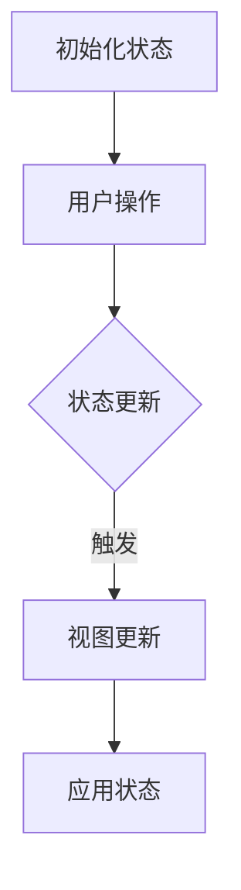

                 

状态管理是现代软件开发中一个核心概念，尤其在复杂的交互式应用程序和实时系统中尤为重要。在本文中，我们将深入探讨状态管理的原理，并通过实际的代码实例来讲解其实现过程。

## 关键词

- 状态管理
- 事件驱动
- 函数式编程
- 响应式编程
- React Hooks
- Vuex
- Redux

## 摘要

本文旨在帮助读者理解状态管理的概念、原理以及在现代软件开发中的重要性。我们将从基础概念出发，逐步深入到具体实现，并通过实际的代码实例展示状态管理的应用场景。文章还将探讨常用的状态管理库，如React Hooks、Vuex和Redux，并给出详细的代码解释。

## 1. 背景介绍

在传统的Web开发中，前端的状态管理通常是通过全局变量或局部变量来实现的。这种方法在简单项目中可能足够使用，但当项目规模增大、组件复杂度增加时，全局变量可能导致的问题包括但不限于：

- **状态不可变**：难以追踪状态的变更，容易造成逻辑混乱。
- **代码复用性差**：全局状态难以在不同的模块间共享和复用。
- **调试困难**：状态的变更路径复杂，调试过程繁琐。

为了解决这些问题，现代前端开发引入了状态管理库，如Redux、Vuex和React Hooks。这些库提供了一种更加结构化和模块化的方式来管理应用的状态。

## 2. 核心概念与联系

### 2.1 事件驱动

事件驱动是状态管理的一个重要概念。在事件驱动架构中，程序的状态变化是由外部事件触发的，而不是由内置的循环控制。例如，当用户在表单中输入文本时，会触发一个事件，这个事件可以导致状态更新，进而触发视图的更新。

### 2.2 函数式编程

函数式编程是一种编程范式，它将计算视为一系列函数的执行，而不是一个状态的变化过程。在函数式编程中，状态是不可变的，这意味着状态的更新总是通过创建一个新的状态对象来实现的，而不是直接修改原始状态。

### 2.3 响应式编程

响应式编程是一种编程范式，它强调数据的流动和状态的变化。在响应式编程中，当一个数据源发生变化时，依赖于这个数据源的组件会自动更新。这种模式在React和Angular等框架中得到了广泛应用。

### 2.4 Mermaid流程图

下面是一个Mermaid流程图，展示了状态管理的基本流程：



## 3. 核心算法原理 & 具体操作步骤

### 3.1 算法原理概述

状态管理的核心算法原理可以概括为以下三点：

1. **状态追踪**：通过一个全局的状态树来追踪所有组件的状态。
2. **事件监听**：监听用户操作或其他事件，当事件发生时触发状态更新。
3. **视图更新**：根据最新的状态重新渲染视图，确保界面与状态的一致性。

### 3.2 算法步骤详解

1. **初始化状态**：创建一个初始的状态对象。
2. **绑定事件**：将事件监听器绑定到用户操作或其他事件源。
3. **触发状态更新**：当事件触发时，调用更新函数，根据事件类型和参数更新状态。
4. **视图更新**：根据最新的状态重新渲染视图。

### 3.3 算法优缺点

**优点**：

- **模块化**：状态管理库将状态管理模块化，使得代码更加易于维护和复用。
- **一致性**：通过统一的状态更新机制，确保了状态与视图的一致性。
- **可追踪性**：全局的状态树使得状态的变更轨迹更加清晰，便于调试。

**缺点**：

- **学习成本**：对于初学者来说，理解状态管理库的概念和用法可能需要一定的时间。
- **性能开销**：在某些情况下，状态管理库可能会引入一定的性能开销。

### 3.4 算法应用领域

状态管理库广泛应用于单页面应用（SPA）、实时系统、复杂交互式应用程序等领域。在SPA中，状态管理库可以确保用户交互的流畅性；在实时系统中，状态管理库可以用于实时更新用户界面；在复杂交互式应用程序中，状态管理库可以帮助开发者更好地管理复杂的组件状态。

## 4. 数学模型和公式 & 详细讲解 & 举例说明

### 4.1 数学模型构建

状态管理可以看作是一个状态转移的过程。我们可以用以下数学模型来描述这个过程：

$$
S_{\text{new}} = f(S_{\text{current}}, E)
$$

其中，$S_{\text{new}}$表示新的状态，$S_{\text{current}}$表示当前状态，$E$表示触发的事件，$f$表示状态更新函数。

### 4.2 公式推导过程

状态更新的过程可以分为以下几个步骤：

1. **初始化状态**：$S_{\text{current}} = S_{\text{initial}}$。
2. **绑定事件**：将事件监听器绑定到用户操作或其他事件源。
3. **触发状态更新**：当事件$E$触发时，调用状态更新函数$f$。
4. **视图更新**：根据最新的状态重新渲染视图。

### 4.3 案例分析与讲解

假设我们有一个简单的计数器应用，初始状态为0。当用户点击“增加”按钮时，状态更新为1；当用户点击“减少”按钮时，状态更新为0。我们可以用以下代码实现：

```javascript
let state = 0;

function increase() {
  state = state + 1;
}

function decrease() {
  state = state - 1;
}
```

在这个例子中，状态更新函数$f$很简单，就是将状态增加或减少1。虽然这个例子非常简单，但它展示了状态管理的基本原理。

## 5. 项目实践：代码实例和详细解释说明

### 5.1 开发环境搭建

为了更好地理解状态管理，我们将使用React和Redux来搭建一个简单的计数器应用。首先，确保你已经安装了Node.js和npm。然后，通过以下命令创建一个新的React项目：

```bash
npx create-react-app counter-app
cd counter-app
```

接下来，安装Redux和React-Redux库：

```bash
npm install redux react-redux
```

### 5.2 源代码详细实现

在`src`目录下，创建一个新的文件`reducers/count.js`，并编写计数器的reducer：

```javascript
const initialState = {
  count: 0,
};

function countReducer(state = initialState, action) {
  switch (action.type) {
    case 'INCREMENT':
      return { count: state.count + 1 };
    case 'DECREMENT':
      return { count: state.count - 1 };
    default:
      return state;
  }
}

export default countReducer;
```

然后，在`src`目录下创建一个新的文件`actions/count.js`，并编写计数器的action creators：

```javascript
export const INCREMENT = 'INCREMENT';
export const DECREMENT = 'DECREMENT';

export function increment() {
  return { type: INCREMENT };
}

export function decrement() {
  return { type: DECREMENT };
}
```

在`src`目录下，创建一个新的文件`store.js`，并使用Redux创建一个store：

```javascript
import { createStore } from 'redux';
import countReducer from './reducers/count';

const store = createStore(countReducer);

export default store;
```

最后，在`src/App.js`中，使用React-Redux的`Provider`组件和`connect`函数来连接Redux的store和组件：

```javascript
import React from 'react';
import { connect } from 'react-redux';
import { increment, decrement } from './actions/count';
import { Provider } from 'react-redux';
import store from './store';

function Counter({ count, increment, decrement }) {
  return (
    <div>
      <h1>计数器: {count}</h1>
      <button onClick={decrement}>减少</button>
      <button onClick={increment}>增加</button>
    </div>
  );
}

const mapStateToProps = (state) => ({
  count: state.count,
});

const mapDispatchToProps = {
  decrement,
  increment,
};

export default connect(mapStateToProps, mapDispatchToProps)(Counter);

function App() {
  return (
    <Provider store={store}>
      <Counter />
    </Provider>
  );
}
```

### 5.3 代码解读与分析

在上面的代码中，我们首先定义了一个计数器的reducer，它接收当前的state和一个action，并返回一个新的state。然后，我们定义了两个action creators，用于触发状态的更新。在`store.js`中，我们创建了一个Redux的store，并在`App.js`中使用`Provider`组件和`connect`函数将其与React组件连接起来。

### 5.4 运行结果展示

通过以上步骤，我们成功地创建了一个简单的计数器应用。你可以启动开发服务器，并在浏览器中查看运行结果。

```bash
npm start
```

## 6. 实际应用场景

### 6.1 在单页面应用（SPA）中的使用

单页面应用（SPA）是现代Web开发中的一种流行模式。在SPA中，状态管理尤为重要，因为它涉及到页面的动态更新。React、Angular和Vue等框架都内置了状态管理机制，开发者可以根据需求选择使用。

### 6.2 在实时系统中的使用

实时系统需要快速响应用户操作，并实时更新用户界面。状态管理库可以帮助开发者更好地管理实时系统中的状态，确保用户交互的流畅性。

### 6.3 在复杂交互式应用程序中的使用

复杂交互式应用程序通常包含多个组件，每个组件都可能有自己的状态。状态管理库可以帮助开发者更好地组织和管理这些状态，减少代码的复杂度。

## 7. 工具和资源推荐

### 7.1 学习资源推荐

- **《Redux官方文档》**：[https://redux.js.org/](https://redux.js.org/)
- **《Vuex官方文档》**：[https://vuex.vuejs.org/](https://vuex.vuejs.org/)
- **《React官方文档》**：[https://reactjs.org/docs/getting-started.html](https://reactjs.org/docs/getting-started.html)

### 7.2 开发工具推荐

- **Redux DevTools**：[https://github.com/reduxjs/redux-devtools](https://github.com/reduxjs/redux-devtools)
- **Vuex DevTools**：[https://vuex.vuejs.org/vuex/devtools.html](https://vuex.vuejs.org/vuex/devtools.html)

### 7.3 相关论文推荐

- **《React官方文档中的“响应式设计”一节》**：[https://reactjs.org/docs/functional-components.html](https://reactjs.org/docs/functional-components.html)
- **《Vuex官方文档中的“响应式设计”一节》**：[https://vuex.vuejs.org/vuex/guide/responding-to-state-changes.html](https://vuex.vuejs.org/vuex/guide/responding-to-state-changes.html)

## 8. 总结：未来发展趋势与挑战

### 8.1 研究成果总结

状态管理在过去的几年中取得了显著的成果，主流框架都内置了状态管理机制，使得状态管理变得更加简单和高效。此外，状态管理库也在不断进化，提供了更多的功能和更好的用户体验。

### 8.2 未来发展趋势

- **更加完善的生态系统**：状态管理库将继续扩展其功能，包括更好的性能优化、更丰富的API和更易用的工具。
- **跨框架的支持**：未来状态管理库可能会更加注重跨框架的支持，以便于开发者在不同框架之间自由切换。
- **智能状态管理**：利用机器学习和人工智能技术，状态管理库可能会变得更加智能，能够自动识别和优化状态更新。

### 8.3 面临的挑战

- **性能优化**：状态管理库可能会引入一定的性能开销，特别是在大型应用中。因此，性能优化将是未来研究的重要方向。
- **学习成本**：对于初学者来说，理解状态管理库的概念和用法可能需要一定的时间，如何降低学习成本也是一个挑战。

### 8.4 研究展望

随着Web应用和实时系统的不断发展，状态管理将继续发挥重要作用。未来，状态管理库可能会更加注重性能优化、智能状态管理和跨框架支持，为开发者提供更加高效和便捷的开发体验。

## 9. 附录：常见问题与解答

### 9.1 Redux和Vuex的区别是什么？

- **数据流**：Redux采用单向数据流，而Vuex采用双向数据绑定。
- **设计理念**：Redux更加注重功能和逻辑的分离，而Vuex更加注重Vue框架的集成。
- **使用场景**：Redux适用于所有使用React的应用，而Vuex主要适用于Vue应用。

### 9.2 如何在React中实现状态管理？

在React中，可以使用React Hooks、Redux或Vuex来实现状态管理。React Hooks提供了在组件中管理状态和副作用的强大功能，而Redux和Vuex则是更完整的状态管理解决方案。

### 9.3 状态管理库是否会过时？

虽然状态管理库在某些方面可能会面临挑战，但它们在Web开发中仍然具有重要地位。随着技术的发展，状态管理库将继续进化，为开发者提供更好的解决方案。

---

本文由禅与计算机程序设计艺术撰写，旨在帮助读者理解状态管理的原理和应用。通过实际的代码实例，我们展示了如何在React中实现状态管理，并探讨了未来状态管理的发展趋势。希望本文能为你的开发工作带来启发和帮助。

# 作者署名

作者：禅与计算机程序设计艺术 / Zen and the Art of Computer Programming

