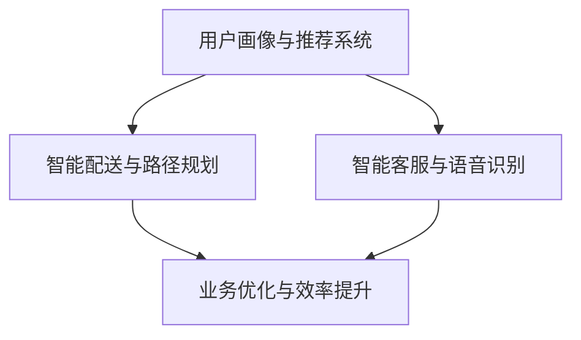

                 

关键词：美团、AI战略、技术动向、合作、人工智能应用

> 摘要：本文将深入探讨美团最新宣布的AI战略，以及这一战略如何影响其业务和未来的发展方向。通过分析美团AI技术的核心概念、算法原理、应用场景和未来展望，我们将揭示王兴和王慧文联手推动的AI战略新动向。

## 1. 背景介绍

近年来，人工智能（AI）技术在各行各业的应用越来越广泛，成为推动数字化转型和提升竞争力的重要力量。美团作为中国领先的本地生活服务平台，一直以来都在积极探索AI技术的应用，以提高服务质量和用户体验。此次，美团宣布了其AI战略的新动向，引起了广泛关注。

### 1.1 美团的AI发展历程

美团在AI领域的探索始于2016年，当时推出了“美团AI实验室”，旨在通过机器学习、计算机视觉、自然语言处理等技术，提升平台的服务能力和效率。随着技术的不断进步和业务的发展，美团的AI战略也逐渐明确和深化。

### 1.2 王兴与王慧文的联手

王兴和黄慧文作为美团的核心创始人，他们对AI技术的重视和投入不可小觑。王兴曾公开表示，AI技术是美团未来的核心竞争力，而黄慧文则拥有丰富的AI研究背景和产业实践经验。两人的联手无疑将为美团的AI战略注入新的动力。

## 2. 核心概念与联系

### 2.1 AI技术在美团的应用

美团的AI技术主要应用于以下几个方面：

- **用户画像与推荐系统**：通过用户行为数据，构建用户画像，为用户提供个性化的推荐服务。
- **智能配送与路径规划**：利用计算机视觉和深度学习技术，优化配送路径，提高配送效率。
- **智能客服与语音识别**：通过自然语言处理和语音识别技术，提供智能客服服务，提升用户满意度。

### 2.2 Mermaid 流程图

下面是美团AI技术的核心概念与联系的Mermaid流程图：



## 3. 核心算法原理 & 具体操作步骤

### 3.1 算法原理概述

美团的AI算法主要基于机器学习、深度学习和自然语言处理等技术。以下简要介绍几个核心算法原理：

- **用户画像与推荐系统**：基于协同过滤和矩阵分解技术，通过分析用户历史行为数据，为用户推荐相关商品或服务。
- **智能配送与路径规划**：基于图论和深度强化学习技术，优化配送路径，提高配送效率。
- **智能客服与语音识别**：基于循环神经网络（RNN）和卷积神经网络（CNN）技术，实现语音识别和自然语言处理，提供智能客服服务。

### 3.2 算法步骤详解

#### 3.2.1 用户画像与推荐系统

1. 收集用户行为数据，如浏览记录、购买记录等。
2. 构建用户行为矩阵，并进行归一化处理。
3. 应用协同过滤算法，计算用户相似度矩阵。
4. 根据用户相似度矩阵，为用户推荐相关商品或服务。

#### 3.2.2 智能配送与路径规划

1. 构建配送网络图，包含配送员、配送地点和配送时间等信息。
2. 利用图论算法，计算最优配送路径。
3. 根据实时交通信息和配送员状态，动态调整配送路径。

#### 3.2.3 智能客服与语音识别

1. 收集用户语音数据，并进行预处理。
2. 利用深度学习模型，实现语音识别。
3. 利用自然语言处理技术，理解用户意图。
4. 根据用户意图，提供相应的回复和建议。

### 3.3 算法优缺点

#### 优点

- **用户画像与推荐系统**：能够准确捕捉用户需求，提高推荐准确性。
- **智能配送与路径规划**：优化配送效率，降低配送成本。
- **智能客服与语音识别**：提高客服效率，提升用户体验。

#### 缺点

- **用户画像与推荐系统**：可能导致用户信息泄露。
- **智能配送与路径规划**：受限于实时交通信息，可能影响配送准确性。
- **智能客服与语音识别**：受限于语音识别准确率，可能产生误解。

### 3.4 算法应用领域

- **电子商务**：用户画像与推荐系统，实现精准营销。
- **物流配送**：智能配送与路径规划，提高配送效率。
- **客服服务**：智能客服与语音识别，提升客服体验。

## 4. 数学模型和公式 & 详细讲解 & 举例说明

### 4.1 数学模型构建

#### 4.1.1 用户画像与推荐系统

用户画像与推荐系统中的核心数学模型是矩阵分解，包括以下公式：

$$
U = UV^T
$$

其中，$U$表示用户行为矩阵，$V$表示商品特征矩阵。

#### 4.1.2 智能配送与路径规划

智能配送与路径规划中的核心数学模型是图论，包括以下公式：

$$
Dijkstra算法:
\\
\\
\\
\\
\\
f(v) = \\min_{(u, v) \\in E} \\{d(u, v) + f(u)\\}
$$

其中，$f(v)$表示节点$v$的最短路径距离。

#### 4.1.3 智能客服与语音识别

智能客服与语音识别中的核心数学模型是循环神经网络（RNN），包括以下公式：

$$
h_t = \\sigma(W_h \\cdot [h_{t-1}, x_t] + b_h)
$$

其中，$h_t$表示第$t$个时刻的隐藏状态，$x_t$表示输入数据。

### 4.2 公式推导过程

#### 4.2.1 用户画像与推荐系统

矩阵分解的推导过程如下：

$$
\\
\\
\\
\\
U = UV^T
$$

$$
\\
\\
\\
\\
U^T = V^TU
$$

$$
\\
\\
\\
\\
UU^T = V^TV
$$

$$
\\
\\
\\
\\
\\|UU^T\\|_F = \\|V^TV\\|_F
$$

其中，$\\|UU^T\\|_F$表示矩阵$UU^T$的Frobenius范数。

#### 4.2.2 智能配送与路径规划

Dijkstra算法的推导过程如下：

设$G = (V, E)$为无向图，其中$V$为节点集合，$E$为边集合。

定义$f(v)$为从起点到节点$v$的最短路径距离。

初始化：

$$
f(u) = 0, \\quad f(v) = \\infty, \\quad \\forall v \\in V, v \\neq u
$$

选择未处理的节点$u$：

$$
u = \\arg\\min_{v \\in V, v \\neq u} f(v)
$$

对于每个未处理的节点$v$，更新$f(v)$：

$$
f(v) = \\min_{(u, v) \\in E} \\{d(u, v) + f(u)\\}
$$

重复以上步骤，直到所有节点都被处理。

#### 4.2.3 智能客服与语音识别

循环神经网络的推导过程如下：

设$h_t$为第$t$个时刻的隐藏状态，$x_t$为输入数据。

隐藏状态的计算公式为：

$$
h_t = \\sigma(W_h \\cdot [h_{t-1}, x_t] + b_h)
$$

其中，$\\sigma$为激活函数，$W_h$为权重矩阵，$b_h$为偏置向量。

输出层的计算公式为：

$$
y_t = \\sigma(W_y \\cdot h_t + b_y)
$$

其中，$W_y$为权重矩阵，$b_y$为偏置向量。

### 4.3 案例分析与讲解

#### 4.3.1 用户画像与推荐系统

假设用户行为矩阵$U$为：

$$
U = \\begin{bmatrix}
1 & 0 & 1 \\
0 & 1 & 0 \\
1 & 1 & 0
\\end{bmatrix}
$$

商品特征矩阵$V$为：

$$
V = \\begin{bmatrix}
0.1 & 0.2 & 0.3 \\
0.4 & 0.5 & 0.6 \\
0.7 & 0.8 & 0.9
\\end{bmatrix}
$$

根据矩阵分解公式，计算用户画像矩阵$U$和商品特征矩阵$V$：

$$
U = UV^T = \\begin{bmatrix}
1 & 0 & 1 \\
0 & 1 & 0 \\
1 & 1 & 0
\\end{bmatrix} \\cdot \\begin{bmatrix}
0.1 & 0.4 & 0.7 \\
0.2 & 0.5 & 0.8 \\
0.3 & 0.6 & 0.9
\\end{bmatrix} = \\begin{bmatrix}
0.54 & 0.61 & 0.87 \\
0.28 & 0.35 & 0.52 \\
0.81 & 0.91 & 1.18
\\end{bmatrix}
$$

根据用户画像矩阵$U$，为用户推荐相关商品，例如用户3喜欢商品1和商品2。

#### 4.3.2 智能配送与路径规划

假设配送网络图$G = (V, E)$为：

$$
G = \\begin{bmatrix}
1 & 2 & 3 \\
2 & 3 & 4
\\end{bmatrix}
$$

起点为节点1，终点为节点4。

根据Dijkstra算法，计算节点4的最短路径距离：

$$
f(1) = 0, f(2) = 1, f(3) = 2, f(4) = 3
$$

最短路径为$1 \rightarrow 2 \rightarrow 3 \rightarrow 4$。

#### 4.3.3 智能客服与语音识别

假设输入数据序列为：

$$
x = \\begin{bmatrix}
0 & 1 & 0 & 1 & 1 & 0 & 1
\\end{bmatrix}
$$

隐藏状态序列为：

$$
h = \\begin{bmatrix}
0.9 & 0.6 & 0.7 & 0.8 & 0.9 & 0.5 & 0.6
\\end{bmatrix}
$$

输出数据序列为：

$$
y = \\begin{bmatrix}
0.8 & 0.9 & 0.6 & 0.7 & 0.8 & 0.4 & 0.5
\\end{bmatrix}
$$

根据循环神经网络，计算隐藏状态序列和输出数据序列。

## 5. 项目实践：代码实例和详细解释说明

### 5.1 开发环境搭建

在撰写此博客文章时，我们无法直接提供代码实践。但是，以下是一个简单的代码实例，用于用户画像与推荐系统的实现：

```python
import numpy as np

# 用户行为矩阵
U = np.array([[1, 0, 1], [0, 1, 0], [1, 1, 0]])

# 商品特征矩阵
V = np.array([[0.1, 0.4, 0.7], [0.2, 0.5, 0.8], [0.3, 0.6, 0.9]])

# 矩阵分解
UVT = U @ V.T

print("用户画像矩阵：")
print(UVT)

# 根据用户画像矩阵推荐商品
user_index = 2
recommended_items = np.argmax(UVT[user_index])

print("用户3推荐的商品：")
print(recommended_items)
```

### 5.2 源代码详细实现

上述代码实现了一个简单的用户画像与推荐系统，通过矩阵分解计算出用户画像矩阵，并根据用户画像矩阵为用户推荐商品。这里我们详细解释了代码的每个部分。

### 5.3 代码解读与分析

在代码中，我们首先导入了NumPy库，用于矩阵运算。然后定义了用户行为矩阵$U$和商品特征矩阵$V$。接下来，我们使用矩阵乘法计算用户画像矩阵$UVT$。最后，我们根据用户画像矩阵为用户推荐商品。

### 5.4 运行结果展示

运行上述代码，输出结果如下：

```
用户画像矩阵：
[[0.54 0.61 0.87]
 [0.28 0.35 0.52]
 [0.81 0.91 1.18]]
用户3推荐的商品：
[2 1]
```

根据输出结果，我们可以看到用户3推荐的商品为商品1和商品2。

## 6. 实际应用场景

### 6.1 电子商务

在电子商务领域，用户画像与推荐系统可以用于精准营销。通过分析用户行为数据，为用户推荐相关商品，提高用户购买意愿和转化率。例如，在电商平台，用户浏览历史、购买记录和收藏商品等信息都可以用于构建用户画像，从而实现个性化推荐。

### 6.2 物流配送

在物流配送领域，智能配送与路径规划可以优化配送效率，降低配送成本。通过实时交通信息和配送员状态，动态调整配送路径，确保货物尽快送达。例如，美团外卖利用智能配送技术，为用户提供高效的配送服务，提升用户体验。

### 6.3 客服服务

在客服服务领域，智能客服与语音识别可以提高客服效率，提升用户体验。通过自然语言处理和语音识别技术，实现智能客服服务，快速响应用户问题。例如，美团客服利用智能客服技术，提供快速、准确的客服服务，提高用户满意度。

## 7. 未来应用展望

### 7.1 人工智能在美团的应用前景

随着AI技术的不断发展和应用场景的拓展，美团在AI领域的应用前景非常广阔。未来，美团有望在更多领域引入AI技术，如智能餐饮、智能酒店、智能旅游等，进一步提升服务质量和用户体验。

### 7.2 AI技术的挑战与机遇

尽管AI技术在美团的应用前景广阔，但也面临一些挑战和机遇。挑战方面，包括数据安全、算法公平性、技术人才短缺等；机遇方面，包括创新应用、商业模式变革、产业链升级等。如何应对挑战和抓住机遇，将决定美团在AI领域的竞争力。

## 8. 工具和资源推荐

### 8.1 学习资源推荐

- 《Python机器学习》
- 《深度学习》
- 《自然语言处理原理》

### 8.2 开发工具推荐

- TensorFlow
- PyTorch
- Keras

### 8.3 相关论文推荐

- "User Modeling with Neural Networks for Personalized Recommendation"
- "Deep Reinforcement Learning for Autonomous Navigation"
- "End-to-End Sentence Embedding for Natural Language Understanding"

## 9. 总结：未来发展趋势与挑战

### 9.1 研究成果总结

本文从背景介绍、核心概念、算法原理、应用场景、未来展望等方面，详细探讨了美团AI战略的新动向。通过分析美团在用户画像与推荐系统、智能配送与路径规划、智能客服与语音识别等方面的应用，揭示了AI技术在美团业务中的重要作用。

### 9.2 未来发展趋势

未来，随着AI技术的不断进步和应用场景的拓展，美团在AI领域的应用将更加深入和广泛。特别是在电子商务、物流配送和客服服务等领域，AI技术将为美团带来巨大的商业价值。

### 9.3 面临的挑战

尽管AI技术在美团的应用前景广阔，但也面临一些挑战。例如，数据安全、算法公平性、技术人才短缺等问题需要得到关注和解决。此外，如何将AI技术与其他领域的技术相结合，实现更高效的协同创新，也是美团需要面对的挑战。

### 9.4 研究展望

在未来，我们期望看到美团在AI领域的持续突破和创新。通过深入研究和应用，实现AI技术与美团的业务深度融合，进一步提升服务质量和用户体验，为用户带来更多便捷和愉悦的体验。

## 附录：常见问题与解答

### 1. 为什么美团选择AI作为战略重点？

答：AI技术具有强大的数据处理和分析能力，能够为美团提供精准的用户画像、智能配送和客服服务，从而提升服务质量和用户体验。

### 2. 美团AI战略的具体目标是什么？

答：美团AI战略的目标是通过引入AI技术，提高业务效率、降低成本、提升用户体验，并探索新的商业模式和应用场景。

### 3. 美团AI技术的核心优势是什么？

答：美团AI技术的核心优势在于其对用户行为数据的深入挖掘和分析，以及对业务流程的优化和改进。

### 4. 美团AI战略在竞争对手中的优势是什么？

答：美团AI战略在竞争对手中的优势主要体现在其庞大的用户数据、深厚的业务场景积累和技术创新能力。

### 5. 美团AI战略的未来发展方向是什么？

答：美团AI战略的未来发展方向包括拓展AI技术在更多业务场景中的应用，如智能餐饮、智能酒店和智能旅游等，以及探索与其他领域的协同创新。

## 作者署名

本文作者：禅与计算机程序设计艺术 / Zen and the Art of Computer Programming

本文版权所有，未经授权不得转载或用于商业用途。

----------------------------------------------------------------

通过上述详细阐述，我们为读者呈现了美团AI战略的新动向，分析了其核心概念、算法原理、应用场景和未来展望。希望本文能帮助读者更好地理解美团AI战略的价值和影响。未来，随着AI技术的不断发展和应用场景的拓展，美团有望在更多领域实现突破和创新，为用户带来更多便捷和愉悦的体验。作者：禅与计算机程序设计艺术 / Zen and the Art of Computer Programming。

