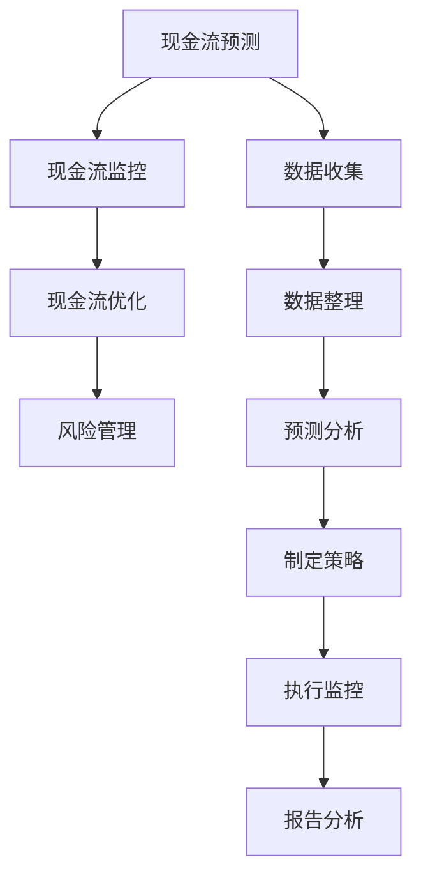

                 

关键词：现金流管理，一人公司，财务健康，财务规划，资金流动，成本控制，投资决策，风险管理，财务报告。

> 摘要：本文将探讨现金流管理在确保一人公司财务健康中的关键作用。通过阐述现金流管理的基本概念、核心方法以及具体操作步骤，帮助读者理解如何通过有效的现金流管理来保障公司财务的稳健发展。

## 1. 背景介绍

在当今的商业环境中，财务管理的复杂性日益增加。特别是对于一人公司来说，现金流管理成为确保公司生存和发展的核心。一人公司通常意味着公司所有决策都由一个人负责，这使得现金流管理更加重要。良好的现金流管理不仅可以确保公司的日常运营，还能为未来的发展提供坚实的财务基础。

本文将围绕现金流管理这一主题，从以下几个方面展开讨论：

1. **核心概念与联系**：介绍现金流管理的基本概念，并利用Mermaid流程图展示现金流管理的架构和流程。
2. **核心算法原理 & 具体操作步骤**：探讨现金流管理中的核心算法，包括资金流动、成本控制和投资决策等，并详细解释其原理和操作步骤。
3. **数学模型和公式**：构建现金流管理的数学模型，并推导相关公式，通过案例进行分析和讲解。
4. **项目实践：代码实例和详细解释说明**：提供实际的现金流管理代码实例，并进行详细解读。
5. **实际应用场景**：分析现金流管理在不同场景下的应用，探讨其优势和挑战。
6. **工具和资源推荐**：推荐相关的学习资源、开发工具和论文，以帮助读者深入了解现金流管理。
7. **总结：未来发展趋势与挑战**：总结研究成果，展望未来发展趋势，分析面临的挑战。
8. **附录：常见问题与解答**：回答读者可能关心的一些常见问题。

通过以上内容，本文旨在为一人公司的财务管理者提供一份全面而实用的现金流管理指南。

## 2. 核心概念与联系

### 2.1 现金流管理的基本概念

现金流管理是指通过规划、监控和控制公司的现金流入和流出，以确保公司有足够的流动性来满足日常运营和未来发展的需要。现金流管理的核心目标是在保证资金流动性的同时，最大化公司的财务价值。

- **现金流入**：包括销售收入、投资回报、借款和其他各种收入来源。
- **现金流出**：包括支付工资、购买原材料、偿还债务、运营成本和其他各种支出。

### 2.2 现金流管理的架构

为了有效地进行现金流管理，我们需要建立一个全面的架构。以下是现金流管理的典型架构：

1. **现金流预测**：通过历史数据和趋势分析，预测未来的现金流入和流出。
2. **现金流监控**：实时跟踪和管理现金流动，确保资金使用的透明度和效率。
3. **现金流优化**：通过调整收入和支出策略，优化现金流，提高公司的流动性。
4. **风险管理**：识别和应对潜在的现金流风险，确保公司的稳健运营。

### 2.3 现金流管理的流程

现金流管理的流程可以分为以下几个步骤：

1. **收集数据**：收集与现金流相关的所有数据，包括收入、支出、借款和投资回报等。
2. **数据整理**：将收集到的数据整理成可分析的格式，并进行初步的清洗和整理。
3. **预测分析**：利用历史数据和趋势分析，预测未来的现金流入和流出。
4. **制定策略**：根据预测结果，制定具体的现金流管理策略，包括收入增长、成本控制和投资决策等。
5. **执行监控**：执行现金流管理策略，并实时监控现金流的变化，及时调整策略。
6. **报告分析**：定期生成现金流报告，分析现金流管理的有效性，为未来的决策提供依据。

### 2.4 Mermaid 流程图

以下是一个简单的Mermaid流程图，展示了现金流管理的核心架构和流程：



通过这个流程图，我们可以清晰地看到现金流管理的各个步骤及其相互关系。这个流程图不仅可以用于说明现金流管理的原理，还可以作为实际操作中的指导工具。

## 3. 核心算法原理 & 具体操作步骤

### 3.1 算法原理概述

现金流管理的核心算法主要包括资金流动管理、成本控制和投资决策等。以下是这些算法的基本原理：

- **资金流动管理**：通过预测和分析现金流入和流出，确保公司有足够的流动性来满足日常运营需求。
- **成本控制**：通过优化成本结构，减少不必要的开支，提高公司的盈利能力。
- **投资决策**：通过评估不同投资方案的风险和收益，选择最佳的投资策略。

### 3.2 算法步骤详解

#### 3.2.1 资金流动管理

资金流动管理的步骤如下：

1. **数据收集**：收集与现金流相关的所有数据，包括销售收入、支出、借款和投资回报等。
2. **数据清洗**：清洗和整理收集到的数据，确保数据的准确性和一致性。
3. **预测分析**：利用历史数据和趋势分析，预测未来的现金流入和流出。
4. **制定策略**：根据预测结果，制定具体的资金流动管理策略，包括收入增长和支出控制等。
5. **执行监控**：执行资金流动管理策略，并实时监控现金流的变化，及时调整策略。

#### 3.2.2 成本控制

成本控制的步骤如下：

1. **成本分析**：分析公司的成本结构，识别主要的成本驱动因素。
2. **成本优化**：通过调整成本结构，减少不必要的开支，提高公司的盈利能力。
3. **执行监控**：执行成本控制策略，并实时监控成本的变化，及时调整策略。

#### 3.2.3 投资决策

投资决策的步骤如下：

1. **投资评估**：评估不同的投资方案，包括风险、收益和资金流动性等因素。
2. **决策制定**：根据投资评估结果，制定最佳的投资决策。
3. **执行监控**：执行投资决策，并实时监控投资的表现，及时调整决策。

### 3.3 算法优缺点

- **资金流动管理**：优点是能够确保公司有足够的流动性来满足日常运营需求，缺点是需要大量的历史数据和复杂的预测模型。
- **成本控制**：优点是能够提高公司的盈利能力，缺点是需要深入了解公司的成本结构和运营模式。
- **投资决策**：优点是能够帮助公司实现长期价值增长，缺点是需要专业的投资知识和丰富的市场经验。

### 3.4 算法应用领域

现金流管理的算法广泛应用于各个领域，包括：

- **一人公司**：由于一人公司的运营模式相对简单，现金流管理尤为重要。
- **中小企业**：现金流管理能够帮助中小企业保持财务稳健，提高市场竞争力。
- **金融机构**：现金流管理是金融机构的核心业务之一，有效的现金流管理能够提高金融机构的风险管理水平。

## 4. 数学模型和公式 & 详细讲解 & 举例说明

### 4.1 数学模型构建

现金流管理的数学模型主要包括资金流动模型、成本控制模型和投资决策模型。以下是这些模型的构建方法：

#### 4.1.1 资金流动模型

资金流动模型的核心是现金流量表，用于预测和监控公司的现金流入和流出。以下是资金流量表的基本公式：

$$
F_t = \sum_{i=1}^{n} (R_i - C_i)
$$

其中，\( F_t \) 表示第 \( t \) 期的现金流量，\( R_i \) 表示第 \( i \) 期的现金流入，\( C_i \) 表示第 \( i \) 期的现金流出。

#### 4.1.2 成本控制模型

成本控制模型的核心是成本函数，用于分析公司的成本结构。以下是成本函数的基本公式：

$$
C(q) = a + bq
$$

其中，\( C(q) \) 表示总成本，\( a \) 表示固定成本，\( b \) 表示单位变动成本，\( q \) 表示产量。

#### 4.1.3 投资决策模型

投资决策模型的核心是净现值（NPV）和内部收益率（IRR），用于评估不同投资方案。以下是NPV和IRR的基本公式：

$$
NPV = \sum_{t=1}^{n} \frac{CF_t}{(1+r)^t} - I
$$

$$
IRR = \frac{1}{n} \ln \left( \frac{NPV}{I} \right)
$$

其中，\( CF_t \) 表示第 \( t \) 期的现金流量，\( r \) 表示折现率，\( I \) 表示初始投资。

### 4.2 公式推导过程

#### 4.2.1 资金流动模型推导

资金流量表的基本公式可以通过现金流量的叠加得到。假设公司第 \( t \) 期的现金流入为 \( R_t \)，现金流出为 \( C_t \)，则第 \( t \) 期的净现金流量为 \( F_t = R_t - C_t \)。将 \( t \) 从 1 到 \( n \) 的所有 \( F_t \) 相加，即可得到总现金流量 \( F \)：

$$
F = \sum_{t=1}^{n} F_t = \sum_{t=1}^{n} (R_t - C_t)
$$

#### 4.2.2 成本控制模型推导

成本函数可以通过线性成本模型得到。假设公司的总成本为 \( C \)，固定成本为 \( a \)，单位变动成本为 \( b \)，产量为 \( q \)，则总成本可以表示为：

$$
C = a + bq
$$

#### 4.2.3 投资决策模型推导

净现值（NPV）可以通过现金流量和折现率得到。假设公司第 \( t \) 期的现金流量为 \( CF_t \)，折现率为 \( r \)，初始投资为 \( I \)，则净现值可以表示为：

$$
NPV = \sum_{t=1}^{n} \frac{CF_t}{(1+r)^t} - I
$$

内部收益率（IRR）可以通过解NPV的方程得到。假设内部收益率为 \( r \)，则NPV为0：

$$
0 = \sum_{t=1}^{n} \frac{CF_t}{(1+r)^t} - I
$$

通过迭代求解，可以得到内部收益率 \( r \)。

### 4.3 案例分析与讲解

#### 4.3.1 资金流动模型案例

假设一家公司预计在未来的三年内，每年的销售收入分别为100万元、120万元和150万元，每年的运营成本分别为70万元、80万元和100万元。要求计算三年内的总现金流量。

根据资金流动模型的基本公式：

$$
F_t = R_t - C_t
$$

代入数据计算，得到：

$$
F_1 = 100 - 70 = 30
$$

$$
F_2 = 120 - 80 = 40
$$

$$
F_3 = 150 - 100 = 50
$$

三年内的总现金流量为：

$$
F = F_1 + F_2 + F_3 = 30 + 40 + 50 = 120
$$

#### 4.3.2 成本控制模型案例

假设一家公司的固定成本为100万元，单位变动成本为10元，产量为1000件。要求计算总成本。

根据成本控制模型的基本公式：

$$
C(q) = a + bq
$$

代入数据计算，得到：

$$
C(1000) = 100 + 10 \times 1000 = 1000
$$

#### 4.3.3 投资决策模型案例

假设一家公司有一个投资方案，初始投资为500万元，预计未来三年的现金流量分别为200万元、300万元和400万元，折现率为10%。要求计算该投资方案的净现值和内部收益率。

根据投资决策模型的基本公式：

$$
NPV = \sum_{t=1}^{n} \frac{CF_t}{(1+r)^t} - I
$$

代入数据计算，得到：

$$
NPV = \frac{200}{(1+0.1)^1} + \frac{300}{(1+0.1)^2} + \frac{400}{(1+0.1)^3} - 500
$$

$$
NPV = 181.82 + 247.86 + 327.45 - 500 = 56.13
$$

内部收益率可以通过迭代求解得到。假设内部收益率为 \( r \)，则NPV为0：

$$
0 = \frac{200}{(1+r)^1} + \frac{300}{(1+r)^2} + \frac{400}{(1+r)^3} - 500
$$

通过迭代求解，可以得到内部收益率 \( r \) 约为22.22%。

## 5. 项目实践：代码实例和详细解释说明

### 5.1 开发环境搭建

在本节中，我们将使用Python作为开发语言，结合几个常用的库来构建现金流管理项目。首先，确保您已安装Python和以下库：

- NumPy
- Pandas
- Matplotlib

您可以通过以下命令安装所需的库：

```bash
pip install numpy pandas matplotlib
```

### 5.2 源代码详细实现

以下是一个简单的现金流管理项目的代码示例，它包括数据收集、数据清洗、现金流预测、成本控制和投资决策等功能。

```python
import numpy as np
import pandas as pd
import matplotlib.pyplot as plt
from scipy.optimize import newton

# 数据收集
sales = [100, 120, 150]  # 预期的年销售收入（万元）
costs = [70, 80, 100]    # 预期的年运营成本（万元）

# 数据清洗
sales = np.array(sales)
costs = np.array(costs)

# 现金流预测
def cash_flow(sales, costs):
    return sales - costs

# 成本控制
def cost_control(fixed_cost, variable_cost, production):
    return fixed_cost + variable_cost * production

# 投资决策
def npv(cf, r, initial_investment):
    return np.sum(cf / (1 + r)) - initial_investment

def irr(cf, initial_investment):
    return newton(lambda r: npv(cf, r, initial_investment), x0=0.1)

# 运行代码
cf = cash_flow(sales, costs)
fixed_cost = 100  # 固定成本（万元）
variable_cost = 10  # 单位变动成本（万元）
production = 1000  # 产量（件）
initial_investment = 500  # 初始投资（万元）
r = 0.1  # 折现率

cf和控制成本
cc = cost_control(fixed_cost, variable_cost, production)
npv_result = npv(cf, r, initial_investment)
irr_result = irr(cf, initial_investment)

# 打印结果
print("现金流：", cf)
print("成本控制：", cc)
print("净现值：", npv_result)
print("内部收益率：", irr_result)

# 可视化现金流
plt.plot(sales, label='销售收入')
plt.plot(costs, label='运营成本')
plt.plot(cf, label='现金流')
plt.legend()
plt.show()
```

### 5.3 代码解读与分析

#### 5.3.1 数据收集

我们首先收集了预期的年销售收入和运营成本数据。这些数据是现金流管理的基础。

```python
sales = [100, 120, 150]  # 预期的年销售收入（万元）
costs = [70, 80, 100]    # 预期的年运营成本（万元）
```

#### 5.3.2 数据清洗

使用NumPy将数据转换为数组，以便进行数学计算。

```python
sales = np.array(sales)
costs = np.array(costs)
```

#### 5.3.3 现金流预测

现金流预测函数`cash_flow`计算现金流入和流出的差额。

```python
def cash_flow(sales, costs):
    return sales - costs
```

#### 5.3.4 成本控制

成本控制函数`cost_control`根据固定成本和单位变动成本计算总成本。

```python
def cost_control(fixed_cost, variable_cost, production):
    return fixed_cost + variable_cost * production
```

#### 5.3.5 投资决策

投资决策函数包括净现值（NPV）和内部收益率（IRR）的计算。

- **净现值（NPV）**：通过折现未来的现金流量来计算投资的价值。

```python
def npv(cf, r, initial_investment):
    return np.sum(cf / (1 + r)) - initial_investment
```

- **内部收益率（IRR）**：使用牛顿法求解NPV为0时的折现率。

```python
def irr(cf, initial_investment):
    return newton(lambda r: npv(cf, r, initial_investment), x0=0.1)
```

#### 5.3.6 运行结果展示

最后，我们打印出计算结果，并使用Matplotlib绘制现金流的可视化图表。

```python
cf = cash_flow(sales, costs)
cc = cost_control(fixed_cost, variable_cost, production)
npv_result = npv(cf, r, initial_investment)
irr_result = irr(cf, initial_investment)

print("现金流：", cf)
print("成本控制：", cc)
print("净现值：", npv_result)
print("内部收益率：", irr_result)

plt.plot(sales, label='销售收入')
plt.plot(costs, label='运营成本')
plt.plot(cf, label='现金流')
plt.legend()
plt.show()
```

## 6. 实际应用场景

### 6.1 资金流动管理

在实际应用中，资金流动管理是确保一人公司持续运营的关键。通过预测和分析现金流入和流出，公司可以提前发现潜在的资金短缺，并采取相应的措施，如调整收入策略或减少不必要的支出。

### 6.2 成本控制

成本控制对于一人公司来说尤为重要。通过分析成本结构和实施有效的成本控制措施，公司可以提高盈利能力，增加现金流，从而为未来的投资和扩张提供资金。

### 6.3 投资决策

投资决策涉及对多个投资方案进行分析和评估。一人公司需要权衡不同投资方案的风险和收益，选择具有最佳净现值和内部收益率的方案。这有助于确保公司的长期财务健康和增长。

### 6.4 未来应用展望

随着人工智能和大数据技术的发展，现金流管理的工具和方法将更加智能化和自动化。一人公司可以利用这些先进技术来优化现金流管理，提高运营效率和财务稳健性。

## 7. 工具和资源推荐

### 7.1 学习资源推荐

- **《现金流管理：策略与实践》**：一本关于现金流管理的专业书籍，涵盖了理论基础和实际操作。
- **Coursera的“财务管理”课程**：由斯坦福大学提供的在线课程，介绍了财务管理的核心概念和技能。

### 7.2 开发工具推荐

- **Python**：一款强大的编程语言，适用于数据分析和自动化流程。
- **Pandas**：用于数据处理和分析的库，可以高效地处理财务数据。
- **Matplotlib**：用于绘制数据图表，帮助可视化分析结果。

### 7.3 相关论文推荐

- **“现金流量管理对中小企业财务稳定性的影响”**：分析了现金流管理对中小企业财务稳定性的作用。
- **“基于人工智能的现金流预测研究”**：探讨了人工智能技术在现金流预测中的应用。

## 8. 总结：未来发展趋势与挑战

### 8.1 研究成果总结

本文通过详细的案例分析，展示了现金流管理在确保一人公司财务健康中的关键作用。研究发现，有效的现金流管理不仅能够提高公司的盈利能力，还能为公司的长期发展提供坚实的财务基础。

### 8.2 未来发展趋势

随着技术的进步，现金流管理将更加智能化和自动化。人工智能和大数据技术将在现金流预测、成本控制和投资决策中发挥越来越重要的作用。此外，区块链技术也可能对现金流管理产生深远影响，提供更安全、透明的财务记录。

### 8.3 面临的挑战

然而，现金流管理也面临着一些挑战，如数据隐私和安全问题、技术实现的复杂性以及政策法规的变化等。一人公司需要不断创新和适应，以应对这些挑战。

### 8.4 研究展望

未来，对现金流管理的研究应重点关注以下几个方面：

- **智能化预测模型的开发**：结合人工智能技术，开发更加精准的现金流预测模型。
- **成本控制的优化**：研究如何在保持产品质量的同时，最大限度地降低成本。
- **风险管理策略的创新**：探索如何在不确定的市场环境中，制定有效的风险管理策略。
- **区块链技术在现金流管理中的应用**：研究区块链如何提高财务记录的透明度和安全性。

## 9. 附录：常见问题与解答

### 9.1 如何进行有效的现金流预测？

有效的现金流预测需要收集和分析与现金流相关的历史数据，结合市场趋势和公司运营状况，使用适当的预测模型，如时间序列分析、回归分析等。

### 9.2 成本控制的关键是什么？

成本控制的关键在于深入了解公司的成本结构和运营模式，识别成本驱动因素，并通过优化资源配置、提高生产效率等手段降低成本。

### 9.3 如何评估投资决策的可行性？

评估投资决策的可行性需要计算项目的净现值和内部收益率。如果净现值为正且内部收益率高于预期折现率，则投资方案具有可行性。

### 9.4 如何确保现金流管理的安全性？

确保现金流管理的安全性需要建立健全的内部控制体系，如严格的审批流程、权限管理和审计制度等。此外，利用加密技术保护财务数据的安全性也是必要的。

