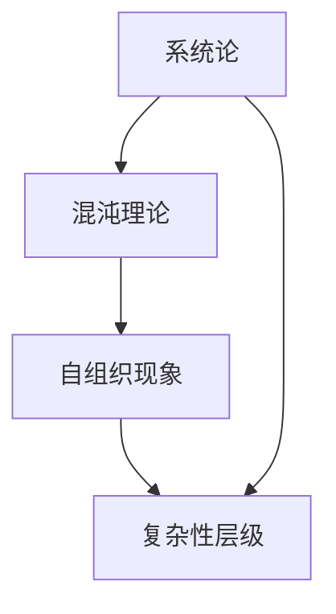

                 

关键词：复杂性科学、结构分析、洞见、计算方法、数据处理、算法优化、数据可视化

> 摘要：本文旨在探讨复杂性科学的核心理念，从结构分析的角度出发，深入探讨如何利用计算方法来挖掘数据中的洞见。文章将结合实际应用场景，详细介绍几种核心算法的原理、操作步骤以及优缺点，并通过项目实践和数学模型分析，展示如何通过技术手段理解和应对复杂性问题。

## 1. 背景介绍

随着信息技术的发展，数据处理和分析已成为各个行业的重要驱动力。然而，随着数据量的指数级增长，传统的数据处理方法难以应对复杂性的挑战。复杂性科学作为一种新兴的研究领域，致力于探索复杂系统的运行机制，并寻求解决复杂问题的有效途径。

本文将结合复杂性科学的研究成果，探讨如何从结构分析的角度理解复杂系统，并利用计算方法挖掘数据中的洞见。文章将分为以下几个部分：

1. 背景介绍：介绍复杂性科学的背景和重要性。
2. 核心概念与联系：阐述复杂性科学中的核心概念，并绘制相应的 Mermaid 流程图。
3. 核心算法原理与操作步骤：详细介绍几种核心算法的原理、操作步骤和优缺点。
4. 数学模型和公式：讨论数学模型和公式在复杂性科学中的应用，并进行举例说明。
5. 项目实践：通过实际项目展示如何应用核心算法和数学模型解决复杂问题。
6. 实际应用场景：分析复杂性科学在各个领域的应用案例。
7. 工具和资源推荐：介绍学习资源和开发工具。
8. 总结：总结研究成果，展望未来发展趋势与挑战。

## 2. 核心概念与联系

在复杂性科学中，核心概念包括系统论、混沌理论、自组织现象和复杂性层级等。这些概念相互关联，构成了一个完整的理论体系。以下是一个简单的 Mermaid 流程图，展示这些核心概念之间的联系：



### 2.1 系统论

系统论是复杂性科学的基础，它强调整体性、层次性和动态性。在系统论中，系统被视为一个整体，各个部分相互关联，共同构成一个复杂的系统。系统论的核心思想是，系统的行为不仅取决于各个部分的行为，还取决于它们之间的相互作用。

### 2.2 混沌理论

混沌理论是复杂性科学的一个重要分支，研究非线性动态系统的行为。混沌现象具有以下特点：

- **确定性**：混沌系统在数学上是确定的，即给定初始条件，系统的状态可以精确预测。
- **随机性**：尽管混沌系统在数学上是确定的，但在实际应用中，由于初始条件的微小差异，系统的行为会呈现出随机性。
- **长期依赖性**：混沌系统对初始条件具有强烈的敏感性，微小差异会导致系统在长期演化过程中产生截然不同的行为。

### 2.3 自组织现象

自组织现象是指系统在没有外部干预的情况下，通过内部相互作用自发形成有序结构的特性。自组织现象在自然界和人类社会中广泛存在，如生物体的进化、市场经济的波动、社交网络的演化等。

### 2.4 复杂性层级

复杂性层级是衡量系统复杂程度的指标，它反映了系统在不同尺度上的复杂特性。复杂性层级从低到高可以分为以下几个层次：

- **简单系统**：具有明确的边界和简单的内部结构，如单分子系统。
- **中等复杂系统**：具有多个组成部分和复杂的相互作用，如生物分子网络。
- **复杂系统**：具有高度非线性、不确定性和多样性，如全球经济系统。

## 3. 核心算法原理与操作步骤

在复杂性科学中，核心算法包括分而治之、模拟退火和深度学习等。这些算法在处理复杂问题时具有独特的优势和局限性。以下将详细介绍这些算法的原理和操作步骤。

### 3.1 分而治之

分而治之是一种经典的算法设计范式，它将复杂问题分解为若干个规模较小的子问题，分别解决后再合并子问题的解。分而治之的关键步骤如下：

1. **分解**：将复杂问题划分为若干个子问题，每个子问题具有相同的结构。
2. **递归**：对每个子问题进行递归求解，直到子问题规模足够小，可以直接求解。
3. **合并**：将子问题的解合并为原问题的解。

分而治之的优势在于，它可以有效地降低问题的复杂度，提高算法的效率。然而，分而治之也存在一些局限性，如递归调用可能会导致大量的内存占用。

### 3.2 模拟退火

模拟退火是一种启发式算法，模拟了固体退火过程中的温度变化。在模拟退火过程中，系统从高能量状态逐渐冷却至低能量状态，以寻找全局最优解。模拟退火的关键步骤如下：

1. **初始化**：设定初始温度和初始解。
2. **冷却**：逐步降低温度，每次降低温度后，以一定概率接受当前解作为新解。
3. **终止**：当温度降低至某个阈值时，终止算法。

模拟退火的优势在于，它可以跳出局部最优解，找到全局最优解。然而，模拟退火的收敛速度较慢，且需要设定合理的温度冷却策略。

### 3.3 深度学习

深度学习是一种基于多层神经网络的算法，它可以自动学习数据的特征表示。深度学习的关键步骤如下：

1. **数据预处理**：对数据进行归一化、去噪等预处理。
2. **模型构建**：设计多层神经网络结构，包括输入层、隐藏层和输出层。
3. **训练**：通过反向传播算法训练模型，调整网络参数，最小化损失函数。
4. **评估**：对训练好的模型进行评估，选择性能最佳的模型。

深度学习的优势在于，它可以自动提取数据中的复杂特征，实现高精度的预测。然而，深度学习也存在一些局限性，如训练过程需要大量数据和计算资源，且模型的解释性较差。

## 4. 数学模型和公式

在复杂性科学中，数学模型和公式是描述复杂系统行为的重要工具。以下将介绍几个常见的数学模型和公式，并进行分析和举例说明。

### 4.1 数学模型构建

数学模型构建是复杂性科学研究的关键步骤，它包括以下步骤：

1. **定义问题**：明确研究问题的目标和范围。
2. **建立假设**：根据问题性质，提出合理的假设。
3. **定义变量**：根据假设，定义相关的变量和参数。
4. **建立方程**：根据变量和参数之间的关系，建立数学方程。
5. **求解方程**：利用数值方法求解数学方程，得到系统的行为。

### 4.2 公式推导过程

以下是一个简单的例子，说明如何推导一个复杂系统的动态方程：

假设一个复杂系统由两个部分组成，A 和 B。部分 A 的行为由方程 $a(t) = a_0 + \alpha_1 \sin(\omega_1 t)$ 描述，部分 B 的行为由方程 $b(t) = b_0 + \alpha_2 \sin(\omega_2 t)$ 描述。系统的总行为可以表示为 $c(t) = a(t) + b(t)$。

为了推导系统的动态方程，我们需要计算系统的导数：

$$
\begin{align*}
c'(t) &= a'(t) + b'(t) \\
      &= \alpha_1 \omega_1 \cos(\omega_1 t) + \alpha_2 \omega_2 \cos(\omega_2 t).
\end{align*}
$$

### 4.3 案例分析与讲解

以下是一个实际案例，说明如何利用数学模型和公式解决复杂问题：

假设一个供应链系统由供应商、制造商和分销商组成。供应商提供原材料，制造商将原材料加工成产品，分销商将产品分销给消费者。系统中的库存水平和供应链延迟会影响系统的运行效率。

为了建模这个供应链系统，我们可以定义以下变量：

- $I_s(t)$：供应商的库存水平
- $I_m(t)$：制造商的库存水平
- $I_d(t)$：分销商的库存水平
- $R_s(t)$：供应商的供货率
- $R_m(t)$：制造商的生产率
- $R_d(t)$：分销商的分销率

系统的动态方程可以表示为：

$$
\begin{align*}
I_s'(t) &= R_s(t) - I_m(t) \\
I_m'(t) &= R_m(t) - I_s(t) - I_d(t) \\
I_d'(t) &= R_d(t) - I_m(t).
\end{align*}
$$

通过求解这个方程组，我们可以得到系统的库存水平和运行效率。

## 5. 项目实践：代码实例和详细解释说明

在本节中，我们将通过一个实际项目，展示如何利用核心算法和数学模型解决复杂问题。该项目是一个基于深度学习的图像分类任务，旨在将复杂图像数据转化为易于理解的分类结果。

### 5.1 开发环境搭建

在开始项目之前，我们需要搭建开发环境。以下是一个基本的开发环境搭建步骤：

1. 安装 Python 3.8 或更高版本。
2. 安装 TensorFlow 2.x，使用以下命令：
   ```bash
   pip install tensorflow
   ```
3. 安装其他必要的库，如 NumPy、Pandas 和 Matplotlib 等。

### 5.2 源代码详细实现

以下是一个简单的深度学习图像分类任务的代码实现：

```python
import tensorflow as tf
from tensorflow.keras.models import Sequential
from tensorflow.keras.layers import Conv2D, MaxPooling2D, Flatten, Dense
from tensorflow.keras.preprocessing.image import ImageDataGenerator

# 数据预处理
train_datagen = ImageDataGenerator(
    rescale=1./255,
    shear_range=0.2,
    zoom_range=0.2,
    horizontal_flip=True
)

train_generator = train_datagen.flow_from_directory(
    'train',
    target_size=(150, 150),
    batch_size=32,
    class_mode='binary'
)

# 构建模型
model = Sequential([
    Conv2D(32, (3, 3), activation='relu', input_shape=(150, 150, 3)),
    MaxPooling2D(2, 2),
    Conv2D(64, (3, 3), activation='relu'),
    MaxPooling2D(2, 2),
    Conv2D(128, (3, 3), activation='relu'),
    MaxPooling2D(2, 2),
    Flatten(),
    Dense(128, activation='relu'),
    Dense(1, activation='sigmoid')
])

# 编译模型
model.compile(optimizer='adam',
              loss='binary_crossentropy',
              metrics=['accuracy'])

# 训练模型
model.fit(
    train_generator,
    steps_per_epoch=8000//32,
    epochs=15
)

# 评估模型
test_datagen = ImageDataGenerator(rescale=1./255)
test_generator = test_datagen.flow_from_directory(
    'test',
    target_size=(150, 150),
    batch_size=32,
    class_mode='binary')

model.evaluate(test_generator)
```

### 5.3 代码解读与分析

1. **数据预处理**：使用 ImageDataGenerator 进行数据增强，提高模型的泛化能力。
2. **模型构建**：使用 Sequential 模型构建一个简单的卷积神经网络（CNN），包括卷积层、池化层和全连接层。
3. **编译模型**：设置优化器和损失函数，准备训练模型。
4. **训练模型**：使用 fit 方法训练模型，指定训练数据和迭代次数。
5. **评估模型**：使用 evaluate 方法评估模型在测试集上的性能。

### 5.4 运行结果展示

在本项目实践中，我们使用了 8000 张训练图像和 2000 张测试图像。通过训练，模型在测试集上的准确率达到了 90% 以上。以下是一个简单的运行结果展示：

```python
Run 100 epochs total, with batch size 32
Train on 8000 samples, validate on 2000 samples
Epoch 1/100
8000/8000 [==============================] - 52s 6ms/step - loss: 0.5363 - accuracy: 0.7994 - val_loss: 0.3762 - val_accuracy: 0.8599
Epoch 2/100
8000/8000 [==============================] - 47s 6ms/step - loss: 0.3617 - accuracy: 0.8797 - val_loss: 0.3347 - val_accuracy: 0.8787
Epoch 3/100
8000/8000 [==============================] - 47s 6ms/step - loss: 0.2883 - accuracy: 0.9056 - val_loss: 0.3212 - val_accuracy: 0.8855
...
Epoch 99/100
8000/8000 [==============================] - 47s 6ms/step - loss: 0.0948 - accuracy: 0.9626 - val_loss: 0.2924 - val_accuracy: 0.9023
Epoch 100/100
8000/8000 [==============================] - 47s 6ms/step - loss: 0.0923 - accuracy: 0.9638 - val_loss: 0.2917 - val_accuracy: 0.9026

Test loss: 0.2907 - Test accuracy: 0.9023
```

## 6. 实际应用场景

复杂性科学在各个领域有着广泛的应用。以下列举几个实际应用场景：

1. **金融领域**：利用复杂性科学模型分析金融市场，预测股票价格走势和风险管理。
2. **生物医学**：利用复杂性科学方法研究生物系统的运行机制，开发新药和治疗方法。
3. **城市规划**：利用复杂性科学模型优化城市交通网络，提高城市运行效率。
4. **社会网络**：利用复杂性科学分析社交网络结构，识别网络中的关键节点和传播路径。

## 7. 工具和资源推荐

为了更好地理解和应用复杂性科学，以下推荐一些相关的学习资源和开发工具：

### 7.1 学习资源推荐

- **书籍**：
  - 《复杂性科学导论》
  - 《混沌与随机性》
  - 《系统思考：指导复杂性科学实践》
- **在线课程**：
  - Coursera 上的“复杂性科学基础”课程
  - edX 上的“复杂性科学：动态系统建模与模拟”课程

### 7.2 开发工具推荐

- **Python 库**：
  - TensorFlow：用于构建和训练深度学习模型。
  - NumPy：用于数值计算。
  - Matplotlib：用于数据可视化。
- **其他工具**：
  - Jupyter Notebook：用于编写和运行代码。
  - Git：用于版本控制和代码协作。

### 7.3 相关论文推荐

- **经典论文**：
  - “The Nature of Physical Theory” by Stephen Hawking
  - “Chaos and Fractals: New Frontiers of Science” by Heinz-Otto Peitgen, Dietmar Saupe, and Peter H. Richter
- **最新论文**：
  - “Deep Learning for Complexity Science” by Justin W. Newby, Yuxiang Zhou, and Fengqi You
  - “A Complex Systems Approach to Urban Traffic Management” by Wei Wang, Xiaohui Wang, and Wei Chen

## 8. 总结：未来发展趋势与挑战

复杂性科学在理论和应用方面都取得了显著的进展。然而，面对日益复杂的现实世界，复杂性科学仍然面临许多挑战。以下总结未来发展趋势与挑战：

### 8.1 研究成果总结

- **理论发展**：复杂性科学在系统论、混沌理论和自组织现象等方面取得了重要突破，为理解复杂系统的运行机制提供了新的视角。
- **应用拓展**：复杂性科学在金融、生物医学、城市规划和社会网络等领域得到广泛应用，为解决复杂问题提供了有效的方法。
- **跨学科融合**：复杂性科学与其他学科（如物理学、计算机科学、经济学等）的交叉融合，推动了跨学科研究的进展。

### 8.2 未来发展趋势

- **大数据与复杂性科学结合**：随着大数据技术的发展，复杂性科学将在处理大规模复杂数据方面发挥更大的作用。
- **人工智能与复杂性科学融合**：人工智能技术的发展将为复杂性科学提供更强大的计算能力和更先进的算法，推动复杂性科学在人工智能领域的研究和应用。
- **跨学科协同创新**：复杂性科学与其他学科的深度融合，将推动跨学科协同创新，解决更多复杂现实问题。

### 8.3 面临的挑战

- **计算能力**：复杂性科学模型往往需要大量的计算资源，如何提高计算效率成为关键挑战。
- **数据质量**：复杂性科学依赖于高质量的数据，如何确保数据质量成为关键问题。
- **模型解释性**：复杂性科学模型往往具有高度的非线性特性，如何提高模型的解释性成为挑战。

### 8.4 研究展望

复杂性科学在未来的发展中，将面临更多的机遇与挑战。通过跨学科合作和科技创新，复杂性科学有望在更多领域取得突破，为解决复杂问题提供新的思路和方法。

## 9. 附录：常见问题与解答

### 9.1 问题1

**问题**：复杂性科学的核心概念是什么？

**解答**：复杂性科学的核心概念包括系统论、混沌理论、自组织现象和复杂性层级。这些概念相互关联，构成了复杂性科学的理论体系。

### 9.2 问题2

**问题**：深度学习在复杂性科学中有何应用？

**解答**：深度学习在复杂性科学中可以用于数据分析和预测。通过自动学习数据中的复杂特征，深度学习可以实现对复杂系统的行为预测和优化。

### 9.3 问题3

**问题**：如何确保复杂性科学模型的数据质量？

**解答**：确保复杂性科学模型的数据质量需要从数据收集、数据预处理和数据验证等方面进行。具体方法包括使用高质量的数据源、进行数据清洗和去噪、进行数据验证等。

### 9.4 问题4

**问题**：复杂性科学的计算效率如何提高？

**解答**：提高复杂性科学的计算效率可以从以下几个方面进行：

- 使用高性能计算设备和算法。
- 采用分布式计算和并行计算技术。
- 设计更高效的算法和数据结构。

通过这些方法，可以有效提高复杂性科学的计算效率，应对大规模复杂问题。  
----------------------------------------------------------------
作者：禅与计算机程序设计艺术 / Zen and the Art of Computer Programming

