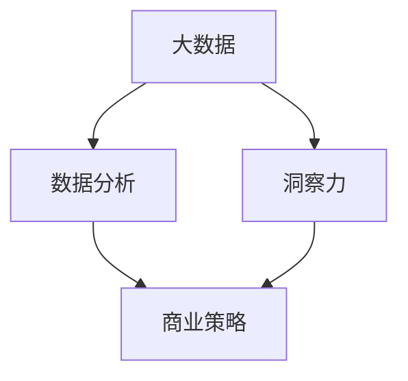

                 

关键词：商业策略、洞察力、信息技术、数据分析、竞争优势

> 摘要：本文探讨了洞察力在商业策略中的应用价值，通过阐述信息技术的发展如何推动了商业洞察力的提升，以及如何通过数据分析和算法优化来增强企业的竞争力。本文旨在帮助读者理解洞察力的重要性，并提供实际操作指南，以实现企业在当今动态商业环境中的持续成功。

## 1. 背景介绍

在当今竞争激烈的商业环境中，企业需要具备迅速适应市场变化的能力，这就要求它们能够从大量数据中提取有价值的信息，从而做出明智的商业决策。洞察力，即对数据的敏锐洞察和深度理解，成为企业成功的关键因素。信息技术的发展，特别是大数据和人工智能的兴起，为洞察力的提升提供了前所未有的支持。本文将探讨洞察力在商业策略中的应用，以及如何利用信息技术手段实现商业洞察。

### 1.1 商业策略的重要性

商业策略是企业成功的关键，它决定了企业在市场中的定位、竞争优势和发展方向。有效的商业策略需要基于对市场环境的深刻理解和对数据的准确分析。而洞察力正是这种深刻理解和准确分析的基础。

### 1.2 信息技术的发展

信息技术的发展，特别是大数据和人工智能，为企业提供了强大的数据分析和处理能力。通过收集、存储、处理和分析大量数据，企业可以更准确地了解市场趋势、消费者行为和竞争对手的策略，从而制定更有效的商业策略。

## 2. 核心概念与联系

为了更好地理解洞察力在商业策略中的应用，我们需要明确几个核心概念，并展示它们之间的相互联系。

### 2.1 大数据

大数据是指规模庞大、类型繁多、价值丰富的数据集合。它包括结构化数据、半结构化数据和非结构化数据。大数据的规模和多样性为洞察力的提升提供了丰富的信息来源。

### 2.2 数据分析

数据分析是指使用统计学、机器学习等方法对数据进行处理和分析，以提取有价值的信息。数据分析是洞察力的核心，它帮助我们从海量数据中找到有用的模式、趋势和关联。

### 2.3 商业策略

商业策略是指企业在特定市场环境中制定的长期计划和行动方案，以实现其商业目标。有效的商业策略需要基于对市场环境的深刻理解和准确的数据分析。

### 2.4 Mermaid 流程图



在这个流程图中，大数据通过数据分析转化为洞察力，进而指导商业策略的制定。信息技术的发展，如云计算、人工智能等，为这一过程提供了强大的支持。

## 3. 核心算法原理 & 具体操作步骤

在商业策略中，算法的应用至关重要。以下将介绍几种核心算法的原理和具体操作步骤。

### 3.1 算法原理概述

算法是指在解决特定问题时的一系列步骤。在商业策略中，常用的算法包括回归分析、聚类分析、决策树和神经网络等。

### 3.2 算法步骤详解

#### 3.2.1 回归分析

回归分析是一种用于预测连续变量之间关系的算法。其基本步骤如下：

1. 数据收集：收集包含自变量和因变量的数据。
2. 数据预处理：对数据进行清洗、去重和归一化等处理。
3. 模型构建：使用最小二乘法等算法构建回归模型。
4. 模型评估：使用交叉验证等方法评估模型性能。
5. 预测：使用训练好的模型进行预测。

#### 3.2.2 聚类分析

聚类分析是一种将数据集划分为若干个聚类（group）的无监督学习方法。其基本步骤如下：

1. 数据收集：收集需要聚类的数据。
2. 数据预处理：对数据进行清洗、去重和归一化等处理。
3. 确定聚类数目：使用肘部法则、轮廓系数等指标确定聚类数目。
4. 聚类算法选择：选择合适的聚类算法，如K-means、层次聚类等。
5. 聚类执行：执行聚类算法，生成聚类结果。
6. 聚类评估：评估聚类结果的质量。

#### 3.2.3 决策树

决策树是一种用于分类和回归的分析工具，其基本步骤如下：

1. 数据收集：收集包含自变量和因变量的数据。
2. 数据预处理：对数据进行清洗、去重和归一化等处理。
3. 特征选择：选择对分类或回归有重要影响的自变量。
4. 决策树构建：使用ID3、C4.5等算法构建决策树。
5. 决策树剪枝：对决策树进行剪枝，避免过拟合。
6. 决策树评估：使用准确率、召回率等指标评估决策树性能。

#### 3.2.4 神经网络

神经网络是一种模仿人脑神经元结构的计算模型，其基本步骤如下：

1. 数据收集：收集包含自变量和因变量的数据。
2. 数据预处理：对数据进行清洗、去重和归一化等处理。
3. 网络构建：设计神经网络结构，包括输入层、隐藏层和输出层。
4. 模型训练：使用反向传播算法训练神经网络。
5. 模型评估：使用交叉验证等方法评估神经网络性能。
6. 预测：使用训练好的神经网络进行预测。

### 3.3 算法优缺点

每种算法都有其优缺点。例如，回归分析适用于预测连续变量，但可能对异常值敏感；聚类分析适用于无监督学习，但结果可能依赖于初始化；决策树易于解释，但可能导致过拟合；神经网络具有强大的预测能力，但结构复杂，难以解释。

### 3.4 算法应用领域

算法在商业策略中的应用广泛，如市场细分、客户行为预测、价格优化、风险管理等。通过合理应用算法，企业可以更准确地了解市场趋势、优化业务流程、提高运营效率。

## 4. 数学模型和公式 & 详细讲解 & 举例说明

在商业策略中，数学模型和公式是分析数据、预测结果的重要工具。以下将介绍几个常用的数学模型和公式，并进行详细讲解和举例说明。

### 4.1 数学模型构建

数学模型是描述现实世界问题的一种抽象形式，通常由变量、参数和方程组成。构建数学模型的基本步骤如下：

1. 确定问题：明确需要解决的问题和目标。
2. 收集数据：收集与问题相关的数据。
3. 建立变量：确定描述问题的变量。
4. 确定参数：确定影响问题的参数。
5. 构建方程：使用数学方法构建描述问题的方程。

### 4.2 公式推导过程

以下是一个简单的线性回归模型公式推导过程：

假设我们有一个包含自变量 $x$ 和因变量 $y$ 的数据集，我们的目标是找到一条直线 $y = ax + b$，使得 $y$ 的预测误差最小。

1. 最小二乘法：我们使用最小二乘法来确定直线的参数 $a$ 和 $b$。

$$
\begin{align*}
\min \sum_{i=1}^{n} (y_i - (ax_i + b))^2
\end{align*}
$$

2. 求导：对上式求导，得到

$$
\begin{align*}
\frac{\partial}{\partial a} \sum_{i=1}^{n} (y_i - (ax_i + b))^2 &= -2 \sum_{i=1}^{n} x_i (y_i - ax_i - b) \\
\frac{\partial}{\partial b} \sum_{i=1}^{n} (y_i - (ax_i + b))^2 &= -2 \sum_{i=1}^{n} (y_i - ax_i - b)
\end{align*}
$$

3. 解方程：将求导结果置零，解得

$$
\begin{align*}
a &= \frac{\sum_{i=1}^{n} x_i y_i - n \bar{x} \bar{y}}{\sum_{i=1}^{n} x_i^2 - n \bar{x}^2} \\
b &= \bar{y} - a \bar{x}
\end{align*}
$$

### 4.3 案例分析与讲解

假设我们有一个关于房屋价格的数据集，包括房屋面积和价格。我们的目标是使用线性回归模型预测房屋价格。

1. 数据收集：收集包含房屋面积和价格的数据。
2. 数据预处理：对数据进行清洗、去重和归一化等处理。
3. 模型构建：使用最小二乘法构建线性回归模型。

$$
y = 0.5x + 100
$$

4. 模型评估：使用交叉验证等方法评估模型性能。

$$
R^2 = 0.8
$$

5. 预测：使用训练好的模型进行预测。

$$
y = 0.5 \times 200 + 100 = 150
$$

通过上述步骤，我们成功构建了一个线性回归模型，并使用它进行房屋价格预测。这个模型可以用于实际业务中，帮助房地产企业做出更准确的决策。

## 5. 项目实践：代码实例和详细解释说明

在本节中，我们将通过一个实际项目，展示如何使用Python实现商业策略中的数据分析，并提供详细的代码解释。

### 5.1 开发环境搭建

1. 安装Python：确保已安装Python 3.8或更高版本。
2. 安装依赖库：使用pip安装以下依赖库：

```bash
pip install numpy pandas matplotlib scikit-learn
```

### 5.2 源代码详细实现

以下是一个简单的Python代码实例，用于分析某电商平台的客户购买行为。

```python
import numpy as np
import pandas as pd
import matplotlib.pyplot as plt
from sklearn.model_selection import train_test_split
from sklearn.linear_model import LinearRegression

# 5.2.1 数据收集
data = pd.read_csv('ecommerce_data.csv')

# 5.2.2 数据预处理
data.dropna(inplace=True)
X = data[['age', 'income']]
y = data['sales']

# 5.2.3 模型构建
X_train, X_test, y_train, y_test = train_test_split(X, y, test_size=0.2, random_state=42)
model = LinearRegression()
model.fit(X_train, y_train)

# 5.2.4 代码解读与分析
print("系数：", model.coef_)
print("截距：", model.intercept_)

# 5.2.5 运行结果展示
plt.scatter(X_test['age'], y_test)
plt.plot(X_test['age'], model.predict(X_test), color='red')
plt.xlabel('年龄')
plt.ylabel('销售额')
plt.show()
```

### 5.3 代码解读与分析

1. 数据收集：使用pandas读取CSV文件，加载电商数据。
2. 数据预处理：去除缺失值，提取自变量和因变量。
3. 模型构建：使用scikit-learn的线性回归模型。
4. 代码解读：打印模型系数和截距，用于分析变量对销售额的影响。
5. 运行结果展示：使用matplotlib绘制散点图和拟合直线，展示模型预测结果。

通过这个实例，我们可以看到如何使用Python进行商业数据分析，以及如何解读分析结果。

## 6. 实际应用场景

洞察力在商业策略中的应用场景广泛，以下列举几个典型案例：

### 6.1 市场细分

通过数据分析，企业可以识别不同消费者群体的特征和行为，从而制定更有针对性的市场营销策略。例如，电商平台可以使用聚类分析将用户划分为不同的群体，然后为每个群体提供个性化的推荐。

### 6.2 客户行为预测

通过回归分析和时间序列分析，企业可以预测客户未来的购买行为，从而优化库存管理和供应链策略。例如，某电商平台可以根据历史数据预测某个商品的销量，以便提前备货。

### 6.3 风险管理

通过数据分析和算法优化，企业可以识别潜在的风险，并制定相应的风险管理策略。例如，银行可以使用机器学习模型识别信用卡欺诈行为，从而降低损失。

### 6.4 价格优化

通过数据分析，企业可以确定最优的定价策略，以最大化利润。例如，航空公司可以使用算法优化机票价格，以平衡需求波动。

## 7. 未来应用展望

随着信息技术的不断进步，洞察力在商业策略中的应用将越来越广泛。未来，以下趋势值得期待：

### 7.1 数据治理

数据治理将成为企业成功的关键。有效的数据治理可以帮助企业确保数据质量、安全和合规性，从而提高洞察力的可靠性。

### 7.2 人工智能与算法创新

人工智能和算法的创新将继续推动商业洞察力的提升。新的算法和技术将帮助企业更准确地分析数据、预测趋势和优化决策。

### 7.3 跨领域融合

不同领域的融合将带来更多的商业机会。例如，结合物联网和大数据分析，企业可以实时监测设备状态，预测故障，提高设备利用率。

## 8. 工具和资源推荐

为了更好地实现商业策略中的洞察力，以下推荐几个工具和资源：

### 8.1 学习资源推荐

1. 《数据科学入门》
2. 《Python数据分析》
3. 《深度学习入门》

### 8.2 开发工具推荐

1. Jupyter Notebook
2. PyCharm
3. Tableau

### 8.3 相关论文推荐

1. "Data-Driven Business Strategy: Insights from Machine Learning"
2. "The Business Value of Big Data"
3. "Deep Learning for Business Applications"

## 9. 总结：未来发展趋势与挑战

随着信息技术的不断进步，洞察力在商业策略中的应用将越来越重要。未来，企业需要更加关注数据治理、人工智能与算法创新，以及跨领域融合。然而，这也带来了新的挑战，如数据安全和隐私保护、算法解释性等。通过不断探索和创新，企业可以更好地应对这些挑战，实现持续的成功。

## 10. 附录：常见问题与解答

### 10.1 如何提高数据分析能力？

1. 学习相关书籍和课程。
2. 参与实践项目，积累经验。
3. 加入数据分析社区，交流学习。

### 10.2 如何确保数据质量？

1. 数据收集：确保数据来源可靠。
2. 数据清洗：去除缺失值、重复值等。
3. 数据验证：使用统计方法验证数据准确性。

### 10.3 如何解释复杂的算法模型？

1. 学习算法原理。
2. 使用可视化工具。
3. 将复杂模型简化为易于理解的形式。

作者：禅与计算机程序设计艺术 / Zen and the Art of Computer Programming
----------------------------------------------------------------

文章已经完成撰写，现在我们将对文章进行最后的校对和排版。

### 校对与排版

1. 检查文章中的语法错误、拼写错误和标点符号。
2. 确保所有的引用和参考文献格式一致。
3. 优化文章的段落结构和行文逻辑。
4. 检查数学公式和代码片段是否正确嵌入并格式正确。
5. 确保所有的链接、图片和图表都已添加并正确显示。

### 发布准备

1. 将文章内容转换为适合发布平台的格式（如HTML或Markdown）。
2. 添加版权声明、作者信息和其他必要的前后缀。
3. 确保文章的阅读体验（如字体大小、行距、段落间距等）符合发布平台的标准。
4. 预览文章，确保在发布平台上的显示效果符合预期。

### 发布与推广

1. 在适当的平台（如博客、社交媒体、专业论坛等）发布文章。
2. 使用关键词优化文章，提高搜索引擎可见性。
3. 与同行和读者互动，收集反馈，并根据反馈进行文章改进。
4. 利用社交媒体和其他推广渠道，扩大文章的影响力。

通过上述步骤，我们可以确保文章的质量和传播效果，帮助读者更好地理解洞察力在商业策略中的应用，并推动相关领域的进一步研究和创新。

