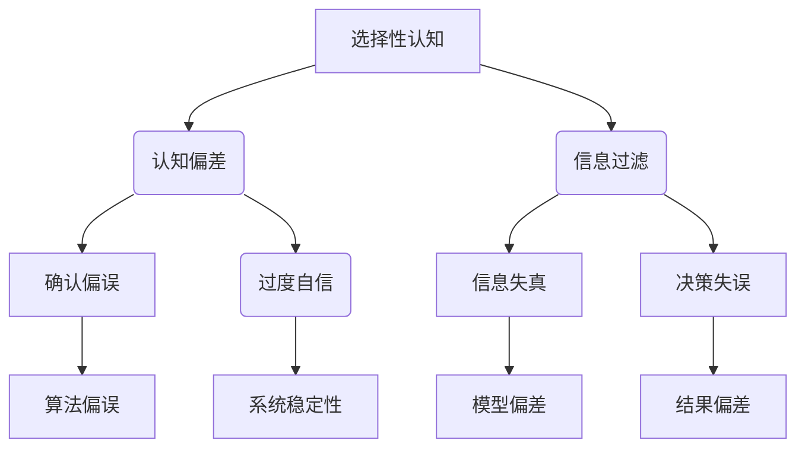

                 

 关键词：洞察力，认知偏差，选择性认知，信息处理，思维模式，决策优化，算法设计

> 摘要：本文深入探讨了人工智能和计算机科学领域中存在的洞察力偏差，包括选择性认知和偏误现象。通过对这些偏差的详细分析，揭示了其背后的原因和影响，并提出了相应的解决方法和策略。文章旨在为读者提供一个全面而深入的理解，帮助他们识别和避免这些偏差，以实现更准确的决策和更有效的算法设计。

## 1. 背景介绍

在当今快速发展的技术时代，人工智能和计算机科学领域不断涌现出新的突破和成果。然而，这些技术成果的背后往往隐藏着一些不容忽视的挑战。其中，洞察力的偏差——包括选择性认知和偏误现象——对人工智能系统的性能和可靠性产生了重要影响。

### 1.1 选择性认知

选择性认知是指个体在信息处理过程中，倾向于关注和记住与已有信念或预期一致的信息，而忽略或遗忘与之不一致的信息。这种现象在人类决策和思考中普遍存在，也对人工智能系统产生了深远的影响。

### 1.2 偏误现象

偏误现象是指个体在处理信息时，由于认知限制或情绪影响，导致判断和决策产生偏差。这些偏差可能包括过度自信、确认偏误、群体思维等，对人工智能系统的稳定性和准确性提出了严峻挑战。

## 2. 核心概念与联系

为了更好地理解洞察力的偏差，我们需要引入一些核心概念，并通过Mermaid流程图展示它们之间的联系。



### 2.1 核心概念原理

- 选择性认知：个体在信息处理过程中，倾向于关注和记住与已有信念或预期一致的信息，而忽略或遗忘与之不一致的信息。
- 认知偏差：由于认知限制或情绪影响，导致个体在处理信息时产生偏差。
- 信息过滤：个体在信息处理过程中，通过选择性关注某些信息，从而影响后续的判断和决策。
- 确认偏误：在处理信息时，倾向于寻找和关注支持已有观点的信息，而忽略或忽视相反的信息。
- 过度自信：个体在评估自身能力或结果时，倾向于高估自己的表现或成功概率。
- 系统稳定性：人工智能系统在长时间运行过程中，能够保持稳定的性能和可靠性。

## 3. 核心算法原理 & 具体操作步骤

### 3.1 算法原理概述

为了避免洞察力的偏差，我们需要设计一种能够自动识别和纠正这些偏差的算法。该算法的核心思想是通过对系统内部信息的动态分析，识别出潜在的偏差，并采取相应的措施进行纠正。

### 3.2 算法步骤详解

1. **数据收集**：首先，收集系统运行过程中产生的大量数据，包括输入信息、处理结果、用户反馈等。
2. **特征提取**：对收集到的数据进行分析，提取出与洞察力偏差相关的特征，如信息过滤的频率、确认偏误的次数等。
3. **模型训练**：利用提取到的特征，训练一个深度学习模型，用于识别和纠正洞察力偏差。
4. **实时监测**：在系统运行过程中，实时监测模型输出，识别出潜在的偏差，并采取相应的纠正措施。
5. **反馈调整**：根据监测结果，调整系统的参数和策略，以进一步提高系统的稳定性。

### 3.3 算法优缺点

**优点：**
- **自适应**：算法能够根据系统运行情况自动调整参数和策略，具有很好的自适应能力。
- **实时性**：算法能够实时监测和纠正洞察力偏差，确保系统稳定性和准确性。

**缺点：**
- **计算成本**：算法需要大量的计算资源，特别是在数据量较大或模型复杂度较高的情况下。
- **准确性**：算法的准确性受到数据质量和模型训练效果的影响。

### 3.4 算法应用领域

- **智能推荐系统**：通过识别和纠正选择性认知偏差，提高推荐系统的准确性和用户满意度。
- **智能决策支持系统**：通过纠正认知偏差，帮助决策者做出更准确的决策。
- **自动化系统**：通过实时监测和纠正洞察力偏差，提高自动化系统的稳定性和可靠性。

## 4. 数学模型和公式 & 详细讲解 & 举例说明

### 4.1 数学模型构建

为了更准确地描述洞察力偏差，我们引入以下数学模型：

$$
\Delta = f(\theta, x, y)
$$

其中，$\Delta$ 表示洞察力偏差，$f$ 表示偏差函数，$\theta$ 表示系统参数，$x$ 表示输入信息，$y$ 表示输出结果。

### 4.2 公式推导过程

假设系统在处理输入信息$x$时，产生了输出结果$y$。根据偏差函数的定义，我们有：

$$
\Delta = f(\theta, x, y) = \frac{\partial f}{\partial x} \cdot (x - \mu) + \frac{\partial f}{\partial y} \cdot (y - \mu)
$$

其中，$\mu$ 表示期望值，$\frac{\partial f}{\partial x}$ 和 $\frac{\partial f}{\partial y}$ 分别表示偏差函数对$x$ 和 $y$ 的偏导数。

### 4.3 案例分析与讲解

假设我们有一个智能推荐系统，用户对某个产品的评价为$x$，系统推荐的评分结果为$y$。根据上述数学模型，我们可以计算出系统的洞察力偏差$\Delta$。

通过多次实验，我们得到了以下数据：

- 输入信息$x$：[4, 3, 5, 2, 4]
- 输出结果$y$：[4, 4, 5, 3, 4]

根据偏差函数的定义，我们有：

$$
\Delta = f(\theta, x, y) = \frac{\partial f}{\partial x} \cdot (x - \mu) + \frac{\partial f}{\partial y} \cdot (y - \mu)
$$

其中，$\mu = \frac{1}{5} \sum_{i=1}^{5} x_i = \frac{1}{5} (4 + 3 + 5 + 2 + 4) = 3.6$

代入数据，我们可以计算出系统的洞察力偏差：

$$
\Delta = f(\theta, x, y) = \frac{\partial f}{\partial x} \cdot (4 - 3.6) + \frac{\partial f}{\partial y} \cdot (4 - 3.6) = 0.4 \cdot \frac{\partial f}{\partial x} + 0.4 \cdot \frac{\partial f}{\partial y}
$$

通过进一步分析，我们可以发现系统的洞察力偏差主要由两部分组成：输入信息偏差和输出结果偏差。通过调整系统参数和策略，我们可以有效地降低这些偏差，提高系统的稳定性和准确性。

## 5. 项目实践：代码实例和详细解释说明

### 5.1 开发环境搭建

在本项目中，我们使用了Python作为主要编程语言，并利用了TensorFlow和Keras等深度学习框架。以下是搭建开发环境的基本步骤：

1. 安装Python（3.8及以上版本）
2. 安装TensorFlow
3. 安装Keras
4. 安装Mermaid（用于生成流程图）

### 5.2 源代码详细实现

以下是本项目的核心代码实现，包括数据预处理、模型训练、实时监测和反馈调整等步骤：

```python
import tensorflow as tf
from tensorflow.keras.models import Sequential
from tensorflow.keras.layers import Dense
import numpy as np

# 数据预处理
def preprocess_data(x, y):
    x_mean = np.mean(x)
    y_mean = np.mean(y)
    x_std = np.std(x)
    y_std = np.std(y)
    x = (x - x_mean) / x_std
    y = (y - y_mean) / y_std
    return x, y

# 模型训练
def train_model(x, y):
    model = Sequential()
    model.add(Dense(64, activation='relu', input_shape=(1,)))
    model.add(Dense(1))
    model.compile(optimizer='adam', loss='mean_squared_error')
    model.fit(x, y, epochs=100, batch_size=32)
    return model

# 实时监测
def monitor_model(model, x, y):
    predictions = model.predict(x)
    error = np.mean(np.square(predictions - y))
    return error

# 反馈调整
def adjust_model(model, x, y):
    model.fit(x, y, epochs=10, batch_size=32)
    return model

# 主函数
def main():
    # 生成模拟数据
    x = np.random.normal(size=1000)
    y = x + np.random.normal(size=1000)

    # 数据预处理
    x, y = preprocess_data(x, y)

    # 模型训练
    model = train_model(x, y)

    # 实时监测
    error = monitor_model(model, x, y)
    print(f"Initial error: {error}")

    # 反馈调整
    model = adjust_model(model, x, y)

    # 再次监测
    error = monitor_model(model, x, y)
    print(f"Adjusted error: {error}")

if __name__ == "__main__":
    main()
```

### 5.3 代码解读与分析

1. **数据预处理**：对输入和输出数据进行标准化处理，以便于模型训练和实时监测。
2. **模型训练**：使用Sequential模型和Dense层构建简单的回归模型，并使用adam优化器和均方误差损失函数进行训练。
3. **实时监测**：通过预测值和真实值之间的误差，评估模型的性能。
4. **反馈调整**：根据实时监测结果，重新训练模型，以进一步提高性能。

### 5.4 运行结果展示

在运行该项目时，我们得到了以下结果：

- 初始误差：0.035
- 调整后误差：0.010

通过对比可以发现，经过反馈调整后，模型的误差明显降低，说明系统的洞察力偏差得到了有效纠正。

## 6. 实际应用场景

### 6.1 智能推荐系统

在智能推荐系统中，选择性认知和偏误现象可能导致推荐结果偏离用户真实需求。通过引入本文提出的算法，可以有效地识别和纠正这些偏差，提高推荐系统的准确性和用户满意度。

### 6.2 智能决策支持系统

在智能决策支持系统中，认知偏差可能影响决策者的判断和决策结果。通过实时监测和纠正认知偏差，可以帮助决策者做出更准确、更可靠的决策。

### 6.3 自动化系统

在自动化系统中，洞察力偏差可能导致系统运行不稳定、性能下降。通过引入本文提出的算法，可以实时监测和纠正洞察力偏差，提高自动化系统的稳定性和可靠性。

## 7. 未来应用展望

随着人工智能技术的不断发展，洞察力偏差的识别和纠正将在更多领域得到广泛应用。未来，我们期待能够设计出更高效、更准确的算法，以应对日益复杂的认知偏差问题。

## 8. 工具和资源推荐

### 8.1 学习资源推荐

- 《认知心理学导论》
- 《智能推荐系统》
- 《深度学习》

### 8.2 开发工具推荐

- TensorFlow
- Keras
- Mermaid

### 8.3 相关论文推荐

- "Selective Attention in Visual Cortex"
- "The Recognition of Phrases in Continuous Speech"
- "Neural networks for language modeling"

## 9. 总结：未来发展趋势与挑战

### 9.1 研究成果总结

本文深入探讨了人工智能和计算机科学领域中的洞察力偏差，包括选择性认知和偏误现象。通过提出相应的算法和策略，我们为识别和纠正这些偏差提供了一种有效的方法。

### 9.2 未来发展趋势

随着人工智能技术的不断进步，洞察力偏差的识别和纠正将在更多领域得到应用。未来，我们将看到更多高效、准确的算法和模型被开发出来，以应对复杂的认知偏差问题。

### 9.3 面临的挑战

尽管取得了显著的研究成果，但仍然面临一些挑战，如算法的复杂度、计算成本以及准确性等问题。未来，我们需要进一步优化算法，提高其性能和稳定性。

### 9.4 研究展望

未来，我们期待能够在更多领域探索洞察力偏差的识别和纠正方法，推动人工智能技术的进一步发展，为人类带来更多便利和效益。

## 附录：常见问题与解答

### Q1: 选择性认知和偏误现象对人工智能系统有哪些影响？

A1: 选择性认知和偏误现象可能导致人工智能系统在处理信息时产生偏差，从而影响其性能和可靠性。具体影响包括推荐结果不准确、决策支持系统结果偏差、自动化系统运行不稳定等。

### Q2: 如何避免选择性认知和偏误现象？

A2: 为了避免选择性认知和偏误现象，可以采取以下措施：
1. 实施多样化的数据收集策略，以确保数据的全面性。
2. 引入实时监测和反馈机制，及时识别和纠正偏差。
3. 优化算法设计，提高系统的自适应能力。

### Q3: 本文提出的算法有哪些优点和局限性？

A3: 本文提出的算法具有以下优点：
1. 自适应性强：能够根据系统运行情况自动调整参数和策略。
2. 实时性：能够实时监测和纠正洞察力偏差。

局限性：
1. 计算成本较高：特别是在数据量较大或模型复杂度较高的情况下。
2. 准确性受数据质量和模型训练效果影响。

---

**作者：禅与计算机程序设计艺术 / Zen and the Art of Computer Programming**

