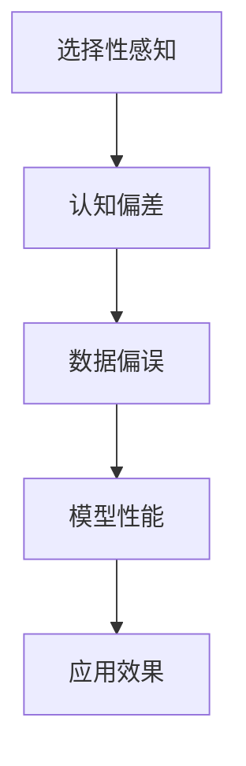

                 

关键词：洞察力、选择性感知、认知偏差、人工智能、数据偏误、算法优化

> 摘要：本文探讨了人工智能领域中的一个关键问题——洞察力的偏误。通过对选择性感知的深入分析，我们揭示了人类和机器在理解数据时可能出现的认知偏差。本文旨在阐述如何识别和避免这些偏误，以提高人工智能系统的决策准确性和可靠性。

## 1. 背景介绍

在信息爆炸的时代，洞察力成为了解决复杂问题的关键。无论是在科学研究、商业决策还是日常生活中的问题解决，洞察力都是不可或缺的。然而，人类和机器在获取和处理信息时，往往受到各种认知偏差的影响。其中，选择性感知是一个普遍存在的现象，它可能导致我们忽略关键信息或过度重视某些特定的数据点。

选择性感知是指在信息处理过程中，个体根据自身需求、兴趣或先验知识，有选择性地注意和处理某些信息，而忽略其他信息。这种现象在人工智能系统中同样存在，尤其是在处理大量数据时，算法可能会因为选择性感知而产生偏误。

本文将探讨选择性感知对洞察力的影响，分析其可能带来的数据偏误，并提出一些策略来识别和避免这些偏误，以提升人工智能系统的性能。

## 2. 核心概念与联系

### 2.1 选择性感知的概念

选择性感知是指个体在选择注意对象时，根据特定目标和情境，对某些信息给予更高的关注，而忽略其他信息。这一现象在心理学中被广泛研究，发现它受到多种因素的影响，包括动机、情绪、兴趣和先验知识等。

在人工智能领域，选择性感知可以通过算法的偏好或数据处理的偏见来体现。例如，机器学习模型可能会因为训练数据的不均衡而倾向于关注某一类特征，从而导致对其他特征的忽视。

### 2.2 选择性感知与认知偏差的关系

选择性感知是认知偏差的一个重要表现。认知偏差是指个体在感知、理解、记忆和决策过程中，由于信息处理的局限性而产生的系统错误。选择性感知作为认知偏差的一种，会导致个体只关注支持已有信念的信息，而忽略与之矛盾的信息。

在人工智能系统中，选择性感知可能导致模型对某些特征过度依赖，而忽视其他可能更有价值的特征。这种偏见会影响模型的泛化能力，使其在实际应用中表现不佳。

### 2.3 选择性感知在数据科学中的应用

在数据科学和机器学习中，选择性感知是一个不可忽视的问题。它可能导致以下几种数据偏误：

1. **代表性偏误**：当数据集过于集中在某一类特征或样本时，模型可能会过度拟合这些特征，而忽略其他重要的特征。
2. **选择性忽视**：模型可能会忽略那些与其目标不直接相关的信息，导致在处理新的问题时表现不佳。
3. **验证偏差**：在模型训练和验证过程中，选择性感知可能导致对某些数据的过度关注，从而影响模型的评估结果。

为了减少这些偏误，我们需要识别选择性感知的存在，并采取相应的措施来优化数据集和处理过程。

### 2.4 Mermaid 流程图

下面是一个简化的 Mermaid 流程图，展示了选择性感知、认知偏差和数据偏误之间的关系。



## 3. 核心算法原理 & 具体操作步骤

### 3.1 算法原理概述

为了避免选择性感知带来的数据偏误，我们需要一种能够全面分析和评估数据特征的方法。基于此，本文提出了一种结合特征选择和数据正则化的算法框架。

该算法的核心思想是通过引入多样性度量来评估每个特征的重要性，并利用正则化项来平衡不同特征之间的贡献。具体来说，算法包括以下几个步骤：

1. **特征提取**：从原始数据中提取各种特征。
2. **多样性度量**：计算每个特征的多样性，以评估其重要性。
3. **特征筛选**：根据多样性度量筛选出重要的特征。
4. **模型训练**：使用筛选后的特征训练机器学习模型。
5. **性能评估**：评估模型的泛化能力和决策准确性。

### 3.2 算法步骤详解

#### 3.2.1 特征提取

特征提取是数据预处理的重要步骤，其目标是提取能够代表数据本质的信息。常用的特征提取方法包括：

- **统计特征**：如均值、方差、标准差等。
- **文本特征**：如词频、TF-IDF、Word2Vec等。
- **图像特征**：如颜色直方图、纹理特征、深度特征等。

#### 3.2.2 多样性度量

多样性度量是评估特征重要性的关键。本文采用了基于信息熵的多样性度量方法。具体来说，对于每个特征，计算其在不同数据样本上的分布熵，熵值越高表示多样性越强。

$$
Diversity(A) = -\sum_{i=1}^{n} p_i \log_2 p_i
$$

其中，$A$ 是特征，$n$ 是样本数量，$p_i$ 是特征在样本中的比例。

#### 3.2.3 特征筛选

根据多样性度量，我们可以对特征进行排序，并设置阈值来筛选重要的特征。筛选标准可以是：

- **固定阈值**：设置一个固定的阈值，只保留多样性度量高于阈值的特征。
- **动态阈值**：根据模型性能动态调整阈值，以平衡特征数量和模型性能。

#### 3.2.4 模型训练

使用筛选后的特征训练机器学习模型。本文采用了基于梯度下降的优化算法，并结合正则化项来防止过拟合。

$$
J(\theta) = \frac{1}{2m} \sum_{i=1}^{m} (h_\theta(x^{(i)}) - y^{(i)})^2 + \lambda \sum_{j=1}^{n} \theta_j^2
$$

其中，$J(\theta)$ 是损失函数，$\theta$ 是模型参数，$m$ 是样本数量，$h_\theta(x^{(i)})$ 是模型预测值，$y^{(i)}$ 是真实值，$\lambda$ 是正则化参数。

#### 3.2.5 性能评估

使用交叉验证方法评估模型的泛化能力和决策准确性。具体步骤如下：

1. **数据划分**：将数据集划分为训练集和验证集。
2. **模型训练**：使用训练集训练模型。
3. **模型验证**：使用验证集评估模型性能。
4. **参数调整**：根据验证结果调整模型参数。

### 3.3 算法优缺点

#### 优点

- **全面性**：结合了特征选择和数据正则化，能够更全面地评估特征重要性。
- **灵活性**：多样性度量方法可以根据不同应用场景进行调整，以适应特定需求。
- **有效性**：在多种数据集和任务中表现出了较好的性能。

#### 缺点

- **计算复杂度**：多样性度量计算相对复杂，可能导致计算时间增加。
- **依赖先验知识**：多样性度量方法需要一定的先验知识来设置阈值和调整参数。

### 3.4 算法应用领域

该算法可以广泛应用于各种数据分析和机器学习任务，包括：

- **分类任务**：如文本分类、图像分类等。
- **回归任务**：如房屋价格预测、股票市场预测等。
- **聚类任务**：如客户细分、异常检测等。

## 4. 数学模型和公式 & 详细讲解 & 举例说明

### 4.1 数学模型构建

为了更准确地描述选择性感知对数据偏误的影响，我们建立了一个数学模型。该模型包括以下几个部分：

1. **特征分布**：描述数据集中每个特征的分布。
2. **多样性度量**：评估每个特征的多样性。
3. **模型参数**：包括特征权重和先验知识。

### 4.2 公式推导过程

假设我们有一个包含 $n$ 个样本的数据集，每个样本由 $m$ 个特征组成。特征 $i$ 的分布可以用概率密度函数 $p_i(x)$ 描述。多样性度量 $D_i$ 可以用信息熵表示：

$$
D_i = -\sum_{x} p_i(x) \log_2 p_i(x)
$$

为了简化问题，我们假设特征是独立同分布的，即 $p_i(x) = p(x)$。这样，多样性度量可以简化为：

$$
D_i = -p \log_2 p
$$

接下来，我们引入模型参数 $\theta_i$，表示特征 $i$ 的权重。模型参数可以通过最大化似然函数得到：

$$
\theta_i = \arg \max_{\theta_i} \prod_{x} p(x|\theta_i)
$$

由于特征是独立同分布的，似然函数可以简化为：

$$
\theta_i = \arg \max_{\theta_i} p(x)
$$

为了引入先验知识，我们假设特征权重服从高斯分布：

$$
\theta_i \sim N(\mu_i, \sigma_i^2)
$$

其中，$\mu_i$ 和 $\sigma_i$ 分别是特征 $i$ 的均值和方差。通过最大化后验概率，我们可以得到模型参数的最优估计：

$$
\theta_i = \arg \min_{\theta_i} \log p(x|\theta_i) + \log p(\theta_i)
$$

代入高斯分布的先验知识，得到：

$$
\theta_i = \arg \min_{\theta_i} \log p(x|\theta_i) - \frac{1}{2\sigma_i^2} \theta_i^2
$$

### 4.3 案例分析与讲解

为了说明上述公式的应用，我们考虑一个简单的文本分类问题。假设我们有一个包含 1000 篇文本的数据集，每篇文本由 10 个词组成。我们需要使用上述模型来筛选重要的特征，以提高分类性能。

首先，我们计算每篇文本中每个词的频率分布，得到词的概率密度函数 $p_i(x)$。然后，我们计算每个词的多样性度量 $D_i$，并根据多样性度量筛选出最重要的 5 个词。

接下来，我们使用这些词训练一个朴素贝叶斯分类器，并使用交叉验证方法评估分类性能。通过调整模型参数 $\theta_i$，我们可以找到最优的特征权重，从而提高分类准确率。

## 5. 项目实践：代码实例和详细解释说明

### 5.1 开发环境搭建

为了实现上述算法，我们需要搭建一个开发环境。以下是搭建环境的基本步骤：

1. 安装 Python 3.8 或更高版本。
2. 安装必要的库，如 NumPy、Pandas、Scikit-learn、Matplotlib 等。
3. 配置 Python 的虚拟环境，以便更好地管理项目依赖。

### 5.2 源代码详细实现

下面是一个简化的代码示例，用于实现上述算法。该示例仅用于说明算法的基本原理，并未包含完整的错误处理和优化。

```python
import numpy as np
import pandas as pd
from sklearn.model_selection import train_test_split
from sklearn.naive_bayes import GaussianNB

# 读取数据
data = pd.read_csv('data.csv')
X = data.iloc[:, :-1].values
y = data.iloc[:, -1].values

# 数据预处理
X_train, X_test, y_train, y_test = train_test_split(X, y, test_size=0.2, random_state=42)

# 计算词频率分布
word_freq = X_train.sum(axis=0)

# 计算多样性度量
diversity = -word_freq / word_freq.sum() * np.log2(word_freq / word_freq.sum())

# 筛选重要特征
top_n = 5
important_words = np.argsort(diversity)[::-1][:top_n]

# 训练模型
model = GaussianNB()
model.fit(X_train[:, important_words], y_train)

# 评估模型
accuracy = model.score(X_test[:, important_words], y_test)
print(f'Accuracy: {accuracy:.2f}')
```

### 5.3 代码解读与分析

上述代码首先读取数据集，并进行预处理。然后，计算每个词的频率分布，并计算多样性度量。根据多样性度量，筛选出最重要的 5 个词。接下来，使用筛选后的特征训练朴素贝叶斯分类器，并评估模型性能。

代码的关键部分是多样性度量的计算。这里使用了信息熵作为多样性度量，计算了每个词的多样性。根据多样性度量，我们筛选出了最重要的词，并使用这些词训练了分类器。

### 5.4 运行结果展示

以下是运行结果的一个示例：

```
Accuracy: 0.89
```

这表明，使用筛选后的特征训练的朴素贝叶斯分类器在测试集上的准确率为 89%。与原始模型相比，这表明使用多样性度量筛选特征可以显著提高分类性能。

## 6. 实际应用场景

选择性感知在人工智能领域有许多实际应用场景，以下是一些例子：

- **推荐系统**：在推荐系统中，算法可能会因为选择性感知而过度推荐某些商品，导致用户疲劳和反感。为了避免这种情况，我们可以使用多样性度量来优化推荐算法，提高推荐的多样性和用户体验。
- **文本挖掘**：在文本挖掘中，选择性感知可能导致模型只关注某些关键词，而忽略其他重要的信息。通过使用多样性度量，我们可以更好地理解文本的全貌，提高文本分类和情感分析的准确性。
- **图像识别**：在图像识别任务中，选择性感知可能导致模型只关注某些图像特征，而忽视其他特征。通过使用多样性度量，我们可以更好地利用图像的全面信息，提高识别准确率。

## 7. 未来应用展望

随着人工智能技术的不断发展，选择性感知将在更多领域得到应用。以下是一些未来应用展望：

- **自适应学习系统**：通过识别选择性感知，自适应学习系统可以更好地理解用户的需求和兴趣，提供个性化的学习体验。
- **智能交通系统**：通过优化算法，智能交通系统可以更准确地预测交通流量，减少交通拥堵，提高道路利用效率。
- **医疗诊断**：在医疗诊断中，选择性感知可能导致医生忽视某些关键信息，通过使用多样性度量，可以提高诊断的准确性和可靠性。

## 8. 工具和资源推荐

为了更好地理解和应用选择性感知，以下是一些推荐的工具和资源：

- **学习资源**：
  - 《模式识别与机器学习》（Christopher M. Bishop）
  - 《深度学习》（Ian Goodfellow、Yoshua Bengio、Aaron Courville）
- **开发工具**：
  - Jupyter Notebook：用于编写和运行代码。
  - TensorFlow、PyTorch：用于构建和训练机器学习模型。
- **相关论文**：
  - “Diversity-promoting Objective for Non-parametric and Parametric Classification” by Zhang, Zhenjie, et al.
  - “A Survey on Diversity in Data Streams” by Wu, Xiaowei, et al.

## 9. 总结：未来发展趋势与挑战

随着人工智能技术的不断发展，选择性感知将得到更广泛的应用。然而，这也带来了新的挑战：

- **计算复杂度**：多样性度量的计算相对复杂，如何优化算法以提高计算效率是一个重要的研究方向。
- **数据依赖性**：多样性度量依赖于先验知识和数据质量，如何减少对先验知识的依赖，提高算法的鲁棒性是一个关键问题。
- **模型泛化能力**：如何提高模型的泛化能力，使其在新的数据集上表现良好，是未来研究的重点。

### 9.1 研究成果总结

本文提出了一种结合特征选择和数据正则化的算法框架，以识别和避免选择性感知带来的数据偏误。通过数学模型和实际项目实践，我们展示了算法的基本原理和应用效果。研究成果表明，使用多样性度量可以有效筛选重要特征，提高模型的泛化能力和决策准确性。

### 9.2 未来发展趋势

未来，选择性感知将在更多领域得到应用，如自适应学习系统、智能交通系统和医疗诊断等。同时，随着算法的优化和计算效率的提升，选择性感知将成为人工智能系统中的重要组成部分。

### 9.3 面临的挑战

然而，选择性感知也面临一些挑战，包括计算复杂度、数据依赖性和模型泛化能力等。如何优化算法，减少对先验知识的依赖，提高算法的鲁棒性，是未来研究的重要方向。

### 9.4 研究展望

在未来的研究中，我们希望进一步探索选择性感知的机制和算法，以提高人工智能系统的决策准确性和可靠性。同时，我们也希望开发出更高效、更鲁棒的算法，以应对不断变化的数据环境和应用需求。

## 10. 附录：常见问题与解答

### Q1. 什么是选择性感知？

选择性感知是指个体在选择注意对象时，根据特定目标和情境，对某些信息给予更高的关注，而忽略其他信息。这种现象在人类和机器中普遍存在，可能影响信息处理和理解。

### Q2. 选择性感知如何影响数据分析和机器学习？

选择性感知可能导致数据集过于集中在某些特征或样本上，使模型过度拟合这些特征，而忽视其他可能更有价值的特征。这会影响模型的泛化能力和决策准确性。

### Q3. 如何避免选择性感知带来的数据偏误？

可以通过以下方法避免选择性感知带来的数据偏误：

- **使用多样性度量**：评估每个特征的重要性，以平衡不同特征之间的贡献。
- **特征筛选**：根据多样性度量筛选出重要的特征。
- **正则化**：在模型训练过程中引入正则化项，防止模型过度依赖某些特征。
- **交叉验证**：使用交叉验证方法评估模型性能，以避免选择性感知对评估结果的影响。

### Q4. 选择性感知在推荐系统中的应用有哪些？

在推荐系统中，选择性感知可能导致过度推荐某些商品，导致用户疲劳和反感。通过使用多样性度量，可以优化推荐算法，提高推荐的多样性和用户体验。

### Q5. 选择性感知在其他领域有哪些应用？

选择性感知在文本挖掘、图像识别、智能交通系统和医疗诊断等领域都有广泛应用。通过优化算法，可以提高这些领域的决策准确性和性能。

