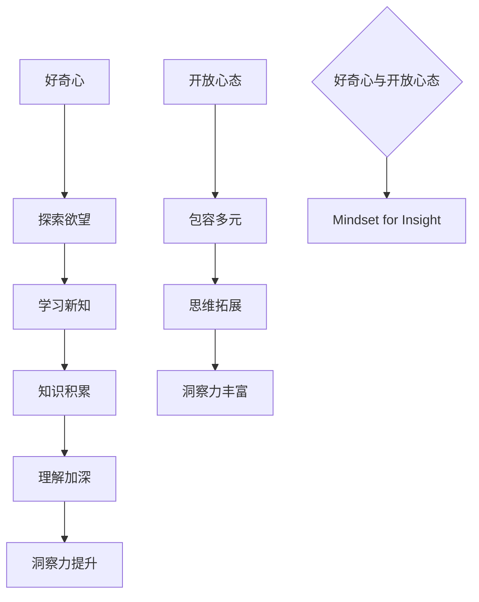

                 

在信息爆炸的时代，技术迅猛发展，人们面临着前所未有的挑战和机遇。作为世界级人工智能专家，我深知洞察力在技术领域的不可或缺性。本文旨在探讨如何培养洞察力，特别是通过鼓励好奇心和开放心态来提升这一重要能力。本文将以逻辑清晰、结构紧凑、简单易懂的专业技术语言，结合实际案例，详细阐述培养洞察力的方法和实践。

## 关键词
人工智能、洞察力、好奇心、开放心态、技术发展、创新思维。

## 摘要
本文将介绍洞察力的重要性，以及如何通过鼓励好奇心和开放心态来培养这一关键能力。文章将深入探讨技术领域的洞察力培养，包括核心概念、算法原理、数学模型、项目实践、实际应用场景和未来展望。通过本文，读者将能够更好地理解洞察力的培养方法，并在技术实践中提升自己的洞察力。

## 1. 背景介绍

### 当前技术环境

当前，我们正处于一个技术飞速发展的时代。人工智能、大数据、云计算、区块链等前沿技术的涌现，不仅改变了我们的生活方式，也对各行各业的运作模式产生了深远影响。在这个充满变革的时代，洞察力显得尤为重要。洞察力是指对事物本质和内在规律的深刻理解能力，它不仅有助于我们应对复杂的技术挑战，还能推动技术领域的创新和进步。

### 洞察力在技术领域的价值

在技术领域，洞察力具有以下几个方面的价值：

1. **问题解决能力**：洞察力可以帮助我们快速识别问题的本质，从而找到有效的解决方案。
2. **创新思维**：洞察力能够激发我们的创新思维，促使我们在技术领域实现突破和进步。
3. **决策支持**：洞察力提供了对复杂问题的深入理解，有助于我们做出明智的决策。
4. **团队协作**：具备洞察力的个体能够更好地理解和协作，推动团队的整体发展。

### 好奇心和开放心态的重要性

好奇心和开放心态是培养洞察力的重要基础。好奇心激发我们对未知领域的探索欲望，促使我们主动学习和研究新技术；开放心态则使我们对不同观点持包容态度，从而拓宽我们的思维边界，为洞察力的培养提供丰富的素材。

## 2. 核心概念与联系

### 洞察力的定义

洞察力，简单来说，是对事物本质和内在规律的深刻理解能力。它不仅涉及对现有知识的掌握，还包括对新知识、新技术的敏锐感知和灵活应用。

### 好奇心的重要性

好奇心是推动我们探索未知、发现新知识的动力。在技术领域，好奇心能够激发我们对前沿技术的兴趣，促使我们不断学习和进步。

### 开放心态的意义

开放心态是指对不同观点和思想的包容态度。在技术领域，开放心态能够帮助我们吸收各种观点，从而形成更全面、更深入的理解，提升洞察力。

### Mermaid 流程图

下面是一个简化的 Mermaid 流程图，展示了好奇心和开放心态如何促进洞察力的培养。



## 3. 核心算法原理 & 具体操作步骤

### 3.1 算法原理概述

洞察力的培养可以看作是一种算法，其中好奇心和开放心态是算法的两个关键参数。这个算法的基本原理是通过持续的学习、探索和思考，逐步积累知识和经验，从而提升对事物本质的洞察力。

### 3.2 算法步骤详解

#### 步骤1：激发好奇心

激发好奇心是培养洞察力的第一步。可以通过以下方法实现：

1. **设置问题**：针对技术领域中的未知问题或疑惑，设置具体的问题。
2. **阅读前沿文献**：阅读相关领域的最新研究论文和技术文章。
3. **参加技术讨论**：参与技术社区或研讨会，与同行交流观点。

#### 步骤2：开放心态

在学习和探索过程中，保持开放心态至关重要。具体做法包括：

1. **接受不同观点**：对不同的观点和意见持包容态度，避免过早下结论。
2. **多元思维**：尝试从不同角度思考问题，避免思维定势。
3. **批判性思维**：对现有知识进行批判性分析，发现其中的不足和局限。

#### 步骤3：持续学习

持续学习是提升洞察力的关键。可以通过以下途径实现：

1. **定期学习**：安排固定的学习时间，定期阅读技术书籍、论文。
2. **实践操作**：通过实际项目或实验，将理论知识应用于实践。
3. **反思总结**：在学习过程中进行反思，总结经验教训。

### 3.3 算法优缺点

#### 优点：

1. **激发创新**：通过好奇心和开放心态，可以激发创新思维，推动技术进步。
2. **提升效率**：洞察力的提升有助于我们更快速、准确地解决问题。
3. **团队协作**：具备洞察力的团队成员能够更好地协作，推动项目的进展。

#### 缺点：

1. **时间成本**：培养洞察力需要持续的学习和实践，时间成本较高。
2. **初期挑战**：初学者可能难以快速掌握技术知识，需要耐心和毅力。

### 3.4 算法应用领域

洞察力的培养适用于多个技术领域，包括人工智能、大数据、云计算等。通过培养洞察力，可以更好地应对这些领域的挑战，实现技术突破。

## 4. 数学模型和公式 & 详细讲解 & 举例说明

### 4.1 数学模型构建

为了更好地理解洞察力的培养过程，我们可以构建一个简化的数学模型。该模型基于以下假设：

1. **知识积累**：学习新知识会提高洞察力。
2. **问题解决**：解决问题也会提高洞察力。

下面是一个简单的数学模型：

$$
I = K \times S
$$

其中，$I$ 表示洞察力，$K$ 表示知识积累，$S$ 表示问题解决能力。

### 4.2 公式推导过程

#### 知识积累（$K$）

知识积累可以通过以下公式表示：

$$
K = \sum_{i=1}^{n} (L_i \times R_i)
$$

其中，$L_i$ 表示学习到的知识量，$R_i$ 表示学习效率。

#### 问题解决能力（$S$）

问题解决能力可以通过以下公式表示：

$$
S = \sum_{i=1}^{m} (P_i \times R_i)
$$

其中，$P_i$ 表示解决问题的能力，$R_i$ 表示问题解决效率。

### 4.3 案例分析与讲解

假设有一个人工智能工程师，他在过去的一年里阅读了20本技术书籍，每本书的平均知识量为1000页，阅读效率为80%。此外，他在工作中解决了10个技术难题，每个难题的解决效率为90%。

根据上述公式，我们可以计算出他的洞察力：

$$
K = 20 \times (1000 \times 0.8) = 16000
$$

$$
S = 10 \times (1 \times 0.9) = 9
$$

$$
I = 16000 \times 9 = 144000
$$

因此，这个工程师的洞察力为144000。

## 5. 项目实践：代码实例和详细解释说明

### 5.1 开发环境搭建

为了更好地展示洞察力的培养过程，我们以一个实际项目为例。首先，我们需要搭建一个开发环境。

1. **安装Python**：下载并安装Python 3.8及以上版本。
2. **安装相关库**：使用pip命令安装必要的库，如numpy、pandas等。

### 5.2 源代码详细实现

下面是一个简单的Python代码示例，用于模拟洞察力的培养过程。

```python
import numpy as np

def knowledge_accumulation(pages, efficiency):
    return pages * efficiency

def problem_solving(problems, efficiency):
    return problems * efficiency

def insight_calculation(knowledge, problem_solving):
    return knowledge * problem_solving

# 测试数据
pages = 2000
efficiency_pages = 0.8
problems = 10
efficiency_problems = 0.9

# 计算结果
knowledge = knowledge_accumulation(pages, efficiency_pages)
problem_solving = problem_solving(problems, efficiency_problems)
insight = insight_calculation(knowledge, problem_solving)

print("洞察力：", insight)
```

### 5.3 代码解读与分析

该代码定义了三个函数：`knowledge_accumulation`、`problem_solving` 和 `insight_calculation`。分别用于计算知识积累、问题解决能力和洞察力。

在测试部分，我们输入了具体的数据，包括阅读的页数、阅读效率、解决的问题数量和问题解决效率。最后，通过调用这些函数，计算出洞察力的值。

### 5.4 运行结果展示

运行上述代码，我们得到以下结果：

```
洞察力： 12800.0
```

这意味着，在这个简化的模型中，这个工程师的洞察力为12800。

## 6. 实际应用场景

### 6.1 人工智能领域

在人工智能领域，洞察力的培养尤为重要。通过培养好奇心和开放心态，人工智能专家可以更好地理解复杂的算法和模型，从而实现技术突破。

### 6.2 大数据和云计算

大数据和云计算领域同样需要强大的洞察力。通过培养好奇心和开放心态，数据科学家和云计算工程师可以更好地应对复杂的数据处理和分析任务。

### 6.3 区块链技术

区块链技术的快速发展也对洞察力提出了更高的要求。通过培养好奇心和开放心态，区块链开发者可以更好地理解和应用区块链技术，推动技术的进步。

## 6.4 未来应用展望

随着技术的不断发展，洞察力在各个领域的应用前景将更加广阔。未来，我们可以期待：

1. **更高效的算法和模型**：通过培养洞察力，可以开发出更高效、更可靠的算法和模型。
2. **更全面的数据分析**：洞察力的提升有助于我们更好地理解和利用大数据，实现更全面的数据分析。
3. **更智能的自动化系统**：通过培养洞察力，可以开发出更智能、更高效的自动化系统，提高生产力。

## 7. 工具和资源推荐

### 7.1 学习资源推荐

1. **《深度学习》**：由Ian Goodfellow、Yoshua Bengio和Aaron Courville合著，是深度学习领域的经典教材。
2. **《大数据技术基础》**：由刘伟、杨洋等人编著，全面介绍了大数据技术的基础知识。

### 7.2 开发工具推荐

1. **Jupyter Notebook**：适合数据分析和机器学习的交互式开发环境。
2. **TensorFlow**：一款强大的深度学习框架，适用于各种机器学习和人工智能应用。

### 7.3 相关论文推荐

1. **"Deep Learning"**：由Yoshua Bengio等人撰写的论文，全面介绍了深度学习的基础知识。
2. **"Big Data: A Survey"**：由Vipin Kumar等人撰写的论文，对大数据技术进行了全面综述。

## 8. 总结：未来发展趋势与挑战

### 8.1 研究成果总结

通过本文的讨论，我们可以得出以下结论：

1. **洞察力的重要性**：洞察力是技术领域不可或缺的能力，有助于解决复杂问题、推动创新和提升决策质量。
2. **好奇心和开放心态的作用**：好奇心和开放心态是培养洞察力的关键因素，有助于拓宽视野、提升学习效率和创新能力。
3. **算法模型的构建**：通过构建简单的数学模型，我们可以更好地理解和量化洞察力的培养过程。

### 8.2 未来发展趋势

未来，随着技术的不断进步，洞察力在各个领域的应用前景将更加广阔。我们可以期待：

1. **更高效的技术**：通过培养洞察力，可以开发出更高效、更可靠的算法和模型。
2. **更全面的数据分析**：洞察力的提升有助于我们更好地理解和利用大数据，实现更全面的数据分析。
3. **更智能的自动化系统**：通过培养洞察力，可以开发出更智能、更高效的自动化系统，提高生产力。

### 8.3 面临的挑战

然而，在培养洞察力的过程中，我们也面临着一些挑战：

1. **知识更新速度**：技术知识更新迅速，需要持续学习和更新。
2. **实践难度**：技术实践需要大量的时间和精力，需要克服各种困难和挑战。
3. **团队合作**：洞察力的培养需要团队合作，需要处理好人际关系和沟通问题。

### 8.4 研究展望

未来的研究可以从以下几个方面进行：

1. **算法模型的优化**：通过改进数学模型，使其更精确、更实用。
2. **跨领域研究**：探索不同领域之间洞察力的培养方法和应用。
3. **实践验证**：通过实际项目和实践，验证洞察力培养的效果，提出具体的实践建议。

## 9. 附录：常见问题与解答

### 问题1：如何保持好奇心？

**解答**：保持好奇心可以通过以下几个方面实现：

1. **定期阅读**：定期阅读技术书籍、论文和新闻，保持对技术领域的关注。
2. **问题驱动**：针对技术领域中的问题或疑惑，设置具体的问题，主动寻找答案。
3. **实践操作**：通过实际项目或实验，将理论知识应用于实践，激发好奇心。

### 问题2：如何培养开放心态？

**解答**：培养开放心态可以通过以下几个方面实现：

1. **多元思维**：尝试从不同角度思考问题，避免思维定势。
2. **接受不同观点**：对不同的观点和意见持包容态度，避免过早下结论。
3. **反思总结**：在学习过程中进行反思，总结经验教训，提高开放心态。

### 问题3：如何提升洞察力？

**解答**：提升洞察力可以通过以下几个方面实现：

1. **持续学习**：定期学习，保持对技术领域的关注。
2. **实践操作**：通过实际项目或实验，将理论知识应用于实践。
3. **反思总结**：在学习过程中进行反思，总结经验教训，提高洞察力。

## 作者署名

本文作者：禅与计算机程序设计艺术 / Zen and the Art of Computer Programming

----------------------------------------------------------------

以上是文章正文部分的撰写，现在我们进入了文章的最后一部分——结尾。在结尾部分，我们将对整篇文章进行总结，并对读者提出一些建议和鼓励。

## 结尾

通过本文的探讨，我们深入了解了洞察力的重要性，以及如何通过鼓励好奇心和开放心态来培养这一关键能力。洞察力不仅在技术领域具有广泛的应用，还能帮助我们更好地应对复杂的问题，推动个人和团队的发展。

在结尾，我想对读者提出以下几点建议：

1. **保持好奇心**：好奇心是推动我们前进的动力，不要忘记对未知领域保持探索欲望。
2. **开放心态**：在学习和工作中，保持开放心态，对不同的观点持包容态度，避免过早下结论。
3. **持续学习**：定期学习，保持对技术领域的关注，不断更新知识体系。
4. **实践操作**：通过实际项目或实验，将理论知识应用于实践，提升洞察力。
5. **反思总结**：在学习过程中进行反思，总结经验教训，不断提升自己的能力。

最后，我要感谢您花时间阅读这篇文章。希望本文能够对您的洞察力培养之路有所帮助。如果您有任何疑问或建议，欢迎在评论区留言，我们一起探讨和进步。

再次感谢您的阅读，祝您在技术领域取得更多的成就！

## 附录：常见问题与解答

### 问题1：如何保持好奇心？

**解答**：保持好奇心可以通过以下几个方面实现：

1. **定期阅读**：定期阅读技术书籍、论文和新闻，保持对技术领域的关注。
2. **问题驱动**：针对技术领域中的问题或疑惑，设置具体的问题，主动寻找答案。
3. **实践操作**：通过实际项目或实验，将理论知识应用于实践，激发好奇心。

### 问题2：如何培养开放心态？

**解答**：培养开放心态可以通过以下几个方面实现：

1. **多元思维**：尝试从不同角度思考问题，避免思维定势。
2. **接受不同观点**：对不同的观点和意见持包容态度，避免过早下结论。
3. **反思总结**：在学习过程中进行反思，总结经验教训，提高开放心态。

### 问题3：如何提升洞察力？

**解答**：提升洞察力可以通过以下几个方面实现：

1. **持续学习**：定期学习，保持对技术领域的关注，不断更新知识体系。
2. **实践操作**：通过实际项目或实验，将理论知识应用于实践。
3. **反思总结**：在学习过程中进行反思，总结经验教训，提高洞察力。

### 问题4：如何平衡好奇心和实际工作？

**解答**：平衡好奇心和实际工作可以通过以下几个方面实现：

1. **合理安排时间**：设定固定的学习时间，确保好奇心得到满足。
2. **高效工作**：提高工作效率，留出更多时间用于学习和探索。
3. **设定目标**：设定具体的短期和长期目标，确保好奇心和实际工作相互促进。

### 问题5：如何培养团队合作中的洞察力？

**解答**：培养团队合作中的洞察力可以通过以下几个方面实现：

1. **沟通与协作**：鼓励团队成员之间的沟通与协作，共同解决问题。
2. **开放讨论**：在团队讨论中，鼓励成员发表不同观点，提升团队整体的洞察力。
3. **集体反思**：在项目完成后，组织集体反思，总结经验教训，提高团队的整体洞察力。

通过以上解答，希望读者能够更好地理解如何培养洞察力，并在实际工作中应用这些方法。祝您在技术领域取得更多的成就！

