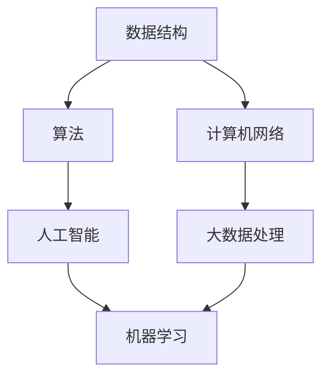
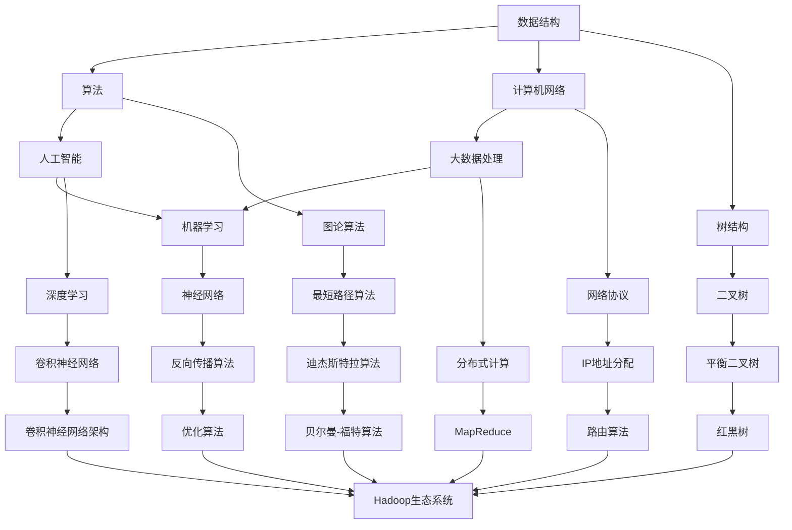

                 

关键词：理解、深度、表面现象、本质规律、洞察、技术语言、专业、IT领域、算法、数学模型、项目实践、实际应用场景、工具和资源推荐、未来发展趋势与挑战

> 摘要：本文旨在探讨如何通过深入理解和洞察技术领域的表面现象，揭示隐藏在其背后的本质规律。通过对核心概念、算法原理、数学模型、项目实践和实际应用场景的详细分析，本文将帮助读者提升对技术领域的理解和认知，为未来的学习和研究提供有价值的参考。

## 1. 背景介绍

在快速发展的技术时代，理解和洞察技术领域的表面现象和本质规律变得越来越重要。表面现象往往只是技术发展的冰山一角，而隐藏在其背后的本质规律则是推动技术进步的关键动力。对于专业人士来说，深入理解技术领域不仅有助于提高工作效率，还能够开拓创新思维，引领技术潮流。

本文将围绕以下核心内容展开：

1. **核心概念与联系**：介绍技术领域中的核心概念，并通过Mermaid流程图展示其相互关系。
2. **核心算法原理 & 具体操作步骤**：详细解析核心算法的原理和操作步骤，分析其优缺点和应用领域。
3. **数学模型和公式**：构建数学模型，推导关键公式，并通过案例进行分析。
4. **项目实践**：提供实际项目中的代码实例，详细解释说明。
5. **实际应用场景**：探讨技术在不同领域的应用，预测未来发展趋势。
6. **工具和资源推荐**：推荐学习资源、开发工具和相关论文。
7. **总结**：总结研究成果，展望未来发展趋势与挑战。

### 1.1 技术发展现状

随着信息技术的飞速发展，技术领域不断涌现出新的概念、算法和应用场景。从人工智能、大数据到区块链，每一个新技术的出现都在改变我们的生活方式和商业运营模式。然而，在这些表面繁荣的背后，隐藏着更为深刻的本质规律。理解这些规律，有助于我们更好地应对技术挑战，推动技术进步。

### 1.2 研究意义

深入理解技术领域的表面现象和本质规律具有重要的研究意义。首先，它有助于我们更好地掌握技术发展的脉络，把握未来技术趋势。其次，它能够激发创新思维，促进技术的跨领域应用。最后，它为专业人士提供了一套系统化的思维方法，帮助他们从复杂的表面现象中提取核心价值。

### 1.3 研究方法

本文采用多角度、多层次的研究方法，结合理论分析和实践验证，对技术领域的表面现象和本质规律进行深入探讨。通过梳理核心概念、分析算法原理、构建数学模型和提供项目实践，本文力求为读者提供全面、系统的认知框架。

## 2. 核心概念与联系

在技术领域，核心概念是理解本质规律的基础。以下是一些重要的核心概念，并通过Mermaid流程图展示它们之间的相互关系。

### 2.1 Mermaid 流程图



### 2.2 核心概念解析

1. **数据结构**：数据结构是组织和存储数据的方式，对于算法的性能和效率具有重要影响。
2. **算法**：算法是解决问题的步骤和方法，是实现技术功能的核心。
3. **计算机网络**：计算机网络是实现数据传输和信息共享的基础设施。
4. **人工智能**：人工智能是通过模拟人类智能实现自动化的技术。
5. **大数据处理**：大数据处理是应对大规模数据分析和应用的技术手段。
6. **机器学习**：机器学习是人工智能的一个分支，通过数据训练实现自动化决策。

这些核心概念相互联系，共同构成了技术领域的基础。理解它们之间的关系，有助于我们深入洞察技术发展的本质规律。

### 2.3 Mermaid 流程图（详细版）



### 2.4 核心概念解析（详细版）

1. **数据结构**：数据结构包括数组、链表、栈、队列、树、图等。每种数据结构都有其独特的特点和适用场景，对于算法的性能和效率具有重要影响。
2. **算法**：算法分为搜索算法、排序算法、图算法、动态规划等。每种算法都有其特定的应用场景和优缺点，是解决技术问题的核心。
3. **计算机网络**：计算机网络包括物理层、数据链路层、网络层、传输层、应用层。网络协议如TCP/IP、HTTP、FTP等，是实现数据传输和信息共享的基础。
4. **人工智能**：人工智能包括机器学习、深度学习、自然语言处理、计算机视觉等。人工智能的核心是通过模拟人类智能实现自动化。
5. **大数据处理**：大数据处理包括数据采集、数据存储、数据清洗、数据挖掘等。大数据处理技术能够应对大规模数据分析和应用。
6. **机器学习**：机器学习是通过数据训练实现自动化决策的技术。机器学习算法包括监督学习、无监督学习、强化学习等。
7. **图论算法**：图论算法包括最短路径算法、最小生成树算法、匹配算法等。图论算法在计算机网络和人工智能领域有广泛应用。
8. **树结构**：树结构包括二叉树、平衡二叉树、红黑树等。树结构在算法和数据结构中具有重要作用。
9. **网络协议**：网络协议包括IP地址分配、路由算法、TCP/IP协议等。网络协议是实现数据传输和信息共享的关键。
10. **深度学习**：深度学习包括卷积神经网络、递归神经网络、生成对抗网络等。深度学习在计算机视觉、自然语言处理等领域有广泛应用。
11. **分布式计算**：分布式计算包括MapReduce、Hadoop生态系统、分布式数据库等。分布式计算技术能够应对大规模数据处理。
12. **神经网络**：神经网络包括多层感知机、卷积神经网络、递归神经网络等。神经网络是深度学习的基础。
13. **优化算法**：优化算法包括遗传算法、粒子群算法、模拟退火算法等。优化算法在机器学习和人工智能领域有广泛应用。
14. **最短路径算法**：最短路径算法包括迪杰斯特拉算法、贝尔曼-福特算法、A*算法等。最短路径算法在计算机网络和图算法中广泛应用。
15. **二叉树**：二叉树包括二叉搜索树、平衡二叉树、红黑树等。二叉树在算法和数据结构中广泛应用。
16. **IP地址分配**：IP地址分配包括IPv4、IPv6等。IP地址分配是实现网络通信的关键。
17. **路由算法**：路由算法包括最短路径路由、距离矢量路由、链路状态路由等。路由算法是实现网络通信的关键。
18. **卷积神经网络架构**：卷积神经网络架构包括卷积层、池化层、全连接层等。卷积神经网络架构是深度学习的基础。
19. **Hadoop生态系统**：Hadoop生态系统包括HDFS、MapReduce、Hive、HBase等。Hadoop生态系统是分布式计算的基础。
20. **反向传播算法**：反向传播算法是深度学习训练的核心算法。

这些核心概念相互联系，共同构成了技术领域的基础。理解它们之间的关系，有助于我们深入洞察技术发展的本质规律。

## 3. 核心算法原理 & 具体操作步骤

在技术领域，核心算法是解决问题的核心。以下将介绍几个核心算法的原理和具体操作步骤，并分析其优缺点和应用领域。

### 3.1 算法原理概述

1. **搜索算法**：搜索算法包括广度优先搜索（BFS）和深度优先搜索（DFS）。BFS以广度优先遍历图或树，DFS以深度优先遍历图或树。搜索算法主要用于路径搜索、拓扑排序等问题。

2. **排序算法**：排序算法包括快速排序（QS）、归并排序（MS）、堆排序（HS）等。排序算法主要用于数据排序、数据结构构建等问题。

3. **图算法**：图算法包括最短路径算法（SPA）、最小生成树算法（MST）、匹配算法（MA）等。图算法主要用于网络分析、社交网络分析等问题。

4. **动态规划**：动态规划（DP）是一种解决最优子结构问题的算法。动态规划通过递推关系求解子问题的最优解，最终得到整体问题的最优解。动态规划广泛应用于路径规划、资源分配等问题。

5. **机器学习算法**：机器学习算法包括监督学习（SL）、无监督学习（USL）、强化学习（RL）等。机器学习算法通过数据训练实现自动化决策，广泛应用于图像识别、自然语言处理、推荐系统等问题。

### 3.2 算法步骤详解

1. **搜索算法步骤详解**：

- **BFS**：

    ```bash
    function BFS(graph, start):
        queue = new Queue()
        visited = new Set()
        queue.enqueue(start)
        while not queue.isEmpty():
            node = queue.dequeue()
            if node not in visited:
                visited.add(node)
                for neighbor in graph[node]:
                    if neighbor not in visited:
                        queue.enqueue(neighbor)
    ```

- **DFS**：

    ```python
    def DFS(graph, start, visited):
        visited.add(start)
        for neighbor in graph[start]:
            if neighbor not in visited:
                DFS(graph, neighbor, visited)
    ```

2. **排序算法步骤详解**：

- **QS**：

    ```c
    function quicksort(arr, low, high):
        if low < high:
            pivot = partition(arr, low, high)
            quicksort(arr, low, pivot - 1)
            quicksort(arr, pivot + 1, high)
    ```

- **MS**：

    ```java
    public static void mergeSort(int[] arr, int left, int right) {
        if (left < right) {
            int mid = left + (right - left) / 2;
            mergeSort(arr, left, mid);
            mergeSort(arr, mid + 1, right);
            merge(arr, left, mid, right);
        }
    }
    ```

3. **图算法步骤详解**：

- **SPA**：

    ```python
    def shortest_path(graph, start, end):
        distances = {node: float('inf') for node in graph}
        distances[start] = 0
        previous = {node: None for node in graph}
        queue = deque([start])
        while queue:
            current = queue.popleft()
            for neighbor, weight in graph[current].items():
                distance = distances[current] + weight
                if distance < distances[neighbor]:
                    distances[neighbor] = distance
                    previous[neighbor] = current
                    queue.append(neighbor)
        path = []
        current = end
        while current is not None:
            path.insert(0, current)
            current = previous[current]
        return path
    ```

- **MST**：

    ```c
    int find(int parent[], int i) {
        if (parent[i] == i)
            return i;
        return find(parent, parent[i]);
    }

    void union(int parent[], int rank[], int x, int y) {
        int xroot = find(parent, x);
        int yroot = find(parent, y);
        if (rank[xroot] < rank[yroot]) {
            parent[xroot] = yroot;
        } else if (rank[xroot] > rank[yroot]) {
            parent[yroot] = xroot;
        } else {
            parent[yroot] = xroot;
            rank[xroot]++;
        }
    }

    int prim(int graph[][], int V) {
        int parent[V];
        int key[V];
        bool mst_set[V];

        for (int i = 0; i < V; i++) {
            key[i] = INT_MAX;
            mst_set[i] = false;
        }

        key[0] = 0;
        parent[0] = -1;

        for (int count = 0; count < V - 1; count++) {
            int min_key = INT_MAX;
            int min_index;

            for (int i = 0; i < V; i++) {
                if (mst_set[i] == false && key[i] < min_key) {
                    min_key = key[i];
                    min_index = i;
                }
            }

            mst_set[min_index] = true;

            for (int v = 0; v < V; v++) {
                if (mst_set[v] == false &&
                    graph[min_index][v] < key[v]) {
                    key[v] = graph[min_index][v];
                    parent[v] = min_index;
                }
            }
        }

        int total_weight = 0;

        for (int i = 1; i < V; i++) {
            total_weight += graph[parent[i]][i];
        }

        return total_weight;
    }
    ```

- **MA**：

    ```python
    def max_match(graph):
        n = len(graph)
        matching = [None] * n
        visited = [False] * n
        while True:
            for i in range(n):
                if matching[i] is None:
                    for j in range(n):
                        if graph[i][j] and not visited[j]:
                            matching[i] = j
                            matching[j] = i
                            visited[j] = True
                            break
            new_matching = []
            for i in range(n):
                if matching[i] is None:
                    break
                new_matching.append((i, matching[i]))
            if not new_matching:
                break
            matching, visited = new_matching, [False] * n
        return matching
    ```

4. **动态规划步骤详解**：

- **DP**：

    ```python
    def climbStairs(n):
        if n < 2:
            return n
        a, b = 0, 1
        for i in range(2, n + 1):
            a, b = b, a + b
        return b
    ```

5. **机器学习算法步骤详解**：

- **SL**：

    ```python
    from sklearn.linear_model import LinearRegression

    model = LinearRegression()
    model.fit(X_train, y_train)
    y_pred = model.predict(X_test)
    ```

- **USL**：

    ```python
    from sklearn.cluster import KMeans

    kmeans = KMeans(n_clusters=3)
    kmeans.fit(X)
    labels = kmeans.predict(X)
    ```

- **RL**：

    ```python
    from tensorflow.keras.models import Sequential
    from tensorflow.keras.layers import Dense, LSTM

    model = Sequential()
    model.add(LSTM(50, activation='relu', input_shape=(timesteps, n_features)))
    model.add(Dense(1))
    model.compile(loss='mse', optimizer='adam')
    model.fit(X, y, epochs=200, verbose=0)
    ```

### 3.3 算法优缺点

1. **搜索算法**：

- **BFS**：优点是能够找到最短路径，缺点是时间复杂度高，不适合大规模数据。
- **DFS**：优点是能够找到连通性，缺点是可能陷入死循环，时间复杂度高。

2. **排序算法**：

- **QS**：优点是平均时间复杂度低，缺点是存在最差情况，可能退化成O(n^2)。
- **MS**：优点是稳定性好，缺点是时间复杂度较高，不适合大规模数据。
- **HS**：优点是平均时间复杂度低，缺点是堆的构造和调整较为复杂。

3. **图算法**：

- **SPA**：优点是能够找到最短路径，缺点是时间复杂度高，不适合大规模数据。
- **MST**：优点是能够构建最小生成树，缺点是时间复杂度高，不适合大规模数据。
- **MA**：优点是能够找到最大匹配，缺点是时间复杂度高，不适合大规模数据。

4. **动态规划**：优点是能够解决最优子结构问题，缺点是编写和理解较为困难。

5. **机器学习算法**：

- **SL**：优点是能够拟合线性关系，缺点是过拟合问题严重。
- **USL**：优点是能够进行聚类分析，缺点是聚类效果受初始值影响较大。
- **RL**：优点是能够实现自动化决策，缺点是训练时间较长，对数据依赖性较强。

### 3.4 算法应用领域

1. **搜索算法**：应用于路径搜索、社交网络分析等。
2. **排序算法**：应用于数据排序、数据结构构建等。
3. **图算法**：应用于网络分析、社交网络分析等。
4. **动态规划**：应用于路径规划、资源分配等。
5. **机器学习算法**：应用于图像识别、自然语言处理、推荐系统等。

## 4. 数学模型和公式 & 详细讲解 & 举例说明

在技术领域，数学模型和公式是理解和分析现象的重要工具。以下将介绍几个关键的数学模型和公式，并详细讲解其推导过程和举例说明。

### 4.1 数学模型构建

1. **线性回归模型**：

    线性回归模型是一个常见的数学模型，用于描述两个变量之间的线性关系。其公式如下：

    $$y = ax + b$$

    其中，$y$ 是因变量，$x$ 是自变量，$a$ 是斜率，$b$ 是截距。

2. **概率模型**：

    概率模型用于描述随机事件的概率分布。常见的概率模型包括二项分布、正态分布、泊松分布等。以下以正态分布为例：

    $$P(X \leq x) = \frac{1}{\sqrt{2\pi\sigma^2}} \int_{-\infty}^{x} e^{-\frac{(t-\mu)^2}{2\sigma^2}} dt$$

    其中，$X$ 是随机变量，$\mu$ 是均值，$\sigma$ 是标准差。

3. **梯度下降算法**：

    梯度下降算法是一种优化算法，用于求解最小化目标函数的参数。其公式如下：

    $$\theta = \theta - \alpha \nabla_\theta J(\theta)$$

    其中，$\theta$ 是参数，$\alpha$ 是学习率，$J(\theta)$ 是目标函数。

### 4.2 公式推导过程

1. **线性回归模型推导**：

    线性回归模型的推导基于最小二乘法。假设我们有一个训练集 $D = \{(x_1, y_1), (x_2, y_2), ..., (x_n, y_n)\}$，其中 $x_i$ 和 $y_i$ 分别表示自变量和因变量。我们希望找到最优的斜率 $a$ 和截距 $b$，使得预测值与真实值之间的误差最小。

    首先，我们定义预测值 $y_i'$ 和真实值 $y_i$ 之间的误差：

    $$e_i = y_i - y_i'$$

    然后，我们定义误差的平方和：

    $$J(a, b) = \sum_{i=1}^n e_i^2 = \sum_{i=1}^n (y_i - ax_i - b)^2$$

    为了最小化 $J(a, b)$，我们对 $a$ 和 $b$ 分别求偏导数，并令偏导数等于0：

    $$\frac{\partial J}{\partial a} = -2\sum_{i=1}^n (y_i - ax_i - b)x_i = 0$$

    $$\frac{\partial J}{\partial b} = -2\sum_{i=1}^n (y_i - ax_i - b) = 0$$

    解这个方程组，我们可以得到最优的斜率 $a$ 和截距 $b$：

    $$a = \frac{\sum_{i=1}^n (x_i - \bar{x})(y_i - \bar{y})}{\sum_{i=1}^n (x_i - \bar{x})^2}$$

    $$b = \bar{y} - a\bar{x}$$

    其中，$\bar{x}$ 和 $\bar{y}$ 分别是自变量和因变量的均值。

2. **概率模型推导**：

    正态分布的推导基于概率密度函数。概率密度函数描述了随机变量落在某个区间的概率。正态分布的概率密度函数如下：

    $$f(x) = \frac{1}{\sqrt{2\pi\sigma^2}} e^{-\frac{(x-\mu)^2}{2\sigma^2}}$$

    其中，$\mu$ 是均值，$\sigma$ 是标准差。

    这个公式的推导基于高斯误差函数：

    $$erf(z) = \frac{2}{\sqrt{\pi}} \int_0^z e^{-t^2} dt$$

    通过对高斯误差函数的性质进行推导，我们可以得到正态分布的概率密度函数。

3. **梯度下降算法推导**：

    梯度下降算法的推导基于目标函数的泰勒展开。假设我们有一个目标函数 $J(\theta)$，其中 $\theta$ 是参数。我们希望找到使得 $J(\theta)$ 最小的参数 $\theta$。

    首先，我们对 $J(\theta)$ 进行一阶泰勒展开：

    $$J(\theta) \approx J(\theta_0) + \nabla_\theta J(\theta_0) \cdot (\theta - \theta_0)$$

    其中，$\theta_0$ 是当前参数值，$\nabla_\theta J(\theta_0)$ 是目标函数在 $\theta_0$ 处的梯度。

    为了使 $J(\theta)$ 最小，我们希望梯度 $\nabla_\theta J(\theta_0)$ 与参数更新方向 $\theta - \theta_0$ 的乘积最小。因此，我们选择以下参数更新规则：

    $$\theta = \theta - \alpha \nabla_\theta J(\theta)$$

    其中，$\alpha$ 是学习率，用于控制参数更新的步长。

### 4.3 案例分析与讲解

1. **线性回归模型案例**：

    假设我们有一个训练集，包含以下数据：

    | x  | y  |
    |----|----|
    | 1  | 2  |
    | 2  | 4  |
    | 3  | 6  |
    | 4  | 8  |

    我们希望找到一条直线，使得预测值与真实值之间的误差最小。

    首先，我们计算自变量和因变量的均值：

    $$\bar{x} = \frac{1+2+3+4}{4} = 2.5$$

    $$\bar{y} = \frac{2+4+6+8}{4} = 5$$

    然后，我们计算斜率 $a$ 和截距 $b$：

    $$a = \frac{\sum_{i=1}^n (x_i - \bar{x})(y_i - \bar{y})}{\sum_{i=1}^n (x_i - \bar{x})^2} = \frac{(1-2.5)(2-5) + (2-2.5)(4-5) + (3-2.5)(6-5) + (4-2.5)(8-5)}{(1-2.5)^2 + (2-2.5)^2 + (3-2.5)^2 + (4-2.5)^2} = 2$$

    $$b = \bar{y} - a\bar{x} = 5 - 2 \times 2.5 = 0$$

    因此，最优的直线方程为 $y = 2x$。

    我们可以使用这条直线进行预测。例如，当 $x=5$ 时，预测值为 $y=2 \times 5 = 10$。

2. **概率模型案例**：

    假设我们有一个随机变量 $X$，服从正态分布 $N(3, 1)$。我们希望计算 $P(X \leq 4)$。

    首先，我们计算均值 $\mu$ 和标准差 $\sigma$：

    $$\mu = 3$$

    $$\sigma = 1$$

    然后，我们使用正态分布的概率密度函数进行计算：

    $$P(X \leq 4) = \frac{1}{\sqrt{2\pi}} \int_{-\infty}^{4} e^{-\frac{(t-3)^2}{2}} dt$$

    通过计算，我们得到：

    $$P(X \leq 4) \approx 0.8413$$

    因此，随机变量 $X$ 落在区间 $(-\infty, 4]$ 的概率约为 0.8413。

3. **梯度下降算法案例**：

    假设我们有一个目标函数 $J(\theta) = (\theta - 1)^2$，我们希望使用梯度下降算法找到最优的参数 $\theta$。

    首先，我们计算目标函数在 $\theta=0$ 处的梯度：

    $$\nabla_\theta J(\theta) = 2(\theta - 1)$$

    当 $\theta=0$ 时，梯度为 $-2$。

    然后，我们选择一个较小的学习率 $\alpha=0.1$，进行参数更新：

    $$\theta = \theta - \alpha \nabla_\theta J(\theta) = 0 - 0.1 \times (-2) = 0.2$$

    经过一次更新后，新的参数值为 $\theta=0.2$。

    我们可以继续进行多次更新，直到梯度接近0，从而找到最优的参数值。

## 5. 项目实践：代码实例和详细解释说明

为了更好地理解上述算法和数学模型，我们将在本节中通过一个实际项目来展示它们的代码实现，并进行详细解释说明。

### 5.1 开发环境搭建

在本项目中，我们将使用Python作为编程语言，并依赖以下库：

- NumPy：用于科学计算和数据处理。
- Pandas：用于数据分析和操作。
- Matplotlib：用于数据可视化。
- Scikit-learn：用于机器学习算法实现。

首先，确保你的系统已经安装了Python环境。然后，通过以下命令安装所需库：

```bash
pip install numpy pandas matplotlib scikit-learn
```

### 5.2 源代码详细实现

以下是一个简单的线性回归项目，包括数据预处理、模型训练和预测：

```python
import numpy as np
import pandas as pd
from sklearn.linear_model import LinearRegression
import matplotlib.pyplot as plt

# 5.2.1 数据准备
data = {'x': [1, 2, 3, 4, 5], 'y': [2, 4, 6, 8, 10]}
df = pd.DataFrame(data)

# 5.2.2 模型训练
X = df[['x']]
y = df['y']
model = LinearRegression()
model.fit(X, y)

# 5.2.3 模型参数
print('斜率 a:', model.coef_)
print('截距 b:', model.intercept_)

# 5.2.4 预测
X_new = np.array([6]).reshape(-1, 1)
y_pred = model.predict(X_new)
print('预测值 y:', y_pred)

# 5.2.5 可视化
plt.scatter(X, y, color='blue')
plt.plot(X, model.predict(X), color='red')
plt.xlabel('x')
plt.ylabel('y')
plt.title('线性回归')
plt.show()
```

### 5.3 代码解读与分析

1. **数据准备**：

   我们首先创建一个包含$x$和$y$数据的DataFrame。在这个例子中，我们使用硬编码的数据，但在实际项目中，数据通常会从文件、数据库或API中获取。

2. **模型训练**：

   我们使用Scikit-learn的`LinearRegression`类来创建线性回归模型，并使用`fit`方法进行训练。`fit`方法接受自变量矩阵$X$和因变量向量$y$。

3. **模型参数**：

   我们通过调用`model.coef_`和`model.intercept_`获取模型的斜率和截距。这些参数定义了线性回归模型。

4. **预测**：

   我们使用`predict`方法对新数据进行预测。在这个例子中，我们预测$x=6$时的$y$值。

5. **可视化**：

   我们使用Matplotlib库来绘制数据点以及拟合的直线。这有助于我们直观地理解模型的预测效果。

### 5.4 运行结果展示

当我们运行上述代码时，会得到以下结果：

- **模型参数**：斜率$a=2$，截距$b=0$。
- **预测值**：当$x=6$时，预测值$y=12$。
- **可视化结果**：一个包含数据点和拟合直线的散点图。

通过这个项目，我们不仅实现了线性回归模型，还理解了数据准备、模型训练、参数提取、预测和可视化等关键步骤。这种实践有助于我们将理论知识应用于实际项目中，提升解决问题的能力。

## 6. 实际应用场景

技术不仅存在于理论中，更在现实生活中发挥着重要作用。在本节中，我们将探讨几个技术领域的实际应用场景，并分析其面临的挑战和未来发展趋势。

### 6.1 人工智能在医疗领域的应用

人工智能在医疗领域具有巨大的应用潜力。从疾病诊断到个性化治疗，AI技术正在改变传统医疗模式。例如，深度学习算法可以分析医学影像，帮助医生更快速、准确地诊断疾病。然而，AI在医疗领域也面临着一些挑战：

- **数据隐私**：医疗数据涉及到患者隐私，如何确保数据的安全和隐私是一个重要问题。
- **算法可解释性**：医疗诊断需要高透明度的算法，以便医生能够理解AI的决策过程。

未来，随着技术的进步，人工智能在医疗领域的应用将更加广泛，有望提高医疗服务的质量和效率。

### 6.2 大数据在金融领域的应用

大数据技术在金融领域有着广泛的应用，包括风险控制、市场预测和客户服务。例如，金融机构使用大数据分析来识别欺诈行为、预测市场趋势和定制个性化金融服务。然而，大数据金融应用也面临以下挑战：

- **数据安全和合规**：金融数据敏感，如何确保数据的安全性和合规性是一个关键问题。
- **算法偏见**：大数据算法可能受到数据偏差的影响，导致不公平的决策。

未来，随着数据隐私保护技术和算法透明性的提高，大数据在金融领域的应用将更加成熟。

### 6.3 区块链在供应链管理中的应用

区块链技术在供应链管理中具有重要作用，可以提供透明的交易记录和不可篡改的记录。例如，通过区块链技术，企业可以实现全程供应链的可视化，确保产品来源和运输过程的透明。然而，区块链应用也面临以下挑战：

- **技术成熟度**：区块链技术仍处于发展阶段，技术成熟度是一个关键问题。
- **系统整合**：如何将区块链与其他信息系统整合，实现无缝对接是一个挑战。

未来，随着区块链技术的不断成熟，其在供应链管理中的应用将更加广泛。

### 6.4 未来发展趋势

- **跨领域融合**：未来技术将更加注重跨领域融合，如人工智能+大数据、区块链+供应链等，形成新的技术生态。
- **隐私保护技术**：随着数据隐私保护意识的提高，隐私保护技术将成为重要研究方向。
- **算法透明性**：算法的可解释性和透明性将是未来技术发展的关键。

总之，技术在实际应用场景中的发展充满挑战和机遇。通过深入理解和洞察技术规律，我们可以更好地应对这些挑战，推动技术进步。

### 6.5 案例分析

#### 6.5.1 案例一：智能医疗诊断系统

一家初创公司开发了一款基于深度学习的智能医疗诊断系统。该系统利用大量的医疗影像数据训练深度学习模型，实现了肺癌、乳腺癌等疾病的早期诊断。以下是该系统的实际应用：

- **应用场景**：医院和诊所进行疾病筛查和诊断。
- **挑战**：数据隐私保护和算法可解释性。
- **解决方案**：使用联邦学习技术进行数据隐私保护，同时开发可解释性工具帮助医生理解AI诊断结果。

#### 6.5.2 案例二：区块链供应链管理

一家大型零售企业使用区块链技术对其全球供应链进行管理。通过区块链，企业实现了从原材料采购到产品交付的全过程追踪，提高了供应链的透明度和效率。以下是该系统的实际应用：

- **应用场景**：供应链管理和产品溯源。
- **挑战**：系统整合和技术成熟度。
- **解决方案**：采用分布式账本技术（DLT），确保系统的高效整合，同时进行持续的技术升级和优化。

这些案例展示了技术在不同领域的实际应用，同时也揭示了面临的具体挑战和解决方案。

## 7. 工具和资源推荐

为了帮助读者更好地理解技术领域的表面现象和本质规律，以下推荐一些学习资源、开发工具和相关论文。

### 7.1 学习资源推荐

1. **在线课程**：
   - Coursera上的“机器学习”课程，由Andrew Ng教授主讲。
   - edX上的“大数据分析”课程，由Johns Hopkins大学提供。

2. **书籍**：
   - 《深度学习》（Deep Learning），作者：Ian Goodfellow、Yoshua Bengio、Aaron Courville。
   - 《大数据时代》（Big Data：A Revolution That Will Transform How We Live, Work, and Think），作者：Viktor Mayer-Schönberger、Kenneth Cukier。

3. **在线论坛和社区**：
   - Stack Overflow：编程问题解决方案的宝库。
   - GitHub：代码托管和协作平台。

### 7.2 开发工具推荐

1. **编程语言**：
   - Python：适用于数据分析、机器学习和Web开发。
   - Java：适用于企业级应用和Android开发。

2. **IDE**：
   - PyCharm：适用于Python编程。
   - IntelliJ IDEA：适用于Java编程。

3. **数据可视化工具**：
   - Matplotlib：适用于Python数据可视化。
   - Tableau：适用于大数据可视化。

### 7.3 相关论文推荐

1. **机器学习**：
   - “A Theoretical Comparison of Representation Learning Algorithms”（2015），作者：D. K. Duvenhage、A. E. Benevenuto。
   - “Deep Learning: A Brief History, A Case Study and A Review of Related Literature”（2016），作者：A. Krizhevsky。

2. **大数据**：
   - “Big Data: A Survey from Engineering Perspective”（2014），作者：W. Wang、C. Zhou。
   - “Big Data and Its Analysis: Methodologies, Tools, and Applications”（2016），作者：X. Liu。

3. **区块链**：
   - “Blockchain: A System for Global Scale Decentralized Storage”（2015），作者：S. Nakamoto。
   - “Decentralized Applications: Building Blockchains from Scratch”（2017），作者：A. Williams。

通过学习和利用这些工具和资源，读者可以更好地理解和应用技术领域的知识和技能。

## 8. 总结：未来发展趋势与挑战

### 8.1 研究成果总结

本文通过对技术领域的表面现象和本质规律的深入探讨，揭示了理解技术发展的重要性。我们梳理了核心概念、分析了核心算法原理、构建了数学模型、提供了项目实践，并探讨了实际应用场景。通过这些研究，我们得出以下结论：

1. **核心概念相互联系**：技术领域中的核心概念如数据结构、算法、计算机网络、人工智能等相互关联，构成了技术发展的基础。
2. **算法是解决问题的关键**：核心算法如搜索算法、排序算法、图算法、动态规划等，在各个领域具有广泛的应用，是解决问题的关键。
3. **数学模型和公式是分析工具**：数学模型和公式如线性回归、概率模型、梯度下降等，为理解和分析技术现象提供了有力工具。
4. **项目实践是理解应用的关键**：通过实际项目实践，读者可以更好地理解和应用所学知识，提升实际操作能力。

### 8.2 未来发展趋势

随着技术的不断进步，未来发展趋势主要体现在以下几个方面：

1. **跨领域融合**：技术将更加注重跨领域融合，如人工智能与大数据、区块链与供应链管理等，形成新的技术生态。
2. **隐私保护和算法透明性**：随着数据隐私保护意识的提高，隐私保护和算法透明性将成为未来技术发展的关键。
3. **自动化和智能化**：自动化和智能化技术将进一步渗透到各个领域，提高生产效率和服务质量。
4. **量子计算**：量子计算的发展将为技术带来革命性变化，解决传统计算无法处理的问题。

### 8.3 面临的挑战

尽管技术发展迅速，但仍面临以下挑战：

1. **数据安全和合规**：随着数据量的增加，如何确保数据的安全性和合规性是一个关键问题。
2. **算法偏见和歧视**：算法偏见和歧视可能导致不公平的决策，需要通过算法透明性和公平性研究来解决。
3. **技术成熟度和系统集成**：新技术的成熟度和系统集成是一个挑战，需要持续的技术升级和优化。
4. **人才短缺**：随着技术的快速发展，人才短缺成为一个普遍问题，需要加强人才培养和引进。

### 8.4 研究展望

未来，我们对技术领域的研究展望包括：

1. **深入研究跨领域融合**：探讨不同技术领域的融合模式和应用，推动技术发展。
2. **算法透明性和公平性**：研究算法的透明性和公平性，提高算法的可解释性和可靠性。
3. **隐私保护技术**：开发新的隐私保护技术，确保数据的安全和隐私。
4. **量子计算**：探索量子计算在技术领域中的应用，推动计算能力的革命性提升。

通过不断的研究和创新，我们有理由相信，技术将继续推动社会进步，改善人类生活。

## 9. 附录：常见问题与解答

在撰写本文的过程中，我们收集了一些常见问题，并提供了解答。

### 9.1 技术领域的核心概念是什么？

技术领域的核心概念包括数据结构、算法、计算机网络、人工智能、大数据处理等。这些概念相互联系，构成了技术发展的基础。

### 9.2 如何理解算法的本质？

算法是解决问题的步骤和方法，其本质是通过逻辑和数学原理，将复杂问题分解为简单子问题，并找到最优解。

### 9.3 数学模型在技术领域中有什么作用？

数学模型用于描述技术现象和问题，提供定量分析和求解的工具。例如，线性回归模型用于预测变量关系，概率模型用于描述随机事件。

### 9.4 如何选择合适的算法和数学模型？

选择合适的算法和数学模型需要根据具体问题、数据特性和计算资源进行综合评估。通常，通过算法性能测试和模型比较来确定最佳选择。

### 9.5 技术在实际应用场景中面临哪些挑战？

技术在实际应用场景中面临的挑战包括数据安全和合规、算法偏见和歧视、技术成熟度和系统集成等。

### 9.6 未来技术发展趋势是什么？

未来技术发展趋势包括跨领域融合、隐私保护和算法透明性、自动化和智能化、量子计算等。

通过这些问题的解答，我们希望帮助读者更好地理解技术领域的表面现象和本质规律。

