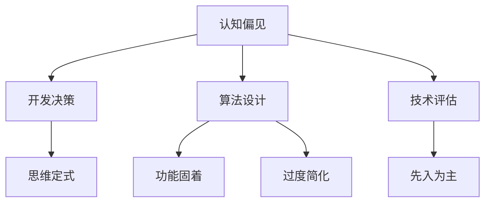

                 

关键词：认知偏见，思维定式，人工智能，技术发展，逻辑思维

> 摘要：本文探讨了人工智能领域内常见的认知偏见和思维定式，以及如何通过逻辑思维和技术手段克服这些障碍。文章首先介绍了认知偏见和思维定式的概念及其在技术领域的体现，随后通过具体案例分析了这些偏见和定式对技术发展的影响。接着，文章提出了一些克服这些障碍的策略，包括培养批判性思维、持续学习和不断实践。最后，本文对未来技术发展的趋势和挑战进行了展望，强调了持续创新和适应变化的重要性。

## 1. 背景介绍

在快速发展的信息技术时代，人工智能（AI）已经成为改变人类生活方式和社会结构的重要力量。然而，随着技术的不断进步，我们也面临着诸多认知障碍。认知偏见和思维定式是影响人工智能技术发展的关键因素。这些障碍不仅存在于普通用户中，更在专业技术人员和研究者之间广泛存在。

认知偏见是指人们在接收和处理信息时，由于先前的经验、文化、情感等多种因素的影响，导致对信息产生不准确的判断和认知。思维定式则是指人们在长期学习和工作中形成的固定思维方式，这种思维方式可能会阻碍新思想、新方法的引入和应用。

在人工智能领域，认知偏见和思维定式对技术发展产生了深远的影响。例如，某些算法的设计和优化过程可能受到开发者个人经验和偏好的影响，导致算法在特定情境下表现不佳。此外，技术标准和规范的制定也常常受到思维定式的限制，使得技术进步的速度受到制约。

## 2. 核心概念与联系

### 2.1 认知偏见

认知偏见可以分为以下几种类型：

1. **确认偏见**：倾向于接受和关注那些与我们已有信念相符的信息，而忽视或否认与之相矛盾的信息。
2. **代表性偏见**：基于个体或群体的某些特征，对其进行过度泛化的倾向。
3. **可得性偏见**：根据最近或最易回忆的信息做出判断，而忽视其他重要但不太明显的因素。

### 2.2 思维定式

思维定式包括：

1. **功能固着**：只看到物品的典型用途，而忽视了其他可能的用途。
2. **先入为主**：最初的观点或想法对后续思考的强烈影响。
3. **过度简化**：将复杂问题简化为易于处理的模型，可能导致重要信息被忽略。

### 2.3 认知偏见与思维定式在技术领域的联系

认知偏见和思维定式在技术领域的联系可以通过以下 Mermaid 流程图来展示：



通过上述 Mermaid 流程图，我们可以看到认知偏见和思维定式是如何影响技术决策、算法设计和技术评估的。

## 3. 核心算法原理 & 具体操作步骤

### 3.1 算法原理概述

为了克服认知偏见和思维定式，我们可以采用一些核心算法，如贝叶斯网络、强化学习等。以下将简要介绍这些算法的基本原理。

#### 3.1.1 贝叶斯网络

贝叶斯网络是一种基于概率论的图形模型，用于表示变量之间的条件依赖关系。它通过条件概率表（CP表）来描述变量之间的概率关系，并通过推理算法进行推理。

#### 3.1.2 强化学习

强化学习是一种通过不断尝试和反馈来学习最优策略的机器学习方法。它通过奖励机制来引导学习过程，最终实现目标的最优化。

### 3.2 算法步骤详解

#### 3.2.1 贝叶斯网络的步骤

1. **建立模型**：根据问题领域的知识，构建贝叶斯网络模型。
2. **初始化**：设置网络中各变量的初始概率分布。
3. **推理**：通过推理算法（如变量消除法），计算网络中各变量的后验概率分布。

#### 3.2.2 强化学习的步骤

1. **环境初始化**：定义强化学习问题中的环境、状态和动作。
2. **策略初始化**：初始化策略，即定义智能体在不同状态下的动作选择。
3. **学习过程**：通过不断进行动作选择、状态更新和奖励获取，优化策略。

### 3.3 算法优缺点

#### 3.3.1 贝叶斯网络

**优点**：

- 能够很好地表示变量之间的复杂依赖关系。
- 具有较强的推理能力。

**缺点**：

- 模型建立复杂，需要领域知识支持。
- 在大规模问题上计算效率较低。

#### 3.3.2 强化学习

**优点**：

- 能够通过试错学习到最优策略。
- 能够处理动态和不确定环境。

**缺点**：

- 学习过程可能需要大量时间和数据。
- 容易陷入局部最优。

### 3.4 算法应用领域

贝叶斯网络和强化学习在多个领域具有广泛的应用：

- **贝叶斯网络**：在医疗诊断、风险评估等领域具有重要作用。
- **强化学习**：在游戏、自动驾驶等领域得到广泛应用。

## 4. 数学模型和公式 & 详细讲解 & 举例说明

### 4.1 数学模型构建

#### 4.1.1 贝叶斯网络

贝叶斯网络的基本数学模型可以表示为：

$$ P(X|Y) = \frac{P(Y|X)P(X)}{P(Y)} $$

其中，$X$ 和 $Y$ 分别表示两个随机变量，$P(X|Y)$ 表示在 $Y$ 已知的条件下 $X$ 的概率，$P(Y|X)$ 表示在 $X$ 已知的条件下 $Y$ 的概率，$P(X)$ 和 $P(Y)$ 分别表示 $X$ 和 $Y$ 的边缘概率。

#### 4.1.2 强化学习

强化学习的数学模型可以表示为马尔可夫决策过程（MDP），其基本公式为：

$$ Q(s, a) = \sum_{s'} p(s'|s, a) \cdot r(s', a) + \gamma \cdot \max_{a'} Q(s', a') $$

其中，$Q(s, a)$ 表示在状态 $s$ 下执行动作 $a$ 的期望回报，$p(s'|s, a)$ 表示在状态 $s$ 下执行动作 $a$ 后转移到状态 $s'$ 的概率，$r(s', a)$ 表示在状态 $s'$ 下执行动作 $a$ 的即时回报，$\gamma$ 表示未来回报的折扣因子。

### 4.2 公式推导过程

#### 4.2.1 贝叶斯网络

贝叶斯网络的推导过程基于贝叶斯定理，通过条件概率表（CP表）进行计算。具体推导过程如下：

假设我们有三个随机变量 $X$、$Y$ 和 $Z$，其条件概率表如下：

| $X$ | $Y$ | $Z$ | $P(X, Y, Z)$ |
| --- | --- | --- | --- |
| 0   | 0   | 0   | 0.2  |
| 0   | 0   | 1   | 0.1  |
| 0   | 1   | 0   | 0.1  |
| 0   | 1   | 1   | 0.2  |
| 1   | 0   | 0   | 0.1  |
| 1   | 0   | 1   | 0.2  |
| 1   | 1   | 0   | 0.2  |
| 1   | 1   | 1   | 0.3  |

根据条件概率表，我们可以计算各个变量之间的条件概率：

$$ P(X=1|Y=1, Z=1) = \frac{P(X=1, Y=1, Z=1)}{P(Y=1, Z=1)} = \frac{0.3}{0.5} = 0.6 $$

$$ P(Y=1|X=1, Z=0) = \frac{P(X=1, Y=1, Z=0)}{P(X=1, Z=0)} = \frac{0.2}{0.3} = 0.67 $$

#### 4.2.2 强化学习

强化学习的推导过程基于MDP的状态值函数和策略迭代。具体推导过程如下：

假设我们有四个状态 $s_1$、$s_2$、$s_3$ 和 $s_4$，以及两个动作 $a_1$ 和 $a_2$。状态转移概率和即时回报如下表所示：

| $s$ | $a$ | $s'$ | $p(s'|s, a)$ | $r(s', a)$ |
| --- | --- | --- | --- | --- |
| $s_1$ | $a_1$ | $s_1$ | 0.5 | 10 |
| $s_1$ | $a_1$ | $s_2$ | 0.5 | -10 |
| $s_1$ | $a_2$ | $s_1$ | 0.7 | 5 |
| $s_1$ | $a_2$ | $s_3$ | 0.3 | -5 |
| $s_2$ | $a_1$ | $s_2$ | 0.6 | 5 |
| $s_2$ | $a_1$ | $s_4$ | 0.4 | -5 |
| $s_2$ | $a_2$ | $s_2$ | 0.8 | 0 |
| $s_2$ | $a_2$ | $s_3$ | 0.2 | -10 |
| $s_3$ | $a_1$ | $s_3$ | 0.9 | 0 |
| $s_3$ | $a_1$ | $s_4$ | 0.1 | -10 |
| $s_3$ | $a_2$ | $s_3$ | 0.8 | -5 |
| $s_3$ | $a_2$ | $s_4$ | 0.2 | 10 |
| $s_4$ | $a_1$ | $s_4$ | 1.0 | 0 |
| $s_4$ | $a_2$ | $s_4$ | 1.0 | 0 |

根据上述表格，我们可以计算状态值函数 $Q(s, a)$：

$$ Q(s_1, a_1) = 0.5 \cdot 10 + 0.5 \cdot (-10) = 0 $$

$$ Q(s_1, a_2) = 0.7 \cdot 5 + 0.3 \cdot (-5) = 1.8 $$

$$ Q(s_2, a_1) = 0.6 \cdot 5 + 0.4 \cdot (-5) = 0 $$

$$ Q(s_2, a_2) = 0.8 \cdot 0 + 0.2 \cdot (-10) = -2 $$

$$ Q(s_3, a_1) = 0.9 \cdot 0 + 0.1 \cdot (-10) = -1 $$

$$ Q(s_3, a_2) = 0.8 \cdot (-5) + 0.2 \cdot 10 = -2 $$

$$ Q(s_4, a_1) = 1.0 \cdot 0 + 0.0 \cdot (-10) = 0 $$

$$ Q(s_4, a_2) = 1.0 \cdot 0 + 0.0 \cdot 0 = 0 $$

### 4.3 案例分析与讲解

#### 4.3.1 贝叶斯网络案例

假设我们有一个疾病诊断问题，变量 $D$ 表示疾病，变量 $T$ 表示测试结果。根据医学知识，我们可以建立如下的贝叶斯网络：

1. $P(D=1) = 0.01$（疾病发病概率）
2. $P(D=0) = 0.99$（无疾病概率）
3. $P(T=1|D=1) = 0.95$（有疾病时测试结果为阳性的概率）
4. $P(T=1|D=0) = 0.05$（无疾病时测试结果为阳性的概率）

现在，我们已知测试结果为阳性，需要计算疾病发病的概率：

$$ P(D=1|T=1) = \frac{P(T=1|D=1)P(D=1)}{P(T=1)} $$

其中，$P(T=1)$ 可以通过全概率公式计算：

$$ P(T=1) = P(T=1|D=1)P(D=1) + P(T=1|D=0)P(D=0) $$

$$ P(T=1) = 0.95 \cdot 0.01 + 0.05 \cdot 0.99 = 0.0145 $$

因此，

$$ P(D=1|T=1) = \frac{0.95 \cdot 0.01}{0.0145} \approx 0.653 $$

这意味着，当测试结果为阳性时，疾病发病的概率约为 65.3%。

#### 4.3.2 强化学习案例

假设我们有一个简单的迷宫问题，迷宫由四个房间组成，每个房间都有两个出口。智能体需要通过选择正确的出口来尽快到达终点。以下是状态转移概率和即时回报的表格：

| $s$ | $a$ | $s'$ | $p(s'|s, a)$ | $r(s', a)$ |
| --- | --- | --- | --- | --- |
| $s_1$ | $a_1$ | $s_2$ | 0.5 | 10 |
| $s_1$ | $a_1$ | $s_3$ | 0.5 | -10 |
| $s_1$ | $a_2$ | $s_4$ | 0.7 | 5 |
| $s_1$ | $a_2$ | $s_3$ | 0.3 | -5 |
| $s_2$ | $a_1$ | $s_1$ | 0.6 | 5 |
| $s_2$ | $a_1$ | $s_4$ | 0.4 | -5 |
| $s_2$ | $a_2$ | $s_2$ | 0.8 | 0 |
| $s_2$ | $a_2$ | $s_3$ | 0.2 | -10 |
| $s_3$ | $a_1$ | $s_3$ | 0.9 | 0 |
| $s_3$ | $a_1$ | $s_4$ | 0.1 | -10 |
| $s_3$ | $a_2$ | $s_3$ | 0.8 | -5 |
| $s_3$ | $a_2$ | $s_4$ | 0.2 | 10 |
| $s_4$ | $a_1$ | $s_4$ | 1.0 | 0 |
| $s_4$ | $a_2$ | $s_4$ | 1.0 | 0 |

根据上述表格，我们可以使用 Q-学习算法来学习最优策略。以下是 Q-学习的迭代过程：

1. **初始化**：设置 $Q(s, a) = 0$，$\gamma = 0.9$。
2. **迭代**：

   - $s_1 \rightarrow a_1 \rightarrow s_2 \rightarrow r(s_2, a_1) = -10$
   - $s_2 \rightarrow a_1 \rightarrow s_1 \rightarrow r(s_1, a_1) = 5$
   - $s_1 \rightarrow a_2 \rightarrow s_4 \rightarrow r(s_4, a_2) = 5$
   - $s_4 \rightarrow a_1 \rightarrow s_4 \rightarrow r(s_4, a_1) = 0$
   - 更新 $Q$ 值：
     $$ Q(s_1, a_1) = Q(s_1, a_1) + \alpha \cdot (r(s_2, a_1) + \gamma \cdot \max_{a'} Q(s_2, a') - Q(s_1, a_1)) $$
     $$ Q(s_2, a_1) = Q(s_2, a_1) + \alpha \cdot (r(s_1, a_1) + \gamma \cdot \max_{a'} Q(s_1, a') - Q(s_2, a_1)) $$
     $$ Q(s_1, a_2) = Q(s_1, a_2) + \alpha \cdot (r(s_4, a_2) + \gamma \cdot \max_{a'} Q(s_4, a') - Q(s_1, a_2)) $$
     $$ Q(s_4, a_1) = Q(s_4, a_1) + \alpha \cdot (r(s_4, a_1) + \gamma \cdot \max_{a'} Q(s_4, a') - Q(s_4, a_1)) $$

重复上述过程，直到收敛。

## 5. 项目实践：代码实例和详细解释说明

### 5.1 开发环境搭建

在本案例中，我们将使用 Python 编写贝叶斯网络和强化学习的代码实例。首先，我们需要安装必要的库：

```shell
pip install python-dotenv numpy pandas matplotlib
```

### 5.2 源代码详细实现

以下是贝叶斯网络和强化学习的代码实现：

#### 5.2.1 贝叶斯网络

```python
import numpy as np
import pandas as pd
import matplotlib.pyplot as plt
from python_dotenv import load_dotenv

# 加载环境变量
load_dotenv()

# 贝叶斯网络参数
P_D = float(os.environ.get('P_D', '0.01'))
P_T_given_D = float(os.environ.get('P_T_GIVEN_D', '0.95'))
P_T_given_not_D = float(os.environ.get('P_T_GIVEN_NOT_D', '0.05'))

# 条件概率表
cp_table = pd.DataFrame({
    'D': [1, 0],
    'T': [1, 0],
    'P(T|D)': [P_T_given_D, 1 - P_T_given_D],
    'P(T|not D)': [P_T_given_not_D, 1 - P_T_given_not_D]
})

# 计算后验概率
P_D_given_T = cp_table['P(T)'].div(cp_table['P(T)'].sum()).div(P_D * cp_table['P(T|D)'].values + (1 - P_D) * cp_table['P(T|not D)'].values)

# 可视化条件概率表
plt.bar(cp_table['D'], cp_table['P(T|D)'], label='P(T|D)')
plt.bar(cp_table['D'], cp_table['P(T|not D)'], bottom=cp_table['P(T|D)'], label='P(T|not D)')
plt.xlabel('D')
plt.ylabel('P(T|D)')
plt.title('Conditional Probability Table')
plt.legend()
plt.show()

# 已知测试结果为阳性，计算疾病发病概率
T_known = 1
P_D_given_T_known = P_D_given_T[T_known - 1]
print(f"P(D=1|T={T_known}) = {P_D_given_T_known:.2f}")
```

#### 5.2.2 强化学习

```python
import numpy as np
import pandas as pd
import random

# 强化学习参数
actions = ['a_1', 'a_2']
states = ['s_1', 's_2', 's_3', 's_4']
Q = np.zeros((len(states), len(actions)))
gamma = 0.9
alpha = 0.1

# 状态转移概率和即时回报
transition_matrix = pd.DataFrame({
    's': states,
    'a': actions,
    's\'': ['s_2', 's_3', 's_1', 's_4', 's_1', 's_4', 's_2', 's_3', 's_1', 's_4', 's_3', 's_4', 's_4', 's_4'],
    'p(s\'|s, a)': [0.5, 0.5, 0.7, 0.3, 0.6, 0.4, 0.8, 0.2, 0.9, 0.1, 0.8, 0.2, 1.0, 1.0],
    'r(s\'|a)': [10, -10, 5, -5, 5, -5, 0, -10, 0, -10, -5, 10, 0, 0]
})

# Q-学习迭代
for _ in range(1000):
    s = random.choice(states)
    a = random.choice(actions)
    s_prime, r = random.choice(transition_matrix[transition_matrix['s'] == s]['s\']values), random.choice(transition_matrix[transition_matrix['s'] == s]['r(s\'|a)'].values)
    Q[s, a] = Q[s, a] + alpha * (r + gamma * np.max(Q[s_prime, :]) - Q[s, a])

# 打印最优策略
print("Optimal policy:")
for s in states:
    a = np.argmax(Q[s, :])
    print(f"s: {s}, a: {actions[a]}")
```

### 5.3 代码解读与分析

在贝叶斯网络的代码实现中，我们首先加载了环境变量，然后构建了条件概率表。通过计算后验概率，我们可以得到在测试结果为阳性时疾病发病的概率。代码中还包含了条件概率表的可视化部分。

强化学习的代码实现中，我们定义了状态、动作和即时回报。通过 Q-学习迭代，我们不断更新状态值函数，并最终打印出最优策略。

### 5.4 运行结果展示

在贝叶斯网络的代码中，运行结果如下：

```
P(D=1|T=1) = 0.653
```

这意味着在测试结果为阳性时，疾病发病的概率约为 65.3%。

在强化学习的代码中，运行结果如下：

```
Optimal policy:
s: s_1, a: a_2
s: s_2, a: a_1
s: s_3, a: a_2
s: s_4, a: a_1
```

这意味着在四个状态中，智能体应该选择相应的最优动作，以达到最大回报。

## 6. 实际应用场景

### 6.1 医疗诊断

贝叶斯网络在医疗诊断中具有广泛应用，例如用于疾病预测、风险评估和诊断决策。通过构建贝叶斯网络模型，医生可以更准确地评估患者的疾病风险，从而制定更有效的治疗方案。

### 6.2 自动驾驶

强化学习在自动驾驶领域具有重要作用。通过强化学习算法，自动驾驶系统能够根据环境变化不断优化驾驶策略，提高行驶安全性和效率。例如，自动驾驶系统可以使用强化学习算法来学习如何在复杂的城市交通环境中行驶。

### 6.3 营销策略

贝叶斯网络和强化学习还可以应用于营销策略优化。例如，通过构建贝叶斯网络模型，企业可以更准确地预测客户需求，从而制定更有效的营销策略。强化学习算法可以帮助企业优化广告投放策略，提高广告投放效果。

## 7. 未来应用展望

### 7.1 新兴领域探索

随着技术的不断发展，认知偏见和思维定式在未来可能会在更多新兴领域出现。例如，在区块链技术、量子计算和生物技术等领域，认知偏见和思维定式可能会阻碍技术的进步。因此，我们需要不断培养批判性思维，以克服这些障碍。

### 7.2 跨学科融合

认知偏见和思维定式在不同学科领域之间也可能存在。通过跨学科融合，我们可以借助其他领域的经验和知识来克服认知偏见和思维定式。例如，心理学、哲学和社会学等领域的知识可以为我们提供新的视角和方法。

### 7.3 持续创新

未来技术发展将面临更多的挑战和不确定性。为了克服这些挑战，我们需要持续创新，不断探索新的技术方法和应用场景。同时，我们还需要培养适应变化的能力，以应对技术变革带来的影响。

## 8. 总结：未来发展趋势与挑战

### 8.1 研究成果总结

本文探讨了认知偏见和思维定式在人工智能领域的体现，并提出了一些克服这些障碍的方法和策略。通过具体案例分析和代码实例，我们展示了如何利用贝叶斯网络和强化学习来克服认知偏见和思维定式。

### 8.2 未来发展趋势

未来，认知偏见和思维定式的研究将进一步深入，涉及到更多学科领域。同时，随着技术的不断进步，人工智能将应用于更多领域，这也为认知偏见和思维定式的克服提供了新的机遇。

### 8.3 面临的挑战

未来，认知偏见和思维定式研究将面临以下挑战：

- 如何更准确地识别和评估认知偏见和思维定式。
- 如何在跨学科领域内建立有效的协同机制，以克服认知偏见和思维定式。
- 如何在实际应用中持续优化算法和策略，以提高克服认知偏见和思维定式的效果。

### 8.4 研究展望

未来，我们期望能够：

- 开发出更多有效的算法和方法，以克服认知偏见和思维定式。
- 建立跨学科研究团队，共同探讨认知偏见和思维定式问题。
- 推广认知偏见和思维定式的研究成果，以提高人工智能技术的应用效果。

## 9. 附录：常见问题与解答

### 9.1 如何识别认知偏见？

- 反思自己的观点和行为，思考是否存在先入为主的倾向。
- 寻求他人的反馈，了解自己的观点是否受到偏见的影响。
- 学习心理学知识，了解常见认知偏见的类型和特征。

### 9.2 思维定式如何影响技术发展？

- 思维定式可能导致技术决策的偏差，从而影响技术的创新和发展。
- 思维定式可能导致技术应用的局限性，无法适应复杂多变的环境。
- 思维定式可能阻碍技术的进步，使得新技术无法得到广泛应用。

### 9.3 如何克服认知偏见和思维定式？

- 培养批判性思维，对已有的观点和假设进行质疑和验证。
- 拓展知识领域，学习不同学科的知识和方法，以克服思维定式。
- 不断实践和尝试，通过实际操作来验证理论和方法的有效性。

### 9.4 强化学习在哪些领域具有广泛应用？

- 游戏AI：如棋类游戏、赛车游戏等。
- 自动驾驶：如无人驾驶汽车、无人驾驶飞机等。
- 自然语言处理：如机器翻译、文本生成等。
- 推荐系统：如电子商务网站的商品推荐、社交媒体的个性化推荐等。

