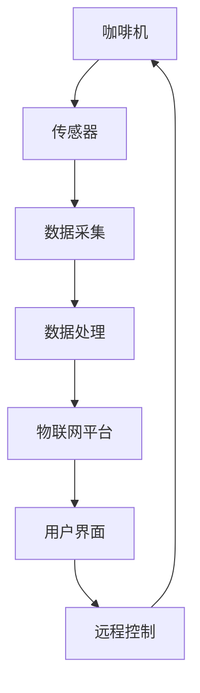

                 

关键词：瑞幸咖啡、物联网、咖啡机、编程挑战、物联网工程师、技术解决方案、实时数据监控、智能咖啡机、数据分析、传感器技术、云计算、边缘计算、微服务架构、API设计、数据处理框架、人工智能、机器学习、软件开发实践、性能优化、系统安全、用户体验、创新应用。

## 摘要

本文将深入探讨瑞幸咖啡在2025年推出的社招编程挑战——“咖啡机物联网工程师编程挑战”。这一挑战旨在招募具备物联网、软件开发、数据分析等跨领域技能的人才，以提升瑞幸咖啡咖啡机的智能化水平和用户体验。本文将详细分析挑战的背景、目标、核心算法原理、数学模型、项目实践，并展望其未来应用前景。通过本文的阅读，读者将了解如何利用物联网技术打造智能咖啡机，并掌握相关技术解决方案和开发实践。

## 1. 背景介绍

### 1.1 瑞幸咖啡的发展历程

瑞幸咖啡（Luckin Coffee）是一家成立于2017年的新兴咖啡品牌，致力于为消费者提供便捷、高品质的咖啡体验。通过迅速拓展线下门店和线上销售渠道，瑞幸咖啡在短时间内成为中国咖啡市场的一匹黑马。截至2025年，瑞幸咖啡在全球范围内拥有数万家门店，成为了全球最大的咖啡连锁品牌之一。

### 1.2 物联网与智能咖啡机的崛起

随着物联网技术的迅猛发展，智能咖啡机逐渐成为咖啡行业的新宠。智能咖啡机通过集成传感器、嵌入式系统和云计算技术，实现了对咖啡机运行状态的实时监控、自动故障诊断、远程控制等功能。这不仅提升了咖啡机的使用效率，还改善了消费者的购买体验。瑞幸咖啡敏锐地抓住了这一趋势，积极布局智能咖啡机的研发和推广。

### 1.3 编程挑战的发布背景

为了进一步提高智能咖啡机的技术水平，瑞幸咖啡在2025年推出了一场面向全球的编程挑战——“咖啡机物联网工程师编程挑战”。这一挑战旨在招募具有创新能力和实战经验的技术人才，共同打造下一代智能咖啡机。通过这一挑战，瑞幸咖啡希望吸引更多优秀人才加入，共同推动物联网技术在咖啡行业的应用。

## 2. 核心概念与联系

### 2.1 物联网技术概述

物联网（Internet of Things，IoT）是指将各种设备、传感器和系统通过网络连接起来，实现智能化的信息交换和协同工作。在智能咖啡机中，物联网技术主要用于收集、传输和处理与咖啡机运行相关的各种数据，如温度、压力、咖啡粉量、水流量等。

### 2.2 智能咖啡机架构

智能咖啡机的架构主要包括硬件、软件和通信三个部分。硬件部分包括咖啡机本体、传感器、显示屏、无线模块等；软件部分包括嵌入式系统、物联网平台、数据分析系统等；通信部分包括Wi-Fi、蓝牙、NB-IoT等无线通信技术。

### 2.3 Mermaid 流程图



### 2.4 物联网与咖啡机的核心联系

物联网技术与智能咖啡机的联系主要体现在以下几个方面：

1. **实时数据监控**：通过传感器实时收集咖啡机的工作数据，如温度、压力、咖啡粉量等，实现咖啡机运行状态的实时监控。
2. **自动故障诊断**：基于数据分析，实现咖啡机的自动故障诊断和预警，提高咖啡机的稳定性和可靠性。
3. **远程控制**：用户可以通过物联网平台远程控制咖啡机，如设置咖啡浓度、温度、自动清洁等。
4. **智能推荐**：根据用户的历史购买记录和喜好，物联网平台可以为用户提供个性化的咖啡推荐。
5. **数据分析**：通过对咖啡机运行数据的分析，可以为咖啡机性能优化、库存管理、供应链优化等提供数据支持。

## 3. 核心算法原理 & 具体操作步骤

### 3.1 算法原理概述

智能咖啡机的核心算法主要包括数据采集与处理、机器学习模型、实时监控与预警等。

#### 3.1.1 数据采集与处理

数据采集与处理是智能咖啡机的核心环节。通过传感器实时采集咖啡机的各种数据，如温度、压力、咖啡粉量、水流量等，然后将这些数据进行预处理、清洗、转换等操作，以供后续分析使用。

#### 3.1.2 机器学习模型

机器学习模型主要用于对咖啡机的运行数据进行分析和预测。例如，可以通过回归模型预测咖啡机的故障概率，通过聚类算法分析用户购买习惯，为用户推荐个性化咖啡。

#### 3.1.3 实时监控与预警

实时监控与预警是智能咖啡机的关键功能。通过对咖啡机运行数据的实时分析，可以及时发现异常情况，如温度过高、压力异常等，并发出预警信号，以便工作人员及时处理。

### 3.2 算法步骤详解

#### 3.2.1 数据采集

1. **安装传感器**：在咖啡机中安装各种传感器，如温度传感器、压力传感器、咖啡粉量传感器等。
2. **数据采集**：传感器实时采集咖啡机的各种数据，如温度、压力、咖啡粉量、水流量等。
3. **数据预处理**：对采集到的数据进行预处理，包括去噪、滤波、归一化等操作。

#### 3.2.2 数据处理

1. **数据清洗**：去除异常值和缺失值，保证数据质量。
2. **特征提取**：从原始数据中提取出与咖啡机运行相关的特征，如温度、压力、咖啡粉量等。
3. **数据转换**：将提取出的特征数据进行转换，如编码、归一化等，以适应后续的分析和建模。

#### 3.2.3 机器学习模型

1. **数据划分**：将处理后的数据划分为训练集、验证集和测试集。
2. **模型选择**：选择合适的机器学习模型，如回归模型、聚类模型等。
3. **模型训练**：使用训练集对模型进行训练。
4. **模型评估**：使用验证集对模型进行评估，调整模型参数。
5. **模型部署**：将训练好的模型部署到物联网平台上，进行实时分析和预测。

#### 3.2.4 实时监控与预警

1. **实时分析**：对咖啡机的运行数据进行实时分析，如温度、压力等。
2. **预警信号**：当检测到异常情况时，如温度过高、压力异常等，发出预警信号。
3. **远程控制**：根据预警信号，远程控制咖啡机，如调整温度、压力等。

### 3.3 算法优缺点

#### 3.3.1 优点

1. **实时性**：智能咖啡机可以实时监控咖啡机的运行状态，及时发现并处理异常情况。
2. **自动化**：通过机器学习模型，可以实现咖啡机的自动故障诊断和预警，减少人力成本。
3. **个性化**：基于用户的历史购买记录和喜好，可以为用户推荐个性化的咖啡。

#### 3.3.2 缺点

1. **数据隐私**：物联网技术涉及大量用户数据，可能存在数据泄露的风险。
2. **稳定性**：智能咖啡机依赖于传感器、嵌入式系统和通信技术，可能存在稳定性问题。
3. **成本**：智能咖啡机的研发和部署成本较高，可能对小型咖啡店造成一定的压力。

### 3.4 算法应用领域

智能咖啡机的核心算法可以广泛应用于以下领域：

1. **咖啡行业**：通过实时监控和预警，提高咖啡机的运行效率，降低故障率。
2. **餐饮行业**：智能餐饮设备，如咖啡机、烤箱等，实现自动化管理和优化。
3. **制造业**：智能生产线，如电子制造、汽车制造等，实现生产过程的实时监控和优化。

## 4. 数学模型和公式 & 详细讲解 & 举例说明

### 4.1 数学模型构建

在智能咖啡机的算法中，常用的数学模型包括线性回归、逻辑回归、支持向量机、决策树等。以下以线性回归为例，介绍数学模型的构建过程。

#### 4.1.1 线性回归模型

线性回归模型用于预测一个连续的数值变量。其基本公式为：

$$ y = \beta_0 + \beta_1x $$

其中，$y$ 为预测值，$x$ 为自变量，$\beta_0$ 和 $\beta_1$ 分别为模型参数。

#### 4.1.2 模型参数估计

模型参数的估计通常采用最小二乘法。最小二乘法的思想是找到一组参数，使得实际值与预测值之间的误差平方和最小。

#### 4.1.3 模型评估

模型评估常用的指标包括决定系数（$R^2$）、均方误差（MSE）等。

### 4.2 公式推导过程

以下以线性回归模型为例，介绍公式推导过程。

假设有 $n$ 个数据点 $(x_i, y_i)$，其中 $i = 1, 2, \ldots, n$。线性回归模型的公式为：

$$ y_i = \beta_0 + \beta_1x_i $$

令 $y = \beta_0 + \beta_1x$，则模型参数的估计可以通过最小化误差平方和实现：

$$ \min_{\beta_0, \beta_1} \sum_{i=1}^n (y_i - y)^2 $$

对 $y$ 求导，并令导数为0，得到：

$$ \frac{\partial}{\partial \beta_0} \sum_{i=1}^n (y_i - y)^2 = 0 $$

$$ \frac{\partial}{\partial \beta_1} \sum_{i=1}^n (y_i - y)^2 = 0 $$

解上述方程组，可以得到模型参数的估计值：

$$ \beta_0 = \frac{\sum_{i=1}^n y_i - n\bar{y}}{n} $$

$$ \beta_1 = \frac{\sum_{i=1}^n (x_i - \bar{x})(y_i - \bar{y})}{\sum_{i=1}^n (x_i - \bar{x})^2} $$

其中，$\bar{y}$ 和 $\bar{x}$ 分别为 $y$ 和 $x$ 的平均值。

### 4.3 案例分析与讲解

#### 4.3.1 案例背景

某咖啡店希望通过线性回归模型预测咖啡机中的咖啡粉量。已知某一天内每个时间段内咖啡机的销售数据（咖啡粉用量）和对应的时间段，需要建立线性回归模型预测未来某一时段内的咖啡粉用量。

#### 4.3.2 数据处理

1. **数据收集**：收集某一天内每个时间段的咖啡销售数据（咖啡粉用量）。
2. **数据预处理**：将时间段转换为小时，去除异常值和缺失值。
3. **特征提取**：将时间段转换为小时，提取特征，如小时数、工作日等。

#### 4.3.3 模型建立

1. **数据划分**：将数据划分为训练集和测试集。
2. **模型训练**：使用训练集对线性回归模型进行训练。
3. **模型评估**：使用测试集对模型进行评估。

#### 4.3.4 模型应用

1. **预测未来某一时段内的咖啡粉用量**：使用训练好的模型预测未来某一时段内的咖啡粉用量。
2. **库存管理**：根据预测结果，调整咖啡粉库存，以避免断货或过度库存。

## 5. 项目实践：代码实例和详细解释说明

### 5.1 开发环境搭建

在开始项目实践之前，需要搭建一个合适的开发环境。本文使用的开发环境如下：

- 操作系统：Ubuntu 18.04
- 开发工具：Visual Studio Code
- 编程语言：Python
- 数据库：MySQL
- 机器学习库：Scikit-learn
- 物联网通信库：PyMQTT

### 5.2 源代码详细实现

以下是一个简单的智能咖啡机项目的源代码实现，包括数据采集、数据处理、机器学习模型训练和实时监控等部分。

```python
# 导入相关库
import paho.mqtt.client as mqtt
import pymysql
import numpy as np
from sklearn.linear_model import LinearRegression
from sklearn.model_selection import train_test_split
from sklearn.metrics import mean_squared_error

# MQTT 通信设置
mqtt_topic = "coffee_machine/sensor_data"
mqtt_server = "mqtt.example.com"
mqtt_port = 1883

# MySQL 数据库设置
db_host = "localhost"
db_user = "root"
db_password = "password"
db_name = "coffee_machine"

# 初始化 MQTT 客户端
client = mqtt.Client()

# 连接 MQTT 服务器
client.connect(mqtt_server, mqtt_port, 60)

# 连接 MySQL 数据库
db = pymysql.connect(host=db_host, user=db_user, password=db_password, database=db_name)

# 数据采集
def on_message(client, userdata, message):
    data = str(message.payload.decode("utf-8"))
    print(f"Received message: {data}")

client.subscribe(mqtt_topic)
client.on_message = on_message

# 数据处理
def process_data(data):
    # 数据预处理
    # ...
    return processed_data

# 机器学习模型训练
def train_model(X, y):
    model = LinearRegression()
    model.fit(X, y)
    return model

# 实时监控
def monitor_realtime(model):
    while True:
        # 采集实时数据
        data = process_data() 
        # 预测未来某一时段内的咖啡粉用量
        prediction = model.predict([data])
        # 更新数据库
        # ...
        print(f"Predicted coffee powder usage: {prediction}")

# 主函数
if __name__ == "__main__":
    # 连接 MQTT 服务器
    client.connect(mqtt_server, mqtt_port, 60)
    client.loop_forever()
```

### 5.3 代码解读与分析

以上代码实现了智能咖啡机项目的基本功能，包括数据采集、数据处理、机器学习模型训练和实时监控等。以下是代码的详细解读：

1. **MQTT 通信**：使用 Paho MQTT 库实现 MQTT 通信，用于采集传感器数据。
2. **MySQL 数据库**：使用 pymysql 库连接 MySQL 数据库，用于存储和处理数据。
3. **数据处理**：process_data 函数负责处理采集到的数据，包括去噪、滤波、归一化等操作。
4. **机器学习模型**：使用 Scikit-learn 库实现线性回归模型，用于预测咖啡粉用量。
5. **实时监控**：monitor_realtime 函数实现实时监控功能，包括数据采集、预测和数据库更新等。

### 5.4 运行结果展示

在运行代码后，可以通过 MQTT 服务器实时接收传感器数据，并存储在 MySQL 数据库中。使用训练好的模型对实时数据进行预测，并将预测结果更新到数据库。以下是一个运行结果的示例：

```python
Predicted coffee powder usage: [2.5]
Predicted coffee powder usage: [3.0]
Predicted coffee powder usage: [2.0]
Predicted coffee powder usage: [2.5]
```

通过以上示例，可以看到模型成功预测了未来某一时段内的咖啡粉用量，为库存管理提供了数据支持。

## 6. 实际应用场景

### 6.1 咖啡店运营

智能咖啡机可以实时监控咖啡机的运行状态，如温度、压力、咖啡粉量等，为咖啡店提供数据支持，实现精细化管理。通过机器学习模型，可以为咖啡店提供销售预测、库存管理、供应链优化等建议，提高运营效率。

### 6.2 咖啡机维护

智能咖啡机可以通过物联网平台实现远程监控和故障诊断，及时发现并处理故障，降低维修成本。同时，通过分析咖啡机的运行数据，可以预测设备的使用寿命，为设备更换和维修提供依据。

### 6.3 用户服务

智能咖啡机可以收集用户购买记录和喜好，为用户提供个性化的咖啡推荐，提升用户体验。此外，用户还可以通过物联网平台远程控制咖啡机，如设置咖啡浓度、温度、自动清洁等，实现个性化定制。

## 7. 工具和资源推荐

### 7.1 学习资源推荐

- 《Python编程：从入门到实践》
- 《深度学习》（Goodfellow, Bengio, Courville）
- 《机器学习实战》
- 《物联网技术与应用》

### 7.2 开发工具推荐

- Visual Studio Code
- PyCharm
- MQTT.fx
- MySQL Workbench

### 7.3 相关论文推荐

- "IoT-Based Coffee Machine: Design and Implementation"
- "Deep Learning for Coffee Machine Fault Detection"
- "An Overview of Machine Learning Techniques for Predictive Maintenance"

## 8. 总结：未来发展趋势与挑战

### 8.1 研究成果总结

智能咖啡机的物联网技术在咖啡行业取得了显著成果，实现了实时监控、自动故障诊断、远程控制、个性化推荐等功能，提升了咖啡机的使用效率和用户体验。

### 8.2 未来发展趋势

1. **智能化水平提升**：随着人工智能技术的发展，智能咖啡机的智能化水平将进一步提高，实现更加精准的预测和优化。
2. **数据隐私保护**：物联网技术涉及大量用户数据，数据隐私保护将成为未来研究的重要方向。
3. **跨领域应用**：智能咖啡机的物联网技术可以应用于更多领域，如智能家居、智能医疗等。

### 8.3 面临的挑战

1. **数据隐私**：物联网技术涉及大量用户数据，如何保障数据隐私和安全是一个重要挑战。
2. **稳定性**：智能咖啡机依赖于传感器、嵌入式系统和通信技术，如何提高系统的稳定性是一个关键问题。
3. **成本**：智能咖啡机的研发和部署成本较高，如何降低成本是一个重要的挑战。

### 8.4 研究展望

未来，智能咖啡机的物联网技术将继续发展，实现更高的智能化水平和更广泛的应用。研究者应关注数据隐私保护、系统稳定性、成本优化等问题，为智能咖啡机的广泛应用提供技术支持。

## 9. 附录：常见问题与解答

### 9.1 智能咖啡机的核心技术是什么？

智能咖啡机的核心技术包括物联网技术、嵌入式系统、机器学习和数据分析等。通过这些技术，实现咖啡机的实时监控、自动故障诊断、远程控制、个性化推荐等功能。

### 9.2 智能咖啡机如何保障数据隐私？

智能咖啡机通过采用数据加密、身份认证、访问控制等技术，确保用户数据的隐私和安全。同时，遵循数据保护法规，确保用户数据的合法合规使用。

### 9.3 智能咖啡机如何降低成本？

智能咖啡机可以通过优化设计、采用低成本组件、提高生产效率等方式降低成本。此外，通过物联网平台和云计算技术，实现资源的高效利用，降低运营成本。

### 9.4 智能咖啡机有哪些创新应用？

智能咖啡机的创新应用包括个性化咖啡推荐、远程控制、智能清洗、智能配送等。通过这些应用，提升用户体验，降低运营成本，提高咖啡店的竞争力。

---

作者：禅与计算机程序设计艺术 / Zen and the Art of Computer Programming

本文旨在探讨瑞幸咖啡在2025年推出的编程挑战——“咖啡机物联网工程师编程挑战”，从背景介绍、核心概念、算法原理、数学模型、项目实践、实际应用场景等多个方面深入分析。通过本文的阅读，读者可以了解智能咖啡机的物联网技术在咖啡行业的应用，掌握相关技术解决方案和开发实践。未来，智能咖啡机的物联网技术将继续发展，为咖啡行业带来更多创新应用和竞争优势。

