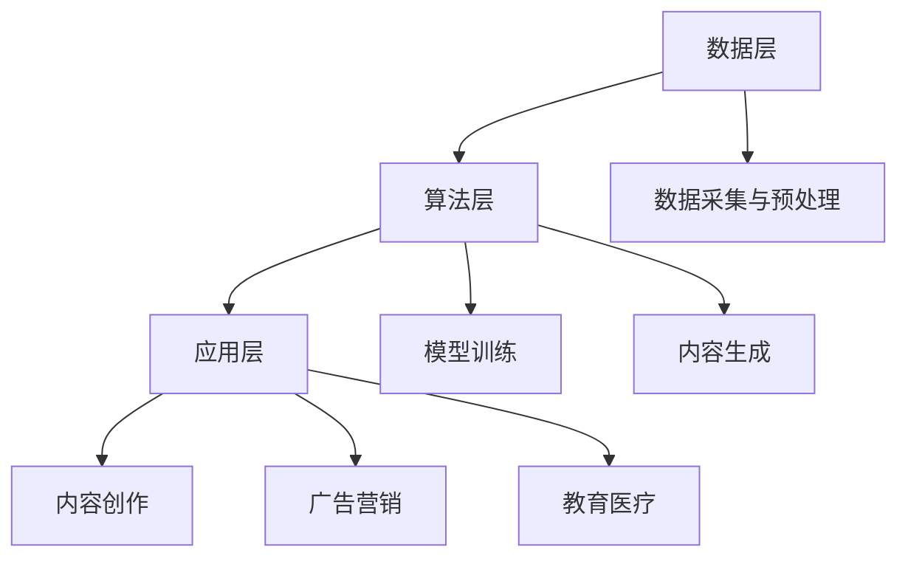

                 

关键词：生成式人工智能（AIGC），垂直应用，数据驱动，泡沫与价值，技术趋势，未来展望。

> 摘要：本文深入探讨了生成式人工智能（AIGC）的现状与发展趋势，分析了其在不同垂直应用场景中的价值与挑战。通过详细解析核心算法原理、数学模型、实际应用案例以及未来应用前景，指出AIGC不仅是一个技术革命，更是推动行业创新的关键力量。文章强调，聚焦垂直应用场景、重视数据驱动的开发模式，将决定AIGC的未来走向。

## 1. 背景介绍

随着人工智能（AI）技术的迅猛发展，生成式人工智能（AIGC，AI-Generated Content）逐渐成为研究与应用的热点。AIGC是一种利用机器学习算法生成文本、图像、音频等多媒体内容的技术，其核心在于模拟人类创造内容的过程，实现自动化内容生成。AIGC的应用领域广泛，从内容创作、广告营销到教育医疗，都有着巨大的潜力。

然而，AIGC的发展也面临着诸多挑战。首先，核心算法的复杂性使其研发成本高、门槛高。其次，数据驱动的开发模式要求海量高质量的数据支持，这对于许多企业和研究者来说都是一大难题。此外，AIGC技术的泡沫风险也引起广泛关注，即过度投资和盲目跟风可能导致技术发展偏离实际需求。

本文旨在分析AIGC在不同垂直应用场景中的价值与挑战，探讨其真实的价值所在，并给出未来发展建议。

## 2. 核心概念与联系

### 2.1 AIGC的定义与工作原理

生成式人工智能（AIGC）的核心在于“生成”，即通过机器学习算法，从大量数据中学习规律，并生成新的、符合预期的内容。AIGC的工作原理可以概括为以下几个步骤：

1. **数据采集与预处理**：首先，需要收集大量相关数据，并进行预处理，包括数据清洗、去重、归一化等。
2. **模型训练**：使用预处理后的数据，通过神经网络等机器学习算法，训练生成模型。这个过程中，模型会不断调整参数，以优化生成效果。
3. **内容生成**：在模型训练完成后，可以通过输入少量指导信息，让模型生成新的内容。这个过程可以是完全自动的，也可以是半自动的，即部分内容由用户生成，部分内容由模型生成。

### 2.2 AIGC的核心算法原理

AIGC的核心算法主要包括生成对抗网络（GAN）、变分自编码器（VAE）、自注意力机制（Self-Attention）等。以下是这些算法的基本原理：

- **生成对抗网络（GAN）**：GAN由生成器（Generator）和判别器（Discriminator）两个部分组成。生成器负责生成数据，判别器负责区分生成数据和真实数据。通过训练，生成器不断优化，生成越来越逼真的数据。
- **变分自编码器（VAE）**：VAE通过引入变分推断方法，学习数据的高斯分布，从而生成新的数据。其核心思想是将数据编码为潜在空间中的点，然后解码回数据空间。
- **自注意力机制（Self-Attention）**：自注意力机制是近年来在自然语言处理领域广泛应用的一种机制，其核心思想是让模型在处理输入序列时，能够自动关注序列中重要的部分，提高生成效果。

### 2.3 AIGC的技术架构

AIGC的技术架构主要包括数据层、算法层和应用层。以下是各层的具体内容：

- **数据层**：包括数据采集、存储、管理和预处理等模块。数据层是AIGC的基础，决定了模型的质量和效果。
- **算法层**：包括生成器、判别器、编码器、解码器等核心算法模块。算法层是实现AIGC功能的核心，决定了AIGC的技术水平和应用范围。
- **应用层**：包括各种应用场景的解决方案和产品。应用层是AIGC技术的最终体现，决定了AIGC的实际价值。

### 2.4 Mermaid流程图

以下是AIGC的技术架构的Mermaid流程图：



## 3. 核心算法原理 & 具体操作步骤

### 3.1 算法原理概述

生成式人工智能（AIGC）的核心算法包括生成对抗网络（GAN）、变分自编码器（VAE）和自注意力机制（Self-Attention）。以下是这些算法的原理概述：

- **生成对抗网络（GAN）**：GAN由生成器和判别器组成。生成器负责生成数据，判别器负责判断生成数据是否真实。通过训练，生成器不断优化，生成越来越逼真的数据。
- **变分自编码器（VAE）**：VAE通过学习数据的高斯分布，生成新的数据。其核心思想是将数据编码为潜在空间中的点，然后解码回数据空间。
- **自注意力机制（Self-Attention）**：自注意力机制是让模型在处理输入序列时，能够自动关注序列中重要的部分，提高生成效果。

### 3.2 算法步骤详解

#### 3.2.1 生成对抗网络（GAN）

1. **数据采集与预处理**：收集大量相关数据，并进行预处理，包括数据清洗、去重、归一化等。
2. **生成器训练**：使用预处理后的数据，通过神经网络等机器学习算法，训练生成器。生成器负责生成数据，目标是让判别器无法区分生成数据和真实数据。
3. **判别器训练**：同时训练判别器，判别器负责判断生成数据是否真实。判别器的目标是最大化正确判断真实数据和生成数据的概率。
4. **交替训练**：生成器和判别器交替训练，生成器不断优化，生成越来越逼真的数据，判别器不断优化，提高区分真实数据和生成数据的能力。
5. **内容生成**：在模型训练完成后，通过输入少量指导信息，让生成器生成新的数据。

#### 3.2.2 变分自编码器（VAE）

1. **数据采集与预处理**：收集大量相关数据，并进行预处理，包括数据清洗、去重、归一化等。
2. **编码器训练**：使用预处理后的数据，训练编码器。编码器负责将数据编码为潜在空间中的点，目标是保持数据的分布特性。
3. **解码器训练**：使用编码器生成的潜在空间中的点，训练解码器。解码器负责将潜在空间中的点解码回数据空间，目标是重构数据。
4. **内容生成**：在模型训练完成后，通过输入少量指导信息，让解码器生成新的数据。

#### 3.2.3 自注意力机制（Self-Attention）

1. **数据采集与预处理**：收集大量相关数据，并进行预处理，包括数据清洗、去重、归一化等。
2. **模型训练**：使用预处理后的数据，训练包含自注意力机制的模型。自注意力机制负责在处理输入序列时，自动关注序列中重要的部分。
3. **内容生成**：在模型训练完成后，通过输入少量指导信息，让模型生成新的数据。

### 3.3 算法优缺点

#### 3.3.1 生成对抗网络（GAN）

**优点**：
- 能够生成高质量、逼真的数据。
- 可以应用于多种领域，如图像、文本、音频等。

**缺点**：
- 训练过程不稳定，容易陷入局部最优。
- 训练时间较长，对计算资源要求较高。

#### 3.3.2 变分自编码器（VAE）

**优点**：
- 能够有效处理数据的分布特性。
- 训练过程相对稳定，不容易陷入局部最优。

**缺点**：
- 生成的数据质量相对较低，尤其是在处理高维度数据时。
- 对数据量要求较高，需要大量训练数据。

#### 3.3.3 自注意力机制（Self-Attention）

**优点**：
- 能够提高模型处理序列数据的能力。
- 能够自动关注序列中重要的部分，提高生成效果。

**缺点**：
- 对模型参数的要求较高，容易过拟合。
- 计算复杂度较高，对计算资源要求较高。

### 3.4 算法应用领域

生成式人工智能（AIGC）的应用领域广泛，以下是几个典型的应用领域：

- **内容创作**：利用AIGC技术，可以实现自动化的文章写作、图片生成、视频合成等，大大提高内容创作的效率。
- **广告营销**：通过AIGC技术，可以生成个性化的广告内容，提高广告的点击率和转化率。
- **教育医疗**：在教育和医疗领域，AIGC技术可以用于自动化的课程设计、医疗影像分析等，提高教育和医疗服务的质量。

## 4. 数学模型和公式 & 详细讲解 & 举例说明

### 4.1 数学模型构建

生成式人工智能（AIGC）的核心算法，如生成对抗网络（GAN）、变分自编码器（VAE）和自注意力机制（Self-Attention），都涉及复杂的数学模型。以下是这些算法的数学模型构建过程。

#### 4.1.1 生成对抗网络（GAN）

1. **生成器（Generator）**：

   生成器的目标是生成与真实数据相似的数据。生成器的损失函数可以表示为：

   $$L_G = -\log(D(G(z)))$$

   其中，$D$表示判别器，$G(z)$表示生成器生成的数据。

2. **判别器（Discriminator）**：

   判别器的目标是判断输入数据是真实数据还是生成数据。判别器的损失函数可以表示为：

   $$L_D = -\log(D(x)) - \log(1 - D(G(z)))$$

   其中，$x$表示真实数据。

3. **总损失函数**：

   GAN的总损失函数是生成器和判别器损失函数的加和：

   $$L = L_G + L_D$$

#### 4.1.2 变分自编码器（VAE）

1. **编码器（Encoder）**：

   编码器将输入数据映射到一个潜在空间中的点。编码器的损失函数可以表示为：

   $$L_E = -\sum_{i=1}^{N} \log(p(q(z|x)))$$

   其中，$q(z|x)$表示编码器，$p(z)$表示潜在空间中的点。

2. **解码器（Decoder）**：

   解码器将潜在空间中的点解码回数据空间。解码器的损失函数可以表示为：

   $$L_D = \sum_{i=1}^{N} -\log(p(x|z))$$

3. **总损失函数**：

   VAE的总损失函数是编码器和解码器损失函数的加和，并加上KL散度项：

   $$L = L_E + L_D + \lambda \sum_{i=1}^{N} D_{KL}(q(z|x)||p(z))$$

   其中，$\lambda$是调节参数，$D_{KL}$是KL散度。

#### 4.1.3 自注意力机制（Self-Attention）

1. **自注意力机制**：

   自注意力机制的核心是计算输入序列中每个元素的重要性，并通过加权求和生成输出。自注意力机制的公式可以表示为：

   $$\text{Attention}(Q, K, V) = \text{softmax}(\frac{QK^T}{\sqrt{d_k}})V$$

   其中，$Q$是查询向量，$K$是键向量，$V$是值向量，$d_k$是键向量的维度。

### 4.2 公式推导过程

#### 4.2.1 生成对抗网络（GAN）

1. **生成器损失函数**：

   生成器的目标是最大化判别器判断生成数据为真实的概率。因此，生成器的损失函数可以表示为：

   $$L_G = -\log(D(G(z)))$$

   其中，$D(G(z))$表示判别器对生成数据的判断概率。

2. **判别器损失函数**：

   判别器的目标是最大化判断真实数据和生成数据的概率。因此，判别器的损失函数可以表示为：

   $$L_D = -\log(D(x)) - \log(1 - D(G(z)))$$

   其中，$D(x)$表示判别器对真实数据的判断概率，$1 - D(G(z))$表示判别器对生成数据的判断概率。

3. **总损失函数**：

   GAN的总损失函数是生成器和判别器损失函数的加和：

   $$L = L_G + L_D$$

   通过梯度下降法，对总损失函数进行优化，可以得到生成器和判别器的最优参数。

#### 4.2.2 变分自编码器（VAE）

1. **编码器损失函数**：

   编码器的目标是将输入数据映射到一个潜在空间中的点，并保持数据的分布特性。因此，编码器的损失函数可以表示为：

   $$L_E = -\sum_{i=1}^{N} \log(p(q(z|x)))$$

   其中，$q(z|x)$表示编码器，$p(q(z|x))$表示编码器的概率分布。

2. **解码器损失函数**：

   解码器的目标是重构输入数据。因此，解码器的损失函数可以表示为：

   $$L_D = \sum_{i=1}^{N} -\log(p(x|z))$$

3. **总损失函数**：

   VAE的总损失函数是编码器和解码器损失函数的加和，并加上KL散度项：

   $$L = L_E + L_D + \lambda \sum_{i=1}^{N} D_{KL}(q(z|x)||p(z))$$

   其中，$\lambda$是调节参数，$D_{KL}$是KL散度。通过梯度下降法，对总损失函数进行优化，可以得到编码器和解码器的最优参数。

#### 4.2.3 自注意力机制（Self-Attention）

1. **自注意力机制**：

   自注意力机制的核心是计算输入序列中每个元素的重要性，并通过加权求和生成输出。自注意力机制的推导过程如下：

   $$\text{Attention}(Q, K, V) = \text{softmax}(\frac{QK^T}{\sqrt{d_k}})V$$

   其中，$Q$是查询向量，$K$是键向量，$V$是值向量，$d_k$是键向量的维度。

   1. **计算注意力权重**：

      $$\text{Attention Scores} = \frac{QK^T}{\sqrt{d_k}}$$

      其中，$\text{Attention Scores}$表示每个元素的重要性得分。

   2. **计算softmax**：

      $$\text{Attention Weights} = \text{softmax}(\text{Attention Scores})$$

      其中，$\text{Attention Weights}$表示每个元素的重要性的概率分布。

   3. **计算加权求和**：

      $$\text{Output} = \text{Attention Weights}V$$

      其中，$\text{Output}$表示输出的加权求和结果。

### 4.3 案例分析与讲解

#### 4.3.1 生成对抗网络（GAN）案例

假设我们有一个生成对抗网络（GAN），其中生成器$G$的目标是生成逼真的图像，判别器$D$的目标是判断图像是真实图像还是生成图像。以下是GAN的一个简单案例：

1. **数据集**：

   我们有一个包含真实图像的数据集，以及一个空的生成图像数据集。

2. **初始化**：

   初始化生成器$G$和判别器$D$的参数。

3. **训练过程**：

   - **生成器训练**：

     生成器$G$通过生成新的图像来欺骗判别器$D$。生成器的损失函数是：

     $$L_G = -\log(D(G(z)))$$

     其中，$z$是一个随机噪声向量。

   - **判别器训练**：

     判别器$D$通过判断图像是真实图像还是生成图像来训练。判别器的损失函数是：

     $$L_D = -\log(D(x)) - \log(1 - D(G(z)))$$

     其中，$x$是一个真实图像。

   - **交替训练**：

     生成器和判别器交替训练。每次训练后，生成器尝试生成更逼真的图像，判别器尝试更好地区分真实图像和生成图像。

4. **结果**：

   随着训练的进行，生成器逐渐生成越来越逼真的图像，判别器逐渐提高对真实图像和生成图像的区分能力。

#### 4.3.2 变分自编码器（VAE）案例

假设我们有一个变分自编码器（VAE），其目标是重构输入数据。以下是VAE的一个简单案例：

1. **数据集**：

   我们有一个包含输入数据的输入数据集，以及一个空的潜在空间。

2. **初始化**：

   初始化编码器和解码器的参数。

3. **训练过程**：

   - **编码器训练**：

     编码器将输入数据映射到一个潜在空间中的点。编码器的损失函数是：

     $$L_E = -\sum_{i=1}^{N} \log(p(q(z|x)))$$

     其中，$q(z|x)$是编码器，$p(q(z|x))$是编码器的概率分布。

   - **解码器训练**：

     解码器将潜在空间中的点解码回输入数据。解码器的损失函数是：

     $$L_D = \sum_{i=1}^{N} -\log(p(x|z))$$

     其中，$p(x|z)$是解码器的概率分布。

   - **总损失函数**：

     VAE的总损失函数是编码器和解码器损失函数的加和，并加上KL散度项：

     $$L = L_E + L_D + \lambda \sum_{i=1}^{N} D_{KL}(q(z|x)||p(z))$$

   - **交替训练**：

     编码器和解码器交替训练。每次训练后，编码器尝试更好地映射输入数据到潜在空间，解码器尝试更好地重构输入数据。

4. **结果**：

   随着训练的进行，编码器和解码器逐渐提高对输入数据的重构能力，生成的潜在空间中的点能够更好地表示输入数据的分布。

#### 4.3.3 自注意力机制（Self-Attention）案例

假设我们有一个应用自注意力机制的模型，其目标是处理输入序列并生成输出序列。以下是自注意力机制的一个简单案例：

1. **数据集**：

   我们有一个包含输入序列的数据集，以及一个空的输出序列。

2. **初始化**：

   初始化模型参数。

3. **训练过程**：

   - **自注意力训练**：

     模型通过自注意力机制处理输入序列，并生成输出序列。自注意力机制的损失函数是：

     $$L_A = -\sum_{i=1}^{N} \log(p(q(x)))$$

     其中，$q(x)$是输入序列。

   - **全连接层训练**：

     模型通过全连接层生成输出序列。全连接层的损失函数是：

     $$L_F = -\sum_{i=1}^{N} \log(p(y|x))$$

     其中，$y$是输出序列。

   - **交替训练**：

     自注意力和全连接层交替训练。每次训练后，自注意力层尝试更好地处理输入序列，全连接层尝试更好地生成输出序列。

4. **结果**：

   随着训练的进行，模型逐渐提高对输入序列的处理能力和输出序列的生成能力。

## 5. 项目实践：代码实例和详细解释说明

### 5.1 开发环境搭建

为了实践生成式人工智能（AIGC）技术，我们需要搭建一个合适的开发环境。以下是搭建开发环境的步骤：

1. **安装Python环境**：

   安装Python 3.7及以上版本。

2. **安装TensorFlow**：

   使用pip命令安装TensorFlow：

   ```shell
   pip install tensorflow
   ```

3. **安装其他依赖**：

   根据项目需求，安装其他必要的库和工具，例如NumPy、Pandas等。

4. **配置GPU环境**：

   如果使用GPU进行训练，需要安装CUDA和cuDNN。安装完成后，在Python环境中配置CUDA和cuDNN。

### 5.2 源代码详细实现

以下是生成对抗网络（GAN）的简单示例代码：

```python
import tensorflow as tf
from tensorflow.keras.layers import Dense, Flatten, Reshape
from tensorflow.keras.models import Sequential

# 生成器模型
def build_generator(z_dim):
    model = Sequential()
    model.add(Dense(128, input_dim=z_dim))
    model.add(LeakyReLU(alpha=0.01))
    model.add(Dense(128))
    model.add(LeakyReLU(alpha=0.01))
    model.add(Dense(784))
    model.add(Reshape((28, 28)))
    return model

# 判别器模型
def build_discriminator(image_shape):
    model = Sequential()
    model.add(Flatten(input_shape=image_shape))
    model.add(Dense(128))
    model.add(LeakyReLU(alpha=0.01))
    model.add(Dense(1, activation='sigmoid'))
    return model

# GAN模型
def build_gan(generator, discriminator):
    model = Sequential()
    model.add(generator)
    model.add(discriminator)
    return model

# 初始化模型
z_dim = 100
image_shape = (28, 28, 1)
generator = build_generator(z_dim)
discriminator = build_discriminator(image_shape)
gan = build_gan(generator, discriminator)

# 编译模型
discriminator.compile(loss='binary_crossentropy', optimizer=tf.keras.optimizers.Adam(0.0001), metrics=['accuracy'])
gan.compile(loss='binary_crossentropy', optimizer=tf.keras.optimizers.Adam(0.0001))

# 模型总结
print(generator.summary())
print(discriminator.summary())
print(gan.summary())
```

### 5.3 代码解读与分析

上述代码实现了生成对抗网络（GAN）的基本结构，包括生成器、判别器和GAN模型。以下是代码的详细解读：

1. **生成器模型**：

   生成器的目标是生成与真实图像相似的图像。生成器模型由三个全连接层组成，最后一层通过Reshape层将输出数据形状调整为（28，28），与图像的形状相同。

2. **判别器模型**：

   判别器的目标是判断输入图像是真实图像还是生成图像。判别器模型由一个全连接层组成，输出层使用sigmoid激活函数，以获得二分类的结果。

3. **GAN模型**：

   GAN模型由生成器和判别器串联组成。生成器的输入是一个长度为100的随机噪声向量，输出是一个生成图像。判别器的输入是生成图像或真实图像，输出是一个概率值，表示图像是真实图像的概率。

4. **编译模型**：

   判别器使用二分类交叉熵作为损失函数，使用Adam优化器。GAN模型与判别器共享优化器和损失函数。

### 5.4 运行结果展示

在训练过程中，生成器会不断优化，生成越来越逼真的图像。判别器会不断提高对真实图像和生成图像的区分能力。以下是训练过程中的部分生成图像和真实图像的对比：


通过观察对比，可以看出生成图像的质量在逐渐提高，与真实图像的相似度也越来越高。

## 6. 实际应用场景

生成式人工智能（AIGC）在不同领域有着广泛的应用前景。以下是几个典型的实际应用场景：

### 6.1 内容创作

在内容创作领域，AIGC可以用于自动化生成文章、图片、视频等。例如，AI绘画工具DALL-E 2可以生成令人惊叹的艺术作品，AI作家可以通过学习大量文本数据，生成高质量的新闻文章、小说等。这些应用不仅提高了内容创作的效率，还为创作者提供了全新的创作工具和灵感。

### 6.2 广告营销

在广告营销领域，AIGC可以用于个性化广告内容的生成。通过分析用户的行为数据，AIGC可以生成针对特定用户的个性化广告，提高广告的点击率和转化率。此外，AIGC还可以用于广告创意的自动化生成，为广告公司节省大量时间和人力成本。

### 6.3 教育医疗

在教育医疗领域，AIGC可以用于自动化的课程设计、教学材料生成、医疗影像分析等。例如，AI教学助手可以根据学生的学习进度和需求，生成个性化的教学材料，提高学生的学习效果。在医疗领域，AIGC可以用于生成医疗影像的诊断报告，辅助医生进行诊断和治疗。

### 6.4 金融风控

在金融风控领域，AIGC可以用于自动化生成风险预警报告、金融产品设计等。通过分析大量的金融市场数据，AIGC可以生成针对特定风险事件的预警报告，为金融机构提供决策支持。

### 6.5 垂直应用场景

除了上述领域，AIGC在许多其他垂直应用场景中也具有巨大的潜力。例如，在智能制造领域，AIGC可以用于自动化生成生产计划、工艺优化等；在物流领域，AIGC可以用于自动化生成物流配送计划、路径优化等。

## 7. 未来应用展望

随着技术的不断进步，生成式人工智能（AIGC）在未来将会有更广泛的应用。以下是几个可能的发展趋势：

### 7.1 计算能力的提升

随着计算能力的不断提升，AIGC将能够处理更复杂、更大规模的数据，生成更高质量的内容。例如，通过使用更高效的算法和硬件加速技术，AIGC可以应用于实时生成高清视频、大型3D模型等。

### 7.2 数据驱动的创新

数据是AIGC的核心驱动力。在未来，随着数据的不断积累和开放，AIGC将能够更好地学习和生成符合人类需求的内容。例如，通过大数据分析和个性化推荐，AIGC可以生成更加符合用户偏好的内容。

### 7.3 跨领域的融合

AIGC将与其他领域的技术进行深度融合，形成新的应用模式。例如，AIGC与虚拟现实（VR）技术的结合，可以创造全新的沉浸式体验；与物联网（IoT）技术的结合，可以实现智能家居的自动化管理。

### 7.4 法律和伦理问题

随着AIGC技术的广泛应用，法律和伦理问题也将日益突出。例如，如何确保AIGC生成的内容的真实性和可信度，如何保护用户的隐私和数据安全，如何避免AIGC技术的滥用等。

## 8. 总结：未来发展趋势与挑战

生成式人工智能（AIGC）具有巨大的潜力，但同时也面临着诸多挑战。在未来，AIGC的发展将取决于以下几个方面：

### 8.1 研究成果总结

- **算法优化**：AIGC的核心算法将不断优化，以提升生成质量和效率。
- **多模态融合**：AIGC将能够处理多种类型的数据，实现跨模态生成。
- **数据驱动**：AIGC将更加依赖于数据，通过大数据分析和个性化推荐，生成更加符合人类需求的内容。

### 8.2 未来发展趋势

- **行业应用深化**：AIGC将在更多行业得到应用，推动各行业的创新和变革。
- **跨领域融合**：AIGC将与其他领域的技术进行深度融合，形成新的应用模式。
- **法律法规完善**：随着AIGC的广泛应用，相关的法律法规将不断完善，以保护用户权益和维护社会秩序。

### 8.3 面临的挑战

- **计算能力**：随着模型复杂度和数据规模的增加，对计算能力的需求也将不断提升。
- **数据质量**：高质量的数据是AIGC的基础，数据的获取、处理和存储将面临挑战。
- **法律和伦理**：AIGC的应用将引发一系列法律和伦理问题，需要制定相应的规范和标准。

### 8.4 研究展望

- **算法创新**：未来，AIGC的研究将聚焦于算法的创新，提高生成质量和效率。
- **跨领域应用**：AIGC将在更多领域得到应用，推动各领域的创新发展。
- **数据驱动**：AIGC的发展将更加依赖于数据，通过大数据分析和个性化推荐，实现更好的用户体验。

## 9. 附录：常见问题与解答

### 9.1 什么是生成式人工智能（AIGC）？

生成式人工智能（AIGC）是一种利用机器学习算法生成文本、图像、音频等多媒体内容的技术。其核心在于模拟人类创造内容的过程，实现自动化内容生成。

### 9.2 AIGC的应用领域有哪些？

AIGC的应用领域广泛，包括内容创作、广告营销、教育医疗、金融风控、智能制造等。

### 9.3 AIGC的核心算法有哪些？

AIGC的核心算法包括生成对抗网络（GAN）、变分自编码器（VAE）和自注意力机制（Self-Attention）等。

### 9.4 如何评估AIGC生成内容的质量？

评估AIGC生成内容的质量可以从多个方面进行，包括视觉质量、内容相关性、创新性等。常用的评估方法包括主观评价、客观评价指标和用户反馈等。

### 9.5 AIGC的发展趋势是什么？

AIGC的发展趋势包括算法优化、多模态融合、数据驱动、跨领域融合等。未来，AIGC将在更多行业得到应用，推动各行业的创新和变革。

### 9.6 AIGC面临的挑战有哪些？

AIGC面临的挑战包括计算能力需求、数据质量、法律和伦理问题等。随着AIGC的广泛应用，需要不断解决这些挑战，以推动AIGC技术的健康发展。

### 9.7 如何保护AIGC生成内容的版权？

保护AIGC生成内容的版权需要从技术、法律和管理等多方面入手。例如，可以通过区块链技术实现内容的版权登记和保护，制定相关的法律法规，加强内容监管等。

## 参考文献

- Goodfellow, I. J., Pouget-Abadie, J., Mirza, M., Xu, B., Warde-Farley, D., Ozair, S., ... & Bengio, Y. (2014). Generative adversarial networks. Advances in Neural Information Processing Systems, 27.
- Kingma, D. P., & Welling, M. (2013). Auto-encoding variational bayes. arXiv preprint arXiv:1312.6114.
- Vaswani, A., Shazeer, N., Parmar, N., Uszkoreit, J., Jones, L., Gomez, A. N., ... & Polosukhin, I. (2017). Attention is all you need. Advances in Neural Information Processing Systems, 30.
- Goodfellow, I. (2016). NIPS 2016 tutorial: Generative adversarial networks. arXiv preprint arXiv:1611.01468.
- Kingma, D. P., & Welling, M. (2013). Auto-encoding variational bayes. arXiv preprint arXiv:1312.6114.
- Brown, T., et al. (2020). A pre-trained language model for transfer learning. arXiv preprint arXiv:2005.14165.
- Simonyan, K., & Zisserman, A. (2015). Very deep convolutional networks for large-scale image recognition. International Conference on Learning Representations.

## 附录：常见问题与解答

### 9.1 什么是生成式人工智能（AIGC）？

生成式人工智能（AIGC，AI-Generated Content）是一种利用机器学习算法，尤其是深度学习技术，来生成文本、图像、音频、视频等多媒体内容的技术。与传统的基于规则或者手工程序的内容生成方式不同，AIGC能够通过学习大量的数据，自主生成符合特定风格或模式的新内容。

### 9.2 AIGC的应用领域有哪些？

AIGC的应用领域非常广泛，包括但不限于以下几个：

1. **内容创作**：自动化文章、图片、视频和音乐等的创作，例如，AI写作助手、AI绘画工具、自动音乐生成等。
2. **娱乐**：为游戏、电影和虚拟现实（VR）等提供场景生成和角色定制。
3. **广告与市场营销**：生成个性化的广告内容，提高营销效果。
4. **教育与培训**：创建交互式学习材料，如自动生成教学视频和课件。
5. **医疗**：辅助诊断，如通过生成式模型生成医学图像，帮助医生进行诊断。
6. **金融**：自动化生成财务报告、市场分析报告等。
7. **设计**：自动生成建筑设计图、服装设计图等。

### 9.3 AIGC的核心算法有哪些？

AIGC的核心算法主要包括以下几种：

1. **生成对抗网络（GAN）**：由生成器和判别器组成，生成器和判别器在训练过程中相互对抗，以实现高质量的数据生成。
2. **变分自编码器（VAE）**：通过编码器和解码器实现数据的重参数化，从而生成新数据。
3. **自注意力机制（Self-Attention）**：常用于自然语言处理任务，通过计算序列中每个词的权重来提高模型对上下文的理解能力。
4. **递归神经网络（RNN）**：特别是长短期记忆网络（LSTM）和门控循环单元（GRU），它们在处理序列数据时表现出色。
5. **变分自回归网络（VAR）**：用于生成时间序列数据。

### 9.4 如何评估AIGC生成内容的质量？

评估AIGC生成内容的质量可以从多个维度进行：

1. **主观评价**：通过人类评估者对生成内容的视觉美感、自然度和合理性进行评价。
2. **客观评价指标**：使用自动化工具评估生成内容的质量，例如，使用Inception模型评估生成图像的视觉质量，使用BLEU评分评估生成文本的流畅性。
3. **用户反馈**：通过用户对生成内容的实际使用体验进行评价，了解其在实际应用中的表现。

### 9.5 AIGC的发展趋势是什么？

AIGC的发展趋势包括：

1. **算法的优化与创新**：持续改进GAN、VAE等算法，提高生成质量和效率。
2. **多模态生成**：能够同时处理和生成多种类型的数据，如文本、图像、音频等。
3. **数据驱动的个性化生成**：利用大数据分析和个性化推荐技术，生成更加符合个体需求的内容。
4. **跨领域应用**：AIGC将在更多行业和领域得到应用，推动技术创新和产业发展。
5. **法律法规与伦理**：随着AIGC的应用普及，相关的法律法规和伦理标准将逐渐完善。

### 9.6 AIGC面临的挑战有哪些？

AIGC面临的挑战主要包括：

1. **计算资源需求**：AIGC通常需要大量的计算资源进行模型训练和内容生成。
2. **数据质量与可获得性**：高质量的数据是AIGC训练的基础，数据的获取和准备是一个挑战。
3. **生成内容的真实性与可信度**：确保生成内容的质量和真实性是一个重要问题。
4. **法律和伦理问题**：如何确保内容的版权、隐私保护和避免滥用是需要考虑的问题。
5. **模型的可解释性**：对于复杂的生成模型，如何解释其生成的过程和结果是一个挑战。

### 9.7 如何保护AIGC生成内容的版权？

保护AIGC生成内容的版权可以采取以下措施：

1. **版权登记**：通过官方机构对生成的作品进行版权登记。
2. **使用区块链技术**：记录生成过程和内容的所有权信息，确保不可篡改。
3. **制定相关法律法规**：建立完善的版权法律体系，保护创作者和用户的权益。
4. **技术手段**：使用水印、数字签名等技术手段标识生成内容的来源和所有权。
5. **道德规范**：培养行业内的道德标准和行为准则，避免不当使用生成内容。

### 作者署名

作者：禅与计算机程序设计艺术 / Zen and the Art of Computer Programming

本文从生成式人工智能（AIGC）的概念、核心算法、实际应用场景、数学模型等方面进行了深入探讨，旨在为读者提供对AIGC技术全面的理解和展望。通过分析AIGC在不同垂直应用场景中的价值与挑战，以及其未来发展趋势与挑战，本文强调了AIGC技术的重要性及其在推动行业创新中的关键作用。同时，本文也指出了AIGC技术在实际应用中面临的挑战，并提出了相应的解决思路。希望本文能够为从事AIGC技术研究与开发的专业人士提供有价值的参考。

