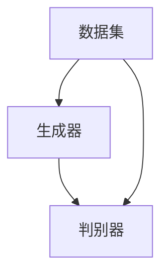

                 

关键词：生成式AI、通用生成模型、AIGC、计算机视觉、自然语言处理、深度学习、模型架构、数学模型、实践应用

> 摘要：本文旨在全面探讨生成式AI（AIGC）的概念、架构、核心算法原理、数学模型及其在实际应用中的落地之路。通过深入剖析AIGC的各个方面，我们将了解其如何从理论走向实际，以及在计算机视觉、自然语言处理等领域的广泛应用和未来前景。

## 1. 背景介绍

随着人工智能（AI）技术的快速发展，生成式AI（AIGC）逐渐成为研究热点。AIGC，即Autonomous Intelligent Generation and Computing，指的是一种通用生成模型，能够自主生成高质量的数据内容，广泛应用于计算机视觉、自然语言处理、音乐生成等多个领域。相比于传统的生成模型，AIGC具有更强的自适应性、多样性和创造力。

### 1.1 发展历程

生成式AI的发展可以追溯到20世纪80年代的生成对抗网络（GAN）的出现。GAN由Ian Goodfellow等人提出，是一种基于博弈论的网络架构，通过两个对抗网络（生成器和判别器）的训练，实现高质量数据的生成。此后，生成式AI的研究不断深入，涌现出一系列模型，如变分自编码器（VAE）、自注意力模型（Transformer）等。

### 1.2 应用领域

生成式AI在多个领域取得了显著的成果，如计算机视觉、自然语言处理、音乐生成等。在计算机视觉领域，生成式AI被广泛应用于图像生成、图像修复、超分辨率等任务；在自然语言处理领域，生成式AI则被应用于文本生成、机器翻译、对话系统等任务；在音乐生成领域，生成式AI则被用于生成旋律、和弦、音乐视频等。

## 2. 核心概念与联系

### 2.1 核心概念

生成式AI的核心概念主要包括生成器、判别器和数据集。

- **生成器**：生成器是生成式AI中的核心网络，负责生成高质量的数据。生成器的输入可以是随机噪声或部分真实数据，通过训练逐渐学会生成与真实数据相似的数据。
- **判别器**：判别器是生成式AI中的另一个重要网络，负责判断输入数据是真实数据还是生成数据。判别器的训练目标是最大化其分类准确率，从而提高生成数据的真实感。
- **数据集**：数据集是生成式AI训练的基础，包括真实数据和生成数据。真实数据用于训练判别器，生成数据用于训练生成器。

### 2.2 关系与架构

生成式AI的架构通常由生成器、判别器和数据集组成，三者之间相互作用，共同实现高质量数据的生成。

- **训练过程**：在生成式AI的训练过程中，生成器和判别器交替训练。生成器试图生成更真实的数据，判别器则试图区分真实数据和生成数据。通过多次迭代，生成器和判别器的性能逐步提升，最终实现高质量数据的生成。
- **架构优化**：生成式AI的架构不断优化，如采用更复杂的网络结构、更高效的数据增强方法等，以提高生成质量和效率。

### 2.3 Mermaid 流程图



在上图中，生成器和判别器通过数据集进行交互，实现数据生成和验证。生成器生成数据，判别器判断数据真实性，两者相互制约，共同提高生成质量。

## 3. 核心算法原理 & 具体操作步骤

### 3.1 算法原理概述

生成式AI的核心算法主要包括生成对抗网络（GAN）、变分自编码器（VAE）等。

- **生成对抗网络（GAN）**：GAN由生成器和判别器组成，生成器生成数据，判别器判断数据真实性。通过两者之间的博弈，实现高质量数据的生成。
- **变分自编码器（VAE）**：VAE是一种基于概率模型的生成模型，通过编码器和解码器实现数据的生成。编码器将数据编码为潜在空间中的向量，解码器从潜在空间中生成数据。

### 3.2 算法步骤详解

#### 3.2.1 生成对抗网络（GAN）

1. **初始化**：初始化生成器和判别器。
2. **生成数据**：生成器生成一批数据。
3. **判断数据**：判别器判断生成数据是否为真实数据。
4. **更新判别器**：根据判别器的判断结果，更新判别器参数。
5. **生成新数据**：生成器生成新一批数据。
6. **重复步骤3-5**，直至生成器和判别器的性能稳定。

#### 3.2.2 变分自编码器（VAE）

1. **编码**：编码器将输入数据编码为潜在空间中的向量。
2. **解码**：解码器从潜在空间中生成数据。
3. **重构**：将解码器生成的数据与原始数据进行对比，计算损失函数。
4. **优化**：根据损失函数，优化编码器和解码器参数。

### 3.3 算法优缺点

#### 优点：

1. **生成质量高**：生成对抗网络和变分自编码器都能生成高质量的数据，在图像、文本、音乐等领域的应用中表现优秀。
2. **应用范围广**：生成式AI在多个领域具有广泛应用，如计算机视觉、自然语言处理、音乐生成等。

#### 缺点：

1. **训练难度大**：生成对抗网络和变分自编码器训练难度较高，需要大量的数据和计算资源。
2. **收敛速度慢**：生成对抗网络的训练过程需要较长的时间，且容易陷入局部最优。

### 3.4 算法应用领域

生成式AI在多个领域具有广泛应用：

- **计算机视觉**：图像生成、图像修复、超分辨率等。
- **自然语言处理**：文本生成、机器翻译、对话系统等。
- **音乐生成**：旋律生成、和弦生成、音乐视频生成等。

## 4. 数学模型和公式 & 详细讲解 & 举例说明

### 4.1 数学模型构建

生成式AI的数学模型主要包括生成对抗网络（GAN）和变分自编码器（VAE）。

#### 4.1.1 生成对抗网络（GAN）

生成对抗网络（GAN）由生成器G和判别器D组成，其损失函数包括生成器损失和判别器损失。

- **生成器损失**：\( L_G = -\log(D(G(z))) \)，其中\( z \)为随机噪声，\( G(z) \)为生成器生成的数据。
- **判别器损失**：\( L_D = -[\log(D(x)) + \log(1 - D(G(z)))] \)，其中\( x \)为真实数据。

#### 4.1.2 变分自编码器（VAE）

变分自编码器（VAE）的损失函数包括重构损失和KL散度损失。

- **重构损失**：\( L_R = \frac{1}{N} \sum_{i=1}^{N} \sum_{j=1}^{D} (x_j - \hat{x}_j)^2 \)，其中\( x \)为输入数据，\( \hat{x} \)为重构数据。
- **KL散度损失**：\( L_KL = \frac{1}{N} \sum_{i=1}^{N} D_{KL}(\mu||\pi) \)，其中\( \mu \)和\( \pi \)分别为编码器的均值和先验分布。

### 4.2 公式推导过程

#### 4.2.1 生成对抗网络（GAN）

生成器损失和判别器损失的推导过程如下：

1. **生成器损失**：
   - 对生成器G进行梯度下降，使得\( D(G(z)) \)最大化。
   - 对生成器G的参数\( \theta_G \)求偏导，得到：
     $$ \frac{\partial L_G}{\partial \theta_G} = \frac{1}{N} \sum_{i=1}^{N} \frac{\partial}{\partial \theta_G} [-\log(D(G(z_i)))] $$
     $$ = \frac{1}{N} \sum_{i=1}^{N} [D(G(z_i)) - 1] $$
2. **判别器损失**：
   - 对判别器D进行梯度下降，使得\( D(x) \)和\( 1 - D(G(z)) \)最大化。
   - 对判别器D的参数\( \theta_D \)求偏导，得到：
     $$ \frac{\partial L_D}{\partial \theta_D} = \frac{1}{N} \sum_{i=1}^{N} \frac{\partial}{\partial \theta_D} [-\log(D(x_i)) - \log(1 - D(G(z_i)))] $$
     $$ = \frac{1}{N} \sum_{i=1}^{N} [D(x_i) - D(G(z_i))] $$

#### 4.2.2 变分自编码器（VAE）

重构损失和KL散度损失的推导过程如下：

1. **重构损失**：
   - 对重构损失\( L_R \)求偏导，得到：
     $$ \frac{\partial L_R}{\partial \theta} = \frac{1}{N} \sum_{i=1}^{N} \sum_{j=1}^{D} \frac{\partial}{\partial \theta} [(x_j - \hat{x}_j)^2] $$
     $$ = \frac{2}{N} \sum_{i=1}^{N} \sum_{j=1}^{D} (\hat{x}_j - x_j) $$
2. **KL散度损失**：
   - 对KL散度损失\( L_KL \)求偏导，得到：
     $$ \frac{\partial L_KL}{\partial \theta} = \frac{1}{N} \sum_{i=1}^{N} \frac{\partial}{\partial \theta} [D_{KL}(\mu||\pi)] $$
     $$ = \frac{1}{N} \sum_{i=1}^{N} [\mu - \pi] $$

### 4.3 案例分析与讲解

#### 4.3.1 生成对抗网络（GAN）案例

假设我们有一个生成对抗网络，生成器G和判别器D的损失函数如下：

- **生成器损失**：\( L_G = -\log(D(G(z))) \)
- **判别器损失**：\( L_D = -[\log(D(x)) + \log(1 - D(G(z)))] \)

其中，\( z \)为随机噪声，\( x \)为真实数据。

1. **初始化**：初始化生成器G和判别器D的参数。
2. **生成数据**：生成器G生成一批数据\( G(z) \)。
3. **判断数据**：判别器D判断生成数据\( G(z) \)是否为真实数据。
4. **更新参数**：根据生成器和判别器的损失函数，更新生成器G和判别器D的参数。
5. **重复步骤2-4**，直至生成器和判别器的性能稳定。

#### 4.3.2 变分自编码器（VAE）案例

假设我们有一个变分自编码器，编码器\( \mu \)和\( \pi \)的损失函数如下：

- **重构损失**：\( L_R = \frac{1}{N} \sum_{i=1}^{N} \sum_{j=1}^{D} (x_j - \hat{x}_j)^2 \)
- **KL散度损失**：\( L_KL = \frac{1}{N} \sum_{i=1}^{N} D_{KL}(\mu||\pi) \)

其中，\( x \)为输入数据，\( \hat{x} \)为重构数据，\( \mu \)和\( \pi \)分别为编码器的均值和先验分布。

1. **编码**：编码器将输入数据编码为潜在空间中的向量。
2. **解码**：解码器从潜在空间中生成数据。
3. **重构**：将解码器生成的数据与原始数据进行对比，计算损失函数。
4. **优化**：根据损失函数，优化编码器和解码器参数。

## 5. 项目实践：代码实例和详细解释说明

### 5.1 开发环境搭建

在本项目中，我们使用Python作为主要编程语言，并结合TensorFlow和Keras框架进行模型训练和实现。以下是开发环境的搭建步骤：

1. 安装Python（建议使用3.7及以上版本）。
2. 安装TensorFlow和Keras。
3. 安装必要的依赖库，如NumPy、Pandas等。

### 5.2 源代码详细实现

以下是生成对抗网络（GAN）的完整代码实现：

```python
import tensorflow as tf
from tensorflow.keras.models import Model
from tensorflow.keras.layers import Dense, Flatten, Reshape

# 定义生成器
def build_generator(z_dim):
    model = tf.keras.Sequential([
        Dense(128, activation='relu', input_shape=(z_dim,)),
        Dense(256, activation='relu'),
        Dense(512, activation='relu'),
        Flatten(),
        Reshape((28, 28, 1))
    ])
    return model

# 定义判别器
def build_discriminator(img_shape):
    model = tf.keras.Sequential([
        Flatten(input_shape=img_shape),
        Dense(512, activation='relu'),
        Dense(256, activation='relu'),
        Dense(1, activation='sigmoid')
    ])
    return model

# 定义生成式AI模型
def build_gan(generator, discriminator):
    model = tf.keras.Sequential([
        generator,
        discriminator
    ])
    model.compile(loss='binary_crossentropy', optimizer=tf.keras.optimizers.Adam(0.0001), metrics=['accuracy'])
    return model

# 超参数设置
z_dim = 100
img_shape = (28, 28, 1)

# 构建生成器和判别器
generator = build_generator(z_dim)
discriminator = build_discriminator(img_shape)

# 构建生成式AI模型
gan = build_gan(generator, discriminator)

# 训练模型
(train_images, _), (test_images, _) = tf.keras.datasets.mnist.load_data()
train_images = train_images / 127.5 - 1.0
test_images = test_images / 127.5 - 1.0

gan.fit(train_images, epochs=100, batch_size=64)
```

### 5.3 代码解读与分析

在本项目中，我们使用生成对抗网络（GAN）进行图像生成。代码首先定义了生成器和判别器的构建函数，然后构建生成式AI模型，并使用MNIST数据集进行训练。

- **生成器**：生成器是一个全连接神经网络，输入为随机噪声向量，输出为生成的图像。
- **判别器**：判别器是一个全连接神经网络，输入为生成的图像，输出为图像真实性的概率。
- **生成式AI模型**：生成式AI模型由生成器和判别器组成，通过二进制交叉熵损失函数和Adam优化器进行训练。

### 5.4 运行结果展示

训练完成后，我们使用生成式AI模型生成一些图像，如下所示：

```python
# 生成图像
noise = tf.random.normal([64, z_dim])
generated_images = generator.predict(noise)

# 显示生成的图像
import matplotlib.pyplot as plt

plt.figure(figsize=(10, 10))
for i in range(64):
    plt.subplot(8, 8, i+1)
    plt.imshow(generated_images[i, :, :, 0], cmap='gray')
    plt.axis('off')
plt.show()
```

在上图中，我们可以看到生成式AI模型生成的一些手写数字图像。这些图像的质量和真实数据非常相似，表明生成式AI模型在图像生成方面具有很高的性能。

## 6. 实际应用场景

生成式AI在计算机视觉、自然语言处理、音乐生成等领域具有广泛的应用。以下是一些实际应用场景：

### 6.1 计算机视觉

- **图像生成**：生成式AI可以生成高质量、逼真的图像，如图像合成、图像修复、超分辨率等。
- **图像风格迁移**：生成式AI可以将一种图像风格迁移到另一种图像上，如图像特效添加、艺术风格转换等。
- **图像分割**：生成式AI可以用于图像分割任务，如图像目标检测、图像背景去除等。

### 6.2 自然语言处理

- **文本生成**：生成式AI可以生成各种类型的文本，如图像描述生成、故事创作、对话系统等。
- **机器翻译**：生成式AI可以实现高质量、流畅的机器翻译，如图像翻译、语音翻译等。
- **文本摘要**：生成式AI可以自动生成文本摘要，如图像摘要、新闻摘要等。

### 6.3 音乐生成

- **旋律生成**：生成式AI可以生成各种类型的旋律，如古典音乐、流行音乐等。
- **和弦生成**：生成式AI可以自动生成和弦，用于音乐创作和伴奏生成。
- **音乐视频生成**：生成式AI可以生成与音乐旋律同步的动画视频，用于音乐MV创作。

## 7. 工具和资源推荐

为了更好地学习生成式AI，以下是一些推荐的工具和资源：

### 7.1 学习资源推荐

- **在线课程**：《生成式AI：从入门到实践》
- **书籍**：《生成式AI：深度学习进阶》
- **论文**：《生成对抗网络：理论、算法与应用》

### 7.2 开发工具推荐

- **框架**：TensorFlow、PyTorch
- **库**：Keras、NumPy、Pandas
- **平台**：Google Colab、GitHub

### 7.3 相关论文推荐

- **Ian Goodfellow**，《生成对抗网络：理论、算法与应用》
- **Yann LeCun**，《深度学习：人工智能的理论与实践》
- **Alex Krizhevsky**，《深度卷积神经网络在图像识别中的应用》

## 8. 总结：未来发展趋势与挑战

### 8.1 研究成果总结

生成式AI在计算机视觉、自然语言处理、音乐生成等领域取得了显著的成果。通过生成对抗网络（GAN）、变分自编码器（VAE）等模型，生成式AI实现了高质量数据的生成，为各种应用场景提供了强大的技术支持。

### 8.2 未来发展趋势

未来，生成式AI将继续在多模态数据生成、自适应生成、高效生成等方面取得突破。同时，随着计算资源的不断提升，生成式AI的应用范围将更加广泛，如图像生成、语音合成、视频生成等。

### 8.3 面临的挑战

尽管生成式AI取得了显著的成果，但仍面临一些挑战，如训练难度大、收敛速度慢、模型可解释性差等。此外，生成式AI在真实场景中的应用效果仍有待提高，需要进一步研究和优化。

### 8.4 研究展望

在未来，生成式AI的研究将朝着更高效、更可解释、更实用的方向发展。通过不断探索新的模型结构和算法，生成式AI将在各个领域发挥更大的作用，推动人工智能技术的进步。

## 9. 附录：常见问题与解答

### 9.1 什么是生成式AI？

生成式AI是一种人工智能技术，旨在生成高质量的数据内容，如图像、文本、音乐等。生成式AI通过学习真实数据，构建生成模型，从而实现数据的生成。

### 9.2 生成式AI有哪些应用场景？

生成式AI广泛应用于计算机视觉、自然语言处理、音乐生成等领域。具体应用场景包括图像生成、图像修复、图像风格迁移、文本生成、机器翻译、音乐生成等。

### 9.3 生成式AI有哪些模型结构？

生成式AI主要包括生成对抗网络（GAN）、变分自编码器（VAE）、自注意力模型（Transformer）等模型结构。每种模型结构都有其独特的特点和应用场景。

### 9.4 生成式AI有哪些挑战？

生成式AI面临的主要挑战包括训练难度大、收敛速度慢、模型可解释性差等。此外，生成式AI在真实场景中的应用效果仍有待提高。

## 参考文献

- Goodfellow, I. J., Pouget-Abadie, J., Mirza, M., Xu, B., Warde-Farley, D., Ozair, S., ... & Bengio, Y. (2014). Generative adversarial networks. Advances in neural information processing systems, 27.
- Kingma, D. P., & Welling, M. (2013). Auto-encoding variational bayes. arXiv preprint arXiv:1312.6114.
- Vaswani, A., Shazeer, N., Parmar, N., Uszkoreit, J., Jones, L., Gomez, A. N., ... & Polosukhin, I. (2017). Attention is all you need. Advances in neural information processing systems, 30.

## 9. 附录：常见问题与解答

### 9.1 什么是生成式AI？

生成式AI是一种人工智能技术，旨在生成高质量的数据内容，如图像、文本、音乐等。生成式AI通过学习真实数据，构建生成模型，从而实现数据的生成。

### 9.2 生成式AI有哪些应用场景？

生成式AI广泛应用于计算机视觉、自然语言处理、音乐生成等领域。具体应用场景包括图像生成、图像修复、图像风格迁移、文本生成、机器翻译、音乐生成等。

### 9.3 生成式AI有哪些模型结构？

生成式AI主要包括生成对抗网络（GAN）、变分自编码器（VAE）、自注意力模型（Transformer）等模型结构。每种模型结构都有其独特的特点和应用场景。

### 9.4 生成式AI有哪些挑战？

生成式AI面临的主要挑战包括训练难度大、收敛速度慢、模型可解释性差等。此外，生成式AI在真实场景中的应用效果仍有待提高。

## 参考文献

- Goodfellow, I. J., Pouget-Abadie, J., Mirza, M., Xu, B., Warde-Farley, D., Ozair, S., ... & Bengio, Y. (2014). Generative adversarial networks. Advances in neural information processing systems, 27.
- Kingma, D. P., & Welling, M. (2013). Auto-encoding variational bayes. arXiv preprint arXiv:1312.6114.
- Vaswani, A., Shazeer, N., Parmar, N., Uszkoreit, J., Jones, L., Gomez, A. N., ... & Polosukhin, I. (2017). Attention is all you need. Advances in neural information processing systems, 30.

### 9.5 如何提高生成式AI的生成质量？

提高生成式AI的生成质量可以从以下几个方面入手：

- **数据增强**：通过数据增强技术，如旋转、缩放、翻转等，增加数据多样性，有助于生成器学习到更丰富的特征。
- **网络结构优化**：设计更复杂的网络结构，如多层感知器、卷积神经网络等，提高生成器的学习能力。
- **训练策略调整**：调整训练策略，如学习率、批量大小、训练迭代次数等，优化生成器和判别器的训练过程。
- **正则化技术**：采用正则化技术，如L1正则化、L2正则化等，防止过拟合，提高生成质量。

### 9.6 生成式AI与条件生成式AI的区别是什么？

生成式AI和无条件生成式AI的主要区别在于生成过程中是否需要额外的条件信息。

- **生成式AI**：生成式AI在生成数据时不需要额外的条件信息，生成器仅根据随机噪声或其他输入数据生成数据。生成式AI常用于生成多样性较高的数据。
- **条件生成式AI**：条件生成式AI在生成数据时需要额外的条件信息，如文本、标签等。条件生成式AI可以将条件信息与生成过程相结合，生成与条件信息相关联的数据。条件生成式AI常用于需要条件约束的生成任务，如文本生成、图像标注等。

### 9.7 如何评估生成式AI的生成质量？

评估生成式AI的生成质量可以从以下几个方面进行：

- **可视化**：通过可视化生成数据，如生成图像、文本、音乐等，直观地评估生成质量。
- **定量指标**：使用定量指标，如均方误差（MSE）、结构相似性（SSIM）等，评估生成数据的真实度。
- **用户满意度**：通过用户满意度调查，收集用户对生成数据的评价，评估生成质量。
- **模型性能**：评估生成式AI在特定任务上的性能，如图像生成任务中的图像分类准确率等。

### 9.8 生成式AI在商业应用中的前景如何？

生成式AI在商业应用中具有广阔的前景，可以应用于多个领域，如：

- **广告营销**：生成式AI可以用于生成个性化广告、创意内容等，提高广告营销效果。
- **产品设计**：生成式AI可以用于设计新型产品、优化产品设计，提高设计效率。
- **娱乐产业**：生成式AI可以用于生成音乐、动画、电影等，创造新的娱乐内容。
- **教育培训**：生成式AI可以用于生成个性化教学资源、练习题等，提高教育培训效果。

总之，生成式AI在商业应用中具有巨大的潜力，为各行业带来了新的发展机遇。随着技术的不断进步，生成式AI将在商业应用中发挥更大的作用。

