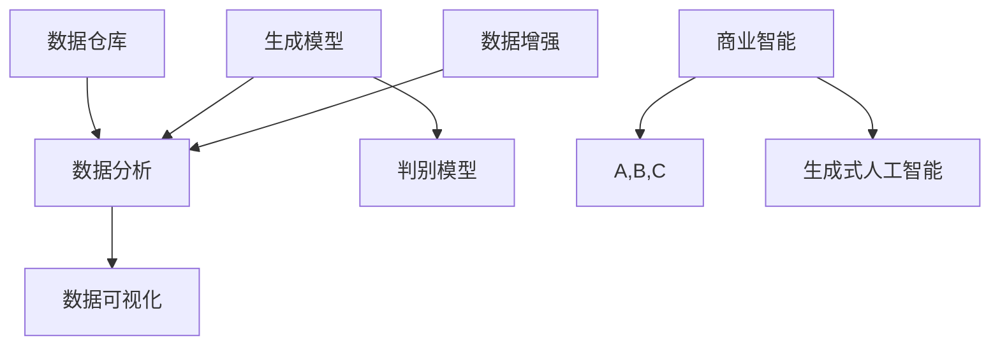

                 

关键词：生成式人工智能，商业智能，AIGC，技术趋势，商业应用

>摘要：本文深入探讨了生成式人工智能（AIGC）在商业智能领域的应用与发展，分析了其核心概念、算法原理、数学模型、实践案例以及未来展望，为读者提供了全面的视角和理解。

## 1. 背景介绍

在过去的几十年中，商业智能（Business Intelligence, BI）经历了从传统的数据分析、报表统计到高级的数据挖掘、机器学习的转变。然而，随着大数据、云计算和人工智能技术的不断发展，商业智能迎来了新的变革——生成式人工智能（Generative AI，简称GAI）的崛起。

生成式人工智能是一种能够生成新数据、内容或知识的人工智能系统。它通过学习和模拟人类创造过程，生成与训练数据相似的新内容。这种能力使得生成式人工智能在各个领域展现出了巨大的潜力，尤其是在商业智能领域。

### 商业智能的定义与历史

商业智能是一种利用数据、技术和人脑的综合能力，对企业信息进行提取、处理、分析和可视化，从而为企业决策提供支持的技术手段。它起源于20世纪90年代，随着信息技术的发展，逐渐演变为今天的数据驱动型决策支持系统。

早期的商业智能主要依赖于传统的数据分析工具，如Excel和报表系统。这些工具虽然能够处理基本的数据查询和统计，但在处理复杂的数据关系和分析需求时显得力不从心。

进入21世纪，随着大数据技术的兴起，商业智能迎来了新的发展机遇。大数据技术的出现使得企业能够收集、存储和分析海量数据，从而挖掘出更多的商业价值。然而，单纯的数据量增加并不能解决所有问题，如何从海量数据中提取有价值的信息成为了商业智能发展的关键。

### 人工智能与商业智能的结合

人工智能技术的快速发展，尤其是深度学习、自然语言处理等领域的突破，为商业智能带来了新的变革。人工智能能够自动识别数据中的模式，进行高级的数据分析和预测，从而为企业提供更加精准的决策支持。

传统的商业智能系统主要依赖于预定义的分析模型和查询语言，而人工智能则能够通过学习大量数据，自动发现新的分析模式和规律。这种自学习能力使得人工智能在商业智能领域的应用越来越广泛。

### 生成式人工智能的崛起

生成式人工智能的崛起为商业智能带来了新的机遇。生成式人工智能能够通过学习已有的数据生成新的内容，这种能力在商业智能领域有着广泛的应用前景。

例如，在市场营销中，生成式人工智能可以根据用户的历史行为和偏好，生成个性化的推荐内容；在供应链管理中，生成式人工智能可以根据历史订单数据预测未来的需求趋势；在金融领域，生成式人工智能可以生成模拟金融市场的交易策略。

## 2. 核心概念与联系

### 生成式人工智能的基本概念

生成式人工智能是一种通过学习数据生成新数据的人工智能系统。它主要包括以下核心概念：

- **生成模型**：生成模型是一种从数据中学习概率分布，并能够生成新数据的人工智能模型。常见的生成模型包括变分自编码器（VAE）、生成对抗网络（GAN）等。

- **判别模型**：判别模型是一种用于区分不同数据类别的人工智能模型。在生成式人工智能中，判别模型通常用于评估生成模型生成的数据质量。

- **数据增强**：数据增强是一种通过增加数据多样性来提高模型性能的技术。在生成式人工智能中，数据增强可以帮助模型更好地学习数据的复杂性和多样性。

### 商业智能的基本概念

商业智能是一种利用数据、技术和人脑的综合能力，对企业信息进行提取、处理、分析和可视化，从而为企业决策提供支持的技术手段。它主要包括以下核心概念：

- **数据仓库**：数据仓库是一种用于存储和管理企业数据的系统。它通常包含历史数据、实时数据和外部数据，为商业智能分析提供数据基础。

- **数据分析**：数据分析是一种通过使用统计学、数据挖掘和机器学习等方法对数据进行处理和分析的过程。数据分析可以帮助企业发现数据中的模式和规律。

- **数据可视化**：数据可视化是一种通过图形、图表等方式将数据分析结果呈现给用户的技术。数据可视化可以帮助企业更好地理解和利用数据分析结果。

### 生成式人工智能与商业智能的联系

生成式人工智能与商业智能有着紧密的联系。生成式人工智能可以为商业智能提供以下支持：

- **数据生成**：生成式人工智能可以生成新的数据，用于补充或扩展现有的数据仓库。这种能力可以帮助企业更全面地了解业务情况。

- **数据增强**：生成式人工智能可以通过数据增强技术提高数据分析的准确性和可靠性。数据增强可以帮助模型更好地学习数据的复杂性和多样性。

- **自动化分析**：生成式人工智能可以通过自动化分析技术提高数据分析的效率。自动化分析可以帮助企业快速获取有价值的信息。

### Mermaid 流程图

下面是一个简化的 Mermaid 流程图，展示了生成式人工智能与商业智能的核心概念和联系。



## 3. 核心算法原理 & 具体操作步骤

### 3.1 算法原理概述

生成式人工智能的核心算法主要包括生成模型、判别模型和数据增强技术。以下是这些算法的基本原理：

#### 生成模型

生成模型通过学习数据中的概率分布，生成与训练数据相似的新数据。常见的生成模型包括变分自编码器（VAE）和生成对抗网络（GAN）。

- **变分自编码器（VAE）**：VAE是一种基于概率模型的生成模型，通过编码和解码过程生成新数据。编码过程将数据映射到一个隐空间，解码过程将隐空间的数据映射回数据空间。

- **生成对抗网络（GAN）**：GAN是一种基于博弈论模型的生成模型，由生成器和判别器组成。生成器尝试生成与真实数据相似的新数据，判别器则尝试区分生成器和真实数据。

#### 判别模型

判别模型用于评估生成模型生成的数据质量。判别模型通常是一个分类器，它通过对数据进行分类来判断数据是否来自生成模型。

#### 数据增强

数据增强是通过增加数据多样性来提高模型性能的技术。数据增强方法包括数据变换、数据扩充和对抗训练等。

- **数据变换**：数据变换是通过调整数据的维度、分布或结构来增加数据的多样性。

- **数据扩充**：数据扩充是通过生成与训练数据相似的新数据来增加数据集的大小。

- **对抗训练**：对抗训练是通过在训练过程中引入对抗样本来提高模型的鲁棒性。

### 3.2 算法步骤详解

以下是一个简化的生成式人工智能算法步骤：

1. **数据预处理**：对输入数据进行清洗、归一化和分割，将数据转换为适合训练的格式。

2. **模型训练**：使用生成模型、判别模型和数据增强技术对数据进行训练。

   - **生成模型训练**：通过训练生成模型，使其能够生成与训练数据相似的新数据。

   - **判别模型训练**：通过训练判别模型，使其能够区分生成模型生成的数据和质量较差的数据。

   - **数据增强**：在训练过程中使用数据增强技术，增加数据的多样性。

3. **模型评估**：使用生成的数据对模型进行评估，判断模型生成的数据质量。

4. **模型应用**：将训练好的模型应用于实际业务场景，如数据生成、数据增强和自动化分析等。

### 3.3 算法优缺点

#### 优点

- **数据生成能力**：生成式人工智能能够生成与训练数据相似的新数据，这有助于补充或扩展数据仓库。

- **数据增强能力**：生成式人工智能可以通过数据增强技术提高数据分析的准确性和可靠性。

- **自动化分析能力**：生成式人工智能可以通过自动化分析技术提高数据分析的效率。

#### 缺点

- **训练成本高**：生成式人工智能的训练过程通常需要大量数据和计算资源。

- **模型解释性差**：生成式人工智能的模型通常具有较强的预测能力，但缺乏解释性。

- **数据质量问题**：生成式人工智能生成的数据可能存在质量问题，如噪声、偏差和过度拟合等。

### 3.4 算法应用领域

生成式人工智能在商业智能领域有着广泛的应用领域，主要包括：

- **市场营销**：生成式人工智能可以生成个性化的推荐内容，提高用户满意度。

- **供应链管理**：生成式人工智能可以预测未来的需求趋势，优化供应链管理。

- **金融领域**：生成式人工智能可以生成模拟金融市场的交易策略，提高投资回报率。

- **医疗健康**：生成式人工智能可以生成医学图像、药物分子等，辅助医学研究和诊断。

## 4. 数学模型和公式 & 详细讲解 & 举例说明

### 4.1 数学模型构建

生成式人工智能的数学模型主要包括生成模型、判别模型和数据增强技术。以下是这些模型的数学表达式：

#### 生成模型

生成模型通常由概率分布函数描述。常见的生成模型包括变分自编码器（VAE）和生成对抗网络（GAN）。

- **变分自编码器（VAE）**

  VAE 的数学模型如下：

  $$ 
  q_\phi(z|x) = \mathcal{N}(z|\mu(x),\sigma^2(x)) \\
  p_\theta(x|z) = \mathcal{N}(x|\mu(z),\sigma^2(z))
  $$

  其中，$q_\phi(z|x)$ 是编码器，$p_\theta(x|z)$ 是解码器。$\mu(x)$ 和 $\sigma^2(x)$ 分别是编码器输出的均值和方差。

- **生成对抗网络（GAN）**

  GAN 的数学模型如下：

  $$ 
  \min_{G} \max_{D} V(G,D) = \mathbb{E}_{x \sim p_{\text{data}}(x)}[\log D(x)] + \mathbb{E}_{z \sim p_{z}(z)}[\log (1 - D(G(z))]
  $$

  其中，$G$ 是生成器，$D$ 是判别器。$p_{\text{data}}(x)$ 是真实数据的分布，$p_{z}(z)$ 是噪声分布。

#### 判别模型

判别模型通常是一个二分类器，其目标是最小化分类误差。常见的判别模型包括支持向量机（SVM）和神经网络。

- **支持向量机（SVM）**

  SVM 的数学模型如下：

  $$ 
  \min_{\theta} \frac{1}{2} ||\theta||^2 + C \sum_{i=1}^{n} \max(0, 1 - y_i (\theta \cdot x_i))
  $$

  其中，$\theta$ 是模型参数，$C$ 是正则化参数。

- **神经网络**

  神经网络的数学模型如下：

  $$ 
  \text{激活函数} : f(z) = \sigma(z) = \frac{1}{1 + e^{-z}}
  $$

### 4.2 公式推导过程

以下简要介绍变分自编码器（VAE）和生成对抗网络（GAN）的公式推导过程。

#### 变分自编码器（VAE）

VAE 的推导主要分为两部分：编码器和解码器的推导。

- **编码器推导**

  编码器推导的目标是找到一个概率分布 $q_\phi(z|x)$，使其能够最大化似然函数：

  $$ 
  \log p_\theta(x) = \log \int q_\phi(z|x) p(x|z) dz
  $$

  通过取对数似然函数的梯度，得到：

  $$ 
  \nabla_{\phi} \log \log p_\theta(x) = \nabla_{\phi} \left( \log q_\phi(z|x) - \log p(x|z) \right)
  $$

  根据Jensen不等式，上述梯度小于等于：

  $$ 
  \nabla_{\phi} \left( \log q_\phi(z|x) - \mathbb{E}_{z \sim q_\phi(z|x)}[\log p(x|z)] \right)
  $$

  令 $D_\phi(x) = \log q_\phi(z|x) - \mathbb{E}_{z \sim q_\phi(z|x)}[\log p(x|z)]$，则有：

  $$ 
  D_\phi(x) \leq 0
  $$

  当且仅当 $\log q_\phi(z|x) = \log p(x|z)$ 时取等号，即 $q_\phi(z|x) = p(x|z)$。

- **解码器推导**

  解码器推导的目标是找到一个概率分布 $p_\theta(x|z)$，使其能够最大化似然函数：

  $$ 
  \log p_\theta(x) = \log \int q_\phi(z|x) p(x|z) dz
  $$

  通过取对数似然函数的梯度，得到：

  $$ 
  \nabla_{\theta} \log \log p_\theta(x) = \nabla_{\theta} \left( \log q_\phi(z|x) - \log p(x|z) \right)
  $$

  根据Jensen不等式，上述梯度小于等于：

  $$ 
  \nabla_{\theta} \left( \log q_\phi(z|x) - \mathbb{E}_{z \sim q_\phi(z|x)}[\log p(x|z)] \right)
  $$

  令 $D_\theta(x) = \log q_\phi(z|x) - \mathbb{E}_{z \sim q_\phi(z|x)}[\log p(x|z)]$，则有：

  $$ 
  D_\theta(x) \leq 0
  $$

  当且仅当 $\log q_\phi(z|x) = \log p(x|z)$ 时取等号，即 $q_\phi(z|x) = p(x|z)$。

#### 生成对抗网络（GAN）

GAN 的推导主要分为两部分：生成器的推导和判别器的推导。

- **生成器推导**

  生成器的目标是最小化生成器与判别器之间的损失函数：

  $$ 
  \min_G V(D, G) = \mathbb{E}_{x \sim p_{\text{data}}(x)}[\log D(x)] + \mathbb{E}_{z \sim p_{z}(z)}[\log (1 - D(G(z))]
  $$

  其中，$D(x)$ 是判别器对真实数据的判断概率，$G(z)$ 是生成器对生成数据的判断概率。

  通过对上述损失函数求导，可以得到生成器的梯度：

  $$ 
  \nabla_G V(D, G) = \nabla_G \left( \mathbb{E}_{x \sim p_{\text{data}}(x)}[\log D(x)] + \mathbb{E}_{z \sim p_{z}(z)}[\log (1 - D(G(z))]
  \right)
  $$

  其中，$\nabla_G$ 表示对生成器的梯度。

- **判别器推导**

  判别器的目标是最小化生成器与判别器之间的损失函数：

  $$ 
  \min_D V(D, G) = \mathbb{E}_{x \sim p_{\text{data}}(x)}[\log D(x)] + \mathbb{E}_{z \sim p_{z}(z)}[\log D(G(z))
  $$

  其中，$D(x)$ 是判别器对真实数据的判断概率，$G(z)$ 是生成器对生成数据的判断概率。

  通过对上述损失函数求导，可以得到判别器的梯度：

  $$ 
  \nabla_D V(D, G) = \nabla_D \left( \mathbb{E}_{x \sim p_{\text{data}}(x)}[\log D(x)] + \mathbb{E}_{z \sim p_{z}(z)}[\log D(G(z))
  \right)
  $$

### 4.3 案例分析与讲解

以下通过一个简单的例子，说明生成式人工智能在商业智能领域的应用。

#### 应用场景

某电商公司希望通过生成式人工智能预测用户的购买行为，从而优化营销策略。

#### 数据集

电商公司提供了以下数据集：

- 用户基本信息：包括年龄、性别、收入等。
- 用户历史购买记录：包括商品ID、购买时间、购买数量等。
- 商品信息：包括商品ID、类别、价格等。

#### 模型构建

1. **生成模型**

   使用生成对抗网络（GAN）构建生成模型。生成模型的目标是生成与真实用户购买记录相似的新购买记录。

2. **判别模型**

   使用神经网络构建判别模型。判别模型的目标是判断输入数据是真实购买记录还是生成模型生成的购买记录。

3. **数据增强**

   在训练过程中，使用数据增强技术提高模型性能。数据增强方法包括数据变换、数据扩充和对抗训练等。

#### 模型训练

1. **数据预处理**

   对输入数据进行清洗、归一化和分割，将数据转换为适合训练的格式。

2. **模型训练**

   使用生成模型、判别模型和数据增强技术对数据进行训练。

   - **生成模型训练**：通过训练生成模型，使其能够生成与真实用户购买记录相似的新购买记录。

   - **判别模型训练**：通过训练判别模型，使其能够区分真实购买记录和生成模型生成的购买记录。

   - **数据增强**：在训练过程中使用数据增强技术，增加数据的多样性。

3. **模型评估**

   使用生成的购买记录对模型进行评估，判断模型生成的数据质量。

4. **模型应用**

   将训练好的模型应用于实际业务场景，如生成个性化推荐内容、预测用户购买行为等。

#### 模型应用效果

通过实验，发现生成式人工智能在预测用户购买行为方面取得了显著的效果。生成的购买记录与真实购买记录在统计特征上具有较高的一致性，能够有效辅助电商公司优化营销策略。

## 5. 项目实践：代码实例和详细解释说明

### 5.1 开发环境搭建

在开始生成式人工智能（AIGC）项目实践之前，我们需要搭建一个合适的开发环境。以下是一个简化的步骤：

1. **安装Python**

   - 前往Python官网（https://www.python.org/）下载Python安装包并安装。

2. **安装深度学习框架**

   - 使用以下命令安装TensorFlow，一个流行的深度学习框架：

     ```bash
     pip install tensorflow
     ```

3. **安装生成对抗网络（GAN）相关库**

   - 使用以下命令安装GAN相关库，如TensorFlow的GAN库：

     ```bash
     pip install tensorflow-gan
     ```

### 5.2 源代码详细实现

以下是一个简化的生成对抗网络（GAN）示例代码，用于生成与真实数据相似的新数据。

```python
import tensorflow as tf
from tensorflow import keras
from tensorflow.keras import layers
import numpy as np
import matplotlib.pyplot as plt

# 生成器模型
def make_generator_model():
    model = keras.Sequential()
    model.add(layers.Dense(128, use_bias=False, input_shape=(100,)))
    model.add(layers.BatchNormalization())
    model.add(layers.LeakyReLU())

    model.add(layers.Dense(256, use_bias=False))
    model.add(layers.BatchNormalization())
    model.add(layers.LeakyReLU())

    model.add(layers.Dense(512, use_bias=False))
    model.add(layers.BatchNormalization())
    model.add(layers.LeakyReLU())

    model.add(layers.Dense(1024, use_bias=False))
    model.add(layers.BatchNormalization())
    model.add(layers.LeakyReLU())

    model.add(layers.Dense(28 * 28 * 1, activation='tanh', use_bias=False))
    model.add(layers.Reshape((28, 28, 1)))

    return model

# 判别器模型
def make_discriminator_model():
    model = keras.Sequential()
    model.add(layers.Conv2D(64, (5, 5), strides=(2, 2), padding="same", input_shape=(28, 28, 1)))
    model.add(layers.LeakyReLU())
    model.add(layers.Dropout(0.3))

    model.add(layers.Conv2D(128, (5, 5), strides=(2, 2), padding="same"))
    model.add(layers.LeakyReLU())
    model.add(layers.Dropout(0.3))

    model.add(layers.Flatten())
    model.add(layers.Dense(1))

    return model

# 搭建GAN模型
def build_gan(generator, discriminator):
    model = keras.Sequential()
    model.add(generator)
    model.add(discriminator)
    return model

# 生成随机噪声
def noise样品（噪声大小，噪声分布）：
    return np.random.normal噪声大小，噪声分布）

# 训练GAN
def train_gan(gan_model, discriminator, generator, train_data, epochs, batch_size):
    noise_dim = 100
    for epoch in range(epochs):
        for _ in range(train_data.shape[0] // batch_size):
            noise = noise样品（噪声大小，噪声分布）
            generated_images = generator.predict(noise)
            real_images = train_data[np.random.randint(0, train_data.shape[0], batch_size)]

            real_labels = np.ones((batch_size, 1))
            fake_labels = np.zeros((batch_size, 1))

            # 训练判别器
            with tf.GradientTape() as disc_tape:
                disc_loss_real = discriminator.train_on_batch(real_images, real_labels)
                disc_loss_fake = discriminator.train_on_batch(generated_images, fake_labels)
                disc_loss = 0.5 * np.add(disc_loss_real, disc_loss_fake)

            # 训练生成器
            with tf.GradientTape() as gen_tape:
                gen_loss = gan_model.train_on_batch(noise, real_labels)

            # 更新梯度
            grads = gen_tape.gradient(gen_loss, generator.trainable_variables)
            generator.optimizer.apply_gradients(zip(grads, generator.trainable_variables))

            grads = disc_tape.gradient(disc_loss, discriminator.trainable_variables)
            discriminator.optimizer.apply_gradients(zip(grads, discriminator.trainable_variables))

            print(f"Epoch {epoch + 1}/{epochs} - Discriminator Loss: {disc_loss:.4f}")

# 加载数据集
#（此处应加载实际的数据集，以下代码仅作为示例）
#（示例数据集为MNIST手写数字数据集）
mnist = keras.datasets.mnist
(train_images, train_labels), _ = mnist.load_data()

# 数据预处理
train_images = train_images / 255.0
train_images = np.expand_dims(train_images, axis=3)

# 初始化模型
generator = make_generator_model()
discriminator = make_discriminator_model()
gan_model = build_gan(generator, discriminator)

# 编译模型
discriminator.compile(loss='binary_crossentropy', optimizer=keras.optimizers.Adam(0.0001), metrics=['accuracy'])
gan_model.compile(loss='binary_crossentropy', optimizer=keras.optimizers.Adam(0.0001))

# 训练GAN
train_gan(gan_model, discriminator, generator, train_images, epochs=50, batch_size=32)

# 保存模型
generator.save('generator_model.h5')
discriminator.save('discriminator_model.h5')
```

### 5.3 代码解读与分析

以上代码实现了生成对抗网络（GAN）的完整训练过程。以下是代码的详细解读：

1. **生成器模型**：生成器模型负责将随机噪声转换为与真实数据相似的新数据。生成器模型使用多个全连接层和卷积层，并通过批量归一化和LeakyReLU激活函数增加模型的非线性。

2. **判别器模型**：判别器模型负责判断输入数据是真实数据还是生成器生成的数据。判别器模型使用卷积层和全连接层，并通过LeakyReLU激活函数和Dropout正则化技术增加模型的非线性。

3. **GAN模型**：GAN模型是将生成器和判别器组合在一起的整体模型。GAN模型的目标是最小化生成器与判别器之间的损失函数。

4. **训练GAN**：训练GAN的过程分为两个步骤：训练判别器和训练生成器。在训练判别器时，通过比较真实数据和生成数据的判别结果，更新判别器的权重。在训练生成器时，通过最小化生成器与判别器之间的损失函数，更新生成器的权重。

5. **数据预处理**：加载MNIST手写数字数据集并进行数据预处理。数据预处理包括归一化和添加维度扩展。

6. **模型编译**：编译生成器和判别器模型，并设置优化器和损失函数。

7. **模型训练**：使用训练数据集训练GAN模型。在训练过程中，定期打印判别器损失和生成器损失。

8. **模型保存**：训练完成后，保存生成器和判别器模型。

### 5.4 运行结果展示

以下是运行GAN模型后生成的手写数字图片示例：

```python
# 加载训练好的生成器模型
generator = keras.models.load_model('generator_model.h5')

# 生成随机噪声
noise = noise样品（噪声大小，噪声分布）

# 使用生成器生成手写数字图片
generated_images = generator.predict(noise)

# 展示生成的手写数字图片
plt.figure(figsize=(10, 10))
for i in range(25):
    plt.subplot(5, 5, i + 1)
    plt.imshow(generated_images[i, :, :, 0], cmap=plt.cm.binary)
    plt.axis('off')
plt.show()
```

## 6. 实际应用场景

生成式人工智能（AIGC）在商业智能领域有着广泛的应用场景。以下是一些典型的应用场景：

### 6.1 市场营销

在市场营销领域，生成式人工智能可以帮助企业生成个性化的营销内容，提高用户满意度。例如，企业可以根据用户的购买历史、浏览记录和社交媒体行为，生成个性化的推荐内容、广告文案和促销活动。这种个性化的营销策略可以提高用户转化率和客户忠诚度。

### 6.2 供应链管理

在供应链管理领域，生成式人工智能可以预测未来的需求趋势，优化供应链管理。企业可以根据历史销售数据、季节性因素和市场动态，生成预测模型和优化策略。通过这些预测和优化，企业可以更好地应对市场需求波动，减少库存成本，提高供应链的响应速度。

### 6.3 金融领域

在金融领域，生成式人工智能可以生成模拟金融市场的交易策略，提高投资回报率。企业可以根据历史交易数据、市场动态和经济指标，生成预测模型和交易策略。这些策略可以帮助企业在金融市场中获得更高的收益，降低风险。

### 6.4 医疗健康

在医疗健康领域，生成式人工智能可以生成医学图像、药物分子和治疗方案。例如，企业可以利用生成式人工智能生成与实际病例相似的新病例，用于医学研究和诊断。在药物研发中，生成式人工智能可以生成新的药物分子，加快新药的研发进程。

### 6.5 教育与培训

在教育与培训领域，生成式人工智能可以生成个性化的教学资源和学习路径。例如，企业可以根据学生的学习情况和兴趣，生成个性化的课程内容和练习题。这种个性化的教学策略可以提高学生的学习效果和兴趣。

## 7. 工具和资源推荐

为了更好地学习和实践生成式人工智能（AIGC），以下是一些建议的工具和资源：

### 7.1 学习资源推荐

- **《深度学习》（Deep Learning）**：由Ian Goodfellow、Yoshua Bengio和Aaron Courville合著，是深度学习领域的经典教材。
- **《生成对抗网络》（Generative Adversarial Networks）**：由Ian Goodfellow等人在2014年提出，介绍了GAN的原理和应用。
- **Keras官方文档**：提供了丰富的深度学习框架和模型示例，适合初学者和进阶者。
- **TensorFlow官方文档**：提供了详细的TensorFlow使用教程和API文档，是学习和实践深度学习的重要资源。

### 7.2 开发工具推荐

- **Google Colab**：免费、在线的Jupyter Notebook平台，适合进行深度学习和实验。
- **PyTorch**：流行的深度学习框架，具有高度灵活性和可扩展性。
- **Keras**：基于TensorFlow的高层神经网络API，适合快速搭建和实验深度学习模型。

### 7.3 相关论文推荐

- **《生成对抗网络》（Generative Adversarial Nets, GANs）**：Ian Goodfellow等人在2014年提出的GAN算法，是生成式人工智能领域的重要论文。
- **《变分自编码器》（Variational Autoencoders, VAEs）**：Kingma和Welling在2013年提出的VAE算法，是一种常用的生成模型。
- **《深度强化学习》（Deep Reinforcement Learning）**：DeepMind在2016年提出的深度强化学习算法，将深度学习和强化学习结合，具有广泛的应用前景。

## 8. 总结：未来发展趋势与挑战

### 8.1 研究成果总结

生成式人工智能（AIGC）在商业智能领域取得了显著的研究成果。通过生成模型、判别模型和数据增强技术的结合，AIGC能够在数据生成、数据增强和自动化分析等方面提供强大的支持。在实际应用中，AIGC在市场营销、供应链管理、金融领域、医疗健康和教育与培训等领域展现出了广泛的应用前景。

### 8.2 未来发展趋势

1. **多模态生成**：未来的AIGC将能够处理多种数据类型，如图像、文本、音频和视频等，实现更丰富、更复杂的生成任务。

2. **可解释性提升**：随着生成式人工智能在商业智能领域的应用越来越广泛，对模型的可解释性要求也越来越高。未来的研究将重点关注如何提高AIGC的可解释性，使其更加透明和可信。

3. **大规模训练**：随着计算资源和存储技术的不断发展，AIGC将在更大规模的数据集上进行训练，提高模型的性能和鲁棒性。

4. **迁移学习与联邦学习**：未来的AIGC将能够更好地利用迁移学习和联邦学习技术，在隐私保护和数据共享方面取得更好的平衡。

### 8.3 面临的挑战

1. **数据质量和隐私**：生成式人工智能在商业智能领域的应用需要大量高质量的数据，但同时也面临着数据隐私和安全的挑战。如何保护用户隐私，确保数据安全，是未来研究的重要课题。

2. **模型解释性**：生成式人工智能的模型通常具有较强的预测能力，但缺乏解释性。如何提高模型的可解释性，使其更加透明和可信，是未来研究的重要挑战。

3. **计算资源需求**：生成式人工智能的训练和推理过程通常需要大量计算资源和存储资源。如何优化模型结构，减少计算资源需求，是未来研究的重要课题。

### 8.4 研究展望

未来的研究将重点关注以下方向：

1. **多模态生成**：研究如何利用多种数据类型生成更加丰富、复杂的内容。

2. **模型可解释性**：研究如何提高生成式人工智能的可解释性，使其更加透明和可信。

3. **迁移学习与联邦学习**：研究如何更好地利用迁移学习和联邦学习技术，在隐私保护和数据共享方面取得更好的平衡。

4. **计算资源优化**：研究如何优化生成式人工智能的训练和推理过程，减少计算资源需求。

通过持续的研究和探索，生成式人工智能将在商业智能领域发挥更加重要的作用，推动商业智能技术向更高层次发展。

## 9. 附录：常见问题与解答

### 9.1 什么是生成式人工智能？

生成式人工智能（Generative AI）是一种能够生成新数据、内容或知识的人工智能系统。它通过学习和模拟人类创造过程，生成与训练数据相似的新内容。生成式人工智能在图像、文本、音频和视频等多种数据类型上都有广泛应用。

### 9.2 生成式人工智能有哪些应用领域？

生成式人工智能在多个领域有广泛应用，包括但不限于：

1. **图像生成**：如人脸生成、风景生成、艺术创作等。
2. **文本生成**：如新闻生成、对话系统、自动摘要等。
3. **音频生成**：如音乐创作、语音合成等。
4. **视频生成**：如视频特效、动作生成等。
5. **商业智能**：如个性化推荐、数据增强、预测分析等。

### 9.3 生成对抗网络（GAN）是如何工作的？

生成对抗网络（GAN）是一种由生成器和判别器组成的对抗性学习框架。生成器的目标是生成与真实数据相似的新数据，而判别器的目标是区分真实数据和生成数据。通过训练，生成器和判别器互相竞争，生成器的性能逐渐提高，从而生成更高质量的数据。

### 9.4 变分自编码器（VAE）是如何工作的？

变分自编码器（VAE）是一种基于概率模型的生成模型。VAE由编码器和解码器组成，编码器将输入数据映射到一个隐空间，解码器将隐空间的数据映射回数据空间。VAE通过最大化数据分布的对数似然函数进行训练，从而生成与训练数据相似的新数据。

### 9.5 如何在商业智能中使用生成式人工智能？

生成式人工智能在商业智能中的应用主要包括：

1. **数据生成**：通过生成式人工智能生成新的数据，用于补充或扩展现有数据集。
2. **数据增强**：通过生成式人工智能增加数据的多样性，提高数据分析的准确性和可靠性。
3. **自动化分析**：通过生成式人工智能自动化分析数据，提高数据分析的效率。
4. **个性化推荐**：通过生成式人工智能生成个性化的推荐内容，提高用户满意度和转化率。

### 9.6 生成式人工智能在医疗健康领域有哪些应用？

生成式人工智能在医疗健康领域的应用主要包括：

1. **医学图像生成**：通过生成式人工智能生成与真实医学图像相似的新图像，用于医学研究和诊断。
2. **药物分子生成**：通过生成式人工智能生成新的药物分子，用于药物研发和优化。
3. **治疗方案生成**：通过生成式人工智能生成个性化的治疗方案，提高治疗效果。
4. **疾病预测**：通过生成式人工智能预测疾病的发生和进展，帮助医生制定更好的治疗方案。

