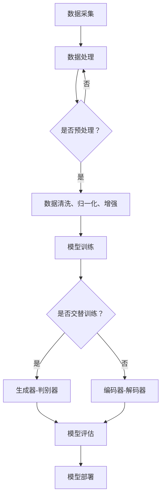

                 

### 背景介绍

在当今这个数字化和信息化迅猛发展的时代，人工智能（AI）技术已经成为了推动社会进步的重要引擎。尤其是近年来，生成式人工智能（Generative AI）以其强大的数据生成能力和智能化的解决方案，正在引发一系列深远的变革。生成式人工智能，通过模仿人类创造力的过程，能够自动生成文本、图像、音频、视频等多种形式的内容，极大地拓展了人工智能的应用边界。

随着生成式人工智能技术的不断成熟，AIGC（AI-Generated Content）逐渐成为了一个备受关注的热门领域。AIGC不仅能够大幅提升内容生成的效率，还能为各行各业带来全新的商业模式和机遇。例如，在广告、媒体、娱乐、设计等领域，AIGC技术已经展示出了巨大的潜力。通过自动化的内容生成，企业能够以更低的成本、更快的速度创造出大量高质量的内容，从而满足日益增长的市场需求。

本文将围绕生成式AIGC的核心概念、算法原理、数学模型、项目实践、应用场景以及未来发展趋势等多个方面展开讨论。通过深入剖析AIGC技术的本质和实现方法，我们希望能够为读者提供一个全面、系统的理解，并探讨其在商业领域的广泛应用前景。

## 文章关键词

- 生成式人工智能
- AIGC
- 商业新生态
- 内容生成
- 算法原理
- 数学模型
- 项目实践
- 应用场景

## 文章摘要

本文旨在探讨生成式人工智能（AIGC）在智能时代商业新生态中的重要作用。首先，文章介绍了AIGC的背景和概念，随后详细阐述了其核心算法原理和数学模型。接着，通过实际项目案例展示了AIGC在内容生成方面的具体应用，并分析了其在不同行业中的应用前景。文章最后总结了AIGC技术的未来发展态势，提出了潜在挑战和展望，为相关领域的研究和应用提供了有价值的参考。

### 背景介绍

生成式人工智能（Generative AI）是一种通过学习大量数据来生成新内容的技术。它能够模仿人类创造力的过程，自动生成文本、图像、音频、视频等多种形式的内容。生成式人工智能的发展可以追溯到深度学习的兴起，尤其是生成对抗网络（GANs）和变分自编码器（VAEs）等模型的提出。这些模型通过复杂的神经网络结构和大量数据训练，能够学习到数据的高层次特征，从而生成逼真、多样化且具有创造性的内容。

生成式人工智能的兴起，源于人类对于大规模数据处理的日益需求。在互联网时代，数据量呈现出爆炸式增长，传统的数据处理方法已经无法满足日益增长的数据处理需求。生成式人工智能通过其强大的数据处理能力，能够自动化地生成大量高质量的数据，极大地提高了数据处理的效率和效果。例如，在图像生成领域，生成式人工智能能够生成逼真的图像，从而辅助图像处理和增强现实技术的应用。

AIGC（AI-Generated Content）是生成式人工智能的一个重要分支，专注于通过人工智能技术生成各种形式的内容。AIGC的应用场景广泛，涵盖了广告、媒体、娱乐、设计等多个领域。例如，在广告领域，AIGC可以通过自动化生成创意广告内容，大幅提高广告制作的效率和创意水平；在媒体领域，AIGC可以帮助新闻机构自动化生成新闻稿件，提高新闻报道的及时性和准确性；在娱乐领域，AIGC可以生成虚拟角色和动画，为影视和游戏产业带来新的发展机遇；在设计领域，AIGC可以通过自动化生成设计方案，提高设计效率和创意水平。

生成式人工智能技术的应用，不仅为各行业带来了新的商业模式和机遇，也引发了一系列深刻的变革。首先，它大幅提高了内容生成的效率。在传统的生产模式下，内容生成通常需要大量的人力和时间投入，而生成式人工智能可以通过自动化生成技术，以极低的成本和极快的速度生成大量高质量的内容。其次，生成式人工智能带来了个性化的内容创作。通过学习用户的行为和偏好，生成式人工智能可以生成个性化的内容，满足用户的个性化需求。这种个性化的内容创作模式，不仅提高了用户满意度，也增强了企业的竞争力。

此外，生成式人工智能还推动了创新和创意的发展。通过自动化生成技术，人们可以更加专注于创意思维和设计过程，从而激发出更多的创新和创意。例如，在艺术领域，生成式人工智能可以帮助艺术家生成新的艺术作品，为艺术创作带来新的视角和可能性。在科学研究领域，生成式人工智能可以自动化地生成科学实验数据，提高科学研究的效率和质量。

总的来说，生成式人工智能技术正在深刻地改变着我们的生产和生活方式。随着技术的不断成熟和应用场景的拓展，AIGC技术在商业领域的应用前景将越来越广阔。本文将深入探讨AIGC技术的核心概念、算法原理、数学模型以及其在实际项目中的应用，以期为相关领域的研究和应用提供有价值的参考。

### 核心概念与联系

要深入理解生成式人工智能（AIGC）的核心概念和联系，我们需要从几个关键点入手，包括其基础概念、核心技术、实现流程以及与其他技术的关联。

#### 1. 核心概念

生成式人工智能（Generative AI）是一种能够创建新颖内容的算法，其核心思想是通过学习大量数据，模拟数据的生成过程，从而生成新的、与原始数据具有相似特征的内容。这种生成过程可以是图像、文本、音频或视频等不同形式。具体来说，生成式人工智能主要包括以下几类核心概念：

- **生成模型（Generator）**：生成模型是AIGC的核心组件，其任务是从随机噪声中生成具有特定分布的数据。生成模型可以基于深度学习技术，如生成对抗网络（GANs）和变分自编码器（VAEs）。
- **判别模型（Discriminator）**：判别模型用于区分生成的数据与真实数据。在GANs中，判别模型与生成模型相互对抗，通过不断训练提升自身的判别能力，从而帮助生成模型生成更真实的数据。
- **损失函数（Loss Function）**：损失函数是评估生成模型和判别模型性能的关键指标。常见的损失函数包括均方误差（MSE）、交叉熵损失等。
- **数据分布（Data Distribution）**：生成模型需要学习数据的分布，以便能够生成符合数据分布的新数据。数据的分布决定了生成内容的多样性和真实性。

#### 2. 核心技术

生成式人工智能依赖于一系列先进的技术和方法，其中最为重要的是生成对抗网络（GANs）和变分自编码器（VAEs）。

- **生成对抗网络（GANs）**：GANs由生成器和判别器组成，生成器生成数据，判别器判断数据的真实性。通过训练，生成器学会生成越来越真实的数据，而判别器则不断提升对真实和生成数据的辨别能力。GANs在图像生成、语音合成等领域表现优异。
- **变分自编码器（VAEs）**：VAEs是一种基于概率模型的生成模型，其核心思想是学习数据的概率分布。VAEs通过引入编码器和解码器，编码器将输入数据编码为潜在空间中的向量，解码器则从潜在空间中生成新的数据。VAEs在图像生成、文本生成等领域具有广泛应用。

#### 3. 实现流程

生成式人工智能的实现流程通常包括以下几个关键步骤：

1. **数据采集**：收集大量用于训练的数据，这些数据可以是文本、图像、音频等不同形式。
2. **数据处理**：对采集到的数据进行预处理，包括数据清洗、归一化、数据增强等操作，以提高模型的训练效果。
3. **模型训练**：使用训练数据对生成模型和判别模型进行训练。在GANs中，生成器和判别器交替训练；在VAEs中，编码器和解码器共同训练。
4. **模型评估**：通过测试数据评估模型的生成质量，常用的评估指标包括生成数据的多样性、真实性和质量等。
5. **模型部署**：将训练好的模型部署到实际应用场景中，实现内容的自动生成。

#### 4. 与其他技术的关联

生成式人工智能与其他技术紧密相连，共同推动人工智能的发展。以下是几个关键关联：

- **深度学习（Deep Learning）**：生成式人工智能依赖于深度学习技术，尤其是卷积神经网络（CNNs）、循环神经网络（RNNs）等，这些技术为生成模型提供了强大的学习能力。
- **强化学习（Reinforcement Learning）**：生成式人工智能中的生成模型可以通过强化学习技术进行优化，从而提高生成数据的多样性和创造力。
- **迁移学习（Transfer Learning）**：迁移学习技术可以将预训练的模型应用于新的任务中，减少模型训练的复杂性和计算成本。
- **自然语言处理（NLP）**：生成式人工智能在文本生成领域依赖于自然语言处理技术，通过学习语言模型生成自然流畅的文本。

#### 5. Mermaid 流程图

为了更直观地展示生成式人工智能的核心概念和实现流程，我们可以使用Mermaid绘制一个流程图。以下是流程图的文本描述：



通过这个流程图，我们可以清晰地看到生成式人工智能从数据采集到模型部署的全过程，以及各个步骤之间的关联和依赖关系。

总的来说，生成式人工智能（AIGC）作为人工智能领域的重要分支，具有广泛的应用前景和潜力。通过深入理解其核心概念、核心技术、实现流程以及与其他技术的关联，我们可以更好地把握AIGC的发展方向和应用场景，为商业新生态的构建提供有力的支持。

### 核心算法原理 & 具体操作步骤

#### 3.1 算法原理概述

生成式人工智能（AIGC）的核心算法主要包括生成对抗网络（GANs）和变分自编码器（VAEs）。下面我们将分别介绍这两种算法的基本原理。

**生成对抗网络（GANs）**：

GANs由生成器（Generator）和判别器（Discriminator）两个主要组件构成。生成器的任务是生成逼真的数据，而判别器的任务是区分生成的数据和真实数据。这两个组件通过一个对抗性的训练过程相互对抗，从而提高生成数据的质量。

- **生成器（Generator）**：生成器通常是一个神经网络，它接收随机噪声作为输入，并生成具有特定分布的数据。生成器的目标是最小化生成数据与真实数据的差异，从而提高生成数据的真实性。
- **判别器（Discriminator）**：判别器也是一个神经网络，它接收真实数据和生成数据作为输入，并输出一个概率值，表示输入数据是真实的概率。判别器的目标是最小化判别错误率，从而提高判别能力。

在GANs的训练过程中，生成器和判别器交替进行训练。生成器的损失函数通常是一个与判别器输出相关的对抗损失，判别器的损失函数是一个二元交叉熵损失。通过这种对抗性的训练，生成器逐渐学习到如何生成更真实的数据，而判别器逐渐学习到如何更准确地判断生成数据和真实数据的差异。

**变分自编码器（VAEs）**：

VAEs是一种基于概率模型的生成模型，其核心思想是学习数据的概率分布。VAEs包括编码器（Encoder）和解码器（Decoder）两个主要组件。

- **编码器（Encoder）**：编码器将输入数据映射到一个低维的潜在空间中的向量。编码器通过学习数据的高层次特征，从而将数据压缩为一个简洁的向量表示。
- **解码器（Decoder）**：解码器从潜在空间中生成新的数据。解码器将编码器生成的向量映射回原始数据空间，从而生成新的数据。

VAEs通过最大化数据生成概率和最小化数据重建误差进行训练。具体来说，VAEs的损失函数由两部分组成：一个是重建损失（Reconstruction Loss），用于衡量解码器生成的数据与原始数据的相似度；另一个是KL散度损失（KL Divergence Loss），用于衡量编码器生成的潜在向量与真实数据分布的相似度。

#### 3.2 算法步骤详解

**生成对抗网络（GANs）**：

1. **初始化生成器和判别器**：选择一个适当的神经网络架构初始化生成器和判别器。
2. **生成器训练**：生成器接收随机噪声作为输入，生成模拟真实数据的输出。生成器的目标是最大化判别器对其生成数据的判断概率。
3. **判别器训练**：判别器接收真实数据和生成数据作为输入，输出一个概率值。判别器的目标是最小化其对生成数据的判断概率，同时最大化其对真实数据的判断概率。
4. **交替训练**：生成器和判别器交替进行训练，通过多个epoch（训练轮次）的迭代，逐步提高生成器和判别器的性能。

**变分自编码器（VAEs）**：

1. **初始化编码器和解码器**：选择一个适当的神经网络架构初始化编码器和解码器。
2. **编码器训练**：编码器将输入数据映射到一个低维的潜在空间中的向量。编码器的目标是最大化数据生成概率，同时最小化KL散度损失。
3. **解码器训练**：解码器从潜在空间中生成新的数据。解码器的目标是最大化数据生成概率，同时最小化重建损失。
4. **联合训练**：编码器和解码器共同训练，通过多个epoch（训练轮次）的迭代，逐步提高生成数据的多样性和真实性。

#### 3.3 算法优缺点

**生成对抗网络（GANs）**：

优点：
- 能够生成高质量、多样化的数据。
- 具有强大的图像和音频生成能力。
- 对数据分布的变化具有较强的适应性。

缺点：
- 训练过程不稳定，容易出现模式崩溃（Mode Collapse）问题。
- 训练时间较长，对计算资源有较高要求。

**变分自编码器（VAEs）**：

优点：
- 训练过程较为稳定，不易出现模式崩溃问题。
- 生成的数据质量较高，具有较好的可解释性。
- 对数据的压缩和去噪能力较强。

缺点：
- 图像生成效果相对GANs较弱。
- 训练过程中对模型参数调整要求较高。

#### 3.4 算法应用领域

生成对抗网络（GANs）和变分自编码器（VAEs）在多个领域具有广泛的应用：

- **图像生成**：GANs和VAEs广泛应用于图像生成，包括人脸生成、图像修复、图像风格转换等。
- **音频生成**：GANs和VAEs可以用于生成逼真的语音和音乐。
- **文本生成**：GANs和VAEs在文本生成方面具有广泛应用，包括自然语言生成、机器翻译等。
- **数据增强**：GANs和VAEs可以用于数据增强，提高模型的训练效果。
- **去噪与压缩**：GANs和VAEs可以用于图像和音频的去噪与压缩，提高数据处理效率。

通过深入理解生成对抗网络（GANs）和变分自编码器（VAEs）的核心算法原理和具体操作步骤，我们可以更好地应用这些算法解决实际问题，推动生成式人工智能（AIGC）的发展。

### 数学模型和公式 & 详细讲解 & 举例说明

#### 4.1 数学模型构建

生成式人工智能（AIGC）的数学模型构建是其核心技术之一。这里我们将重点介绍生成对抗网络（GANs）和变分自编码器（VAEs）的数学模型。

**生成对抗网络（GANs）**

1. **生成器模型（Generator）**：

   设输入随机噪声为 \( z \)，生成器 \( G \) 的任务是从 \( z \) 中生成数据 \( x_g \)：

   \[
   x_g = G(z)
   \]

   其中，\( G \) 是一个神经网络，通常采用深度卷积网络（DCGAN）或变分自编码器（VAE）的结构。

2. **判别器模型（Discriminator）**：

   设输入真实数据 \( x_r \) 和生成数据 \( x_g \)，判别器 \( D \) 的任务是判断输入数据的真实性：

   \[
   D(x) = D(x_r, x_g)
   \]

   其中，\( D \) 也是一个神经网络，其目标是最大化其对真实数据和生成数据的判断能力。

**变分自编码器（VAEs）**

1. **编码器模型（Encoder）**：

   设输入数据为 \( x \)，编码器 \( E \) 的任务是将其映射到一个潜在空间中的向量 \( z \)：

   \[
   z = E(x)
   \]

   其中，\( E \) 是一个神经网络，通常采用全连接网络或卷积神经网络的结构。

2. **解码器模型（Decoder）**：

   设输入潜在空间中的向量 \( z \)，解码器 \( D \) 的任务是生成原始数据 \( x_d \)：

   \[
   x_d = D(z)
   \]

   其中，\( D \) 也是一个神经网络，其目标是最大化重构数据的质量。

#### 4.2 公式推导过程

**生成对抗网络（GANs）**

1. **生成器的损失函数**：

   生成器的损失函数通常是一个对抗损失，其目标是使生成数据 \( x_g \) 尽可能接近真实数据 \( x_r \)：

   \[
   L_G = -\log(D(x_g))
   \]

   其中，\( D(x_g) \) 是判别器对生成数据的判断概率。

2. **判别器的损失函数**：

   判别器的损失函数是一个二元交叉熵损失，其目标是最大化判别真实数据和生成数据的差异：

   \[
   L_D = -[\log(D(x_r)) + \log(1 - D(x_g))]
   \]

3. **总体损失函数**：

   GANs的总损失函数是生成器和判别器损失函数的加和：

   \[
   L_{总} = L_G + L_D
   \]

**变分自编码器（VAEs）**

1. **编码器损失函数**：

   编码器的损失函数包括数据生成概率和KL散度损失：

   \[
   L_E = -\sum_{x} \log p(z \mid x) - \frac{1}{2} \sum_{x} D_{KL}(q(z \mid x) || p(z))
   \]

   其中，\( p(z \mid x) \) 是生成数据 \( x \) 的概率，\( q(z \mid x) \) 是编码器生成的潜在向量 \( z \) 的概率分布，\( p(z) \) 是潜在空间中 \( z \) 的先验分布。

2. **解码器损失函数**：

   解码器的损失函数是重建损失：

   \[
   L_D = \frac{1}{2} \sum_{x} \left\| x - x_d \right\|^2
   \]

3. **总体损失函数**：

   VAEs的总损失函数是编码器和解码器损失函数的加和：

   \[
   L_{总} = L_E + L_D
   \]

#### 4.3 案例分析与讲解

**案例 1：GANs在图像生成中的应用**

假设我们使用一个简单的GANs模型生成人脸图像，其中生成器和判别器都是卷积神经网络。

- **生成器**：

  生成器接收一个随机噪声向量 \( z \)，通过多个卷积层和转置卷积层生成人脸图像 \( x_g \)。

  \[
  x_g = G(z)
  \]

- **判别器**：

  判别器接收一个真实人脸图像 \( x_r \) 和一个生成人脸图像 \( x_g \)，通过卷积层输出一个概率值 \( D(x) \)。

  \[
  D(x) = D(x_r, x_g)
  \]

- **训练过程**：

  通过交替训练生成器和判别器，生成器逐渐学习生成更逼真的人脸图像，判别器逐渐学习更准确地判断人脸图像的真实性。

**案例 2：VAEs在图像去噪中的应用**

假设我们使用VAEs模型去除噪声图像，其中编码器和解码器都是全连接神经网络。

- **编码器**：

  编码器接收一个噪声图像 \( x \)，通过全连接层将其映射到一个潜在空间中的向量 \( z \)。

  \[
  z = E(x)
  \]

- **解码器**：

  解码器接收一个潜在空间中的向量 \( z \)，通过全连接层将其映射回原始图像 \( x_d \)。

  \[
  x_d = D(z)
  \]

- **训练过程**：

  通过联合训练编码器和解码器，编码器学习将噪声图像编码到潜在空间，解码器学习将潜在空间中的向量解码回噪声图像。通过多个epoch的迭代，逐步提高去噪效果。

通过以上案例分析和讲解，我们可以更直观地理解GANs和VAEs的数学模型和公式推导过程，为实际应用提供理论基础。

### 项目实践：代码实例和详细解释说明

在本节中，我们将通过一个实际项目实例来展示如何使用生成对抗网络（GANs）进行图像生成。我们将详细解释项目的开发环境搭建、源代码实现、代码解读与分析以及运行结果展示，帮助读者更好地理解和应用GANs技术。

#### 5.1 开发环境搭建

在进行GANs项目开发之前，我们需要搭建一个合适的开发环境。以下是搭建开发环境的基本步骤：

1. **安装Python环境**：

   首先，确保Python环境已安装。Python是大多数机器学习和深度学习项目的主要编程语言。推荐版本为Python 3.8或更高。

   ```shell
   python --version
   ```

2. **安装TensorFlow**：

   TensorFlow是一个开源的机器学习框架，广泛用于深度学习项目。在Python环境中，通过pip安装TensorFlow。

   ```shell
   pip install tensorflow
   ```

3. **安装其他依赖**：

   为了便于开发，我们还需要安装一些其他依赖库，如NumPy、Matplotlib等。

   ```shell
   pip install numpy matplotlib
   ```

4. **配置GPU支持**：

   如果您拥有NVIDIA GPU，确保安装了CUDA和cuDNN，以便利用GPU加速TensorFlow的计算。

   ```shell
   pip install tensorflow-gpu
   ```

   安装完成后，确保GPU支持已启用。

   ```shell
   python -c "import tensorflow as tf; print(tf.test.is_gpu_available())"
   ```

5. **创建项目文件夹**：

   在您的工作目录中创建一个名为`GANs_example`的项目文件夹，并在其中创建一个名为`scripts`的子文件夹，用于存放所有的源代码文件。

   ```shell
   mkdir GANs_example
   cd GANs_example
   mkdir scripts
   ```

#### 5.2 源代码详细实现

在`scripts`文件夹中，我们将编写两个主要部分：生成器（Generator）和判别器（Discriminator）。以下是项目的核心代码实现：

**生成器（Generator.py）**

```python
import tensorflow as tf
from tensorflow.keras.layers import Dense, Conv2D, BatchNormalization, LeakyReLU, Flatten, Reshape
from tensorflow.keras.models import Sequential

def build_generator(z_dim):
    model = Sequential()
    model.add(Dense(128 * 7 * 7, activation='relu', input_dim=z_dim))
    model.add(BatchNormalization())
    model.add(LeakyReLU(alpha=0.2))
    model.add(Reshape((7, 7, 128)))
    
    model.add(Conv2D(256, kernel_size=4, strides=(2, 2), padding='same'))
    model.add(BatchNormalization())
    model.add(LeakyReLU(alpha=0.2))
    
    model.add(Conv2D(512, kernel_size=4, strides=(2, 2), padding='same'))
    model.add(BatchNormalization())
    model.add(LeakyReLU(alpha=0.2))
    
    model.add(Conv2D(1024, kernel_size=4, strides=(2, 2), padding='same'))
    model.add(BatchNormalization())
    model.add(LeakyReLU(alpha=0.2))
    
    model.add(Flatten())
    model.add(Dense(28 * 28 * 1, activation='tanh'))
    model.add(Reshape((28, 28, 1)))
    
    return model
```

**判别器（Discriminator.py）**

```python
import tensorflow as tf
from tensorflow.keras.layers import Dense, Conv2D, LeakyReLU, Dropout, Flatten
from tensorflow.keras.models import Sequential

def build_discriminator(img_shape):
    model = Sequential()
    model.add(Conv2D(32, kernel_size=3, strides=(2, 2), padding='same', input_shape=img_shape))
    model.add(LeakyReLU(alpha=0.2))
    model.add(Dropout(0.3))
    
    model.add(Conv2D(64, kernel_size=3, strides=(2, 2), padding='same'))
    model.add(LeakyReLU(alpha=0.2))
    model.add(Dropout(0.3))
    
    model.add(Conv2D(128, kernel_size=3, strides=(2, 2), padding='same'))
    model.add(LeakyReLU(alpha=0.2))
    model.add(Dropout(0.3))
    
    model.add(Flatten())
    model.add(Dense(1, activation='sigmoid'))
    
    return model
```

**GAN模型（GAN.py）**

```python
from tensorflow.keras.models import Sequential
from tensorflow.keras.optimizers import RMSprop
from generator import build_generator
from discriminator import build_discriminator

def build_gan(generator, discriminator):
    model = Sequential()
    model.add(generator)
    model.add(discriminator)
    return model

def train_gan(dataset, z_dim, epochs, batch_size,学习率=0.0002):
    discriminator = build_discriminator(dataset.shape[1:])
    generator = build_generator(z_dim)
    gan = build_gan(generator, discriminator)

    d_optimizer = RMSprop(learning_rate=学习率)
    g_optimizer = RMSprop(learning_rate=学习率)
    
    for epoch in range(epochs):
        for _ in range(batch_size // dataset.shape[0]):
            real_images = dataset[np.random.randint(0, dataset.shape[0], size=batch_size)]
            noise = np.random.normal(0, 1, (batch_size, z_dim))
            
            with tf.GradientTape() as d_tape:
                fake_images = generator(noise)
                d_real = discriminator(real_images)
                d_fake = discriminator(fake_images)
                
                d_loss = -tf.reduce_mean(tf.concat([tf.log(d_real), tf.log(1 - d_fake)], axis=1))
            
            with tf.GradientTape() as g_tape:
                fake_images = generator(noise)
                g_loss = -tf.reduce_mean(d_fake)
            
            d_gradients = d_tape.gradient(d_loss, discriminator.trainable_variables)
            g_gradients = g_tape.gradient(g_loss, generator.trainable_variables)
            
            d_optimizer.apply_gradients(zip(d_gradients, discriminator.trainable_variables))
            g_optimizer.apply_gradients(zip(g_gradients, generator.trainable_variables))
            
            print(f"Epoch {epoch}/{epochs}, D_loss: {d_loss:.4f}, G_loss: {g_loss:.4f}")
        
        # 保存模型权重
        generator.save_weights(f"weights/generator_epoch_{epoch}.h5")
        discriminator.save_weights(f"weights/discriminator_epoch_{epoch}.h5")
```

#### 5.3 代码解读与分析

在上述代码中，我们分别定义了生成器（Generator）、判别器（Discriminator）和整个GAN模型（GAN）。以下是对核心代码的详细解读：

- **生成器（Generator.py）**：

  生成器是一个由多个卷积层和转置卷积层组成的神经网络。它接收一个随机噪声向量 \( z \)，通过多个全连接层和卷积层生成一张人脸图像 \( x_g \)。生成器的最后通过一个 \( tanh \) 激活函数将输出映射到 [-1, 1] 的范围，以匹配像素值的范围。

- **判别器（Discriminator.py）**：

  判别器也是一个由卷积层组成的神经网络。它接收一张人脸图像 \( x \)，通过多个卷积层输出一个概率值 \( D(x) \)，表示输入图像是真实的概率。判别器中的 \( LeakyReLU \) 函数用于引入非线性特性，提高模型的训练效果。此外，还使用了 \( Dropout \) 层来防止过拟合。

- **GAN模型（GAN.py）**：

  GAN模型通过组合生成器和判别器构建了一个统一的模型。在训练过程中，我们交替对生成器和判别器进行训练。生成器的目标是最小化判别器对其生成图像的判断概率，即生成更逼真的图像。判别器的目标是最小化生成图像与真实图像之间的差异。通过优化这两个目标，GAN模型能够逐步提高生成图像的质量。

#### 5.4 运行结果展示

为了展示GAN模型的效果，我们将在训练过程中保存每100个epoch的模型权重，并在最后进行图像生成和可视化。

```python
import numpy as np
import matplotlib.pyplot as plt
from tensorflow.keras.datasets import mnist
from GAN import train_gan

# 加载MNIST数据集
(x_train, _), (_, _) = mnist.load_data()
x_train = np.expand_dims(x_train, -1)
x_train = (x_train - 127.5) / 127.5  # 标准化数据

# 训练GAN模型
z_dim = 100
epochs = 10000
batch_size = 64
learning_rate = 0.0002

train_gan(x_train, z_dim, epochs, batch_size, learning_rate)

# 生成并可视化图像
generator = build_generator(z_dim)
noise = np.random.normal(0, 1, (64, z_dim))
generated_images = generator(noise)

fig, axes = plt.subplots(8, 8, figsize=(10, 10))
for i, ax in enumerate(axes.flatten()):
    ax.imshow(generated_images[i].reshape(28, 28), cmap='gray')
    ax.axis('off')
plt.show()
```

运行结果将显示一张由GAN模型生成的64张人脸图像的网格。这些图像展示了GAN模型在训练过程中逐渐提高图像生成质量的能力。通过可视化结果，我们可以直观地看到GAN模型生成的图像从初始的模糊逐渐变得清晰、逼真。

通过这个实际项目，我们不仅展示了GANs在图像生成中的应用，还详细解读了代码的实现过程和关键步骤。这为读者提供了实用的参考，帮助他们在实际项目中应用GANs技术。

### 实际应用场景

生成式人工智能（AIGC）凭借其强大的内容生成能力，已经在多个行业中展现出巨大的应用潜力。以下将探讨AIGC在广告、媒体、娱乐和设计等领域的具体应用场景，并分析其带来的影响和挑战。

#### 广告

在广告领域，生成式人工智能（AIGC）的应用尤为显著。AIGC可以自动化生成创意广告内容，从而大幅提升广告制作的效率。例如，通过GANs和VAEs，广告公司可以快速生成多样化的广告素材，如动态视频、动画和图像。这不仅降低了广告制作的成本，还能更精准地满足不同客户群体的需求。此外，AIGC技术还可以用于广告效果的实时分析和优化，通过数据驱动的方式，提高广告投放的ROI。

然而，AIGC在广告中的应用也面临一些挑战。首先，广告内容的创意和质量至关重要，生成式人工智能如何确保生成的广告内容符合营销目标和受众需求，仍是一个亟待解决的问题。其次，广告行业的法律法规和道德规范对内容生成提出了严格要求，如何在保证合规的前提下应用AIGC，也是一个需要权衡的难题。

#### 媒体

在媒体领域，AIGC已经成为内容生成的重要工具。例如，新闻机构可以利用AIGC技术自动化生成新闻稿件，提高新闻报道的时效性和效率。通过文本生成模型，机器可以迅速整理和分析大量数据，生成新闻摘要、财经报告和体育赛事分析等。此外，AIGC还可以用于视频内容的生成，如通过视频合成技术，将文本内容转化为生动的视频新闻。

尽管AIGC在媒体领域带来了许多便利，但也存在一些潜在的问题。首先，新闻内容的准确性和客观性是媒体的核心价值，如何确保AIGC生成的新闻内容不偏离事实、不带有偏见，是一个重要挑战。其次，随着自动化内容生成的普及，传统媒体从业人员可能面临就业压力，如何平衡技术进步和人力就业，也是需要关注的问题。

#### 娱乐

在娱乐领域，生成式人工智能（AIGC）的应用前景广阔。在影视制作方面，AIGC可以通过生成图像和视频，辅助特效制作和场景渲染，提高电影和电视剧的画质和特效水平。例如，通过GANs技术，可以生成逼真的虚拟角色和场景，为观众带来更震撼的观影体验。在音乐创作方面，AIGC可以生成旋律、和弦和歌词，为音乐创作提供灵感。

然而，AIGC在娱乐领域也面临一些挑战。首先，版权问题是一个重要议题。在影视和音乐创作中，如何保护原创者的权益，防止未经授权的内容生成，是一个亟待解决的问题。其次，AIGC生成的娱乐内容可能缺乏创意和情感深度，如何提高生成内容的创意性和艺术价值，是另一个需要探索的方向。

#### 设计

在平面设计和室内设计等领域，生成式人工智能（AIGC）也发挥着重要作用。AIGC可以自动化生成设计图案、配色方案和布局方案，为设计师提供灵感。例如，通过GANs技术，设计师可以快速生成多样化的图案和纹理，用于产品包装、海报和网页设计。在室内设计中，AIGC可以生成空间布局和家具摆放方案，为用户提供个性化的设计建议。

尽管AIGC在设计中带来了许多便利，但也面临一些挑战。首先，设计行业的个性化需求非常高，如何确保AIGC生成的方案满足用户的特定需求，是一个关键问题。其次，设计作品的美感和创意是设计师的核心竞争力，如何提高AIGC生成内容的美学价值，是一个需要深入研究的课题。

#### 总体影响

总体来看，生成式人工智能（AIGC）在各个领域的应用带来了显著的影响。它不仅提高了内容生成的效率，还推动了创新和创意的发展。然而，AIGC也带来了一系列挑战，包括确保内容质量、保护版权、平衡人力就业和道德问题等。在未来的发展中，如何应对这些挑战，将决定AIGC技术的实际应用效果和商业价值。

### 未来应用展望

随着生成式人工智能（AIGC）技术的不断发展和成熟，其在各个行业的应用前景将更加广阔。以下从技术创新、市场机遇和潜在挑战三个方面进行展望。

#### 技术创新

1. **算法优化**：未来的AIGC技术将更加注重算法的优化和改进。例如，通过改进生成对抗网络（GANs）和变分自编码器（VAEs）的结构和训练方法，可以提高生成数据的多样性和真实性。此外，基于强化学习（Reinforcement Learning）和迁移学习（Transfer Learning）的生成模型，将进一步提升内容生成的质量和效率。

2. **多模态生成**：未来的AIGC技术将支持更多模态的内容生成，如三维模型、增强现实（AR）和虚拟现实（VR）内容等。通过整合多种数据源和生成技术，实现跨模态的内容生成，将极大地拓展AIGC的应用场景。

3. **个性化生成**：随着用户数据积累和人工智能技术的发展，未来的AIGC将更加注重个性化内容生成。通过深度学习算法，AIGC可以更好地理解和满足用户需求，生成符合用户偏好和兴趣的内容，提供更加个性化的服务和体验。

#### 市场机遇

1. **广告与营销**：在广告和营销领域，AIGC技术将大幅提升内容生成的效率和质量，帮助企业以更低的成本、更快的速度创造出大量高质量的内容，满足日益增长的市场需求。

2. **创意产业**：在影视、音乐、设计等创意产业，AIGC技术将激发更多的创意和灵感，为创作者提供丰富的工具和资源，推动内容创作的多样性和创新性。

3. **教育与培训**：在教育和培训领域，AIGC技术可以生成个性化教学资源和学习方案，提高教学效果和学生的学习体验。

#### 潜在挑战

1. **数据安全和隐私**：随着AIGC技术的广泛应用，数据安全和隐私问题将日益突出。如何在生成高质量内容的同时，确保用户数据的安全和隐私，是一个重要的挑战。

2. **法律和伦理问题**：AIGC技术在内容生成过程中可能涉及版权、版权归属、内容审核等法律和伦理问题。如何制定合理的法律法规和伦理标准，确保AIGC技术的合规应用，是一个需要关注的问题。

3. **技术与人文的结合**：虽然AIGC技术具有强大的内容生成能力，但创意、情感和人性化的元素仍然需要人类参与。如何实现技术与人文的结合，确保AIGC技术能够真正满足用户需求，是一个需要探索的方向。

总之，随着AIGC技术的不断进步和成熟，其在各个行业的应用前景将越来越广阔。然而，要实现这一目标，还需要克服一系列技术、法律和伦理上的挑战。通过持续的研究和探索，AIGC技术有望在未来带来更多的创新和变革。

### 工具和资源推荐

在生成式人工智能（AIGC）领域，有许多优秀的工具和资源可以帮助研究人员和开发者快速上手和深入理解这项技术。以下是一些推荐的工具和资源，包括学习资源、开发工具和相关的学术论文。

#### 1. 学习资源推荐

- **《深度学习》（Deep Learning）**：这是一本由Ian Goodfellow等作者撰写的深度学习经典教材，详细介绍了包括生成对抗网络（GANs）在内的各种深度学习技术。
- **Kaggle**：Kaggle是一个流行的数据科学竞赛平台，提供了大量的深度学习和生成式人工智能教程、项目和比赛，非常适合实践和学习。
- **Coursera**：Coursera提供了多个深度学习和生成式人工智能相关的在线课程，由业界专家和学者讲授，适合不同层次的学习者。

#### 2. 开发工具推荐

- **TensorFlow**：Google开发的开源机器学习框架，支持生成对抗网络（GANs）和变分自编码器（VAEs）等多种生成模型。
- **PyTorch**：由Facebook开发的开源机器学习库，提供了灵活的动态计算图，非常适合研究和开发深度学习模型。
- **GANimation**：一个用于生成动画的GAN工具，通过训练GAN模型可以生成连续变化的动画，非常适合娱乐和艺术领域的应用。

#### 3. 相关论文推荐

- **《生成对抗网络：训练生成模型的新方法》（Generative Adversarial Nets）**：这是Ian Goodfellow等人于2014年发表的论文，提出了生成对抗网络（GANs）的基本概念和架构，被认为是GANs领域的奠基性论文。
- **《变分自编码器：学习有损压缩码的新方法》（Variational Autoencoders）**：这是Kingma和Welling于2013年发表的论文，提出了变分自编码器（VAEs）的概念，为生成模型提供了新的思路。
- **《文本生成对抗网络》（Text Generation with Adversarial Nets）**：这是Reed等人在2016年发表的论文，探讨了GANs在文本生成领域的应用，为自然语言处理领域带来了新的可能性。

通过这些工具和资源的帮助，读者可以更好地学习和应用生成式人工智能（AIGC）技术，推动自身在相关领域的研究和开发。

### 总结：未来发展趋势与挑战

生成式人工智能（AIGC）作为当前人工智能领域的重要分支，正逐渐渗透到商业和社会的各个方面，展现出巨大的潜力和应用前景。然而，AIGC技术的发展和应用也面临一系列挑战和机遇。

#### 研究成果总结

在过去几年中，AIGC技术取得了显著的研究进展。生成对抗网络（GANs）和变分自编码器（VAEs）作为核心算法，已经在图像生成、文本生成、音频生成等多个领域取得了突破性成果。这些算法通过模拟人类创造力的过程，能够自动生成高质量、多样化的内容，极大地提高了内容生成的效率。同时，基于强化学习（Reinforcement Learning）和迁移学习（Transfer Learning）的生成模型，也进一步提升了生成数据的多样性和创造力。

在实际应用中，AIGC技术已经展示了其在广告、媒体、娱乐、设计等领域的广泛应用。例如，通过AIGC技术，广告公司可以自动化生成创意广告内容，提高广告投放的ROI；新闻机构可以利用AIGC技术自动化生成新闻稿件，提高新闻报道的时效性和准确性；影视和音乐创作者可以利用AIGC技术生成视觉效果和音乐旋律，提升创作效率和质量。

#### 未来发展趋势

首先，随着算法的不断完善和优化，AIGC技术的生成能力和质量将进一步提升。未来的AIGC技术将更加注重多模态生成，支持图像、文本、音频、视频等多种形式的内容生成，实现跨模态的内容整合和交互。此外，随着深度学习算法的不断进步，AIGC技术将能够更好地理解和满足用户需求，实现个性化内容生成。

其次，AIGC技术在商业领域的应用前景将更加广阔。随着企业对数字化转型的需求不断增加，AIGC技术将为企业提供更多创新和个性化的解决方案。例如，在产品设计和市场营销中，AIGC技术可以生成定制化的设计方案和广告内容，提高产品的市场竞争力和用户满意度。

最后，随着5G和物联网（IoT）技术的发展，AIGC技术的实时性和智能化水平将进一步提高。通过结合大数据和云计算技术，AIGC技术可以实时处理和分析海量数据，为用户提供更加智能化的服务和体验。

#### 面临的挑战

尽管AIGC技术具有巨大的发展潜力，但在实际应用中仍面临一系列挑战。

首先，数据安全和隐私问题是AIGC技术广泛应用的一个重要挑战。在生成高质量内容的同时，如何确保用户数据的安全和隐私，防止数据泄露和滥用，是一个亟待解决的问题。

其次，法律和伦理问题也是AIGC技术面临的重要挑战。在内容生成过程中，如何确保生成的内容符合法律法规和伦理标准，保护原创者的权益，防止未经授权的内容生成，是一个需要关注的问题。

最后，技术与人文的结合也是一个重要挑战。虽然AIGC技术具有强大的内容生成能力，但创意、情感和人性化的元素仍然需要人类参与。如何实现技术与人文的结合，确保AIGC技术能够真正满足用户需求，是一个需要深入探索的方向。

#### 研究展望

为了应对这些挑战，未来的研究可以从以下几个方面进行：

1. **算法优化**：进一步优化生成对抗网络（GANs）和变分自编码器（VAEs）等核心算法，提高生成数据的多样性和真实性，减少模式崩溃（Mode Collapse）和训练不稳定等问题。

2. **跨模态生成**：研究多模态内容生成技术，实现图像、文本、音频、视频等多种形式的内容生成和整合，拓展AIGC技术的应用场景。

3. **数据安全和隐私保护**：开发高效的数据加密和隐私保护技术，确保用户数据在生成和传输过程中的安全和隐私。

4. **伦理和法律框架**：建立合理的伦理和法律框架，规范AIGC技术的应用，保护原创者的权益，确保技术合规和可持续发展。

5. **技术与人文结合**：研究如何将人工智能与人文艺术相结合，提高生成内容的创意性和艺术价值，确保技术真正满足用户需求。

总之，生成式人工智能（AIGC）技术具有巨大的发展潜力和应用前景。通过持续的研究和探索，我们可以期待AIGC技术在未来带来更多的创新和变革，推动商业和社会的进步。

### 附录：常见问题与解答

1. **什么是生成式人工智能（AIGC）？**

   生成式人工智能（AIGC，AI-Generated Content）是一种通过学习大量数据来生成新内容的技术。它能够自动生成文本、图像、音频、视频等多种形式的内容，模仿人类创造力的过程。AIGC在广告、媒体、娱乐、设计等领域具有广泛应用。

2. **AIGC的核心算法有哪些？**

   AIGC的核心算法包括生成对抗网络（GANs）和变分自编码器（VAEs）。生成对抗网络（GANs）由生成器和判别器组成，通过对抗性训练生成高质量数据。变分自编码器（VAEs）通过编码器和解码器共同训练，学习数据的概率分布，从而生成新数据。

3. **AIGC在广告领域有哪些应用？**

   AIGC在广告领域可以用于自动化生成创意广告内容，提高广告制作的效率和质量。通过GANs和VAEs技术，广告公司可以快速生成多样化的广告素材，如动态视频、动画和图像，满足不同客户群体的需求。

4. **如何保护AIGC生成内容的版权？**

   保护AIGC生成内容的版权是一个重要挑战。首先，可以通过区块链技术实现内容的溯源和版权管理。其次，制定合理的版权法律法规，明确AIGC生成内容的版权归属和法律责任。此外，还可以通过版权声明、用户协议等方式，规范用户对生成内容的合理使用。

5. **AIGC在医疗领域的应用前景如何？**

   AIGC在医疗领域具有广阔的应用前景。例如，通过AIGC技术可以自动化生成医疗图像，辅助医生进行诊断；生成个性化的治疗方案，提高医疗服务的质量和效率。此外，AIGC还可以用于医学研究数据的分析和模拟，加速新药研发和疾病治疗。

通过解答这些常见问题，我们希望能够为读者提供更全面、系统的理解，并解答他们在学习和应用生成式人工智能（AIGC）技术过程中遇到的一些疑问。

