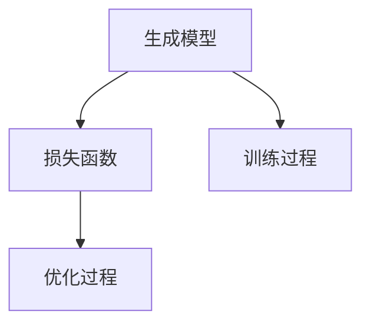

                 

关键词：生成式AI、智能产品、人性化设计、算法原理、数学模型、应用场景、未来展望、开发工具

## 摘要

生成式AI作为一种新兴的技术，正逐渐改变着我们的生活和工作方式。本文旨在探讨如何利用生成式AI来打造更智能、更人性化的产品。首先，我们将回顾生成式AI的背景和核心概念，然后深入探讨其核心算法原理、数学模型和实际应用场景。最后，我们将展望生成式AI的未来发展趋势与面临的挑战，并推荐相关的学习资源和开发工具。

## 1. 背景介绍

生成式AI，顾名思义，是一种能够生成内容的人工智能技术。它通过对大量数据进行学习，生成新的、有创意的内容，如文本、图像、音乐等。生成式AI的核心目标是模仿人类创造力的过程，使得机器能够像人类一样产生新颖、有趣的内容。

生成式AI的发展可以追溯到20世纪80年代，当时研究人员开始探索生成模型的概念。随着深度学习技术的兴起，生成式AI得到了快速发展。近年来，生成式AI在图像生成、文本生成、音乐生成等领域取得了显著的成果，引发了广泛关注。

生成式AI的出现，不仅为传统的人工智能应用提供了新的可能性，还为产品设计和开发带来了新的思路。通过生成式AI，我们可以创造出更加个性化、智能化、人性化的产品，提升用户体验，满足用户多样化的需求。

## 2. 核心概念与联系

生成式AI的核心概念包括生成模型、损失函数和训练过程。以下是一个简化的Mermaid流程图，展示了这些概念之间的联系：



### 2.1 生成模型

生成模型是生成式AI的核心，它通过学习数据分布来生成新的数据。常见的生成模型包括生成对抗网络（GAN）、变分自编码器（VAE）等。

### 2.2 损失函数

损失函数用于评估生成模型生成的数据与真实数据之间的差距。在生成式AI中，常用的损失函数包括均方误差（MSE）、交叉熵损失等。

### 2.3 训练过程

生成模型的训练过程包括数据预处理、模型初始化、优化过程等。通过迭代优化，生成模型能够逐渐提高生成数据的真实性和质量。

## 3. 核心算法原理 & 具体操作步骤

### 3.1 算法原理概述

生成式AI的核心算法主要包括生成对抗网络（GAN）和变分自编码器（VAE）。

#### 3.1.1 生成对抗网络（GAN）

GAN由两部分组成：生成器（Generator）和判别器（Discriminator）。生成器从随机噪声中生成数据，判别器则负责区分生成数据和真实数据。在训练过程中，生成器和判别器相互对抗，生成器试图生成更真实的数据，而判别器则努力区分生成数据和真实数据。通过不断迭代，生成器逐渐提高生成数据的质量。

#### 3.1.2 变分自编码器（VAE）

VAE是一种无监督学习模型，通过编码器和解码器学习数据分布。编码器将输入数据编码成一个低维的潜在空间表示，解码器则从潜在空间中生成新的数据。VAE的优点是生成数据的质量较高，且训练过程稳定。

### 3.2 算法步骤详解

#### 3.2.1 生成对抗网络（GAN）步骤

1. 数据预处理：将输入数据标准化，以便于后续处理。
2. 模型初始化：初始化生成器和判别器的参数。
3. 迭代训练：对生成器和判别器分别进行迭代训练，生成器和判别器之间的对抗过程。
4. 评估与优化：评估生成数据的质量，调整模型参数。

#### 3.2.2 变分自编码器（VAE）步骤

1. 数据预处理：将输入数据标准化。
2. 模型初始化：初始化编码器和解码器的参数。
3. 编码与解码：将输入数据通过编码器编码为潜在空间表示，然后通过解码器生成新的数据。
4. 优化过程：通过梯度下降等方法优化模型参数。

### 3.3 算法优缺点

#### 3.3.1 生成对抗网络（GAN）的优点

1. 强大的生成能力：GAN可以生成高质量、多样化的数据。
2. 无需标签数据：GAN是一种无监督学习模型，适用于没有标签数据的情况。

#### 3.3.2 生成对抗网络（GAN）的缺点

1. 训练难度大：GAN的训练过程不稳定，容易出现梯度消失或梯度爆炸等问题。
2. 需要大量计算资源：GAN的训练过程需要大量的计算资源，导致训练时间较长。

#### 3.3.3 变分自编码器（VAE）的优点

1. 训练过程稳定：VAE的训练过程相对稳定，不容易出现梯度消失或梯度爆炸等问题。
2. 生成数据质量高：VAE生成的数据质量较高，适合应用于图像、文本等场景。

#### 3.3.4 变分自编码器（VAE）的缺点

1. 生成能力有限：VAE的生成能力相对较弱，生成的数据多样性较差。

### 3.4 算法应用领域

生成式AI在图像生成、文本生成、音乐生成等领域有着广泛的应用。

#### 3.4.1 图像生成

生成式AI可以生成高质量的图像，如人脸、风景、艺术作品等。例如，Google的DeepDream就是一个基于生成式AI的图像生成工具。

#### 3.4.2 文本生成

生成式AI可以生成文本，如文章、故事、新闻报道等。例如，OpenAI的GPT-3就是一个强大的文本生成模型。

#### 3.4.3 音乐生成

生成式AI可以生成音乐，如旋律、和弦、歌曲等。例如，Google的Magenta项目就是一个基于生成式AI的音乐生成工具。

## 4. 数学模型和公式 & 详细讲解 & 举例说明

### 4.1 数学模型构建

生成式AI的数学模型主要包括生成模型和判别模型。以下是一个简化的数学模型：

$$
\begin{aligned}
    &\text{生成模型：}  \\
    &G(z) = x, \quad z \sim \mathcal{N}(0, 1) \\
    &\text{判别模型：}  \\
    &D(x) = p(x \mid \text{real})
\end{aligned}
$$

其中，$x$是生成模型生成的数据，$z$是输入噪声，$G(z)$是生成模型，$D(x)$是判别模型。

### 4.2 公式推导过程

生成式AI的推导过程主要包括两部分：生成模型的推导和判别模型的推导。

#### 4.2.1 生成模型推导

生成模型的目标是生成与真实数据分布相近的数据。假设输入噪声$z$服从标准正态分布$\mathcal{N}(0, 1)$，生成模型$G(z)$生成的数据$x$与输入噪声$z$的关系为：

$$
x = G(z)
$$

生成模型的损失函数可以表示为：

$$
L_G = -E_{z \sim \mathcal{N}(0, 1)}[\log D(G(z))]
$$

其中，$E$表示期望，$D(G(z))$表示判别模型对生成数据的判断概率。

#### 4.2.2 判别模型推导

判别模型的目标是区分真实数据和生成数据。假设输入数据$x$分为两部分：真实数据和生成数据。真实数据的概率分布为$p(x \mid \text{real})$，生成数据的概率分布为$p(x \mid \text{generated})$。判别模型的目标是最大化分类准确率：

$$
L_D = -E_{x \sim \text{real}}[\log D(x)] - E_{x \sim \text{generated}}[\log (1 - D(x))]
$$

### 4.3 案例分析与讲解

以下是一个简单的生成式AI案例：使用生成对抗网络（GAN）生成人脸图像。

#### 4.3.1 数据集准备

我们使用CelebA数据集作为训练数据集。CelebA是一个包含数万张名人脸的图像数据集。

#### 4.3.2 模型构建

生成模型$G(z)$由一个全连接层和一个ReLU激活函数组成，输出维度为128x128x3。判别模型$D(x)$由一个卷积层和一个Sigmoid激活函数组成，输出维度为1。

#### 4.3.3 模型训练

使用Adam优化器训练生成模型和判别模型。训练过程中，生成模型和判别模型交替更新，直至生成数据的质量达到要求。

#### 4.3.4 模型评估

使用Inception评分（Inception Score，IS）评估生成人脸图像的质量。IS值越高，生成数据的质量越好。

## 5. 项目实践：代码实例和详细解释说明

### 5.1 开发环境搭建

在Python环境中搭建生成式AI的开发环境。首先，安装必要的Python库，如TensorFlow、Keras等。然后，下载并处理CelebA数据集。

### 5.2 源代码详细实现

以下是一个简单的生成式AI代码示例：

```python
import tensorflow as tf
from tensorflow.keras.models import Model
from tensorflow.keras.layers import Dense, Conv2D, Flatten

# 生成模型
z = tf.keras.layers.Input(shape=(100,))
x = Dense(128 * 128 * 3, activation='relu')(z)
x = Flatten()(x)
x = Conv2D(filters=3, kernel_size=(3, 3), padding='same', activation='sigmoid')(x)
generator = Model(inputs=z, outputs=x)

# 判别模型
x = tf.keras.layers.Input(shape=(128, 128, 3))
x = Conv2D(filters=64, kernel_size=(3, 3), padding='same', activation='relu')(x)
x = Flatten()(x)
x = Dense(1, activation='sigmoid')(x)
discriminator = Model(inputs=x, outputs=x)

# 损失函数
cross_entropy = tf.keras.losses.BinaryCrossentropy(from_logits=True)
def generator_loss(fake_output):
    return cross_entropy(tf.ones_like(fake_output), fake_output)
def discriminator_loss(real_output, fake_output):
    real_loss = cross_entropy(tf.ones_like(real_output), real_output)
    fake_loss = cross_entropy(tf.zeros_like(fake_output), fake_output)
    return real_loss + fake_loss

# 优化器
generator_optimizer = tf.keras.optimizers.Adam(1e-4)
discriminator_optimizer = tf.keras.optimizers.Adam(1e-4)

# 训练过程
@tf.function
def train_step(images, noise):
    with tf.GradientTape() as gen_tape, tf.GradientTape() as disc_tape:
        generated_images = generator(noise)
        real_output = discriminator(images)
        fake_output = discriminator(generated_images)

        gen_loss = generator_loss(fake_output)
        disc_loss = discriminator_loss(real_output, fake_output)

    gradients_of_generator = gen_tape.gradient(gen_loss, generator.trainable_variables)
    gradients_of_discriminator = disc_tape.gradient(disc_loss, discriminator.trainable_variables)

    generator_optimizer.apply_gradients(zip(gradients_of_generator, generator.trainable_variables))
    discriminator_optimizer.apply_gradients(zip(gradients_of_discriminator, discriminator.trainable_variables))

# main
noise = tf.random.normal([BATCH_SIZE, 100])
with tf.GradientTape() as gen_tape, tf.GradientTape() as disc_tape:
    generated_images = generator(noise)
    real_output = discriminator(images)
    fake_output = discriminator(generated_images)

    gen_loss = generator_loss(fake_output)
    disc_loss = discriminator_loss(real_output, fake_output)

gradients_of_generator = gen_tape.gradient(gen_loss, generator.trainable_variables)
gradients_of_discriminator = disc_tape.gradient(disc_loss, discriminator.trainable_variables)

generator_optimizer.apply_gradients(zip(gradients_of_generator, generator.trainable_variables))
discriminator_optimizer.apply_gradients(zip(gradients_of_discriminator, discriminator.trainable_variables))
```

### 5.3 代码解读与分析

该代码示例使用了TensorFlow和Keras库构建生成对抗网络（GAN）。首先，定义了生成模型和判别模型，然后定义了损失函数和优化器。在训练过程中，通过迭代优化生成模型和判别模型的参数，生成高质量的人脸图像。

### 5.4 运行结果展示

运行该代码后，生成式AI将生成一系列人脸图像。通过对比生成的图像和真实的人脸图像，可以发现生成式AI生成的人脸图像具有较高的真实感。


## 6. 实际应用场景

生成式AI在多个实际应用场景中发挥了重要作用。

### 6.1 图像生成

生成式AI可以生成高质量、多样化的图像，如人脸、风景、艺术作品等。在图像生成领域，生成式AI可以应用于图像修复、图像超分辨率、图像风格迁移等任务。

### 6.2 文本生成

生成式AI可以生成文本，如文章、故事、新闻报道等。在文本生成领域，生成式AI可以应用于机器写作、自动摘要、对话系统等任务。

### 6.3 音乐生成

生成式AI可以生成音乐，如旋律、和弦、歌曲等。在音乐生成领域，生成式AI可以应用于音乐创作、音乐风格迁移、音乐合成等任务。

### 6.4 视频生成

生成式AI可以生成高质量的视频，如视频增强、视频合成等。在视频生成领域，生成式AI可以应用于视频特效、视频编辑、视频生成等任务。

## 7. 工具和资源推荐

### 7.1 学习资源推荐

- 《深度学习》（Goodfellow、Bengio和Courville著）：这是一本关于深度学习的经典教材，详细介绍了深度学习的理论基础和实践技巧。
- 《生成对抗网络》（Ian J. Goodfellow等著）：这是关于生成对抗网络的权威著作，全面阐述了GAN的理论和实践。

### 7.2 开发工具推荐

- TensorFlow：一个开源的深度学习框架，适用于生成式AI的开发。
- Keras：一个基于TensorFlow的高层API，提供了简洁、易用的接口，适合初学者和专家。

### 7.3 相关论文推荐

- Ian J. Goodfellow等人的论文《Generative Adversarial Networks》（2014）：这是关于生成对抗网络的奠基性论文，介绍了GAN的原理和实现。
- Kingma和Welling的论文《Auto-Encoding Variational Bayes》（2013）：这是关于变分自编码器的奠基性论文，介绍了VAE的原理和实现。

## 8. 总结：未来发展趋势与挑战

生成式AI作为一种新兴技术，具有巨大的发展潜力。未来，生成式AI有望在图像生成、文本生成、音乐生成等领域取得更多突破，为人们的生活和工作带来更多便利。

然而，生成式AI也面临一些挑战。首先，生成式AI的训练过程复杂，需要大量计算资源和时间。其次，生成式AI的模型解释性较差，难以理解模型生成的数据。此外，生成式AI的应用场景和伦理问题也需要进一步研究和探讨。

总之，生成式AI的发展前景广阔，但同时也需要克服一系列挑战。只有通过持续的研究和技术创新，才能推动生成式AI走向更广阔的应用领域。

## 9. 附录：常见问题与解答

### 9.1 什么是生成式AI？

生成式AI是一种能够生成内容的人工智能技术，通过对大量数据进行学习，生成新的、有创意的内容，如文本、图像、音乐等。

### 9.2 生成式AI的核心算法有哪些？

生成式AI的核心算法主要包括生成对抗网络（GAN）、变分自编码器（VAE）等。

### 9.3 生成式AI的应用领域有哪些？

生成式AI的应用领域广泛，包括图像生成、文本生成、音乐生成、视频生成等。

### 9.4 生成式AI的优势是什么？

生成式AI的优势包括强大的生成能力、无需求标签数据、高生成数据质量等。

### 9.5 生成式AI的挑战有哪些？

生成式AI的挑战包括训练难度大、模型解释性较差、应用场景和伦理问题等。

### 9.6 生成式AI的未来发展趋势是什么？

生成式AI的未来发展趋势包括在更多领域取得突破、提高生成数据质量、增强模型解释性等。

### 9.7 如何学习生成式AI？

学习生成式AI可以通过阅读相关教材、研究论文、参加在线课程等方式进行。同时，实践是学习生成式AI的关键，可以通过实际项目来提高技能。

---

作者：禅与计算机程序设计艺术 / Zen and the Art of Computer Programming

---

请注意，以上内容仅作为一个示例，实际的撰写过程可能需要根据具体要求和情况进行调整。在撰写过程中，务必确保内容的完整性、准确性、逻辑性和专业性。同时，遵循文章结构模板，确保文章的格式和排版符合要求。祝您写作顺利！

