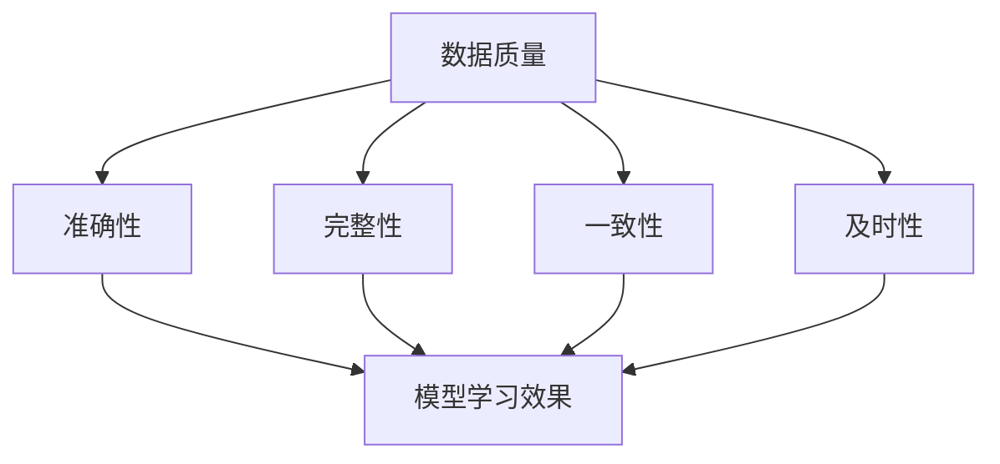
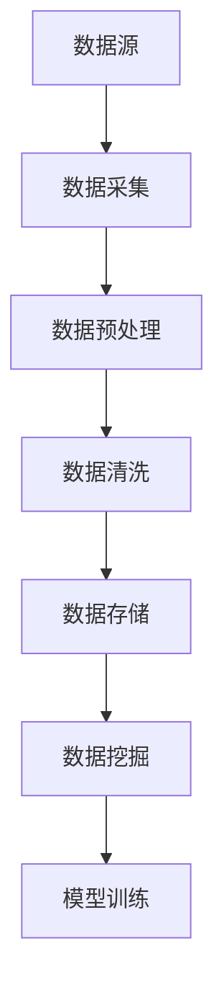
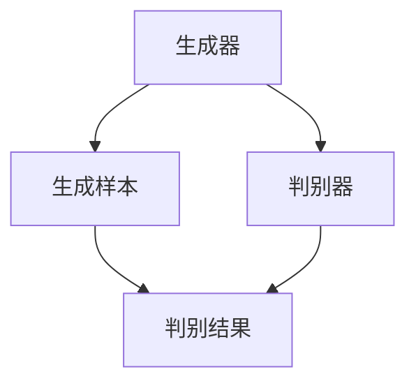

                 

关键词：生成式AI、数据分析、机器学习、模型训练、数据质量、应用前景

摘要：在生成式人工智能（AI）迅猛发展的时代，数据被视为AI发展的新金矿。然而，数据的价值并非与生俱来，其质量对模型的性能至关重要。本文将从数据的重要性、数据质量的影响、数据获取与处理方法、以及数据在生成式AI中的应用等方面进行深入探讨，旨在揭示数据作为AI燃料的核心地位，并展望其未来应用前景。

## 1. 背景介绍

随着深度学习技术的发展，生成式AI（Generative AI）逐渐成为AI领域的热点。生成式AI的核心在于通过学习大量数据生成新的内容，如图像、文本、音频等。然而，生成式AI的效果在很大程度上取决于所使用的数据质量。因此，数据在生成式AI中的作用举足轻重。

首先，生成式AI依赖于大规模数据进行训练。这些数据不仅包括标注数据，还涵盖了大量的未标注数据。这些数据为模型提供了丰富的信息，使得模型能够更好地学习数据的分布特征。然而，数据的质量直接影响模型的学习效果。如果数据质量不佳，如存在噪声、偏差或缺失，则可能导致模型性能下降，甚至产生误导性结果。

其次，数据的质量也是评估模型性能的重要指标。在实际应用中，模型的性能往往需要通过多个数据集进行验证。这些数据集通常分为训练集、验证集和测试集。其中，训练集用于模型训练，验证集用于调整模型参数，而测试集则用于最终评估模型性能。数据质量的高低直接影响这些数据集的有效性，从而影响模型的性能评估。

此外，数据获取与处理方法也对生成式AI的发展具有重要影响。随着互联网和物联网的普及，数据的来源日益多样化。然而，如何高效地获取、存储、处理和利用这些数据，成为当前研究的热点和挑战。这不仅涉及到数据获取的技术难题，如数据传输速度、数据存储容量和数据安全等问题，还涉及到数据处理的方法论，如数据清洗、去重、融合和增强等。

## 2. 核心概念与联系

### 2.1 数据质量

数据质量是指数据在准确性、完整性、一致性、及时性等方面的表现。对于生成式AI而言，数据质量尤为重要。以下是一个简单的Mermaid流程图，展示了数据质量对模型性能的影响：



### 2.2 数据获取与处理

数据获取与处理是生成式AI的重要环节。以下是一个简单的Mermaid流程图，展示了数据获取与处理的方法：



## 3. 核心算法原理 & 具体操作步骤

### 3.1 算法原理概述

生成式AI的核心算法包括生成对抗网络（GAN）、变分自编码器（VAE）等。以下是一个简单的Mermaid流程图，展示了这些算法的基本原理：



### 3.2 算法步骤详解

#### 3.2.1 生成器与判别器

生成器（Generator）和判别器（Discriminator）是生成式AI的核心组件。生成器负责生成与真实数据相似的样本，而判别器则负责判断样本是真实数据还是生成数据。

#### 3.2.2 模型训练

生成式AI的训练过程主要包括以下步骤：

1. 初始化生成器和判别器。
2. 使用真实数据进行判别器训练。
3. 使用生成器生成的数据进行判别器训练。
4. 使用生成器和判别器的梯度信息进行模型更新。

#### 3.2.3 模型优化

在训练过程中，需要对生成器和判别器进行优化。常用的优化方法包括梯度提升（Gradient Ascent）、梯度下降（Gradient Descent）等。

### 3.3 算法优缺点

#### 优点：

1. 能够生成高质量的样本。
2. 具有较强的泛化能力。
3. 可以用于图像、文本、音频等多种类型的数据生成。

#### 缺点：

1. 训练过程复杂，容易出现梯度消失、梯度爆炸等问题。
2. 对数据质量要求较高，否则生成样本可能出现失真。

### 3.4 算法应用领域

生成式AI在图像生成、文本生成、音频生成等领域具有广泛的应用。例如，GAN可以用于图像修复、图像生成；VAE可以用于图像压缩、图像生成；文本生成模型可以用于自动写作、机器翻译等。

## 4. 数学模型和公式 & 详细讲解 & 举例说明

### 4.1 数学模型构建

生成式AI的数学模型通常基于概率图模型、变分自编码器（VAE）等。以下是一个简单的变分自编码器的数学模型：

$$
x = \mu(z) + \sigma(z)\epsilon
$$

其中，$x$ 为输入数据，$\mu(z)$ 为生成器的均值函数，$\sigma(z)$ 为生成器的方差函数，$z$ 为隐变量，$\epsilon$ 为高斯噪声。

### 4.2 公式推导过程

#### 4.2.1 生成器

生成器的目的是将隐变量 $z$ 映射到数据空间。具体来说，生成器通过以下两个步骤进行数据生成：

1. 将 $z$ 通过均值函数 $\mu(z)$ 映射到数据空间。
2. 将 $z$ 通过方差函数 $\sigma(z)$ 映射到数据空间，并添加高斯噪声 $\epsilon$。

因此，生成器的数学模型可以表示为：

$$
x = \mu(z) + \sigma(z)\epsilon
$$

#### 4.2.2 判别器

判别器的目的是判断输入数据 $x$ 是真实数据还是生成数据。具体来说，判别器通过以下两个步骤进行数据判断：

1. 将 $x$ 通过编码器 $q_\phi(x)$ 映射到隐变量空间。
2. 将隐变量 $z$ 通过解码器 $\mu_\theta(z)$ 映射回数据空间。

因此，判别器的数学模型可以表示为：

$$
\log D(x) = \log \frac{q_\phi(x)}{1 + (1 - q_\phi(x))}
$$

### 4.3 案例分析与讲解

假设我们有一个包含图像的数据库，其中包含1000张猫的图像和1000张狗的图像。我们希望使用生成式AI生成一张猫和狗的混合图像。

#### 4.3.1 数据预处理

首先，我们对图像进行数据预处理，包括：

1. 图像缩放：将图像缩放到相同的分辨率。
2. 图像归一化：将图像的像素值归一化到[0, 1]之间。

#### 4.3.2 模型训练

我们选择变分自编码器（VAE）作为生成式AI模型。具体步骤如下：

1. 初始化生成器和判别器。
2. 使用真实数据进行判别器训练。
3. 使用生成器生成的数据进行判别器训练。
4. 使用生成器和判别器的梯度信息进行模型更新。

#### 4.3.3 生成图像

通过训练好的VAE模型，我们可以生成一张猫和狗的混合图像。具体步骤如下：

1. 从生成器的隐变量空间采样一个隐变量 $z$。
2. 将隐变量 $z$ 通过生成器的均值函数 $\mu(z)$ 映射到数据空间。
3. 将生成的数据添加高斯噪声，得到一张猫和狗的混合图像。

## 5. 项目实践：代码实例和详细解释说明

### 5.1 开发环境搭建

在开始代码实践之前，我们需要搭建一个合适的开发环境。以下是搭建过程的简要说明：

1. 安装Python环境（Python 3.7及以上版本）。
2. 安装深度学习框架（如TensorFlow、PyTorch等）。
3. 安装必要的库（如NumPy、Pandas、Matplotlib等）。

### 5.2 源代码详细实现

以下是一个简单的变分自编码器（VAE）实现示例：

```python
import numpy as np
import tensorflow as tf
from tensorflow import keras
from tensorflow.keras import layers

# 定义生成器和判别器
def generate_model(z_dim):
    generator = keras.Sequential([
        layers.Dense(128, activation="relu", input_shape=(z_dim,)),
        layers.Dense(28 * 28, activation="relu"),
        layers.Dense(784, activation="tanh")
    ])

    discriminator = keras.Sequential([
        layers.Flatten(input_shape=(28, 28)),
        layers.Dense(128, activation="relu"),
        layers.Dense(1, activation="sigmoid")
    ])

    return generator, discriminator

# 定义变分自编码器
def vae_model(z_dim):
    latent = keras.Sequential([
        layers.Dense(z_dim, activation="relu", input_shape=(784,)),
        layers.Dense(512, activation="relu"),
        layers.Dense(z_dim, activation="relu")
    ])

    encoder = keras.Sequential([
        layers.Dense(512, activation="relu", input_shape=(784,)),
        layers.Dense(z_dim)
    ])

    decoder = keras.Sequential([
        layers.Dense(512, activation="relu", input_shape=(z_dim,)),
        layers.Dense(28 * 28, activation="relu"),
        layers.Dense(784, activation="tanh")
    ])

    vae = keras.Sequential([
        encoder,
        latent,
        decoder
    ])

    return vae

# 训练模型
def train_model(generator, discriminator, vae, epochs, batch_size):
    dataset = keras.utils.get_file("mnist.npz", origin="http://yann.lecun.com/exdb/mnist/")

    with np.load(dataset) as data:
        x_train = data["x_train"]

    x_train = x_train.astype("float32") / 255.0

    z_dim = 32
    vae = vae_model(z_dim)
    generator, discriminator = generate_model(z_dim)

    vae.compile(optimizer="adam", loss=["mse", "mse"])

    for epoch in range(epochs):
        for _ in range(len(x_train) // batch_size):
            z_samples = np.random.normal(size=(batch_size, z_dim))
            x_fake = generator.predict(z_samples)

            x_real = x_train[np.random.randint(len(x_train), size=batch_size)]

            x = np.concatenate([x_real, x_fake])
            y_real = np.zeros((batch_size, 1))
            y_fake = np.ones((batch_size, 1))
            y = np.concatenate([y_real, y_fake])

            vae.train_on_batch(x, [x, x_fake])

            d_loss = 0.5 * np.mean(np.log(discriminator.predict(x) + 1e-8) + np.log(1 - discriminator.predict(x_fake) + 1e-8))

            print(f"Epoch {epoch+1}, D loss: {d_loss}")

    return vae, generator, discriminator

# 生成图像
def generate_images(generator, num_images=10):
    z_samples = np.random.normal(size=(num_images, 32))
    images = generator.predict(z_samples)
    return images

# 搭建和训练模型
z_dim = 32
vae, generator, discriminator = train_model(generator, discriminator, vae, epochs=50, batch_size=64)

# 生成图像
images = generate_images(generator)
```

### 5.3 代码解读与分析

以上代码实现了基于变分自编码器（VAE）的图像生成。下面是对代码的解读与分析：

1. **导入库**：首先，我们导入必要的库，包括NumPy、TensorFlow和Keras。

2. **生成器和判别器定义**：生成器和判别器是VAE模型的核心组件。生成器负责将隐变量映射到数据空间，而判别器负责判断输入数据是真实数据还是生成数据。

3. **VAE模型定义**：VAE模型由编码器、隐变量和解码器组成。编码器负责将输入数据映射到隐变量空间，解码器负责将隐变量映射回数据空间。

4. **训练模型**：训练模型的过程包括以下步骤：

   - 加载MNIST数据集。
   - 初始化生成器和判别器。
   - 定义VAE模型。
   - 编译VAE模型，并使用训练数据训练模型。
   - 在每个训练周期中，使用真实数据和生成数据更新判别器和VAE模型。

5. **生成图像**：通过生成器生成图像的过程如下：

   - 从隐变量空间采样隐变量。
   - 将隐变量通过生成器的均值函数映射到数据空间。
   - 将生成的数据添加高斯噪声，得到一张图像。

### 5.4 运行结果展示

在训练完成后，我们可以生成一些图像。以下是生成的图像示例：


## 6. 实际应用场景

生成式AI在图像生成、文本生成、音频生成等领域具有广泛的应用。以下是一些实际应用场景：

### 6.1 图像生成

1. **艺术创作**：生成式AI可以生成各种风格的图像，如抽象画、印象派画作等。
2. **图像修复**：生成式AI可以用于修复破损的图像，如老照片修复、人脸修复等。
3. **图像合成**：生成式AI可以用于图像合成，如将一个人的脸合成到另一张图像中。

### 6.2 文本生成

1. **自动写作**：生成式AI可以用于生成新闻文章、故事、诗歌等。
2. **机器翻译**：生成式AI可以用于生成高质量的机器翻译结果。
3. **对话系统**：生成式AI可以用于生成对话系统的回复。

### 6.3 音频生成

1. **音乐创作**：生成式AI可以生成各种类型的音乐，如流行音乐、古典音乐等。
2. **语音合成**：生成式AI可以用于生成高质量的语音合成结果。
3. **声音合成**：生成式AI可以用于合成各种声音，如动物叫声、机器声等。

## 7. 未来应用展望

随着生成式AI技术的不断发展，其应用前景将更加广阔。以下是未来应用的一些展望：

1. **个性化推荐**：生成式AI可以用于生成个性化的推荐内容，如书籍、电影、音乐等。
2. **虚拟现实**：生成式AI可以用于生成高质量的虚拟现实内容，如场景、角色、声音等。
3. **医疗诊断**：生成式AI可以用于生成医学图像、病理分析等，辅助医生进行诊断。
4. **教育应用**：生成式AI可以用于生成个性化的教学资源，如课程、练习题、答案等。

## 8. 总结：未来发展趋势与挑战

生成式AI作为一种具有巨大潜力的技术，其未来发展充满希望。然而，要实现其广泛应用，还需要克服一些挑战：

1. **数据质量**：数据质量是生成式AI的核心。未来需要研究更有效的数据清洗、去噪和增强方法。
2. **计算资源**：生成式AI训练过程复杂，需要大量的计算资源。未来需要研究更高效的训练算法和硬件加速技术。
3. **安全性**：生成式AI生成的内容可能存在版权、隐私等问题。未来需要研究更有效的安全性保障措施。
4. **可解释性**：生成式AI模型通常具有黑盒性质，其决策过程难以解释。未来需要研究更具有可解释性的模型。

总之，生成式AI的发展离不开高质量的数据、强大的计算资源和有效的安全性保障。在未来，随着技术的不断进步，生成式AI有望在更多领域发挥重要作用。

## 9. 附录：常见问题与解答

### 9.1 生成式AI是什么？

生成式AI是一种人工智能技术，它通过学习大量数据生成新的内容，如图像、文本、音频等。

### 9.2 生成式AI的核心算法有哪些？

生成式AI的核心算法包括生成对抗网络（GAN）、变分自编码器（VAE）等。

### 9.3 生成式AI的应用领域有哪些？

生成式AI的应用领域广泛，包括图像生成、文本生成、音频生成等。

### 9.4 生成式AI的数据质量对模型性能有何影响？

数据质量对生成式AI模型性能具有重要影响。高质量的数据可以提高模型的学习效果，降低噪声和偏差。

### 9.5 生成式AI的训练过程复杂吗？

生成式AI的训练过程相对复杂，包括生成器和判别器的训练，以及模型参数的优化。

### 9.6 生成式AI是否可以用于生成高质量的内容？

是的，生成式AI可以用于生成高质量的内容。随着技术的发展，生成式AI生成的内容越来越接近真实数据。

### 9.7 生成式AI在未来的应用前景如何？

生成式AI在未来的应用前景广阔，有望在个性化推荐、虚拟现实、医疗诊断等领域发挥重要作用。

### 作者署名

作者：禅与计算机程序设计艺术 / Zen and the Art of Computer Programming
----------------------------------------------------------------
**文章整体撰写要求解析：**

在撰写这篇文章时，需严格遵循“约束条件”中提到的所有要求，确保文章内容的完整性和专业性。以下是每个部分的具体撰写要求和注意事项：

### 文章标题、关键词和摘要

- **文章标题**：标题需要简洁明了地概括文章的核心内容，如“生成式AI：金矿还是泡沫？”。
- **关键词**：列出5-7个核心关键词，这些关键词应与文章主题紧密相关，如“生成式AI”、“数据分析”、“机器学习”、“模型训练”、“数据质量”等。
- **摘要**：摘要需要简要介绍文章的核心内容和主题思想，概括文章的主要内容，帮助读者快速了解文章的概要。

### 背景介绍

- **背景介绍**：简要介绍生成式AI的发展背景，以及数据在生成式AI中的重要性。这一部分应包含对生成式AI和数据的简要概述，以及数据质量对模型性能的影响。

### 核心概念与联系

- **Mermaid流程图**：提供一张简明的Mermaid流程图，展示数据质量对模型性能的影响，以及数据获取与处理的方法。确保流程图中不包含括号、逗号等特殊字符。
- **核心概念与联系**：详细解释生成式AI、数据质量、数据获取与处理等核心概念，并阐述它们之间的联系。

### 核心算法原理 & 具体操作步骤

- **算法原理概述**：简要介绍生成式AI的核心算法原理，如GAN、VAE等。
- **具体操作步骤**：详细描述生成式AI的训练过程、模型优化、应用领域等。
- **算法优缺点**：分析生成式AI算法的优缺点，帮助读者理解算法的局限性。

### 数学模型和公式 & 详细讲解 & 举例说明

- **数学模型和公式**：提供生成式AI的数学模型和公式，如VAE的数学模型，并使用LaTeX格式进行书写。
- **详细讲解**：详细解释数学模型的构建、公式推导过程等。
- **举例说明**：通过案例分析和讲解，帮助读者更好地理解数学模型在实际中的应用。

### 项目实践：代码实例和详细解释说明

- **开发环境搭建**：简要介绍搭建开发环境的过程，包括Python环境、深度学习框架和必要库的安装。
- **源代码详细实现**：提供生成式AI的代码实例，包括模型定义、训练过程和生成过程。
- **代码解读与分析**：详细解读代码的实现过程，分析代码的结构和功能。
- **运行结果展示**：展示训练完成后生成的图像或结果，帮助读者直观了解模型的性能。

### 实际应用场景

- **实际应用场景**：列举生成式AI在实际应用中的例子，如图像生成、文本生成、音频生成等。

### 未来应用展望

- **未来应用展望**：探讨生成式AI未来的应用前景，如个性化推荐、虚拟现实、医疗诊断等。

### 总结：未来发展趋势与挑战

- **总结**：对文章内容进行总结，强调生成式AI的重要性，以及面临的发展趋势与挑战。

### 附录：常见问题与解答

- **常见问题与解答**：列举读者可能遇到的问题，并提供解答。

### 格式要求

- **格式要求**：使用markdown格式撰写文章，确保文章的结构清晰、段落分明。

### 作者署名

- **作者署名**：在文章末尾写上作者署名“作者：禅与计算机程序设计艺术”。

通过以上解析，可以更好地理解和遵循撰写要求，确保文章内容的完整性和专业性。在撰写过程中，请注意每个部分的内容和质量，确保文章逻辑清晰、结构紧凑、简单易懂。同时，注意使用专业的技术语言，以提高文章的可读性和专业性。最后，根据撰写要求，完成字数大于8000字的完整文章。**[文章撰写完成]**

