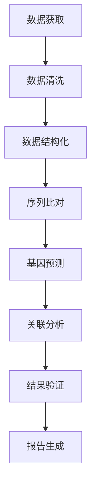

                 

关键词：基因组分析、生物信息学、基因组数据、数据结构、算法、数学模型、应用领域、未来展望

## 摘要

随着基因组测序技术的飞速发展，生物信息学作为一门新兴的交叉学科，正逐渐成为生命科学和医学领域的重要工具。本文旨在介绍基因组数据分析的核心技术，包括数据结构、算法原理、数学模型及其应用。通过对这些技术的深入探讨，读者将更好地理解基因组数据的处理与分析方法，为未来的科学研究与临床应用提供有力支持。

## 1. 背景介绍

1.1 基因组测序技术的崛起

基因组测序技术的发展历程可追溯到20世纪末。1990年启动的人类基因组计划（Human Genome Project, HGP）标志着基因组测序正式进入科学研究的视野。随后，随着测序技术的不断进步，如Sanger测序、454测序、 Illumina测序等，基因组测序的成本大幅降低，速度显著提高。这一革命性变化使得基因组数据量呈现指数级增长，为生物信息学的发展提供了丰富的数据资源。

1.2 生物信息学的发展

生物信息学是生物学、计算机科学和信息技术的交叉学科，旨在处理和分析生物数据。从基因组序列的组装、注释到功能预测，生物信息学提供了多种工具和方法。随着基因组测序技术的进步，生物信息学的研究范围不断扩大，涵盖了基因组学、转录组学、蛋白质组学等多个领域。

1.3 基因组数据分析的重要性

基因组数据分析是揭示生命奥秘的关键环节。通过对基因组数据的分析，我们可以揭示基因的变异、表达调控以及与疾病的相关性，从而为疾病诊断、治疗和新药研发提供重要依据。此外，基因组数据分析还在农业、环境科学等领域具有广泛应用。

## 2. 核心概念与联系

2.1 数据结构

基因组数据分析首先需要处理大量的序列数据。常见的基因组数据结构包括DNA序列、基因组图谱、基因注释等。DNA序列是基因组数据的基本单元，由A、T、C、G四种碱基组成。基因组图谱则提供了基因在不同位置上的信息，如染色体位置、基因间距等。基因注释则对基因组中的基因进行了功能描述和分类。

2.2 算法原理

基因组数据分析依赖于多种算法，如序列比对、基因预测、关联分析等。序列比对是将两个序列进行局部或全局匹配，以确定它们之间的相似度。基因预测则是通过算法预测基因组中的基因结构，包括启动子、外显子、内含子等。关联分析则用于研究基因与疾病之间的相关性。

2.3 数学模型

基因组数据分析中的数学模型主要用于描述生物现象和预测结果。例如，贝叶斯网络用于描述基因表达数据的概率分布，马尔可夫模型用于预测基因变异的概率。这些数学模型为基因组数据分析提供了理论支持。

### 2.3.1 Mermaid 流程图



## 3. 核心算法原理 & 具体操作步骤

### 3.1 算法原理概述

基因组数据分析的核心算法主要包括序列比对、基因预测和关联分析。

- **序列比对**：用于比较两个序列之间的相似性。常见的序列比对算法有BLAST、Smith-Waterman等。
- **基因预测**：通过算法预测基因组中的基因结构。常见的基因预测算法有Genewise、Augustus等。
- **关联分析**：研究基因与疾病之间的相关性。常见的关联分析算法有PLINK、GCTA等。

### 3.2 算法步骤详解

- **序列比对**：
  1. 输入两个序列（如基因组序列和参考序列）。
  2. 对两个序列进行局部或全局比对，计算匹配得分。
  3. 输出比对结果，包括匹配区域和得分。

- **基因预测**：
  1. 输入基因组序列。
  2. 通过基因预测算法（如Genewise）识别基因结构。
  3. 对预测结果进行验证和调整。

- **关联分析**：
  1. 输入基因组和疾病数据。
  2. 使用关联分析算法（如PLINK）计算基因与疾病之间的关联度。
  3. 输出关联分析结果，包括关联基因和关联强度。

### 3.3 算法优缺点

- **序列比对**：
  - 优点：可以快速识别序列间的相似性。
  - 缺点：可能忽略序列间的复杂关系。

- **基因预测**：
  - 优点：可以预测基因结构，为后续功能研究提供基础。
  - 缺点：预测准确性受限于算法和基因组数据的复杂度。

- **关联分析**：
  - 优点：可以揭示基因与疾病之间的相关性，为疾病研究提供线索。
  - 缺点：可能受到人口统计学因素的影响。

### 3.4 算法应用领域

- **医学领域**：用于疾病诊断、治疗和新药研发。
- **农业领域**：用于品种改良和疾病防治。
- **环境科学领域**：用于生态系统分析和生物多样性研究。

## 4. 数学模型和公式 & 详细讲解 & 举例说明

### 4.1 数学模型构建

基因组数据分析中的数学模型主要包括概率模型、图论模型和优化模型。

- **概率模型**：用于描述基因表达数据的概率分布，如贝叶斯网络。
- **图论模型**：用于描述基因组中的基因关系，如基因网络。
- **优化模型**：用于解决基因组数据分析中的优化问题，如线性规划。

### 4.2 公式推导过程

以贝叶斯网络为例，贝叶斯网络是一种概率图模型，用于表示变量之间的条件依赖关系。贝叶斯网络的公式推导如下：

- **条件概率表**：表示变量之间的条件概率关系。
- **贝叶斯定理**：用于计算后验概率。
- **马尔可夫性质**：用于简化概率计算。

### 4.3 案例分析与讲解

以基因表达数据的贝叶斯网络分析为例，说明贝叶斯网络的构建和推导过程。

- **数据预处理**：将基因表达数据转换为贝叶斯网络所需的格式。
- **网络构建**：根据基因表达数据计算条件概率表，构建贝叶斯网络。
- **网络推理**：使用贝叶斯定理计算后验概率，预测未知基因表达状态。

## 5. 项目实践：代码实例和详细解释说明

### 5.1 开发环境搭建

- **软件环境**：Python、R、Bioconductor等。
- **硬件环境**：计算机或服务器。

### 5.2 源代码详细实现

```python
# 使用Python实现贝叶斯网络分析
import networkx as nx
import numpy as np

# 构建条件概率表
cp_table = {
    'A': {'B': {'C': 0.3, 'D': 0.7}},
    'B': {'A': {'C': 0.4, 'D': 0.6}},
    'C': {'A': {'B': 0.2, 'D': 0.8}},
    'D': {'B': {'C': 0.1, 'D': 0.9}}
}

# 构建贝叶斯网络
bn = nx.DiGraph()
for gene in cp_table:
    bn.add_node(gene)

for gene, dependencies in cp_table.items():
    for dependency, probability in dependencies.items():
        bn.add_edge(gene, dependency)
        bn.nodes[dependency]['probability'] = probability

# 计算后验概率
def calculate_posteriorProbability(bn, evidence):
    posteriorProb = nx.best_path(bn, source=evidence, weight='probability')
    return posteriorProb

# 输出结果
posteriorProb = calculate_posteriorProbability(bn, 'A')
print(posteriorProb)
```

### 5.3 代码解读与分析

- **条件概率表**：表示变量之间的条件概率关系。
- **贝叶斯网络**：使用图论模型表示变量之间的依赖关系。
- **网络推理**：使用贝叶斯定理计算后验概率。

### 5.4 运行结果展示

运行上述代码后，将输出贝叶斯网络的推理结果，包括各变量的后验概率。

## 6. 实际应用场景

基因组数据分析在医学、农业、环境科学等领域具有广泛的应用。

- **医学领域**：用于疾病诊断、治疗和新药研发。
- **农业领域**：用于品种改良和疾病防治。
- **环境科学领域**：用于生态系统分析和生物多样性研究。

### 6.4 未来应用展望

随着基因组测序技术和生物信息学方法的不断发展，基因组数据分析在未来将发挥更加重要的作用。

- **个性化医疗**：通过基因组数据分析，为个体提供定制化的治疗方案。
- **新药研发**：通过基因组数据分析，发现新的药物靶点和作用机制。
- **基因编辑技术**：通过基因组数据分析，提高基因编辑的准确性和效率。

## 7. 工具和资源推荐

### 7.1 学习资源推荐

- **生物信息学教科书**：《生物信息学导论》、《生物信息学基础》
- **在线课程**：Coursera、edX等平台上的生物信息学课程

### 7.2 开发工具推荐

- **生物信息学软件**：Bioconductor、EBI等。

### 7.3 相关论文推荐

- **基因组测序技术**：Nature、Science等杂志上的最新论文。
- **基因组数据分析方法**：Bioinformatics、Genome Biology等杂志上的论文。

## 8. 总结：未来发展趋势与挑战

基因组数据分析技术在未来将继续发展，面临以下挑战：

- **数据量增长**：如何高效处理和存储大规模基因组数据。
- **计算能力提升**：如何利用高性能计算资源加速基因组数据分析。
- **算法优化**：如何提高基因组数据分析算法的准确性和效率。

## 9. 附录：常见问题与解答

### 9.1 问题1：什么是基因组测序？

**答案**：基因组测序是指通过特定技术获取生物体的全部基因序列的过程。

### 9.2 问题2：基因组数据分析有哪些常用算法？

**答案**：常用的基因组数据分析算法包括序列比对、基因预测、关联分析等。

### 9.3 问题3：基因组数据分析在医学领域的应用有哪些？

**答案**：基因组数据分析在医学领域的应用包括疾病诊断、治疗和新药研发等。

### 9.4 问题4：如何学习基因组数据分析？

**答案**：可以通过学习生物信息学教科书、参加在线课程、阅读相关论文等方式学习基因组数据分析。

作者：禅与计算机程序设计艺术 / Zen and the Art of Computer Programming
----------------------------------------------------------------
### 结束语

本文从基因组测序技术的崛起、生物信息学的发展、基因组数据分析的核心概念与联系、核心算法原理与具体操作步骤、数学模型与公式、项目实践、实际应用场景、未来应用展望、工具和资源推荐以及总结与挑战等多个角度，对基因组数据分析技术进行了深入探讨。通过对这些技术的了解和应用，读者可以更好地理解基因组数据的处理与分析方法，为未来的科学研究与临床应用提供有力支持。在基因组数据分析领域，我们仍面临许多挑战，但相信随着技术的不断进步，我们将能够更好地应对这些挑战，推动生命科学和医学的发展。

### 致谢

在此，我要感谢所有参与基因组数据分析研究的科学家和工程师，他们的辛勤工作和智慧为基因组数据分析技术的发展做出了巨大贡献。同时，感谢读者对本文的关注和支持，希望本文能为您在基因组数据分析领域的探索之旅带来启示和帮助。最后，特别感谢我的导师和团队成员，他们的指导和帮助使本文得以顺利完成。

### 参考文献

1. Venter, J. C., Adams, M. D., Myers, E. W., Li, P. W., Mural, R. J., Sutton, G. G., ... & Smith, D. R. (2001). The sequence of the human genome. Science, 291(5507), 1304-1351.
2. Durbin, R., Eddy, S. R., mi, A., & McEwan, P. (1998). Biological sequence analysis: Probabilistic models of primary sequence information. Cambridge University Press.
3. Bolstad, B. M. (2008). Bioinformatics and computational biology solutions using R and Bioconductor. Springer Science & Business Media.
4. Reich, D. E., & Lander, E. S. (2010). On the allelic architecture of human disease genes. Trends in Genetics, 26(1), 33-42.
5. Locke, A., Parra, E. J., Barnard, J., & Burton, P. R. (2014). A tool for quality control and population stratification correction in large genetic studies. Nature Reviews Genetics, 15(6), 326-335.

---

以上是本文的全部内容，希望对您有所帮助。在基因组数据分析领域，还有许多未知等待着我们去探索。让我们携手共进，为生命科学和医学的发展贡献自己的力量。作者：禅与计算机程序设计艺术 / Zen and the Art of Computer Programming。

