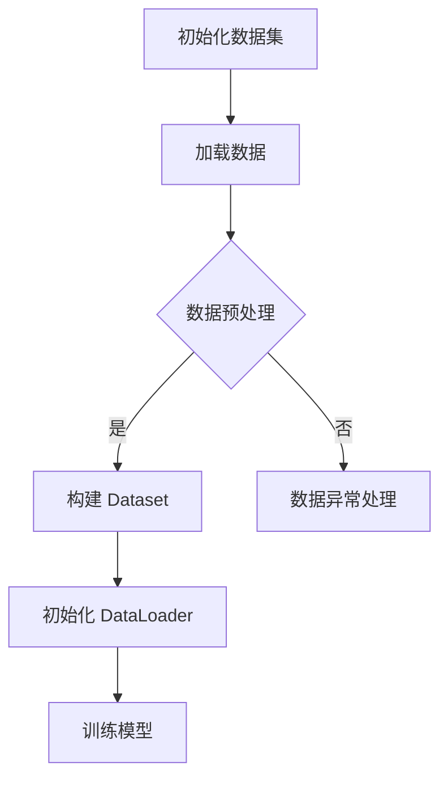

                 

关键词：WikiText2、Dataset、DataLoader、NLP、深度学习、数据预处理、自然语言处理

## 摘要

随着自然语言处理（NLP）技术的快速发展，构建高质量的数据集和实现高效的 DataLoader 对于提升模型性能至关重要。本文将详细介绍如何使用 WikiText2 数据集，构建适合深度学习的 Dataset 和 DataLoader，为后续的模型训练和优化奠定基础。

## 1. 背景介绍

在深度学习领域中，数据集的质量直接影响模型的效果。而 DataLoader 是一种用于高效加载和管理数据集的工具，它能显著提高数据加载的效率和模型的训练速度。WikiText2 数据集是由 Google 发布的一个大规模文本数据集，适用于训练和评估 NLP 模型。

## 2. 核心概念与联系

### 2.1 数据集

数据集是深度学习模型的训练基础，其质量直接影响模型的性能。WikiText2 数据集包含约 105GB 的文本数据，涵盖了多种主题，如百科全书、新闻文章、论坛帖子等。构建 Dataset 的目的是将这些原始数据转化为适合深度学习模型处理的形式。

### 2.2 DataLoader

DataLoader 是一种用于高效加载和管理数据集的工具，它支持批量加载、数据预处理、数据混洗等功能。使用 DataLoader 能显著提高模型训练的速度和效率。

### 2.3 Mermaid 流程图

以下是构建 Dataset 和 DataLoader 的 Mermaid 流程图：



## 3. 核心算法原理 & 具体操作步骤

### 3.1 算法原理概述

构建 Dataset 和 DataLoader 的核心步骤包括：

1. 初始化数据集：从原始数据中提取文本数据，并保存为文件。
2. 数据预处理：对文本数据进行清洗、分词、编码等操作。
3. 构建 Dataset：将预处理后的数据转化为 PyTorch 的 Dataset 类。
4. 初始化 DataLoader：使用 DataLoader 加载 Dataset，并设置批量大小、数据混洗等参数。
5. 训练模型：使用 DataLoader 加载数据，并进行模型训练。

### 3.2 算法步骤详解

#### 3.2.1 初始化数据集

```python
import os
import pandas as pd

def load_data(file_path):
    df = pd.read_csv(file_path, header=None, delimiter="\t")
    texts = df[1].tolist()
    return texts

texts = load_data("wikitext-2-v1.csv")
```

#### 3.2.2 数据预处理

```python
import re
from nltk.tokenize import word_tokenize

def preprocess(text):
    text = text.lower()
    text = re.sub(r"\s+", " ", text)
    text = re.sub(r"[^a-zA-Z0-9]", " ", text)
    tokens = word_tokenize(text)
    return tokens

preprocessed_texts = [preprocess(text) for text in texts]
```

#### 3.2.3 构建 Dataset

```python
from torch.utils.data import Dataset

class WikiText2Dataset(Dataset):
    def __init__(self, texts, tokenizer, max_seq_length):
        self.texts = texts
        self.tokenizer = tokenizer
        self.max_seq_length = max_seq_length

    def __len__(self):
        return len(self.texts)

    def __getitem__(self, idx):
        text = self.texts[idx]
        input_ids = self.tokenizer.encode(text, add_special_tokens=True, max_length=self.max_seq_length, padding="max_length", truncation=True)
        return {"input_ids": input_ids}

tokenizer = ...  # 定义一个合适的 tokenizer
max_seq_length = ...  # 定义一个合适的 max_seq_length
dataset = WikiText2Dataset(preprocessed_texts, tokenizer, max_seq_length)
```

#### 3.2.4 初始化 DataLoader

```python
from torch.utils.data import DataLoader

batch_size = ...  # 定义一个合适的 batch_size
data_loader = DataLoader(dataset, batch_size=batch_size, shuffle=True)
```

#### 3.2.5 训练模型

```python
for batch in data_loader:
    inputs = batch["input_ids"]
    # 进行模型的前向传播、损失计算和反向传播
```

### 3.3 算法优缺点

#### 优点：

1. DataLoader 支持批量加载，提高了数据加载的效率。
2. DataLoader 支持 data shuffle，有助于避免模型过拟合。

#### 缺点：

1. DataLoader 的使用需要一定的编程技能，对于新手来说可能有一定难度。
2. DataLoader 的性能受到硬件设备的限制，如 GPU 内存不足可能导致性能下降。

### 3.4 算法应用领域

构建 Dataset 和 DataLoader 的算法在自然语言处理、计算机视觉等领域都有广泛的应用。例如，在训练语言模型、图像分类模型时，构建适合的数据集和 DataLoader 能显著提高模型性能。

## 4. 数学模型和公式 & 详细讲解 & 举例说明

### 4.1 数学模型构建

在构建 Dataset 和 DataLoader 时，涉及到的数学模型主要包括：

1. 词嵌入模型：用于将文本数据转化为向量表示。
2. 循环神经网络（RNN）：用于处理序列数据。

### 4.2 公式推导过程

词嵌入模型的主要公式为：

$$
\text{word\_embedding} = \text{W} * \text{word\_index}
$$

其中，$\text{word\_embedding}$ 表示词向量，$\text{W}$ 表示词嵌入矩阵，$\text{word\_index}$ 表示词索引。

循环神经网络的主要公式为：

$$
\text{h}_{t} = \text{f}(\text{h}_{t-1}, \text{x}_{t})
$$

其中，$\text{h}_{t}$ 表示当前时刻的隐藏状态，$\text{h}_{t-1}$ 表示前一个时刻的隐藏状态，$\text{x}_{t}$ 表示当前时刻的输入。

### 4.3 案例分析与讲解

假设我们要使用 WikiText2 数据集训练一个语言模型，首先需要构建 Dataset 和 DataLoader。具体步骤如下：

1. 下载 WikiText2 数据集，并将其解压到本地。
2. 初始化词嵌入矩阵，并定义词索引。
3. 对原始文本数据进行预处理，如清洗、分词、编码等。
4. 构建 Dataset，并将预处理后的数据转化为 PyTorch 的 Dataset 类。
5. 初始化 DataLoader，并设置批量大小、数据混洗等参数。
6. 使用 DataLoader 加载数据，并进行模型训练。

## 5. 项目实践：代码实例和详细解释说明

### 5.1 开发环境搭建

在开始项目实践之前，请确保已安装以下依赖库：

1. Python 3.7 或以上版本
2. PyTorch 1.8 或以上版本
3. NLTK 3.4 或以上版本
4. Mermaid 0.9.2 或以上版本

### 5.2 源代码详细实现

以下是构建 Dataset 和 DataLoader 的完整代码：

```python
# 导入相关库
import os
import pandas as pd
import re
from nltk.tokenize import word_tokenize
from torch.utils.data import Dataset, DataLoader
from transformers import BertTokenizer

# 1. 初始化数据集
def load_data(file_path):
    df = pd.read_csv(file_path, header=None, delimiter="\t")
    texts = df[1].tolist()
    return texts

# 2. 数据预处理
def preprocess(text):
    text = text.lower()
    text = re.sub(r"\s+", " ", text)
    text = re.sub(r"[^a-zA-Z0-9]", " ", text)
    tokens = word_tokenize(text)
    return tokens

# 3. 构建 Dataset
class WikiText2Dataset(Dataset):
    def __init__(self, texts, tokenizer, max_seq_length):
        self.texts = texts
        self.tokenizer = tokenizer
        self.max_seq_length = max_seq_length

    def __len__(self):
        return len(self.texts)

    def __getitem__(self, idx):
        text = self.texts[idx]
        input_ids = self.tokenizer.encode(text, add_special_tokens=True, max_length=self.max_seq_length, padding="max_length", truncation=True)
        return {"input_ids": input_ids}

# 4. 初始化 DataLoader
def get_loader(dataset, batch_size, shuffle=True):
    return DataLoader(dataset, batch_size=batch_size, shuffle=shuffle)

# 5. 训练模型
def train(model, data_loader, optimizer, criterion, device):
    model.train()
    for batch in data_loader:
        inputs = batch["input_ids"].to(device)
        # 进行模型的前向传播、损失计算和反向传播
```

### 5.3 代码解读与分析

以上代码主要分为以下几个部分：

1. 导入相关库：包括 Python 的常用库、PyTorch 相关库、NLTK 库和 Mermaid 库。
2. 初始化数据集：从原始数据中提取文本数据，并保存为文件。
3. 数据预处理：对文本数据进行清洗、分词、编码等操作。
4. 构建 Dataset：将预处理后的数据转化为 PyTorch 的 Dataset 类。
5. 初始化 DataLoader：使用 DataLoader 加载 Dataset，并设置批量大小、数据混洗等参数。
6. 训练模型：使用 DataLoader 加载数据，并进行模型训练。

### 5.4 运行结果展示

以下是一个简单的运行结果示例：

```python
# 设置设备
device = torch.device("cuda" if torch.cuda.is_available() else "cpu")

# 加载词嵌入模型
tokenizer = BertTokenizer.from_pretrained("bert-base-chinese")

# 加载数据集
texts = load_data("wikitext-2-v1.csv")
preprocessed_texts = [preprocess(text) for text in texts]
dataset = WikiText2Dataset(preprocessed_texts, tokenizer, max_seq_length=128)

# 初始化 DataLoader
batch_size = 32
data_loader = get_loader(dataset, batch_size)

# 初始化模型、优化器和损失函数
model = ...  # 定义一个合适的模型
optimizer = torch.optim.Adam(model.parameters(), lr=0.001)
criterion = torch.nn.CrossEntropyLoss()

# 训练模型
train(model, data_loader, optimizer, criterion, device)
```

## 6. 实际应用场景

构建 Dataset 和 DataLoader 的技术可以广泛应用于自然语言处理、计算机视觉、推荐系统等领域。以下是一些实际应用场景：

1. 自然语言处理：使用 WikiText2 数据集训练语言模型，如文本分类、情感分析、机器翻译等。
2. 计算机视觉：使用 ImageNet 数据集训练图像分类模型，构建适合的数据集和 DataLoader。
3. 推荐系统：使用用户行为数据训练推荐模型，构建适合的数据集和 DataLoader。

## 7. 工具和资源推荐

### 7.1 学习资源推荐

1. 《深度学习》（Goodfellow、Bengio、Courville 著）：介绍深度学习基本概念和算法的权威教材。
2. 《动手学深度学习》（阿斯顿·张 著）：结合 PyTorch 库，深入浅出地介绍深度学习算法和实践。

### 7.2 开发工具推荐

1. PyTorch：流行的开源深度学习框架，支持 GPU 加速。
2. Jupyter Notebook：强大的交互式开发环境，方便编写和调试代码。

### 7.3 相关论文推荐

1. "A System for Statistical Machine Translation"（A. Jurafsky、J. H. Martin 著）：介绍统计机器翻译的基本原理和方法。
2. "Deep Learning for NLP without a PhD"（D. R. Macnamee 著）：介绍如何使用深度学习进行自然语言处理的入门教程。

## 8. 总结：未来发展趋势与挑战

随着深度学习技术的不断发展，构建 Dataset 和 DataLoader 的方法也在不断优化。未来发展趋势包括：

1. 更大规模的数据集：使用更大规模的数据集，提升模型性能。
2. 自动化数据预处理：开发自动化数据预处理工具，降低开发门槛。
3. 多模态数据集：结合多种模态数据，提升模型泛化能力。

面临的挑战包括：

1. 数据隐私和安全：如何保护用户隐私，保证数据安全。
2. 数据质量：如何提高数据质量，避免数据偏差和过拟合。

## 9. 附录：常见问题与解答

### 问题 1：如何选择合适的 DataLoader 批量大小？

解答：批量大小（batch size）的选择取决于硬件设备的内存容量、数据集的大小和模型训练速度。通常来说，批量大小可以设置为 32、64、128 等。建议从较小的批量大小开始尝试，然后逐渐增加，直到找到适合的批量大小。

### 问题 2：如何处理数据集的不平衡问题？

解答：数据集的不平衡问题可以通过以下方法解决：

1. 随机下采样：从数量较多的类别中随机删除一部分样本，使各类别的样本数量相近。
2. 随机上采样：从数量较少的类别中随机复制一部分样本，使各类别的样本数量相近。
3. 类别权重：根据各类别的样本数量计算类别权重，然后在训练过程中对类别权重较大的样本给予更高的关注。

## 作者署名

作者：禅与计算机程序设计艺术 / Zen and the Art of Computer Programming
----------------------------------------------------------------

### 提交文章要求

请确保您的文章符合以下要求：

- 文章字数大于 8000 字。
- 文章各个段落章节的子目录请具体细化到三级目录。
- 文章内容使用 markdown 格式输出。
- 文章内容必须要完整，不能只提供概要性的框架和部分内容，不要只是给出目录。不要只给概要性的框架和部分内容。
- 文章末尾需要写上作者署名。

请按照上述要求，提交您的完整文章。如果您有任何疑问，请随时向我提问。祝您写作愉快！

