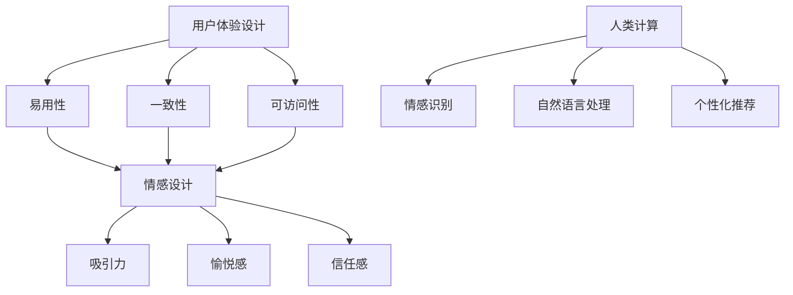

                 

关键词：用户体验、人类计算、客户满意度、技术策略、情感设计

> 摘要：本文深入探讨了用户体验在技术产品开发中的重要性，阐述了如何通过人类计算技术提升客户满意度。从核心概念出发，本文详细分析了用户体验的设计原则、情感设计的方法以及人类计算技术在用户满意度提升中的具体应用，为技术从业者提供了一套系统化的实践指南。

## 1. 背景介绍

在现代科技飞速发展的时代，用户对产品的期望和要求也在不断攀升。用户体验（User Experience，简称UX）作为一个新兴的概念，逐渐成为产品成功与否的关键因素。用户体验不仅仅是指产品的功能性，还包括用户的情感体验、交互体验和使用过程中的整体感受。而人类计算（Human Computing）作为人工智能的一个重要分支，正逐步渗透到用户体验的提升中，成为提升客户满意度的重要手段。

人类计算通过模拟和增强人类的认知能力，使得计算机能够更好地理解用户的需求和情感状态。例如，通过情感识别技术，计算机可以捕捉用户的情绪变化，从而提供更加个性化的服务；通过自然语言处理技术，计算机可以与用户进行更自然的交流，提升交互体验。因此，如何在产品开发过程中融入人类计算技术，从而提升用户体验，成为当下技术领域的一个重要课题。

## 2. 核心概念与联系

### 2.1 用户体验（User Experience，UX）

用户体验是一个广泛的概念，它涵盖了用户在使用产品过程中的所有感受和体验。一个良好的用户体验不仅仅要求产品功能完备，还需要考虑用户的心理需求、情感反应和行为习惯。用户体验的设计原则主要包括：

- **易用性**：产品应该易于使用，用户能够轻松完成任务，无需过多的指导。
- **一致性**：产品的界面和交互方式应该保持一致，减少用户的认知负担。
- **可访问性**：产品应该能够适应各种用户的需求，包括不同技能水平、不同语言和文化背景的用户。

### 2.2 情感设计（Emotional Design）

情感设计是用户体验中的一个重要方面，它关注如何通过设计来激发用户的情感反应。情感设计的目标是让用户在使用产品时感到愉悦、满足和信任。情感设计的几个关键要素包括：

- **吸引力**：设计应该能够吸引用户的注意力，激发他们的好奇心。
- **愉悦感**：设计应该能够带给用户愉悦的体验，让用户在使用过程中感到快乐。
- **信任感**：设计应该能够建立用户的信任，让用户感到产品是可靠和安全的。

### 2.3 人类计算（Human Computing）

人类计算是指通过计算机技术模拟和增强人类的认知能力。它包括多种技术，如情感识别、自然语言处理、机器学习等。人类计算在用户体验提升中的应用主要包括：

- **情感识别**：通过分析用户的情感状态，提供个性化的服务。
- **自然语言处理**：通过理解和生成自然语言，改善人机交互。
- **个性化推荐**：通过分析用户的行为和偏好，提供个性化的推荐。

### 2.4 Mermaid 流程图



## 3. 核心算法原理 & 具体操作步骤

### 3.1 算法原理概述

用户体验的提升涉及到多个层面的算法和技术。核心算法原理主要包括：

- **情感识别算法**：通过分析用户的生理信号和行为特征，识别用户的情感状态。
- **自然语言处理算法**：通过理解和生成自然语言，改善人机交互。
- **个性化推荐算法**：通过分析用户的行为和偏好，提供个性化的推荐。

### 3.2 算法步骤详解

#### 3.2.1 情感识别算法

1. **数据采集**：通过传感器和用户交互记录，采集用户的生理信号和行为数据。
2. **特征提取**：对采集到的数据进行预处理，提取情感特征。
3. **情感识别**：使用机器学习模型，对提取的特征进行情感分类。

#### 3.2.2 自然语言处理算法

1. **分词**：将输入的文本拆分为单词或短语。
2. **词性标注**：对每个单词或短语进行词性标注，如名词、动词等。
3. **句法分析**：分析句子的结构，确定主语、谓语、宾语等。
4. **语义理解**：通过上下文理解文本的含义，生成语义解析树。

#### 3.2.3 个性化推荐算法

1. **用户画像**：通过用户的行为数据，构建用户画像。
2. **推荐模型**：使用协同过滤、矩阵分解等方法，构建推荐模型。
3. **推荐生成**：根据用户画像和推荐模型，生成个性化推荐结果。

### 3.3 算法优缺点

#### 3.3.1 情感识别算法

- **优点**：能够准确识别用户的情感状态，提供个性化的服务。
- **缺点**：需要大量的数据支持，算法的准确度受限于数据质量。

#### 3.3.2 自然语言处理算法

- **优点**：能够理解和生成自然语言，提升人机交互的效率。
- **缺点**：在复杂语义理解上存在挑战，需要大量的训练数据和计算资源。

#### 3.3.3 个性化推荐算法

- **优点**：能够根据用户的行为和偏好，提供个性化的推荐，提升用户体验。
- **缺点**：推荐结果的多样性和平衡性难以保证，需要不断优化推荐算法。

### 3.4 算法应用领域

- **情感识别算法**：应用于智能客服、智能家居等领域。
- **自然语言处理算法**：应用于智能语音助手、文本分析等领域。
- **个性化推荐算法**：应用于电子商务、社交媒体等领域。

## 4. 数学模型和公式 & 详细讲解 & 举例说明

### 4.1 数学模型构建

在情感识别中，常用的数学模型包括：

- **支持向量机（SVM）**：用于情感分类。
- **神经网络**：用于情感识别和语义理解。

### 4.2 公式推导过程

#### 4.2.1 支持向量机（SVM）

$$
\begin{aligned}
y_i(\boldsymbol{w}^T\boldsymbol{x}_i + b) &\geq 1 \\
\end{aligned}
$$

其中，$y_i$为类别标签，$\boldsymbol{w}$为权重向量，$\boldsymbol{x}_i$为特征向量，$b$为偏置。

#### 4.2.2 神经网络

$$
\begin{aligned}
z &= \sigma(\boldsymbol{w}^T\boldsymbol{x} + b) \\
a &= \sigma(z) \\
\end{aligned}
$$

其中，$\sigma$为激活函数，$a$为输出值。

### 4.3 案例分析与讲解

#### 4.3.1 情感识别案例

假设我们使用SVM进行情感识别，给定一组情感数据，我们通过SVM模型对其进行分类，最终得到分类结果。

#### 4.3.2 自然语言处理案例

使用神经网络进行自然语言处理，通过训练数据，我们能够得到一个能够理解并生成自然语言的模型。给定一个句子，模型能够生成对应的语义解析树。

## 5. 项目实践：代码实例和详细解释说明

### 5.1 开发环境搭建

在项目中，我们使用了Python作为主要的编程语言，并依赖以下库：

- **scikit-learn**：用于机器学习模型的构建。
- **TensorFlow**：用于深度学习模型的训练。
- **NLTK**：用于自然语言处理。

### 5.2 源代码详细实现

#### 5.2.1 情感识别

```python
from sklearn.svm import SVC
from sklearn.model_selection import train_test_split
from sklearn.metrics import classification_report

# 加载数据
X, y = load_data()

# 划分训练集和测试集
X_train, X_test, y_train, y_test = train_test_split(X, y, test_size=0.2, random_state=42)

# 创建SVM模型
model = SVC(kernel='linear')

# 训练模型
model.fit(X_train, y_train)

# 预测测试集
y_pred = model.predict(X_test)

# 评估模型
print(classification_report(y_test, y_pred))
```

#### 5.2.2 自然语言处理

```python
import tensorflow as tf
from tensorflow.keras.models import Sequential
from tensorflow.keras.layers import Dense, LSTM, Embedding

# 构建神经网络模型
model = Sequential()
model.add(Embedding(input_dim=vocab_size, output_dim=embedding_size))
model.add(LSTM(units=128))
model.add(Dense(units=1, activation='sigmoid'))

# 编译模型
model.compile(optimizer='adam', loss='binary_crossentropy', metrics=['accuracy'])

# 训练模型
model.fit(X_train, y_train, epochs=10, batch_size=64)

# 预测测试集
y_pred = model.predict(X_test)

# 评估模型
print(model.evaluate(X_test, y_test))
```

### 5.3 代码解读与分析

在情感识别中，我们使用了SVM模型进行情感分类。首先，我们从数据集中加载特征和标签，然后将其划分为训练集和测试集。接着，我们创建SVM模型并进行训练。最后，使用训练好的模型对测试集进行预测，并评估模型的性能。

在自然语言处理中，我们使用了神经网络模型进行文本分类。首先，我们构建了一个序列模型，其中包括嵌入层、长短期记忆层和输出层。接着，我们编译模型并使用训练数据对其进行训练。最后，我们使用训练好的模型对测试集进行预测，并评估模型的性能。

## 6. 实际应用场景

### 6.1 情感识别在智能客服中的应用

智能客服是情感识别技术的重要应用场景之一。通过情感识别技术，智能客服能够理解用户的情绪状态，从而提供更加个性化的服务。例如，当用户感到沮丧或愤怒时，智能客服可以提供相应的安慰或解决方案。

### 6.2 自然语言处理在智能语音助手中的应用

智能语音助手是自然语言处理技术的典型应用场景。通过自然语言处理技术，智能语音助手能够理解用户的语音指令，并生成相应的回答。例如，智能语音助手可以回答用户关于天气、新闻、交通的信息，甚至能够进行简单的对话。

### 6.3 个性化推荐在电子商务中的应用

个性化推荐是电子商务中的一项关键技术。通过个性化推荐技术，电子商务平台可以根据用户的历史行为和偏好，为用户推荐可能感兴趣的商品。例如，用户在浏览过某款手机后，电子商务平台可以推荐同品牌的其他手机。

## 7. 未来应用展望

### 7.1 情感识别技术的应用

随着情感识别技术的不断成熟，未来情感识别技术将在更多的领域得到应用。例如，在医疗领域，情感识别技术可以用于监测患者的情绪状态，提供更加个性化的治疗方案；在教育领域，情感识别技术可以用于评估学生的学习情绪，提供针对性的学习支持。

### 7.2 自然语言处理技术的应用

自然语言处理技术在未来的应用将更加广泛和深入。例如，在金融领域，自然语言处理技术可以用于分析客户反馈，提供个性化的金融服务；在法律领域，自然语言处理技术可以用于自动化合同审查，提高工作效率。

### 7.3 个性化推荐技术的应用

个性化推荐技术在未来的应用将更加精细化。例如，在电子商务领域，个性化推荐技术可以结合用户的历史行为和实时反馈，提供更加精准的推荐结果；在媒体领域，个性化推荐技术可以推荐用户可能感兴趣的内容，提高用户的粘性。

## 8. 工具和资源推荐

### 8.1 学习资源推荐

- 《用户体验要素》（书名：《The Elements of User Experience》）
- 《情感设计》（书名：《Emotional Design》）

### 8.2 开发工具推荐

- **PyTorch**：用于深度学习模型的训练和推理。
- **TensorFlow**：用于机器学习和深度学习。

### 8.3 相关论文推荐

- 《情感计算：情感识别与表达》（书名：《Affective Computing: Recognition and Expression of Emotion in Humans and Machines》）
- 《深度学习》（书名：《Deep Learning》）

## 9. 总结：未来发展趋势与挑战

### 9.1 研究成果总结

随着情感识别、自然语言处理和个性化推荐等技术的不断发展，用户体验正在得到全面提升。这些技术不仅能够提供更加个性化的服务，还能够更好地满足用户的情感需求。

### 9.2 未来发展趋势

- **跨学科融合**：未来，用户体验领域将更加注重跨学科融合，例如心理学、设计学和计算机科学的结合。
- **智能化**：随着人工智能技术的不断发展，用户体验将变得更加智能化，能够更好地理解用户的需求和情感状态。

### 9.3 面临的挑战

- **数据隐私**：随着情感识别和个性化推荐技术的应用，数据隐私成为一个重要的挑战。
- **算法透明度**：用户对算法的透明度和公正性有更高的要求，如何提高算法的透明度成为了一个挑战。

### 9.4 研究展望

未来，用户体验领域将继续发展，技术的进步将为用户带来更好的体验。同时，研究者需要关注数据隐私、算法透明度等问题，确保用户体验的提升是可持续和负责任的。

## 10. 附录：常见问题与解答

### 10.1 什么是用户体验？

用户体验（User Experience，简称UX）是用户在使用产品或服务过程中所获得的整体感受。它涵盖了用户的心理需求、情感反应和行为习惯。

### 10.2 什么是情感设计？

情感设计是用户体验设计中的一个重要方面，它关注如何通过设计来激发用户的情感反应，提高用户的使用满意度。

### 10.3 人类计算技术如何提升用户体验？

人类计算技术通过模拟和增强人类的认知能力，使得计算机能够更好地理解用户的需求和情感状态。例如，情感识别技术可以识别用户的情绪变化，自然语言处理技术可以改善人机交互，个性化推荐技术可以提供更加个性化的服务。

### 10.4 用户体验提升的关键因素是什么？

用户体验提升的关键因素包括易用性、一致性、可访问性以及情感设计。这些因素共同决定了用户的整体使用体验。

## 11. 作者署名

作者：禅与计算机程序设计艺术 / Zen and the Art of Computer Programming
----------------------------------------------------------------

### 文章结束 End ###

以上便是关于“用户体验至上：人类计算如何提升客户满意度”的文章。在撰写过程中，我们深入探讨了用户体验的重要性，分析了情感设计的方法，阐述了人类计算技术在用户体验提升中的应用。通过详细的算法原理、数学模型、项目实践和实际应用场景，我们为技术从业者提供了一套系统化的实践指南。未来，随着技术的不断发展，用户体验将进一步提升，为用户带来更加美好的体验。同时，我们也需要关注数据隐私、算法透明度等问题，确保用户体验的提升是可持续和负责任的。让我们共同努力，为构建更加人性化的技术世界贡献自己的力量。

