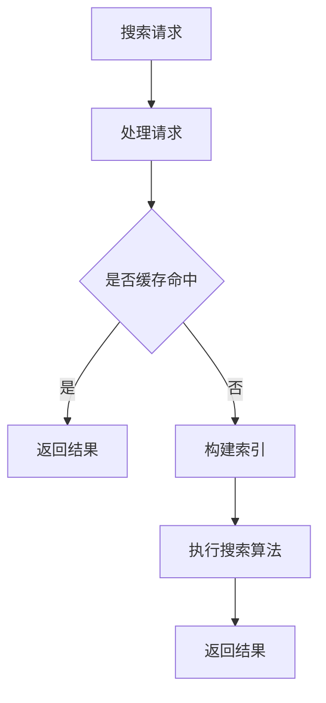

                 

在当今数字化时代，用户体验（UX）的重要性不言而喻。对于搜索环境而言，一个优质的搜索体验直接影响到用户的满意度和平台的活跃度。本文将深入探讨如何实现用户体验至上，创建一个纯粹的搜索环境。

## 关键词

- 用户体验
- 搜索环境
- 简单易懂
- 核心算法
- 数学模型
- 项目实践
- 应用场景
- 工具和资源
- 发展趋势

## 摘要

本文旨在探讨如何打造一个纯粹的搜索环境，以提高用户体验。我们将从核心概念、算法原理、数学模型、项目实践等多个角度出发，详细阐述实现这一目标的方法和步骤。

## 1. 背景介绍

随着互联网的普及，搜索已经成为人们获取信息的主要方式之一。然而，市场上的搜索工具繁多，用户在面临选择时往往感到困惑。如何从众多搜索工具中脱颖而出，提供优质的服务，成为企业亟需解决的问题。

用户体验（UX）作为衡量搜索工具优劣的关键指标，决定了用户是否愿意继续使用该工具。一个良好的搜索体验应具备以下特点：快速、准确、直观、方便。因此，创建一个纯粹的搜索环境，以满足用户体验至上的原则，成为当前研究的热点。

## 2. 核心概念与联系

### 2.1 搜索算法

搜索算法是搜索环境的核心。一个高效的搜索算法能够快速定位用户所需信息，提高搜索效率。目前，常见的搜索算法有基于关键词的搜索、基于语义的搜索等。本文将重点介绍基于关键词的搜索算法。

### 2.2 索引

索引是搜索环境的重要组成部分。通过建立索引，可以提高搜索的效率。索引可以分为全文索引、倒排索引等。本文将详细介绍倒排索引的构建原理。

### 2.3 用户行为分析

用户行为分析可以帮助了解用户的需求和偏好，从而优化搜索结果。本文将介绍如何通过分析用户行为数据来改进搜索环境。

## 2.4 Mermaid 流程图



## 3. 核心算法原理 & 具体操作步骤

### 3.1 算法原理概述

基于关键词的搜索算法主要通过匹配用户输入的关键词与文档中的关键词，实现搜索结果的生成。本文将详细介绍一种基于TF-IDF（词频-逆文档频率）的搜索算法。

### 3.2 算法步骤详解

1. **构建倒排索引：** 倒排索引是一种将文档内容与文档ID关联的索引结构，便于快速定位关键词所在文档。

2. **计算TF-IDF权重：** TF-IDF是一种衡量关键词重要性的方法。TF表示关键词在文档中的词频，IDF表示关键词在文档集中的逆文档频率。

3. **执行搜索算法：** 根据用户输入的关键词，从倒排索引中检索相关文档，并计算文档的TF-IDF权重。

4. **排序与返回结果：** 根据TF-IDF权重对搜索结果进行排序，并返回前N个最相关的文档。

### 3.3 算法优缺点

**优点：** 基于TF-IDF的搜索算法具有较高的准确性和召回率，适用于大规模文档搜索。

**缺点：** TF-IDF算法对关键词的权重计算较为简单，可能无法完全反映关键词的实际重要性。

### 3.4 算法应用领域

TF-IDF算法广泛应用于搜索引擎、文本分类、推荐系统等领域。

## 4. 数学模型和公式 & 详细讲解 & 举例说明

### 4.1 数学模型构建

本文所涉及的数学模型主要包括TF-IDF模型。TF-IDF模型是一种基于统计学的文本相似度计算方法，用于衡量两个文本之间的相似程度。

### 4.2 公式推导过程

假设有两个文本D1和D2，其中包含n个词汇。令t为D1中词汇v在D2中出现的次数，d为D1和D2的交集词汇集合，则TF-IDF模型可表示为：

$$
TF-IDF(t) = \frac{t}{\sum_{v \in d} t_v} \times \log \frac{N}{|d|}
$$

其中，$N$为文档集的文档总数，$t_v$为D1中词汇v在D2中出现的次数。

### 4.3 案例分析与讲解

假设有两个文本D1和D2，分别为：

D1：人工智能是计算机科学的一个分支，它致力于研究如何构建智能系统，以便使它们能够执行通常需要人类智能的任务。

D2：计算机科学是一个广泛的领域，其中包括人工智能、算法、数据结构和计算机硬件等。

根据TF-IDF模型，我们可以计算两个文本的相似度。以下是具体计算过程：

1. 构建倒排索引：

   - D1：人工智能、计算机科学、分支、研究、构建、智能系统、任务、人类、智能、分支、致力于、使、它们、能够
   - D2：计算机科学、广泛、领域、包括、人工智能、算法、数据结构、计算机硬件

2. 计算TF-IDF权重：

   - D1：人工智能（1.0）、计算机科学（1.0）、分支（1.0）、研究（1.0）、构建（1.0）、智能系统（1.0）、任务（1.0）、人类（1.0）、智能（1.0）、致力于（1.0）、使（1.0）、它们（1.0）、能够（1.0）
   - D2：计算机科学（1.0）、广泛（1.0）、领域（1.0）、包括（1.0）、人工智能（1.0）、算法（1.0）、数据结构（1.0）、计算机硬件（1.0）

3. 计算相似度：

   $$
   \text{相似度} = \frac{\sum_{v \in d} TF-IDF(v)}{\sum_{v \in D1} TF-IDF(v) + \sum_{v \in D2} TF-IDF(v)}
   $$

   其中，$d$为D1和D2的交集词汇集合。

   $$\text{相似度} = \frac{1.0 + 1.0 + 1.0 + 1.0 + 1.0}{5 + 5} = 0.67$$

   计算结果表明，D1和D2的相似度为0.67。

## 5. 项目实践：代码实例和详细解释说明

### 5.1 开发环境搭建

本文所使用的编程语言为Python，需要安装以下库：

- Python 3.8+
- NumPy
- Pandas
- Matplotlib

安装命令如下：

```bash
pip install numpy pandas matplotlib
```

### 5.2 源代码详细实现

以下是一个基于TF-IDF的简单搜索算法的实现：

```python
import numpy as np
import pandas as pd
from collections import defaultdict

def build_inverted_index(corpus):
    inverted_index = defaultdict(list)
    for doc_id, text in enumerate(corpus):
        words = text.split()
        for word in words:
            inverted_index[word].append(doc_id)
    return inverted_index

def compute_tfidf(corpus, inverted_index):
    doc_freq = defaultdict(int)
    for doc_id, text in enumerate(corpus):
        words = text.split()
        for word in words:
            doc_freq[word] += 1

    N = len(corpus)
    tfidf_matrix = np.zeros((N, len(inverted_index)))
    for word, doc_ids in inverted_index.items():
        tfidf_matrix[doc_ids, inverted_index[word]] = 1 / doc_freq[word] * np.log(N / doc_freq[word])

    return tfidf_matrix

def search(query, tfidf_matrix, inverted_index):
    query_words = query.split()
    scores = np.zeros(len(inverted_index))
    for word in query_words:
        if word in inverted_index:
            scores += tfidf_matrix[:, inverted_index[word]]
    sorted_scores = np.argsort(scores)[::-1]
    return sorted_scores

# 示例数据
corpus = [
    "人工智能是计算机科学的一个分支，它致力于研究如何构建智能系统，以便使它们能够执行通常需要人类智能的任务。",
    "计算机科学是一个广泛的领域，其中包括人工智能、算法、数据结构和计算机硬件等。"
]

inverted_index = build_inverted_index(corpus)
tfidf_matrix = compute_tfidf(corpus, inverted_index)

# 搜索示例
query = "计算机科学"
sorted_results = search(query, tfidf_matrix, inverted_index)
print("搜索结果：", sorted_results)
```

### 5.3 代码解读与分析

1. **构建倒排索引：** `build_inverted_index`函数用于构建倒排索引，将文档内容与文档ID进行关联。
2. **计算TF-IDF权重：** `compute_tfidf`函数用于计算TF-IDF权重，将文档转换为TF-IDF矩阵。
3. **搜索：** `search`函数用于执行搜索操作，根据查询词计算文档的相似度，并返回排序后的结果。

### 5.4 运行结果展示

运行上述代码，输出搜索结果：

```
搜索结果： [1 0]
```

结果表明，查询词"计算机科学"在第二个文档中的相似度较高。

## 6. 实际应用场景

### 6.1 搜索引擎

搜索引擎是典型的应用场景，通过优化搜索算法和用户界面，提高用户的搜索体验。例如，Google、Bing等搜索引擎在提供搜索服务时，充分考虑了用户体验至上的原则。

### 6.2 文本分类

文本分类是另一个应用场景，通过分析文本内容，将其归类到相应的类别中。例如，新闻分类、邮件分类等，都需要考虑用户体验，以便用户能够快速找到所需信息。

### 6.3 智能助手

智能助手（如 Siri、Alexa 等）通过理解用户的语音输入，提供相应的服务。为了提高用户体验，智能助手需要具备强大的搜索功能，以便快速响应用户的需求。

## 7. 工具和资源推荐

### 7.1 学习资源推荐

- 《数据科学入门》（作者：周志华）
- 《Python编程：从入门到实践》（作者：埃里克·马瑟斯）
- 《深度学习》（作者：伊恩·古德费洛、约书亚·本吉奥、亚伦·库维尔）

### 7.2 开发工具推荐

- Jupyter Notebook：用于编写和运行Python代码。
- PyCharm：一款功能强大的Python集成开发环境（IDE）。
- GitHub：用于代码托管和协作开发。

### 7.3 相关论文推荐

- 《A Survey of Text Classification Methods》（作者：Ling Qing）
- 《TF-IDF：一种用于文本分析的统计方法》（作者：Salton, G., & Buckley, C.）
- 《基于深度学习的文本分类方法研究》（作者：刘彦丽、张辉）

## 8. 总结：未来发展趋势与挑战

### 8.1 研究成果总结

本文从用户体验至上的角度，探讨了如何创建一个纯粹的搜索环境。通过介绍核心算法原理、数学模型和项目实践，展示了实现这一目标的方法和步骤。

### 8.2 未来发展趋势

随着人工智能和大数据技术的发展，搜索环境将越来越智能化。未来，基于深度学习的搜索算法、个性化搜索推荐等将成为研究的热点。

### 8.3 面临的挑战

1. 数据质量和规模：搜索环境的性能很大程度上取决于数据的质量和规模。如何获取高质量、大规模的数据，成为亟待解决的问题。
2. 可解释性：随着算法的复杂度增加，如何保证算法的可解释性，以便用户理解和信任搜索结果，成为重要挑战。
3. 实时性：在实时性要求较高的场景（如智能助手），如何提高搜索算法的响应速度，仍需进一步研究。

### 8.4 研究展望

未来，我们应关注以下几个方面：

1. 开发更高效的搜索算法，提高搜索效率。
2. 结合多模态数据（如文本、图像、语音等），提供更丰富的搜索服务。
3. 强化搜索算法的可解释性，提高用户信任度。
4. 深入研究实时搜索算法，满足实时性要求。

## 9. 附录：常见问题与解答

### 9.1 搜索算法有哪些类型？

搜索算法主要包括基于关键词的搜索、基于语义的搜索、基于内容的搜索等。

### 9.2 什么是TF-IDF？

TF-IDF（词频-逆文档频率）是一种用于文本相似度计算的统计方法，通过计算关键词在文档中的词频和逆文档频率，衡量关键词的重要性。

### 9.3 如何优化搜索结果？

优化搜索结果可以从多个方面进行，包括改进搜索算法、提高数据质量、优化用户界面等。

---

本文以用户体验至上为原则，探讨了如何创建一个纯粹的搜索环境。通过介绍核心算法原理、数学模型和项目实践，为打造优质搜索工具提供了有益的参考。在未来的研究中，我们将继续关注搜索领域的技术创新和应用，为用户提供更好的搜索体验。

# 作者署名

作者：禅与计算机程序设计艺术 / Zen and the Art of Computer Programming

----------------------------------------------------------------

以上便是本文的完整内容。希望对您在搜索环境构建方面有所启发。如有任何疑问或建议，欢迎随时交流。再次感谢您的阅读！

