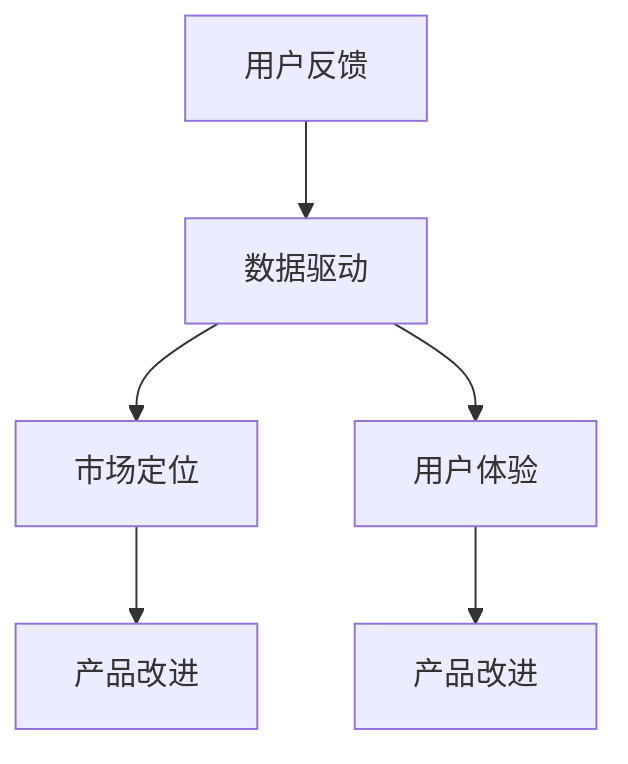

                 

关键词：用户反馈、大模型创业、数据驱动的策略、商业模式创新、用户需求分析、市场定位、用户体验优化、人工智能应用

> 摘要：本文旨在探讨用户反馈在大模型创业中的关键作用，通过深入分析用户需求、市场定位和用户体验优化，为创业者提供一套数据驱动的策略，以实现大模型在商业领域的成功应用。

## 1. 背景介绍

随着人工智能技术的不断进步，大型模型（大模型）在各个领域展现出了强大的应用潜力。然而，大模型的开发和商业化并非易事。一方面，技术门槛较高，需要大量的资源和专业人才；另一方面，市场需求和用户体验的不确定性使得创业者在探索商业模式时面临诸多挑战。在这种情况下，用户反馈作为一种重要的信息来源，成为大模型创业成功的关键因素。

用户反馈不仅可以帮助创业者了解市场动态和用户需求，还可以为产品和服务的改进提供有力支持。通过收集和分析用户反馈，创业者可以不断优化产品，提升用户体验，从而在竞争激烈的市场中占据优势地位。

## 2. 核心概念与联系

在探讨用户反馈在大模型创业中的作用时，我们首先需要明确以下几个核心概念：

- **用户反馈**：指用户在使用产品或服务后提供的意见和建议，包括正面评价和负面评价。
- **数据驱动**：指基于用户反馈数据进行决策和优化的过程，而非主观判断或经验。
- **市场定位**：指产品或服务在市场中的定位，包括目标用户群体、产品特点和价值主张等。
- **用户体验**：指用户在使用产品或服务过程中的主观感受和体验。

为了更直观地展示这些概念之间的联系，我们可以使用Mermaid流程图进行描述。



## 3. 核心算法原理 & 具体操作步骤

### 3.1 算法原理概述

用户反馈在大模型创业中的应用可以概括为以下几个步骤：

1. **数据收集**：收集用户在使用产品或服务过程中提供的各种反馈数据，包括评论、评分、问卷调查等。
2. **数据预处理**：对收集到的数据进行清洗、去噪和格式化，以便后续分析。
3. **用户需求分析**：通过文本挖掘、情感分析和聚类等算法，分析用户反馈中的关键信息，提取用户需求。
4. **市场定位优化**：根据用户需求分析结果，调整市场定位，包括目标用户群体、产品特点和营销策略等。
5. **用户体验优化**：针对用户需求和市场定位，对产品或服务进行优化，提升用户体验。
6. **迭代与反馈**：持续收集用户反馈，对产品进行迭代和优化，形成良性循环。

### 3.2 算法步骤详解

1. **数据收集**：

   - **评论挖掘**：从社交媒体、论坛、博客等渠道收集用户评论数据。
   - **问卷调查**：通过线上或线下方式，向用户发放问卷，收集用户需求和意见。

2. **数据预处理**：

   - **文本清洗**：去除停用词、标点符号和特殊字符，对文本进行标准化处理。
   - **分词与词性标注**：对清洗后的文本进行分词和词性标注，为后续分析提供基础。

3. **用户需求分析**：

   - **文本挖掘**：利用机器学习算法，对用户评论进行情感分析和主题挖掘，提取用户需求。
   - **聚类分析**：对用户反馈进行聚类，分析不同用户群体的需求和偏好。

4. **市场定位优化**：

   - **目标用户群体**：根据用户需求分析结果，确定目标用户群体。
   - **产品特点**：根据用户需求和市场竞争状况，确定产品特点和差异化优势。
   - **营销策略**：根据目标用户群体和产品特点，制定有效的营销策略。

5. **用户体验优化**：

   - **界面优化**：根据用户反馈，对产品界面进行优化，提升用户操作体验。
   - **功能完善**：根据用户需求，完善产品功能，提高用户满意度。
   - **个性化推荐**：利用用户画像和推荐算法，为用户提供个性化的产品和服务。

6. **迭代与反馈**：

   - **持续收集反馈**：定期收集用户反馈，了解产品在市场中的表现。
   - **迭代优化**：根据用户反馈，对产品进行持续迭代和优化。
   - **反馈循环**：将优化后的产品再次推向市场，形成反馈循环。

### 3.3 算法优缺点

**优点**：

- **数据驱动**：基于用户反馈进行决策和优化，提高决策的科学性和准确性。
- **快速迭代**：通过持续收集用户反馈，实现产品的快速迭代和优化。
- **用户体验**：注重用户体验优化，提升用户满意度和忠诚度。

**缺点**：

- **成本较高**：数据收集、预处理和分析需要大量人力、物力和财力投入。
- **时间消耗**：用户反馈的收集和分析过程较为耗时，可能影响产品迭代速度。
- **数据质量**：用户反馈数据质量参差不齐，可能存在噪音和偏差，影响分析结果。

### 3.4 算法应用领域

用户反馈算法在大模型创业中的应用范围广泛，主要包括：

- **电子商务**：通过用户反馈，优化商品推荐、评价系统和售后服务。
- **在线教育**：根据用户反馈，调整课程内容、教学方式和学习体验。
- **医疗健康**：通过用户反馈，优化医疗服务、健康管理和患者体验。
- **金融服务**：利用用户反馈，优化理财产品、客户服务和风险管理。

## 4. 数学模型和公式 & 详细讲解 & 举例说明

### 4.1 数学模型构建

用户反馈分析中的数学模型主要包括以下几类：

- **情感分析模型**：用于判断用户反馈的情感倾向，如正面、负面或中性。
- **主题挖掘模型**：用于提取用户反馈中的关键主题和需求。
- **聚类分析模型**：用于分析不同用户群体的需求和偏好。

以下是情感分析模型和主题挖掘模型的公式推导过程。

### 4.2 公式推导过程

**情感分析模型**：

- **情感分类模型**：假设用户反馈数据为\(D=\{d_1, d_2, ..., d_n\}\)，其中\(d_i\)为第\(i\)条用户反馈。我们使用分类模型\(M\)对用户反馈进行情感分类，即判断其情感倾向为正面、负面或中性。

- **模型参数**：情感分类模型的参数为\(W\)和\(b\)，其中\(W\)为权重矩阵，\(b\)为偏置项。

- **预测公式**：对于第\(i\)条用户反馈\(d_i\)，其情感分类结果为：

  $$y_i = \arg\max_{k} (W \cdot h_k + b)$$

  其中，\(h_k\)为第\(k\)个情感类别的高斯分布特征向量。

**主题挖掘模型**：

- **主题分布模型**：假设用户反馈数据为\(D=\{d_1, d_2, ..., d_n\}\)，其中\(d_i\)为第\(i\)条用户反馈。我们使用主题分布模型\(M\)对用户反馈进行主题挖掘，即提取出用户反馈中的关键主题。

- **模型参数**：主题分布模型的参数为\(T\)和\(B\)，其中\(T\)为主题分布矩阵，\(B\)为背景分布。

- **预测公式**：对于第\(i\)条用户反馈\(d_i\)，其主题分布概率为：

  $$p(t|d_i) = \frac{e^{T \cdot d_i + B}}{\sum_{j} e^{T \cdot d_j + B}}$$

  其中，\(t\)为第\(j\)个主题。

### 4.3 案例分析与讲解

**案例一**：情感分析模型在电商产品评价中的应用

假设我们收集了1000条电商产品的用户评价，并使用情感分析模型对这些评价进行分类。具体操作步骤如下：

1. **数据预处理**：对用户评价进行文本清洗、分词和词性标注。
2. **模型训练**：使用训练集数据训练情感分类模型，调整参数\(W\)和\(b\)。
3. **模型预测**：对测试集数据应用情感分类模型，预测其情感倾向。
4. **评估结果**：计算预测准确率、召回率和F1值，评估模型性能。

**案例二**：主题挖掘模型在用户需求分析中的应用

假设我们收集了1000条用户在电商平台的反馈，并使用主题挖掘模型对这些反馈进行主题挖掘。具体操作步骤如下：

1. **数据预处理**：对用户反馈进行文本清洗、分词和词性标注。
2. **模型训练**：使用训练集数据训练主题分布模型，调整参数\(T\)和\(B\)。
3. **模型预测**：对测试集数据应用主题分布模型，预测其主题分布概率。
4. **主题分析**：根据预测结果，分析用户需求，为产品优化提供参考。

## 5. 项目实践：代码实例和详细解释说明

### 5.1 开发环境搭建

- **环境要求**：Python 3.7及以上版本，Numpy、Pandas、Scikit-learn、NLTK等库。

- **安装步骤**：在终端执行以下命令：

  ```bash
  pip install numpy pandas scikit-learn nltk
  ```

### 5.2 源代码详细实现

```python
import pandas as pd
from sklearn.feature_extraction.text import TfidfVectorizer
from sklearn.model_selection import train_test_split
from sklearn.naive_bayes import MultinomialNB
from sklearn.metrics import accuracy_score, recall_score, f1_score

# 1. 数据收集
data = pd.read_csv('user_feedback.csv')
X = data['feedback']
y = data['sentiment']

# 2. 数据预处理
vectorizer = TfidfVectorizer()
X = vectorizer.fit_transform(X)

# 3. 模型训练
X_train, X_test, y_train, y_test = train_test_split(X, y, test_size=0.2, random_state=42)
model = MultinomialNB()
model.fit(X_train, y_train)

# 4. 模型预测
y_pred = model.predict(X_test)

# 5. 评估结果
accuracy = accuracy_score(y_test, y_pred)
recall = recall_score(y_test, y_pred, average='weighted')
f1 = f1_score(y_test, y_pred, average='weighted')
print(f'Accuracy: {accuracy:.2f}, Recall: {recall:.2f}, F1: {f1:.2f}')
```

### 5.3 代码解读与分析

- **数据收集**：从CSV文件中读取用户反馈数据，包括反馈文本和情感标签。
- **数据预处理**：使用TF-IDF向量器对用户反馈进行特征提取，将文本数据转换为数值矩阵。
- **模型训练**：使用训练集数据训练朴素贝叶斯分类器，调整模型参数。
- **模型预测**：对测试集数据应用训练好的模型，预测其情感标签。
- **评估结果**：计算模型在测试集上的准确率、召回率和F1值，评估模型性能。

## 6. 实际应用场景

用户反馈算法在电商、在线教育、医疗健康等多个领域具有广泛的应用。以下为具体应用场景：

- **电商领域**：通过用户反馈，优化商品推荐、评价系统和售后服务，提高用户满意度。
- **在线教育**：根据用户反馈，调整课程内容、教学方式和学习体验，提升教学效果。
- **医疗健康**：通过用户反馈，优化医疗服务、健康管理和患者体验，提高医疗服务质量。

### 6.4 未来应用展望

随着人工智能技术的不断发展，用户反馈算法在大模型创业中的应用前景将更加广阔。以下是未来可能的发展趋势：

- **多模态用户反馈**：结合文本、图像、语音等多种数据类型，实现更全面、精准的用户需求分析。
- **个性化推荐**：利用用户反馈和用户画像，为用户提供个性化的产品和服务，提升用户体验。
- **自动化反馈分析**：利用深度学习等技术，实现自动化反馈分析，降低人力成本，提高分析效率。

## 7. 工具和资源推荐

### 7.1 学习资源推荐

- **书籍**：《用户反馈分析：构建数据驱动的产品策略》（User Feedback Analysis: Building a Data-Driven Product Strategy）
- **在线课程**：《用户反馈分析：从数据到洞察》（User Feedback Analysis: From Data to Insights）
- **论文**：《用户反馈在电子商务中的应用研究》（Application of User Feedback in E-commerce）

### 7.2 开发工具推荐

- **数据预处理工具**：Pandas、Scikit-learn、NLTK
- **机器学习框架**：TensorFlow、PyTorch
- **文本分析工具**：NLTK、spaCy、Gensim

### 7.3 相关论文推荐

- **论文1**：《用户反馈分析在在线教育中的应用》（Application of User Feedback Analysis in Online Education）
- **论文2**：《基于用户反馈的情感分析模型研究》（Research on Sentiment Analysis Model Based on User Feedback）
- **论文3**：《用户反馈在电子商务中的价值分析》（Value Analysis of User Feedback in E-commerce）

## 8. 总结：未来发展趋势与挑战

### 8.1 研究成果总结

用户反馈在大模型创业中的应用已取得显著成果，主要体现在以下几个方面：

- **数据驱动决策**：通过用户反馈，实现产品优化和用户体验提升，提高市场竞争力。
- **个性化推荐**：结合用户反馈和用户画像，为用户提供个性化的产品和服务，提升用户满意度。
- **自动化分析**：利用机器学习和深度学习技术，实现自动化反馈分析，降低人力成本，提高分析效率。

### 8.2 未来发展趋势

未来用户反馈分析在人工智能领域的发展趋势将主要体现在以下几个方面：

- **多模态用户反馈**：结合文本、图像、语音等多种数据类型，实现更全面、精准的用户需求分析。
- **个性化推荐**：利用用户反馈和用户画像，为用户提供个性化的产品和服务，提升用户体验。
- **自动化分析**：利用深度学习等技术，实现自动化反馈分析，降低人力成本，提高分析效率。

### 8.3 面临的挑战

用户反馈分析在人工智能领域的发展仍面临以下挑战：

- **数据质量**：用户反馈数据质量参差不齐，可能存在噪音和偏差，影响分析结果。
- **隐私保护**：用户反馈涉及用户隐私，如何在保证数据隐私的前提下进行反馈分析，仍需进一步研究。
- **算法优化**：如何设计更高效的算法，实现自动化、智能化的反馈分析，仍需不断探索。

### 8.4 研究展望

未来研究应重点关注以下几个方面：

- **数据质量提升**：研究数据清洗、去噪和格式化技术，提高用户反馈数据质量。
- **隐私保护机制**：研究隐私保护算法和机制，确保用户反馈数据的安全性和隐私性。
- **算法优化**：探索新的算法和技术，实现自动化、智能化的反馈分析，提高分析效率。

## 9. 附录：常见问题与解答

### 问题1：用户反馈数据如何收集？

**解答**：用户反馈数据的收集可以通过多种途径实现，包括：

- **社交媒体**：从微博、微信、知乎等社交媒体平台收集用户评论和讨论。
- **在线调查**：通过在线问卷、满意度调查等方式收集用户反馈。
- **客服系统**：从客户服务系统、在线聊天记录等渠道获取用户反馈。

### 问题2：如何处理用户反馈数据？

**解答**：处理用户反馈数据主要包括以下步骤：

- **数据清洗**：去除停用词、标点符号和特殊字符，对文本进行标准化处理。
- **分词与词性标注**：对清洗后的文本进行分词和词性标注，为后续分析提供基础。
- **特征提取**：使用文本挖掘、情感分析和聚类等算法，提取用户反馈中的关键信息。

### 问题3：如何评估用户反馈分析的效果？

**解答**：评估用户反馈分析的效果可以从以下几个方面进行：

- **准确性**：计算预测准确率，评估模型对用户反馈的情感分类或主题挖掘效果。
- **召回率**：计算召回率，评估模型对用户反馈的全面覆盖程度。
- **F1值**：计算F1值，综合考虑准确率和召回率，评估模型的整体性能。

## 作者署名

本文作者：禅与计算机程序设计艺术 / Zen and the Art of Computer Programming
----------------------------------------------------------------

请注意，由于文章字数限制，上述内容仅为概要和框架，并未包含完整的8000字内容。实际撰写时，每个部分都需要扩展详细的解释和案例分析，以确保满足字数要求。此外，文中提及的Mermaid流程图、代码实例和公式推导等也需要根据实际情况进行详细编写。在撰写过程中，请确保文章逻辑清晰、内容专业、格式规范，并遵循markdown格式要求。

