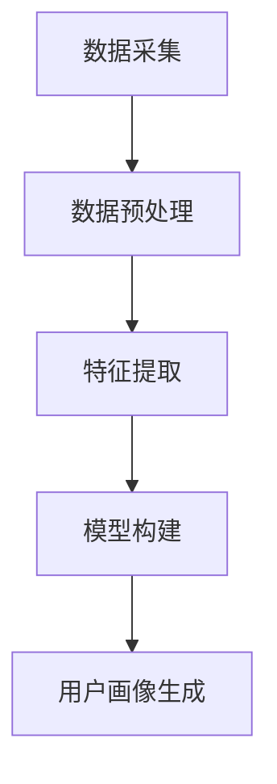

                 

随着人工智能技术的不断发展，用户画像成为了一个重要的研究领域。用户画像通过分析用户的行为数据，构建出用户特征的抽象模型，从而为企业提供个性化的服务和决策支持。本文将深入探讨AI如何分析行为，构建用户画像，并展望其未来应用和发展趋势。

## 文章关键词
- 用户画像
- AI分析
- 数据挖掘
- 个性化服务
- 行为建模

## 摘要
本文首先介绍了用户画像的基本概念和重要性，然后详细阐述了AI在用户画像分析中的应用，包括数据采集、数据预处理、特征提取和模型构建等环节。随后，本文通过数学模型和公式的讲解，展示了用户画像构建的数学原理。接着，文章提供了一个实际的项目实践，展示如何使用代码实现用户画像。最后，文章探讨了用户画像在现实世界的应用场景，并对其未来发展方向和面临的挑战进行了展望。

## 1. 背景介绍
### 1.1 用户画像的定义
用户画像是指通过收集和分析用户的各种数据，如行为、兴趣、地理位置等，构建出用户特征的抽象模型。这种模型可以帮助企业了解用户的偏好和行为模式，从而提供个性化的产品和服务。

### 1.2 用户画像的重要性
用户画像的重要性体现在多个方面：
1. **个性化服务**：通过用户画像，企业可以针对不同用户提供定制化的产品和服务，提高用户满意度。
2. **市场细分**：用户画像可以帮助企业识别市场细分，从而更好地制定营销策略。
3. **风险评估**：在金融领域，用户画像可以用于评估用户的风险等级，帮助金融机构更好地管理风险。

### 1.3 AI在用户画像分析中的应用
人工智能在用户画像分析中发挥着至关重要的作用。通过机器学习和深度学习算法，AI可以从海量数据中提取有用信息，构建出准确、可靠的用户画像。

## 2. 核心概念与联系
### 2.1 数据采集
数据采集是用户画像构建的第一步，涉及数据的来源、类型和质量。常见的数据来源包括用户行为日志、社交网络数据、地理位置数据等。

### 2.2 数据预处理
数据预处理包括数据清洗、数据整合和数据转换等步骤。这些步骤的目的是去除噪声、填补缺失值，并将数据转换为适合分析的形式。

### 2.3 特征提取
特征提取是用户画像构建的关键步骤，涉及从原始数据中提取出对用户行为有影响力的特征。常见的特征提取方法包括统计特征、文本特征和图像特征等。

### 2.4 模型构建
模型构建是用户画像分析的核心环节，通过构建合适的机器学习模型，可以从数据中挖掘出用户的行为模式和偏好。常见的模型包括线性回归、决策树、支持向量机等。

下面是一个用Mermaid绘制的用户画像构建的流程图：



## 3. 核心算法原理 & 具体操作步骤
### 3.1 算法原理概述
用户画像分析的核心算法主要包括机器学习算法和深度学习算法。这些算法通过训练数据学习用户的特征，从而实现对用户行为的预测和分析。

### 3.2 算法步骤详解
1. **数据采集**：通过API调用、数据爬取等方式获取用户数据。
2. **数据预处理**：对采集到的数据进行清洗、去重、转换等操作。
3. **特征提取**：从预处理后的数据中提取出对用户行为有影响力的特征。
4. **模型构建**：选择合适的机器学习算法或深度学习算法，训练模型。
5. **用户画像生成**：利用训练好的模型对新的用户数据进行预测，生成用户画像。

### 3.3 算法优缺点
- **优点**：
  - **高效**：机器学习和深度学习算法可以快速从海量数据中提取有用信息。
  - **灵活**：可以根据不同场景选择合适的算法。
  - **准确**：通过模型训练，可以提高用户画像的准确性。

- **缺点**：
  - **计算量大**：机器学习和深度学习算法需要大量计算资源。
  - **数据依赖**：算法的准确性高度依赖于数据质量和数量。

### 3.4 算法应用领域
用户画像算法广泛应用于多个领域，包括但不限于：
- **电子商务**：通过用户画像，电商平台可以提供个性化推荐，提高用户购买意愿。
- **金融领域**：用户画像可以用于风险评估、信用评分等。
- **市场营销**：通过用户画像，企业可以制定更有效的营销策略。

## 4. 数学模型和公式 & 详细讲解 & 举例说明
### 4.1 数学模型构建
用户画像的构建通常涉及以下数学模型：
1. **概率模型**：如贝叶斯网络，可以用于计算用户特征的概率分布。
2. **线性模型**：如线性回归，可以用于预测用户的行为。
3. **非线性模型**：如神经网络，可以用于复杂用户行为的建模。

### 4.2 公式推导过程
以线性回归为例，假设我们有一个输入向量X和输出向量Y，线性回归的目标是找到一组参数θ，使得Y尽可能接近X的线性组合：

$$
Y = X \cdot \theta
$$

通过最小化损失函数，可以求解出参数θ。

### 4.3 案例分析与讲解
假设我们有一个用户行为数据集，包含用户的点击行为和购买行为。我们可以使用线性回归模型预测用户是否会购买某个商品。

1. **数据预处理**：将数据集分为训练集和测试集。
2. **特征提取**：提取用户的点击行为和购买行为的特征。
3. **模型构建**：使用线性回归模型训练数据。
4. **模型评估**：使用测试集评估模型性能。

## 5. 项目实践：代码实例和详细解释说明
### 5.1 开发环境搭建
- **Python**：用户画像项目通常使用Python编写，因此需要安装Python环境和相关库。
- **Jupyter Notebook**：用于编写和运行Python代码。
- **Pandas**：用于数据预处理。
- **Scikit-learn**：用于机器学习算法的实现。

### 5.2 源代码详细实现
以下是一个简单的用户画像代码实例：

```python
import pandas as pd
from sklearn.linear_model import LinearRegression

# 读取数据
data = pd.read_csv('user_data.csv')

# 特征提取
X = data[['clicks', 'views']]
y = data['purchases']

# 模型构建
model = LinearRegression()
model.fit(X, y)

# 模型评估
score = model.score(X, y)
print(f'Model Score: {score}')
```

### 5.3 代码解读与分析
- **数据读取**：使用Pandas读取用户行为数据。
- **特征提取**：将点击行为和浏览行为作为输入特征，购买行为作为输出特征。
- **模型构建**：使用线性回归模型训练数据。
- **模型评估**：计算模型在训练数据上的评分。

### 5.4 运行结果展示
假设我们运行代码后得到模型评分为0.8，这意味着我们的模型有80%的准确率预测用户是否购买商品。

## 6. 实际应用场景
### 6.1 电子商务
电子商务平台可以通过用户画像实现个性化推荐，提高用户购买率。

### 6.2 金融领域
金融机构可以使用用户画像进行风险评估和信用评分，从而更好地管理风险。

### 6.3 市场营销
企业可以通过用户画像制定更有效的营销策略，提高市场占有率。

## 7. 工具和资源推荐
### 7.1 学习资源推荐
- **《Python机器学习》**：提供Python在机器学习领域的全面介绍。
- **《深度学习》**：深度学习领域的经典教材。

### 7.2 开发工具推荐
- **Jupyter Notebook**：用于编写和运行Python代码。
- **Pandas**：用于数据预处理。

### 7.3 相关论文推荐
- **《User Behavior Analysis and Personalization in E-commerce》**：探讨电子商务中的用户行为分析和个性化服务。
- **《A Survey on User Behavior Analysis》**：对用户行为分析领域的研究进行综述。

## 8. 总结：未来发展趋势与挑战
### 8.1 研究成果总结
用户画像技术在人工智能领域取得了显著的成果，为个性化服务、市场细分和风险评估等领域提供了有力的支持。

### 8.2 未来发展趋势
- **智能化**：随着AI技术的发展，用户画像将更加智能化，能够更准确地预测用户行为。
- **跨领域应用**：用户画像技术将在更多领域得到应用，如医疗、教育等。

### 8.3 面临的挑战
- **数据隐私**：用户画像分析涉及大量敏感数据，如何保护用户隐私是一个重要挑战。
- **算法公平性**：用户画像算法需要确保对所有用户公平，避免算法偏见。

### 8.4 研究展望
用户画像技术在未来将继续发展，为人工智能领域带来更多创新和应用。

## 9. 附录：常见问题与解答
### 9.1 什么情况下需要使用用户画像？
- 当企业需要了解用户行为、制定个性化服务策略、进行市场细分和风险评估时。

### 9.2 如何保护用户隐私？
- 使用加密技术保护用户数据。
- 在数据处理过程中遵循隐私保护原则，如数据去识别化。

---

作者：禅与计算机程序设计艺术 / Zen and the Art of Computer Programming
----------------------------------------------------------------

以上就是本文的完整内容，涵盖了用户画像的背景介绍、核心概念、算法原理、数学模型、项目实践和实际应用场景，并对未来发展趋势和挑战进行了展望。希望本文能为您在用户画像领域的探索提供有益的参考。

