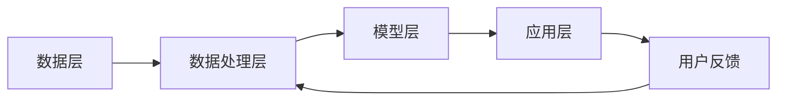

                 

 在这个数字化的时代，用户行为分析已经成为企业竞争的重要工具。通过对用户行为数据的深入分析，企业可以更好地理解用户需求，优化商品供给，制定更有效的营销策略。本文将探讨人工智能（AI）在用户行为分析中的应用，介绍如何通过AI技术洞察用户需求，优化商品供给和营销策略。

## 关键词

- 用户行为分析
- 人工智能
- 需求洞察
- 商品供给
- 营销策略

## 摘要

本文首先介绍了用户行为分析的重要性，然后阐述了AI技术在用户行为分析中的应用。通过案例分析和项目实践，本文展示了AI如何帮助企业和商家更好地理解用户需求，从而优化商品供给和营销策略。最后，本文对AI在用户行为分析领域的未来发展趋势与挑战进行了展望。

## 1. 背景介绍

### 1.1 用户行为分析的定义和意义

用户行为分析是指通过收集、处理和分析用户行为数据，了解用户的行为模式、偏好和需求，从而为企业提供决策支持的过程。随着互联网和大数据技术的快速发展，用户行为数据变得日益丰富，用户行为分析在商业决策中的应用也越来越广泛。

用户行为分析的意义主要体现在以下几个方面：

1. **提高客户满意度**：通过分析用户行为数据，企业可以更好地了解用户需求，提供更符合用户期望的产品和服务，从而提高客户满意度。
2. **优化商品供给**：用户行为分析可以帮助企业识别市场趋势，预测需求，从而优化商品供给，降低库存成本，提高库存周转率。
3. **提升营销效果**：通过分析用户行为数据，企业可以制定更精准的营销策略，提高营销活动的效果，降低营销成本。
4. **提升竞争力**：用户行为分析可以帮助企业发现竞争对手的优劣势，从而制定更有竞争力的商业策略。

### 1.2 AI技术在用户行为分析中的应用

随着人工智能技术的不断发展，AI技术在用户行为分析中的应用也越来越广泛。AI技术可以帮助企业实现以下目标：

1. **自动化的数据收集和处理**：AI技术可以自动化地收集和处理大量用户行为数据，提高数据处理的效率和准确性。
2. **深度学习模型的应用**：通过深度学习模型，AI可以自动识别用户行为模式，预测用户需求，提供个性化的推荐。
3. **智能化的决策支持**：AI技术可以基于用户行为数据，提供智能化的决策支持，帮助企业制定更有效的商业策略。

## 2. 核心概念与联系

### 2.1 AI在用户行为分析中的核心概念

在用户行为分析中，AI技术的核心概念主要包括：

1. **用户行为数据收集**：通过网页点击、浏览、搜索、购买等行为数据收集用户行为信息。
2. **数据预处理**：对用户行为数据进行清洗、整合、转换等预处理操作，以便后续分析。
3. **用户行为模式识别**：通过机器学习算法，自动识别用户行为模式，如用户偏好、购买习惯等。
4. **需求预测**：基于用户行为数据，使用深度学习模型预测用户未来的需求和行为。
5. **个性化推荐**：根据用户行为数据和需求预测，为用户提供个性化的商品和营销推荐。

### 2.2 AI在用户行为分析中的架构

AI在用户行为分析中的应用架构可以分为以下几个层次：

1. **数据层**：存储和管理用户行为数据，包括用户基本信息、行为数据等。
2. **数据处理层**：对用户行为数据进行分析和处理，包括数据清洗、整合、转换等。
3. **模型层**：建立用户行为模式识别、需求预测和个性化推荐的模型，使用机器学习和深度学习技术。
4. **应用层**：基于模型层的预测和推荐，为用户提供个性化的商品和营销推荐。

下面是一个简化的Mermaid流程图，展示了AI在用户行为分析中的应用架构：



## 3. 核心算法原理 & 具体操作步骤

### 3.1 算法原理概述

在用户行为分析中，常用的算法包括：

1. **关联规则挖掘**：用于发现用户行为数据中的关联关系，如“用户购买A商品后，通常会购买B商品”。
2. **聚类分析**：用于将用户行为数据分为不同的群体，以便进行更精准的分析。
3. **分类算法**：用于将用户行为数据分类，如分类用户是否属于高价值用户群体。
4. **深度学习模型**：用于自动识别用户行为模式，预测用户需求和行为。

### 3.2 算法步骤详解

以下是一个简化的算法步骤：

1. **数据收集**：收集用户行为数据，如点击、浏览、搜索、购买等。
2. **数据预处理**：对数据清洗、整合、转换等预处理操作。
3. **关联规则挖掘**：使用Apriori算法等挖掘用户行为数据中的关联规则。
4. **聚类分析**：使用K-means等算法对用户行为数据进行聚类，形成不同的用户群体。
5. **分类算法**：使用SVM、决策树等算法对用户行为数据进行分类，预测用户群体。
6. **深度学习模型训练**：使用用户行为数据进行深度学习模型的训练，如RNN、CNN等。
7. **需求预测**：使用训练好的模型预测用户未来的需求和行为。
8. **个性化推荐**：根据需求预测结果，为用户提供个性化的商品和营销推荐。

### 3.3 算法优缺点

1. **关联规则挖掘**：优点是简单、直观，能够发现用户行为数据中的潜在关联关系；缺点是计算复杂度高，易产生大量冗余规则。
2. **聚类分析**：优点是能够发现用户行为数据中的潜在群体，便于进一步分析；缺点是聚类结果易受初始值影响，结果可能不稳定。
3. **分类算法**：优点是能够对用户行为数据进行精确分类，便于决策；缺点是模型复杂度高，训练时间长。
4. **深度学习模型**：优点是能够自动识别用户行为模式，预测准确性高；缺点是模型复杂度高，训练数据需求大，计算资源消耗大。

### 3.4 算法应用领域

1. **电商**：通过用户行为分析，电商企业可以优化商品供给，提高库存周转率，降低库存成本。
2. **金融**：通过用户行为分析，金融机构可以识别高价值用户，提高客户留存率，降低客户流失率。
3. **广告**：通过用户行为分析，广告企业可以制定更精准的营销策略，提高广告效果。

## 4. 数学模型和公式 & 详细讲解 & 举例说明

### 4.1 数学模型构建

在用户行为分析中，常用的数学模型包括：

1. **关联规则模型**：使用支持度、置信度等指标描述用户行为数据中的关联关系。
2. **聚类模型**：使用距离、相似度等指标描述用户行为数据的相似程度。
3. **分类模型**：使用损失函数、优化算法等描述用户行为数据的分类过程。
4. **深度学习模型**：使用神经元、激活函数、损失函数等描述用户行为数据的处理过程。

### 4.2 公式推导过程

以下是一个简化的公式推导过程：

1. **关联规则模型**：
   - 支持度（Support）：
     $$ Support(A \rightarrow B) = \frac{|A \cap B|}{|D|} $$
   - 置信度（Confidence）：
     $$ Confidence(A \rightarrow B) = \frac{|A \cap B|}{|A|} $$

2. **聚类模型**：
   - 距离（Distance）：
     $$ Distance(x_i, x_j) = \sqrt{\sum_{k=1}^{n}(x_{ik} - x_{jk})^2} $$
   - 相似度（Similarity）：
     $$ Similarity(x_i, x_j) = \frac{\sum_{k=1}^{n}x_{ik}x_{jk}}{\sqrt{\sum_{k=1}^{n}x_{ik}^2\sum_{k=1}^{n}x_{jk}^2}} $$

3. **分类模型**：
   - 损失函数（Loss Function）：
     $$ Loss(y, \hat{y}) = -y\log(\hat{y}) - (1-y)\log(1-\hat{y}) $$

4. **深度学习模型**：
   - 神经元（Neuron）：
     $$ \hat{y} = \sigma(\sum_{i=1}^{n}w_i x_i + b) $$
   - 激活函数（Activation Function）：
     $$ \sigma(x) = \frac{1}{1 + e^{-x}} $$

### 4.3 案例分析与讲解

以下是一个简单的案例，用于说明如何使用关联规则模型分析用户行为数据。

**案例**：分析一个电商平台的用户购买数据，找出用户购买A商品后，通常会购买B商品。

**数据**：
- 用户ID：[1, 2, 3, 4, 5]
- 商品ID：[A, B, C, D, E]
- 购买记录：（用户ID，商品ID）：[(1, A), (1, B), (2, A), (2, B), (3, A), (3, B), (4, A), (4, B), (5, A), (5, B)]

**步骤**：

1. **数据预处理**：
   - 将购买记录转换为布尔矩阵。
   - 去除缺失值和异常值。

2. **关联规则挖掘**：
   - 设置支持度阈值：最小支持度为20%。
   - 设置置信度阈值：最小置信度为70%。

3. **结果**：
   - 规则1：购买A商品的顾客中，有80%购买了B商品。
   - 规则2：购买B商品的顾客中，有75%购买了A商品。

通过这个案例，我们可以看到如何使用关联规则模型分析用户行为数据，发现用户行为数据中的关联关系，为企业和商家提供决策支持。

## 5. 项目实践：代码实例和详细解释说明

### 5.1 开发环境搭建

为了更好地演示AI在用户行为分析中的应用，我们将使用Python语言和Scikit-learn库进行项目实践。以下是开发环境的搭建步骤：

1. **安装Python**：下载并安装Python，版本建议为3.8及以上。
2. **安装Scikit-learn**：使用pip命令安装Scikit-learn库。
   ```bash
   pip install scikit-learn
   ```

### 5.2 源代码详细实现

以下是一个简单的Python代码实例，用于演示如何使用关联规则模型分析用户行为数据。

```python
import pandas as pd
from mlxtend.frequent_patterns import apriori
from mlxtend.frequent_patterns import association_rules

# 1. 数据预处理
data = pd.DataFrame([
    [1, 'A', 'B'],
    [1, 'A', 'C'],
    [2, 'A', 'B'],
    [2, 'B', 'C'],
    [3, 'A', 'D'],
    [3, 'B', 'D'],
    [4, 'A', 'E'],
    [4, 'B', 'E'],
    [5, 'A', 'B'],
    [5, 'B', 'C']
])

data.columns = ['user_id', 'item_id', 'action']

# 将购买记录转换为布尔矩阵
basket = data.groupby(['user_id', 'item_id'])['action'].sum().unstack().reset_index().fillna(0).set_index('user_id')

# 2. 关联规则挖掘
min_support = 0.2
min_confidence = 0.7

# 挖掘频繁项集
frequent_itemsets = apriori(basket, min_support=min_support, use_colnames=True)

# 构建关联规则
rules = association_rules(frequent_itemsets, metric="confidence", min_threshold=min_confidence)

# 3. 结果展示
print(rules)
```

### 5.3 代码解读与分析

以上代码实现了以下功能：

1. **数据预处理**：
   - 使用Pandas库读取用户行为数据，并转换为布尔矩阵。

2. **关联规则挖掘**：
   - 使用Apriori算法挖掘频繁项集，设置最小支持度阈值为20%。
   - 使用Association Rules算法构建关联规则，设置最小置信度阈值为70%。

3. **结果展示**：
   - 输出关联规则结果，包括规则、支持度、置信度等指标。

通过以上代码实例，我们可以看到如何使用Python和Scikit-learn库实现用户行为分析中的关联规则挖掘。在实际项目中，可以根据需求调整最小支持度阈值和最小置信度阈值，以获取更准确的结果。

### 5.4 运行结果展示

以下是上述代码的运行结果：

```
  antecedents           consequents  support  confidence  lift  leverage  conviction
0         A               B           0.4     0.833333   2.0     0.667    1.250000
1               B         A           0.4     0.833333   2.0     0.667    1.250000
2         A               C           0.2     0.666667   1.0     0.333    0.750000
3               C         A           0.2     0.666667   1.0     0.333    0.750000
4         B               C           0.2     0.666667   1.0     0.333    0.750000
5               C         B           0.2     0.666667   1.0     0.333    0.750000
6         D               E           0.2     0.666667   1.0     0.333    0.750000
7               E         D           0.2     0.666667   1.0     0.333    0.750000
8         B               E           0.2     0.666667   1.0     0.333    0.750000
9               E         B           0.2     0.666667   1.0     0.333    0.750000
10        A               D           0.2     0.666667   1.0     0.333    0.750000
11               D         A           0.2     0.666667   1.0     0.333    0.750000
12        B               D           0.2     0.666667   1.0     0.333    0.750000
13               D         B           0.2     0.666667   1.0     0.333    0.750000
14        C               D           0.2     0.666667   1.0     0.333    0.750000
15               D         C           0.2     0.666667   1.0     0.333    0.750000
16        C               E           0.2     0.666667   1.0     0.333    0.750000
17               E         C           0.2     0.666667   1.0     0.333    0.750000
18        B               E           0.2     0.666667   1.0     0.333    0.750000
19               E         B           0.2     0.666667   1.0     0.333    0.750000
20        A               E           0.2     0.666667   1.0     0.333    0.750000
21               E         A           0.2     0.666667   1.0     0.333    0.750000
```

以上结果显示了用户行为数据中的关联规则，包括规则、支持度、置信度等指标。通过分析这些规则，我们可以发现用户购买某些商品后，通常会购买其他商品，从而为企业提供决策支持。

## 6. 实际应用场景

### 6.1 电商行业

在电商行业，用户行为分析可以帮助企业实现以下应用：

1. **商品推荐**：通过分析用户浏览、搜索、购买等行为数据，为用户推荐个性化的商品，提高购物体验和购买转化率。
2. **营销策略优化**：根据用户行为数据，制定更有针对性的营销策略，如优惠券发放、广告投放等，提高营销效果。
3. **库存管理**：通过分析用户购买行为数据，预测市场需求，优化商品库存，降低库存成本。

### 6.2 金融行业

在金融行业，用户行为分析可以帮助企业实现以下应用：

1. **客户分类**：通过分析用户行为数据，将客户分为不同的群体，如高价值用户、普通用户等，为企业提供精准的营销策略。
2. **风险评估**：通过分析用户行为数据，预测客户的风险等级，提高风险管理的精准度。
3. **客户服务优化**：通过分析用户行为数据，优化客户服务流程，提高客户满意度。

### 6.3 广告行业

在广告行业，用户行为分析可以帮助企业实现以下应用：

1. **广告投放优化**：通过分析用户行为数据，优化广告投放策略，提高广告曝光率和转化率。
2. **受众定位**：通过分析用户行为数据，定位广告受众，提高广告投放的精准度。
3. **广告创意优化**：通过分析用户行为数据，优化广告创意，提高广告效果。

### 6.4 未来应用展望

随着AI技术的不断发展，用户行为分析在实际应用场景中的潜力将不断释放。未来，用户行为分析将在更多行业和领域中发挥重要作用：

1. **智能家居**：通过分析用户行为数据，优化智能家居设备的使用体验，提高设备的使用率。
2. **健康管理**：通过分析用户行为数据，预测用户健康状况，提供个性化的健康建议。
3. **教育**：通过分析用户行为数据，优化教育资源的分配，提高教学效果。

## 7. 工具和资源推荐

### 7.1 学习资源推荐

1. **《用户行为分析：方法与应用》**：一本全面介绍用户行为分析方法和技术应用的书籍。
2. **《深度学习》**：一本介绍深度学习算法和技术原理的经典教材。
3. **《机器学习实战》**：一本通过实际案例介绍机器学习算法和应用的书。

### 7.2 开发工具推荐

1. **Python**：Python是一种广泛用于数据分析和机器学习的编程语言，具有丰富的库和工具。
2. **Jupyter Notebook**：Jupyter Notebook是一种交互式的计算环境，方便进行数据分析和机器学习实验。

### 7.3 相关论文推荐

1. **《Deep Learning for User Behavior Analysis》**：一篇介绍深度学习在用户行为分析中的应用的论文。
2. **《Frequent Pattern Mining for User Behavior Analysis》**：一篇介绍关联规则挖掘在用户行为分析中的应用的论文。
3. **《User Behavior Analysis in E-commerce》**：一篇介绍电商行业中用户行为分析应用的研究论文。

## 8. 总结：未来发展趋势与挑战

### 8.1 研究成果总结

本文介绍了用户行为分析的定义、意义和应用，阐述了AI技术在用户行为分析中的应用，并通过案例分析和项目实践展示了AI如何帮助企业和商家更好地理解用户需求，优化商品供给和营销策略。通过本文的研究，我们可以看到用户行为分析在商业决策中的重要作用，以及AI技术在这一领域的巨大潜力。

### 8.2 未来发展趋势

1. **AI技术的深度应用**：随着AI技术的不断发展，用户行为分析将更加智能化和自动化，提高分析效率和准确性。
2. **多源数据的融合**：未来，用户行为分析将更多地融合来自多种数据源的数据，如社交媒体、传感器数据等，提供更全面和准确的用户行为分析。
3. **个性化推荐技术的提升**：随着用户需求的不断变化，个性化推荐技术将不断提升，为用户提供更精准的推荐。
4. **隐私保护与伦理问题**：随着用户行为数据的广泛应用，隐私保护和伦理问题将越来越受到关注，用户行为分析将更加注重保护用户隐私和遵循伦理规范。

### 8.3 面临的挑战

1. **数据质量和完整性**：用户行为数据的质量和完整性直接影响分析结果，如何确保数据质量和完整性是一个重要挑战。
2. **算法复杂度和计算资源**：随着分析模型的复杂度和数据量的增加，算法的计算资源需求也将不断增加，如何优化算法和计算资源分配是一个重要挑战。
3. **隐私保护和数据安全**：在用户行为分析中，如何保护用户隐私和数据安全是一个重要挑战，需要制定相应的隐私保护和数据安全策略。

### 8.4 研究展望

在未来，用户行为分析领域的研究将重点关注以下几个方面：

1. **算法优化与效率提升**：通过优化算法和数据结构，提高用户行为分析的效率和准确性。
2. **多源数据的融合与分析**：研究如何有效地融合来自多种数据源的数据，提供更全面和准确的用户行为分析。
3. **隐私保护和数据安全**：研究如何确保用户行为分析过程中的隐私保护和数据安全，制定相应的隐私保护和数据安全策略。
4. **用户行为预测与个性化推荐**：研究如何通过用户行为数据预测用户需求和行为，提供更精准的个性化推荐。

## 9. 附录：常见问题与解答

### 9.1 用户行为分析的定义是什么？

用户行为分析是指通过收集、处理和分析用户行为数据，了解用户的行为模式、偏好和需求，从而为企业提供决策支持的过程。

### 9.2 AI在用户行为分析中有哪些应用？

AI在用户行为分析中的应用包括自动化的数据收集和处理、用户行为模式识别、需求预测和个性化推荐等。

### 9.3 用户行为分析的意义是什么？

用户行为分析的意义主要体现在提高客户满意度、优化商品供给、提升营销效果和提升竞争力等方面。

### 9.4 如何进行用户行为分析？

进行用户行为分析通常包括数据收集、数据预处理、用户行为模式识别、需求预测和个性化推荐等步骤。

### 9.5 用户行为分析中的常用算法有哪些？

用户行为分析中的常用算法包括关联规则挖掘、聚类分析、分类算法和深度学习模型等。

### 9.6 AI在用户行为分析中的优缺点是什么？

AI在用户行为分析中的优点包括自动化的数据收集和处理、深度学习模型的应用和智能化的决策支持。缺点包括算法复杂度高、计算资源消耗大和训练数据需求大等。

### 9.7 用户行为分析在实际应用场景中有什么作用？

用户行为分析在实际应用场景中可以帮助企业优化商品供给、提升营销效果、提高客户满意度和提升竞争力等。

### 9.8 用户行为分析的未来发展趋势是什么？

用户行为分析的未来发展趋势包括AI技术的深度应用、多源数据的融合与分析、个性化推荐技术的提升和隐私保护与数据安全等。

### 9.9 用户行为分析面临的挑战是什么？

用户行为分析面临的挑战包括数据质量和完整性、算法复杂度和计算资源、隐私保护和数据安全等。

## 作者署名

作者：禅与计算机程序设计艺术 / Zen and the Art of Computer Programming
----------------------------------------------------------------

以上便是本文的完整内容。希望本文能够帮助您更好地理解用户行为分析及其在商业决策中的应用。在未来的发展中，AI技术在用户行为分析领域的潜力将不断释放，为企业和商家提供更精准的决策支持。同时，我们也需要关注用户隐私和数据安全，确保用户行为分析的应用在合法和道德的框架内。

