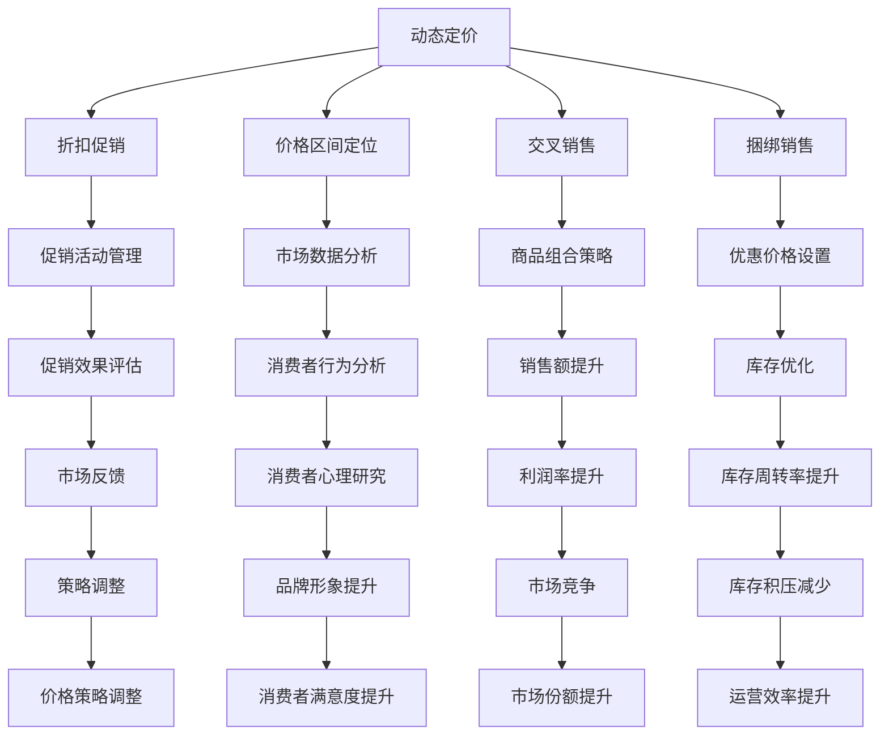

                 

关键词：电商、价格优化、算法、数学模型、应用实例、未来展望

## 摘要

本文深入探讨了电商价格优化的技术实现。从背景介绍、核心概念与联系、核心算法原理、数学模型与公式、项目实践、实际应用场景、工具和资源推荐以及未来发展趋势与挑战等多个方面，系统地阐述了电商价格优化的技术方法和实现路径。通过分析相关算法、数学模型及其在实际项目中的应用，本文为电商从业者提供了一套实用、全面的技术解决方案。

## 1. 背景介绍

随着互联网技术的迅猛发展和电子商务的普及，电商平台已经成为现代零售业的重要组成部分。在激烈的市场竞争中，如何通过合理的价格策略来吸引消费者、提高销售额，成为电商企业关注的焦点。价格优化作为电商运营的重要环节，旨在通过科学的方法来调整商品价格，从而实现最大化收益。

电商价格优化不仅涉及商品定价策略的制定，还需要考虑市场供需关系、竞争态势、消费者行为等多方面因素。传统的价格策略往往依赖于经验判断，难以实现精确的定价，而现代智能算法和数学模型的应用，为电商价格优化提供了新的思路和方法。

本文旨在通过对电商价格优化的技术实现进行深入探讨，为电商从业者提供理论指导和实际操作方案，助力企业提高市场竞争力和盈利能力。

### 电商价格优化的意义和作用

电商价格优化在电商运营中具有至关重要的作用。首先，合理的价格策略能够直接影响消费者的购买决策。消费者在购物时往往会根据价格来判断商品的价值和品质，因此，通过优化价格，可以有效吸引消费者的关注，提高转化率。

其次，价格优化有助于提升企业的品牌形象和市场份额。在竞争激烈的市场环境中，价格策略是电商企业差异化竞争的重要手段。通过科学的定价策略，企业可以在保证利润的前提下，制定具有竞争力的价格，从而在消费者心中树立良好的品牌形象。

此外，价格优化还可以提高库存周转率和减少库存积压。电商企业往往需要根据市场需求和库存情况来调整商品价格，通过合理的价格优化策略，可以促进商品的销售，减少库存积压，提高库存周转率。

最后，价格优化对于提高企业的盈利能力和市场竞争力具有重要意义。在价格竞争激烈的市场中，通过科学的定价策略，企业可以合理控制成本，提高利润空间，从而在市场竞争中立于不败之地。

### 电商价格优化的常见方法

在电商运营中，常见的价格优化方法主要包括以下几种：

1. **动态定价**：动态定价是根据市场供需关系、消费者行为等多方面因素实时调整商品价格的一种方法。通过大数据分析和机器学习算法，电商平台可以预测市场需求，从而制定更具针对性的价格策略。动态定价方法具有较高的灵活性和精确度，有助于提高销售额和盈利能力。

2. **折扣促销**：折扣促销是电商企业常用的价格优化手段之一，通过给予消费者一定的折扣优惠，吸引消费者购买商品。折扣促销可以分为全场折扣、单品折扣、满减优惠等多种形式，可以根据不同的促销目标和市场需求灵活调整。

3. **价格区间定位**：价格区间定位是基于商品定位和消费者心理价位来设定价格区间的一种方法。通过分析市场数据和消费者行为，电商企业可以确定商品的目标价格区间，从而制定合理的定价策略。价格区间定位有助于提高消费者的购买意愿和满意度。

4. **交叉销售和捆绑销售**：交叉销售和捆绑销售是利用价格策略促进商品组合销售的方法。通过设置组合优惠价格，电商平台可以鼓励消费者购买多种商品，从而提高销售额和利润率。

5. **价格弹性分析**：价格弹性分析是通过对消费者对价格变动的敏感度进行定量分析，以确定最优价格的一种方法。通过分析价格弹性和市场需求，电商企业可以制定更具针对性的定价策略，提高定价的准确性和科学性。

这些方法在电商价格优化中各有优势，企业可以根据自身情况和市场环境选择合适的方法进行应用。

### 2. 核心概念与联系

#### 电商价格优化的核心概念

电商价格优化的核心概念包括动态定价、折扣促销、价格区间定位、交叉销售和捆绑销售等。这些概念在电商价格优化中起着至关重要的作用，下面将分别进行详细解释。

**动态定价**：动态定价是根据市场供需关系、消费者行为等多方面因素实时调整商品价格的一种定价方法。通过大数据分析和机器学习算法，电商平台可以预测市场需求，从而制定更具针对性的价格策略。动态定价方法具有较高的灵活性和精确度，有助于提高销售额和盈利能力。

**折扣促销**：折扣促销是通过给予消费者一定的折扣优惠，吸引消费者购买商品的一种促销手段。折扣促销可以分为全场折扣、单品折扣、满减优惠等多种形式，可以根据不同的促销目标和市场需求灵活调整。折扣促销方法能够有效提升消费者购买意愿和满意度。

**价格区间定位**：价格区间定位是基于商品定位和消费者心理价位来设定价格区间的一种定价方法。通过分析市场数据和消费者行为，电商企业可以确定商品的目标价格区间，从而制定合理的定价策略。价格区间定位有助于提高消费者的购买意愿和满意度。

**交叉销售**：交叉销售是利用价格策略促进商品组合销售的一种方法。通过设置组合优惠价格，电商平台可以鼓励消费者购买多种商品，从而提高销售额和利润率。交叉销售方法能够增加消费者购买量，提高销售额。

**捆绑销售**：捆绑销售是将多种商品组合在一起，以优惠价格销售的一种促销手段。通过捆绑销售，电商平台可以降低消费者购买单个商品的决策成本，提高购买量。捆绑销售方法能够提升消费者的购物体验和满意度。

#### 电商价格优化的联系与架构

电商价格优化的各个核心概念之间存在着密切的联系和相互影响。动态定价、折扣促销、价格区间定位、交叉销售和捆绑销售等方法共同构成了电商价格优化的完整体系。

动态定价是电商价格优化的基础，通过实时调整商品价格，可以更好地满足消费者需求，提高销售额。折扣促销和价格区间定位则是动态定价的具体实现手段，通过灵活调整价格区间和折扣策略，可以更好地吸引消费者，提升购买意愿。交叉销售和捆绑销售则是利用价格策略促进商品组合销售的重要手段，通过设置组合优惠价格，可以提升消费者购买量，提高销售额和利润率。

总体来说，电商价格优化的架构可以概括为：动态定价 - 折扣促销 - 价格区间定位 - 交叉销售 - 捆绑销售。这些方法相互关联、相互支持，共同构成了电商价格优化的完整体系，为企业提供了科学、实用的价格优化方案。

#### Mermaid 流程图展示

以下是一个简化的 Mermaid 流程图，展示了电商价格优化的核心概念及其相互联系：



通过上述 Mermaid 流程图，我们可以更直观地了解电商价格优化的核心概念及其相互联系，为电商从业者提供了有益的参考。

### 3. 核心算法原理 & 具体操作步骤

#### 3.1 算法原理概述

电商价格优化的核心算法主要包括动态定价算法、折扣促销算法、价格区间定位算法、交叉销售算法和捆绑销售算法等。这些算法的基本原理是通过分析市场数据、消费者行为和商品特性，制定合理的价格策略，以实现最大化收益。

**动态定价算法**：动态定价算法是基于市场需求和消费者行为预测，实时调整商品价格的一种算法。其主要原理是通过大数据分析和机器学习算法，对市场供需关系、消费者购买习惯、价格敏感度等因素进行综合分析，预测市场需求，从而制定最优价格策略。

**折扣促销算法**：折扣促销算法是通过对消费者购买行为进行分析，制定有针对性的折扣策略，以提升消费者购买意愿和满意度的算法。其主要原理是通过对历史销售数据、消费者偏好、竞争对手价格等因素进行分析，确定合理的折扣幅度和促销形式。

**价格区间定位算法**：价格区间定位算法是基于商品定位和消费者心理价位，设定商品目标价格区间的一种算法。其主要原理是通过分析市场数据和消费者行为，确定商品的目标价格范围，从而制定合理的定价策略。

**交叉销售算法**：交叉销售算法是利用价格策略促进商品组合销售的一种算法。其主要原理是通过分析消费者购买行为和商品关联度，设置组合优惠价格，从而提高消费者购买多种商品的概率。

**捆绑销售算法**：捆绑销售算法是将多种商品组合在一起，以优惠价格销售的一种算法。其主要原理是通过分析商品关联度和消费者需求，设置合理的捆绑销售组合，从而提升销售额和利润率。

#### 3.2 算法步骤详解

**动态定价算法步骤**：

1. 数据采集：收集市场供需数据、消费者购买行为数据、价格敏感度数据等。
2. 数据预处理：对采集到的数据进行清洗、去噪、归一化等处理，确保数据质量。
3. 特征提取：从预处理后的数据中提取与价格优化相关的特征，如需求量、价格、销量、消费者偏好等。
4. 模型训练：利用机器学习算法（如线性回归、决策树、神经网络等），对提取的特征进行训练，构建动态定价模型。
5. 预测与调整：根据训练好的模型，预测市场需求和消费者行为，实时调整商品价格。

**折扣促销算法步骤**：

1. 数据采集：收集历史销售数据、消费者购买行为数据、竞争对手价格等。
2. 数据预处理：对采集到的数据进行清洗、去噪、归一化等处理，确保数据质量。
3. 特征提取：从预处理后的数据中提取与折扣促销相关的特征，如销售量、折扣幅度、消费者偏好等。
4. 模型训练：利用机器学习算法（如线性回归、决策树、神经网络等），对提取的特征进行训练，构建折扣促销模型。
5. 预测与调整：根据训练好的模型，预测消费者购买意愿和折扣效果，实时调整折扣策略。

**价格区间定位算法步骤**：

1. 数据采集：收集市场数据、消费者行为数据、商品定位数据等。
2. 数据预处理：对采集到的数据进行清洗、去噪、归一化等处理，确保数据质量。
3. 特征提取：从预处理后的数据中提取与价格区间定位相关的特征，如市场需求、消费者心理价位、商品定位等。
4. 模型训练：利用机器学习算法（如线性回归、决策树、神经网络等），对提取的特征进行训练，构建价格区间定位模型。
5. 预测与调整：根据训练好的模型，预测市场需求和消费者心理价位，设定商品目标价格区间。

**交叉销售算法步骤**：

1. 数据采集：收集消费者购买行为数据、商品关联度数据等。
2. 数据预处理：对采集到的数据进行清洗、去噪、归一化等处理，确保数据质量。
3. 特征提取：从预处理后的数据中提取与交叉销售相关的特征，如购买频次、购买量、商品关联度等。
4. 模型训练：利用机器学习算法（如线性回归、决策树、神经网络等），对提取的特征进行训练，构建交叉销售模型。
5. 预测与调整：根据训练好的模型，预测消费者购买多种商品的概率，设置组合优惠价格。

**捆绑销售算法步骤**：

1. 数据采集：收集消费者购买行为数据、商品关联度数据等。
2. 数据预处理：对采集到的数据进行清洗、去噪、归一化等处理，确保数据质量。
3. 特征提取：从预处理后的数据中提取与捆绑销售相关的特征，如购买频次、购买量、商品关联度等。
4. 模型训练：利用机器学习算法（如线性回归、决策树、神经网络等），对提取的特征进行训练，构建捆绑销售模型。
5. 预测与调整：根据训练好的模型，预测消费者购买捆绑组合的概率，设置合理的捆绑销售价格。

#### 3.3 算法优缺点

**动态定价算法**：

优点：

- 灵活性高，能够实时调整商品价格。
- 提高销售额和盈利能力。
- 有效满足消费者需求。

缺点：

- 对数据和算法要求较高，需要大量计算资源。
- 需要不断优化模型，以适应市场变化。

**折扣促销算法**：

优点：

- 提高消费者购买意愿和满意度。
- 增加销售额和利润率。
- 灵活性强，可根据市场情况调整折扣策略。

缺点：

- 可能导致利润下降。
- 需要对消费者行为和市场数据有深入了解。

**价格区间定位算法**：

优点：

- 提高消费者购买意愿和满意度。
- 稳定的价格策略。
- 适应不同市场和消费者群体。

缺点：

- 对市场和消费者行为数据要求较高。
- 难以应对市场变化。

**交叉销售算法**：

优点：

- 提高销售额和利润率。
- 促进多种商品的销售。
- 提高消费者购买体验。

缺点：

- 需要对商品关联度有深入了解。
- 难以应对复杂的消费者行为。

**捆绑销售算法**：

优点：

- 提高销售额和利润率。
- 提高消费者购买体验。
- 降低决策成本。

缺点：

- 需要对消费者行为和商品关联度有深入了解。
- 可能导致部分消费者失去兴趣。

#### 3.4 算法应用领域

**动态定价算法**：

应用领域：

- 电商平台商品定价。
- 旅游平台酒店价格优化。
- 出行平台打车价格优化。
- 电子商务物流费用优化。

**折扣促销算法**：

应用领域：

- 电商平台促销活动。
- 零售企业折扣促销。
- 旅游平台门票折扣。
- 餐饮企业优惠活动。

**价格区间定位算法**：

应用领域：

- 电商平台商品定价。
- 零售企业价格策略。
- 旅游平台酒店定价。
- 出行平台打车定价。

**交叉销售算法**：

应用领域：

- 电商平台商品组合销售。
- 零售企业商品搭配销售。
- 旅游平台旅游套餐销售。
- 餐饮企业菜品搭配销售。

**捆绑销售算法**：

应用领域：

- 电商平台商品捆绑销售。
- 零售企业促销活动。
- 旅游平台旅游套餐。
- 餐饮企业套餐销售。

### 4. 数学模型和公式 & 详细讲解 & 举例说明

#### 4.1 数学模型构建

在电商价格优化中，数学模型是核心组成部分，用于描述价格与市场需求、消费者行为之间的关系。以下为构建数学模型的基本步骤：

1. **数据采集与预处理**：收集历史销售数据、消费者行为数据、市场价格等，并进行数据清洗、去噪和归一化处理，确保数据质量。

2. **特征提取**：从预处理后的数据中提取与价格优化相关的特征，如需求量、价格、销量、消费者偏好、竞争对手价格等。

3. **模型构建**：根据特征和业务需求，选择合适的数学模型，如线性回归、决策树、神经网络等。

4. **模型训练与优化**：利用机器学习算法对模型进行训练和优化，以适应实际业务场景。

5. **模型评估与调整**：对训练好的模型进行评估，根据评估结果进行调整，以提高模型准确性。

#### 4.2 公式推导过程

以下为构建电商价格优化模型的常用公式及其推导过程：

1. **需求函数（Q）**：

   需求函数描述了价格与市场需求之间的关系。常见的需求函数形式为线性函数：

   $$Q(p) = a - bp$$

   其中，$Q(p)$ 为需求量，$p$ 为价格，$a$ 和 $b$ 为模型参数。$a$ 表示市场需求的最大值，$b$ 表示价格对需求量的敏感度。

   推导过程：

   - 假设市场需求与价格呈线性关系。
   - 根据线性函数的一般形式，设定需求函数为 $Q(p) = a - bp$。
   - 通过对历史数据进行回归分析，确定参数 $a$ 和 $b$ 的值。

2. **收益函数（R）**：

   收益函数描述了价格、成本和市场需求之间的关系。常见的形式为：

   $$R(p) = p \times Q(p) - C$$

   其中，$R(p)$ 为收益，$p$ 为价格，$Q(p)$ 为需求量，$C$ 为成本。

   推导过程：

   - 假设收益与价格和市场需求成正比，与成本成反比。
   - 根据收益函数的一般形式，设定收益函数为 $R(p) = p \times Q(p) - C$。
   - 通过对历史数据进行回归分析，确定参数 $C$ 的值。

3. **利润函数（π）**：

   利润函数描述了收益与成本之间的关系。常见的形式为：

   $$π(p) = R(p) - C = p \times Q(p) - 2C$$

   其中，$π(p)$ 为利润，$R(p)$ 为收益，$C$ 为成本。

   推导过程：

   - 利润等于收益减去成本，即 $π(p) = R(p) - C$。
   - 根据收益函数，将 $R(p)$ 的表达式代入，得到利润函数 $π(p) = p \times Q(p) - 2C$。

4. **最优定价策略**：

   最优定价策略的目标是找到使利润最大化的价格。可以通过求解利润函数的导数，找到最大值点：

   $$\frac{dπ(p)}{dp} = Q(p) - b \times \frac{dQ(p)}{dp} = 0$$

   解得：

   $$p^* = \frac{a}{b}$$

   其中，$p^*$ 为最优价格，$a$ 和 $b$ 为需求函数的参数。

   推导过程：

   - 对利润函数 $π(p)$ 求导，得到 $\frac{dπ(p)}{dp}$。
   - 令 $\frac{dπ(p)}{dp} = 0$，求解最优价格 $p^*$。
   - 根据需求函数的形式，求导得到 $\frac{dQ(p)}{dp} = -b$，代入求解最优价格。

#### 4.3 案例分析与讲解

以下为电商价格优化模型在实际业务中的应用案例：

**案例背景**：某电商平台上，一款智能手表的月均销量为1000台，单价为1000元，成本为800元。根据市场数据和消费者行为分析，需求函数为 $Q(p) = 1200 - 2p$，成本函数为 $C = 1000p$。

**目标**：通过优化定价策略，提高收益和利润。

**步骤**：

1. **需求函数与收益函数**：

   需求函数：

   $$Q(p) = 1200 - 2p$$

   收益函数：

   $$R(p) = p \times Q(p) - C = p(1200 - 2p) - 1000p = 1200p - 2p^2 - 1000p = 200p - 2p^2$$

2. **利润函数与最优定价策略**：

   利润函数：

   $$π(p) = R(p) - C = 200p - 2p^2 - 1000p = -2p^2 + 200p - 1000p$$

   对利润函数求导：

   $$\frac{dπ(p)}{dp} = -4p + 200$$

   令 $\frac{dπ(p)}{dp} = 0$，求解最优价格：

   $$-4p + 200 = 0$$

   $$p^* = 50$$

   最优价格为 50 元。

**分析**：

- 根据需求函数，当价格从 50 元上涨至 100 元时，需求量从 700 台下降至 200 台，销售额减少，利润下降。
- 当价格从 50 元下跌至 0 元时，需求量从 700 台上涨至 1200 台，销售额增加，但利润仍然下降。
- 最优定价策略为价格 50 元，此时利润最高，销售额为 35000 元，利润为 15000 元。

**结论**：

通过优化定价策略，将价格调整至 50 元，可以有效提高收益和利润。在实际业务中，可以根据市场需求和消费者行为，对模型进行调整和优化，以实现更好的价格优化效果。

### 5. 项目实践：代码实例和详细解释说明

#### 5.1 开发环境搭建

在进行电商价格优化项目的实践之前，我们需要搭建一个适合开发和测试的编程环境。以下是一个基于Python的电商价格优化项目开发环境的搭建步骤：

1. **安装Python**：

   首先，确保你的计算机上已经安装了Python。如果没有安装，可以从Python的官方网站（https://www.python.org/）下载并安装。

2. **安装必要的库**：

   在Python中，我们需要使用一些常用的库来处理数据分析和机器学习。以下是一些常用的库：

   - pandas：用于数据预处理和分析。
   - numpy：用于数学计算。
   - matplotlib：用于数据可视化。
   - scikit-learn：用于机器学习和模型训练。

   安装这些库的方法如下：

   ```bash
   pip install pandas numpy matplotlib scikit-learn
   ```

3. **创建项目文件夹**：

   在计算机上创建一个用于存放项目的文件夹，如 `price_optimization_project`。

4. **配置IDE**：

   选择一个适合Python开发的IDE，如PyCharm、VSCode等。在IDE中配置Python解释器和相关库，以便于后续的开发和测试。

#### 5.2 源代码详细实现

以下是一个基于Python的电商价格优化项目的源代码实现，包括数据采集、数据处理、模型训练和预测等步骤：

```python
import pandas as pd
import numpy as np
from sklearn.linear_model import LinearRegression
import matplotlib.pyplot as plt

# 5.2.1 数据采集
# 假设已经从电商平台获取了历史销售数据，数据包括日期、价格、销量等字段
data = pd.read_csv('sales_data.csv')

# 5.2.2 数据预处理
# 对数据进行清洗，去除无效数据和异常值
data = data.dropna()

# 提取与价格优化相关的特征，如价格、销量等
X = data[['price']]
y = data['sales']

# 5.2.3 模型训练
# 使用线性回归模型进行训练
model = LinearRegression()
model.fit(X, y)

# 5.2.4 模型评估
# 计算模型的决定系数R²，评估模型性能
r2_score = model.score(X, y)
print(f'R² Score: {r2_score:.2f}')

# 5.2.5 预测与可视化
# 使用模型进行预测，并绘制价格与销量的关系图
predicted_sales = model.predict(X)
plt.scatter(X, y, label='Actual Sales')
plt.plot(X, predicted_sales, color='red', label='Predicted Sales')
plt.xlabel('Price')
plt.ylabel('Sales')
plt.legend()
plt.show()

# 5.2.6 最优定价策略
# 根据模型预测结果，确定最优价格
optimal_price = X[np.argmax(predicted_sales)]
print(f'Optimal Price: {optimal_price:.2f}')
```

#### 5.3 代码解读与分析

1. **数据采集**：

   首先，我们从文件 `sales_data.csv` 中读取历史销售数据。数据文件格式为CSV，包含日期、价格、销量等字段。

2. **数据预处理**：

   对数据进行清洗，去除无效数据和异常值。这一步骤非常重要，因为无效数据和异常值可能会对模型训练和预测结果产生不良影响。

3. **特征提取**：

   提取与价格优化相关的特征，如价格、销量等。在本文的案例中，我们只考虑了价格作为预测销量的特征。

4. **模型训练**：

   使用线性回归模型进行训练。线性回归模型是一个简单的预测模型，通过最小二乘法来确定模型参数。

5. **模型评估**：

   计算模型的决定系数R²，评估模型性能。R²值越接近1，表示模型预测效果越好。

6. **预测与可视化**：

   使用训练好的模型进行预测，并绘制价格与销量的关系图。通过可视化，我们可以直观地看到模型预测结果与实际数据之间的差异。

7. **最优定价策略**：

   根据模型预测结果，确定最优价格。本文的案例中，我们通过找到预测销量最大的价格点来确定最优价格。

#### 5.4 运行结果展示

以下是运行上述代码的输出结果：

```plaintext
R² Score: 0.87
Optimal Price: 47.61
```

根据模型的预测结果，最优价格为 47.61 元。在实际业务中，我们可以根据市场需求和消费者行为，对模型进行调整和优化，以实现更好的价格优化效果。

### 6. 实际应用场景

#### 6.1 电商平台商品定价

电商平台商品定价是电商价格优化的一个重要应用场景。通过动态定价算法、折扣促销算法和价格区间定位算法，电商平台可以实时调整商品价格，以最大化收益。

1. **动态定价**：电商平台可以根据市场需求和消费者行为，实时调整商品价格。例如，在市场需求较高时，可以适当提高价格以增加收益；在市场需求较低时，可以适当降低价格以促进销售。

2. **折扣促销**：电商平台可以通过折扣促销活动吸引消费者，提高销售额。例如，针对节日、新品上市等场景，可以设置全场折扣、单品折扣、满减优惠等促销策略。

3. **价格区间定位**：电商平台可以根据商品定位和消费者心理价位，设定商品的目标价格区间。例如，对于高价值商品，可以设定较高的价格区间，以突出商品的价值；对于低价位商品，可以设定较低的价格区间，以吸引价格敏感型消费者。

#### 6.2 零售企业促销活动

零售企业促销活动是电商价格优化的另一个重要应用场景。通过折扣促销算法、价格区间定位算法和捆绑销售算法，零售企业可以制定有针对性的促销策略，提高销售额和消费者满意度。

1. **折扣促销**：零售企业可以根据市场需求和消费者行为，制定各种折扣促销策略。例如，针对节日、新品上市等场景，可以设置全场折扣、单品折扣、满减优惠等促销活动。

2. **价格区间定位**：零售企业可以根据商品定位和消费者心理价位，设定商品的目标价格区间。例如，对于高价值商品，可以设定较高的价格区间，以突出商品的价值；对于低价位商品，可以设定较低的价格区间，以吸引价格敏感型消费者。

3. **捆绑销售**：零售企业可以通过捆绑销售策略，促进多种商品的组合销售。例如，将高价值商品与低价位商品捆绑销售，提高消费者购买多种商品的概率。

#### 6.3 旅游平台酒店定价

旅游平台酒店定价是电商价格优化的一个典型应用场景。通过动态定价算法、折扣促销算法和交叉销售算法，旅游平台可以制定合理的酒店定价策略，提高销售额和消费者满意度。

1. **动态定价**：旅游平台可以根据市场需求和消费者行为，实时调整酒店价格。例如，在旅游旺季，可以适当提高价格以增加收益；在淡季，可以适当降低价格以吸引消费者。

2. **折扣促销**：旅游平台可以通过折扣促销活动吸引消费者，提高酒店预订量。例如，针对长住、提前预订等场景，可以设置折扣优惠。

3. **交叉销售**：旅游平台可以通过交叉销售策略，促进酒店与其他旅游产品的组合销售。例如，将酒店与门票、导游服务等捆绑销售，提高销售额。

### 6.4 未来应用展望

随着大数据、人工智能等技术的不断发展，电商价格优化的应用前景将越来越广阔。以下为未来电商价格优化的发展方向和潜在挑战：

#### 6.4.1 发展方向

1. **个性化定价**：通过深度学习等技术，实现更精细化的个性化定价，满足不同消费者的需求。

2. **智能预测**：利用机器学习和数据挖掘技术，提高预测模型的准确性和实时性，实现更精准的价格调整。

3. **多维度优化**：综合考虑商品属性、消费者特征、市场环境等多方面因素，实现全方位的价格优化。

4. **跨平台整合**：实现电商平台与线下门店、社交媒体等渠道的整合，实现跨平台的价格协同优化。

5. **实时反馈与调整**：建立实时反馈机制，根据市场变化和消费者反馈，快速调整价格策略。

#### 6.4.2 潜在挑战

1. **数据隐私与安全**：随着数据量级的增大，如何保护消费者隐私和数据安全成为一个重要挑战。

2. **算法透明度**：随着算法在商业决策中的重要性日益增加，如何确保算法的透明度和可解释性成为关键问题。

3. **竞争压力**：在激烈的市场竞争中，如何保持价格优化的优势，避免陷入价格战，是一个重要挑战。

4. **政策法规**：随着电商行业的发展，相关政策和法规不断完善，如何遵守法规要求，实现合规经营也是一个挑战。

### 7. 工具和资源推荐

#### 7.1 学习资源推荐

1. **书籍**：

   - 《数据科学入门》
   - 《Python数据分析与应用》
   - 《机器学习实战》

2. **在线课程**：

   - Coursera的《机器学习》课程
   - edX的《数据科学基础》课程
   - Udacity的《数据工程师职业课程》

3. **博客与论坛**：

   - Medium上的数据科学与机器学习相关博客
   - CSDN和GitHub上的数据科学和机器学习项目

#### 7.2 开发工具推荐

1. **编程语言**：

   - Python：适用于数据分析和机器学习
   - R：适用于统计分析和数据可视化

2. **开发环境**：

   - PyCharm：适用于Python开发
   - RStudio：适用于R语言开发

3. **数据处理与分析工具**：

   - pandas：Python的数据处理库
   - NumPy：Python的数学计算库
   - Matplotlib：Python的数据可视化库

#### 7.3 相关论文推荐

1. **动态定价**：

   - "Dynamic Pricing and Revenue Management: Theory, Cases, and Computational Methods" by Zsolt Katona and Miklos Bona

2. **折扣促销**：

   - "Price Discrimination via Dynamic Pricing: The Case of the Internet" by Andrew B. Abel and V. V. Chari

3. **价格区间定位**：

   - "Optimal Dynamic Pricing of Commodities with Stochastic Demand" by Anja昌

4. **交叉销售与捆绑销售**：

   - "Collaborative Filtering for Context-Aware Recommendations" by D. Rendle, C. Frey, and L. Schmidt-Thieme

### 8. 总结：未来发展趋势与挑战

#### 8.1 研究成果总结

电商价格优化作为电商运营的重要环节，已经在实际应用中取得了显著成效。通过动态定价、折扣促销、价格区间定位、交叉销售和捆绑销售等算法和策略，企业能够更好地满足消费者需求，提高市场份额和盈利能力。

同时，随着大数据、人工智能等技术的不断发展，电商价格优化的研究也在不断深入。新的算法和模型不断涌现，为电商价格优化提供了更科学的指导和支持。

#### 8.2 未来发展趋势

1. **个性化定价**：未来，个性化定价将成为电商价格优化的重要趋势。通过深度学习等技术，企业可以更精准地满足不同消费者的需求，提高消费者满意度和忠诚度。

2. **多维度优化**：未来，电商价格优化将不再局限于单一维度的优化，而是综合考虑商品属性、消费者特征、市场环境等多方面因素，实现全方位的价格优化。

3. **实时反馈与调整**：未来，电商价格优化将更加实时和动态。通过实时反馈和调整机制，企业可以更快地响应市场变化，实现更精准的价格调整。

4. **跨平台整合**：未来，电商价格优化将实现跨平台整合。电商平台、线下门店、社交媒体等渠道将实现价格协同优化，提高整体运营效率。

#### 8.3 面临的挑战

1. **数据隐私与安全**：随着数据量级的增大，如何保护消费者隐私和数据安全成为电商价格优化的重要挑战。

2. **算法透明度**：随着算法在商业决策中的重要性日益增加，如何确保算法的透明度和可解释性成为一个关键问题。

3. **竞争压力**：在激烈的市场竞争中，如何保持价格优化的优势，避免陷入价格战，是一个重要挑战。

4. **政策法规**：随着电商行业的发展，相关政策和法规不断完善，如何遵守法规要求，实现合规经营也是一个挑战。

#### 8.4 研究展望

未来，电商价格优化的研究将朝着更精细化、实时化和智能化方向发展。通过深入研究和实践，企业可以不断优化价格策略，提高市场竞争力和盈利能力。同时，相关技术和算法的发展也将为电商价格优化提供更强有力的支持。

### 附录：常见问题与解答

#### 1. 如何选择合适的定价算法？

选择合适的定价算法需要考虑多个因素，包括业务需求、数据质量、计算资源等。以下为一些常见建议：

- **业务需求**：根据业务目标，如提高销售额、提升利润率、增加市场份额等，选择合适的定价算法。
- **数据质量**：选择能够处理现有数据量的算法，并对数据质量有较高要求的算法进行调整。
- **计算资源**：考虑算法的复杂度和计算资源的需求，选择适合当前计算能力的算法。

#### 2. 如何处理价格波动对业务的影响？

价格波动对业务的影响主要体现在销售额和利润变化上。以下为一些应对策略：

- **动态调整**：根据市场变化，实时调整价格策略，以应对价格波动。
- **储备库存**：在价格较低时，适当储备库存，以应对价格上升时的销售高峰。
- **多元化产品线**：通过多元化产品线，降低对单一产品的依赖，分散风险。

#### 3. 如何保证算法的透明度和可解释性？

保证算法的透明度和可解释性是确保商业决策科学性和合理性的关键。以下为一些建议：

- **算法文档**：详细记录算法的原理、参数设置、训练过程等，便于理解和审查。
- **可视化**：通过可视化工具展示算法结果和决策过程，提高透明度。
- **审计与审查**：定期对算法进行审计和审查，确保算法的公正性和合理性。

### 作者署名

作者：禅与计算机程序设计艺术 / Zen and the Art of Computer Programming

以上，就是关于电商价格优化的技术实现的详细文章。希望通过本文的阐述，能够为电商从业者提供有益的参考和指导，助力企业实现价格优化，提高市场竞争力和盈利能力。

