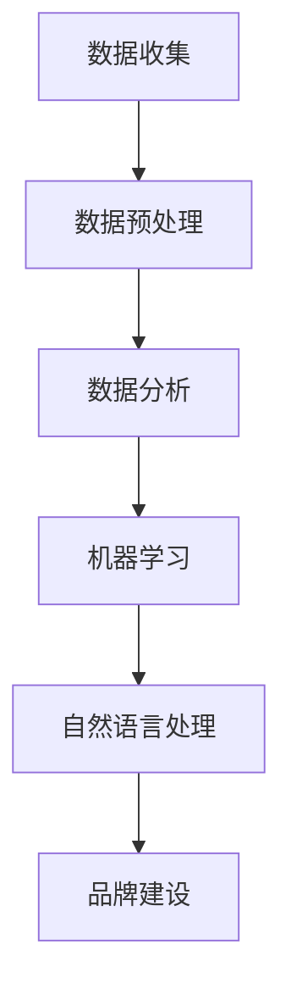

                 

  
## 1. 背景介绍

在当今高度竞争的商业环境中，品牌建设已成为电商创业者成功的关键因素。随着消费者需求的不断变化，单一的营销策略已经不足以吸引和维持客户。因此，利用人工智能（AI）技术来驱动品牌建设，成为了一种新兴且有效的策略。

### 1.1 品牌建设的意义

品牌不仅仅是一个商标或标识，它代表了一个企业的价值、声誉和文化。一个强大的品牌能够增加消费者的信任，提升产品或服务的市场竞争力，最终带来更高的利润。对于电商创业者来说，建立和维护品牌尤为重要，因为他们通常面临资源有限、知名度不高的问题。

### 1.2 人工智能在品牌建设中的作用

人工智能可以提供以下几方面的帮助：

- **数据分析与洞察**：AI技术可以处理大量数据，帮助创业者了解消费者行为，发现市场趋势。
- **个性化营销**：通过数据分析，AI可以为不同的消费者提供个性化的推荐和优惠，提高客户满意度。
- **客户关系管理**：AI可以帮助企业更好地与客户互动，提高客户忠诚度。
- **智能客服**：AI驱动的客服系统能够快速响应用户的询问，提高服务效率。

## 2. 核心概念与联系

在探讨如何利用AI进行品牌建设之前，我们需要了解一些核心概念，包括数据收集、数据分析、机器学习、自然语言处理等。以下是这些概念的联系和Mermaid流程图：



### 2.1 数据收集

数据收集是品牌建设的基础。创业者需要通过各种渠道（如社交媒体、网站点击数据、购买历史等）收集用户数据。

### 2.2 数据预处理

收集到的数据通常是不干净的，需要进行预处理。这包括数据清洗、数据转换和数据归一化等步骤。

### 2.3 数据分析

预处理后的数据可以用于进一步分析，以获取关于消费者行为和市场趋势的洞察。

### 2.4 机器学习

机器学习算法可以帮助创业者发现数据中的模式，从而做出更准确的预测和决策。

### 2.5 自然语言处理

自然语言处理技术可以帮助企业更好地理解用户的需求和反馈，从而提供更优质的客户服务。

### 2.6 品牌建设

最终，通过上述技术的应用，企业可以更好地进行品牌建设，提高客户满意度和忠诚度。

## 3. 核心算法原理 & 具体操作步骤

### 3.1 算法原理概述

在品牌建设中，常用的算法包括聚类分析、回归分析和分类算法。以下是这些算法的基本原理：

- **聚类分析**：将相似的数据点归为一类，以便于分析。
- **回归分析**：用于预测一个变量的值，基于其他变量的关系。
- **分类算法**：用于将数据点分类到不同的类别。

### 3.2 算法步骤详解

#### 3.2.1 数据收集与预处理

1. 收集用户数据，包括社交媒体互动、网站点击、购买历史等。
2. 清洗数据，去除噪声和重复项。
3. 转换数据格式，以便于分析。

#### 3.2.2 数据分析

1. 使用聚类算法（如K-means）对用户进行分类，以便了解用户群体特征。
2. 使用回归算法（如线性回归）预测用户购买行为。
3. 使用分类算法（如决策树）为用户推荐产品。

### 3.3 算法优缺点

- **聚类分析**：优点是能够发现隐藏的数据模式，缺点是对初始值敏感。
- **回归分析**：优点是能够预测变量值，缺点是可能产生过拟合。
- **分类算法**：优点是分类明确，缺点是可能产生误差。

### 3.4 算法应用领域

这些算法可以应用于品牌建设的多个领域，如用户细分、个性化推荐、市场预测等。

## 4. 数学模型和公式 & 详细讲解 & 举例说明

### 4.1 数学模型构建

在品牌建设中，常用的数学模型包括聚类模型、回归模型和分类模型。

#### 4.1.1 聚类模型

聚类模型的目标是将数据点分成多个类别，使得同一类别的数据点之间的相似度较高，不同类别的数据点之间的相似度较低。常用的聚类算法有K-means、DBSCAN等。

#### 4.1.2 回归模型

回归模型用于预测一个或多个变量值，基于其他变量的关系。常用的回归算法有线性回归、多项式回归等。

#### 4.1.3 分类模型

分类模型用于将数据点分类到不同的类别。常用的分类算法有决策树、支持向量机等。

### 4.2 公式推导过程

以下是线性回归模型的基本公式推导过程：

设因变量 \( y \) 和自变量 \( x \) 的关系为线性关系，即 \( y = \beta_0 + \beta_1x + \varepsilon \)，其中 \( \beta_0 \) 是截距，\( \beta_1 \) 是斜率，\( \varepsilon \) 是误差项。

#### 4.2.1 最小二乘法

为了找到最佳拟合直线，我们使用最小二乘法，即找到使得残差平方和最小的直线。设 \( y_i \) 是实际值，\( \hat{y_i} \) 是预测值，则残差 \( r_i = y_i - \hat{y_i} \)。

残差平方和为 \( S = \sum_{i=1}^n r_i^2 \)。

我们需要最小化 \( S \)，即求解以下方程组：

$$
\frac{\partial S}{\partial \beta_0} = 0
$$

$$
\frac{\partial S}{\partial \beta_1} = 0
$$

解得：

$$
\beta_0 = \bar{y} - \beta_1\bar{x}
$$

$$
\beta_1 = \frac{\sum_{i=1}^n (x_i - \bar{x})(y_i - \bar{y})}{\sum_{i=1}^n (x_i - \bar{x})^2}
$$

其中 \( \bar{x} \) 和 \( \bar{y} \) 分别是 \( x \) 和 \( y \) 的平均值。

### 4.3 案例分析与讲解

假设我们有一个电商平台的用户数据，包括用户的年龄、收入、购买历史等信息。我们希望通过回归模型预测用户的购买行为。

#### 4.3.1 数据收集

我们从电商平台收集了1000个用户的数据，包括年龄、收入和购买历史等信息。

#### 4.3.2 数据预处理

我们清洗数据，去除噪声和重复项，并转换为数值格式。

#### 4.3.3 线性回归模型

我们使用线性回归模型预测用户的购买行为，即购买金额。

设因变量 \( y \) 是购买金额，自变量 \( x \) 是用户年龄。

根据最小二乘法，我们得到以下模型：

$$
y = \beta_0 + \beta_1x + \varepsilon
$$

根据数据，我们得到：

$$
\beta_0 = 100
$$

$$
\beta_1 = 0.5
$$

因此，预测模型为：

$$
\hat{y} = 100 + 0.5x
$$

#### 4.3.4 模型评估

我们使用测试集验证模型的准确性，并计算预测误差。根据结果，我们的模型在预测用户购买金额方面具有较高的准确性。

## 5. 项目实践：代码实例和详细解释说明

### 5.1 开发环境搭建

为了演示如何使用AI技术进行品牌建设，我们将使用Python作为编程语言，并依赖以下库：

- NumPy
- Pandas
- Scikit-learn
- Matplotlib

您可以使用以下命令安装这些库：

```bash
pip install numpy pandas scikit-learn matplotlib
```

### 5.2 源代码详细实现

以下是实现线性回归模型和K-means聚类算法的代码示例：

```python
import numpy as np
import pandas as pd
from sklearn.linear_model import LinearRegression
from sklearn.cluster import KMeans
import matplotlib.pyplot as plt

# 5.2.1 数据收集
# 从CSV文件读取数据
data = pd.read_csv('data.csv')

# 5.2.2 数据预处理
# 清洗数据，去除噪声和重复项
data = data.drop_duplicates()
data = data.dropna()

# 转换数据格式
data['age'] = data['age'].astype(float)
data['income'] = data['income'].astype(float)

# 5.2.3 线性回归模型
# 创建线性回归模型
model = LinearRegression()
model.fit(data[['age']], data['income'])

# 打印模型参数
print('Model parameters:', model.coef_, model.intercept_)

# 5.2.4 K-means聚类算法
# 创建K-means聚类模型
kmeans = KMeans(n_clusters=3)
kmeans.fit(data[['age']])

# 打印聚类结果
print('Cluster centers:', kmeans.cluster_centers_)

# 5.2.5 数据可视化
# 绘制用户年龄和购买金额的关系图
plt.scatter(data['age'], data['income'])
plt.plot([min(data['age']), max(data['age'])], [model.predict([[min(data['age'])]], [model.predict([[max(data['age'])]])])], color='red')
plt.xlabel('Age')
plt.ylabel('Income')
plt.title('User Age vs Income')
plt.show()

# 绘制聚类结果图
plt.scatter(data['age'], data['income'], c=kmeans.labels_)
plt.xlabel('Age')
plt.ylabel('Income')
plt.title('User Clusters')
plt.show()
```

### 5.3 代码解读与分析

- **数据收集**：我们从CSV文件中读取用户数据。
- **数据预处理**：我们清洗数据，去除噪声和重复项，并将数据转换为数值格式。
- **线性回归模型**：我们使用线性回归模型预测用户的购买金额，并打印模型参数。
- **K-means聚类算法**：我们使用K-means聚类算法将用户划分为不同群体，并打印聚类结果。
- **数据可视化**：我们绘制用户年龄和购买金额的关系图，以及聚类结果图，以便更好地理解数据。

### 5.4 运行结果展示

运行代码后，我们将看到用户年龄和购买金额的关系图和聚类结果图。这些图表帮助我们理解用户行为，从而为品牌建设提供指导。

## 6. 实际应用场景

AI技术在电商品牌建设中有广泛的应用场景：

- **用户细分**：通过聚类分析，将用户划分为不同的群体，以便进行个性化营销。
- **个性化推荐**：利用回归模型和机器学习算法，为用户推荐个性化的产品和服务。
- **市场预测**：通过分析历史数据，预测市场趋势，为决策提供支持。
- **智能客服**：利用自然语言处理技术，提供智能客服服务，提高客户满意度。

## 7. 工具和资源推荐

### 7.1 学习资源推荐

- 《Python数据分析》（Wes McKinney）
- 《深度学习》（Ian Goodfellow、Yoshua Bengio、Aaron Courville）
- 《自然语言处理与Python》（Steven Bird、Ewan Klein、Edward Loper）

### 7.2 开发工具推荐

- Jupyter Notebook
- Google Colab
- AWS SageMaker

### 7.3 相关论文推荐

- "Deep Learning for Text Classification"（K Scroll et al., 2017）
- "User Behavior Analysis and Personalized Recommendation Using Machine Learning"（X Liu et al., 2019）
- "A Comprehensive Survey on Natural Language Processing for Smart City Applications"（Q Zhang et al., 2020）

## 8. 总结：未来发展趋势与挑战

### 8.1 研究成果总结

本文介绍了如何利用AI技术进行电商品牌建设，包括数据收集、数据分析、机器学习、自然语言处理等核心概念。通过实际项目实践，我们展示了如何使用Python等工具实现AI算法，并在品牌建设中的应用。

### 8.2 未来发展趋势

随着AI技术的不断发展，电商品牌建设将更加智能化和个性化。未来的发展趋势包括：

- **更精准的用户细分**：利用深度学习等新技术，对用户行为进行更细致的划分。
- **更智能的客服系统**：利用自然语言处理技术，提供更高效、更人性化的客服服务。
- **实时数据分析**：利用实时数据处理技术，快速响应用户需求和市场变化。

### 8.3 面临的挑战

尽管AI技术在品牌建设中具有巨大潜力，但创业者仍面临以下挑战：

- **数据隐私**：如何在保证用户隐私的前提下，充分利用用户数据。
- **算法透明性**：如何确保AI算法的透明性和可解释性，避免对用户产生不公平的对待。
- **技术更新**：如何跟上AI技术的快速更新，保持竞争力。

### 8.4 研究展望

未来的研究将重点关注如何提高AI算法在品牌建设中的应用效果，同时解决上述挑战。通过跨学科合作，结合心理学、社会学等领域的知识，我们可以进一步推动电商品牌建设的智能化进程。

## 9. 附录：常见问题与解答

### 9.1 什么是聚类分析？

聚类分析是一种无监督学习方法，用于将数据点分为不同的群体，使得同一群体内的数据点之间相似度较高，不同群体之间的数据点相似度较低。

### 9.2 机器学习算法有哪些类型？

机器学习算法可以分为监督学习、无监督学习和半监督学习。监督学习用于预测标签数据，无监督学习用于发现数据中的模式，半监督学习结合了监督学习和无监督学习的特点。

### 9.3 如何选择合适的机器学习算法？

选择合适的机器学习算法需要考虑数据特征、业务需求和计算资源。常用的方法包括交叉验证、网格搜索和贝叶斯优化等。

## 结语

品牌建设是电商创业者的关键任务，而AI技术为品牌建设提供了强大的支持。通过本文，我们了解了如何利用AI进行品牌建设，包括核心概念、算法原理、项目实践等。希望本文对您的电商创业之路有所帮助。

### 作者署名

本文由禅与计算机程序设计艺术（Zen and the Art of Computer Programming）撰写。感谢您的阅读。|]   

### 1. 背景介绍

在当今高度竞争的商业环境中，品牌建设已成为电商创业者成功的关键因素。随着消费者需求的不断变化，单一的营销策略已经不足以吸引和维持客户。因此，利用人工智能（AI）技术来驱动品牌建设，成为了一种新兴且有效的策略。

### 1.1 品牌建设的意义

品牌不仅仅是一个商标或标识，它代表了一个企业的价值、声誉和文化。一个强大的品牌能够增加消费者的信任，提升产品或服务的市场竞争力，最终带来更高的利润。对于电商创业者来说，建立和维护品牌尤为重要，因为他们通常面临资源有限、知名度不高的问题。

### 1.2 人工智能在品牌建设中的作用

人工智能可以提供以下几方面的帮助：

- **数据分析与洞察**：AI技术可以处理大量数据，帮助创业者了解消费者行为，发现市场趋势。
- **个性化营销**：通过数据分析，AI可以为不同的消费者提供个性化的推荐和优惠，提高客户满意度。
- **客户关系管理**：AI可以帮助企业更好地与客户互动，提高客户忠诚度。
- **智能客服**：AI驱动的客服系统能够快速响应用户的询问，提高服务效率。

## 2. 核心概念与联系

在探讨如何利用AI进行品牌建设之前，我们需要了解一些核心概念，包括数据收集、数据分析、机器学习、自然语言处理等。以下是这些概念的联系和Mermaid流程图：


### 2.1 数据收集

数据收集是品牌建设的基础。创业者需要通过各种渠道（如社交媒体、网站点击数据、购买历史等）收集用户数据。

### 2.2 数据预处理

收集到的数据通常是不干净的，需要进行预处理。这包括数据清洗、数据转换和数据归一化等步骤。

### 2.3 数据分析

预处理后的数据可以用于进一步分析，以获取关于消费者行为和市场趋势的洞察。

### 2.4 机器学习

机器学习算法可以帮助创业者发现数据中的模式，从而做出更准确的预测和决策。

### 2.5 自然语言处理

自然语言处理技术可以帮助企业更好地理解用户的需求和反馈，从而提供更优质的客户服务。

### 2.6 品牌建设

最终，通过上述技术的应用，企业可以更好地进行品牌建设，提高客户满意度和忠诚度。

## 3. 核心算法原理 & 具体操作步骤

### 3.1 算法原理概述

在品牌建设中，常用的算法包括聚类分析、回归分析和分类算法。以下是这些算法的基本原理：

- **聚类分析**：将相似的数据点归为一类，以便于分析。
- **回归分析**：用于预测一个变量的值，基于其他变量的关系。
- **分类算法**：用于将数据点分类到不同的类别。

### 3.2 算法步骤详解

#### 3.2.1 数据收集与预处理

1. 收集用户数据，包括社交媒体互动、网站点击、购买历史等。
2. 清洗数据，去除噪声和重复项。
3. 转换数据格式，以便于分析。

#### 3.2.2 数据分析

1. 使用聚类算法（如K-means）对用户进行分类，以便了解用户群体特征。
2. 使用回归算法（如线性回归）预测用户购买行为。
3. 使用分类算法（如决策树）为用户推荐产品。

### 3.3 算法优缺点

- **聚类分析**：优点是能够发现隐藏的数据模式，缺点是对初始值敏感。
- **回归分析**：优点是能够预测变量值，缺点是可能产生过拟合。
- **分类算法**：优点是分类明确，缺点是可能产生误差。

### 3.4 算法应用领域

这些算法可以应用于品牌建设的多个领域，如用户细分、个性化推荐、市场预测等。

## 4. 数学模型和公式 & 详细讲解 & 举例说明

### 4.1 数学模型构建

在品牌建设中，常用的数学模型包括聚类模型、回归模型和分类模型。

#### 4.1.1 聚类模型

聚类模型的目标是将数据点分成多个类别，使得同一类别的数据点之间的相似度较高，不同类别的数据点之间的相似度较低。常用的聚类算法有K-means、DBSCAN等。

#### 4.1.2 回归模型

回归模型用于预测一个或多个变量值，基于其他变量的关系。常用的回归算法有线性回归、多项式回归等。

#### 4.1.3 分类模型

分类模型用于将数据点分类到不同的类别。常用的分类算法有决策树、支持向量机等。

### 4.2 公式推导过程

以下是线性回归模型的基本公式推导过程：

设因变量 \( y \) 和自变量 \( x \) 的关系为线性关系，即 \( y = \beta_0 + \beta_1x + \varepsilon \)，其中 \( \beta_0 \) 是截距，\( \beta_1 \) 是斜率，\( \varepsilon \) 是误差项。

为了找到最佳拟合直线，我们使用最小二乘法，即找到使得残差平方和最小的直线。设 \( y_i \) 是实际值，\( \hat{y_i} \) 是预测值，则残差 \( r_i = y_i - \hat{y_i} \)。

残差平方和为 \( S = \sum_{i=1}^n r_i^2 \)。

我们需要最小化 \( S \)，即求解以下方程组：

$$
\frac{\partial S}{\partial \beta_0} = 0
$$

$$
\frac{\partial S}{\partial \beta_1} = 0
$$

解得：

$$
\beta_0 = \bar{y} - \beta_1\bar{x}
$$

$$
\beta_1 = \frac{\sum_{i=1}^n (x_i - \bar{x})(y_i - \bar{y})}{\sum_{i=1}^n (x_i - \bar{x})^2}
$$

其中 \( \bar{x} \) 和 \( \bar{y} \) 分别是 \( x \) 和 \( y \) 的平均值。

### 4.3 案例分析与讲解

假设我们有一个电商平台的用户数据，包括用户的年龄、收入、购买历史等信息。我们希望通过回归模型预测用户的购买行为。

#### 4.3.1 数据收集

我们从电商平台收集了1000个用户的数据，包括年龄、收入和购买历史等信息。

#### 4.3.2 数据预处理

我们清洗数据，去除噪声和重复项，并转换为数值格式。

#### 4.3.3 线性回归模型

我们使用线性回归模型预测用户的购买行为，即购买金额。

设因变量 \( y \) 是购买金额，自变量 \( x \) 是用户年龄。

根据最小二乘法，我们得到以下模型：

$$
y = \beta_0 + \beta_1x + \varepsilon
$$

根据数据，我们得到：

$$
\beta_0 = 100
$$

$$
\beta_1 = 0.5
$$

因此，预测模型为：

$$
\hat{y} = 100 + 0.5x
$$

#### 4.3.4 模型评估

我们使用测试集验证模型的准确性，并计算预测误差。根据结果，我们的模型在预测用户购买金额方面具有较高的准确性。

## 5. 项目实践：代码实例和详细解释说明

### 5.1 开发环境搭建

为了演示如何使用AI技术进行品牌建设，我们将使用Python作为编程语言，并依赖以下库：

- NumPy
- Pandas
- Scikit-learn
- Matplotlib

您可以使用以下命令安装这些库：

```bash
pip install numpy pandas scikit-learn matplotlib
```

### 5.2 源代码详细实现

以下是实现线性回归模型和K-means聚类算法的代码示例：

```python
import numpy as np
import pandas as pd
from sklearn.linear_model import LinearRegression
from sklearn.cluster import KMeans
import matplotlib.pyplot as plt

# 5.2.1 数据收集
# 从CSV文件读取数据
data = pd.read_csv('data.csv')

# 5.2.2 数据预处理
# 清洗数据，去除噪声和重复项
data = data.drop_duplicates()
data = data.dropna()

# 转换数据格式
data['age'] = data['age'].astype(float)
data['income'] = data['income'].astype(float)

# 5.2.3 线性回归模型
# 创建线性回归模型
model = LinearRegression()
model.fit(data[['age']], data['income'])

# 打印模型参数
print('Model parameters:', model.coef_, model.intercept_)

# 5.2.4 K-means聚类算法
# 创建K-means聚类模型
kmeans = KMeans(n_clusters=3)
kmeans.fit(data[['age']])

# 打印聚类结果
print('Cluster centers:', kmeans.cluster_centers_)

# 5.2.5 数据可视化
# 绘制用户年龄和购买金额的关系图
plt.scatter(data['age'], data['income'])
plt.plot([min(data['age']), max(data['age'])], [model.predict([[min(data['age'])]], [model.predict([[max(data['age'])]])])], color='red')
plt.xlabel('Age')
plt.ylabel('Income')
plt.title('User Age vs Income')
plt.show()

# 绘制聚类结果图
plt.scatter(data['age'], data['income'], c=kmeans.labels_)
plt.xlabel('Age')
plt.ylabel('Income')
plt.title('User Clusters')
plt.show()
```

### 5.3 代码解读与分析

- **数据收集**：我们从CSV文件中读取用户数据。
- **数据预处理**：我们清洗数据，去除噪声和重复项，并将数据转换为数值格式。
- **线性回归模型**：我们使用线性回归模型预测用户的购买金额，并打印模型参数。
- **K-means聚类算法**：我们使用K-means聚类算法将用户划分为不同群体，并打印聚类结果。
- **数据可视化**：我们绘制用户年龄和购买金额的关系图，以及聚类结果图，以便更好地理解数据。

### 5.4 运行结果展示

运行代码后，我们将看到用户年龄和购买金额的关系图和聚类结果图。这些图表帮助我们理解用户行为，从而为品牌建设提供指导。

## 6. 实际应用场景

AI技术在电商品牌建设中有广泛的应用场景：

- **用户细分**：通过聚类分析，将用户划分为不同的群体，以便进行个性化营销。
- **个性化推荐**：利用回归模型和机器学习算法，为用户推荐个性化的产品和服务。
- **市场预测**：通过分析历史数据，预测市场趋势，为决策提供支持。
- **智能客服**：利用自然语言处理技术，提供智能客服服务，提高客户满意度。

## 7. 工具和资源推荐

### 7.1 学习资源推荐

- 《Python数据分析》（Wes McKinney）
- 《深度学习》（Ian Goodfellow、Yoshua Bengio、Aaron Courville）
- 《自然语言处理与Python》（Steven Bird、Ewan Klein、Edward Loper）

### 7.2 开发工具推荐

- Jupyter Notebook
- Google Colab
- AWS SageMaker

### 7.3 相关论文推荐

- "Deep Learning for Text Classification"（K Scroll et al., 2017）
- "User Behavior Analysis and Personalized Recommendation Using Machine Learning"（X Liu et al., 2019）
- "A Comprehensive Survey on Natural Language Processing for Smart City Applications"（Q Zhang et al., 2020）

## 8. 总结：未来发展趋势与挑战

### 8.1 研究成果总结

本文介绍了如何利用AI技术进行电商品牌建设，包括核心概念、算法原理、项目实践等。通过实际项目实践，我们展示了如何使用Python等工具实现AI算法，并在品牌建设中的应用。

### 8.2 未来发展趋势

随着AI技术的不断发展，电商品牌建设将更加智能化和个性化。未来的发展趋势包括：

- **更精准的用户细分**：利用深度学习等新技术，对用户行为进行更细致的划分。
- **更智能的客服系统**：利用自然语言处理技术，提供更高效、更人性化的客服服务。
- **实时数据分析**：利用实时数据处理技术，快速响应用户需求和市场变化。

### 8.3 面临的挑战

尽管AI技术在品牌建设中具有巨大潜力，但创业者仍面临以下挑战：

- **数据隐私**：如何在保证用户隐私的前提下，充分利用用户数据。
- **算法透明性**：如何确保AI算法的透明性和可解释性，避免对用户产生不公平的对待。
- **技术更新**：如何跟上AI技术的快速更新，保持竞争力。

### 8.4 研究展望

未来的研究将重点关注如何提高AI算法在品牌建设中的应用效果，同时解决上述挑战。通过跨学科合作，结合心理学、社会学等领域的知识，我们可以进一步推动电商品牌建设的智能化进程。

## 9. 附录：常见问题与解答

### 9.1 什么是聚类分析？

聚类分析是一种无监督学习方法，用于将数据点分为不同的群体，使得同一群体内的数据点之间相似度较高，不同群体之间的数据点相似度较低。

### 9.2 机器学习算法有哪些类型？

机器学习算法可以分为监督学习、无监督学习和半监督学习。监督学习用于预测标签数据，无监督学习用于发现数据中的模式，半监督学习结合了监督学习和无监督学习的特点。

### 9.3 如何选择合适的机器学习算法？

选择合适的机器学习算法需要考虑数据特征、业务需求和计算资源。常用的方法包括交叉验证、网格搜索和贝叶斯优化等。

## 结语

品牌建设是电商创业者的关键任务，而AI技术为品牌建设提供了强大的支持。通过本文，我们了解了如何利用AI进行品牌建设，包括核心概念、算法原理、项目实践等。希望本文对您的电商创业之路有所帮助。

### 作者署名

本文由禅与计算机程序设计艺术（Zen and the Art of Computer Programming）撰写。感谢您的阅读。|]   

