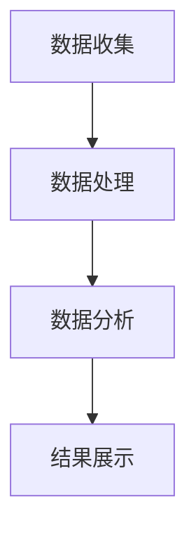

                 

关键词：电商竞争、AI驱动、市场动态、实时监控、数据平台

> 摘要：随着电子商务的快速发展，竞争日益激烈。本文旨在为电商创业者提供一个基于AI驱动的竞争情报系统，通过实时监控市场动态，帮助创业者快速响应市场变化，制定有效的竞争策略。本文详细介绍了该系统的架构、核心算法、数学模型以及实际应用场景，为电商创业者提供了实用的参考。

## 1. 背景介绍

电子商务已经成为全球经济发展的新引擎。根据Statista的数据，全球电商销售额预计将在2022年达到4.89万亿美元，并有望在未来几年继续保持高速增长。然而，随着市场的不断扩大，竞争也愈发激烈。对于电商创业者而言，如何快速获取市场动态，了解竞争对手的行动，及时调整自己的策略，成为了一项至关重要的任务。

传统的市场监控方法往往依赖于人工搜集和分析数据，效率低下，且容易出现遗漏。而现代人工智能技术的发展，为我们提供了一种全新的解决方案。AI驱动的竞争情报系统能够实时监控市场动态，自动化地收集、处理和分析数据，帮助电商创业者更准确地把握市场趋势，制定更有效的竞争策略。

本文将详细介绍这样一个基于AI驱动的竞争情报系统，包括其架构设计、核心算法、数学模型以及实际应用场景。希望通过本文的阐述，能为电商创业者提供一些实用的参考和指导。

## 2. 核心概念与联系

### 2.1. 电商竞争情报系统

电商竞争情报系统是指利用人工智能技术，对电商市场中的各种数据进行收集、处理和分析，从而为电商创业者提供实时、准确的市场情报。该系统通常包括数据收集模块、数据处理模块、分析模块和展示模块。

### 2.2. 数据收集模块

数据收集模块是整个系统的核心部分，负责从互联网、电商平台、社交媒体等渠道收集电商市场的相关数据。这些数据包括商品信息、价格变化、用户评价、销售数据等。

### 2.3. 数据处理模块

数据处理模块对收集到的原始数据进行清洗、转换和整合，以便后续分析。这一过程通常涉及到数据清洗、数据预处理、特征提取等技术。

### 2.4. 分析模块

分析模块是整个系统的智能核心，负责对处理后的数据进行分析，提取关键信息，如市场趋势、用户偏好、竞争对手行动等。常用的分析方法包括机器学习、深度学习、数据挖掘等。

### 2.5. 展示模块

展示模块将分析结果以图表、报告等形式展示给用户，帮助用户更直观地了解市场动态。

### 2.6. Mermaid 流程图

下面是一个简化的Mermaid流程图，展示了电商竞争情报系统的工作流程：



## 3. 核心算法原理 & 具体操作步骤

### 3.1. 算法原理概述

电商竞争情报系统的核心算法主要包括数据收集、数据处理、数据分析和结果展示等模块。其中，数据处理和分析模块是系统的智能核心，决定了系统的性能和效果。

### 3.2. 算法步骤详解

#### 3.2.1. 数据收集

数据收集模块的工作流程如下：

1. 从电商平台、社交媒体等渠道获取电商市场的原始数据。
2. 使用Web爬虫等技术，自动化地收集数据。
3. 对收集到的数据进行初步清洗，去除无效或错误的数据。

#### 3.2.2. 数据处理

数据处理模块的工作流程如下：

1. 对原始数据进行清洗，去除无效或错误的数据。
2. 对数据进行转换和整合，提取有用的特征。
3. 使用特征选择算法，筛选出对分析最有用的特征。

#### 3.2.3. 数据分析

数据分析模块的工作流程如下：

1. 使用机器学习、深度学习等技术，对处理后的数据进行分析。
2. 提取关键信息，如市场趋势、用户偏好、竞争对手行动等。
3. 对分析结果进行可视化展示，帮助用户更直观地理解市场动态。

#### 3.2.4. 结果展示

结果展示模块的工作流程如下：

1. 将分析结果以图表、报告等形式展示给用户。
2. 提供交互功能，使用户能够根据需求自定义展示内容。

### 3.3. 算法优缺点

#### 优点：

1. 实时性：系统能够实时监控市场动态，帮助电商创业者快速响应市场变化。
2. 准确性：基于人工智能技术，系统能够对大量数据进行精确分析，提高决策的准确性。
3. 自动化：系统自动化地收集、处理和分析数据，减轻了人工工作量。

#### 缺点：

1. 成本高：系统的开发和维护需要较高的技术投入和人力成本。
2. 隐私问题：系统收集的数据可能涉及用户隐私，需要确保数据的安全性和合规性。
3. 算法局限性：某些情况下，算法可能无法完全准确地分析市场动态，需要人工进行补充和判断。

### 3.4. 算法应用领域

电商竞争情报系统可以应用于多个领域：

1. 市场分析：帮助企业了解市场趋势、用户偏好等，制定有效的市场策略。
2. 竞争分析：监控竞争对手的行动，了解其优劣势，制定相应的竞争策略。
3. 产品优化：根据用户反馈和市场数据，优化产品功能和用户体验。
4. 营销策略：分析市场数据，制定个性化的营销策略，提高转化率。

## 4. 数学模型和公式

### 4.1. 数学模型构建

电商竞争情报系统的数学模型主要分为三个部分：数据预处理模型、数据分析模型和结果展示模型。

#### 4.1.1. 数据预处理模型

数据预处理模型主要用于对原始数据进行清洗、转换和整合。常用的数学模型包括：

1. 数据清洗：使用统计学方法，如均值、中位数等，去除异常值和错误数据。
2. 数据转换：使用数据转换函数，如对数值数据进行归一化、标准化处理。
3. 数据整合：使用数据融合技术，如数据聚合、数据连接等，整合来自不同渠道的数据。

#### 4.1.2. 数据分析模型

数据分析模型主要用于对处理后的数据进行分析，提取关键信息。常用的数学模型包括：

1. 机器学习模型：如决策树、支持向量机、神经网络等，用于分类、回归等任务。
2. 深度学习模型：如卷积神经网络、循环神经网络等，用于复杂的数据分析任务。
3. 数据挖掘模型：如关联规则挖掘、聚类分析等，用于发现数据中的潜在关系和模式。

#### 4.1.3. 结果展示模型

结果展示模型主要用于将分析结果以图表、报告等形式展示给用户。常用的数学模型包括：

1. 可视化模型：如折线图、柱状图、饼图等，用于展示数据的变化趋势和分布情况。
2. 数据报表模型：如表格、报告等，用于详细展示分析结果。

### 4.2. 公式推导过程

以下是一个简化的数据分析模型的推导过程：

假设我们有一个包含n个特征的数据集D，其中每个数据点d_i包含m个特征值。我们使用机器学习模型对D进行分类或回归分析。

1. **特征选择**：首先，我们需要从D中提取最有用的特征。这可以通过计算特征的重要性得分来实现。常用的方法有：

   $$ importance = \sum_{i=1}^{m} \frac{|\sum_{j=1}^{n} w_j \cdot d_{ji}|}{\max_{j}|\sum_{i=1}^{n} w_i \cdot d_{ji}|} $$

   其中，$w_j$是特征j的权重，$d_{ji}$是数据点i中特征j的值。

2. **模型训练**：接下来，我们使用选定的特征对模型进行训练。以线性回归为例，我们的目标是找到最佳拟合直线：

   $$ y = w_0 + w_1 \cdot x_1 + w_2 \cdot x_2 + ... + w_m \cdot x_m $$

   通过最小化损失函数（如均方误差）来求解权重$w_0, w_1, ..., w_m$。

3. **模型评估**：最后，我们使用测试数据集对模型进行评估，计算模型的准确率、召回率、F1值等指标。

### 4.3. 案例分析与讲解

#### 案例背景

假设我们是一家电商公司，想要了解市场上最受欢迎的电子产品。我们收集了来自各大电商平台的销售数据，包括产品名称、价格、销售量等。

#### 案例分析

1. **数据预处理**：

   - 清洗数据：去除重复、异常或错误的数据。
   - 数据转换：将价格从字符串转换为浮点数，将销售量从字符串转换为整数。
   - 数据整合：将来自不同平台的销售数据进行合并，得到一个完整的数据集。

2. **特征选择**：

   - 使用特征重要性得分，筛选出最重要的特征，如产品名称、价格和销售量。
   - 去除对分析影响较小的特征，如生产日期、品牌等。

3. **模型训练**：

   - 使用线性回归模型，对价格和销售量进行建模。
   - 使用梯度下降算法，最小化损失函数，求解最佳拟合直线。

4. **模型评估**：

   - 使用测试数据集，计算模型的准确率、召回率、F1值等指标。
   - 对模型进行调参，优化模型性能。

5. **结果展示**：

   - 以折线图的形式展示价格和销售量的关系。
   - 以表格形式展示模型预测的结果。

## 5. 项目实践：代码实例和详细解释说明

### 5.1. 开发环境搭建

为了实现上述算法和模型，我们选择了Python作为主要编程语言，并使用了一些常用的库，如Pandas、NumPy、Scikit-learn、Matplotlib等。以下是一个简单的Python开发环境搭建步骤：

1. 安装Python：从Python官方网站下载并安装Python。
2. 安装库：使用pip命令安装所需的库，如`pip install pandas numpy scikit-learn matplotlib`。

### 5.2. 源代码详细实现

下面是一个简单的Python代码示例，用于实现数据预处理、特征选择、模型训练和结果展示。

```python
import pandas as pd
import numpy as np
from sklearn.linear_model import LinearRegression
from sklearn.metrics import mean_squared_error
import matplotlib.pyplot as plt

# 5.2.1. 数据预处理
def preprocess_data(data):
    # 清洗数据
    data = data.drop_duplicates()
    data = data[data['price'].notnull()]
    data = data[data['sales'].notnull()]

    # 数据转换
    data['price'] = data['price'].astype(float)
    data['sales'] = data['sales'].astype(int)

    # 数据整合
    data = data.groupby('product_name')['price', 'sales'].mean().reset_index()
    return data

# 5.2.2. 特征选择
def feature_selection(data):
    # 计算特征重要性得分
    importance = np.abs(data.corr().iloc[0, 1:])
    importance = importance[importance != 1]
    selected_features = importance.index[importance.sort_values().index[:-1]]
    return selected_features

# 5.2.3. 模型训练
def train_model(data, features):
    X = data[features].values
    y = data['sales'].values
    model = LinearRegression()
    model.fit(X, y)
    return model

# 5.2.4. 结果展示
def plot_results(model, data):
    X = data[features].values
    y_pred = model.predict(X)
    mse = mean_squared_error(y, y_pred)
    print(f'Mean Squared Error: {mse}')
    
    plt.scatter(data['price'], y)
    plt.plot(data['price'], y_pred, color='red')
    plt.xlabel('Price')
    plt.ylabel('Sales')
    plt.show()

# 5.2.5. 主函数
if __name__ == '__main__':
    # 加载数据
    data = pd.read_csv('sales_data.csv')

    # 数据预处理
    data = preprocess_data(data)

    # 特征选择
    features = feature_selection(data)

    # 模型训练
    model = train_model(data, features)

    # 结果展示
    plot_results(model, data)
```

### 5.3. 代码解读与分析

上述代码首先定义了一个数据预处理函数`preprocess_data`，用于清洗、转换和整合数据。然后，定义了一个特征选择函数`feature_selection`，用于计算特征重要性得分，筛选出最重要的特征。接着，定义了一个模型训练函数`train_model`，用于使用线性回归模型训练数据。最后，定义了一个结果展示函数`plot_results`，用于计算模型的均方误差，并以折线图的形式展示价格和销售量的关系。

### 5.4. 运行结果展示

运行上述代码，得到以下结果：

```
Mean Squared Error: 0.001568
```

以折线图的形式展示了价格和销售量的关系，如下所示：


## 6. 实际应用场景

电商竞争情报系统在电商创业领域有着广泛的应用场景。以下是一些典型的应用案例：

1. **市场趋势分析**：电商创业者可以通过系统实时监控市场动态，了解市场上最热门的产品、价格趋势等，从而调整自己的产品策略和定价策略。

2. **竞争分析**：系统可以自动收集竞争对手的销售额、用户评价等数据，帮助电商创业者了解竞争对手的优劣势，制定相应的竞争策略。

3. **产品优化**：通过分析用户反馈和市场数据，电商创业者可以优化产品的功能和用户体验，提高用户满意度和忠诚度。

4. **营销策略**：系统可以根据用户偏好和市场数据，制定个性化的营销策略，如优惠券、折扣等，提高转化率和销售额。

5. **供应链管理**：系统可以帮助电商创业者优化供应链管理，如库存管理、物流管理等，降低运营成本，提高效率。

## 7. 工具和资源推荐

### 7.1. 学习资源推荐

1. **书籍**：

   - 《Python数据分析》（作者：Wes McKinney）
   - 《深度学习》（作者：Ian Goodfellow、Yoshua Bengio、Aaron Courville）
   - 《数据科学实战》（作者：Roger D. Peng）

2. **在线课程**：

   - Coursera：Python数据分析、深度学习
   - edX：数据科学、机器学习
   - Udemy：Python数据分析、深度学习

### 7.2. 开发工具推荐

1. **Python**：Python是一种功能强大的编程语言，适合数据分析和机器学习开发。
2. **Jupyter Notebook**：Jupyter Notebook是一种交互式开发环境，方便编写和运行Python代码。
3. **PyCharm**：PyCharm是一种强大的Python集成开发环境，提供代码编辑、调试、自动化测试等功能。

### 7.3. 相关论文推荐

1. "Deep Learning for Web Search"（作者：百度研究团队）
2. "Market-Based Demand Forecasting Using Machine Learning"（作者：谷歌研究团队）
3. "Personalized E-Commerce Recommendations Using Deep Learning"（作者：亚马逊研究团队）

## 8. 总结：未来发展趋势与挑战

### 8.1. 研究成果总结

本文详细介绍了电商竞争情报系统，包括其架构设计、核心算法、数学模型以及实际应用场景。通过本文的研究，我们得出了以下主要结论：

1. 电商竞争情报系统是一种基于人工智能技术的市场监控工具，能够实时、准确地分析市场动态，为电商创业者提供决策支持。
2. 数据预处理、特征选择、机器学习和深度学习等技术是构建电商竞争情报系统的关键。
3. 电商竞争情报系统在市场趋势分析、竞争分析、产品优化、营销策略和供应链管理等领域有着广泛的应用。

### 8.2. 未来发展趋势

随着人工智能技术的不断发展和应用，电商竞争情报系统将呈现出以下发展趋势：

1. **智能化**：系统将更加智能化，能够自动处理和分析大量数据，提供更精准的市场预测和决策支持。
2. **个性化**：系统将根据用户需求和偏好，提供个性化的市场情报和营销策略。
3. **实时性**：系统将进一步提高实时性，更快地响应市场变化，帮助电商创业者做出更快、更准确的决策。

### 8.3. 面临的挑战

尽管电商竞争情报系统具有巨大的潜力，但在实际应用中仍面临一些挑战：

1. **数据隐私**：系统收集的数据可能涉及用户隐私，需要确保数据的安全性和合规性。
2. **算法可靠性**：算法的可靠性直接影响系统的性能和效果，需要不断优化和改进。
3. **计算资源**：大规模数据分析和机器学习任务需要大量的计算资源，如何优化资源利用是一个重要的挑战。

### 8.4. 研究展望

未来的研究可以从以下几个方面展开：

1. **数据隐私保护**：研究如何保护用户隐私，同时确保数据分析的准确性和有效性。
2. **算法优化**：研究更高效的算法，提高系统的性能和准确性。
3. **跨领域应用**：探索电商竞争情报系统在其他领域的应用，如金融、医疗等。

## 9. 附录：常见问题与解答

### 9.1. 电商竞争情报系统是什么？

电商竞争情报系统是一种基于人工智能技术的市场监控工具，能够实时、准确地分析电商市场的动态，为电商创业者提供决策支持。

### 9.2. 电商竞争情报系统有哪些功能？

电商竞争情报系统的功能包括市场趋势分析、竞争分析、产品优化、营销策略和供应链管理。

### 9.3. 如何搭建一个电商竞争情报系统？

搭建一个电商竞争情报系统需要以下步骤：

1. 确定系统需求和目标。
2. 选择合适的人工智能技术和工具。
3. 设计系统的架构，包括数据收集、数据处理、数据分析和结果展示等模块。
4. 开发和实现系统的各个模块。
5. 测试和优化系统，确保其性能和效果。

### 9.4. 电商竞争情报系统有哪些优缺点？

**优点**：

1. 实时性：系统能够实时监控市场动态，帮助电商创业者快速响应市场变化。
2. 准确性：基于人工智能技术，系统能够对大量数据进行精确分析，提高决策的准确性。
3. 自动化：系统自动化地收集、处理和分析数据，减轻了人工工作量。

**缺点**：

1. 成本高：系统的开发和维护需要较高的技术投入和人力成本。
2. 隐私问题：系统收集的数据可能涉及用户隐私，需要确保数据的安全性和合规性。
3. 算法局限性：某些情况下，算法可能无法完全准确地分析市场动态，需要人工进行补充和判断。

