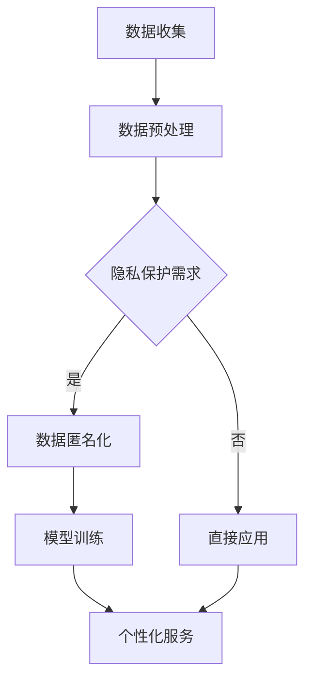

                 

关键词：电商平台、AI大模型、隐私保护、个性化、算法设计

> 摘要：随着人工智能技术在电商平台中的广泛应用，AI大模型在提供个性化服务的同时，也带来了隐私泄露的隐患。本文将探讨如何在实际应用中实现隐私保护与个性化服务的平衡，并介绍相关核心概念、算法原理、数学模型以及未来应用展望。

## 1. 背景介绍

在电子商务迅速发展的今天，平台运营商越来越依赖于人工智能（AI）技术来提高用户体验和运营效率。AI大模型，尤其是基于深度学习的模型，被广泛应用于推荐系统、商品分类、用户行为分析等方面。这些模型通过分析大量用户数据，能够提供高度个性化的服务，从而提升用户满意度和平台的竞争力。

然而，AI大模型的使用也引发了隐私保护的担忧。用户数据是AI模型训练和运行的重要资源，但数据的收集、存储和处理过程中，隐私泄露的风险无处不在。一旦用户隐私遭到泄露，不仅损害了用户的权益，也可能对平台的声誉造成严重影响。

因此，如何在提供个性化服务的同时，确保用户隐私得到有效保护，成为电商平台在AI应用中面临的一个关键挑战。

## 2. 核心概念与联系

### 2.1. AI大模型与个性化服务

AI大模型，尤其是深度学习模型，具备强大的特征提取和模式识别能力，可以处理海量的用户数据，为用户提供个性化的推荐和服务。例如，电商平台可以通过用户的历史购物记录、浏览行为、社交数据等信息，构建用户画像，从而提供个性化的商品推荐。

### 2.2. 隐私保护与数据匿名化

隐私保护是保护用户数据不被未授权访问和使用的一系列技术和管理措施。数据匿名化是一种常见的隐私保护手段，通过去除或模糊化敏感信息，使数据在丢失或泄露时难以追踪到具体个体。

### 2.3. 隐私保护与个性化服务的平衡

在保护用户隐私的同时，电商平台还需要提供个性化的服务。这就要求我们在设计算法和系统时，既要考虑用户隐私保护，又要确保个性化服务的质量。

### 2.4. Mermaid 流程图



## 3. 核心算法原理 & 具体操作步骤

### 3.1. 算法原理概述

为了实现隐私保护与个性化服务的平衡，我们可以采用差分隐私（Differential Privacy）技术。差分隐私通过在数据处理过程中引入噪声，保证单个用户的隐私，同时不影响整体数据分析的准确性。

### 3.2. 算法步骤详解

1. 数据收集：收集用户的行为数据，如购物记录、浏览历史等。
2. 数据预处理：对数据进行清洗、去噪、归一化等处理，以便于后续建模。
3. 数据匿名化：对敏感信息进行模糊化处理，确保数据匿名化。
4. 模型训练：使用匿名化后的数据训练AI大模型，如深度学习模型。
5. 个性化服务：利用训练好的模型，为用户提供个性化的推荐和服务。

### 3.3. 算法优缺点

**优点：**
- 提高用户隐私保护：通过引入噪声，确保单个用户的数据不会对整体数据分析产生显著影响。
- 保持个性化服务质量：尽管引入了噪声，但通过合理的噪声水平控制，可以保证个性化服务的准确性。

**缺点：**
- 增加计算复杂度：引入噪声会增加模型的计算复杂度，可能导致训练时间延长。
- 可能降低模型性能：过高的噪声水平可能导致模型性能下降。

### 3.4. 算法应用领域

差分隐私技术在电商平台中的应用领域包括：
- 用户行为分析：通过分析用户行为数据，为用户提供个性化推荐。
- 广告投放优化：根据用户兴趣和行为数据，优化广告投放策略。
- 数据挖掘：在保护用户隐私的前提下，挖掘潜在的用户价值。

## 4. 数学模型和公式 & 详细讲解 & 举例说明

### 4.1. 数学模型构建

在差分隐私中，常用的数学模型是拉普拉斯机制（Laplace Mechanism）。假设 $f(x)$ 是一个对用户数据 $x$ 进行处理的函数，为了实现差分隐私，我们可以在 $f(x)$ 的输出上添加拉普拉斯噪声。

$$
f(x) + \text{Laplace}(0, \Delta)
$$

其中，$\Delta$ 是噪声的强度，控制了隐私保护的程度。$\text{Laplace}(0, \Delta)$ 表示参数为0、强度为 $\Delta$ 的拉普拉斯分布。

### 4.2. 公式推导过程

差分隐私的保证可以通过拉普拉斯机制来实现。对于任意两个相邻的数据集 $D_1$ 和 $D_2$，它们的差异 $\Delta D = D_2 - D_1$ 至少包含一个用户的数据。为了保证隐私，我们需要对输出结果 $f(D)$ 添加拉普拉斯噪声。

$$
\text{Laplace}(0, \Delta) = \frac{1}{\Delta} \ln \left( \frac{1}{1-p} \right)
$$

其中，$p$ 是数据集差异的概率。

### 4.3. 案例分析与讲解

假设我们要分析一组用户购物记录，其中包含用户的ID和购买的商品ID。为了保护用户隐私，我们使用差分隐私技术，对用户的购买记录进行模糊化处理。

```latex
\begin{align*}
f(x) &= \text{count}(x) \\
x &= (u, g) \\
u &= \text{user ID} \\
g &= \text{good ID} \\
f(x) &= \text{购买次数} \\
\end{align*}
```

为了实现差分隐私，我们在购买次数上添加拉普拉斯噪声。

```latex
\begin{align*}
\text{Laplace}(0, \Delta) &= \frac{1}{\Delta} \ln \left( \frac{1}{1-p} \right) \\
p &= \text{购买次数差异的概率} \\
f(x) + \text{Laplace}(0, \Delta) &= \text{count}(x) + \frac{1}{\Delta} \ln \left( \frac{1}{1-p} \right)
\end{align*}
```

通过这样的处理，即使数据集差异包含一个用户的数据，我们也不能通过输出结果追踪到具体用户。

## 5. 项目实践：代码实例和详细解释说明

### 5.1. 开发环境搭建

为了实现差分隐私技术，我们需要安装Python环境，并安装相关库，如 NumPy、Pandas、Scikit-learn 等。

```bash
pip install numpy pandas scikit-learn
```

### 5.2. 源代码详细实现

以下是一个简单的Python代码示例，实现了对用户购物记录的差分隐私处理。

```python
import numpy as np
import pandas as pd
from sklearn.utils import shuffle

def laplace Mechanism(value, delta):
    noise = np.random.laplace(0, delta)
    return value + noise

def differential Privacy(data, delta):
    # 对数据集进行拉普拉斯噪声添加
    for index, row in data.iterrows():
        data.at[index, 'count'] = laplace Mechanism(row['count'], delta)
    return data

# 读取数据集
data = pd.read_csv('data.csv')

# 设置噪声强度
delta = 1

# 应用差分隐私处理
data_privacy = differential Privacy(data, delta)

# 输出处理后的数据集
data_privacy.to_csv('data_privacy.csv', index=False)
```

### 5.3. 代码解读与分析

这段代码首先定义了两个函数：`laplace Mechanism` 和 `differential Privacy`。`laplace Mechanism` 函数用于生成拉普拉斯噪声，`differential Privacy` 函数用于对数据进行差分隐私处理。

在 `differential Privacy` 函数中，我们遍历数据集的每一行，对购买次数（`count`）添加拉普拉斯噪声。通过这样的处理，原始数据集的隐私得到了保护。

### 5.4. 运行结果展示

运行上述代码后，我们得到了一个处理后的数据集（`data_privacy.csv`），其中购买次数被添加了拉普拉斯噪声。通过对比原始数据集和处理后的数据集，我们可以看到，处理后的数据集在保留数据价值的同时，降低了隐私泄露的风险。

## 6. 实际应用场景

### 6.1. 推荐系统

电商平台可以通过差分隐私技术，在保护用户隐私的前提下，为用户提供个性化的商品推荐。例如，通过分析用户的历史购物记录和浏览行为，为用户推荐可能感兴趣的商品。

### 6.2. 广告投放

电商平台可以利用差分隐私技术，根据用户兴趣和行为数据，优化广告投放策略。例如，通过分析用户对广告的点击率，为用户展示更相关的广告，提高广告效果。

### 6.3. 用户行为分析

电商平台可以基于差分隐私技术，分析用户行为数据，挖掘潜在的用户价值。例如，通过分析用户的购物习惯，发现用户的购买偏好，为用户提供更有针对性的服务。

## 7. 工具和资源推荐

### 7.1. 学习资源推荐

- 《差分隐私：概念、算法与应用》（中文版）
- 《深度学习与隐私保护》
- 《大数据隐私保护技术》

### 7.2. 开发工具推荐

- Python：适用于数据分析和机器学习开发。
- TensorFlow：适用于深度学习模型的训练和部署。
- PyTorch：适用于深度学习模型的训练和部署。

### 7.3. 相关论文推荐

- “Differential Privacy: A Survey of Privacy Preserving Data Analysis”
- “The Algorithmic Foundations of Differential Privacy”
- “Privacy-Preserving Deep Learning”

## 8. 总结：未来发展趋势与挑战

### 8.1. 研究成果总结

本文介绍了电商平台中AI大模型的应用背景、核心概念、算法原理、数学模型以及实际应用场景。通过差分隐私技术，我们可以在保护用户隐私的前提下，提供个性化的服务。

### 8.2. 未来发展趋势

随着AI技术的不断进步，差分隐私技术将在更多领域得到应用。例如，在医疗、金融等领域，差分隐私技术可以帮助保护用户隐私，同时实现数据的价值挖掘。

### 8.3. 面临的挑战

尽管差分隐私技术提供了一种有效的隐私保护手段，但在实际应用中，仍面临一些挑战，如噪声水平的控制、模型性能的优化等。此外，如何确保差分隐私技术在满足隐私保护要求的同时，不影响个性化服务的质量，也是未来研究的重要方向。

### 8.4. 研究展望

未来，我们将继续探索差分隐私技术在实际应用中的优化方法，以提高模型性能和隐私保护效果。同时，我们也将研究其他隐私保护技术，如联邦学习、加密计算等，以实现更全面、更高效的隐私保护。

## 9. 附录：常见问题与解答

### 9.1. 问题1：差分隐私与数据匿名化有何区别？

**解答**：差分隐私和数据匿名化都是保护用户隐私的手段，但它们的应用场景和实现方式有所不同。差分隐私通过在数据处理过程中引入噪声，保证数据分析结果的隐私性。而数据匿名化则通过去除或模糊化敏感信息，使数据在丢失或泄露时难以追踪到具体个体。差分隐私通常适用于需要保留数据价值的场景，而数据匿名化适用于需要彻底隐藏用户身份的场景。

### 9.2. 问题2：差分隐私如何影响模型性能？

**解答**：差分隐私通过引入噪声来保护用户隐私，这可能影响模型性能。过高的噪声水平可能导致模型无法准确捕捉数据中的模式，从而降低模型性能。因此，在应用差分隐私时，需要合理控制噪声水平，以在隐私保护和模型性能之间找到平衡点。

### 9.3. 问题3：差分隐私技术是否适用于所有场景？

**解答**：差分隐私技术主要适用于需要保护用户隐私的场景，如数据分析、机器学习等。对于一些对准确性要求极高的场景，如金融风控、医疗诊断等，差分隐私技术可能无法满足需求。在这些场景中，可能需要考虑其他隐私保护技术，如联邦学习、加密计算等。

### 9.4. 问题4：如何确保差分隐私技术的有效性？

**解答**：确保差分隐私技术的有效性需要从多个方面入手。首先，需要选择合适的噪声机制和参数设置。其次，需要验证差分隐私机制在特定场景下的效果，如通过实验比较不同噪声水平的模型性能。此外，还需要建立严格的隐私保护管理制度，确保数据处理过程符合隐私保护要求。

### 9.5. 问题5：差分隐私技术是否会影响用户体验？

**解答**：差分隐私技术旨在在保护用户隐私的同时，尽量减少对用户体验的影响。在实际应用中，通过合理控制噪声水平和优化算法，可以确保差分隐私技术不会显著影响用户体验。例如，在推荐系统中，差分隐私技术可以保证推荐结果的准确性，从而提升用户满意度。总之，差分隐私技术的目标是实现隐私保护与用户体验的平衡。

