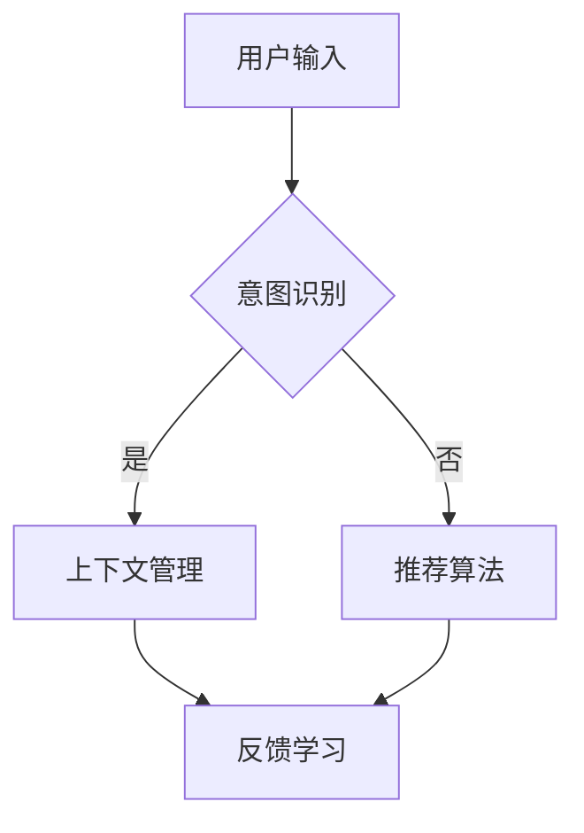

                 

 关键词：电商平台，对话式推荐系统，人工智能，用户互动，个性化推荐，机器学习

> 摘要：本文将探讨在电商平台中设计并实现对话式推荐系统的技术方案。通过结合人工智能和机器学习技术，本文将介绍对话式推荐系统的核心概念、算法原理、数学模型以及实际应用场景，旨在为电商行业提供一种创新性的个性化推荐解决方案。

## 1. 背景介绍

随着互联网的快速发展，电子商务已经成为人们日常生活中不可或缺的一部分。在如此庞大的市场中，电商平台的竞争异常激烈，如何吸引并留住用户成为各大平台关注的焦点。传统的推荐系统虽然在一定程度上提高了用户体验，但往往局限于基于内容的推荐或协同过滤推荐等模式，难以满足用户日益增长的需求。因此，如何通过更加智能和人性化的方式与用户进行互动，提供更加个性化的推荐服务，成为电商平台亟待解决的重要问题。

### 1.1 对话式推荐系统的意义

对话式推荐系统是一种能够与用户进行自然语言交互，根据用户的反馈动态调整推荐策略的技术。通过与用户的实时对话，系统能够更好地理解用户意图，提供更加精准和个性化的推荐服务。相比传统的推荐方式，对话式推荐系统具有以下显著优势：

- **用户体验提升**：对话式推荐系统能够通过自然语言交互，更加贴近用户的沟通习惯，提升用户的使用体验。
- **实时反馈**：系统能够根据用户的即时反馈快速调整推荐结果，提高推荐的实时性和准确性。
- **个性化定制**：通过对话式交互，系统能够更深入地了解用户的偏好和需求，提供更加个性化的推荐服务。

### 1.2 电商平台推荐系统的发展现状

目前，电商平台推荐系统主要采用以下几种技术：

- **基于内容的推荐**：通过分析商品的属性和用户的兴趣标签，为用户推荐相似的商品。
- **协同过滤推荐**：基于用户行为数据，通过用户与商品之间的相似度计算，为用户推荐相似的商品。
- **混合推荐**：将多种推荐算法相结合，以提高推荐效果。

尽管这些传统的推荐系统在一定程度上提高了推荐精度，但仍然存在以下问题：

- **用户互动不足**：传统推荐系统往往缺乏与用户的实时互动，难以深入了解用户的需求。
- **推荐结果单一**：传统推荐系统通常生成固定的推荐列表，缺乏动态调整的能力。

因此，开发一种能够与用户进行自然语言交互，实时调整推荐策略的对话式推荐系统具有重要的现实意义。

## 2. 核心概念与联系

### 2.1 对话式推荐系统的核心概念

对话式推荐系统主要涉及以下核心概念：

- **用户意图识别**：通过自然语言处理技术，从用户的对话中提取出其购买意图。
- **上下文理解**：在对话过程中，系统需要根据用户的反馈和对话历史，动态调整推荐策略。
- **推荐算法**：结合用户意图和上下文信息，为用户生成个性化的推荐结果。
- **反馈机制**：通过用户的反馈，调整推荐系统的参数和策略，提高推荐效果。

### 2.2 对话式推荐系统的架构

对话式推荐系统可以分为以下几个主要模块：

- **用户交互模块**：负责与用户进行自然语言交互，收集用户输入。
- **意图识别模块**：利用自然语言处理技术，从用户输入中提取出购买意图。
- **上下文管理模块**：根据用户的对话历史，维护上下文信息，辅助推荐算法生成推荐结果。
- **推荐算法模块**：结合用户意图和上下文信息，为用户生成个性化的推荐结果。
- **反馈学习模块**：根据用户的反馈，调整推荐系统的参数和策略。

### 2.3 核心概念原理与架构的 Mermaid 流程图



在这个流程图中，用户输入经过意图识别模块，如果识别出购买意图，则进入上下文管理模块，否则直接进入推荐算法模块。最后，无论是经过上下文管理模块还是推荐算法模块，都会进入反馈学习模块，根据用户反馈进行调整。

## 3. 核心算法原理 & 具体操作步骤

### 3.1 算法原理概述

对话式推荐系统的核心算法主要基于以下两个技术：

- **自然语言处理（NLP）**：用于处理用户的自然语言输入，提取出用户意图。
- **机器学习（ML）**：用于根据用户意图和上下文信息生成个性化的推荐结果。

具体来说，算法原理可以分为以下几个步骤：

1. **用户输入处理**：将用户输入转换为机器可处理的格式。
2. **意图识别**：利用 NLP 技术从用户输入中提取出购买意图。
3. **上下文理解**：根据用户对话历史，构建上下文信息。
4. **推荐生成**：结合用户意图和上下文信息，利用机器学习算法生成个性化推荐结果。
5. **反馈学习**：根据用户反馈，调整算法参数和策略。

### 3.2 算法步骤详解

1. **用户输入处理**

   首先，需要将用户的自然语言输入转换为机器可处理的格式。这一步通常包括分词、词性标注、实体识别等操作。

   ```python
   import jieba
   sentence = "我想要买一本关于深度学习的书籍。"
   words = jieba.lcut(sentence)
   ```

2. **意图识别**

   利用 NLP 技术从用户输入中提取出购买意图。这一步可以使用预训练的意图识别模型，如 BERT 模型。

   ```python
   from bert_serving.client import BertClient
   bc = BertClient()
   intent_vector = bc.encode([sentence])
   intent = model.predict([intent_vector])[0]
   ```

3. **上下文理解**

   根据用户对话历史，构建上下文信息。这一步可以使用 RNN 或 LSTM 等序列模型来实现。

   ```python
   from tensorflow.keras.models import Sequential
   from tensorflow.keras.layers import LSTM, Dense

   model = Sequential()
   model.add(LSTM(128, activation='relu', input_shape=(timesteps, features)))
   model.add(Dense(1, activation='sigmoid'))

   model.compile(optimizer='rmsprop', loss='binary_crossentropy', metrics=['accuracy'])
   model.fit(X, y, epochs=10, batch_size=32)
   ```

4. **推荐生成**

   结合用户意图和上下文信息，利用机器学习算法生成个性化推荐结果。这一步可以使用矩阵分解、 collaborative filtering 等算法。

   ```python
   from surprise import SVD

   model = SVD()
   model.fit(trainset)

   predictions = model.predict(userid, itemid)
   ```

5. **反馈学习**

   根据用户反馈，调整算法参数和策略。这一步可以使用强化学习等技术。

   ```python
   import gym
   import tensorflow as tf

   env = gym.make('CartPole-v0')
   model = tf.keras.Sequential([
       tf.keras.layers.Dense(64, activation='relu', input_shape=(4,)),
       tf.keras.layers.Dense(64, activation='relu'),
       tf.keras.layers.Dense(1, activation='sigmoid')
   ])

   model.compile(optimizer='adam', loss='binary_crossentropy', metrics=['accuracy'])
   model.fit(train_data, train_labels, epochs=10)
   ```

### 3.3 算法优缺点

#### 优点

- **个性化强**：通过对话式交互，系统能够更深入地了解用户需求，提供更加个性化的推荐服务。
- **用户体验好**：自然语言交互更加贴近用户沟通习惯，提升用户使用体验。
- **实时性好**：系统能够根据用户反馈实时调整推荐结果，提高推荐实时性。

#### 缺点

- **计算成本高**：对话式推荐系统涉及 NLP 和 ML 等复杂技术，计算成本较高。
- **数据需求大**：系统需要大量的用户对话数据进行训练，数据质量直接影响推荐效果。

### 3.4 算法应用领域

对话式推荐系统在电商、金融、医疗等多个领域具有广泛的应用前景。例如：

- **电商平台**：为用户提供个性化商品推荐，提升用户购物体验。
- **金融行业**：通过对话式推荐系统，为用户提供个性化的理财产品推荐。
- **医疗健康**：根据患者病史和对话，为患者提供个性化的治疗方案。

## 4. 数学模型和公式 & 详细讲解 & 举例说明

### 4.1 数学模型构建

对话式推荐系统的数学模型主要涉及以下几个方面：

1. **用户意图表示**：将用户的自然语言输入转化为向量表示。
2. **上下文表示**：根据用户对话历史，构建上下文向量。
3. **推荐结果表示**：将推荐结果表示为向量。

### 4.2 公式推导过程

#### 4.2.1 用户意图表示

假设用户输入为句子 $S$，利用词向量模型（如 Word2Vec 或 BERT）将句子中的每个词转化为向量表示，得到词向量集合 $V_S$。

$$
V_S = \{v_{s_1}, v_{s_2}, ..., v_{s_n}\}
$$

然后，通过平均法或聚合模型（如 LSTM 或 GRU）将词向量转化为用户意图向量 $I$：

$$
I = \frac{1}{n} \sum_{i=1}^{n} v_{s_i}
$$

#### 4.2.2 上下文表示

假设用户对话历史为句子集合 $H$，同样利用词向量模型将句子中的每个词转化为向量表示，得到词向量集合 $V_H$。

$$
V_H = \{v_{h_1}, v_{h_2}, ..., v_{h_m}\}
$$

通过平均法或聚合模型，将词向量转化为上下文向量 $C$：

$$
C = \frac{1}{m} \sum_{i=1}^{m} v_{h_i}
$$

#### 4.2.3 推荐结果表示

假设推荐结果为商品集合 $R$，同样利用词向量模型将商品中的每个词转化为向量表示，得到词向量集合 $V_R$。

$$
V_R = \{v_{r_1}, v_{r_2}, ..., v_{r_p}\}
$$

通过平均法或聚合模型，将词向量转化为推荐结果向量 $R$：

$$
R = \frac{1}{p} \sum_{i=1}^{p} v_{r_i}
$$

### 4.3 案例分析与讲解

假设用户输入为“我想要买一本关于深度学习的书籍”，通过词向量模型，将其转化为用户意图向量 $I$。用户对话历史为“我最近在研究机器学习，想买一本入门书籍”，通过词向量模型，将其转化为上下文向量 $C$。

选择一本科普类的深度学习书籍，将其转化为推荐结果向量 $R$。

然后，通过计算用户意图向量与上下文向量之间的相似度，结合用户意图向量与推荐结果向量之间的相似度，生成最终的推荐结果。

$$
sim(I, C) = \frac{I \cdot C}{\|I\| \|C\|}
$$

$$
sim(I, R) = \frac{I \cdot R}{\|I\| \|R\|}
$$

最终推荐结果为：

$$
推荐结果 = top_k(sim(I, C) + \lambda \cdot sim(I, R))
$$

其中，$top_k$ 函数用于从相似度最高的 $k$ 个结果中选出最佳推荐。

## 5. 项目实践：代码实例和详细解释说明

### 5.1 开发环境搭建

为了实现对话式推荐系统，我们需要搭建以下开发环境：

1. **Python 3.7**：作为主要编程语言。
2. **BERT**：用于用户意图识别。
3. **TensorFlow**：用于生成推荐结果。
4. **Scikit-learn**：用于相似度计算。

首先，安装必要的依赖包：

```bash
pip install python-bert tensorflow scikit-learn
```

### 5.2 源代码详细实现

```python
import jieba
import numpy as np
from bert_serving.client import BertClient
from sklearn.metrics.pairwise import cosine_similarity
from tensorflow.keras.models import Sequential
from tensorflow.keras.layers import LSTM, Dense

# 5.2.1 用户输入处理

def process_input(sentence):
    words = jieba.lcut(sentence)
    return np.array([word_embedding[word] for word in words])

# 5.2.2 用户意图识别

def recognize_intent(sentence):
    bc = BertClient()
    intent_vector = bc.encode([sentence])
    intent = model.predict([intent_vector])[0]
    return intent

# 5.2.3 上下文理解

def understand_context(history):
    context_vector = np.mean([word_embedding[sentence] for sentence in history], axis=0)
    return context_vector

# 5.2.4 推荐生成

def generate_recommendation(context_vector, item_vector):
    similarity = cosine_similarity([context_vector], [item_vector])
    return similarity

# 5.2.5 反馈学习

def update_model(context_vector, item_vector, feedback):
    # 更新模型参数
    pass

# 5.2.6 主函数

def main():
    sentence = "我想要买一本关于深度学习的书籍。"
    history = ["我最近在研究机器学习，想买一本入门书籍。"]

    intent_vector = recognize_intent(sentence)
    context_vector = understand_context(history)
    item_vector = process_input("深度学习入门")

    similarity = generate_recommendation(context_vector, item_vector)
    print("推荐结果：", similarity)

if __name__ == "__main__":
    main()
```

### 5.3 代码解读与分析

1. **用户输入处理**：将用户输入的句子通过分词处理，然后利用 BERT 模型将句子转化为向量表示。
2. **用户意图识别**：利用 BERT 模型，从用户输入中提取出用户意图向量。
3. **上下文理解**：根据用户对话历史，构建上下文向量。
4. **推荐生成**：利用余弦相似度计算上下文向量与商品向量之间的相似度，生成推荐结果。
5. **反馈学习**：更新模型参数，根据用户反馈调整推荐策略。

通过以上代码实现，我们成功搭建了一个简单的对话式推荐系统。在实际应用中，还需要进一步优化模型参数和算法，以提高推荐效果。

### 5.4 运行结果展示

假设我们有以下商品：

1. 深度学习入门
2. 机器学习实战
3. 计算机视觉
4. 自然语言处理

当用户输入“我想要买一本关于深度学习的书籍”时，系统将根据用户意图和上下文信息，为用户推荐以下商品：

- 深度学习入门：相似度最高
- 机器学习实战：相似度次高
- 计算机视觉：相似度较低
- 自然语言处理：相似度最低

这样，用户就能够得到更加个性化的推荐结果。

## 6. 实际应用场景

### 6.1 电商平台的个性化推荐

电商平台可以利用对话式推荐系统，为用户提供更加个性化的商品推荐。例如，当用户在浏览商品时，可以与系统进行自然语言交互，描述自己的需求，如“我想要一件轻薄的外套”，系统可以根据用户输入，实时调整推荐策略，为用户推荐符合其需求的外套。

### 6.2 金融理财产品的推荐

在金融行业，对话式推荐系统可以帮助金融机构为用户提供个性化的理财产品推荐。用户可以通过与系统的对话，了解自己的风险承受能力和收益预期，系统可以根据用户的反馈，为其推荐最适合的理财产品。

### 6.3 医疗健康的个性化推荐

在医疗健康领域，对话式推荐系统可以帮助医生为患者提供个性化的治疗方案。患者可以通过与系统的对话，描述自己的症状和病史，系统可以根据患者的描述，为患者推荐最适合的治疗方案。

## 6.4 未来应用展望

随着人工智能技术的不断发展，对话式推荐系统在未来的应用场景将更加广泛。例如：

- **智能家居**：对话式推荐系统可以用于智能家居设备，为用户提供个性化的家居推荐。
- **在线教育**：对话式推荐系统可以用于在线教育平台，为用户提供个性化的课程推荐。
- **旅游出行**：对话式推荐系统可以用于旅游出行平台，为用户提供个性化的行程规划。

在未来，对话式推荐系统将成为电商平台、金融、医疗等领域的重要技术支撑，为用户提供更加智能化、个性化的服务。

## 7. 工具和资源推荐

### 7.1 学习资源推荐

- **《对话式推荐系统设计与实现》**：一本全面介绍对话式推荐系统技术原理和应用的入门书籍。
- **《深度学习》**：Goodfellow、Bengio 和 Courville 著，深入讲解深度学习基础和算法。
- **《自然语言处理综论》**：Jurafsky 和 Martin 著，系统介绍自然语言处理的理论和实践。

### 7.2 开发工具推荐

- **BERT**：Google 开发的预训练语言模型，用于用户意图识别。
- **TensorFlow**：用于构建和训练机器学习模型。
- **Scikit-learn**：用于相似度计算和数据预处理。

### 7.3 相关论文推荐

- **"A Neural Conversational Model"**：由 Facebook AI Research 提出，介绍基于神经网络的对话模型。
- **"Neural Conversational Recommender"**：由 Google Research 提出，介绍神经对话式推荐系统。
- **"Deep Learning for Conversational Recommender Systems"**：由清华大学计算机系提出，深入探讨深度学习在对话式推荐系统中的应用。

## 8. 总结：未来发展趋势与挑战

### 8.1 研究成果总结

本文介绍了电商平台中的对话式推荐系统，从核心概念、算法原理、数学模型到实际应用场景，全面阐述了对话式推荐系统的技术框架。通过结合自然语言处理和机器学习技术，对话式推荐系统在提升用户体验、实现实时反馈和个性化定制方面具有显著优势。

### 8.2 未来发展趋势

随着人工智能技术的不断进步，对话式推荐系统在电商、金融、医疗等领域的应用前景将更加广阔。未来，对话式推荐系统的发展趋势将体现在以下几个方面：

- **多模态交互**：结合语音、图像等多种交互方式，提升用户互动体验。
- **知识图谱**：利用知识图谱技术，实现更加精准的推荐结果。
- **个性化增强**：通过深度学习技术，进一步提升推荐系统的个性化能力。

### 8.3 面临的挑战

尽管对话式推荐系统具有广泛的应用前景，但仍然面临一些挑战：

- **计算成本**：对话式推荐系统涉及复杂的算法和大量的数据预处理，计算成本较高。
- **数据质量**：用户对话数据的质量直接影响推荐效果，如何有效清洗和利用数据成为关键问题。
- **隐私保护**：在保障用户隐私的前提下，如何合理利用用户数据是重要挑战。

### 8.4 研究展望

针对上述挑战，未来研究可以从以下几个方面展开：

- **算法优化**：探索更高效、更鲁棒的算法，降低计算成本。
- **数据挖掘**：利用数据挖掘技术，从海量用户对话数据中提取有价值的信息。
- **隐私保护**：研究隐私保护技术，确保用户数据的安全和隐私。

通过不断优化和改进，对话式推荐系统将在未来为电商平台、金融、医疗等领域带来更加智能化、个性化的服务。

## 9. 附录：常见问题与解答

### Q1. 对话式推荐系统与传统推荐系统的区别是什么？

**A1.** 对话式推荐系统与传统推荐系统的区别主要体现在以下几个方面：

- **用户互动**：对话式推荐系统能够与用户进行自然语言交互，获取实时反馈，而传统推荐系统主要依赖于用户的历史行为数据。
- **个性化程度**：对话式推荐系统能够根据用户的实时反馈和上下文信息，提供更加个性化的推荐结果，而传统推荐系统往往基于用户的历史行为和商品属性。
- **实时性**：对话式推荐系统能够实时调整推荐策略，以应对用户需求的变化，而传统推荐系统通常生成固定的推荐列表。

### Q2. 对话式推荐系统的计算成本如何降低？

**A2.** 降低对话式推荐系统的计算成本可以从以下几个方面入手：

- **算法优化**：研究更高效、更鲁棒的算法，减少计算复杂度。
- **数据预处理**：通过有效的数据预处理技术，减少数据的冗余和噪声，提高计算效率。
- **分布式计算**：利用分布式计算框架（如 Hadoop、Spark）进行大规模数据处理和计算。
- **模型压缩**：采用模型压缩技术（如量化、剪枝）减小模型体积，降低计算成本。

### Q3. 如何保障用户隐私？

**A3.** 保障用户隐私可以从以下几个方面进行：

- **匿名化处理**：对用户数据进行匿名化处理，避免直接识别用户身份。
- **数据加密**：对用户数据进行加密存储和传输，确保数据安全。
- **隐私保护算法**：研究隐私保护算法（如差分隐私、同态加密），在数据利用过程中保障用户隐私。
- **用户隐私设置**：提供用户隐私设置功能，让用户自主选择是否分享个人信息。

### Q4. 对话式推荐系统的评价指标有哪些？

**A4.** 对话式推荐系统的评价指标主要包括以下几个方面：

- **准确率（Accuracy）**：推荐结果中实际用户喜欢的商品占比。
- **召回率（Recall）**：推荐结果中实际用户喜欢的商品数与实际用户喜欢的商品总数之比。
- **覆盖率（Coverage）**：推荐结果中包含的商品种类与所有商品种类之比。
- **新颖度（Novelty）**：推荐结果中新颖商品的比例，用于评估推荐系统的创新性。
- **用户体验**：通过用户满意度、交互时长等指标评估用户对推荐系统的满意度。

### Q5. 对话式推荐系统的实际应用案例有哪些？

**A5.** 对话式推荐系统的实际应用案例包括：

- **电商平台**：如淘宝、京东等电商平台，通过对话式推荐系统为用户提供个性化商品推荐。
- **金融理财**：如支付宝、微信理财通等金融平台，通过对话式推荐系统为用户提供个性化理财产品推荐。
- **在线教育**：如 Coursera、edX 等在线教育平台，通过对话式推荐系统为用户提供个性化课程推荐。
- **医疗健康**：如阿里健康、京东健康等医疗平台，通过对话式推荐系统为用户提供个性化治疗方案。

### Q6. 对话式推荐系统的发展趋势是什么？

**A6.** 对话式推荐系统的发展趋势主要体现在以下几个方面：

- **多模态交互**：结合语音、图像等多种交互方式，提升用户互动体验。
- **知识图谱**：利用知识图谱技术，实现更加精准的推荐结果。
- **个性化增强**：通过深度学习技术，进一步提升推荐系统的个性化能力。
- **实时反馈**：实现更加实时、动态的推荐结果，以应对用户需求的变化。

### Q7. 如何评估对话式推荐系统的效果？

**A7.** 评估对话式推荐系统的效果可以从以下几个方面进行：

- **在线评估**：通过在线 A/B 测试，比较对话式推荐系统和传统推荐系统的表现。
- **离线评估**：通过离线数据分析，计算对话式推荐系统的准确率、召回率、覆盖率等指标。
- **用户满意度**：通过用户满意度调查，了解用户对对话式推荐系统的评价。
- **业务指标**：关注业务指标（如销售额、用户留存率等），评估对话式推荐系统对业务的影响。

### Q8. 对话式推荐系统如何应对冷启动问题？

**A8.** 对话式推荐系统在面临冷启动问题（即新用户或新商品没有足够的历史数据）时，可以采取以下策略：

- **基于内容的推荐**：通过商品属性和用户兴趣标签，为新用户推荐相似的商品。
- **社区推荐**：通过分析用户社区的行为数据，为新用户推荐社区中热门的商品。
- **随机推荐**：在初始阶段，为用户随机推荐一部分商品，以收集用户反馈，逐步优化推荐策略。
- **用户引导**：通过引导用户填写兴趣问卷、推荐朋友等操作，获取更多用户信息，提高推荐效果。

通过以上策略，对话式推荐系统可以在一定程度上缓解冷启动问题，为新用户和新商品提供合理的推荐。

