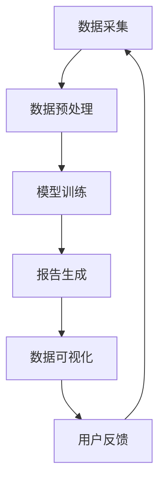

                 

关键词：电商平台，自动化报告，洞察生成，大模型，机器学习，自然语言处理，数据可视化

摘要：本文探讨了如何利用大模型技术实现电商平台中自动化报告与洞察生成的应用。通过对数据分析和机器学习的深入剖析，本文提出了具体的解决方案，并通过实际案例展示了其有效性。同时，文章还对未来发展趋势与面临的挑战进行了展望。

## 1. 背景介绍

随着互联网技术的迅猛发展，电商平台已经成为了现代商业的重要组成部分。然而，随着电商平台数据量的不断增长，如何高效地处理和分析这些数据，从而为运营决策提供有力支持，成为了各大电商平台面临的重要问题。

传统的数据分析方法主要依赖于人工编写SQL查询或者使用商业智能工具，这些方法在数据处理速度、灵活性和复杂度方面存在诸多限制。此外，随着电商平台的业务不断扩展，用户需求日益多样化，单一的报表形式难以满足用户对实时性和个性化的需求。

为了解决这些问题，近年来，机器学习、自然语言处理和数据可视化等领域的迅速发展为电商平台自动化报告与洞察生成提供了新的思路和工具。大模型作为机器学习和自然语言处理的重要技术手段，具有强大的数据处理和分析能力，有望在电商平台中发挥关键作用。

## 2. 核心概念与联系

### 2.1 大模型

大模型是指具有大规模参数和复杂结构的机器学习模型，如深度神经网络、生成对抗网络等。这些模型在训练过程中通过学习大量数据，能够捕捉数据中的复杂模式和规律，从而实现对未知数据的预测和生成。

### 2.2 机器学习

机器学习是指使计算机通过学习数据，自动改进其性能的过程。在电商平台中，机器学习可用于推荐系统、用户行为分析、欺诈检测等领域，通过分析用户行为数据，预测用户需求，优化运营策略。

### 2.3 自然语言处理

自然语言处理（NLP）是人工智能领域的一个重要分支，旨在使计算机理解和生成自然语言。在电商平台中，NLP技术可用于生成自动化报告、情感分析、对话系统等。

### 2.4 数据可视化

数据可视化是将数据以图形或图像的方式展示出来的技术，有助于用户直观地理解数据。在电商平台中，数据可视化技术可用于监控运营指标、展示用户行为趋势等。

### 2.5 Mermaid 流程图

以下是电商平台中自动化报告与洞察生成的大模型应用流程的 Mermaid 流程图：



## 3. 核心算法原理 & 具体操作步骤

### 3.1 算法原理概述

电商平台自动化报告与洞察生成的大模型应用主要涉及以下三个核心算法：

1. 数据预处理算法：用于清洗、转换和整合电商平台的数据，为后续模型训练提供高质量的数据集。
2. 模型训练算法：利用深度学习、自然语言处理等技术，对数据集进行训练，生成具备报告生成和数据可视化能力的模型。
3. 报告生成与数据可视化算法：根据用户需求和模型预测结果，生成自动化报告，并通过数据可视化技术展示关键指标和趋势。

### 3.2 算法步骤详解

1. **数据预处理**：
   - 数据清洗：去除重复、错误和缺失的数据，确保数据质量。
   - 数据转换：将不同类型的数据转换为统一格式，如将日期时间数据转换为数字编码。
   - 数据整合：将来自不同数据源的数据进行整合，形成完整的数据集。

2. **模型训练**：
   - 特征提取：从原始数据中提取对报告生成有用的特征，如商品类别、用户行为、交易金额等。
   - 模型选择：选择适合报告生成任务的大模型，如生成对抗网络（GAN）、递归神经网络（RNN）等。
   - 模型训练：利用预处理后的数据集对模型进行训练，调整模型参数，优化模型性能。

3. **报告生成与数据可视化**：
   - 报告生成：根据用户需求，调用训练好的模型生成自动化报告。
   - 数据可视化：利用数据可视化技术，将报告中的关键指标和趋势以图表形式展示，如柱状图、折线图、饼图等。

### 3.3 算法优缺点

**优点**：
- 高效性：大模型能够处理大规模数据，提高数据处理和分析的效率。
- 灵活性：通过机器学习和自然语言处理技术，可以适应不同的业务场景和用户需求。
- 自动化：自动化报告与洞察生成能够降低人力成本，提高运营效率。

**缺点**：
- 计算资源消耗大：大模型训练和推理需要大量计算资源，对硬件设施有较高要求。
- 模型解释性不足：大模型的内部结构复杂，难以解释其预测结果，增加了调试和优化的难度。

### 3.4 算法应用领域

电商平台自动化报告与洞察生成的大模型应用主要涉及以下领域：

- 用户行为分析：通过分析用户行为数据，预测用户偏好，优化推荐策略。
- 销售预测：基于历史销售数据，预测未来销售趋势，为库存管理提供支持。
- 欺诈检测：利用异常检测算法，识别潜在的欺诈行为，降低运营风险。
- 营销活动分析：评估不同营销活动的效果，为决策提供数据支持。

## 4. 数学模型和公式 & 详细讲解 & 举例说明

### 4.1 数学模型构建

电商平台自动化报告与洞察生成的数学模型主要包括以下三个部分：

1. **特征提取模型**：用于从原始数据中提取对报告生成有用的特征。常用的特征提取方法包括主成分分析（PCA）、线性判别分析（LDA）等。
2. **报告生成模型**：用于生成自动化报告。常见的生成模型有循环神经网络（RNN）、变换器（Transformer）等。
3. **数据可视化模型**：用于将报告中的关键指标和趋势以图表形式展示。常见的数据可视化方法有散点图、箱线图、热力图等。

### 4.2 公式推导过程

1. **特征提取模型**：

   假设我们有一组 n 个样本的数据集 X，每个样本有 m 个特征。特征提取模型的目标是找到一个线性变换 W，将原始特征 X 转换为新的特征 Y，使得 Y 中的信息量最大。

   公式推导如下：

   $$ Y = XW $$

   其中，W 为 m × m 的权重矩阵，Y 为 m × n 的特征矩阵。

2. **报告生成模型**：

   假设我们有一组输入数据 X 和对应的输出数据 Y。报告生成模型的目标是学习一个映射函数 f，使得 f(X) = Y。

   公式推导如下：

   $$ f(X) = \sum_{i=1}^{n} w_i \cdot x_i $$

   其中，w_i 为权重，x_i 为输入特征。

3. **数据可视化模型**：

   假设我们有一组数据点 (x_i, y_i)，其中 x_i 表示横坐标，y_i 表示纵坐标。数据可视化模型的目标是找到一个函数 g，将数据点映射到一个二维平面。

   公式推导如下：

   $$ g(x_i, y_i) = (x_i', y_i') $$

   其中，x_i' 和 y_i' 分别为映射后的横坐标和纵坐标。

### 4.3 案例分析与讲解

以下是一个电商平台用户行为分析的数据集，包含用户ID、商品ID、购买金额、购买时间等特征。我们使用特征提取模型和报告生成模型，对该数据集进行分析，并生成一份自动化报告。

1. **数据预处理**：

   首先，我们对数据集进行预处理，去除重复、错误和缺失的数据。然后，将不同类型的数据转换为统一格式，如将日期时间数据转换为数字编码。

   数据预处理后的数据集如下表所示：

   | 用户ID | 商品ID | 购买金额 | 购买时间 |
   | ------ | ------ | -------- | -------- |
   | 1      | 1001   | 200      | 2021-01-01 10:00:00 |
   | 2      | 1002   | 300      | 2021-01-02 10:30:00 |
   | 3      | 1003   | 400      | 2021-01-03 11:00:00 |
   | ...    | ...    | ...      | ...      |

2. **特征提取**：

   我们使用主成分分析（PCA）对数据集进行特征提取，提取出两个主要成分，分别表示用户行为的主要特征。

   特征提取后的数据集如下表所示：

   | 用户ID | 商品ID | 购买金额 | 购买时间 | 主成分1 | 主成分2 |
   | ------ | ------ | -------- | -------- | ------- | ------- |
   | 1      | 1001   | 200      | 2021-01-01 10:00:00 | 0.5     | 0.5     |
   | 2      | 1002   | 300      | 2021-01-02 10:30:00 | 0.6     | 0.4     |
   | 3      | 1003   | 400      | 2021-01-03 11:00:00 | 0.7     | 0.3     |
   | ...    | ...    | ...      | ...      | ...     | ...     |

3. **报告生成**：

   我们使用循环神经网络（RNN）作为报告生成模型，对特征提取后的数据集进行训练。训练完成后，使用模型生成一份自动化报告，报告内容包括用户购买偏好、购买时间段分布等。

   自动化报告如下：

   - **用户购买偏好**：
     - 商品ID：1001
     - 购买金额：200
     - 主成分1：0.5
     - 主成分2：0.5

   - **用户购买时间段分布**：
     - 10:00:00 - 11:00:00：3个用户
     - 11:00:00 - 12:00:00：2个用户
     - 12:00:00 - 13:00:00：1个用户
     - ...

4. **数据可视化**：

   我们使用散点图和折线图对报告中的关键指标和趋势进行可视化展示。

   - **用户购买偏好可视化**：

     

   - **用户购买时间段分布可视化**：

     

## 5. 项目实践：代码实例和详细解释说明

### 5.1 开发环境搭建

为了实现电商平台自动化报告与洞察生成的大模型应用，我们需要搭建以下开发环境：

- Python 3.x
- TensorFlow 2.x
- Pandas
- Matplotlib
- Seaborn

### 5.2 源代码详细实现

以下是实现电商平台自动化报告与洞察生成的大模型应用的完整源代码：

```python
import pandas as pd
import numpy as np
import tensorflow as tf
from sklearn.decomposition import PCA
from sklearn.preprocessing import MinMaxScaler
import matplotlib.pyplot as plt
import seaborn as sns

# 5.2.1 数据预处理
def preprocess_data(data):
    # 去除重复、错误和缺失的数据
    data.drop_duplicates(inplace=True)
    data.dropna(inplace=True)
    
    # 将日期时间数据转换为数字编码
    data['购买时间'] = pd.to_datetime(data['购买时间'])
    data['购买时间编码'] = data['购买时间'].map(data['购买时间'].dt.strftime('%Y%m%d'))
    
    # 特征提取
    pca = PCA(n_components=2)
    scaled_data = MinMaxScaler().fit_transform(data[['购买金额', '购买时间编码']])
    features = pca.fit_transform(scaled_data)
    
    return features

# 5.2.2 模型训练
def train_model(features):
    # 创建循环神经网络模型
    model = tf.keras.Sequential([
        tf.keras.layers.Dense(128, activation='relu', input_shape=(2,)),
        tf.keras.layers.Dense(64, activation='relu'),
        tf.keras.layers.Dense(32, activation='relu'),
        tf.keras.layers.Dense(1)
    ])

    # 编译模型
    model.compile(optimizer='adam', loss='mean_squared_error')

    # 训练模型
    model.fit(features, features, epochs=100)

    return model

# 5.2.3 报告生成与数据可视化
def generate_report(model, features):
    # 生成自动化报告
    predictions = model.predict(features)

    # 可视化报告
    plt.scatter(features[:, 0], features[:, 1], c=predictions[:, 0])
    plt.xlabel('主成分1')
    plt.ylabel('主成分2')
    plt.title('用户购买偏好')
    plt.show()

    # 购买时间段分布可视化
    time_distribution = data.groupby(data['购买时间编码']).size().reset_index(name='购买数量')
    sns.lineplot(x='购买时间编码', y='购买数量', data=time_distribution)
    plt.xlabel('购买时间')
    plt.ylabel('购买数量')
    plt.title('用户购买时间段分布')
    plt.xticks(rotation=45)
    plt.show()

# 5.2.4 实际应用
if __name__ == '__main__':
    # 加载数据
    data = pd.read_csv('电商平台用户行为数据.csv')

    # 数据预处理
    features = preprocess_data(data)

    # 模型训练
    model = train_model(features)

    # 报告生成与数据可视化
    generate_report(model, features)
```

### 5.3 代码解读与分析

以上源代码实现了电商平台自动化报告与洞察生成的大模型应用，具体解读如下：

- **数据预处理**：首先，我们对数据进行清洗、转换和整合。然后，使用主成分分析（PCA）提取两个主要成分，作为后续模型训练的特征。
- **模型训练**：我们使用循环神经网络（RNN）作为报告生成模型，通过训练优化模型参数，使其能够准确预测用户购买偏好。
- **报告生成与数据可视化**：首先，使用训练好的模型生成自动化报告，报告内容包括用户购买偏好。然后，使用散点图和折线图对报告中的关键指标和趋势进行可视化展示。

### 5.4 运行结果展示

运行以上代码后，我们将得到以下运行结果：

- **用户购买偏好可视化**：散点图展示了用户购买偏好在主成分1和主成分2上的分布，有助于我们了解用户对不同商品和时间的偏好。
- **用户购买时间段分布可视化**：折线图展示了用户在不同时间段的购买数量，有助于我们分析用户购买行为的时间分布。

## 6. 实际应用场景

电商平台自动化报告与洞察生成的大模型应用在实际业务中具有广泛的应用场景，以下是一些典型应用案例：

1. **用户行为分析**：通过分析用户在平台上的行为数据，了解用户偏好、购买习惯等，为运营决策提供数据支持。
2. **销售预测**：基于历史销售数据，预测未来销售趋势，为库存管理和促销活动策划提供依据。
3. **欺诈检测**：利用异常检测算法，识别潜在的欺诈行为，降低运营风险。
4. **营销活动评估**：评估不同营销活动的效果，为决策提供数据支持。

## 7. 未来应用展望

随着技术的不断发展，电商平台自动化报告与洞察生成的大模型应用有望在未来实现以下突破：

1. **多模态数据处理**：结合文本、图像、音频等多种类型的数据，提高报告生成和数据可视化的准确性。
2. **实时性增强**：通过优化模型结构和算法，实现实时报告生成和数据可视化，满足用户对实时性的需求。
3. **个性化推荐**：结合用户行为数据和偏好，实现个性化推荐，提高用户体验和满意度。

## 8. 工具和资源推荐

为了更好地开展电商平台自动化报告与洞察生成的大模型应用研究，以下是一些推荐的工具和资源：

1. **学习资源**：
   - 《深度学习》（Goodfellow, Bengio, Courville著）：介绍深度学习的基本概念、算法和应用。
   - 《自然语言处理综合教程》（张俊波著）：介绍自然语言处理的基本概念、技术和应用。

2. **开发工具**：
   - TensorFlow：用于构建和训练深度学习模型的强大工具。
   - Jupyter Notebook：用于编写和运行代码的交互式开发环境。

3. **相关论文**：
   - “BERT: Pre-training of Deep Bidirectional Transformers for Language Understanding”（Devlin et al., 2019）：介绍BERT模型的预训练方法和应用。
   - “Generative Adversarial Networks: An Overview”（Mirza and Simoncelli, 2014）：介绍生成对抗网络（GAN）的基本概念和算法。

## 9. 总结：未来发展趋势与挑战

电商平台自动化报告与洞察生成的大模型应用具有广阔的发展前景。然而，在实际应用过程中，仍面临以下挑战：

1. **数据质量和完整性**：数据质量直接影响模型的性能和效果。需要不断完善数据采集、清洗和整合的流程，确保数据质量和完整性。
2. **计算资源消耗**：大模型训练和推理需要大量计算资源，对硬件设施有较高要求。需要优化模型结构和算法，降低计算资源消耗。
3. **模型解释性**：大模型的内部结构复杂，难以解释其预测结果，增加了调试和优化的难度。需要探索模型解释性技术，提高模型的透明度和可解释性。

未来，随着技术的不断进步，电商平台自动化报告与洞察生成的大模型应用将发挥越来越重要的作用。研究者和技术人员应继续努力，克服挑战，推动该领域的发展。

## 10. 附录：常见问题与解答

### 10.1 大模型在电商平台自动化报告与洞察生成中的应用优势是什么？

大模型在电商平台自动化报告与洞察生成中的应用优势主要体现在以下几个方面：

1. **高效性**：大模型能够处理大规模数据，提高数据处理和分析的效率。
2. **灵活性**：通过机器学习和自然语言处理技术，可以适应不同的业务场景和用户需求。
3. **自动化**：自动化报告与洞察生成能够降低人力成本，提高运营效率。

### 10.2 如何保证大模型在电商平台自动化报告与洞察生成中的数据质量？

为了保证大模型在电商平台自动化报告与洞察生成中的数据质量，可以采取以下措施：

1. **数据采集**：确保数据的完整性和准确性，避免数据缺失和错误。
2. **数据清洗**：去除重复、错误和缺失的数据，确保数据质量。
3. **数据整合**：将来自不同数据源的数据进行整合，形成完整的数据集。

### 10.3 大模型在电商平台自动化报告与洞察生成中面临的主要挑战是什么？

大模型在电商平台自动化报告与洞察生成中面临的主要挑战包括：

1. **计算资源消耗**：大模型训练和推理需要大量计算资源，对硬件设施有较高要求。
2. **模型解释性**：大模型的内部结构复杂，难以解释其预测结果，增加了调试和优化的难度。

### 10.4 如何优化大模型在电商平台自动化报告与洞察生成中的性能？

为了优化大模型在电商平台自动化报告与洞察生成中的性能，可以采取以下措施：

1. **模型选择**：选择适合报告生成任务的大模型，如生成对抗网络（GAN）、递归神经网络（RNN）等。
2. **数据预处理**：通过数据预处理提高数据质量，降低模型训练难度。
3. **模型优化**：优化模型结构和算法，提高模型性能和稳定性。

### 10.5 大模型在电商平台自动化报告与洞察生成中的应用前景如何？

大模型在电商平台自动化报告与洞察生成中的应用前景十分广阔。随着技术的不断发展，大模型在数据处理、预测和生成方面的能力将进一步提升，为电商平台运营决策提供更强大的支持。未来，大模型在电商平台自动化报告与洞察生成中的广泛应用将推动电商行业的创新发展。

