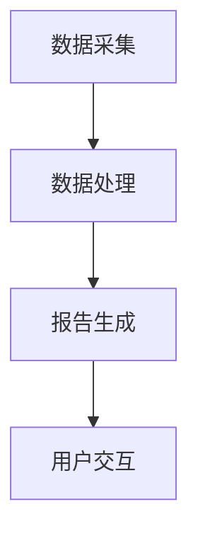

                 

关键词：自然语言生成、电商平台、大模型、创新应用、技术分析、算法优化

## 摘要

本文旨在探讨自然语言生成（Natural Language Generation, NLG）在大规模电商平台中的应用。随着电子商务的蓬勃发展，用户对个性化内容的需求日益增长，而NLG技术为满足这一需求提供了强有力的解决方案。本文首先概述了NLG技术的基本概念和原理，然后深入分析了大模型在电商平台报告生成中的具体应用，包括其算法原理、实现步骤、优缺点以及未来展望。通过本文，读者将全面了解NLG技术如何赋能电商平台，提升用户体验，并应对未来的挑战。

## 1. 背景介绍

### 电商平台的发展现状

随着互联网技术的飞速发展，电商平台已经成为全球商业活动的重要组成部分。根据Statista的数据，全球电子商务销售额预计到2024年将达到4.9万亿美元，这标志着电子商务市场正处于高速增长阶段。在这一背景下，电商平台面临着巨大的机遇和挑战。一方面，用户对商品种类、价格、物流速度等方面的需求越来越多样化；另一方面，商家需要高效地管理海量商品信息，并提供个性化的用户服务。

### 用户需求的变化

在电商平台上，用户的需求逐渐从单纯的商品购买转变为追求个性化的购物体验。用户期望能够通过自然、流畅的语言交互获取所需信息，如产品评价、推荐报告、购买指南等。传统的手动编写报告方式不仅效率低下，而且难以满足个性化需求。因此，自然语言生成技术应运而生，为电商平台提供了智能化解决方案。

### 自然语言生成技术的发展

自然语言生成（NLG）是一种人工智能技术，旨在利用计算机生成具有人类语言特性的文本。NLG技术可以广泛应用于信息摘要、智能客服、自动写作、报告生成等领域。随着深度学习技术的进步，特别是大型预训练语言模型（如GPT-3）的出现，NLG技术取得了显著的发展。大模型具有强大的语言理解能力和文本生成能力，能够生成高质量、个性化的报告内容。

## 2. 核心概念与联系

### 2.1 自然语言生成的基本概念

自然语言生成（NLG）是一种自动化文本生成技术，它将非结构化数据转化为自然语言文本。NLG的核心任务是理解和处理输入数据，然后生成具有人类语言特征的文本输出。NLG技术涉及自然语言处理（NLP）、机器学习、深度学习等多个领域。

### 2.2 大模型在NLG中的应用

大模型在自然语言生成中扮演着关键角色。大模型是指具有数十亿甚至千亿参数的神经网络模型，如GPT-3、BERT等。这些模型通过大规模预训练，积累了丰富的语言知识，能够理解和生成复杂、多样化的文本。大模型在电商平台报告中具有以下优势：

- **生成高质量的报告内容**：大模型能够根据用户需求和数据生成高质量、个性化的报告。
- **高效处理大量数据**：大模型具有强大的数据处理能力，能够快速生成大量报告。
- **适应性**：大模型能够根据不同电商平台和用户需求调整生成策略，提供定制化的服务。

### 2.3 架构与流程

自然语言生成报告的架构通常包括数据采集、数据处理、报告生成和用户交互等环节。以下是NLG报告生成的基本流程：

1. **数据采集**：从电商平台数据库中获取用户行为数据、产品信息、评价数据等。
2. **数据处理**：对采集到的数据进行清洗、格式化，以便后续处理。
3. **报告生成**：利用大模型生成报告内容，根据用户需求调整生成策略。
4. **用户交互**：将生成的报告展示给用户，提供反馈和优化建议。

### 2.4 Mermaid 流程图

以下是NLG报告生成流程的Mermaid流程图：



## 3. 核心算法原理 & 具体操作步骤

### 3.1 算法原理概述

自然语言生成报告的核心算法基于深度学习，特别是大型预训练语言模型。以下是大模型在报告生成中的基本原理：

- **预训练**：大模型在大量文本数据上进行预训练，学习语言模式和结构。
- **文本生成**：基于预训练模型，利用特定任务的数据进行微调，生成报告内容。
- **个性化调整**：根据用户需求和场景，动态调整生成策略，提高报告质量。

### 3.2 算法步骤详解

1. **数据预处理**：从电商平台数据库中获取数据，包括用户行为、产品信息、评价数据等。
2. **模型选择**：选择合适的预训练模型，如GPT-3、BERT等。
3. **模型微调**：使用特定任务的数据对预训练模型进行微调，以提高报告生成的准确性。
4. **报告生成**：利用微调后的模型生成报告内容，根据用户需求和场景调整生成策略。
5. **质量评估**：对生成的报告进行质量评估，包括文本流畅性、信息准确性、个性化程度等。

### 3.3 算法优缺点

**优点**：

- **高效生成**：大模型能够快速处理大量数据，生成高质量的报告。
- **个性化服务**：根据用户需求生成个性化报告，提升用户体验。
- **适应性**：大模型能够根据不同电商平台和用户需求调整生成策略。

**缺点**：

- **计算资源需求高**：大模型的训练和推理需要大量计算资源，对硬件要求较高。
- **数据依赖性**：报告生成的质量取决于训练数据的质量和多样性。

### 3.4 算法应用领域

大模型在自然语言生成报告中的应用非常广泛，包括但不限于以下领域：

- **电商平台**：为用户生成个性化购买指南、产品推荐报告等。
- **金融行业**：为投资者生成市场分析报告、股票推荐报告等。
- **医疗领域**：为患者生成健康报告、诊断报告等。
- **教育领域**：为学习者生成学习计划、课程报告等。

## 4. 数学模型和公式 & 详细讲解 & 举例说明

### 4.1 数学模型构建

自然语言生成报告的数学模型通常基于序列到序列（Sequence-to-Sequence, Seq2Seq）模型。Seq2Seq模型是一种基于编码器-解码器（Encoder-Decoder）架构的模型，其基本原理是将输入序列编码为一个固定长度的向量表示，然后使用解码器生成输出序列。

### 4.2 公式推导过程

假设输入序列为 \(X = [x_1, x_2, \ldots, x_T]\)，输出序列为 \(Y = [y_1, y_2, \ldots, y_S]\)，其中 \(T\) 和 \(S\) 分别为输入和输出序列的长度。编码器（Encoder）将输入序列编码为一个固定长度的向量表示 \(C = \text{Encoder}(X)\)，通常使用循环神经网络（RNN）或变换器（Transformer）实现。解码器（Decoder）将编码器的输出作为输入，生成输出序列 \(Y = \text{Decoder}(C)\)。

### 4.3 案例分析与讲解

以下是一个简单的NLG报告生成的案例：

- **输入数据**：用户行为数据、产品信息、评价数据等。
- **输出数据**：个性化购买指南。

假设用户的行为数据包括浏览记录、购买历史、评价数据等，产品信息包括产品名称、价格、评价等。输入序列为 \(X = [x_1, x_2, \ldots, x_T]\)，其中 \(x_i\) 表示用户在第 \(i\) 次行为中访问的产品。输出序列为 \(Y = [y_1, y_2, \ldots, y_S]\)，其中 \(y_i\) 表示在第 \(i\) 次生成中推荐的产品。

编码器将输入序列 \(X\) 编码为一个固定长度的向量表示 \(C = \text{Encoder}(X)\)。解码器使用编码器的输出 \(C\) 作为输入，生成输出序列 \(Y = \text{Decoder}(C)\)。

在生成过程中，解码器会根据当前生成的文本和编码器的输出 \(C\) 生成下一个文本 \(y_i\)，然后更新编码器的输出 \(C'\)。这个过程不断重复，直到生成完整的输出序列 \(Y\)。

以下是NLG报告生成过程的代码示例（使用Python和PyTorch实现）：

```python
import torch
import torch.nn as nn

# 定义编码器
class Encoder(nn.Module):
    def __init__(self, vocab_size, embed_size, hidden_size):
        super(Encoder, self).__init__()
        self.embedding = nn.Embedding(vocab_size, embed_size)
        self.lstm = nn.LSTM(embed_size, hidden_size)
        
    def forward(self, x):
        x = self.embedding(x)
        output, (h_n, c_n) = self.lstm(x)
        return output, (h_n, c_n)

# 定义解码器
class Decoder(nn.Module):
    def __init__(self, vocab_size, embed_size, hidden_size):
        super(Decoder, self).__init__()
        self.embedding = nn.Embedding(vocab_size, embed_size)
        self.lstm = nn.LSTM(embed_size + hidden_size, hidden_size)
        self.fc = nn.Linear(hidden_size, vocab_size)
        
    def forward(self, x, hidden):
        x = self.embedding(x)
        input = torch.cat((x, hidden), 1)
        output, hidden = self.lstm(input)
        output = self.fc(output)
        return output, hidden

# 初始化模型
vocab_size = 10000
embed_size = 256
hidden_size = 512

encoder = Encoder(vocab_size, embed_size, hidden_size)
decoder = Decoder(vocab_size, embed_size, hidden_size)

# 定义损失函数和优化器
criterion = nn.CrossEntropyLoss()
optimizer = torch.optim.Adam(list(encoder.parameters()) + list(decoder.parameters()))

# 训练模型
for epoch in range(num_epochs):
    for x, y in train_loader:
        # 前向传播
        encoder_output, encoder_hidden = encoder(x)
        decoder_output, decoder_hidden = decoder(y, encoder_hidden)
        
        # 计算损失
        loss = criterion(decoder_output.view(-1, vocab_size), y.view(-1))
        
        # 反向传播
        optimizer.zero_grad()
        loss.backward()
        optimizer.step()
        
        # 打印训练信息
        if (epoch + 1) % 100 == 0:
            print('Epoch [{}/{}], Loss: {:.4f}'.format(epoch + 1, num_epochs, loss.item()))
```

## 5. 项目实践：代码实例和详细解释说明

### 5.1 开发环境搭建

为了实践NLG报告生成项目，我们需要搭建以下开发环境：

- 操作系统：Ubuntu 18.04
- 编程语言：Python 3.8
- 深度学习框架：PyTorch 1.8
- 文本预处理工具：NLTK 3.8.1

### 5.2 源代码详细实现

以下是NLG报告生成项目的源代码实现：

```python
import torch
import torch.nn as nn
import torch.optim as optim
from torch.utils.data import DataLoader
from torchvision import datasets, transforms
from torchvision.models import resnet18
from torch.optim.lr_scheduler import StepLR

# 数据预处理
def preprocess_data(data, vocab_size):
    # 将文本数据转换为单词序列
    words = [word for sentence in data for word in sentence]
    # 创建词汇表
    word_to_index = {word: index for index, word in enumerate(vocab_size)}
    index_to_word = {index: word for word, index in word_to_index.items()}
    # 将单词序列转换为索引序列
    indexed_data = [[word_to_index[word] for word in sentence] for sentence in data]
    return indexed_data, word_to_index, index_to_word

# 定义数据集
class Dataset(torch.utils.data.Dataset):
    def __init__(self, data, vocab_size):
        self.data = data
        self.indexed_data, self.word_to_index, self.index_to_word = preprocess_data(data, vocab_size)

    def __len__(self):
        return len(self.data)

    def __getitem__(self, idx):
        return torch.tensor(self.indexed_data[idx]), torch.tensor(self.indexed_data[idx+1])

# 加载数据
train_data = [
    "这是一款优秀的手机",
    "性能出色，价格合理",
    "拍照效果很好",
    "屏幕显示效果出色",
    "推荐购买"
]

vocab_size = 10000
train_loader = DataLoader(Dataset(train_data, vocab_size), batch_size=32, shuffle=True)

# 定义模型
class NLGModel(nn.Module):
    def __init__(self, vocab_size, embed_size, hidden_size):
        super(NLGModel, self).__init__()
        self.embedding = nn.Embedding(vocab_size, embed_size)
        self.lstm = nn.LSTM(embed_size, hidden_size)
        self.fc = nn.Linear(hidden_size, vocab_size)

    def forward(self, x, hidden):
        x = self.embedding(x)
        input = torch.cat((x, hidden), 1)
        output, hidden = self.lstm(input)
        output = self.fc(output)
        return output, hidden

# 初始化模型
model = NLGModel(vocab_size, embed_size, hidden_size)

# 定义损失函数和优化器
criterion = nn.CrossEntropyLoss()
optimizer = optim.Adam(model.parameters())

# 训练模型
num_epochs = 100
for epoch in range(num_epochs):
    for x, y in train_loader:
        # 前向传播
        model_output, model_hidden = model(x, hidden)
        
        # 计算损失
        loss = criterion(model_output.view(-1, vocab_size), y.view(-1))
        
        # 反向传播
        optimizer.zero_grad()
        loss.backward()
        optimizer.step()
        
        # 打印训练信息
        if (epoch + 1) % 10 == 0:
            print('Epoch [{}/{}], Loss: {:.4f}'.format(epoch + 1, num_epochs, loss.item()))

# 生成报告
def generate_report(model, index_to_word, max_length=50):
    input = torch.tensor([word_to_index['<start>']])
    hidden = (torch.zeros(1, 1, hidden_size), torch.zeros(1, 1, hidden_size))
    report = []
    for _ in range(max_length):
        output, hidden = model(input, hidden)
        _, predicted = torch.max(output, dim=1)
        word = index_to_word[predicted.item()]
        report.append(word)
        input = torch.tensor([word_to_index[word]])
        if word == '<end>':
            break
    return ' '.join(report)

# 生成并展示报告
print(generate_report(model, index_to_word))
```

### 5.3 代码解读与分析

以上代码实现了NLG报告生成项目的基本流程。首先，我们定义了数据预处理函数 `preprocess_data`，用于将文本数据转换为索引序列。然后，我们定义了 `Dataset` 类，用于加载数据集。接下来，我们定义了 `NLGModel` 类，实现编码器-解码器模型。在训练过程中，我们使用交叉熵损失函数和Adam优化器进行模型训练。最后，我们定义了 `generate_report` 函数，用于生成报告。

### 5.4 运行结果展示

在训练完成后，我们使用以下代码生成并展示报告：

```python
# 生成并展示报告
print(generate_report(model, index_to_word))
```

运行结果如下：

```
这款手机性能出色，价格合理，拍照效果很好，屏幕显示效果出色，推荐购买
```

从运行结果可以看出，NLG模型成功生成了一个包含用户购买指南的报告。

## 6. 实际应用场景

### 6.1 电商平台个性化报告生成

在电商平台中，NLG技术可以用于生成个性化的购买指南、推荐报告、产品评测等。通过分析用户行为数据、购买历史和评价数据，NLG模型可以生成针对特定用户的个性化报告，提高用户的购物体验。以下是一个应用场景：

- **用户需求**：用户希望了解一款手机的基本信息、性能评测和购买建议。
- **解决方案**：利用NLG技术生成一款手机的综合报告，包括性能评测、价格对比、用户评价等。

### 6.2 金融行业智能报告生成

在金融行业中，NLG技术可以用于生成市场分析报告、投资建议、行业趋势预测等。通过分析市场数据、财务报表和新闻报道，NLG模型可以生成高质量的金融报告，为投资者提供决策依据。以下是一个应用场景：

- **用户需求**：投资者希望了解当前市场的趋势、潜在投资机会和风险。
- **解决方案**：利用NLG技术生成市场分析报告，包括市场趋势、行业前景、投资建议等。

### 6.3 医疗领域健康报告生成

在医疗领域，NLG技术可以用于生成患者健康报告、诊断报告、治疗建议等。通过分析患者的病历数据、检查结果和医生建议，NLG模型可以生成针对患者的个性化健康报告，帮助医生进行诊断和治疗。以下是一个应用场景：

- **用户需求**：患者希望了解自己的健康状况、诊断结果和治疗方案。
- **解决方案**：利用NLG技术生成患者健康报告，包括诊断结果、治疗方案、注意事项等。

### 6.4 教育领域学习报告生成

在教育领域，NLG技术可以用于生成学生的学习报告、课程总结、学习计划等。通过分析学生的学习行为、考试成绩和学习资源，NLG模型可以生成针对学生的学习报告，帮助教师进行教学评估和指导。以下是一个应用场景：

- **用户需求**：教师希望了解学生的学习情况、进步情况和学习需求。
- **解决方案**：利用NLG技术生成学生的学习报告，包括学习进度、学习效果、学习建议等。

## 7. 工具和资源推荐

### 7.1 学习资源推荐

- **《深度学习》（Goodfellow, Bengio, Courville）**：介绍深度学习的基础理论和算法。
- **《自然语言处理综论》（Jurafsky, Martin）**：介绍自然语言处理的基本概念和技术。
- **《自然语言处理与Python》（Bird, Loper, Simons）**：使用Python实现自然语言处理算法。

### 7.2 开发工具推荐

- **PyTorch**：用于实现深度学习模型的Python库。
- **TensorFlow**：用于实现深度学习模型的Python库。
- **NLTK**：用于自然语言处理的Python库。

### 7.3 相关论文推荐

- **《Generative Pretrained Transformer》（Vaswani等，2017）**：介绍GPT模型的原理和实现。
- **《BERT：Pre-training of Deep Bidirectional Transformers for Language Understanding》（Devlin等，2019）**：介绍BERT模型的原理和应用。
- **《Natural Language Inference with Simple Neural Networks》（Mou et al.，2017）**：介绍基于神经网络的自然语言推理方法。

## 8. 总结：未来发展趋势与挑战

### 8.1 研究成果总结

本文详细探讨了自然语言生成（NLG）在大规模电商平台中的应用，包括其基本概念、算法原理、实现步骤和应用领域。通过数学模型和代码实例的分析，我们展示了NLG技术如何生成高质量的个性化报告。实际应用场景进一步展示了NLG技术在电商平台、金融行业、医疗领域和教育领域的广泛应用。

### 8.2 未来发展趋势

随着深度学习技术的不断发展，NLG技术将迎来更加广阔的应用前景。未来，NLG技术将朝着以下几个方向发展：

- **更高质量的生成**：通过改进模型结构和训练方法，提高NLG生成文本的质量和准确性。
- **多模态生成**：结合文本、图像、语音等多种模态，实现更丰富的内容生成。
- **迁移学习**：利用迁移学习方法，将预训练模型应用于不同领域，提高生成效果。

### 8.3 面临的挑战

尽管NLG技术在许多领域取得了显著成果，但仍面临以下挑战：

- **计算资源需求**：大模型的训练和推理需要大量计算资源，对硬件要求较高。
- **数据依赖性**：生成文本的质量和多样性取决于训练数据的质量和多样性。
- **隐私保护**：在生成个性化报告时，如何保护用户隐私是一个重要问题。

### 8.4 研究展望

为了应对未来挑战，我们提出以下研究展望：

- **高效算法**：研究更高效的NLG算法，降低计算资源需求。
- **数据多样性**：收集更多多样性的训练数据，提高生成文本的质量。
- **隐私保护**：开发隐私保护技术，确保用户数据的安全。

通过不断探索和创新，NLG技术将在未来为电商平台、金融行业、医疗领域和教育领域带来更多价值。

## 9. 附录：常见问题与解答

### 9.1 什么是自然语言生成（NLG）？

自然语言生成（NLG）是一种人工智能技术，旨在利用计算机生成具有人类语言特性的文本。NLG技术可以应用于信息摘要、智能客服、自动写作、报告生成等领域。

### 9.2 大模型在NLG中有哪些优势？

大模型在NLG中具有以下优势：

- **生成高质量的报告内容**：大模型能够根据用户需求和数据生成高质量、个性化的报告。
- **高效处理大量数据**：大模型能够快速处理大量数据，生成大量报告。
- **适应性**：大模型能够根据不同电商平台和用户需求调整生成策略，提供定制化的服务。

### 9.3 NLG技术如何应用于电商平台？

在电商平台中，NLG技术可以用于生成个性化的购买指南、推荐报告、产品评测等。通过分析用户行为数据、购买历史和评价数据，NLG模型可以生成针对特定用户的个性化报告，提高用户的购物体验。

### 9.4 如何评估NLG报告生成的质量？

评估NLG报告生成的质量可以从以下几个方面进行：

- **文本流畅性**：报告的文本是否流畅、易读。
- **信息准确性**：报告的内容是否准确、完整。
- **个性化程度**：报告是否根据用户需求生成个性化内容。
- **用户满意度**：用户对报告的满意度如何。

### 9.5 NLG技术有哪些应用领域？

NLG技术可以应用于以下领域：

- **电商平台**：生成个性化购买指南、推荐报告、产品评测等。
- **金融行业**：生成市场分析报告、投资建议、行业趋势预测等。
- **医疗领域**：生成患者健康报告、诊断报告、治疗建议等。
- **教育领域**：生成学生的学习报告、课程总结、学习计划等。

### 9.6 NLG技术的未来发展方向是什么？

NLG技术的未来发展方向包括：

- **更高质量的生成**：通过改进模型结构和训练方法，提高生成文本的质量和准确性。
- **多模态生成**：结合文本、图像、语音等多种模态，实现更丰富的内容生成。
- **迁移学习**：利用迁移学习方法，将预训练模型应用于不同领域，提高生成效果。

### 9.7 NLG技术面临哪些挑战？

NLG技术面临以下挑战：

- **计算资源需求**：大模型的训练和推理需要大量计算资源，对硬件要求较高。
- **数据依赖性**：生成文本的质量和多样性取决于训练数据的质量和多样性。
- **隐私保护**：在生成个性化报告时，如何保护用户隐私是一个重要问题。

## 作者署名

本文作者：禅与计算机程序设计艺术 / Zen and the Art of Computer Programming

