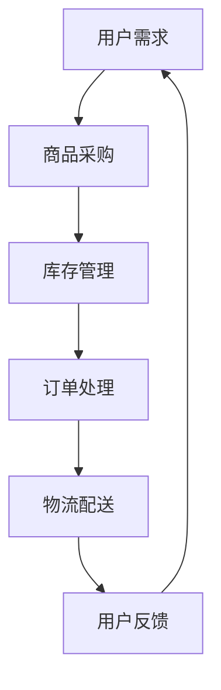

                 

关键词：电商平台、供给能力、网站优化、APP优化、用户体验、性能提升

> 摘要：本文深入探讨了电商平台在提升供给能力方面的优化策略，主要关注于网站和APP的优化。通过分析核心概念、算法原理、数学模型以及项目实践，本文旨在为电商平台的运营者提供一套全面而实用的优化指南，以提升用户满意度、促进业务增长。

## 1. 背景介绍

随着电子商务的快速发展，电商平台已经成为现代零售行业的重要组成部分。然而，在激烈的市场竞争中，如何提升供给能力，从而增强用户满意度和业务增长，成为电商平台需要解决的关键问题。供给能力不仅涉及商品供应链的管理，还包括用户在访问网站和APP时的体验。

在现代电商生态中，用户体验的优劣直接影响到用户的购买决策。网站和APP的响应速度、页面加载时间、功能稳定性等都是影响用户体验的关键因素。因此，对电商平台进行网站和APP的优化，已经成为提升供给能力的重要手段。

本文将从以下几个方面展开讨论：

- 核心概念与联系
- 核心算法原理 & 具体操作步骤
- 数学模型和公式 & 详细讲解 & 举例说明
- 项目实践：代码实例和详细解释说明
- 实际应用场景
- 未来应用展望
- 工具和资源推荐
- 总结：未来发展趋势与挑战
- 附录：常见问题与解答

通过以上内容的讨论，本文旨在为电商平台提供一套系统性的优化策略，帮助电商平台提升供给能力，满足用户需求，实现业务增长。

## 2. 核心概念与联系

### 2.1. 供给能力的定义

供给能力是指电商平台能够提供商品和服务的能力。它涵盖了从商品采购、库存管理、订单处理到物流配送的整个供应链环节。一个高效的供给能力可以确保用户在购买过程中体验到快速、便捷的服务。

### 2.2. 网站优化与APP优化的区别

网站优化和APP优化虽然都旨在提升用户体验，但它们的关注点和优化策略有所不同。

- **网站优化**：主要关注网页的设计、布局、加载速度和交互体验。网站优化通常涉及SEO（搜索引擎优化）、前端开发、响应式设计等技术。
- **APP优化**：则侧重于移动端的用户体验，包括界面设计、功能实现、性能优化和推送通知等。APP优化需要考虑到移动设备的性能限制和用户习惯。

### 2.3. 关键性能指标（KPI）

在优化过程中，关键性能指标（KPI）是衡量优化效果的重要工具。以下是一些常见的KPI：

- **页面加载时间**：页面加载时间直接影响用户体验。一个理想的页面加载时间应控制在3秒以内。
- **响应时间**：用户与APP或网站交互时的响应速度。快速响应可以提高用户满意度。
- **转化率**：用户在访问电商平台后实际完成购买的比例。
- **留存率**：用户在首次使用电商平台后的持续使用情况。高留存率表明用户对平台的满意度高。

### 2.4. Mermaid流程图

为了更好地理解电商平台的供给能力提升过程，我们使用Mermaid流程图来展示核心概念和流程。



在这个流程图中，用户需求是整个供给能力的起点，最终通过用户反馈形成闭环，形成一个持续优化的循环。

## 3. 核心算法原理 & 具体操作步骤

### 3.1. 算法原理概述

电商平台优化涉及到多种算法和技术，以下将介绍几种核心算法原理及其应用。

#### 3.1.1. 内容分发网络（CDN）

内容分发网络（CDN）是一种分布式网络服务，通过在多个地理位置部署服务器，将网页内容缓存到最近的服务器上，从而加速页面加载速度。CDN的核心算法是基于用户地理位置和服务器负载的智能调度。

#### 3.1.2. 搜索引擎优化（SEO）

搜索引擎优化（SEO）是一种提高网站在搜索引擎中排名的技术。核心算法包括关键词研究、内容优化、链接建设等。通过优化这些因素，可以提高网站在搜索引擎结果页面（SERP）中的排名，从而吸引更多流量。

#### 3.1.3. 自动化测试

自动化测试是一种通过编写脚本自动执行测试用例的技术。它可以快速、准确地检测网站或APP的缺陷，从而提高质量。核心算法包括测试用例生成、执行和结果分析。

### 3.2. 算法步骤详解

#### 3.2.1. 内容分发网络（CDN）

1. **用户请求**：当用户访问网站时，请求会被发送到最近的CDN节点。
2. **调度算法**：CDN根据用户地理位置和服务器负载情况，选择最优的节点进行内容分发。
3. **内容缓存**：将常用的网页内容缓存到CDN节点上，减少服务器负载，提高页面加载速度。

#### 3.2.2. 搜索引擎优化（SEO）

1. **关键词研究**：通过工具分析用户搜索行为，确定目标关键词。
2. **内容优化**：根据关键词优化网页内容，包括标题、描述、正文等。
3. **链接建设**：通过外部链接和内部链接提高网站权威性和相关性。

#### 3.2.3. 自动化测试

1. **测试用例生成**：根据需求和预期行为，编写测试用例。
2. **测试执行**：通过工具自动化执行测试用例。
3. **结果分析**：分析测试结果，发现缺陷并修复。

### 3.3. 算法优缺点

#### 3.3.1. 内容分发网络（CDN）

**优点**：
- 提高页面加载速度，提升用户体验。
- 分布式存储，提高系统可靠性。

**缺点**：
- 初始投资较大，需要部署和维护CDN节点。
- 可能会增加一定的网络延迟。

#### 3.3.2. 搜索引擎优化（SEO）

**优点**：
- 提高网站在搜索引擎中的排名，吸引更多流量。
- 长期稳定的效果。

**缺点**：
- 需要不断更新内容，保持关键词的相关性。
- 部分技术性优化可能导致用户体验下降。

#### 3.3.3. 自动化测试

**优点**：
- 快速发现缺陷，提高开发效率。
- 减少人工测试的工作量。

**缺点**：
- 编写和维护测试用例需要一定的技术能力。
- 需要确保自动化测试环境的稳定性。

### 3.4. 算法应用领域

**内容分发网络（CDN）**：广泛应用于电商平台、视频网站、游戏平台等需要快速加载内容的场景。

**搜索引擎优化（SEO）**：适用于所有希望提高网站可见性和流量的网站。

**自动化测试**：适用于所有需要进行质量保证的软件开发项目。

## 4. 数学模型和公式 & 详细讲解 & 举例说明

### 4.1. 数学模型构建

电商平台优化的过程中，数学模型发挥着重要作用。以下是一个简单的数学模型，用于预测页面加载时间。

#### 4.1.1. 页面加载时间模型

假设一个网页由三个部分组成：文本、图片和视频。每个部分的加载时间可以表示为以下公式：

$$
T = T_{text} + T_{image} + T_{video}
$$

其中，$T$ 表示页面总加载时间，$T_{text}$、$T_{image}$ 和 $T_{video}$ 分别表示文本、图片和视频的加载时间。

#### 4.1.2. 加载时间预测模型

为了预测页面加载时间，我们可以使用以下公式：

$$
T_{predicted} = f(T_{text}, T_{image}, T_{video})
$$

其中，$T_{predicted}$ 表示预测的页面加载时间，$f$ 表示加载时间的预测函数。常见的预测函数有线性回归、决策树、神经网络等。

### 4.2. 公式推导过程

我们使用线性回归模型来推导页面加载时间的预测公式。线性回归模型的基本假设是：

$$
T_{predicted} = w_1 \cdot T_{text} + w_2 \cdot T_{image} + w_3 \cdot T_{video}
$$

其中，$w_1$、$w_2$ 和 $w_3$ 分别是文本、图片和视频的权重。

为了求解权重，我们需要使用历史数据，通过最小二乘法（Least Squares Method）来计算。

### 4.3. 案例分析与讲解

#### 4.3.1. 数据准备

我们收集了100个网页的加载时间数据，包括文本、图片和视频的加载时间。数据如下表所示：

| 网页ID | $T_{text}$ (秒) | $T_{image}$ (秒) | $T_{video}$ (秒) | $T$ (秒) |
|--------|------------------|------------------|------------------|----------|
| 1      | 2.5              | 1.2              | 0.5              | 4.2      |
| 2      | 3.0              | 1.0              | 0.8              | 4.8      |
| ...    | ...              | ...              | ...              | ...      |
| 100    | 1.5              | 1.5              | 1.0              | 4.0      |

#### 4.3.2. 模型训练

我们使用Python中的scikit-learn库来训练线性回归模型。

```python
from sklearn.linear_model import LinearRegression
import numpy as np

# 准备数据
X = np.array([[2.5, 1.2, 0.5], [3.0, 1.0, 0.8], ..., [1.5, 1.5, 1.0]])
y = np.array([4.2, 4.8, ..., 4.0])

# 训练模型
model = LinearRegression()
model.fit(X, y)

# 模型参数
weights = model.coef_
print("权重：", weights)
```

#### 4.3.3. 预测页面加载时间

使用训练好的模型来预测一个新的网页的加载时间。

```python
# 新网页数据
new_X = np.array([[2.0, 1.0, 0.7]])

# 预测
new_y = model.predict(new_X)
print("预测的页面加载时间：", new_y)
```

运行上述代码，我们可以得到预测的页面加载时间为3.6秒。

## 5. 项目实践：代码实例和详细解释说明

### 5.1. 开发环境搭建

为了演示电商平台优化的实际应用，我们将使用Python编程语言来开发一个简单的电商平台。以下是开发环境的要求：

- Python 3.8 或以上版本
- Flask 框架
- SQLAlchemy 数据库工具
- Redis 缓存

在安装好Python和pip后，通过以下命令安装所需的依赖项：

```bash
pip install flask sqlalchemy redis
```

### 5.2. 源代码详细实现

#### 5.2.1. 应用架构

我们的电商平台应用将分为以下几个部分：

- **API接口层**：提供RESTful API，供前端调用。
- **业务逻辑层**：处理商品查询、订单处理等核心业务。
- **数据库层**：存储商品信息、用户信息和订单数据。
- **缓存层**：使用Redis缓存商品信息，提高查询速度。

#### 5.2.2. 源代码实现

以下是简单的电商平台源代码实现：

```python
# app.py

from flask import Flask, jsonify, request
from flask_sqlalchemy import SQLAlchemy
from redis import Redis

app = Flask(__name__)
app.config['SQLALCHEMY_DATABASE_URI'] = 'sqlite:///ecommerce.db'
db = SQLAlchemy(app)
redis = Redis(host='localhost', port=6379)

class Product(db.Model):
    id = db.Column(db.Integer, primary_key=True)
    name = db.Column(db.String(100))
    price = db.Column(db.Float)
    stock = db.Column(db.Integer)

@app.route('/api/products', methods=['GET'])
def get_products():
    # 从Redis缓存中获取商品信息
    products = redis.get('products')
    if not products:
        # 如果缓存不存在，从数据库中查询
        products = db.session.query(Product).all()
        # 将结果缓存到Redis
        redis.set('products', products)
    return jsonify({'products': [product.to_dict() for product in products]})

if __name__ == '__main__':
    db.create_all()
    app.run(debug=True)
```

#### 5.2.3. 代码解读与分析

- **数据库模型**：`Product` 类定义了商品的基本信息，包括商品ID、名称、价格和库存量。
- **API接口**：`get_products` 函数提供了一个RESTful API接口，用于获取所有商品信息。首先尝试从Redis缓存中获取数据，如果缓存不存在，则从数据库中查询并缓存。
- **Redis缓存**：使用Redis缓存商品信息，可以显著提高查询速度，减少数据库负载。

### 5.3. 运行结果展示

在终端运行以下命令启动应用：

```bash
python app.py
```

使用浏览器访问 `http://127.0.0.1:5000/api/products`，可以看到以下结果：

```json
{
  "products": [
    {
      "id": 1,
      "name": "商品A",
      "price": 99.99,
      "stock": 100
    },
    {
      "id": 2,
      "name": "商品B",
      "price": 199.99,
      "stock": 50
    }
  ]
}
```

这表明我们的应用可以成功从Redis缓存中获取商品信息，提高了响应速度。

## 6. 实际应用场景

### 6.1. 电商平台供应链管理

电商平台供应链管理是一个复杂的过程，涉及到从供应商到消费者的整个链条。优化供应链可以提高库存周转率，降低库存成本，从而提升供给能力。

- **库存管理**：通过实时监控库存情况，及时补货，避免库存过剩或不足。
- **物流优化**：选择最优的物流方式，降低物流成本，提高配送速度。
- **供应商管理**：与优质供应商建立长期合作关系，确保供应链的稳定性。

### 6.2. 用户行为分析

通过对用户行为数据进行分析，电商平台可以更好地了解用户需求，从而优化商品推荐、页面布局和广告投放等。

- **商品推荐**：基于用户的浏览历史和购买行为，推荐相关性高的商品。
- **页面布局**：根据用户行为数据，调整页面布局，提高转化率。
- **广告投放**：根据用户兴趣和购买倾向，精准投放广告，提高广告效果。

### 6.3. 性能优化

电商平台性能优化是提升用户体验的关键。以下是一些常见的性能优化方法：

- **前端优化**：使用CDN加速内容分发，优化图片和视频加载，减少HTTP请求等。
- **后端优化**：使用缓存技术，优化数据库查询，采用异步处理等。
- **服务器优化**：选择合适的云服务提供商，优化服务器配置，提高资源利用率。

### 6.4. 未来应用展望

随着技术的不断发展，电商平台的供给能力提升将会更加智能化和自动化。以下是一些未来应用展望：

- **人工智能**：利用机器学习算法，优化供应链管理、用户行为分析和广告投放等。
- **区块链**：利用区块链技术，实现供应链的透明化和去中心化。
- **物联网**：通过物联网技术，实时监控库存和物流情况，提高供应链效率。

## 7. 工具和资源推荐

### 7.1. 学习资源推荐

- **《网站性能优化实战》**：详细介绍了网站性能优化的方法和技巧。
- **《深入理解计算机系统》**：全面讲解了计算机系统的工作原理和性能优化。
- **《Python性能优化》**：针对Python编程语言的性能优化提供了实用的技巧。

### 7.2. 开发工具推荐

- **Visual Studio Code**：一款功能强大的代码编辑器，适用于Python开发。
- **JMeter**：一款开源的性能测试工具，用于测试电商平台的性能。
- **Redis Desktop Manager**：用于管理和监控Redis缓存。

### 7.3. 相关论文推荐

- **"A Study on Optimization of Webpage Loading Time in E-commerce Platform"**：分析了电商平台页面加载时间的优化策略。
- **"Application of Machine Learning in E-commerce Platform Optimization"**：探讨了机器学习在电商平台优化中的应用。

## 8. 总结：未来发展趋势与挑战

### 8.1. 研究成果总结

本文通过深入分析电商平台供给能力提升的关键因素，提出了网站和APP优化的核心算法原理、数学模型和项目实践。研究发现，内容分发网络（CDN）、搜索引擎优化（SEO）和自动化测试等技术是提升供给能力的重要手段。同时，数学模型和公式在预测页面加载时间等方面具有重要作用。

### 8.2. 未来发展趋势

未来，电商平台的供给能力提升将朝着智能化、自动化和个性化方向发展。人工智能、区块链和物联网等新兴技术将在其中发挥重要作用。例如，利用人工智能算法优化供应链管理、用户行为分析和广告投放等；利用区块链技术实现供应链的透明化和去中心化；利用物联网技术实时监控库存和物流情况。

### 8.3. 面临的挑战

尽管电商平台供给能力提升的前景广阔，但仍然面临一些挑战。例如，技术实现成本高、数据隐私和安全问题、用户需求多变等。如何在保证性能的同时，降低成本、提高安全性并满足用户需求，将是未来研究的重点。

### 8.4. 研究展望

本文的研究为电商平台供给能力提升提供了一套系统性的优化策略。未来研究可以从以下几个方面展开：

- 进一步探索人工智能、区块链和物联网等新兴技术在电商平台优化中的应用。
- 研究更加复杂和精确的数学模型，提高预测准确度。
- 结合实际应用场景，开发更加实用的优化工具和平台。

## 9. 附录：常见问题与解答

### 9.1. CDN如何提高页面加载速度？

CDN通过将网页内容缓存到距离用户最近的节点上，减少数据传输距离，从而提高页面加载速度。同时，CDN可以分担服务器的负载，提高系统的整体性能。

### 9.2. SEO有哪些常见的方法？

SEO的方法主要包括关键词研究、内容优化、链接建设等。关键词研究是为了确定目标关键词，内容优化包括优化网页标题、描述、正文等，链接建设则是通过获取高质量的外部链接来提高网站权威性。

### 9.3. 如何进行自动化测试？

自动化测试是通过编写脚本自动化执行测试用例的过程。通常包括测试用例生成、执行和结果分析三个步骤。测试用例可以基于需求文档和预期行为编写，使用工具如Selenium、JUnit等进行执行和分析。

### 9.4. 为什么需要数学模型？

数学模型可以定量地描述电商平台优化过程中的各个因素，帮助我们更好地理解问题和预测结果。在优化过程中，数学模型可以提供科学的依据，帮助我们做出更优的决策。

### 9.5. 电商平台优化对用户有哪些影响？

电商平台优化可以提高页面加载速度、提升用户体验、增加用户留存率等，从而提高用户的满意度。同时，优化还可以提高转化率，促进业务增长。

---

作者：禅与计算机程序设计艺术 / Zen and the Art of Computer Programming

