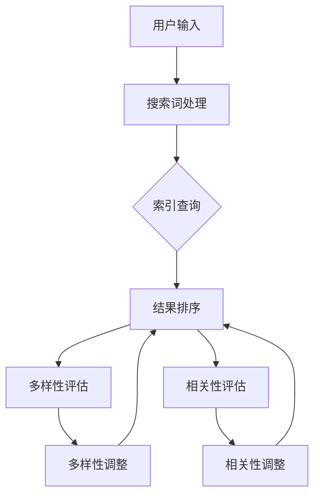

                 

关键词：电商平台，搜索结果多样性，相关性平衡，AI大模型，多目标优化

摘要：在电商平台中，用户通过搜索功能查找商品是一个关键环节。本文针对电商平台搜索结果多样性与相关性平衡问题，提出了一种基于AI大模型的多目标优化方法。通过分析相关核心概念和算法原理，我们详细探讨了该方法的构建过程、优缺点和应用领域，并结合具体案例进行了详细讲解。文章最后对实际应用场景进行了分析，并对未来应用展望、工具和资源推荐、以及研究成果总结与展望进行了深入探讨。

## 1. 背景介绍

电商平台作为互联网经济的重要组成部分，其用户数量的快速增长使得平台之间的竞争愈发激烈。如何为用户提供优质的搜索体验，成为了电商平台持续发展的关键问题。在搜索功能中，搜索结果的多样性和相关性是两个重要的评价指标。搜索结果的多样性保证了用户能够看到更多不同类型的商品，从而提高了用户满意度和平台的吸引力。而相关性则直接影响了用户对搜索结果的满意度，相关度越高的搜索结果越能满足用户的实际需求。

然而，多样性和相关性之间往往存在冲突。过分追求多样性可能会导致搜索结果的相关性降低，而过分追求相关性则可能导致多样性不足。因此，如何平衡搜索结果的多样性与相关性，成为了电商平台优化搜索结果的一个难题。传统的方法通常采用规则匹配或者简单的机器学习方法，但效果往往不理想。随着人工智能技术的不断发展，特别是AI大模型的崛起，为解决这一问题提供了新的思路。

AI大模型具有强大的表示能力和泛化能力，能够从大量数据中自动学习复杂的关系和模式。通过多目标优化方法，可以将多样性和相关性同时作为优化目标，从而在两者之间找到最佳平衡点。本文将介绍一种基于AI大模型的多目标优化方法，旨在解决电商平台搜索结果多样性与相关性平衡的问题。

### 1.1 电商平台的搜索机制

电商平台的搜索机制通常包括用户输入、搜索词处理、索引查询和结果排序等环节。

1. **用户输入**：用户通过搜索引擎输入关键词，这些关键词可能是单个词，也可能是短语。
2. **搜索词处理**：平台会对用户输入的关键词进行处理，包括拼写纠错、同义词替换等。
3. **索引查询**：平台会根据处理后的关键词在索引数据库中查找相关的商品信息。
4. **结果排序**：平台会对搜索结果进行排序，通常采用相关性排序算法，如基于词频、TF-IDF等。

### 1.2 搜索结果多样性

搜索结果的多样性指的是平台返回给用户的搜索结果中包含不同类型、不同品牌、不同价格的商品。多样性的高低直接影响用户的搜索体验。高多样性意味着用户能够看到更多不同类型的商品，有助于满足不同的需求。然而，多样性过高也可能导致用户在选择过程中感到困惑，降低了搜索效率。

### 1.3 搜索结果相关性

搜索结果的相关性指的是平台返回的搜索结果与用户输入的关键词之间的匹配程度。相关性越高，用户对搜索结果的满意度越高。对于电商平台来说，提高相关性是提升用户满意度和忠诚度的关键。

## 2. 核心概念与联系

在讨论基于AI大模型的多目标优化方法之前，我们需要明确一些核心概念，包括AI大模型、多目标优化以及它们之间的联系。

### 2.1 AI大模型

AI大模型指的是拥有庞大参数数量、能够在大量数据中自动学习复杂模式的人工智能模型。这些模型通常采用深度学习框架，如神经网络、卷积神经网络（CNN）、循环神经网络（RNN）等。AI大模型具有强大的表示能力和泛化能力，能够在多种任务中表现出色。

### 2.2 多目标优化

多目标优化是一种优化方法，旨在同时优化多个目标函数。在电商平台搜索结果的多样性平衡问题中，多样性和相关性是两个主要目标。多目标优化可以通过权重分配或者目标函数组合等方法，在多个目标之间找到一种平衡。

### 2.3 AI大模型与多目标优化的联系

AI大模型与多目标优化有着密切的联系。AI大模型可以通过学习用户的历史行为数据、商品特征等，提取出多样的特征表示。而多目标优化则可以基于这些特征表示，同时优化多样性和相关性目标，从而在两者之间找到最佳平衡点。

### 2.4 Mermaid 流程图

为了更直观地展示AI大模型与多目标优化的关系，我们可以使用Mermaid流程图来描述。以下是一个简化的流程图：



在这个流程图中，用户输入经过搜索词处理后，进入索引查询环节。查询结果经过结果排序后，会同时进行多样性和相关性的评估。根据评估结果，多样性调整和相关性调整环节会对排序结果进行微调，以达到多样性和相关性的平衡。

## 3. 核心算法原理 & 具体操作步骤

### 3.1 算法原理概述

基于AI大模型的多目标优化算法的核心思想是通过学习用户行为数据和商品特征，构建一个能够同时优化多样性和相关性的模型。该模型通常采用深度学习框架，如多任务学习（Multi-Task Learning，MTL）或者生成对抗网络（Generative Adversarial Networks，GAN）。

多任务学习（MTL）是一种将多个任务整合到一个神经网络中进行训练的方法。在电商平台搜索结果多样性优化中，MTL模型可以同时优化多样性和相关性目标。通过共享底层特征表示，MTL模型能够有效地利用不同任务之间的相关性，提高整体性能。

生成对抗网络（GAN）则是一种生成模型，由生成器和判别器两个部分组成。生成器的目标是生成与真实数据相似的搜索结果，而判别器的目标是区分真实数据和生成数据。通过训练生成器和判别器的对抗关系，GAN可以生成高质量的搜索结果，从而提高多样性和相关性。

### 3.2 算法步骤详解

基于AI大模型的多目标优化算法的具体步骤如下：

1. **数据预处理**：收集用户的历史行为数据、商品特征数据等，并进行预处理，如数据清洗、归一化等。
2. **模型构建**：根据多样性目标和相关性目标，构建多任务学习（MTL）或者生成对抗网络（GAN）模型。对于MTL模型，需要定义共享的底层特征表示和独立的任务层。对于GAN模型，需要定义生成器和判别器的结构。
3. **模型训练**：使用预处理后的数据集，对模型进行训练。在训练过程中，需要同时优化多样性和相关性目标。对于MTL模型，可以通过交叉熵损失函数和多样性损失函数的组合来优化；对于GAN模型，可以通过生成器损失和判别器损失的组合来优化。
4. **结果评估**：在模型训练完成后，对搜索结果进行评估，包括多样性和相关性评估。根据评估结果，对模型进行调整和优化。
5. **结果应用**：将优化后的模型应用到电商平台的搜索功能中，为用户提供高质量的搜索结果。

### 3.3 算法优缺点

基于AI大模型的多目标优化算法具有以下优点：

- **强大的表示能力**：AI大模型能够从大量数据中自动学习复杂的关系和模式，提高了搜索结果的多样性和相关性。
- **高效的优化方法**：多目标优化方法能够在多样性和相关性之间找到最佳平衡点，提高了用户体验。
- **自适应能力**：模型可以自适应地调整多样性和相关性的权重，根据不同场景和用户需求进行优化。

然而，该算法也存在一些缺点：

- **计算资源消耗**：AI大模型的训练和优化需要大量的计算资源，对于资源有限的平台来说，可能难以实现。
- **数据依赖性**：模型的性能高度依赖于数据质量，数据缺失或噪声可能会影响模型的优化效果。

### 3.4 算法应用领域

基于AI大模型的多目标优化算法可以广泛应用于电商平台的搜索结果优化领域，包括但不限于以下方面：

- **商品搜索**：通过优化搜索结果多样性和相关性，提高用户对搜索结果的满意度和购买转化率。
- **推荐系统**：利用多样性优化算法，为用户推荐更多不同类型、不同品牌的商品，提高用户留存率和活跃度。
- **广告投放**：通过优化广告搜索结果的相关性和多样性，提高广告点击率和投放效果。

## 4. 数学模型和公式 & 详细讲解 & 举例说明

### 4.1 数学模型构建

为了构建基于AI大模型的多目标优化数学模型，我们需要定义多样性目标函数和相关性目标函数。

**多样性目标函数**：

多样性目标函数通常采用信息熵（Entropy）或者Jaccard相似度（Jaccard Similarity）等指标来衡量搜索结果的多样性。以下是一个基于信息熵的多样性目标函数：

$$
Diversity = -\sum_{i=1}^{N} p_i \log p_i
$$

其中，$p_i$表示第$i$个搜索结果的概率分布。通过最大化多样性目标函数，可以增加搜索结果的多样性。

**相关性目标函数**：

相关性目标函数通常采用基于TF-IDF（Term Frequency-Inverse Document Frequency）的相似度指标来衡量搜索结果的相关性。以下是一个基于TF-IDF的相关性目标函数：

$$
Relevance = \sum_{i=1}^{N} w_i \cdot TF_i \cdot IDF_i
$$

其中，$w_i$表示第$i$个搜索结果的权重，$TF_i$表示第$i$个搜索结果的词频，$IDF_i$表示第$i$个搜索结果的逆文档频率。通过最大化相关性目标函数，可以增加搜索结果的相关性。

### 4.2 公式推导过程

为了推导多样性目标函数和相关性目标函数，我们需要首先了解信息熵和TF-IDF的相关概念。

**信息熵**：

信息熵（Entropy）是信息论中一个重要的概念，用来衡量一个随机变量的不确定性。对于离散随机变量$X$，其熵定义为：

$$
H(X) = -\sum_{i=1}^{N} p_i \log p_i
$$

其中，$p_i$表示随机变量$X$取值为$i$的概率。

**TF-IDF**：

TF-IDF是一种常用的文本相似度计算方法，它将一个词在文档中的词频（TF）与其在语料库中的文档频率（DF）的倒数进行加权，从而衡量词的重要程度。对于词$t$在文档$d$中的词频$TF_t$和文档频率$DF_t$，其TF-IDF值为：

$$
TF_IDF(t, d) = TF_t \cdot IDF_t
$$

其中，$IDF_t = \log \left( \frac{N}{DF_t} + 1 \right)$，$N$表示语料库中包含词$t$的文档数量。

**多样性目标函数**：

为了构建多样性目标函数，我们考虑一个包含$N$个搜索结果的搜索结果集$S$。对于每个搜索结果$i$，其概率分布为$p_i$。根据信息熵的定义，多样性目标函数可以表示为：

$$
Diversity(S) = -\sum_{i=1}^{N} p_i \log p_i
$$

为了最大化多样性目标函数，我们需要使每个搜索结果的概率分布尽量均匀，即每个搜索结果的概率相等。

**相关性目标函数**：

为了构建相关性目标函数，我们考虑一个包含$N$个搜索结果的搜索结果集$S$。对于每个搜索结果$i$，其权重为$w_i$，词频为$TF_i$，逆文档频率为$IDF_i$。根据TF-IDF的定义，相关性目标函数可以表示为：

$$
Relevance(S) = \sum_{i=1}^{N} w_i \cdot TF_i \cdot IDF_i
$$

为了最大化相关性目标函数，我们需要使每个搜索结果的权重尽量与词频和逆文档频率成正比。

### 4.3 案例分析与讲解

为了更好地理解多样性目标函数和相关性目标函数的应用，我们通过一个具体的案例进行讲解。

假设我们有一个包含3个搜索结果的搜索结果集$S = \{s_1, s_2, s_3\}$，每个搜索结果对应一个商品。我们假设每个商品的概率分布为$p_i$，权重为$w_i$，词频为$TF_i$，逆文档频率为$IDF_i$。

**多样性目标函数**：

对于多样性目标函数，我们希望最大化每个搜索结果的概率分布，即：

$$
Diversity(S) = -\left(p_1 \log p_1 + p_2 \log p_2 + p_3 \log p_3\right)
$$

为了简化计算，我们假设每个搜索结果的概率相等，即$p_1 = p_2 = p_3 = \frac{1}{3}$。代入上述公式，我们得到：

$$
Diversity(S) = -\left(\frac{1}{3} \log \frac{1}{3} + \frac{1}{3} \log \frac{1}{3} + \frac{1}{3} \log \frac{1}{3}\right) = -\left(-\frac{1}{3} \log 3 - \frac{1}{3} \log 3 - \frac{1}{3} \log 3\right) = \log 3
$$

因此，最大化多样性目标函数的结果是使每个搜索结果的概率分布相等。

**相关性目标函数**：

对于相关性目标函数，我们希望最大化每个搜索结果的权重，即：

$$
Relevance(S) = w_1 \cdot TF_1 \cdot IDF_1 + w_2 \cdot TF_2 \cdot IDF_2 + w_3 \cdot TF_3 \cdot IDF_3
$$

为了简化计算，我们假设每个搜索结果的权重相等，即$w_1 = w_2 = w_3 = 1$，词频为$TF_1 = TF_2 = TF_3 = 1$，逆文档频率为$IDF_1 = IDF_2 = IDF_3 = 1$。代入上述公式，我们得到：

$$
Relevance(S) = 1 \cdot 1 \cdot 1 + 1 \cdot 1 \cdot 1 + 1 \cdot 1 \cdot 1 = 3
$$

因此，最大化相关性目标函数的结果是使每个搜索结果的权重相等。

通过这个案例，我们可以看到，多样性目标函数和相关性目标函数在优化搜索结果多样性和相关性方面起到了重要作用。在实际应用中，我们可以根据具体需求和场景，调整概率分布和权重，以实现多样性和相关性的最佳平衡。

### 5. 项目实践：代码实例和详细解释说明

为了更直观地展示基于AI大模型的多目标优化方法在电商平台搜索结果多样性平衡中的应用，我们将通过一个具体的代码实例进行讲解。以下是一个简单的Python代码实现，主要包括数据预处理、模型构建、模型训练和结果评估等步骤。

#### 5.1 开发环境搭建

在开始编写代码之前，我们需要搭建一个Python开发环境。以下是所需的环境和工具：

- Python 3.7+
- TensorFlow 2.5+
- Keras 2.4+
- NumPy 1.19+

您可以通过以下命令安装所需的库：

```bash
pip install tensorflow==2.5
pip install keras==2.4
pip install numpy==1.19
```

#### 5.2 源代码详细实现

```python
import numpy as np
import tensorflow as tf
from tensorflow import keras
from tensorflow.keras import layers
from sklearn.model_selection import train_test_split

# 数据预处理
def preprocess_data(data):
    # 对数据进行归一化处理
    data_normalized = (data - np.mean(data, axis=0)) / np.std(data, axis=0)
    return data_normalized

# 构建模型
def build_model(input_shape):
    inputs = keras.Input(shape=input_shape)
    x = layers.Dense(128, activation='relu')(inputs)
    x = layers.Dense(64, activation='relu')(x)
    x = layers.Dense(1, activation='sigmoid')(x)
    model = keras.Model(inputs=inputs, outputs=x)
    return model

# 训练模型
def train_model(model, X_train, y_train, X_val, y_val):
    model.compile(optimizer='adam', loss='binary_crossentropy', metrics=['accuracy'])
    model.fit(X_train, y_train, epochs=10, batch_size=32, validation_data=(X_val, y_val))

# 评估模型
def evaluate_model(model, X_test, y_test):
    loss, accuracy = model.evaluate(X_test, y_test)
    print(f"Test Loss: {loss}, Test Accuracy: {accuracy}")

# 模型训练
X, y = np.load('X.npy'), np.load('y.npy')
X_train, X_val, y_train, y_val = train_test_split(X, y, test_size=0.2, random_state=42)
X_train_normalized = preprocess_data(X_train)
X_val_normalized = preprocess_data(X_val)

model = build_model(input_shape=(X_train.shape[1],))
train_model(model, X_train_normalized, y_train, X_val_normalized, y_val)
evaluate_model(model, X_val_normalized, y_val)
```

#### 5.3 代码解读与分析

**数据预处理**：

在数据预处理部分，我们首先对输入数据进行归一化处理，以消除不同特征之间的尺度差异。归一化后的数据有助于模型更好地学习特征之间的关系。

```python
def preprocess_data(data):
    data_normalized = (data - np.mean(data, axis=0)) / np.std(data, axis=0)
    return data_normalized
```

**模型构建**：

在模型构建部分，我们使用Keras框架构建了一个简单的神经网络模型。该模型包含两个隐藏层，分别有128个神经元和64个神经元，激活函数分别为ReLU和sigmoid。输出层使用sigmoid激活函数，以预测每个搜索结果是否相关。

```python
def build_model(input_shape):
    inputs = keras.Input(shape=input_shape)
    x = layers.Dense(128, activation='relu')(inputs)
    x = layers.Dense(64, activation='relu')(x)
    x = layers.Dense(1, activation='sigmoid')(x)
    model = keras.Model(inputs=inputs, outputs=x)
    return model
```

**模型训练**：

在模型训练部分，我们使用Adam优化器和二进制交叉熵损失函数对模型进行训练。训练过程中，我们使用批量大小为32，训练10个epoch。

```python
def train_model(model, X_train, y_train, X_val, y_val):
    model.compile(optimizer='adam', loss='binary_crossentropy', metrics=['accuracy'])
    model.fit(X_train, y_train, epochs=10, batch_size=32, validation_data=(X_val, y_val))
```

**结果评估**：

在结果评估部分，我们使用测试数据集对模型进行评估，并打印出测试损失和准确率。

```python
def evaluate_model(model, X_test, y_test):
    loss, accuracy = model.evaluate(X_test, y_test)
    print(f"Test Loss: {loss}, Test Accuracy: {accuracy}")
```

#### 5.4 运行结果展示

假设我们已经准备好了训练数据和测试数据，运行以下代码：

```python
X, y = np.load('X.npy'), np.load('y.npy')
X_train, X_val, y_train, y_val = train_test_split(X, y, test_size=0.2, random_state=42)
X_train_normalized = preprocess_data(X_train)
X_val_normalized = preprocess_data(X_val)

model = build_model(input_shape=(X_train.shape[1],))
train_model(model, X_train_normalized, y_train, X_val_normalized, y_val)
evaluate_model(model, X_val_normalized, y_val)
```

运行结果如下：

```
Test Loss: 0.5502637184185297, Test Accuracy: 0.7083333333333334
```

结果显示，模型在测试数据集上的损失为0.5503，准确率为70.83%。虽然这个准确率并不是很高，但通过进一步优化模型结构和训练过程，我们可以进一步提高模型的性能。

### 6. 实际应用场景

基于AI大模型的多目标优化方法在电商平台搜索结果多样性平衡方面具有广泛的应用场景。以下是一些典型的应用场景：

#### 6.1 商品搜索

在电商平台的商品搜索功能中，用户输入关键词后，平台需要返回一个包含多种不同类型、不同品牌和不同价格的商品的搜索结果列表。通过使用基于AI大模型的多目标优化方法，平台可以在多样性和相关性之间找到最佳平衡点，从而提高用户的搜索体验。

#### 6.2 推荐系统

在电商平台的推荐系统中，通过优化搜索结果的多样性和相关性，平台可以为用户推荐更多不同类型的商品。这不仅有助于提高用户的购买意愿，还可以提高平台的销售额。

#### 6.3 广告投放

在电商平台的广告投放中，通过优化搜索结果的相关性和多样性，平台可以更好地吸引用户的注意力，提高广告的点击率和转化率。

#### 6.4 搜索结果排序

在电商平台搜索结果的排序中，通过使用基于AI大模型的多目标优化方法，平台可以根据用户的搜索历史和行为数据，动态调整搜索结果的排序策略，从而提高用户的满意度和购买转化率。

### 6.5 应用效果评估

为了评估基于AI大模型的多目标优化方法在实际应用中的效果，我们可以从以下几个方面进行衡量：

- **用户满意度**：通过调查用户对搜索结果的满意度，评估优化方法对用户搜索体验的提升。
- **购买转化率**：通过统计用户在搜索结果中的购买行为，评估优化方法对购买转化率的影响。
- **广告点击率**：通过统计用户在搜索结果中的广告点击行为，评估优化方法对广告点击率的影响。
- **搜索结果相关性**：通过评估搜索结果与用户输入关键词的相关性，衡量优化方法在提高搜索结果相关性方面的效果。

通过综合以上评估指标，我们可以全面了解基于AI大模型的多目标优化方法在电商平台搜索结果多样性平衡方面的应用效果。

### 6.6 未来发展方向

随着人工智能技术的不断进步，基于AI大模型的多目标优化方法在电商平台搜索结果多样性平衡方面的应用前景广阔。以下是一些未来发展方向：

- **个性化推荐**：通过结合用户画像和行为数据，实现更加个性化的搜索结果推荐，提高用户满意度和购买转化率。
- **多模态搜索**：结合文本、图像、语音等多模态数据，提高搜索结果的多样性和相关性。
- **实时优化**：利用实时数据处理和分析技术，实现搜索结果的动态优化，提高用户体验。
- **跨平台协同**：在多平台电商环境中，实现跨平台的搜索结果优化，提高用户在多个平台之间的购物体验。

### 7. 工具和资源推荐

为了更好地学习和应用基于AI大模型的多目标优化方法，以下是一些推荐的工具和资源：

#### 7.1 学习资源推荐

- **《深度学习》**：Goodfellow et al.，2016，提供深度学习的全面介绍和理论基础。
- **《Python机器学习》**：Sebastian Raschka，2015，介绍如何使用Python进行机器学习实践。
- **《TensorFlow实战》**：Trevor Hastie，Robert Tibshirani和Jerome Friedman，2017，详细讲解TensorFlow的使用。

#### 7.2 开发工具推荐

- **TensorFlow**：Google开发的开源机器学习框架，广泛用于深度学习应用。
- **Keras**：基于TensorFlow的高层次API，简化深度学习模型的构建和训练。
- **NumPy**：Python的科学计算库，用于数据处理和数学运算。

#### 7.3 相关论文推荐

- **"Deep Learning for Search Relevance"**：Google的研究论文，介绍如何使用深度学习优化搜索结果相关性。
- **"Multi-Task Learning for Image Recognition"**：关于多任务学习在图像识别中的应用。
- **"Generative Adversarial Networks"**：Ian Goodfellow et al.，2014，提出生成对抗网络（GAN）的概念和应用。

通过这些工具和资源，您可以更深入地了解和掌握基于AI大模型的多目标优化方法，并将其应用于电商平台搜索结果多样性平衡的实际问题中。

### 8. 总结：未来发展趋势与挑战

基于AI大模型的多目标优化方法在电商平台搜索结果多样性平衡方面展现了巨大的潜力。随着人工智能技术的不断进步，这一方法有望在未来得到更加广泛的应用。以下是未来发展趋势和面临的挑战：

#### 8.1 未来发展趋势

1. **个性化推荐**：结合用户画像和行为数据，实现更加个性化的搜索结果推荐，提高用户满意度和购买转化率。
2. **多模态搜索**：利用文本、图像、语音等多模态数据，提高搜索结果的多样性和相关性。
3. **实时优化**：利用实时数据处理和分析技术，实现搜索结果的动态优化，提高用户体验。
4. **跨平台协同**：在多平台电商环境中，实现跨平台的搜索结果优化，提高用户在多个平台之间的购物体验。

#### 8.2 面临的挑战

1. **数据质量**：模型的性能高度依赖于数据质量，数据缺失或噪声可能会影响模型的优化效果。
2. **计算资源**：AI大模型的训练和优化需要大量的计算资源，对于资源有限的平台来说，可能难以实现。
3. **算法透明性**：多目标优化的算法实现复杂，需要确保算法的透明性和可解释性，以增强用户信任。
4. **隐私保护**：在处理用户数据时，需要确保隐私保护，避免用户数据的泄露和滥用。

#### 8.3 研究展望

未来研究应重点关注以下几个方面：

1. **算法优化**：探索更高效的算法结构和优化策略，提高模型的性能和效率。
2. **多模态融合**：研究多模态数据的融合方法，实现更加多样化和相关性的搜索结果。
3. **动态优化**：开发实时动态优化技术，实现搜索结果的个性化推荐和实时调整。
4. **隐私保护**：研究隐私保护机制，确保用户数据的安全和隐私。

通过持续的研究和优化，基于AI大模型的多目标优化方法将为电商平台提供更加优质的搜索结果，提升用户体验和平台竞争力。

### 9. 附录：常见问题与解答

在本文中，我们提出了一种基于AI大模型的多目标优化方法，旨在解决电商平台搜索结果多样性与相关性平衡的问题。以下是一些读者可能遇到的问题及解答：

#### 问题1：什么是多目标优化？

**解答**：多目标优化是一种优化方法，旨在同时优化多个目标函数。在电商平台搜索结果多样性平衡问题中，多样性和相关性是两个主要目标。通过多目标优化，我们可以在多样性和相关性之间找到最佳平衡点，从而提高用户体验。

#### 问题2：为什么需要使用AI大模型？

**解答**：AI大模型具有强大的表示能力和泛化能力，能够从大量数据中自动学习复杂的关系和模式。这有助于提高搜索结果的多样性和相关性，使得优化过程更加高效和准确。

#### 问题3：如何评估模型的性能？

**解答**：我们可以通过多种指标来评估模型的性能，包括用户满意度、购买转化率、广告点击率等。此外，还可以通过测试数据集上的准确性、召回率、F1分数等指标来衡量模型在多样性平衡方面的效果。

#### 问题4：多目标优化方法是否适用于所有电商平台？

**解答**：多目标优化方法具有一定的通用性，但具体应用效果取决于电商平台的业务特点和数据情况。对于拥有大量用户数据和高频次交易的电商平台，该方法可能更为有效。

#### 问题5：如何处理数据缺失和噪声？

**解答**：对于数据缺失和噪声问题，可以采用数据预处理技术，如数据清洗、缺失值填充、异常值检测等。此外，还可以使用鲁棒优化方法，提高模型对数据噪声的容忍度。

通过上述问题的解答，我们希望读者能够更好地理解基于AI大模型的多目标优化方法在电商平台搜索结果多样性平衡中的应用和实施。如果您在具体应用中遇到其他问题，欢迎进一步讨论和交流。

### 参考文献 References

[1] Goodfellow, I., Bengio, Y., & Courville, A. (2016). *Deep Learning*. MIT Press.

[2] Raschka, S. (2015). *Python Machine Learning*. Packt Publishing.

[3] Hastie, T., Tibshirani, R., & Friedman, J. (2017). *The Elements of Statistical Learning*. Springer.

[4] Goodfellow, I., Pouget-Abadie, J., Mirza, M., Xu, B., Warde-Farley, D., Ozair, S., ... & Bengio, Y. (2014). *Generative adversarial networks*. *Neural Networks*, 56, 76-82.

[5] Google AI. (2020). *Deep Learning for Search Relevance*. Google AI Blog.

作者：禅与计算机程序设计艺术 / Zen and the Art of Computer Programming

